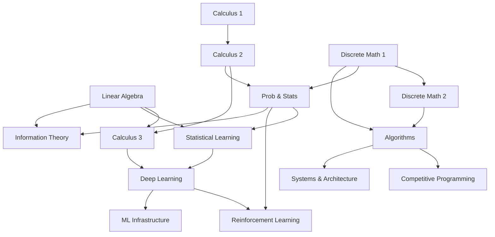

# Superpowers

A free, self-paced curriculum from undergraduate foundations through PhD-level depth and Staff/Principal engineer expertise. Every primary resource is open-access.

## Tracks

### Mathematics Foundations

| # | Topic | Textbook | Time |
|---|-------|----------|------|
| 01 | [Calculus 1](math/01-calculus-1/) | OpenStax Calculus Vol 1 | 4 weeks |
| 02 | [Calculus 2](math/02-calculus-2/) | OpenStax Calculus Vol 2 | 4 weeks |
| 03 | [Linear Algebra](math/03-linear-algebra/) | Hefferon's *Linear Algebra* | 4 weeks |
| 04 | [Calculus 3](math/04-calculus-3/) | OpenStax Calculus Vol 3 | 4 weeks |
| 05 | [Discrete Math 1](math/05-discrete-math-1/) | Hammack's *Book of Proof* | 4 weeks |
| 06 | [Discrete Math 2](math/06-discrete-math-2/) | Levin's *Discrete Mathematics* | 4 weeks |
| 07 | [Probability & Statistics](math/07-probability-statistics/) | Grinstead & Snell + OpenStax Stats | 3-4 weeks |

### Algorithm Mastery

| # | Topic | Lang | README |
|---|-------|------|--------|
| 01 | [Arrays & Hashing](algorithms/01-arrays-hashing/) | JS | [Patterns](algorithms/01-arrays-hashing/README.md) |
| 02 | [Two Pointers & Sliding Window](algorithms/02-two-pointers-sliding-window/) | JS | [Patterns](algorithms/02-two-pointers-sliding-window/README.md) |
| 03 | [Binary Search](algorithms/03-binary-search/) | JS | [Patterns](algorithms/03-binary-search/README.md) |
| 04 | [Linked Lists](algorithms/04-linked-lists/) | JS | [Patterns](algorithms/04-linked-lists/README.md) |
| 05 | [Trees](algorithms/05-trees/) | Python | [Patterns](algorithms/05-trees/README.md) |
| 06 | [Graphs](algorithms/06-graphs/) | JS/TS/C | [Patterns](algorithms/06-graphs/README.md) |
| 07 | [Dynamic Programming](algorithms/07-dynamic-programming/) | JS/Python/C | [Patterns](algorithms/07-dynamic-programming/README.md) |
| 08 | [Greedy](algorithms/08-greedy/) | JS/Python/Java | [Patterns](algorithms/08-greedy/README.md) |
| 09 | [Backtracking](algorithms/09-backtracking/) | JS/Python | [Patterns](algorithms/09-backtracking/README.md) |
| 10 | [Math & Bit Manipulation](algorithms/10-math-bit/) | JS | [Patterns](algorithms/10-math-bit/README.md) |
| 11 | [Recursion & Divide-and-Conquer](algorithms/11-recursion-divide-conquer/) | Python | [Patterns](algorithms/11-recursion-divide-conquer/README.md) |
| 12 | [Concurrency & Systems](algorithms/12-concurrency-systems/) | C/Python | [Patterns](algorithms/12-concurrency-systems/README.md) |
| 13 | [Functional Programming](algorithms/13-functional-programming/) | Scheme | [Patterns](algorithms/13-functional-programming/README.md) |
| 14 | [ML & Statistics](algorithms/14-ml-statistics/) | Python/R | [Patterns](algorithms/14-ml-statistics/README.md) |
| 15 | [Probabilistic Structures](algorithms/15-probabilistic-structures/) | Python | [Patterns](algorithms/15-probabilistic-structures/README.md) |

Core references: CLRS (4th ed.), [Competitive Programmer's Handbook](https://cses.fi/book/book.pdf) (free). See [algorithms/README.md](algorithms/README.md) for full details.

### Machine Learning & AI

| # | Topic | Textbook | Time |
|---|-------|----------|------|
| 01 | [Statistical Learning](ml/01-statistical-learning/) | ISLR (free) + ESL (free) | 4-5 weeks |
| 02 | [Deep Learning](ml/02-deep-learning/) | Goodfellow et al. -- [deeplearningbook.org](https://www.deeplearningbook.org/) (free) | 6-8 weeks |
| 03 | [Reinforcement Learning](ml/03-reinforcement-learning/) | Sutton & Barto (free) + [Spinning Up](https://spinningup.openai.com/en/latest/) | 4-6 weeks |

### Systems & Architecture

| # | Topic | Reference | Time |
|---|-------|-----------|------|
| 01 | [System Design](systems/01-system-design/) | ByteByteGo + System Design Primer (free) | 4-5 weeks |
| 02 | [Software Architecture](systems/02-software-architecture/) | *Software Architecture Patterns* (O'Reilly) | 2-3 weeks |
| 03 | [Cloud Native](systems/03-cloud-native/) | *Cloud Native DevOps with K8s* + K8s docs (free) | 3-4 weeks |
| 04 | [Observability](systems/04-observability/) | *Observability Engineering* + Google SRE Book (free) | 2-3 weeks |

### Specialized Tracks

| Track | Reference | Time |
|-------|-----------|------|
| [Competitive Programming](competitive-programming/) | [CP Handbook](https://cses.fi/book/book.pdf) (free) + CSES Problem Set | 6-8 weeks |
| [Information Theory](information-theory/) | *Student's Guide to Coding & Info Theory* + MacKay (free) | 3-4 weeks |

## Prerequisite Graph

## Study Plans

See [STUDY-PLAN.md](STUDY-PLAN.md) for structured schedules:

- **Math Foundations** -- 16 weeks, all 7 math topics
- **Algorithm Mastery** -- 21 days, all 15 algorithm topics
- **ML & AI** -- 14-19 weeks, statistical learning through RL
- **Systems & Architecture** -- 11-15 weeks, system design through observability
- **Combined Path** -- 40+ weeks, zero to Staff+ interview-ready
- **PhD Research Track** -- deep learning research + information theory + RL

## Interviews

Company-specific guides for 19 companies. See [`interviews/README.md`](interviews/README.md).

- **Big Tech & AI Labs**: [Anthropic](interviews/anthropic/), [Google](interviews/google/), [DeepMind](interviews/deepmind/), [OpenAI](interviews/openai/), [Meta](interviews/meta/), [Apple](interviews/apple/), [NVIDIA](interviews/nvidia/), [Moonshot](interviews/moonshot/)
- **Infrastructure & Data**: [Netflix](interviews/netflix/), [Amazon](interviews/amazon/), [Databricks](interviews/databricks/), [Stripe](interviews/stripe/), [Palantir](interviews/palantir/)
- **Quant & Trading**: [Jane Street](interviews/jane-street/), [Citadel](interviews/citadel/), [Two Sigma](interviews/two-sigma/), [HRT](interviews/hrt/), [Renaissance](interviews/renaissance-technologies/)
- **Frontier**: [SpaceX](interviews/spacex/)

## Practice

- [K-Means Clustering](practice/k_means.py) -- from-scratch implementation
- [TF-IDF Vector Search](practice/tf_idf_vector_search.py) -- text similarity search

## Books Referenced

Technical books integrated into this curriculum. Owned books are in `~/Documents/books/`.

| Book | Track | Location |
|------|-------|----------|
| *Introduction to Algorithms* (CLRS) 4th ed. | Algorithms | [`~/Documents/books/The.MIT.Press.Introduction.to.Algorithms.4th.edition.026204630X.pdf`](~/Documents/books/The.MIT.Press.Introduction.to.Algorithms.4th.edition.026204630X.pdf) |
| *Competitive Programmer's Handbook* | Competitive Programming | [`~/Documents/books/Competitive Programmer's. Handbook.pdf`](~/Documents/books/Competitive%20Programmer's.%20Handbook.pdf) + [Free online](https://cses.fi/book/book.pdf) |
| *Introduction to Statistical Learning* (ISLR) | ML/AI | [`~/Documents/books/Introduction to Statistical Learning.pdf`](~/Documents/books/Introduction%20to%20Statistical%20Learning.pdf) + [Free online](https://www.statlearning.com/) |
| *Deep Learning* (Goodfellow et al.) | ML/AI | [Free online](https://www.deeplearningbook.org/) |
| *RL: An Introduction* (Sutton & Barto) | ML/AI | [Free online](http://incompleteideas.net/book/the-book-2nd.html) |
| *Software Architecture Patterns* | Systems | [`~/Documents/books/Software-Architecture-Patterns.pdf`](~/Documents/books/Software-Architecture-Patterns.pdf) |
| *Cloud Native DevOps with K8s* 2nd ed. | Systems | [`~/Documents/books/cloud-native-devops-k8s-2e[29826].pdf`](~/Documents/books/cloud-native-devops-k8s-2e%5B29826%5D.pdf) |
| *Observability Engineering* | Systems | [`~/Documents/books/Honeycomb-OReilly-Book-on-Observability-Engineering.pdf`](~/Documents/books/Honeycomb-OReilly-Book-on-Observability-Engineering.pdf) |
| *ByteByteGo System Design* | Systems | [`~/Documents/books/bytebytego-system-design.pdf.pdf`](~/Documents/books/bytebytego-system-design.pdf.pdf) |
| *Student's Guide to Coding & Information Theory* | Information Theory | [`~/Documents/books/A Student_s Guide to Coding and Information Theory ( PDFDrive ).pdf`](~/Documents/books/A%20Student_s%20Guide%20to%20Coding%20and%20Information%20Theory%20%28%20PDFDrive%20%29.pdf) |
| *Codeless Data Structures and Algorithms* | Algorithms | [`~/Documents/books/Codeless Data Structures and Algorithms.pdf`](~/Documents/books/Codeless%20Data%20Structures%20and%20Algorithms.pdf) |
| *Neo4j Graph Algorithms* | Algorithms (Graphs) | [`~/Documents/books/Neo4j_Graph_Algorithms.pdf`](~/Documents/books/Neo4j_Graph_Algorithms.pdf) |
| *Probability & Statistics for Engineering* (Devore) | Math | [`~/Documents/books/101_03_Devore_Probability-and-Statistics-for-Engineering-and-the-Sciences-2016.pdf`](~/Documents/books/101_03_Devore_Probability-and-Statistics-for-Engineering-and-the-Sciences-2016.pdf) |
| *Linear Algebra* (local copy) | Math | [`~/Documents/books/LinearAlgebra.pdf`](~/Documents/books/LinearAlgebra.pdf) |
| *OpenStax Calculus Vol 3* (local copy) | Math | [`~/Documents/books/CalculusVolume3-OP_mktoy8b.pdf`](~/Documents/books/CalculusVolume3-OP_mktoy8b.pdf) |
| OpenStax Calculus Volumes 1-3 | Math | [Free online](https://openstax.org/) |
| *Book of Proof* (Hammack) | Math | [Free online](https://people.vcu.edu/~rhammack/BookOfProof/) |
| *Discrete Mathematics* (Levin) | Math | [Free online](https://discrete.openmathbooks.org/) |
| *Linear Algebra* (Hefferon) | Math | [Free online](https://hefferon.net/linearalgebra/) |
| *Intro to Probability* (Grinstead & Snell) | Math | [Free online](https://math.dartmouth.edu/~prob/prob/prob.pdf) |
| *Info Theory, Inference, & Learning* (MacKay) | Information Theory | [Free online](http://www.inference.org.uk/mackay/itila/) |
| OpenAI Spinning Up in Deep RL | ML/AI (RL) | [Free online](https://spinningup.openai.com/en/latest/) |

## License

[ISC](LICENSE)
