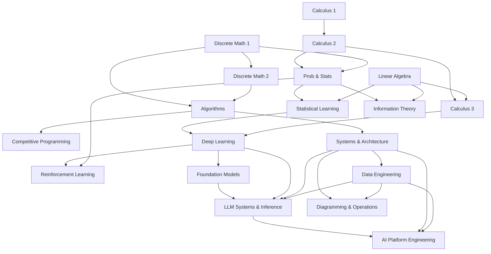

<p align="center">
  <h1 align="center">Supersource</h1>
  <p align="center">
    Free, self-paced curriculum from undergraduate foundations through PhD-level depth and Staff/Principal engineer expertise. Every primary resource is open-access.
    <br /><br />
    <a href="STUDY-PLAN.md">Study Plans</a>
    &middot;
    <a href="https://github.com/urmzd/supersource/issues">Report Bug</a>
    &middot;
    <a href="#prerequisite-graph">Prerequisites</a>
  </p>
</p>

<p align="center">
  <a href="https://github.com/urmzd/supersource/actions/workflows/ci.yml"></a>
  &nbsp;
  <a href="LICENSE"></a>
</p>

## Contents

- [Features](#features)
- [Tracks](#tracks)
- [Prerequisite Graph](#prerequisite-graph)
- [Study Plans](#study-plans)
- [Read Offline (Single PDF)](#read-offline-single-pdf)
- [Interviews](#interviews)
- [Polyglot Practice](#polyglot-practice)
- [Books and Resources](#books-and-resources)
- [Agent Skill](#agent-skill)
- [License](#license)

## Features

- **Free-first** every primary textbook links to an open-access source
- **Graded depth** undergraduate foundations through PhD-level research topics
- **Multi-track** math, algorithms, ML, systems, info theory, competitive programming
- **Interview-ready** 19 company-specific guides across Big Tech, quant, and frontier
- **Polyglot practice** 10 graded exercises each across 9 languages
- **Prerequisite graph** mermaid diagram showing topic dependencies
- **Single-PDF book** the entire curriculum renders into one PDF in CI (build artifact + release asset)

## Tracks

### Mathematics Foundations

| # | Topic | Textbook | Time |
|---|-------|----------|------|
| 01 | [Calculus 1](math/01-calculus-1/) | OpenStax Calculus Vol 1 | 4 weeks |
| 02 | [Calculus 2](math/02-calculus-2/) | OpenStax Calculus Vol 2 | 4 weeks |
| 03 | [Linear Algebra](math/03-linear-algebra/) | Hefferon's *Linear Algebra* | 4 weeks |
| 04 | [Calculus 3](math/04-calculus-3/) | OpenStax Calculus Vol 3 | 4 weeks |
| 05 | [Discrete Math 1](math/05-discrete-math-1/) | Hammack's *Book of Proof* | 4 weeks |
| 06 | [Discrete Math 2](math/06-discrete-math-2/) | Levin's *Discrete Mathematics* | 4 weeks |
| 07 | [Probability & Statistics](math/07-probability-statistics/) | Grinstead & Snell + OpenStax Stats | 3-4 weeks |

### Algorithm Mastery

| # | Topic | Lang | README |
|---|-------|------|--------|
| 01 | [Arrays & Hashing](algorithms/01-arrays-hashing/) | JS | [Patterns](algorithms/01-arrays-hashing/README.md) |
| 02 | [Two Pointers & Sliding Window](algorithms/02-two-pointers-sliding-window/) | JS | [Patterns](algorithms/02-two-pointers-sliding-window/README.md) |
| 03 | [Binary Search](algorithms/03-binary-search/) | JS | [Patterns](algorithms/03-binary-search/README.md) |
| 04 | [Linked Lists](algorithms/04-linked-lists/) | JS | [Patterns](algorithms/04-linked-lists/README.md) |
| 05 | [Trees](algorithms/05-trees/) | Python | [Patterns](algorithms/05-trees/README.md) |
| 06 | [Graphs](algorithms/06-graphs/) | JS/TS/C | [Patterns](algorithms/06-graphs/README.md) |
| 07 | [Dynamic Programming](algorithms/07-dynamic-programming/) | JS/Python/C | [Patterns](algorithms/07-dynamic-programming/README.md) |
| 08 | [Greedy](algorithms/08-greedy/) | JS/Python/Java | [Patterns](algorithms/08-greedy/README.md) |
| 09 | [Backtracking](algorithms/09-backtracking/) | JS/Python | [Patterns](algorithms/09-backtracking/README.md) |
| 10 | [Math & Bit Manipulation](algorithms/10-math-bit/) | JS | [Patterns](algorithms/10-math-bit/README.md) |
| 11 | [Recursion & Divide-and-Conquer](algorithms/11-recursion-divide-conquer/) | Python | [Patterns](algorithms/11-recursion-divide-conquer/README.md) |
| 12 | [Concurrency & Systems](algorithms/12-concurrency-systems/) | C/Python | [Patterns](algorithms/12-concurrency-systems/README.md) |
| 13 | [Functional Programming](algorithms/13-functional-programming/) | Scheme | [Patterns](algorithms/13-functional-programming/README.md) |
| 14 | [ML & Statistics](algorithms/14-ml-statistics/) | Python/R | [Patterns](algorithms/14-ml-statistics/README.md) |
| 15 | [Probabilistic Structures](algorithms/15-probabilistic-structures/) | Python | [Patterns](algorithms/15-probabilistic-structures/README.md) |

Core references: CLRS (4th ed.), [Competitive Programmer's Handbook](https://cses.fi/book/book.pdf) (free). See [algorithms/README.md](algorithms/README.md) for full details.

### Machine Learning & AI

| # | Topic | Textbook | Time |
|---|-------|----------|------|
| 01 | [Statistical Learning](ml/01-statistical-learning/) | ISLR (free) + ESL (free) | 4-5 weeks |
| 02 | [Deep Learning](ml/02-deep-learning/) | Goodfellow et al. on [deeplearningbook.org](https://www.deeplearningbook.org/) (free) | 6-8 weeks |
| 03 | [Reinforcement Learning](ml/03-reinforcement-learning/) | Sutton & Barto (free) + [Spinning Up](https://spinningup.openai.com/en/latest/) | 4-6 weeks |
| 04 | [LLM Systems & Inference](ml/04-llm-systems/) | [*ML Systems*](https://mlsysbook.ai/) (free) + [vLLM docs](https://docs.vllm.ai/) (free) | 4-6 weeks |
| 05 | [Foundation Models & Architectures](ml/05-foundation-models/) | *AI Engineering* (Huyen) + [aie-book](https://github.com/chiphuyen/aie-book) (free) | 4-5 weeks |
| 06 | [Neural Architectures & DL History](ml/06-neural-architectures/) | [CS231n](https://cs231n.github.io/) (free) + AlexNet/LSTM papers (free) | 3-4 weeks |

### Data Engineering

| # | Topic | Primary Reference | Time |
|---|-------|------------------|------|
| 01 | [Foundations](data-engineering/01-foundations/) | [*Data Engineering Cookbook*](https://github.com/andkret/Cookbook) (free) + *Fundamentals of Data Engineering* | 2-3 weeks |
| 02 | [Storage & Warehousing](data-engineering/02-storage-warehousing/) | DDIA Ch 3 + *The Data Warehouse Toolkit* (Kimball) | 3-4 weeks |
| 03 | [Batch & Streaming](data-engineering/03-batch-streaming/) | *Streaming Systems* + [Spark](https://spark.apache.org/docs/latest/)/[Kafka](https://kafka.apache.org/documentation/) docs (free) | 3-4 weeks |
| 04 | [Orchestration & Modeling](data-engineering/04-orchestration-modeling/) | [dbt](https://docs.getdbt.com/) + [Airflow](https://airflow.apache.org/docs/) docs (free) | 2-3 weeks |

### Systems & Architecture

| # | Topic | Reference | Time |
|---|-------|-----------|------|
| 01 | [System Design](systems/01-system-design/) | ByteByteGo + System Design Primer (free) | 4-5 weeks |
| 02 | [Software Architecture](systems/02-software-architecture/) | *Software Architecture Patterns* (O'Reilly) | 2-3 weeks |
| 03 | [Cloud Native](systems/03-cloud-native/) | *Cloud Native DevOps with K8s* + K8s docs (free) | 3-4 weeks |
| 04 | [Observability](systems/04-observability/) | *Observability Engineering* + Google SRE Book (free) | 2-3 weeks |

### AI Platform Engineering

| # | Topic | Reference | Time |
|---|-------|-----------|------|
| 01 | [Training & Frameworks](ai-platform-engineering/01-training-and-frameworks/) | [PyTorch](https://pytorch.org/docs/stable/index.html) + [JAX](https://jax.readthedocs.io/) + [vLLM](https://docs.vllm.ai/) docs (free) | 4-6 weeks |
| 02 | [RPC & Protocols](ai-platform-engineering/02-rpc-and-protocols/) | [gRPC](https://grpc.io/docs/) + [Protocol Buffers](https://protobuf.dev/) docs (free) | 2-3 weeks |
| 03 | [Streaming & SSE](ai-platform-engineering/03-streaming-sse/) | [HTML SSE spec](https://html.spec.whatwg.org/multipage/server-sent-events.html) + [MDN SSE](https://developer.mozilla.org/en-US/docs/Web/API/Server-sent_events) (free) | 1-2 weeks |
| 04 | [Distributed Data & Orchestration](ai-platform-engineering/04-distributed-data-orchestration/) | [Temporal](https://docs.temporal.io/) + [DBOS](https://docs.dbos.dev/) + [Cassandra](https://cassandra.apache.org/doc/latest/) docs (free) + DDIA | 3-4 weeks |

Covers distributed training (PyTorch/JAX, FSDP/ZeRO, Megatron/DeepSpeed), creating and hosting embedding models and small language models, gRPC and serialization formats, Server-Sent Events for token streaming, and distributed data — database shards, durable orchestration (Temporal/Cadence/DBOS), Cassandra, knowledge graphs (Apache AGE on Postgres), and OLAP vs OLTP.

### Specialized Tracks

| Track | Reference | Time |
|-------|-----------|------|
| [Competitive Programming](competitive-programming/) | [CP Handbook](https://cses.fi/book/book.pdf) (free) + CSES Problem Set | 6-8 weeks |
| [Information Theory](information-theory/) | *Student's Guide to Coding & Info Theory* + MacKay (free) | 3-4 weeks |
| [Software Craftsmanship](software-craftsmanship/) | *The Pragmatic Programmer* + [*SWE at Google*](https://abseil.io/resources/swe-book) (free) | 3-4 weeks |
| [Diagramming & Operations](diagramming-and-operations/) | [C4 model](https://c4model.com/) + [D2](https://d2lang.com/)/[Mermaid](https://mermaid.js.org/) + [K8s](https://kubernetes.io/docs/)/[Kafka](https://kafka.apache.org/documentation/) docs (free) | 4-6 weeks |

## Prerequisite Graph



## Study Plans

See [STUDY-PLAN.md](STUDY-PLAN.md) for structured schedules:

- **Math Foundations** 16 weeks, all 7 math topics
- **Algorithm Mastery** 21 days, all 15 algorithm topics
- **ML & AI** 18-33 weeks, statistical learning through RL, LLM serving, foundation models, and neural-architecture foundations
- **Systems & Architecture** 11-15 weeks, system design through observability
- **Data Engineering** 10-14 weeks, foundations through orchestration and data quality
- **AI Platform Engineering** 10-15 weeks, distributed training and frameworks through RPC, streaming, and distributed data
- **Diagramming & Operations** 4-6 weeks, C4 diagramming through Kubernetes and Kafka consumption models
- **Combined Path** 40+ weeks, zero to Staff+ interview-ready
- **PhD Research Track** deep learning research + information theory + RL

## Read Offline (Single PDF)

The whole curriculum builds into one PDF -- every track and topic in learning
order, with the C4 architecture diagrams and Mermaid diagrams rendered inline.

- **From CI**: every run produces a `supersource-curriculum-pdf` build artifact.
- **From a release**: `supersource-curriculum.pdf` is attached to each GitHub Release.
- **Locally**:

  ```bash
  ./scripts/build-book.sh           # -> outputs/supersource-curriculum.pdf
  ./scripts/build-book.sh --help    # options (--skip-mermaid, --no-toc, ...)
  ```

  Requires `pandoc` and a LaTeX engine (`xelatex`). For full fidelity also
  install `librsvg` (embeds the C4 SVGs) and `mermaid-filter` (renders Mermaid);
  without them the build still succeeds with diagrams shown as code.

## Interviews

Company-specific guides for 19 companies. See [`interviews/README.md`](interviews/README.md).

- **Big Tech & AI Labs** [Anthropic](interviews/anthropic/), [Google](interviews/google/), [DeepMind](interviews/deepmind/), [OpenAI](interviews/openai/), [Meta](interviews/meta/), [Apple](interviews/apple/), [NVIDIA](interviews/nvidia/), [Moonshot](interviews/moonshot/)
- **Infrastructure & Data** [Netflix](interviews/netflix/), [Amazon](interviews/amazon/), [Databricks](interviews/databricks/), [Stripe](interviews/stripe/), [Palantir](interviews/palantir/)
- **Quant & Trading** [Jane Street](interviews/jane-street/), [Citadel](interviews/citadel/), [Two Sigma](interviews/two-sigma/), [HRT](interviews/hrt/), [Renaissance](interviews/renaissance-technologies/)
- **Frontier** [SpaceX](interviews/spacex/)

## Polyglot Practice

Retain and sharpen coding skills across 9 languages. See [`practice/README.md`](practice/README.md).

| Tier | Languages | Focus |
|------|-----------|-------|
| **Systems** | [C](practice/systems/c/), [C++](practice/systems/cpp/), [Rust](practice/systems/rust/), [Zig](practice/systems/zig/) | Memory management, performance, hardware awareness |
| **Cloud** | [Go](practice/cloud/go/), [Scala](practice/cloud/scala/), [Java](practice/cloud/java/) | Distributed systems, concurrency, JVM/runtime |
| **General** | [Python](practice/general/python/), [TypeScript](practice/general/typescript/) | Rapid prototyping, type systems, full-stack |

Each language has 10 graded exercises covering data structures, algorithms, concurrency, and language-specific idioms.

### From-Scratch Implementations

- [K-Means Clustering](algorithms/14-ml-statistics/k-means.py) unsupervised learning
- [TF-IDF Vector Search](algorithms/14-ml-statistics/tf-idf-vector-search.py) text similarity search

## Books and Resources

All primary textbooks are free. Recommended (non-free) books are listed separately.

### Free Textbooks

| Book | Track | Link |
|------|-------|------|
| OpenStax Calculus Volumes 1-3 | Math | [openstax.org](https://openstax.org/) |
| *Book of Proof* by Hammack | Math | [Free PDF](https://people.vcu.edu/~rhammack/BookOfProof/) |
| *Discrete Mathematics: An Open Introduction* by Levin | Math | [Free online](https://discrete.openmathbooks.org/) |
| *Linear Algebra* by Hefferon | Math | [Free PDF](https://hefferon.net/linearalgebra/) |
| *Introduction to Probability* by Grinstead & Snell | Math | [Free PDF](https://math.dartmouth.edu/~prob/prob/prob.pdf) |
| *Competitive Programmer's Handbook* by Laaksonen | Competitive Programming | [Free PDF](https://cses.fi/book/book.pdf) |
| *Introduction to Statistical Learning* (ISLR) | ML/AI | [Free online](https://www.statlearning.com/) |
| *Elements of Statistical Learning* (ESL) | ML/AI | [Free PDF](https://hastie.su.domains/ElemStatLearn/) |
| *Deep Learning* by Goodfellow, Bengio, Courville | ML/AI | [Free online](https://www.deeplearningbook.org/) |
| *RL: An Introduction* by Sutton & Barto | ML/AI (RL) | [Free online](http://incompleteideas.net/book/the-book-2nd.html) |
| OpenAI Spinning Up in Deep RL | ML/AI (RL) | [Free online](https://spinningup.openai.com/en/latest/) |
| *Machine Learning Systems* by Reddi | ML/AI (LLM Systems) | [Free online](https://mlsysbook.ai/) |
| *AI Engineering* companion (aie-book) by Huyen | ML/AI (Foundation Models) | [Free on GitHub](https://github.com/chiphuyen/aie-book) |
| Stanford CRFM *Foundation Models* report | ML/AI (Foundation Models) | [Free PDF](https://arxiv.org/abs/2108.07258) |
| *The Data Engineering Cookbook* by Kretz | Data Engineering | [Free on GitHub](https://github.com/andkret/Cookbook) |
| *Info Theory, Inference, & Learning* by MacKay | Information Theory | [Free online](http://www.inference.org.uk/mackay/itila/) |
| *Software Engineering at Google* by Winters, Manshreck, Wright | Software Craftsmanship | [Free online](https://abseil.io/resources/swe-book) |
| Google SRE Book | Systems | [Free online](https://sre.google/sre-book/) |
| System Design Primer | Systems | [Free on GitHub](https://github.com/donnemartin/system-design-primer) |
| The C4 model by Simon Brown | Diagramming & Operations | [Free online](https://c4model.com/) |
| Diátaxis documentation framework | Diagramming & Operations | [Free online](https://diataxis.fr/) |
| Google Technical Writing Courses | Diagramming & Operations | [Free online](https://developers.google.com/tech-writing) |
| Kubernetes Documentation | Diagramming & Operations / Systems | [Free online](https://kubernetes.io/docs/) |
| Apache Kafka Documentation | Diagramming & Operations / Data Engineering | [Free online](https://kafka.apache.org/documentation/) |
| PyTorch / JAX / vLLM Documentation | AI Platform Engineering | [PyTorch](https://pytorch.org/docs/stable/index.html) / [JAX](https://jax.readthedocs.io/) / [vLLM](https://docs.vllm.ai/) |
| gRPC + Protocol Buffers Documentation | AI Platform Engineering | [grpc.io](https://grpc.io/docs/) / [protobuf.dev](https://protobuf.dev/) |
| MDN Server-Sent Events + WHATWG HTML spec | AI Platform Engineering | [MDN](https://developer.mozilla.org/en-US/docs/Web/API/Server-sent_events) / [Spec](https://html.spec.whatwg.org/multipage/server-sent-events.html) |
| Temporal / DBOS / Cassandra / Apache AGE Docs | AI Platform Engineering | [Temporal](https://docs.temporal.io/) / [DBOS](https://docs.dbos.dev/) / [Cassandra](https://cassandra.apache.org/doc/latest/) / [AGE](https://age.apache.org/) |

### Recommended (non-free)

| Book | Track | Why |
|------|-------|-----|
| *Introduction to Algorithms* (CLRS) 4th ed. | Algorithms | The definitive algorithms reference, formal proofs and correctness |
| *The Pragmatic Programmer* by Hunt & Thomas (20th Anniversary) | Software Craftsmanship | The foundational text on professional software development |
| *Designing Data-Intensive Applications* by Kleppmann | Systems / Data Engineering | The industry bible for distributed systems |
| *Fundamentals of Data Engineering* by Reis & Housley | Data Engineering | The definitive lifecycle-oriented introduction |
| *The Data Warehouse Toolkit* by Kimball | Data Engineering | The canonical text on dimensional modeling |
| *Streaming Systems* by Akidau et al. | Data Engineering | The Dataflow model that unifies batch and streaming |
| *Designing Machine Learning Systems* by Huyen | ML/AI | Production ML from data to deployment and serving |
| *AI Engineering* by Chip Huyen | ML/AI | Building applications with foundation models -- the AI-engineering bible |
| *ByteByteGo System Design* | Systems | Visual system design walkthroughs |
| *Software Architecture Patterns* by Richards | Systems | Concise pattern catalog for architecture decisions |
| *Cloud Native DevOps with Kubernetes* 2nd ed. | Systems | Hands-on K8s from dev through production |
| *Observability Engineering* by Majors et al. | Systems | Modern observability beyond the three pillars |
| *Probability & Statistics for Engineering* by Devore | Math | Rigorous engineering-focused probability |
| *A Student's Guide to Coding and Information Theory* | Information Theory | Accessible introduction with worked examples |
| *Neo4j Graph Algorithms* | Algorithms (Graphs) | Applied graph algorithms at scale |

## Agent Skill

This repo's conventions are available as portable agent skills in [`skills/`](skills/).

## License

[Apache-2.0](LICENSE)
