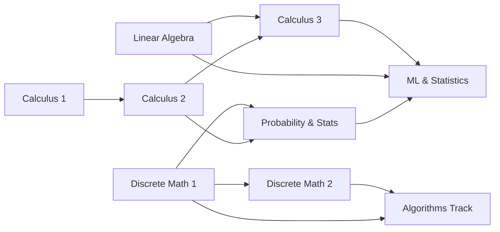

# Superpowers

A free, self-paced curriculum for mathematics and algorithm mastery. Every resource referenced is open-access — no paywalls, no subscriptions.

## Tracks

### Mathematics Foundations

Build the mathematical maturity needed for algorithms, machine learning, and quantitative interviews. All textbooks are free and open-licensed.

| # | Topic | Textbook | Time | Prerequisites |
|---|-------|----------|------|---------------|
| 01 | [Calculus 1](math/01-calculus-1/) | OpenStax Calculus Vol 1 | 4 weeks | -- |
| 02 | [Calculus 2](math/02-calculus-2/) | OpenStax Calculus Vol 2 | 4 weeks | Calculus 1 |
| 03 | [Linear Algebra](math/03-linear-algebra/) | Hefferon's *Linear Algebra* | 4 weeks | -- |
| 04 | [Calculus 3](math/04-calculus-3/) | OpenStax Calculus Vol 3 | 4 weeks | Calculus 2, Linear Algebra |
| 05 | [Discrete Math 1](math/05-discrete-math-1/) | Hammack's *Book of Proof* | 4 weeks | -- |
| 06 | [Discrete Math 2](math/06-discrete-math-2/) | Levin's *Discrete Mathematics* | 4 weeks | Discrete Math 1 |
| 07 | [Probability & Statistics](math/07-probability-statistics/) | Grinstead & Snell + OpenStax Stats | 3-4 weeks | Calculus 2, Discrete Math 1 |

### Algorithm Mastery

Interview-style algorithms organized by priority, with pattern guides and code solutions in JS/Python/C/Scheme.

| # | Topic | Lang | README |
|---|-------|------|--------|
| 01 | [Arrays & Hashing](algorithms/01-arrays-hashing/) | JS | [Patterns](algorithms/01-arrays-hashing/README.md) |
| 02 | [Two Pointers & Sliding Window](algorithms/02-two-pointers-sliding-window/) | JS | [Patterns](algorithms/02-two-pointers-sliding-window/README.md) |
| 03 | [Binary Search](algorithms/03-binary-search/) | JS | [Patterns](algorithms/03-binary-search/README.md) |
| 04 | [Linked Lists](algorithms/04-linked-lists/) | JS | [Patterns](algorithms/04-linked-lists/README.md) |
| 05 | [Trees](algorithms/05-trees/) | Python | [Patterns](algorithms/05-trees/README.md) |
| 06 | [Graphs](algorithms/06-graphs/) | JS/TS/C | [Patterns](algorithms/06-graphs/README.md) |
| 07 | [Dynamic Programming](algorithms/07-dynamic-programming/) | JS/Python/C | [Patterns](algorithms/07-dynamic-programming/README.md) |
| 08 | [Greedy](algorithms/08-greedy/) | JS/Python/Java | [Patterns](algorithms/08-greedy/README.md) |
| 09 | [Backtracking](algorithms/09-backtracking/) | JS/Python | [Patterns](algorithms/09-backtracking/README.md) |
| 10 | [Math & Bit Manipulation](algorithms/10-math-bit/) | JS | [Patterns](algorithms/10-math-bit/README.md) |
| 11 | [Recursion & Divide-and-Conquer](algorithms/11-recursion-divide-conquer/) | Python | [Patterns](algorithms/11-recursion-divide-conquer/README.md) |
| 12 | [Concurrency & Systems](algorithms/12-concurrency-systems/) | C/Python | [Patterns](algorithms/12-concurrency-systems/README.md) |
| 13 | [Functional Programming](algorithms/13-functional-programming/) | Scheme | [Patterns](algorithms/13-functional-programming/README.md) |
| 14 | [ML & Statistics](algorithms/14-ml-statistics/) | Python/R | [Patterns](algorithms/14-ml-statistics/README.md) |
| 15 | [Probabilistic Structures](algorithms/15-probabilistic-structures/) | Python | [Patterns](algorithms/15-probabilistic-structures/README.md) |

## Prerequisite Graph

## Study Plans

See [STUDY-PLAN.md](STUDY-PLAN.md) for structured schedules:

- **Math Foundations** -- 16 weeks covering all 7 math topics
- **Algorithm Mastery** -- 21 days covering all 15 algorithm topics
- **Combined Path** -- 24 weeks from zero to interview-ready

## Interviews

Company-specific interview guides for 19 companies. See [`interviews/README.md`](interviews/README.md).

- **Big Tech & AI Labs**: [Anthropic](interviews/anthropic/), [Google](interviews/google/), [DeepMind](interviews/deepmind/), [OpenAI](interviews/openai/), [Meta](interviews/meta/), [Apple](interviews/apple/), [NVIDIA](interviews/nvidia/), [Moonshot](interviews/moonshot/)
- **Infrastructure & Data**: [Netflix](interviews/netflix/), [Amazon](interviews/amazon/), [Databricks](interviews/databricks/), [Stripe](interviews/stripe/), [Palantir](interviews/palantir/)
- **Quant & Trading**: [Jane Street](interviews/jane-street/), [Citadel](interviews/citadel/), [Two Sigma](interviews/two-sigma/), [HRT](interviews/hrt/), [Renaissance](interviews/renaissance-technologies/)
- **Frontier**: [SpaceX](interviews/spacex/)

## Practice

Standalone implementations for hands-on practice:

- [K-Means Clustering](practice/k_means.py)
- [TF-IDF Vector Search](practice/tf_idf_vector_search.py)

## License

[ISC](LICENSE)
