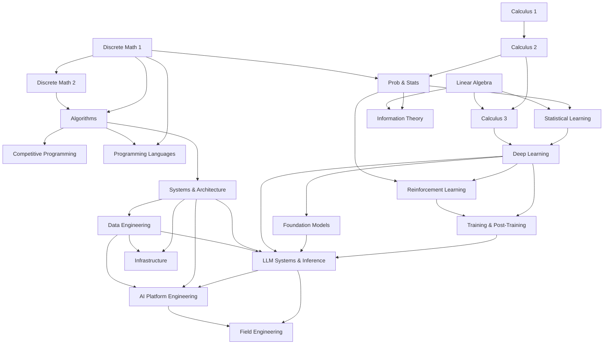

<p align="center">
  <h1 align="center">Supersource</h1>
  <p align="center">
    Free, self-paced curriculum from undergraduate foundations through PhD-level depth and Staff/Principal engineer expertise. Free learning routes with optional paid reference books.
    <br /><br />
    <a href="STUDY-PLAN.md">Study Plans</a>
    &middot;
    <a href="https://github.com/urmzd/supersource/issues">Report Bug</a>
    &middot;
    <a href="#prerequisite-graph">Prerequisites</a>
  </p>
</p>

<p align="center">
  <a href="https://github.com/urmzd/supersource/actions/workflows/ci.yml"></a>
  &nbsp;
  <a href="LICENSE"></a>
</p>

## Contents

- [Features](#features)
- [Tracks](#tracks)
- [Prerequisite Graph](#prerequisite-graph)
- [Study Plans](#study-plans)
- [Role Paths](#role-paths)
- [Read Offline (Single PDF)](#read-offline-single-pdf)
- [Interviews](#interviews)
- [Practice](#practice)
- [Case Studies](#case-studies)
- [Books and Resources](#books-and-resources)
- [Agent Skill](#agent-skill)
- [License](#license)

## Features

- **Free-first** free learning routes, with paid books identified as optional references
- **Graded depth** undergraduate foundations through PhD-level research topics
- **Multi-track** math, algorithms, ML, systems, info theory, competitive programming
- **Interview-ready** 19 company-specific guides across Big Tech, quant, and frontier
- **Role paths** reading orders for one job across tracks, with checkable done-when criteria, in the terminal (`ss learn`) and as a per-role PDF
- **Practice path** one CLI, three exercise kinds (predict, build, reattempt), attempts cloned to a gitignored scratchpad
- **Case studies** real builds generalized into runnable, dependency-free implementations that test themselves
- **Prerequisite graph** mermaid diagram showing topic dependencies
- **Single-PDF book** the entire curriculum renders into one PDF in CI (build artifact + release asset)

## Tracks

Start with the [end-to-end CS curriculum](CS-CURRICULUM.md) for an eight-term core, applied mathematics, specialization paths, and assessment requirements. See the [source register](SOURCES.md) for verified book references, access labels, and audit boundaries.

### Mathematics Foundations

| # | Topic | Textbook | Time |
|---|-------|----------|------|
| 01 | [Calculus 1](math/01-calculus-1/) | OpenStax Calculus Vol 1 | 4 weeks |
| 02 | [Calculus 2](math/02-calculus-2/) | OpenStax Calculus Vol 2 | 4 weeks |
| 03 | [Linear Algebra](math/03-linear-algebra/) | Hefferon's *Linear Algebra* | 4 weeks |
| 04 | [Calculus 3](math/04-calculus-3/) | OpenStax Calculus Vol 3 | 4 weeks |
| 05 | [Discrete Math 1](math/05-discrete-math-1/) | Hammack's *Book of Proof* | 4 weeks |
| 06 | [Discrete Math 2](math/06-discrete-math-2/) | Levin's *Discrete Mathematics* | 4 weeks |
| 07 | [Probability & Statistics](math/07-probability-statistics/) | Grinstead & Snell + OpenStax Stats | 3-4 weeks |

### Algorithm Mastery

| # | Topic | Lang | README |
|---|-------|------|--------|
| 01 | [Arrays & Hashing](algorithms/01-arrays-hashing/) | JS | [Patterns](algorithms/01-arrays-hashing/README.md) |
| 02 | [Two Pointers & Sliding Window](algorithms/02-two-pointers-sliding-window/) | JS | [Patterns](algorithms/02-two-pointers-sliding-window/README.md) |
| 03 | [Binary Search](algorithms/03-binary-search/) | JS | [Patterns](algorithms/03-binary-search/README.md) |
| 04 | [Linked Lists](algorithms/04-linked-lists/) | JS | [Patterns](algorithms/04-linked-lists/README.md) |
| 05 | [Trees](algorithms/05-trees/) | Python | [Patterns](algorithms/05-trees/README.md) |
| 06 | [Graphs](algorithms/06-graphs/) | JS/TS/C | [Patterns](algorithms/06-graphs/README.md) |
| 07 | [Dynamic Programming](algorithms/07-dynamic-programming/) | JS/Python/C | [Patterns](algorithms/07-dynamic-programming/README.md) |
| 08 | [Greedy](algorithms/08-greedy/) | JS/Python/Java | [Patterns](algorithms/08-greedy/README.md) |
| 09 | [Backtracking](algorithms/09-backtracking/) | JS/Python | [Patterns](algorithms/09-backtracking/README.md) |
| 10 | [Math & Bit Manipulation](algorithms/10-math-bit/) | JS | [Patterns](algorithms/10-math-bit/README.md) |
| 11 | [Recursion & Divide-and-Conquer](algorithms/11-recursion-divide-conquer/) | Python | [Patterns](algorithms/11-recursion-divide-conquer/README.md) |
| 12 | [Concurrency & Systems](algorithms/12-concurrency-systems/) | C/Python | [Patterns](algorithms/12-concurrency-systems/README.md) |
| 13 | [Functional Programming](algorithms/13-functional-programming/) | Scheme | [Patterns](algorithms/13-functional-programming/README.md) |
| 14 | [ML & Statistics](algorithms/14-ml-statistics/) | Python/R | [Patterns](algorithms/14-ml-statistics/README.md) |
| 15 | [Probabilistic Structures](algorithms/15-probabilistic-structures/) | Python | [Patterns](algorithms/15-probabilistic-structures/README.md) |

Core references: CLRS (4th ed.), [Competitive Programmer's Handbook](https://cses.fi/book/book.pdf) (free). See [algorithms/README.md](algorithms/README.md) for full details.

### Machine Learning & AI

| # | Topic | Textbook | Time |
|---|-------|----------|------|
| 01 | [Statistical Learning](ml/01-statistical-learning/) | ISLR (free) + ESL (free) | 4-5 weeks |
| 02 | [Deep Learning](ml/02-deep-learning/) | Goodfellow et al. on [deeplearningbook.org](https://www.deeplearningbook.org/) (free) | 6-8 weeks |
| 03 | [Reinforcement Learning](ml/03-reinforcement-learning/) | Sutton & Barto (free) + [Spinning Up](https://spinningup.openai.com/en/latest/) | 4-6 weeks |
| 04 | [LLM Systems & Inference](ml/04-llm-systems/) | [*ML Systems*](https://mlsysbook.ai/) (free) + [vLLM docs](https://docs.vllm.ai/) (free) | 4-6 weeks |
| 05 | [Foundation Models & Architectures](ml/05-foundation-models/) | *AI Engineering* (Huyen) + [aie-book](https://github.com/chiphuyen/aie-book) (free) | 4-5 weeks |
| 06 | [Neural Architectures & DL History](ml/06-neural-architectures/) | [CS231n](https://cs231n.github.io/) (free) + AlexNet/LSTM papers (free) | 3-4 weeks |
| 07 | [Training & Post-Training](ml/07-training-and-post-training/) | [Chinchilla](https://arxiv.org/abs/2203.15556) + [DPO](https://arxiv.org/abs/2305.18290) papers (free) + PyTorch/JAX docs (free) | 4-6 weeks |

### Data Engineering

| # | Topic | Primary Reference | Time |
|---|-------|------------------|------|
| 01 | [Foundations](data-engineering/01-foundations/) | [*Data Engineering Cookbook*](https://github.com/andkret/Cookbook) (free) + *Fundamentals of Data Engineering* | 2-3 weeks |
| 02 | [Storage & Warehousing](data-engineering/02-storage-warehousing/) | DDIA Ch 3 + *The Data Warehouse Toolkit* (Kimball) | 3-4 weeks |
| 03 | [Batch & Streaming](data-engineering/03-batch-streaming/) | *Streaming Systems* + [Spark](https://spark.apache.org/docs/latest/)/[Kafka](https://kafka.apache.org/documentation/) docs (free) | 3-4 weeks |
| 04 | [Orchestration & Modeling](data-engineering/04-orchestration-modeling/) | [dbt](https://docs.getdbt.com/) + [Airflow](https://airflow.apache.org/docs/) docs (free) | 2-3 weeks |

### Systems & Architecture

| # | Topic | Reference | Time |
|---|-------|-----------|------|
| 01 | [System Design](systems/01-system-design/) | ByteByteGo + System Design Primer (free) | 4-5 weeks |
| 02 | [Software Architecture](systems/02-software-architecture/) | *Software Architecture Patterns* (O'Reilly) | 2-3 weeks |
| 03 | [Cloud Native](systems/03-cloud-native/) | *Cloud Native DevOps with K8s* + K8s docs (free) | 3-4 weeks |
| 04 | [Observability](systems/04-observability/) | *Observability Engineering* + Google SRE Book (free) | 2-3 weeks |

### AI Platform Engineering

Taught as **patterns, not products** — like math, once you understand the fundamental patterns (cache-aside, consistent hashing, durable execution, the worker pool, retrieve-then-rerank, the complexity ladder of authorization, cross-entropy-as-compression), every trendy tool becomes a recognizable instance.

| # | Topic | Reference | Time |
|---|-------|-----------|------|
| 01 | [Training & Frameworks](ai-platform-engineering/01-training-and-frameworks/) | [PyTorch](https://pytorch.org/docs/stable/index.html) + [JAX](https://jax.readthedocs.io/) + [vLLM](https://docs.vllm.ai/) docs (free) | 4-6 weeks |
| 02 | [RPC & Protocols](ai-platform-engineering/02-rpc-and-protocols/) | [gRPC](https://grpc.io/docs/) + [Protocol Buffers](https://protobuf.dev/) docs (free) | 2-3 weeks |
| 03 | [Streaming & SSE](ai-platform-engineering/03-streaming-sse/) | [HTML SSE spec](https://html.spec.whatwg.org/multipage/server-sent-events.html) + [MDN SSE](https://developer.mozilla.org/en-US/docs/Web/API/Server-sent_events) (free) | 1-2 weeks |
| 04 | [Distributed Data & Caching](ai-platform-engineering/04-distributed-data-and-caching/) | [Redis](https://redis.io/docs/latest/) + [Cassandra](https://cassandra.apache.org/doc/latest/) docs (free) + DDIA | 3-4 weeks |
| 05 | [Durable Orchestration & Workers](ai-platform-engineering/05-durable-orchestration-and-workers/) | [Temporal](https://docs.temporal.io/) + [DBOS](https://docs.dbos.dev/) docs (free) | 2-3 weeks |
| 06 | [Coding & Design Patterns](ai-platform-engineering/06-coding-and-design-patterns/) | [Refactoring Guru](https://refactoring.guru/design-patterns) + [Mostly Adequate Guide](https://mostly-adequate.gitbook.io/mostly-adequate-guide/) (free) | 2-3 weeks |
| 07 | [Retrieval & RAG](ai-platform-engineering/07-retrieval-and-rag/) | [RAG paper](https://arxiv.org/abs/2005.11401) + [BM25](https://www.staff.city.ac.uk/~sbrp622/papers/foundations_bm25_review.pdf) + [pgvector](https://github.com/pgvector/pgvector) (free) | 3-4 weeks |
| 08 | [Authorization & Access Control](ai-platform-engineering/08-authorization-and-access-control/) | [NIST RBAC/ABAC/NGAC](https://csrc.nist.gov/projects/role-based-access-control) + [Zanzibar](https://research.google/pubs/pub48190/) (free) | 2-3 weeks |
| 09 | [LLM Evaluation](ai-platform-engineering/09-llm-evaluation/) | [MacKay](http://www.inference.org.uk/mackay/itila/) + [HELM](https://crfm.stanford.edu/helm/) + [Ragas](https://docs.ragas.io/) (free) | 2-3 weeks |
| 10 | [Edge, Realtime & On-Device Inference](ai-platform-engineering/10-edge-realtime-inference/) | [llama.cpp](https://github.com/ggml-org/llama.cpp) + [Mistral 7B](https://arxiv.org/abs/2310.06825) + [Mamba](https://arxiv.org/abs/2312.00752) (free) | 2-3 weeks |
| 11 | [Model Routing & Cascades](ai-platform-engineering/11-model-routing-and-cascades/) | [RouteLLM](https://arxiv.org/abs/2406.18665) + [FrugalGPT](https://arxiv.org/abs/2305.05176) + [LLMRouterBench](https://arxiv.org/abs/2601.07206) (free) | 1-2 weeks |

Three distinct "distributed" problems kept apart on purpose: distributed **training** (parallelism — PyTorch/JAX, FSDP/ZeRO, Megatron, Ray Train; served with vLLM/TensorRT-LLM; plus embeddings and small language models), distributed **data** (sharding, replication, in-memory caching with Redis and cache-invalidation patterns, Cassandra, knowledge graphs via Apache AGE, OLAP vs OLTP), and distributed **orchestration** (durable execution and the worker pattern — Temporal/Cadence/DBOS — with distributed observability and profiling). Plus the connective tissue: gRPC and serialization, SSE token streaming, the coding/design patterns these systems are built from, production-grade **retrieval** (encoders, chunking, hybrid BM25 + vector + graph fusion, multimodal, metadata/permission filtering), **authorization** (RBAC/ABAC/NGAC and the pushdown-automata complexity ladder), **evaluation** (cross-entropy, perplexity, bits-per-byte, LLM-as-judge, RAG faithfulness), and **edge/realtime inference** (the end-to-end llama.cpp + GGUF local path, streaming speech encoders, and the efficiency architectures — sliding-window attention, GQA, MoE, Mamba/SSM — behind Mistral's models).

### Specialized Tracks

| Track | Reference | Time |
|-------|-----------|------|
| [Competitive Programming](competitive-programming/) | [CP Handbook](https://cses.fi/book/book.pdf) (free) + CSES Problem Set | 6-8 weeks |
| [Information Theory](information-theory/) | *Student's Guide to Coding & Info Theory* + MacKay (free) | 3-4 weeks |
| [Programming Languages](programming-languages/) | [*Types and Programming Languages* (Pierce)](https://www.cis.upenn.edu/~bcpierce/tapl/) + [PLFA](https://plfa.github.io/) (free) | 2-3 weeks |
| [Software Craftsmanship](software-craftsmanship/) | *The Pragmatic Programmer* + [*SWE at Google*](https://abseil.io/resources/swe-book) (free) + [project postmortems](software-craftsmanship/04-lessons-from-practice/) | 3-4 weeks |
| [Diagramming & Documentation](diagramming-and-documentation/) | [C4 model](https://c4model.com/) + [D2](https://d2lang.com/)/[Mermaid](https://mermaid.js.org/) + [Diátaxis](https://diataxis.fr/) (free) | 2 weeks |
| [Infrastructure](infrastructure/) | [K8s](https://kubernetes.io/docs/) + [Kafka](https://kafka.apache.org/documentation/) + [Lucene](https://lucene.apache.org/core/)/[Elasticsearch](https://www.elastic.co/guide/en/elasticsearch/guide/current/index.html) + Apache docs (free) | 5-7 weeks |
| [Field Engineering](field-engineering/) | Discovery, sizing, performance testing engagements, POCs, migration, commercials, escalation for inference-cloud customers | 3-4 weeks |
| [Case Studies](case-studies/) | Worked builds with runnable, dependency-free implementations | 5-10 days |

## Prerequisite Graph



## Study Plans

See [STUDY-PLAN.md](STUDY-PLAN.md) for structured schedules:

- **Math Foundations** 16 weeks, all 7 math topics
- **Algorithm Mastery** 21 days, all 15 algorithm topics
- **ML & AI** 18-37 weeks, statistical learning through RL, LLM serving, foundation models, neural-architecture foundations, and training and post-training
- **Systems & Architecture** 11-15 weeks, system design through observability
- **Data Engineering** 10-14 weeks, foundations through orchestration and data quality
- **AI Platform Engineering** 25-35 weeks, patterns-first: training/frameworks, RPC, streaming, distributed data & caching, durable orchestration, coding/design patterns, retrieval & RAG, authorization, LLM evaluation, edge/realtime inference, and model routing
- **Programming Languages** 2-3 weeks, type systems and polymorphism from the lambda-calculus ladder through Hindley-Milner inference, variance, and generics across five languages
- **Diagramming & Documentation** 2 weeks, C4 diagramming-as-code and docs-as-code
- **Infrastructure** 5-7 weeks, containers and Kubernetes through messaging, workers, search, and the Apache stack
- **Superstar FDE** 14 weeks, the composed role path: LLM foundations through inference performance, field engineering, and a one-customer capstone
- **Combined Path** 40+ weeks, zero to Staff+ interview-ready
- **PhD Research Track** deep learning research + information theory + RL

## Role Paths

A [path](paths/) orders existing chapters for one job and says what "done" means at each stage; the tracks keep owning the content. Paths compose: six parts each stand alone for a narrower role, and **Superstar FDE** includes all six plus a capstone.

| Path | For |
|------|-----|
| [Superstar FDE](paths/superstar-fde/) | Forward deployed engineer at an inference and fine-tuning cloud, end to end: every part below plus a one-customer capstone |
| [LLM Foundations](paths/llm-foundations/) | History from n-grams to reasoning models, transformer math, architecture variants |
| [Frameworks and Models](paths/frameworks-and-models/) | PyTorch, JAX, Keras 3, and loading checkpoints from the Hugging Face Hub |
| [Training](paths/training/) | RL foundations, pretraining, post-training (SFT, DPO, GRPO), LoRA |
| [Inference Performance](paths/inference-performance/) | Engine internals, quantization, vLLM/SGLang serving and load testing |
| [AI Full Stack](paths/ai-full-stack/) | Streaming, retrieval, evaluation, routing |
| [Field Engineering](paths/field-engineering/) | Discovery, sizing, performance testing engagements, POCs, migration, commercials, escalation |

```bash
practice/bin/ss learn                        # every path and your progress
practice/bin/ss learn superstar-fde next     # read the next unfinished stage
```

## Read Offline (Single PDF)

The whole curriculum builds into one PDF -- every track and topic in learning
order, with the C4 architecture diagrams and Mermaid diagrams rendered inline.

- **From CI**: every run produces a `supersource-curriculum-pdf` build artifact.
- **From a release**: `supersource-curriculum.pdf` is attached to each GitHub Release, alongside one `supersource-<path>.pdf` per [role path](paths/).
- **Locally**:

  ```bash
  ./scripts/build-book.sh           # -> outputs/supersource-curriculum.pdf
  ./scripts/build-book.sh --path superstar-fde  # -> outputs/supersource-superstar-fde.pdf
  ./scripts/build-book.sh --help    # options (--skip-mermaid, --no-toc, ...)
  ```

  Requires `pandoc` and a LaTeX engine (`xelatex`). For full fidelity also
  install `librsvg` (embeds the C4 SVGs) and `mermaid-filter` (renders Mermaid);
  without them the build still succeeds with diagrams shown as code.

## Interviews

Company-specific guides for 19 companies. See [`interviews/README.md`](interviews/README.md).

- **Big Tech & AI Labs** [Anthropic](interviews/anthropic/), [Google](interviews/google/), [DeepMind](interviews/deepmind/), [OpenAI](interviews/openai/), [Meta](interviews/meta/), [Apple](interviews/apple/), [NVIDIA](interviews/nvidia/), [Moonshot](interviews/moonshot/)
- **Infrastructure & Data** [Netflix](interviews/netflix/), [Amazon](interviews/amazon/), [Databricks](interviews/databricks/), [Stripe](interviews/stripe/), [Palantir](interviews/palantir/)
- **Quant & Trading** [Jane Street](interviews/jane-street/), [Citadel](interviews/citadel/), [Two Sigma](interviews/two-sigma/), [HRT](interviews/hrt/), [Renaissance](interviews/renaissance-technologies/)
- **Frontier** [SpaceX](interviews/spacex/)

## Practice

The tracks above are the **learning path**: you read them. [`practice/`](practice/README.md) is the **practice path**: it tells you whether you actually know it. One CLI drives it, and everything you write goes to a gitignored `.scratchpad/`, never into the repo.

```bash
practice/bin/ss list                # every exercise, and which you have started
practice/bin/ss start predict go 01 # clone it into .scratchpad/ and open it
practice/bin/ss check predict go 01 # exit code is the verdict
```

Three kinds of exercise, distinguished only by what you produce:

| Kind | You produce | It is wrong when |
|------|-------------|------------------|
| [`predict`](practice/predict/) | The exact output you expect from a snippet | Your prediction differs from what ran |
| [`build`](practice/build/) | An implementation from scratch | The exercise's own assertions fail |
| [`reattempt`](practice/reattempt/) | A second solution to something you already solved | The original's assertions fail |

**[Predict-then-run](practice/predict/)** is the retention drill and the place to start: 24 snippets across Go, Rust, Python, and TypeScript where you write the exact expected output *before* running, and the diff tells you which part of your mental model is wrong. Every snippet is checked in CI for determinism, wall time, and peak memory.

**[Build](practice/build/)** is 10 graded exercises per language, covering data structures, algorithms, concurrency, and language-specific idioms. Each reference implementation is standard library only and passes its own assertions in CI.

| | Languages | Focus |
|---|-----------|-------|
| **Core** | [Go](practice/build/cloud/go/), [Rust](practice/build/systems/rust/), [Python](practice/build/general/python/), [TypeScript](practice/build/general/typescript/), [C](practice/build/systems/c/), [C++](practice/build/systems/cpp/) | What the curriculum targets, and what CI verifies |
| **Optional** | [Zig](practice/build/systems/zig/), [Scala](practice/build/cloud/scala/), [Java](practice/build/cloud/java/) | Worth doing, but not in use here; excluded from the default run |

### From-Scratch Implementations

- [K-Means Clustering](algorithms/14-ml-statistics/k-means.py) unsupervised learning
- [TF-IDF Vector Search](algorithms/14-ml-statistics/tf-idf-vector-search.py) text similarity search

## Case Studies

Real builds, generalized. Each takes a system designed under a deadline, strips it to the transferable concepts, and records the order it was actually assembled in. Every implementation is standard library only and runs its own tests: `python <file>.py`. See [`case-studies/README.md`](case-studies/README.md).

| # | Study | What it teaches | Runnable |
|---|-------|-----------------|----------|
| 01 | [Order Book Matching](case-studies/01-order-book-matching/) | Two orderings, two structures; earning a heap then a tick-indexed ladder via BUD | [`matching_engine.py`](case-studies/01-order-book-matching/matching_engine.py) |
| 02 | [Grounded SQL Agent](case-studies/02-grounded-sql-agent/) | Schema grounding measured by ablation, bounded self-correction, a deterministic safety gate | [`safety_gate.py`](case-studies/02-grounded-sql-agent/safety_gate.py) |
| 03 | [Exactly-Once Event API](case-studies/03-exactly-once-event-api/) | Constraint-based dedup, atomic claims, and what at-most-once actually buys | [`event_api.py`](case-studies/03-exactly-once-event-api/event_api.py) |
| 04 | [K-Means Optimization](case-studies/04-kmeans-optimization/) | Initialization over iteration, and stating an optimization's regime | [`kmeans_ladder.py`](case-studies/04-kmeans-optimization/kmeans_ladder.py) |
| 05 | [Agent Evaluation Harness](case-studies/05-agent-eval-harness/) | Outcome, evidence, and grade kept apart; replay before grading; a checker proved by oracles and mutants | [`eval_harness.py`](case-studies/05-agent-eval-harness/eval_harness.py) |

## Books and Resources

See the [source register](SOURCES.md) for author/publisher evidence and the distinction between free books, course materials, and paid companions. [Mathematics for Machine Learning](https://mml-book.github.io/) connects the foundational math tracks to regression, PCA, and optimization.

All primary textbooks are free. Recommended (non-free) books are listed separately.

### Free Textbooks

| Book | Track | Link |
|------|-------|------|
| OpenStax Calculus Volumes 1-3 | Math | [openstax.org](https://openstax.org/) |
| *Book of Proof* by Hammack | Math | [Free PDF](https://people.vcu.edu/~rhammack/BookOfProof/) |
| *Discrete Mathematics: An Open Introduction* by Levin | Math | [Free online](https://discrete.openmathbooks.org/) |
| *Linear Algebra* by Hefferon | Math | [Free PDF](https://hefferon.net/linearalgebra/) |
| *Introduction to Probability* by Grinstead & Snell | Math | [Free PDF](https://math.dartmouth.edu/~prob/prob/prob.pdf) |
| *Competitive Programmer's Handbook* by Laaksonen | Competitive Programming | [Free PDF](https://cses.fi/book/book.pdf) |
| *Introduction to Statistical Learning* (ISLR) | ML/AI | [Free online](https://www.statlearning.com/) |
| *Elements of Statistical Learning* (ESL) | ML/AI | [Free PDF](https://hastie.su.domains/ElemStatLearn/) |
| *Deep Learning* by Goodfellow, Bengio, Courville | ML/AI | [Free online](https://www.deeplearningbook.org/) |
| *RL: An Introduction* by Sutton & Barto | ML/AI (RL) | [Free online](http://incompleteideas.net/book/the-book-2nd.html) |
| OpenAI Spinning Up in Deep RL | ML/AI (RL) | [Free online](https://spinningup.openai.com/en/latest/) |
| *Machine Learning Systems* by Reddi | ML/AI (LLM Systems) | [Free online](https://mlsysbook.ai/) |
| *AI Engineering* companion (aie-book) by Huyen | ML/AI (Foundation Models) | [Free on GitHub](https://github.com/chiphuyen/aie-book) |
| Stanford CRFM *Foundation Models* report | ML/AI (Foundation Models) | [Free PDF](https://arxiv.org/abs/2108.07258) |
| *The Data Engineering Cookbook* by Kretz | Data Engineering | [Free on GitHub](https://github.com/andkret/Cookbook) |
| *Info Theory, Inference, & Learning* by MacKay | Information Theory | [Free online](http://www.inference.org.uk/mackay/itila/) |
| *Programming Language Foundations in Agda* (PLFA) by Wadler et al. | Programming Languages | [Free online](https://plfa.github.io/) |
| *Software Foundations* (Vol. 1-2) by Pierce et al. | Programming Languages | [Free online](https://softwarefoundations.cis.upenn.edu/) |
| *Software Engineering at Google* by Winters, Manshreck, Wright | Software Craftsmanship | [Free online](https://abseil.io/resources/swe-book) |
| Google SRE Book | Systems | [Free online](https://sre.google/sre-book/) |
| System Design Primer | Systems | [Free on GitHub](https://github.com/donnemartin/system-design-primer) |
| The C4 model by Simon Brown | Diagramming & Documentation | [Free online](https://c4model.com/) |
| Diátaxis documentation framework | Diagramming & Documentation | [Free online](https://diataxis.fr/) |
| Google Technical Writing Courses | Diagramming & Documentation | [Free online](https://developers.google.com/tech-writing) |
| Kubernetes Documentation | Infrastructure / Systems | [Free online](https://kubernetes.io/docs/) |
| Apache Kafka Documentation | Infrastructure / Data Engineering | [Free online](https://kafka.apache.org/documentation/) |
| Apache Lucene & Elasticsearch Guide | Infrastructure | [Lucene](https://lucene.apache.org/core/) / [ES Guide](https://www.elastic.co/guide/en/elasticsearch/guide/current/index.html) |
| PyTorch / JAX / vLLM Documentation | AI Platform Engineering | [PyTorch](https://pytorch.org/docs/stable/index.html) / [JAX](https://jax.readthedocs.io/) / [vLLM](https://docs.vllm.ai/) |
| gRPC + Protocol Buffers Documentation | AI Platform Engineering | [grpc.io](https://grpc.io/docs/) / [protobuf.dev](https://protobuf.dev/) |
| MDN Server-Sent Events + WHATWG HTML spec | AI Platform Engineering | [MDN](https://developer.mozilla.org/en-US/docs/Web/API/Server-sent_events) / [Spec](https://html.spec.whatwg.org/multipage/server-sent-events.html) |
| Temporal / DBOS / Cassandra / Apache AGE Docs | AI Platform Engineering | [Temporal](https://docs.temporal.io/) / [DBOS](https://docs.dbos.dev/) / [Cassandra](https://cassandra.apache.org/doc/latest/) / [AGE](https://age.apache.org/) |
| Redis Documentation | AI Platform Engineering | [Free online](https://redis.io/docs/latest/) |
| RAG paper + BM25 review + pgvector | AI Platform Engineering | [RAG](https://arxiv.org/abs/2005.11401) / [BM25](https://www.staff.city.ac.uk/~sbrp622/papers/foundations_bm25_review.pdf) / [pgvector](https://github.com/pgvector/pgvector) |
| NIST RBAC/ABAC/NGAC + Google Zanzibar | AI Platform Engineering | [NIST](https://csrc.nist.gov/projects/role-based-access-control) / [Zanzibar](https://research.google/pubs/pub48190/) |
| HELM + lm-evaluation-harness + Ragas | AI Platform Engineering | [HELM](https://crfm.stanford.edu/helm/) / [harness](https://github.com/EleutherAI/lm-evaluation-harness) / [Ragas](https://docs.ragas.io/) |
| llama.cpp + GGUF + Ollama | AI Platform Engineering | [llama.cpp](https://github.com/ggml-org/llama.cpp) / [GGUF](https://github.com/ggml-org/ggml/blob/master/docs/gguf.md) / [Ollama](https://github.com/ollama/ollama) |
| Ray (Core / Train / Serve) Documentation | AI Platform Engineering | [Free online](https://docs.ray.io/) |
| NVIDIA TensorRT-LLM + Triton Inference Server | AI Platform Engineering | [TensorRT-LLM](https://nvidia.github.io/TensorRT-LLM/) / [Triton](https://docs.nvidia.com/deeplearning/triton-inference-server/) |
| Mistral 7B / Mixtral / Mamba papers | AI Platform Engineering | [Mistral 7B](https://arxiv.org/abs/2310.06825) / [Mixtral](https://arxiv.org/abs/2401.04088) / [Mamba](https://arxiv.org/abs/2312.00752) |

### Recommended (non-free)

| Book | Track | Why |
|------|-------|-----|
| *Introduction to Algorithms* (CLRS) 4th ed. | Algorithms | The definitive algorithms reference, formal proofs and correctness |
| *Types and Programming Languages* (TAPL) by Pierce | Programming Languages | The definitive type-systems text: lambda calculus, System F, subtyping, inference |
| *The Pragmatic Programmer* by Hunt & Thomas (20th Anniversary) | Software Craftsmanship | The foundational text on professional software development |
| *Designing Data-Intensive Applications* by Kleppmann | Systems / Data Engineering | The industry bible for distributed systems |
| *Fundamentals of Data Engineering* by Reis & Housley | Data Engineering | The definitive lifecycle-oriented introduction |
| *The Data Warehouse Toolkit* by Kimball | Data Engineering | The canonical text on dimensional modeling |
| *Streaming Systems* by Akidau et al. | Data Engineering | The Dataflow model that unifies batch and streaming |
| *Designing Machine Learning Systems* by Huyen | ML/AI | Production ML from data to deployment and serving |
| [*AI Engineering* by Chip Huyen (2025)](https://github.com/chiphuyen/aie-book) | ML/AI | Optional paid book; the linked official repository provides free companion materials |
| *ByteByteGo System Design* | Systems | Visual system design walkthroughs |
| *Software Architecture Patterns* by Richards | Systems | Concise pattern catalog for architecture decisions |
| *Cloud Native DevOps with Kubernetes* 2nd ed. | Systems | Hands-on K8s from dev through production |
| *Observability Engineering* by Majors et al. | Systems | Modern observability beyond the three pillars |
| *Probability & Statistics for Engineering* by Devore | Math | Rigorous engineering-focused probability |
| *A Student's Guide to Coding and Information Theory* | Information Theory | Accessible introduction with worked examples |
| *Neo4j Graph Algorithms* | Algorithms (Graphs) | Applied graph algorithms at scale |

## Agent Skill

This repo's conventions are available as portable agent skills in [`skills/`](skills/).

## License

[Apache-2.0](LICENSE)
