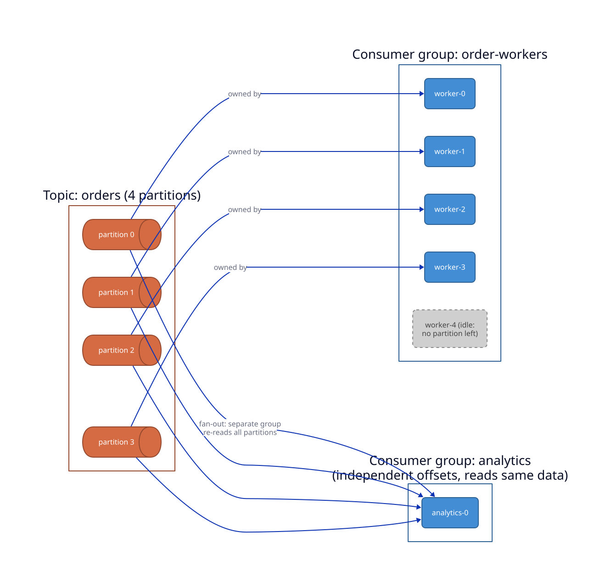
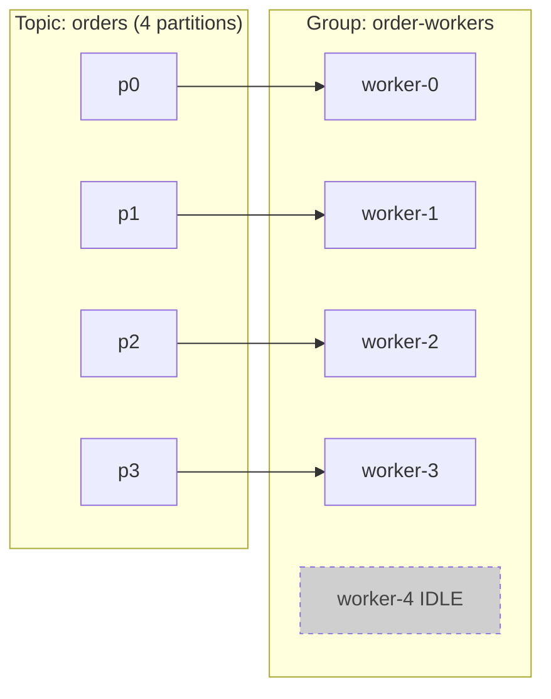

# Durable Orchestration & Workers

## Overview

- **Primary references**: [Temporal docs](https://docs.temporal.io/) (free), [DBOS docs](https://docs.dbos.dev/) (free)
- **Supplementary**: [Apache Cadence](https://cadenceworkflow.io/docs/) (Temporal's open-source ancestor, free), [Temporal "what is durable execution"](https://temporal.io/blog/what-is-durable-execution), the [saga pattern](https://microservices.io/patterns/data/saga.html), [transactional outbox](https://microservices.io/patterns/data/transactional-outbox.html), [OpenTelemetry docs](https://opentelemetry.io/docs/) (distributed tracing), [Brendan Gregg's *Systems Performance*](https://www.brendangregg.com/systems-performance-2nd-edition-book.html) (profiling)
- **Prerequisites**: [RPC & Protocols](../02-rpc-and-protocols/) (idempotency, partial failure), [Distributed Data & Caching](../04-distributed-data-and-caching/) (event sourcing), [Observability](../../systems/04-observability/)
- **Estimated time**: 2-3 weeks at 8-10 hrs/week

## Key Takeaways

- **Durable execution is checkpointing for workflows.** A long-running process persists every completed step so that, after *any* crash, deploy, or scale event, it resumes exactly where it stopped — instead of restarting or corrupting state.
- **The worker pattern decouples "what to do" from "who does it."** A durable workflow engine is a queue of tasks + a pool of stateless workers that poll, execute, and report back. Scale by adding workers; survive failures because tasks are persisted, not in-flight memory.
- **Recovery is replay over an event log.** Temporal/Cadence reconstruct a workflow's state by replaying its event-sourced history — the same event-sourcing pattern from the data topic, applied to *execution* instead of data.
- **Idempotency and compensation are non-negotiable.** Retries are guaranteed, so every step must be safe to repeat; when you can't roll forward, the **saga** runs compensating actions to undo partial work.
- **Distributed observability and profiling are how you operate this.** A workflow spanning services and hours is invisible without tracing (where is it?), metrics (how many are stuck?), and profiling (why is this step slow?).

## How to Study

- Build a 3-step pipeline (download → embed → index) as a Temporal or DBOS workflow. Kill the worker mid-run; watch it resume without redoing completed steps. *That* is durable execution.
- Make a step non-idempotent (e.g. "charge the card") and run it through a forced retry — observe the double-charge bug, then fix it with an idempotency key.
- Add a compensation (refund) and trigger a downstream failure to see the saga unwind.
- Instrument the workflow with OpenTelemetry traces and profile the slowest activity — find where the wall-clock time actually goes.

---

# Concepts & Techniques

## Core Insight

A request lives for milliseconds; a *process* — fulfill an order, ingest and index a corpus, run a multi-day training job — lives for minutes to months, calls flaky services, and must survive the machine running it dying halfway through. The naive solution (a database state column + cron + retry glue) reinvents a buggy workflow engine every time. Durable execution names the pattern: persist the *progress* of a computation (its checkpoints) so the program is, in effect, immortal — it can crash and wake up mid-function with all its local state intact. Everything else here (workers, sagas, observability) is in service of making that illusion reliable and operable.

## 1. The Problem: Long-Running, Failure-Prone Processes

**Key ideas**:
- A real workflow is **multi-step, long-lived, and distributed** — and any step can fail, time out, or be interrupted by a deploy.
- Hand-rolled orchestration scatters state across a DB column, a cron job, a retry wrapper, and a dead-letter queue — correctness lives nowhere and bugs live everywhere.
- The recurring needs: **retry** with backoff, **timeouts**, **idempotency**, **resume-after-crash**, **visibility**, and **rollback**. Durable execution provides all of them as a single abstraction.

## 2. Durable Execution & Checkpointing

**The core pattern**

**Key ideas**:
- **Checkpoint every step.** After each step's result is known, persist it durably *before* moving on. On recovery, read the last checkpoint and continue — never redo completed work.
- **Event-sourced history + replay** (Temporal/Cadence): the engine records an append-only log of every event (step scheduled, step completed, timer fired). To recover, it **replays** that log through your workflow code to rebuild local variables and resume at the next unexecuted line. Your workflow looks like ordinary sequential code; the engine makes it crash-proof underneath.
- **Determinism requirement**: because recovery replays your code, workflow code must be **deterministic** — no `now()`, `random()`, or direct I/O inline; those go through the engine (which records their results) so replay reproduces the same path. This is the one real constraint of the model.
- **Transactional checkpointing** (DBOS): persist workflow/step state in **Postgres transactions**, so recovery is "read the last committed step and continue." Lighter-weight, leans on the database you already run.
- **Parallel to training checkpoints**: the same idea that lets a multi-day GPU training run resume from the last saved checkpoint ([topic 01](../01-training-and-frameworks/)) — applied to arbitrary application workflows.

## 3. The Worker Pattern

**Decoupling task definition from task execution**

**Key ideas**:
- **Task queue + worker pool**: the engine holds a durable queue of pending tasks (workflow steps / activities); a pool of **workers** long-polls the queue, executes a task, and reports the result back. Classic producer-consumer, made durable.
- **Workers are stateless and horizontally scalable**: all durable state lives in the engine, so workers can crash, deploy, and autoscale freely. Add workers → more throughput; lose workers → tasks just wait in the queue.
- **Separation of concerns**: the **workflow** orchestrates (deterministic, the "what and when"); **activities/steps** do the side-effecting work (the "how" — call an API, run a model, write a DB). Activities get automatic retries, timeouts, and heartbeats.
- **Task routing**: route tasks to worker pools by capability (GPU workers vs CPU workers vs region) via named task queues — how you'd send embedding jobs to GPU workers and notifications to cheap CPU workers.
- **This is the same worker pool** as a thread pool, a Celery/Sidekiq queue, or a Kubernetes Job fan-out — durable execution just persists the queue and the progress.

## 4. Reliability Patterns Around Workers

| Pattern | Problem it solves |
|---------|-------------------|
| **Idempotency key** | Retries must not double-apply a side effect (charge, send, insert) |
| **Saga / compensation** | A multi-step transaction across services can't use 2PC; undo completed steps on later failure |
| **Transactional outbox** | Atomically commit a DB change *and* an event to publish (no dual-write inconsistency) |
| **Exactly-once (effectively)** | Combine idempotency + dedup so a step's *effect* happens once despite at-least-once delivery |
| **Circuit breaker / bulkhead** | Stop hammering a failing dependency; isolate failures to one pool |
| **Backpressure** | Bound the queue and shed/slow producers so workers aren't overwhelmed |
| **Poison-message / DLQ** | Quarantine a task that fails forever instead of blocking the queue |

**Key idea**: at-least-once delivery is the cheap, available default; you reach *effectively-once* by making consumers **idempotent** and reconciling with **compensation**. There is no free exactly-once in a distributed system — you engineer it.

## 5. Temporal, Cadence, and DBOS

| | Temporal / Cadence | DBOS |
|---|--------------------|------|
| Recovery model | Event-sourced history + replay | Transactional state in Postgres |
| State store | Cassandra / Postgres / MySQL | Postgres (the one you already have) |
| Execution | Separate worker pool polling a service | Library in your process |
| Strength | Long-lived, complex, signal-driven workflows | Lightweight, SQL-native, fewer moving parts |
| Lineage | Cadence (Uber, OSS) → Temporal (fork) | Postgres-first durable execution |

**Key ideas**:
- **Temporal** is the heavyweight: months-long workflows, signals, child workflows, timers, versioning, multi-language SDKs — at the cost of running a cluster (which itself needs a sharded store; see [topic 04](../04-distributed-data-and-caching/)).
- **Cadence** is the open-source ancestor Temporal forked from; same concepts, less active.
- **DBOS** trades some power for simplicity: if you already run Postgres, you get durable execution without a separate system.
- **vs schedulers**: Airflow/Dagster ([Data Engineering](../../data-engineering/04-orchestration-modeling/)) run *batch DAGs on a schedule*; Temporal/DBOS run *durable arbitrary code* with fine-grained, event-driven, long-lived state. Overlapping, distinct tools.
- **vs distributed-compute frameworks**: **[Ray](https://docs.ray.io/)** (Core actors/tasks, Ray Train, Ray Serve) is the worker-pool pattern for *in-memory distributed ML compute* — fast task/actor scheduling across a cluster, but **not durable** (lose a node mid-task and the task reruns; lose the driver and the job dies). Temporal/DBOS persist progress; Ray maximizes throughput. Common pattern: Ray for the heavy parallel compute *inside* a step, a durable engine to orchestrate the steps reliably around it.

## 6. Distributed Observability

**You cannot operate what you cannot see**

**Key ideas**:
- **The three pillars** ([Observability](../../systems/04-observability/)): **traces** (one request/workflow across services — a span tree), **metrics** (aggregate rates/latencies — RED/USE), **logs** (discrete events). A durable workflow needs all three because it spans services *and time*.
- **Distributed tracing** (OpenTelemetry): propagate a trace/span context across every RPC and queue hop so a workflow's whole path is one connected trace — answering "where is execution #123 right now, and what's it waiting on?"
- **Workflow-native visibility**: durable engines add their own — list running/failed workflows, inspect event history, see which step is retrying. Temporal's event log *is* an audit trail and a debugger.
- **Correlation IDs**: thread a workflow/correlation id through logs, metrics, and traces so you can pivot between them.

## 7. Profiling

**Measure before you optimize — at every layer**

**Key ideas**:
- **Profiling vs observability**: observability tells you *which* request/step is slow; profiling tells you *why* — where the CPU cycles, allocations, or wait-time actually go inside it.
- **CPU profiling**: sampling profilers + **flame graphs** (Brendan Gregg) — read the widest frames; that's where time goes. (`py-spy`, `pprof`, `perf`, async-profiler.)
- **The USE method**: for every resource check **U**tilization, **S**aturation, **E**rrors — a systematic way to find the bottleneck instead of guessing.
- **Latency vs throughput, p50 vs p99**: tail latency is where users feel pain; profile the p99 path, not the average. Workers make this concrete — a few slow activities drag the whole workflow's wall-clock.
- **The discipline**: form a hypothesis → measure → confirm → fix → re-measure. The bottleneck is almost never where intuition first points (it's usually I/O wait, lock contention, or an N+1, not "the algorithm").

## Depth: partitioned consumers

> Formerly the separate topic `infrastructure/03-distributed-workers` (merged here by the course consolidation). The durable engine above owns *workflow* state; this section is the other common worker shape: a pool of consumers reading a partitioned log (Kafka), where the partition, not the engine, decides who does what. The runnable consumers and a hands-on lab are the side quest [`side-quests/kafka-consumers/`](side-quests/kafka-consumers/). Read [Messaging & Distributed Queueing](../../infrastructure/02-messaging-and-queueing/) first for the dynamics (queue vs log, push vs pull, delivery semantics).

### The partition is the unit of everything

A **worker** is a process that pulls work off a log and does it. Once you accept at-least-once delivery ([Messaging & Distributed Queueing](../../infrastructure/02-messaging-and-queueing/)), the entire job becomes operational: distribute partitions across a pool, keep the group stable through joins and leaves, make handlers tolerate redelivery, contain poison messages, and size the pool to the backlog. The unifying constraint is the **partition**: it is simultaneously the unit of ordering, the unit of assignment, and the **ceiling on useful parallelism** within a group.

The 5th worker is **idle** -- there is no partition left to own. This is the single most important operational fact about Kafka scaling, and it is why the KEDA replica cap ([Containers, Kubernetes & Workloads](../../infrastructure/01-containers-kubernetes/)) is the partition count.

### 1. Partition count = the parallelism ceiling

- Within one consumer group, **each partition is owned by exactly one consumer.** A consumer may own several partitions; a partition is never split across two consumers in the same group.
- Therefore **useful parallelism ≤ partition count.** Workers beyond the partition count get no assignment and sit idle, burning resources for nothing.
- Pick partition count for your *peak* worker count plus headroom. Over-partitioning costs metadata and end-to-end latency; under-partitioning permanently caps throughput.
- **Adding partitions later breaks key→partition stability** (the hash target changes), so events for `order_id=42` can land on a different partition than before -- reordering relative to history. Forecast partitions ahead of time rather than reactively.

### 2. Consumer groups & rebalancing -- the thing that bites you

When a consumer joins, leaves, or dies, the group **rebalances**: partitions are reassigned across surviving members. The mechanics cause real incidents.

- **Eager (stop-the-world) rebalancing.** The classic protocol revokes *all* partitions from *all* members, then reassigns from scratch -- consumption pauses across the entire group during the reassignment. Cheap to reason about, expensive in availability.
- **Cooperative / incremental rebalancing** ([KIP-429](https://cwiki.apache.org/confluence/display/KAFKA/KIP-429%3A+Kafka+Consumer+Incremental+Rebalance+Protocol), `CooperativeStickyAssignor`) revokes *only* the partitions that must move and lets everyone else keep consuming. No global stall. Use it for any group where a stop-the-world pause hurts -- which is most of them. This is what [`code/consumer-go.go`](side-quests/kafka-consumers/consumer-go.go) and its siblings configure.
- **Slow-handler false rebalances.** If you don't call `poll()` within `max.poll.interval.ms`, the broker assumes the consumer is dead and *kicks it*, triggering a rebalance and reprocessing of its partitions. A handler that occasionally takes 6 minutes on a 5-minute interval will flap the whole group. Fixes: keep handlers fast, lower `max.poll.records` so each poll batch finishes in time, or raise the interval to cover the worst case.
- **Clean leave on SIGTERM.** On scale-down or rollout, Kubernetes sends `SIGTERM`. A worker that traps it and `Close()`s the consumer **leaves the group cleanly**, so its partitions are reassigned *immediately*. A worker that is just killed leaves the group to wait out `session.timeout.ms` before noticing it's gone -- a window of stalled partitions. This is the consumer side of graceful shutdown from [Containers, Kubernetes & Workloads](../../infrastructure/01-containers-kubernetes/) (trap SIGTERM → stop new work → finish in-flight → commit → exit). All three `code/consumer-*` examples implement it.

### 3. Idempotency & atomic state changes

Because delivery is at-least-once ([Messaging & Distributed Queueing](../../infrastructure/02-messaging-and-queueing/)), every handler must tolerate seeing the same message twice.

- **Idempotency key (`SETNX`).** Before doing the work, claim the message's natural key: Streamflow's `order-worker` does `SETNX order_id` in Redis (with a TTL). If the key already exists, this is a redelivery -- skip the work and let the offset advance. This is the [Idempotent Receiver](https://www.enterpriseintegrationpatterns.com/IdempotentReceiver.html) pattern; the Redis dependency appears in the C4 component diagram from [Containers, Kubernetes & Workloads](../../infrastructure/01-containers-kubernetes/).
- **Transactional outbox.** The "wrote to the DB but crashed before producing the event" hole is real. Fix it by writing business state *and* the outgoing event into the *same* database transaction (an `outbox` table); a separate relay (or CDC) reads the outbox and publishes. State and event now commit atomically -- no lost or phantom events. See [microservices.io: Transactional Outbox](https://microservices.io/patterns/data/transactional-outbox.html).
- **Commit offsets only after durable work**, and **batch commits** for throughput. Committing before the work is at-most-once (loss on crash); committing after is at-least-once (duplicate on crash, absorbed by the idempotency key). The examples set `enable.auto.commit=false` and commit explicitly after `handle()` returns.

### 4. Failure handling: retries, poison messages, and the DLQ

- **Retryable vs poison.** A *transient* failure (DB blip, downstream timeout) → retry with backoff; it will likely succeed. A *poison* message (malformed, references deleted data, fails a hard invariant) will **never** succeed -- retrying it forever blocks the partition behind it. Because ordering is per-partition, a stuck message is **head-of-line blocking**: everything behind it on that partition waits.
- **Dead-letter queue (DLQ).** After N attempts, route the poison message to an `orders.DLQ` topic and move on, unblocking the partition. **Alert on DLQ depth**; a human or a repair job drains it. The DLQ edge appears in the Streamflow container diagram ([Containers, Kubernetes & Workloads](../../infrastructure/01-containers-kubernetes/)).
- **Tiered retry topics.** Rather than blocking live traffic with in-line backoff, some designs route transient failures to staged retry topics (`orders.retry.5s`, `orders.retry.1m`, `orders.retry.10m`), each consumed by a delayed worker. Live consumption never stalls; retries escalate through the tiers; whatever survives all tiers lands in the DLQ.
- **Bound per-message time.** One slow handler must not block the batch -- set a per-message deadline and DLQ the overrun, or you reintroduce the slow-handler rebalance from §2.

### 5. Sizing & operating the worker pool

- **Partitions = max parallelism.** (§1.) Size partition count for peak workers plus headroom; you cannot scale useful workers past it.
- **Lag is the master signal.** Consumer **lag** = log-end offset − committed offset = "messages behind." It is the right input for both alerting and autoscaling, because it directly measures whether the pool is keeping up (unlike CPU, which a blocked-on-I/O worker leaves low while lag explodes).
- **KEDA scales on lag.** [Containers, Kubernetes & Workloads](../../infrastructure/01-containers-kubernetes/) wires a KEDA `ScaledObject` to consumer-group lag: lag rises → KEDA raises worker replicas (capped at the partition count) → the Cluster Autoscaler adds nodes if pods are Pending → new members join → a rebalance assigns them partitions → lag drains. KEDA can also scale to **zero** when idle.
- **At the cap, add partitions, not pods.** When lag keeps rising but replicas already equal the partition count, more pods do nothing (they sit idle, §1). The lever is *more partitions* (and a one-time reshuffle of key→partition mapping). This is the cap referenced by the Kubernetes topic's scaling story.

### Technique Catalog

| Technique | When to apply |
|-----------|---------------|
| One consumer per partition (group sizing) | Always -- never run more workers than partitions |
| Cooperative/incremental rebalancing | Any group where stop-the-world stalls hurt |
| Tune `max.poll.records` / `max.poll.interval.ms` | When handlers are slow enough to risk false rebalances |
| Clean leave on SIGTERM | Every worker (fast partition reassignment on scale-down) |
| Idempotency key (SETNX) | Deduping redelivered messages |
| Transactional outbox | Atomic "update state + emit event" |
| Commit after durable work + batch commits | Every at-least-once consumer |
| Dead-letter queue | Any consumer that can receive poison messages |
| Tiered retry topics | When in-line retries would block live traffic |
| Scale on consumer lag (KEDA) | Sizing the worker pool to backlog |
| Add partitions (not pods) at the cap | When lag rises with replicas already = partitions |

---

## Patterns Worth Internalizing

- **Persist progress, then proceed** — checkpoint each step so the computation is crash-proof; recover by reading the last durable state (or replaying the log).
- **Queue + stateless worker pool** — push all state into a durable store so workers become disposable and horizontally scalable.
- **At-least-once + idempotency = effectively-once** — there's no free exactly-once; engineer it with keys, dedup, and compensation.
- **Saga, not 2PC, across services** — roll forward where you can, compensate where you can't.
- **Trace across hops, profile within them** — observability locates the slow thing; profiling explains it. Measure before optimizing, every time.

## Course modules

In the course you build the durable engine this topic describes, in Go, and run your own data pipeline, training runs, evals, releases, and agent runs on it. Temporal is the north star (history events and replay, sticky task queues, `GetVersion`, Continue-As-New).

| Module | Topic | Kind | Pass |
|---|---|---|---|
| `dur.01` | Append-only segmented event log | build | 8 |
| `dur.02` | Workflow service + idempotent start (gRPC `WorkflowService`) | build | 8 |
| `dur.03` | Task queue: visibility timeout, fenced leases, retries to DLQ, long poll | build | 8 |
| `dur.04` | Task gRPC protocol, Go worker SDK, worker pool | build | 8 |
| `dur.05` | Activities: retries, backoff + jitter, timeouts, heartbeats, idempotency keys | build | 8 |
| `dur.06` | Deterministic replay workflows, `ContinueAsNew`, history paging, payload limits (2.7) | build | 8 |
| `dur.07` | Durable timers (own min-heap; merges practice `go/04`) | build | 8 |
| `dur.08` | Signals, cancellation, sagas (compensation) | build | 8 |
| `dur.09` | Subprocess activity runner (Go) and the Python activity helper (2.8) | build | 8 |
| `dur.10` | Raft HA for the log (optional) | build | 8, optional |
| `dur.11` | Platform workflows `TrainRun` and `EvalSuite` | build | 8 |
| `dur.12` | `ModelRelease`: export, `EvalSuite`, license and model-card gates, approval signal, canary | build | 9 |

`dur.10` (Raft HA for the event log) is optional, with its own milestone `MS-durable-ha`.

## Chapters

<!-- ss:chapters -->
No chapters yet: they arrive with authoring batch B10 (dur.01 to dur.11) and B11 (dur.12) (course/DESIGN.md 9). `ss lint --fix-index` then fills this table from the registry.
<!-- /ss:chapters -->

## Connections to Other Tracks

| Concept | Connected Track | Application |
|---------|-----------------|-------------|
| Idempotency, retries, partial failure | [RPC & Protocols](../02-rpc-and-protocols/) | Why durable execution exists |
| Event sourcing, replay, the log as truth | [Distributed Data & Caching](../04-distributed-data-and-caching/) | How recovery reconstructs state |
| Sharded state store under the engine | [Distributed Data & Caching](../04-distributed-data-and-caching/) | Temporal needs Cassandra/Postgres |
| Checkpointed training pipelines | [Training & Frameworks](../01-training-and-frameworks/) | Same checkpoint pattern, different payload |
| Traces, metrics, logs, RED/USE, SLOs | [Observability](../../systems/04-observability/) | Operating long-running workflows |
| Producer-consumer, thread pools | [Concurrency & Systems](../../archive/algorithms/12-concurrency-systems/) | The worker pool, at the language level |
| Partitioned logs, consumer groups, lag | [Messaging & Distributed Queueing](../../infrastructure/02-messaging-and-queueing/) | The queue and log dynamics the partitioned consumers operate |
| KEDA lag scaling, SIGTERM drains | [Containers, Kubernetes & Workloads](../../infrastructure/01-containers-kubernetes/) | Scaling and stopping the worker pool |
| Decorators wrapping workflows/retries | [Coding & Design Patterns](../06-coding-and-design-patterns/) | How the engine's API is built |

## How Companies Apply These Patterns

| Company | The pattern they lean on | Instance |
|---------|--------------------------|----------|
| Uber | Durable execution + worker pools | Built Cadence → Temporal for trips/payments |
| Stripe | Idempotent durable workflows | Idempotency keys, saga-style money movement |
| Netflix | Workflow orchestration at scale | Conductor; durable media pipelines |
| Datadog / Honeycomb | Distributed tracing as a product | OpenTelemetry, span-based debugging |
| Coinbase / Snap | Temporal for critical workflows | Payment and provisioning sagas |
| Training labs | Checkpoint/replay for long jobs | Resumable distributed training runs |
