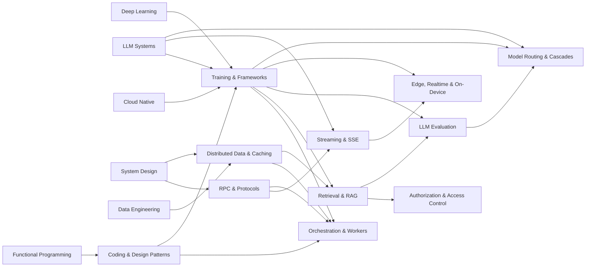

# AI Platform Engineering

The infrastructure layer underneath modern AI products — but taught as **patterns, not products**. Frameworks, protocols, caches, and orchestrators churn constantly; the patterns underneath them barely move. Master the handful of fundamental patterns and every new tool becomes a recognizable instance of something you already understand.

> **The math analogy**: once you understand limits, derivatives, and integrals, every named technique downstream is a special case. The same is true here. *Cache-aside*, *consistent hashing*, *idempotent retry*, *event-sourced replay*, *the worker pool*, *backpressure*, *the decorator* — learn the pattern and how it works, and "what's trending this quarter" becomes derivative. We name the trendy tools (vLLM, Temporal, Redis, gRPC) as **instances of patterns**, and we note how companies apply them, but the pattern is the lesson.

> **Prerequisites**: [Deep Learning](../ml/02-deep-learning/) (transformers, training loops), [LLM Systems & Inference](../ml/04-llm-systems/) (serving, KV cache, parallelism), [System Design](../systems/01-system-design/), [Cloud Native](../systems/03-cloud-native/), [Data Engineering](../data-engineering/) (OLTP vs OLAP, storage), [Functional Programming](../algorithms/13-functional-programming/). Comfortable with [Concurrency & Systems](../algorithms/12-concurrency-systems/).

## Prerequisite Graph

## The Split: Three Different "Distributed" Problems

A recurring confusion is that "distributed X" is one topic. It is three, and this track keeps them separate because the patterns differ:

| Problem | Lives in | The pattern family |
|---------|----------|--------------------|
| **Distributed training** — one model across many GPUs | [01 Training & Frameworks](01-training-and-frameworks/) | Parallelism & sharding (data/tensor/pipeline, FSDP/ZeRO) |
| **Distributed data** — one dataset across many nodes | [04 Distributed Data & Caching](04-distributed-data-and-caching/) | Partitioning, replication, caching, invalidation |
| **Distributed orchestration** — one workflow across many failures | [05 Orchestration & Workers](05-durable-orchestration-and-workers/) | Durable execution, checkpoints, the worker pool |

## Topics

| # | Topic | Pattern lens | Primary Reference | Time |
|---|-------|--------------|------------------|------|
| 01 | [Training & Frameworks](01-training-and-frameworks/) | Parallelism, sharding, adapters | [PyTorch](https://pytorch.org/docs/stable/index.html) + [JAX](https://jax.readthedocs.io/) + [vLLM](https://docs.vllm.ai/) docs | 4-6 weeks |
| 02 | [RPC & Protocols](02-rpc-and-protocols/) | Contracts, serialization, evolution | [gRPC](https://grpc.io/docs/) + [Protobuf](https://protobuf.dev/) docs | 2-3 weeks |
| 03 | [Streaming & SSE](03-streaming-sse/) | Push, backpressure, cancellation | [HTML SSE spec](https://html.spec.whatwg.org/multipage/server-sent-events.html) + [MDN](https://developer.mozilla.org/en-US/docs/Web/API/Server-sent_events) | 1-2 weeks |
| 04 | [Distributed Data & Caching](04-distributed-data-and-caching/) | Partition, replicate, cache, invalidate | [Redis](https://redis.io/docs/latest/) + [Cassandra](https://cassandra.apache.org/doc/latest/) docs + DDIA | 3-4 weeks |
| 05 | [Durable Orchestration & Workers](05-durable-orchestration-and-workers/) | Durable execution, workers, observability, profiling | [Temporal](https://docs.temporal.io/) + [DBOS](https://docs.dbos.dev/) docs | 2-3 weeks |
| 06 | [Coding & Design Patterns](06-coding-and-design-patterns/) | Decorators, facade, closures, currying | [Refactoring Guru](https://refactoring.guru/design-patterns) + [Mostly Adequate Guide](https://mostly-adequate.gitbook.io/mostly-adequate-guide/) | 2-3 weeks |
| 07 | [Retrieval & RAG](07-retrieval-and-rag/) | Encoders, chunking, hybrid fusion, multimodal | [RAG paper](https://arxiv.org/abs/2005.11401) + [BM25](https://www.staff.city.ac.uk/~sbrp622/papers/foundations_bm25_review.pdf) + [pgvector](https://github.com/pgvector/pgvector) | 3-4 weeks |
| 08 | [Authorization & Access Control](08-authorization-and-access-control/) | RBAC/ABAC/ReBAC/NGAC, the pushdown ladder | [NIST RBAC/ABAC/NGAC](https://csrc.nist.gov/projects/role-based-access-control) + [Zanzibar](https://research.google/pubs/pub48190/) | 2-3 weeks |
| 09 | [LLM Evaluation](09-llm-evaluation/) | Cross-entropy/perplexity/bits-per-byte, judges | [MacKay](http://www.inference.org.uk/mackay/itila/) + [HELM](https://crfm.stanford.edu/helm/) + [Ragas](https://docs.ragas.io/) | 2-3 weeks |
| 10 | [Edge, Realtime & On-Device Inference](10-edge-realtime-inference/) | Deployment spectrum, streaming encoders, efficiency architectures | [llama.cpp](https://github.com/ggml-org/llama.cpp) + [Mistral 7B](https://arxiv.org/abs/2310.06825) + [Mamba](https://arxiv.org/abs/2312.00752) | 2-3 weeks |
| 11 | [Model Routing & Cascades](11-model-routing-and-cascades/) | Oracle vs router, cascades, escalation, cache-aware switching, decision models | [RouteLLM](https://arxiv.org/abs/2406.18665) + [FrugalGPT](https://arxiv.org/abs/2305.05176) + [LLMRouterBench](https://arxiv.org/abs/2601.07206) | 1-2 weeks |

## Key Takeaways

- **Learn the pattern, not the product.** vLLM is *continuous batching + paged cache*; Temporal is *event-sourced durable execution + worker pool*; Redis is *an in-memory hash table you must invalidate*. Name the pattern and the tool is interchangeable.
- **"Distributed" is three problems, not one** — training (parallelism), data (partition/replicate/cache), orchestration (durable execution). Different failure modes, different patterns; this track keeps them apart on purpose.
- **Caching is the second-hardest problem in CS, and invalidation is why.** A cache is a lie you tell for speed; every caching pattern (cache-aside, write-through, write-back, TTL) is a different answer to "when does the lie expire?"
- **Durable execution is checkpointing for workflows.** Temporal persists every step (the checkpoint), replays history to recover, runs your code on a pool of **workers**, and gives you distributed observability over long-running processes for free.
- **Profiling beats guessing, always.** Whether it's a GPU kernel, a slow query, a cache miss rate, or a workflow's tail latency — measure first. The bottleneck is rarely where intuition says.
- **Design patterns are how these systems are *built*.** Decorators wrap workflows and retries; the facade hides a serving stack behind one call; closures and currying are how JAX, middleware, and configuration actually work. The patterns in topic 06 recur in every topic above.
- **RAG is information retrieval wearing a neural coat.** Retrieve-then-generate; hybrid (dense + BM25 + graph) fused with RRF; bi-encode to find and cross-encode to rank. Retrieval quality — not the model — is the usual ceiling.
- **Authorization is a complexity-ladder problem.** Flat RBAC is a lookup; nested groups and hierarchies are *graph reachability* (pushdown, not finite-state) — which is why ReBAC/Zanzibar exist, and why secure RAG filters by permission *during* retrieval.
- **Evaluation starts in information theory.** Cross-entropy = bits to predict the next token = compression; perplexity and bits-per-byte are re-normalizations. Intrinsic loss steers training; extrinsic evals (benchmarks, judges, RAG faithfulness) decide if it's good.
- **Inference is a spectrum from datacenter to phone, and "realtime" is an architecture choice.** llama.cpp + GGUF is the end-to-end local path; streaming encoders must be causal/chunked; and Mistral's SWA, GQA, MoE, and Mamba/SSM variants are four different escapes from the vanilla transformer's cost curve.
- **Routing is approximating an oracle you cannot have.** No model is best at everything, so a pool beats its best member, but only on paper. A real router chooses before the outcome exists, has to price the cache it abandons when it switches, and should escalate on category or a verifier, not on model confidence alone.

## How to Use This Track

1. **Coming from ML / research**: [01 Training & Frameworks](01-training-and-frameworks/) → [04 Data & Caching](04-distributed-data-and-caching/) → [05 Orchestration](05-durable-orchestration-and-workers/) — see the platform around your model.
2. **Coming from backend / distributed systems**: [02 RPC](02-rpc-and-protocols/) → [04 Data & Caching](04-distributed-data-and-caching/) → [05 Orchestration](05-durable-orchestration-and-workers/), then loop to training.
3. **Strengthening fundamentals**: start with [06 Coding & Design Patterns](06-coding-and-design-patterns/) — it's the vocabulary the other topics are written in.
4. **Building a GenAI / RAG product**: [07 Retrieval & RAG](07-retrieval-and-rag/) + [01 §embeddings](01-training-and-frameworks/) + [03 Streaming & SSE](03-streaming-sse/) + [04 §caching](04-distributed-data-and-caching/), then [08 Authorization](08-authorization-and-access-control/) for secure/multi-tenant retrieval and [09 Evaluation](09-llm-evaluation/) to measure it.
5. **Cutting an inference bill**: [09 Evaluation](09-llm-evaluation/) first, then [11 Model Routing & Cascades](11-model-routing-and-cascades/) and [01 §small language models](01-training-and-frameworks/). Build the harness before you change which model answers.

See [Study Plan](../STUDY-PLAN.md) for the AI Platform Engineering schedule.
