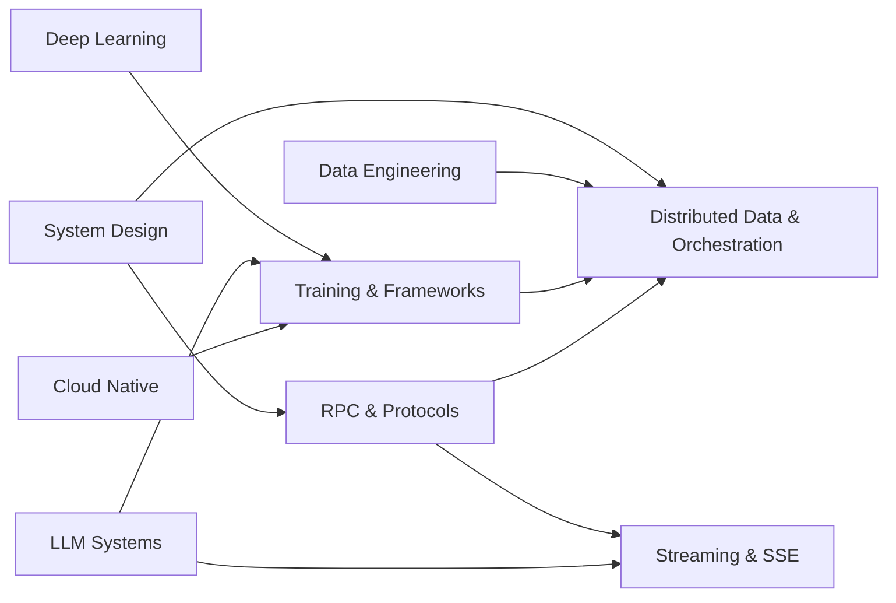

# AI Platform Engineering

The infrastructure layer underneath modern AI products: the frameworks that train and serve models, the protocols services use to talk to each other, the streaming transports that deliver tokens, and the distributed data and durable-orchestration systems that hold it all together. This track sits where [ML Systems](../ml/04-llm-systems/), [Systems & Architecture](../systems/), and [Data Engineering](../data-engineering/) meet — the "platform" an AI Platform Engineer owns.

> **Prerequisites**: [Deep Learning](../ml/02-deep-learning/) (transformers, training loops), [LLM Systems & Inference](../ml/04-llm-systems/) (serving, KV cache, parallelism), [System Design](../systems/01-system-design/), [Cloud Native](../systems/03-cloud-native/), [Data Engineering](../data-engineering/) (OLTP vs OLAP, storage). Comfortable with [Concurrency & Systems](../algorithms/12-concurrency-systems/).

## Prerequisite Graph

## Topics

| # | Topic | Primary Reference | Time |
|---|-------|------------------|------|
| 01 | [Training & Frameworks](01-training-and-frameworks/) | [PyTorch](https://pytorch.org/docs/stable/index.html) + [JAX](https://jax.readthedocs.io/) + [vLLM](https://docs.vllm.ai/) docs (free) | 4-6 weeks |
| 02 | [RPC & Protocols](02-rpc-and-protocols/) | [gRPC](https://grpc.io/docs/) + [Protocol Buffers](https://protobuf.dev/) docs (free) | 2-3 weeks |
| 03 | [Streaming & SSE](03-streaming-sse/) | [HTML SSE spec](https://html.spec.whatwg.org/multipage/server-sent-events.html) + [MDN SSE](https://developer.mozilla.org/en-US/docs/Web/API/Server-sent_events) (free) | 1-2 weeks |
| 04 | [Distributed Data & Orchestration](04-distributed-data-orchestration/) | [Temporal](https://docs.temporal.io/) + [DBOS](https://docs.dbos.dev/) + [Cassandra](https://cassandra.apache.org/doc/latest/) docs (free) + DDIA | 3-4 weeks |

## Key Takeaways

- **Training and serving are one continuum.** PyTorch/JAX define the model; FSDP/DeepSpeed/Megatron scale training across GPUs; vLLM/TGI serve it. An AI platform owns the whole loop — checkpoint in, weights out, tokens served.
- **Embeddings are first-class products, not a side effect.** Hosting an embedding model (creating, fine-tuning, serving at low latency, writing to a vector store) is its own serving discipline with its own SLOs.
- **Small language models change the economics.** SLMs (1-8B) are cheap to fine-tune, fast to serve, and often good enough — distillation, LoRA, and quantization make them the workhorse of production platforms.
- **Services talk over RPC, not ad-hoc HTTP.** gRPC + Protocol Buffers give you typed contracts, code generation, streaming, and an order of magnitude less wire overhead than JSON. The serialization format *is* an architecture decision.
- **Token delivery is a streaming problem.** SSE is the default transport for LLM responses — one-way, text, auto-reconnecting, plain HTTP. Knowing when SSE beats WebSockets or gRPC streaming is core platform knowledge.
- **Durable execution replaces hand-rolled retry logic.** Temporal, Cadence, and DBOS make a multi-step workflow (ingest → embed → index → notify) crash-proof by persisting every step. This is how long-running AI pipelines survive restarts.
- **Storage layout follows access pattern, at scale.** Sharding spreads load; OLTP vs OLAP decides row vs column; Cassandra, Postgres+AGE (graphs), and knowledge graphs each answer a different question. Pick the engine that matches the query.

## Quick Start

1. **Coming from ML / research**: start with [Training & Frameworks](01-training-and-frameworks/) — connect what you know about models to how they scale and ship.
2. **Coming from backend / distributed systems**: start with [RPC & Protocols](02-rpc-and-protocols/) and [Distributed Data & Orchestration](04-distributed-data-orchestration/), then loop back to training.
3. **Building a GenAI product**: [Streaming & SSE](03-streaming-sse/) (deliver tokens) + [Training & Frameworks](01-training-and-frameworks/) §embeddings (RAG retrieval) is the fastest path to a working stack.
4. **Platform / infra role**: do all four in order — this track is designed as the platform engineer's spine.

See [Study Plan](../STUDY-PLAN.md) for the AI Platform Engineering schedule.
</content>
</invoke>
