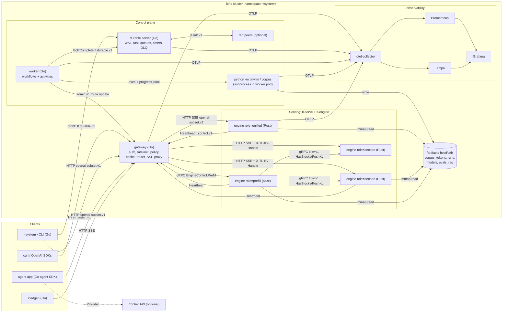

# Supersource Course: Design

| | |
|---|---|
| **Status** | Draft v2: v1 (merged from five design sections: architecture, math and ML catalog, systems catalog, harness and testing, pedagogy) revised against three critic reviews (ordering, ownership, harness realism) |
| **Date** | 2026-10-08 |
| **Branch** | `feat/course` |
| **Scope** | The whole course: the system the learner builds, its contracts, the module catalog, the harness, the chapter template, the learning path, the consolidation of existing content, and the authoring plan |

Contents:

1. Vision and principles (with the merge **Decisions** list in 1.5)
2. The system: architecture, contracts, formats, diagrams
3. Course layout in supersource
4. Module catalog: math, ML spine, systems layers, operations, practices
5. Testing ladder and harness
6. Pedagogy and the chapter template
7. Paths and the spiral (tracer bullet first)
8. Consolidation map
9. Authoring build order
10. Open questions

---

## 1. Vision and principles

### 1.1 What the learner builds

The learner builds **one cohesive engineering system from scratch** and owns all of it at the end: a small LLM platform. It trains a language model on a corpus it cleaned itself, serves it from a native inference engine running its own C kernels, fronts it with a Go gateway, runs long jobs on a durable execution engine it wrote, drives it with an agent SDK it wrote, deploys it on a local Kubernetes cluster, observes it end to end, and keeps it alive through incident drills and interface migrations.

The course principle is **deliver something meaningful**. Every module is a piece of that system with a real call site. Fundamentals with no call site become checked problem sets (`solve`) or optional side quests.

### 1.2 Principles

| # | Principle | Consequence |
|---|---|---|
| P1 | **One system, owned end to end** | Every `build` module declares `used_by` call sites: other modules (never milestones or side quests) that call its code. A build module with no such call site fails `ss verify course` |
| P2 | **The course ships no prebuilt system** | No CLI, server, API, run script, Dockerfile, chart, or CI file is given to the learner. The course ships contracts, chapters, tests, fixtures, and hidden references |
| P3 | **Contracts at every boundary** | Every language crossing goes through a written contract (C header, `.pyi`, Rust trait, Go interface, `.proto`, OpenAPI, file format spec). Conformance suites test the contract, not an implementation |
| P4 | **Four languages, one job each** | Python: math, models, training, data, model evals. C: kernels and runtime. Rust: inference engine and fast tokenizer. Go: control plane (gateway, durable engine, agent SDK, load generator) |
| P5 | **Math becomes code** | Math modules with code have call sites: central differences become `gradcheck`, Newton becomes `rsqrt`, SVD becomes LoRA and MLA initialization, fp8 emulation becomes quantization, categorical sampling becomes the sampler. Pen-and-paper math is a `solve` set checked by SymPy |
| P6 | **Python is the semantic source of truth** | Native ports (C, Rust) are proven by differential tests against the **learner's own Python**, never against a black box |
| P7 | **Tracer bullet first, then spiral** | Pass 1 builds a thin version of every layer end to end. Each later module upgrades one component behind an unchanged contract, or changes a contract through an explicit migration chapter |
| P8 | **Nothing left on its own** | Every chapter has the six beats: Why now, Principles, Worked example, Interface and tests, Pitfalls, Where it's used next |
| P9 | **Every part ends in a milestone run through the learner's own entry points** | `ss milestone` launches the commands the learner declares in `system.toml`, never ours |
| P10 | **Tests are graded by what they catch** | The learner's own tests run against our reference with one planted fault. Mutation score is the grade |
| P11 | **Determinism by construction** | One cross-language RNG spec, one sampling op order, explicit seeds, fixed thread counts in tests, bit-exact where we define the algorithm |
| P12 | **Maintenance is taught** | Drills inject faults into the learner's running cluster. Interface migrations, dependency upgrades, and perf bisects are modules |

### 1.3 Who provides what

| Artifact | Course provides | Learner builds |
|---|---|---|
| Contracts (`tinyllm.h`, `.pyi`, Rust traits, Go interfaces, `.proto`, OpenAPI, format specs) | yes, read-only, vendored | implements them |
| Chapters (guides) | yes, in the tracks | reads them |
| Course tests, conformance and parity suites | yes, vendored at export | runs them via `ss` |
| Fixtures and oracles | yes (small committed, large via `ss fetch`) | uses them |
| Hidden reference implementations | yes, for course CI, mutation grading, and opt-in `--ref-deps`; never exported or published | never reads them unless they choose `ss show` (recorded as `spoiled`). "Hidden" is an **honor system** (D34): `course/ref/` sits in the public repo the learner clones, because `--ref-deps` and mutation grading run locally |
| Library code for every module | stubs only, written by `ss start` | yes |
| CLI, servers, HTTP API handlers, local run scripts | no | yes |
| Dockerfiles, Helm charts, kind config, Tiltfile, CI | no | yes |
| Own test suites | annotated exemplars | yes, graded by mutation testing |
| Docs (ADRs, C4, runbooks, model card, threat model, postmortems) | templates | yes |

### 1.4 Naming

The learner names the system once: `ss course init --name <system>`. The name is stored in `system.toml`. Course text uses the literal placeholder `<system>`. **Contract identifiers never contain the name**, so conformance suites run unchanged against any learner's repo.

| Thing | Uses `<system>`? | Example with `<system>=forge` |
|---|---|---|
| Repo directory, umbrella CLI binary, Helm release prefix, k8s namespace, kind context | yes | `forge/`, `forge`, `forge-gateway`, `ns/forge`, `kind-forge` |
| Python packages | no | `tinyllm`, `corpus` |
| Rust crates | no | `tl-ds`, `tl-tok`, `tl-py`, `tl-sys`, `tl-engine`, `tl-serve` |
| Go module | no | `tinyllm` (packages `tinyllm/gateway/...`); the vendored contracts are a separate module with a dotted path, `supersource.urmzd.com/tl/contracts`, required through a `replace` to `../contracts/go` in `go/go.mod` |
| Helm values schemas | no | `contracts/helm/{gateway,engine,durable,worker,agent}.values.schema.json` |
| C library, header, symbol prefix | no | `libtinyllm`, `tinyllm.h`, `tl_` |
| Proto packages | no | `tl.engine.v1`, `tl.kv.v1`, `tl.control.v1`, `tl.durable.v1`, `tl.raft.v1` |
| Env var prefix, OTel attribute namespace | no | `TL_` (including the API key, `TL_API_KEY`), `tl.*` |

### 1.5 Decisions (merge resolutions)

The five source sections disagreed on ids, paths, and some architecture. Each line records the choice and the reason. These are binding for the rest of this document.

| # | Decision | Rejected alternative(s) | Reason |
|---|---|---|---|
| D1 | **Ids**: math `Mcc.n`, spine `Lp.n`, capstones `C1`/`C2`, solve sets `S-Mcc` split into lettered parts by pass (`S-M07a`), systems, primers, and practices `<area>.NN` (`lang ds rt data dur gw ag load dep obs ops craft ethics review field iv`), side quests `sq.<slug>`, milestones `MS-<slug>` | `llm.p07.rope` (A), single-letter tracks `L8.3`/`W2.4`/`P1.3` (D), `tinyllm.p0.01`/`math.04.01` (E) | Short ids that read as the part or area; one grammar for the harness regex (5.2) |
| D2 | **Learner repo top level** `python/ c/ rust/ go/ deploy/ docs/` (A), Python internals per the math/ML catalog, Go packages per the systems catalog, no Go `internal/` | `tinyllm/ kernels/ engine/ control/` (B, E); `py/ rs/` (C, D) | Course tests must import learner Go packages, which `internal/` forbids; language-named roots make the overlay a path mapping |
| D3 | Harness manifest is **`system.toml`**; service runtime config is **`runtime.toml`** | `course.toml` (A, E), `supersource.toml` (C) | It describes the learner's system, not the course; two files with two jobs |
| D4 | **Fixed contract names** (1.4): Go module `tinyllm`, contracts module `supersource.urmzd.com/tl/contracts`, crates `tl-ds tl-tok tl-py tl-sys tl-engine tl-serve` | Go `github.com/<you>/<system>/go` (A), crates `tl-tensor tl-sampler tl-kv` (D), `tl-tokenizer tl-server` (B) | Tests import fixed names; A's own rule said contract ids never carry the system name |
| D5 | **Data plane is HTTP.** Every engine serves the OpenAI subset over HTTP+SSE; the gateway proxies SSE. gRPC is internal only: `tl.engine.v1.EngineControl` (Prefill, Info, Cancel, Drain), `tl.kv.v1`, `tl.control.v1`, `tl.durable.v1`, `tl.raft.v1` | Gateway to engine over gRPC `Generate` (A) | The Part 10 milestone can run OpenAI conformance against the engine before any gateway exists; the tracer engine is plain HTTP |
| D6 | KV transfer is gRPC `tl.kv.v1` with content-hash dedup (`HasBlocks`, `PushKv`) | framed TCP `TLKV` (C), per-layer proto (B) | Dedup by hash reuses the prefix-cache hash; one RPC stack |
| D7 | **Rust owns the model graph** (L10.1 forward over C kernels via `tl-sys`); C owns kernels and runtime | C full forward `tl_model_forward` in `model.c` (B) | Avoids a third copy of the model graph; the Rust engine is substantive. L9.7 becomes the Python `--backend c` dispatch that proves kernels before Rust exists |
| D8 | Python reaches Rust through **PyO3** (`tl-py`, module `tinyllm_rs`); Python reaches C through **ctypes** | `tok.h` C ABI cdylib (A) | One binding per pair; PyO3 releases the GIL for batch encode |
| D9 | Python talks to the platform **only through the subprocess activity contract** (2.8). The Go worker execs Python. Two named exceptions: OTLP telemetry export (obs.05), and the optional L12 rollout client, which calls the engine's HTTP API | Python gRPC worker client (C dur.09); HTTP durable client API `durable.v1.yaml` (C) | Training and data stay testable without a cluster; no Python proto toolchain; one durable protocol (gRPC) |
| D10 | **RNG**: PCG32 (XSH-RR 64/32), SplitMix64 for seed derivation, `uniform_f64` from two u32 draws (53 bits) | xoshiro256\*\* (D); 24-bit float (B); A's `<<21 ^` mix | One spec; `M06.3` moves to Pass 2 because `L0` APIs take `rng: PCG32` |
| D11 | Sampling op order: penalties, temperature, top-k, top-p, min-p, f64 softmax, one uniform, inverse CDF; ties to the lowest id; `temperature == 0` is greedy | per-section variants | Bit-identical Python and Rust streams |
| D12 | **C ABI**: umbrella `tinyllm.h` over per-unit headers; raw pointers plus explicit dims; constructors return `tl_status` with an out param; `_create`/`_destroy`; positive status codes; allocator hook and thread-local `tl_last_error` | `tl_tensor` struct API (A); negative codes (C) | ctypes-friendly, per-unit ownership, fault injection via the allocator hook |
| D13 | KV block pool API from the systems catalog (`rt.04`), block hash = chained FNV-1a 64 over full blocks only, KV format v1 f16; v2 fp8 e4m3 with per-(layer, head) scales arrives only through the `craft.13` migration. Both share one export envelope (2.9) | xxh64 (C), int8 v2 (A) | FNV-1a is hand-implementable in every language; fp8 reuses `M09.4`; shipping v2 early would leave the migration nothing to migrate |
| D14 | Runtime pieces: `L9.0` dissolves into `rt.01` to `rt.03`; `L8.3` is the Python paged cache over `rt.04` | three overlapping owners (B L9.0/L8.3, C rt.*, E p9.02/p9.06) | One owner per unit |
| D15 | **Ownership unit is a source file** in every language. A later module may take over a unit with `upgrades = [...]`; the earlier module's tests become its smoke regression | crate- or package-level units (D) | All of `tl-engine` would otherwise be one module; `upgrades` is how the spiral works |
| D16 | **Entry points are learner territory**: CLI mains, server mains, `go/cmd/*`, `deploy/`, `docs/`. They are never overlaid and are verified only by milestones, conformance suites, and artifact checks. `--ref-deps` substitutes library units only | `--ref-deps loadgen` substituting a binary (B) | Decision 2: no prebuilt system |
| D17 | Data formats: parquet text shards and llm.c `.bin` token streams (A). Data modules renumbered `data.01` fetch to `data.09` workflow | tokens in parquet (C), `.bin + .idx` (E) | The training loader memory-maps a flat token stream |
| D18 | Metrics follow OTel GenAI semantic conventions plus `tl.*`; services also expose Prometheus `/metrics` on the health port (`:9464` in k8s, `{health_port}` locally) for tests. SLO defaults from A, scaled by `ss bench --calibrate`, which runs inside the cluster for SLOs checked on kind | `tl_engine_ttft_seconds` (C), `tinyllm_ttft_seconds` (D) | One naming source; portable budgets |
| D19 | API keys `tl_<id>_<secret>`, stored as HMAC-SHA256 with a pepper | `tl-<base32>` plus SHA-256 (A) | O(1) lookup by id; pepper limits damage from a leaked key file |
| D20 | **Placement**: `L11.1` (mixed precision, accumulation, recompute) is core before `C1`; `L11.2` and `L11.3` optional, tensor and pipeline parallelism side quests; `L12` post-training optional after `C1` | core post-training in the agents pass (E) | `C1` needs `L11.1` to finish on a laptop; a 10M TinyStories model cannot drive a tool-calling agent, so agents use the learner's gateway serving SmolLM2-135M-Instruct (a fetched third-party model, labelled as such in the model card) on the learner's engine, or a frontier provider through the same `Provider` |
| D21 | Prefix bloom in heartbeats dropped; routing is consistent hash with bounded loads plus queue depth | bloom-refined routing (A) | Fewer moving parts; kept as side quest `sq.prefix-bloom` |
| D22 | **Course layout** is the harness section's `course/` tree with one `course/modules/<ID>.toml` per module and a generated `modules.tsv`; `course/ref/` mirrors the learner layout path for path | `modules.tsv` as hand-edited source (E); bundled `course/modules/<layer>/<nn>/CHAPTER.md` (C) | TOML carries smoke tests, learner-test grading, and `upgrades`; chapters belong in tracks |
| D23 | **Chapter homes** in tracks: spine `ml/08-tinyllm/pNN-<slug>/NN-<slug>.md`; new math topics `00-precalculus`, `08-matrix-calculus-and-autodiff`, `09-numerical-methods-and-floating-point`, `10-optimization`, `11-information-theory`; ethics as new top-level track `responsible-ai/`; durable chapters in `ai-platform-engineering/05-durable-orchestration-and-workers/` | `ml/tinyllm/pNN/mNN/README.md` (A); ethics under craftsmanship (A); durable under `infrastructure/` (A) | Matches existing numbering; decision 9 calls ethics a track; decision 12 merges infra/03 into ai-platform/05 |
| D24 | The guide (front door, system map, pass intros, milestone pages) lives in `paths/course*/` | guide in `course/` | Existing rule: a path holds its manifest, README, and material about the path |
| D25 | **Milestones** use one namespace `MS-*`: part milestones (`MS-L0`...), component milestones (`MS-corpus`, `MS-gateway`, `MS-durable-ha`, ...), and pass gates `MS-P0` to `MS-P11` composed of them. Milestones are not module kinds | `MS-L0` only (B), `M-engine` (C), `M0`...`M11` (E), `L8.M` (D) | Keeps every check and gives passes a single gate |
| D26 | Test `KIND` vocabulary: `unit boundary property statistical differential golden gradcheck learning conformance fault regression bench eval` | B's letter codes, C's tiers | One tag set for lint and `ss tests` |
| D27 | Fixtures: at most 50 MiB committed, at most 8 MiB per file, a committed-fixture budget per authoring batch (section 9); the TinyStories slices, token streams, and tiny HF models are pinned assets fetched by `ss fetch`; maintainer generators in `course/oracle/` | 20 MB (A), 60 MB (B), 2 MiB per file (D) | Committing the corpora and tiny models alone would use the whole budget and grow history on every regeneration |
| D28 | `ss course init` creates the learner repo (default `.scratchpad/course/`, override `SS_COURSE_HOME`); `ss export` produces the standalone repo with vendored tests | `ss export --name` as the creation step (A, E) | The learner works in a git repo from day one; export adds vendoring |
| D29 | Practice exercises stay as standalone warm-up drills with a pointer to their course module. Hash maps consolidate: `c/02` becomes the `ds.02` baseline, the `rust/03` README row points to `ds.05` (authored fresh), `cpp/03` is archived, zig and java hash-map rows are dropped, `swiss-table/` is removed | retiring the C drills (E) | Only the C and C++ drills have references and pass CI. The Rust, Go, Python, Zig, Java, Scala, and TypeScript build directories hold a README exercise list only, so their mappings are README pointers, not code |
| D30 | Load generator is Go (`load.01`); `ml/04-llm-systems/serving-and-load/code/loadgen.py` becomes reading | Python loadgen | Control plane is Go (decision 3) |
| D31 | **Spine content without a call site stays optional.** ELMo (`L3.5`), T5 span corruption (`L6.4`), and the ALiBi part of `L7.4` are optional modules with side-quest call sites. Unigram (`L1.4`, C1 tokenizer ablation) and ELECTRA (`L6.3`, alternative classification backbone in the model zoo) are core | everything in decision 5 core | Decision 1 outranks the topic list of decision 5: a module with no call site in the final system is optional |
| D32 | **The tracer is byte-level**: vocabulary of 256 ids equal to UTF-8 bytes, no `tokenizer.json`; `config.json` declares `tl_tokenizer = "bytes"`. Every engine keeps serving `tl_arch = bigram` with the byte tokenizer, so the tracer smoke stays green for the whole course | char tokenizer in Pass 1 (B); BPE with zero merges (critic) | No P1 tokenizer module is needed and the Rust tracer needs no JSON parser |
| D33 | **Usage-policy classifier** = a linear head (L6.5 `SequenceClassifier(pool='mean')` fitted with M07.7 IRLS) over the learner engine's `/v1/embeddings`, exported as `formats/linear-head.schema.json` and evaluated in Go by `gw.08` | Python-served BERT classifier; new engine `/v1/classify` | Python never serves HTTP (D9); no new engine endpoint; Go evaluates a dot product |
| D34 | **References are an honor system**: `course/ref`, `course/mutants`, and solve keys live in the public repo, are never exported or published, and reading them is recorded only through `ss show` | private submodule fetched by course CI | `--ref-deps` and mutation grading must run on the learner's machine |
| D35 | **Course tests assert through frozen helpers** (`course/tests/_lib`, `ss_test.h`, `tl-contracts::testing`, `contracts/go/testing`) and construct RNGs from the frozen PCG32 there. The learner's own `gradcheck`, tolerance helpers, and PCG32 decide only their own modules' verdicts | course tests calling the learner's `gradcheck` and `tolerance` through the overlay | A gradcheck that always returns ok would otherwise pass every later test |
| D36 | **Model zoo**: every `tl_arch` family loads through the checkpoint contract and is evaluated by `L6.7`'s zoo suite, which the `EvalSuite` workflow (`dur.11`) runs. This is the call site of `L2.*`, `L3.*`, `L4.*`, `L5.5`, and `L6.1` to `L6.3` | "referenced by a milestone step" as a call site | Decision 1: a real call site in the final system, not a milestone |
| D37 | **Engine scope**: speculative decoding (`L10.8`) and tool calls with constrained JSON decoding (`L10.9`) are core engine modules; multi-LoRA serving is `sq.multi-lora` | spec decoding only in Python; multi-LoRA as optional `L10.8` | `L8.6` and `L8.7` need a production call site; MS-agent needs `tool_calls` from the learner's engine |
| D38 | **Language and tool primers** `lang.01` to `lang.11` precede the first module that uses each language or tool; chapters in `software-craftsmanship/12-language-and-tool-primers/` | assume prior fluency | A learner starting from high-school algebra meets C, Rust, Go, Docker, and Kubernetes in Pass 1 |

---

## 2. The system

### 2.1 Components

| # | Component | Lang | Learner path | Responsibilities | Built in |
|---|---|---|---|---|---|
| 1 | `tinyllm` | Python | `python/tinyllm/` | numerics, autograd, gradcheck, nn layers, tokenizers, every model family from Parts 2 to 7, training loop, optimizers, safetensors and checkpoints, HF loader, model evals, reference sampler and inference algorithms, ctypes backend, training at scale, post-training | math, L0 to L12 |
| 2 | `corpus` | Python | `python/corpus/` | fetch with license capture, normalize and filter, exact dedup (Bloom), MinHash LSH near-dup (union-find), PII scrub, parquet shards, tokenize to `.bin`, data ledger and datasheet | `data.*` |
| 3 | `libtinyllm` | C | `c/` | runtime (ABI, arena, thread pool, KV block pool), numerics (Newton rsqrt, `expf`, fp8/bf16/fp16, PCG32), kernels (matmul, online softmax, FlashAttention forward, paged attention, fused int4 dequant matmul, RMSNorm, RoPE, SiLU-mul, top-k), data structures (vec, Swiss table, LRU) | `rt.*`, L9, `ds.01` to `ds.04`, math numerics |
| 4 | `tl-ds` | Rust | `rust/crates/tl-ds/` | Robin Hood map, lazy binary heap, radix tree over token ids, Bloom filter | `ds.05` to `ds.08` |
| 5 | `tl-tok` | Rust | `rust/crates/tl-tok/` | byte-level BPE (GPT-2 exact), `tokenizer.json` loader, streaming UTF-8 decoder, batch encode | L1.5 |
| 6 | `tl-py` | Rust | `rust/crates/tl-py/` | PyO3 module `tinyllm_rs`: tokenizer and Bloom filter for Python | L1.5, `ds.08` |
| 7 | `tl-sys` | Rust | `rust/crates/tl-sys/` | hand-written `extern "C"` bindings for `tinyllm.h`, RAII wrappers; links `c/build/libtinyllm.a` (honors `TINYLLM_C_LIB_DIR`) | L10.0, L10.1 |
| 8 | `tl-engine` | Rust | `rust/crates/tl-engine/` (lib target) | mmap safetensors, Llama-family forward over C kernels (plus the tracer `bigram` arch), sampler (bit-identical with Python given the same logits), prefix cache, block manager, scheduler (continuous batching, chunked prefill, preemption), quantized weights, speculative decoding, constrained JSON decoding, KV transfer, heartbeat client, roles `unified`/`prefill`/`decode` | L8.4, L10.1 to L10.4, L10.6, L10.8, L10.9 |
| 9 | `tl-serve` | Rust | `rust/crates/tl-serve/` (lib target plus the learner's `main.rs`) | OpenAI-compatible HTTP + SSE (tokio + hyper after the tracer), tool-call parsing, bounded admission, abort on disconnect, `EngineControl` gRPC, metrics and OTel | L10.0, L10.5 to L10.7, L10.9 |
| 10 | gateway | Go | `go/gateway/...`, `go/cmd/gateway` | auth, rate limits, usage policy, response cache, SSE proxy, worker registry, routing (consistent hash with bounded loads, cascades, failover, disaggregated orchestration), usage ledger, admin API | `gw.*` |
| 11 | durable | Go | `go/durable/...`, `go/cmd/durable` | Temporal-like server: segmented WAL event log, task queues with visibility timeout, fenced leases, retries, DLQ, durable timers, signals, history replay; optional Raft HA | `dur.*` |
| 12 | durable SDK and worker | Go | `go/durable/{workflow,activity,worker}`, `go/workflows/`, `go/activities/`, `go/cmd/worker` | deterministic replay executor, `ExecuteActivity`, `Sleep`, signals, `SideEffect`, `GetVersion`, `ContinueAsNew`; workflows `CorpusBuild` (data.09), `TrainRun` and `EvalSuite` (dur.11), `ModelRelease` (dur.12), `AgentRun` (ag.05); subprocess activity runner for Python (dur.09); PromQL and route-update activities (dur.12) | `dur.*`, `data.09`, `ag.05` |
| 13 | agent SDK | Go | `go/agent/...` | saige-shaped: `Provider` (OpenAI-compatible, pointed at the learner's gateway or a frontier API), streaming loop with typed deltas, tools, gates, durable runs, RAG (BM25 + vectors + RRF + MMR), eval (scorers, LLM judge, pairwise judge, A/B experiments) | `ag.*` |
| 14 | loadgen | Go | `go/loadgen/`, `go/cmd/loadgen` | open-loop Poisson and closed-loop load, TTFT/TPOT/ITL/E2E histograms, run comparison gate | `load.*` |
| 15 | `ds` (Go) | Go | `go/ds/ring/` | consistent hash ring with bounded loads | `ds.09` |
| 16 | umbrella CLI | Go | `go/cmd/<system>` | `chat`, `complete`, `data build`, `train`, `eval`, `release`, `agent`, `keys`, `wf`, `usage`, `load` | learner-designed, throughout |
| 17 | deploy | YAML, Docker | `deploy/` | Dockerfiles, Helm chart per component, kind cluster, Tiltfile, OTel collector, dashboards, SLO rules | `dep.*`, `obs.*` |

Python never speaks gRPC or HTTP to the platform. It reaches the rest of the system through files, ctypes, PyO3, and subprocess exit codes. That boundary is deliberate: the training stack is testable without a cluster. Two exceptions are named in D9: Python exports OTLP telemetry to the collector, and the optional L12 GRPO rollout client calls the engine's HTTP API.

### 2.2 Architecture diagram



The C4 version of this diagram (context, containers, engine components) is learner-written in D2 under `docs/c4/` (`craft.09`). The reference version lives in `course/ref/docs/c4/` and is never exported.

### 2.3 Interface boundary matrix

All contract paths are relative to `course/contracts/` (vendored to the learner's `contracts/`). All suites are under `course/conformance/`.

| From | To | Mechanism | Contract | Conformance suite |
|---|---|---|---|---|
| Python | C | ctypes over `libtinyllm.{dylib,so}` | `c/include/tinyllm.h` | `abi/` (Python drives each function against numpy; struct layout via `ctypes.sizeof`) |
| Python | Rust | PyO3 module `tinyllm_rs` | `py/tinyllm_rs.pyi` | `parity/tokenizer.bpe`, `parity/bloom` |
| Rust engine | C | static link via `tl-sys` | `c/include/tinyllm.h` | same ABI suite, driven from Rust |
| Python training | Rust engine | files | `formats/safetensors.md`, `formats/config.schema.json`, `formats/tokenizer.md` (including the `bytes` tokenizer, D32) | `formats/` |
| Python corpus | Python training | files | `formats/corpus-shard.md`, `formats/tokens-bin.md`, `formats/ledger.schema.json` | `formats/` |
| Python sampler | Rust sampler | spec | `spec/pcg32.md`, `spec/sampling.md` | `parity/rng`, `parity/sampler` (golden ids from shared fixture logits) |
| any client | engine | HTTP | `openapi/openai-subset.v1.yaml` (engine tier) | `openapi/` (`ss conform openapi:v1 --target engine`) |
| any client | gateway | HTTP | `openapi/openai-subset.v1.yaml`, `openapi/admin.v1.yaml` | `openapi/` (`--target gateway`), `admin/` |
| gateway | engine (control) | gRPC | `proto/tl/engine/v1/engine.proto` | `engine-grpc/` |
| engine prefill | engine decode | gRPC | `proto/tl/kv/v1/kv.proto` + `formats/kv-block.md` | `kv/`, `parity/kv.wire.v1` |
| gateway | engine decode (abort path) | gRPC `KvTransferService.Release` | `proto/tl/kv/v1/kv.proto` | `kv/` (release frees the handle's blocks) |
| gateway policy | engine | HTTP `/v1/embeddings` + a linear head file (D33) | `openapi/openai-subset.v1.yaml`, `formats/linear-head.schema.json` | `formats/`, `openapi/` `policy.451` |
| engine | gateway registry | gRPC | `proto/tl/control/v1/control.proto` | `engine-grpc/` |
| worker, CLI | durable | gRPC | `proto/tl/durable/v1/durable.proto` | `durable/` (incl. replay determinism) |
| durable | durable | gRPC | `proto/tl/raft/v1/raft.proto` | `raft/` (partition script, linearizability check) |
| Go worker | Python | subprocess + files | `spec/subprocess-activity.md` | `activity/` |
| all services | collector | OTLP gRPC `:4317`; OTLP/HTTP JSON `:4318` for the std-only tracer engine | `otel/semconv.md`, `otel/metrics.yaml` | `otel/` (span tree from a recorded trace) |
| all services | config | TOML + env | `config/runtime.schema.json` | `config/` |
| harness | learner | TOML | `config/system.schema.json` | `ss` validates `system.toml` on every milestone |

### 2.4 C ABI: `tinyllm.h`

`c/include/tinyllm.h` is an umbrella header. Each unit has its own header under `c/include/tinyllm/`, which is what makes per-file ownership (D15) possible. `c/ABI.md` holds the rules:

- The caller owns every buffer. No function allocates except `*_create`, and those allocate through the allocator hook.
- No callbacks across the boundary except `tl_parallel_for`'s range function, which stays inside C.
- Shapes and strides are `int64_t`. Matrices are row-major with explicit leading dimensions.
- Every public struct's layout is asserted by `conformance/abi/layout_test.py` with `ctypes.sizeof` and `ctypes.offsetof`.
- `nm` on `libtinyllm` exports only `tl_` symbols. The check normalizes names first (Mach-O prefixes a leading `_`).
- **Enums never cross the boundary as C enum types.** `tl_status` and `tl_dtype` are `typedef int32_t` with named constants, and struct fields that carry them are `int32_t`, because a Rust `repr(C)` enum holding an unknown value is undefined behavior. Rust and Python map unknown values to an error.
- **Thread safety.** Kernels are reentrant. Stateful objects (`tl_arena`, `tl_kv_pool`, `tl_map`, `tl_lru`) are **not thread-safe**: the caller serializes access (the Rust engine owns the pool behind one `Mutex` used by the step loop and the KV-transfer tasks). `tl_last_error` is `_Thread_local`.
- Threads use **pthreads** only (`<threads.h>` is missing on macOS).
- **Batch invariance** (L9.1, L9.3, L9.4): each output element's reduction over K (or over keys) uses one fixed order, independent of M, of the row's position in the batch, and of the query tile; key tiles are aligned to absolute key positions. Row `i` of a product computed with `M = 1` equals row `i` computed with `M = 37` bitwise. This is what makes batched and chunked greedy output equal the serial output.
- Bindings resolve symbols **lazily**, on first use (the `rt.01` loader contract), and the harness always links a stub object (every function returns `TL_EUNSUPPORTED` or the type's zero value with `tl_last_error` set) for units not yet started, so a partial library always loads.
- Bumping `TL_ABI_VERSION`'s major part is a migration (`craft.13` style); Python and Rust bindings refuse a mismatched major.

```c
/* contracts/c/include/tinyllm.h  (ABI v1) */
#ifndef TINYLLM_H
#define TINYLLM_H
#include "tinyllm/abi.h"         /* rt.01 */
#include "tinyllm/arena.h"       /* rt.02 */
#include "tinyllm/pool.h"        /* rt.03 */
#include "tinyllm/kv_pool.h"     /* rt.04 */
#include "tinyllm/ds.h"          /* ds.01 to ds.03 */
#include "tinyllm/topk.h"        /* ds.04 */
#include "tinyllm/numerics.h"    /* M06.3, M09.4, M09.5, M09.6 */
#include "tinyllm/matmul.h"      /* M03.1 (v0), L9.1 */
#include "tinyllm/softmax.h"     /* L9.2 */
#include "tinyllm/attention.h"   /* L9.3, L9.4 */
#include "tinyllm/qmatmul.h"     /* L9.5 */
#include "tinyllm/elementwise.h" /* L9.6 */
#endif
```

```c
/* tinyllm/abi.h  (rt.01) */
#include <stddef.h>
#include <stdint.h>
#define TL_ABI_VERSION 1
uint32_t    tl_abi_version(void);                       /* returns TL_ABI_VERSION */

typedef int32_t tl_status;                               /* never a C enum type across the ABI */
enum { TL_OK = 0, TL_EINVAL = 1, TL_ENOMEM = 2, TL_ESHAPE = 3, TL_EDTYPE = 4,
       TL_EFULL = 5, TL_ENOTFOUND = 6, TL_EFORMAT = 7, TL_EBUSY = 8,
       TL_EUNSUPPORTED = 9, TL_EIO = 10 };
const char *tl_status_str(tl_status s);
const char *tl_last_error(void);                        /* _Thread_local, valid until the next tl_ call */

typedef int32_t tl_dtype;
enum { TL_F32 = 0, TL_F16 = 1, TL_BF16 = 2, TL_F8_E4M3 = 3, TL_F8_E5M2 = 4,
       TL_I8 = 5, TL_U8 = 6, TL_I32 = 7, TL_Q4_G = 8 };

typedef struct { void *(*alloc)(void *user, size_t n, size_t align);
                 void  (*free)(void *user, void *p); void *user; } tl_allocator;
tl_status tl_set_allocator(const tl_allocator *a);      /* NULL restores malloc; used for fail-after-n tests */

/* tinyllm/arena.h  (rt.02) */
typedef struct tl_arena tl_arena;
typedef struct { size_t offset; size_t block; } tl_arena_mark;
typedef struct { size_t bytes_used, bytes_reserved, high_water, n_blocks; } tl_arena_stats;
tl_status     tl_arena_create(size_t block_bytes, tl_arena **out);
void         *tl_arena_alloc(tl_arena *a, size_t n, size_t align);   /* NULL + tl_last_error on failure */
tl_arena_mark tl_arena_mark_get(const tl_arena *a);
void          tl_arena_reset_to(tl_arena *a, tl_arena_mark m);
void          tl_arena_stats_get(const tl_arena *a, tl_arena_stats *out);
void          tl_arena_destroy(tl_arena *a);

/* tinyllm/pool.h  (rt.03) */
typedef struct tl_pool tl_pool;
typedef void (*tl_range_fn)(void *ctx, int64_t lo, int64_t hi, int worker);
tl_status tl_pool_create(int n_threads, tl_pool **out);  /* 0 = hardware concurrency */
tl_status tl_parallel_for(tl_pool *p, int64_t n, int64_t grain, tl_range_fn fn, void *ctx); /* blocks; p may be NULL (serial) */
void      tl_pool_destroy(tl_pool *p);

/* tinyllm/kv_pool.h  (rt.04); hashing and the export envelope in formats/kv-block.md.
   Not thread-safe: the caller serializes every call on one pool. */
typedef struct tl_kv_pool tl_kv_pool;
typedef struct { uint32_t n_blocks, block_tokens, n_layers, n_kv_heads, head_dim;
                 int32_t  dtype;            /* tl_dtype: TL_F16 in format v1 (TL_F8_E4M3 in v2, craft.13) */
                 uint32_t format; } tl_kv_cfg;  /* format 1 only until the craft.13 migration; else TL_EUNSUPPORTED */
typedef struct { uint32_t free, used, cached, evictions; } tl_kv_stats;
tl_status tl_kv_pool_create(const tl_kv_cfg *cfg, tl_kv_pool **out);
void      tl_kv_pool_destroy(tl_kv_pool *p);
tl_status tl_kv_alloc(tl_kv_pool *p, uint32_t n, uint32_t *ids);       /* refcount 1 each; TL_EFULL when exhausted */
void      tl_kv_ref(tl_kv_pool *p, uint32_t id);
tl_status tl_kv_unref(tl_kv_pool *p, uint32_t id);                     /* 0: cached if registered, else free; double unref = TL_EINVAL */
tl_status tl_kv_cow(tl_kv_pool *p, uint32_t id, uint32_t *out);         /* copies iff refcount > 1 */
uint64_t  tl_kv_block_hash(uint64_t parent, const uint32_t *toks, uint32_t n);  /* chained FNV-1a 64; n == block_tokens only */
tl_status tl_kv_register(tl_kv_pool *p, uint32_t id, uint64_t hash);    /* full blocks only; index backed by the ds.02 Swiss table */
tl_status tl_kv_lookup(tl_kv_pool *p, uint64_t hash, uint32_t *id);     /* hit: ref++ and LRU touch; else TL_ENOTFOUND */
void     *tl_kv_block_ptr(tl_kv_pool *p, uint32_t id, uint32_t layer, int is_v);
size_t    tl_kv_block_bytes(const tl_kv_pool *p);
tl_status tl_kv_export(const tl_kv_pool *p, const uint32_t *ids, uint32_t n, void *buf, size_t cap, size_t *written); /* export envelope, 2.9 */
tl_status tl_kv_import(tl_kv_pool *p, const void *buf, size_t len, uint32_t *ids_out); /* bad magic, CRC, or version: TL_EFORMAT */
void      tl_kv_stats_get(const tl_kv_pool *p, tl_kv_stats *out);       /* invariant: free + used + cached == n_blocks */

/* tinyllm/ds.h  (ds.01 to ds.03) */
typedef struct { void *data; size_t len, cap, elem; } tl_vec;
tl_status tl_vec_init(tl_vec *v, size_t elem);
tl_status tl_vec_reserve(tl_vec *v, size_t cap);
tl_status tl_vec_push(tl_vec *v, const void *x);                        /* on failure the vec is unchanged */
void     *tl_vec_at(const tl_vec *v, size_t i);
void      tl_vec_free(tl_vec *v);
typedef struct tl_map tl_map;                                            /* Swiss table, u64 -> u64 */
tl_status tl_map_create(size_t hint, tl_map **out);
tl_status tl_map_put(tl_map *m, uint64_t k, uint64_t v);
int       tl_map_get(const tl_map *m, uint64_t k, uint64_t *v);          /* 1 found, 0 not */
int       tl_map_del(tl_map *m, uint64_t k);
size_t    tl_map_len(const tl_map *m);
void      tl_map_destroy(tl_map *m);
typedef struct tl_list_node { struct tl_list_node *prev, *next; } tl_list_node;  /* intrusive, container_of */
typedef struct { tl_list_node head; size_t len; } tl_lru;
void          tl_lru_init(tl_lru *l);
void          tl_lru_touch(tl_lru *l, tl_list_node *n);                  /* insert or move to most recent */
void          tl_lru_remove(tl_lru *l, tl_list_node *n);
tl_list_node *tl_lru_pop_oldest(tl_lru *l);

/* tinyllm/topk.h  (ds.04) */
tl_status tl_topk_f32(const float *x, int64_t n, int64_t k, int32_t *idx, float *val); /* ties: lower index wins; NaN: TL_EINVAL */

/* tinyllm/numerics.h */
typedef struct { uint64_t state, inc; } tl_pcg32;                       /* M06.3, spec/pcg32.md */
void     tl_pcg32_seed(tl_pcg32 *r, uint64_t seed, uint64_t seq);
uint32_t tl_pcg32_next(tl_pcg32 *r);
double   tl_pcg32_uniform(tl_pcg32 *r);                                 /* two draws, 53-bit */
uint8_t  tl_f32_to_e4m3(float x);  float tl_e4m3_to_f32(uint8_t b);      /* M09.4: RNE, saturating */
uint8_t  tl_f32_to_e5m2(float x);  float tl_e5m2_to_f32(uint8_t b);
uint16_t tl_f32_to_bf16(float x);  float tl_bf16_to_f32(uint16_t b);
uint16_t tl_f32_to_f16(float x);   float tl_f16_to_f32(uint16_t b);
float    tl_rsqrtf(float x);       void tl_rsqrt_f32(const float *x, float *y, int64_t n);   /* M09.5 */
float    tl_expf(float x);         void tl_exp_f32(const float *x, float *y, int64_t n);     /* M09.6 */

/* tinyllm/matmul.h  (M03.1 naive v0, upgraded by L9.1 tiled; same symbol and signature) */
tl_status tl_matmul_f32(const float *A, const float *B, float *C, int64_t M, int64_t N, int64_t K,
                        int64_t lda, int64_t ldb, int64_t ldc, float alpha, float beta,
                        int trans_b, tl_pool *tp);                       /* C = alpha*A@B(^T) + beta*C; batch-invariant from L9.1 */

/* tinyllm/softmax.h  (L9.2) */
tl_status tl_softmax_f32(const float *x, float *y, int64_t rows, int64_t cols);         /* 3-pass */
tl_status tl_softmax_online_f32(const float *x, float *y, int64_t rows, int64_t cols);  /* 2-pass, running max */

/* tinyllm/attention.h  (L9.3, L9.4); tensors [B,H,T,D] row-major */
tl_status tl_flash_attn_fwd_f32(const float *q, const float *k, const float *v, float *o, float *lse,
                                int64_t B, int64_t H, int64_t Hkv, int64_t Tq, int64_t Tk, int64_t D,
                                float scale, int64_t q_offset, int causal, int64_t window,
                                const float *sink_logits /* nullable [H] */, int64_t Br, int64_t Bc,
                                tl_arena *scratch, tl_pool *tp);
tl_status tl_paged_attn_decode_f32(const float *q, const tl_kv_pool *kv, uint32_t layer,
                                   const uint32_t *block_tables, int32_t max_blocks, const int32_t *ctx_lens,
                                   float *out, int64_t B, int64_t H, int64_t Hkv, int64_t D,
                                   float scale, int64_t window, tl_pool *tp);

/* tinyllm/qmatmul.h  (L9.5); int4 layout in formats/safetensors.md */
tl_status tl_matmul_q4_f32(const float *x, const uint8_t *wq, const uint16_t *scales_f16,
                           float *y, int64_t M, int64_t N, int64_t K, int64_t group, tl_pool *tp);
tl_status tl_matmul_q8_f32(const float *x, const int8_t *wq, const float *scales,
                           float *y, int64_t M, int64_t N, int64_t K, tl_pool *tp);

/* tinyllm/elementwise.h  (L9.6) */
void    tl_rmsnorm_f32(const float *x, const float *w, float *y, int64_t rows, int64_t d, float eps);
void    tl_rope_f32(float *x, const int32_t *pos, int64_t T, int64_t H, int64_t D, int64_t d_rot,
                    const float *inv_freq, float attn_scaling, int layout /* 0 half, 1 interleaved */);
void    tl_silu_mul_f32(const float *gate, const float *up, float *y, int64_t n);
void    tl_embedding_f32(const float *table, const int32_t *ids, float *out, int64_t n, int64_t d);
void    tl_add_f32(const float *a, const float *b, float *y, int64_t n);
int32_t tl_argmax_f32(const float *x, int64_t n);                       /* ties: lowest index */
```

CUDA variants (side quest `sq.cuda-kernels`, never in CI) keep the same signatures with a `_cuda` suffix.

### 2.5 Python to Rust: `tinyllm_rs`

```python
# contracts/py/tinyllm_rs.pyi  (built by `cargo build -p tl-py`; maturin optional)
class Bpe:
    @staticmethod
    def from_hf_json(path: str) -> "Bpe": ...
    def encode(self, text: str) -> list[int]: ...
    def encode_batch(self, texts: list[str], threads: int) -> list[list[int]]: ...   # releases the GIL
    def decode(self, ids: list[int]) -> str: ...
    def vocab_size(self) -> int: ...
class Bloom:
    @staticmethod
    def with_rate(n: int, p: float) -> "Bloom": ...
    def insert(self, item: bytes) -> None: ...
    def contains(self, item: bytes) -> bool: ...
    def union(self, other: "Bloom") -> None: ...
    def to_bytes(self) -> bytes: ...
    @staticmethod
    def from_bytes(b: bytes) -> "Bloom": ...
```

Build contract for `tl-py` (checked by the contract pre-check): `crate-type = ["cdylib"]`, PyO3 features `abi3-py311` and `extension-module`, and on macOS the link argument `-undefined dynamic_lookup` (in `.cargo/config.toml` or `build.rs`). The harness sets `PYO3_PYTHON` to the interpreter of the learner's uv environment and copies `libtl_py.dylib` to `tinyllm_rs.so` in `TINYLLM_PYEXT_DIR`.

### 2.6 HTTP surface (OpenAPI)

Files: `openapi/openai-subset.v0.yaml` (tracer), `openai-subset.v1.yaml`, `openai-subset.v2.yaml` (migration drill), `admin.v1.yaml`. Two tiers share one spec: the **engine tier** (no auth, plus extensions) and the **gateway tier** (auth, limits, headers).

| Version | Introduced | Surface |
|---|---|---|
| v0 | `L10.0` (tracer) | `POST /v1/completions` `{model, prompt, max_tokens, temperature, seed, stream}`, SSE `data: {...}\n\n` ending `data: [DONE]\n\n`, `GET /healthz` |
| v1 | `L10.5`, `gw.04` | full table below |
| v2 | `ops.05` drill, `craft.14` | `usage.prompt_tokens_details.cached_tokens`; `/v1/completions` deprecated with `Deprecation` and `Sunset` headers; new error `code` values. v1 and v2 served side by side during the window |

**Public endpoints (v1)**:

| Method, path | Request fields | Response | Notes |
|---|---|---|---|
| `POST /v1/chat/completions` | `model, messages[{role,content,tool_calls,tool_call_id}], max_tokens, max_completion_tokens, temperature, top_p, top_k`(ext), `min_p`(ext), `repetition_penalty`(ext), `presence_penalty, frequency_penalty, seed, stop, stream, stream_options.include_usage, logprobs, top_logprobs, tools, tool_choice, response_format{type:json_object}, user` | `chat.completion` or SSE `chat.completion.chunk` | `n` must be 1, else 422; `tools`, `tool_choice`, and `response_format` are served from `L10.9` (422 `unsupported_parameter` before it) |
| `POST /v1/completions` | `model, prompt (string), max_tokens, temperature, top_p, top_k, seed, stop, stream, echo=false, logprobs (0..5)` | `text_completion` or SSE | deprecated in v2 |
| `POST /v1/embeddings` | `model, input (string or array), encoding_format=float` | `list` of `embedding` | mean-pooled final hidden states, L2-normalized |
| `GET /v1/models`, `GET /v1/models/{id}` | | `list` of `model{id, object, created, owned_by}` | from the route table (gateway) or the loaded model (engine) |
| `POST /v1/tokenize` | `model, text, add_special` | `{ids}` | engine tier only; the gateway uses it for TPM cost |
| `GET /healthz`, `GET /readyz`, `GET /metrics` | | | health port on every service: `:9464` in k8s, `{health_port}` when the milestone runner starts services locally (2.16) |

**SSE framing** (tested byte for byte): one `data: <json>\n\n` per chunk. The first chunk carries `delta.role`. The last content chunk carries `finish_reason` in `{stop, length, tool_calls, content_filter}`. An optional usage chunk has `choices: []`. Then `data: [DONE]\n\n`. A comment `: ping\n\n` is sent every 15 s while idle. On client disconnect the engine request is aborted within one decode step and its KV blocks return to the pool. A failure after the first byte emits an SSE error event, never a silent truncation, and is never retried or spliced.

**Errors** always use `{"error":{"message","type","param","code"}}`:

| Status | `type` / `code` | When |
|---|---|---|
| 400 | `invalid_request_error` | malformed JSON, out-of-range parameter (for example `temperature=-1`) |
| 401 | `invalid_request_error` / `invalid_api_key` | missing or unknown key |
| 403 | `permission_error` / `insufficient_scope` | key lacks the scope or model |
| 404 | `invalid_request_error` / `model_not_found` | unknown model |
| 422 | `invalid_request_error` / `unsupported_parameter` | for example `n > 1` |
| 429 | `rate_limit_error` / `rate_limit_exceeded` | sets `Retry-After`; also engine admission queue full |
| 451 | `policy_error` / `usage_policy` | usage policy block (also `finish_reason: content_filter` mid-stream) |
| 503 | `server_error` / `no_capacity` | no healthy worker, or all KV pools full past the queue deadline |

**Headers.** In: `Authorization: Bearer tl_<id>_<secret>`, `traceparent`, optional `X-Request-Id`. Out: `X-Request-Id`, `x-ratelimit-limit-requests`, `x-ratelimit-remaining-requests`, `x-ratelimit-limit-tokens`, `x-ratelimit-remaining-tokens`, `x-ratelimit-reset-tokens`, `X-TL-Cache: hit|miss`, `X-TL-Route` (debug scope only). Internal only, stripped by the gateway from client requests and set by it toward engines: `X-TL-KV-Handle` (disaggregated resume, 2.7) and `X-TL-Priority` (integer, from the key's tenant tier; read by the `L10.2` scheduler; conformance case `priority.internal`).

**Admin** (`/admin/v1`, scope `admin`):

| Method, path | Body / query | Purpose |
|---|---|---|
| `POST /admin/v1/keys` | `{tenant, name, scopes:["infer","embed","admin","debug"], rpm, tpm, models, expires_at}` | returns the plaintext key once; only the HMAC is stored |
| `GET /admin/v1/keys`, `DELETE /admin/v1/keys/{key_id}` | | list, revoke (effective within the key-cache TTL) |
| `GET /admin/v1/workers` | | registry snapshot: role, model, KV free, queue depth, last heartbeat |
| `GET /admin/v1/routes`, `PUT /admin/v1/routes` | route table (2.12 `[[gateway.routes]]`) | models, aliases, cascades, canary weights; `If-Match` ETag |
| `POST /admin/v1/models/{id}:drain` | `{deadline_s}` | stop routing new work, then finish in-flight |
| `GET /admin/v1/usage` | `?tenant&key_id&since&until&group_by=model` | token accounting from the usage ledger |
| `GET /admin/v1/policy`, `PUT /admin/v1/policy` | `policy.v1` document | usage policy (`gw.08`, `ethics.05`) |
| `POST /admin/v1/cache:purge` | `{model?}` | response cache purge |

### 2.7 gRPC services (`proto/tl/*/v1/*.proto`)

Generated code is part of the contract: `contracts/go/gen/` (protoc-gen-go and protoc-gen-go-grpc output, package path `supersource.urmzd.com/tl/contracts/gen/...`) and the `contracts/rust/tl-proto` crate (prost and tonic output committed, no `build.rs`). The learner implements the services against these stubs and never runs `protoc`; `lang.10` shows how the stubs are produced. Every message is capped at 4 MiB.

**`tl/engine/v1/engine.proto`**: internal engine control, served by every engine on `:50051` (`{grpc_port}` locally).

```proto
syntax = "proto3";
package tl.engine.v1;
service EngineControl {
  rpc Prefill(PrefillRequest) returns (PrefillResponse);   // prefill role: run prefill, push KV to decode_target
  rpc Info(InfoRequest)       returns (InfoResponse);      // model id, roles, kv format, max ctx, abi
  rpc Cancel(CancelRequest)   returns (CancelResponse);
  rpc Drain(DrainRequest)     returns (DrainResponse);
}
message SamplingParams { float temperature = 1; float top_p = 2; int32 top_k = 3; float min_p = 4;
  float repetition_penalty = 5; float presence_penalty = 6; float frequency_penalty = 7;
  uint64 seed = 8; int32 max_new_tokens = 9; repeated string stop = 10; int32 logprobs = 11; }
message PrefillRequest { string request_id = 1; string model = 2; repeated uint32 prompt_ids = 3;
  SamplingParams sampling = 4; string decode_target = 5;   // host:port of the decode worker's KvTransferService
  int64 deadline_unix_ms = 6; int32 priority = 7; }        // priority mirrors X-TL-Priority
message PrefillResponse { KvHandle handle = 1; uint32 first_token = 2; float first_logprob = 3;
  int32 prompt_tokens = 4; int32 cached_prompt_tokens = 5; double ttft_ms = 6; }
message KvHandle { string handle_id = 1; string decode_target = 2;
  uint32 n_tokens = 3;                 // == prompt_tokens: the transferred KV covers the prompt only
  repeated uint64 block_hashes = 4;    // full blocks only; the partial tail block is sent unhashed
  uint32 kv_format = 5;
  uint32 first_token = 6;              // sampled by P; D feeds it as its first decode input
  uint32 prompt_tokens = 7;
  uint32 rng_draws_consumed = 8; }     // uniform_f64 draws P used (1 when sampled, 0 when greedy); D advances its PCG32 by this many
message InfoRequest {}
message InfoResponse { string model = 1; repeated string roles = 2; uint32 kv_format = 3;
  int32 max_context = 4; int32 block_size = 5; uint32 abi = 6; }
message CancelRequest { string request_id = 1; }   message CancelResponse { bool found = 1; }
message DrainRequest { int64 deadline_ms = 1; }    message DrainResponse {}
```

**Disaggregated flow.** The gateway picks a prefill worker P and a decode worker D. It calls `P.Prefill(decode_target = D.kv_address)`. P runs prefill over the prompt, samples the first token from the last prompt position with the request's seeded PCG32, asks D `HasBlocks` for the prompt's full-block hashes, streams only the missing blocks (plus the unhashed partial tail block) with `PushKv`, and returns a `KvHandle` carrying `first_token`, `prompt_tokens`, and `rng_draws_consumed`. The gateway emits the first token to the client, then POSTs the request to D's `/v1/chat/completions` with `stream: true` and `X-TL-KV-Handle: <handle_id>`. D seeds its PCG32 from the same request seed, advances it by `rng_draws_consumed`, appends `first_token` as its first decode input (its KV is computed by D's first step), and continues. So a seeded disaggregated stream equals the unified stream given equal logits. On abort the gateway calls `Release` on D.

**`tl/kv/v1/kv.proto`**: served by decode workers on `:50052` (`{kv_port}` locally).

```proto
syntax = "proto3";
package tl.kv.v1;
service KvTransferService {
  rpc HasBlocks(HasBlocksRequest) returns (HasBlocksResponse);   // dedup by content hash
  rpc PushKv(stream KvChunk) returns (KvAck);
  rpc Release(ReleaseRequest) returns (ReleaseResponse);         // gateway abort path
}
message HasBlocksRequest  { repeated uint64 block_hashes = 1; uint32 kv_format = 2; }
message HasBlocksResponse { repeated bool present = 1; }
message KvChunk { string handle_id = 1; uint64 block_hash = 2; uint32 block_index = 3;
  uint32 n_blocks_total = 4; uint32 kv_format = 5;   // mismatch: FAILED_PRECONDITION
  bytes payload = 6;                                   // one block in the formats/kv-block.md export envelope, <= 4 MiB per chunk
  uint32 crc32c = 7; }
message KvAck { string handle_id = 1; uint32 blocks_received = 2; uint32 blocks_deduped = 3; }
message ReleaseRequest { string handle_id = 1; }   message ReleaseResponse {}
```

**`tl/control/v1/control.proto`**: worker registry, served by the gateway on `:50060` (`{registry_port}` locally). The engine's heartbeat client is owned by `L10.6`; the gateway runs one replica on kind (2.13), so one registry sees every heartbeat.

```proto
syntax = "proto3";
package tl.control.v1;
service WorkerRegistry { rpc Heartbeat(WorkerStatus) returns (HeartbeatAck); }  // every 2 s; 3 misses = evicted
message WorkerStatus { string worker_id = 1; string http_address = 2; string grpc_address = 3;
  string kv_address = 4; string role = 5;   // unified | prefill | decode
  string model = 6; uint32 kv_format = 7; int32 queue_depth = 8; int32 running = 9;
  int32 kv_free_blocks = 10; int32 kv_total_blocks = 11; bool draining = 12; }
message HeartbeatAck { bool drain = 1; uint64 route_epoch = 2; }
```

**`tl/durable/v1/durable.proto`**: served by the durable server on `:7233` (`{grpc_port}` locally; NodePort 30733 on kind for a host-side training worker, 2.13). Both the CLI and workers use it.

```proto
syntax = "proto3";
package tl.durable.v1;
service WorkflowService {                                               // owners in brackets
  rpc StartWorkflow(StartWorkflowRequest) returns (StartWorkflowResponse);  // [dur.02] idempotent on workflow_id; same id + different input: FAILED_PRECONDITION
  rpc SignalWorkflow(SignalWorkflowRequest) returns (SignalWorkflowResponse);  // [dur.08]
  rpc CancelWorkflow(CancelWorkflowRequest) returns (CancelWorkflowResponse);  // [dur.08]
  rpc DescribeWorkflow(DescribeWorkflowRequest) returns (WorkflowInfo);        // [dur.02] CLI `wf describe`
  rpc GetHistory(GetHistoryRequest) returns (stream HistoryEvent);           // [dur.02] also pages history to workers
  rpc ListWorkflows(ListWorkflowsRequest) returns (ListWorkflowsResponse);   // [dur.02] CLI `wf list`
  rpc ListDeadLetters(ListDeadLettersRequest) returns (ListDeadLettersResponse);      // [dur.03]
  rpc RedriveDeadLetter(RedriveDeadLetterRequest) returns (RedriveDeadLetterResponse); // [dur.03]
}   // QueryWorkflow is not in v1 (dur.08 "Going further")
service TaskService {
  rpc PollWorkflowTask(PollRequest) returns (WorkflowTask);          // long poll, 30 s
  rpc CompleteWorkflowTask(CompleteWorkflowTaskRequest) returns (Empty);   // carries Commands
  rpc PollActivityTask(PollRequest) returns (ActivityTask);
  rpc RecordHeartbeat(HeartbeatRequest) returns (HeartbeatResponse); // cancel_requested in response
  rpc CompleteActivityTask(CompleteActivityRequest) returns (Empty); // stale lease token: FAILED_PRECONDITION
  rpc FailActivityTask(FailActivityRequest) returns (Empty);
}
message RetryPolicy { int64 initial_ms = 1; double backoff = 2; int64 max_interval_ms = 3;
  int32 max_attempts = 4; repeated string non_retryable = 5; }
message ActivityOptions { string task_queue = 1; int64 schedule_to_close_ms = 2;
  int64 start_to_close_ms = 3; int64 heartbeat_timeout_ms = 4; RetryPolicy retry = 5; }
message PollRequest { string task_queue = 1; string identity = 2; }
message WorkflowTask { bytes task_token = 1; string workflow_id = 2; string run_id = 3;
  string workflow_type = 4; repeated HistoryEvent history = 5;   // first page only, <= 1 MiB
  bytes next_page_token = 6; }                                     // the worker fetches the rest with GetHistory
message Command { oneof cmd { ScheduleActivity schedule_activity = 1; StartTimer start_timer = 2;
  RecordMarker record_marker = 3; CompleteWorkflow complete = 4; FailWorkflow fail = 5;
  ContinueAsNew continue_as_new = 6; } }
message ActivityTask { bytes task_token = 1; string workflow_id = 2; string activity_id = 3;
  string activity_type = 4; bytes input = 5; int32 attempt = 6;
  string idempotency_key = 7;            // "<workflow_id>/<activity_id>", stable across attempts
  bytes last_heartbeat_details = 8; map<string,string> trace_context = 9; uint64 lease_token = 10; }
message HistoryEvent { int64 event_id = 1; int64 ts_unix_ms = 2;
  oneof attrs { WorkflowExecutionStarted started = 10; WorkflowTaskScheduled wt_scheduled = 11;
    WorkflowTaskStarted wt_started = 12; WorkflowTaskCompleted wt_completed = 13;
    ActivityTaskScheduled act_scheduled = 14; ActivityTaskStarted act_started = 15;
    ActivityTaskCompleted act_completed = 16; ActivityTaskFailed act_failed = 17;
    ActivityTaskTimedOut act_timed_out = 18; TimerStarted timer_started = 19; TimerFired timer_fired = 20;
    SignalReceived signal = 21; MarkerRecorded marker = 22; WorkflowExecutionCompleted completed = 23;
    WorkflowExecutionFailed failed = 24; WorkflowExecutionCanceled canceled = 25;
    WorkflowExecutionContinuedAsNew continued = 26; ActivityDeadLettered dead_lettered = 27; } }
// attribute messages are fully defined in the contract file
```

**Payload limits** (enforced by the server, tested in dur.06): activity input and result at most 2 MiB each (larger data goes to `/artifacts` and travels by path); a workflow whose history passes 10,000 events or 32 MiB is told to `ContinueAsNew` (owned by dur.06), which `AgentRun` and long `TrainRun`s do at a checkpoint boundary. The durable server also serves the test-only `POST /debug/clock {"offset_ms": N}` on its health port, enabled only by `--test-clock` and owned by dur.07; the `clock-skew` drill injector uses it.

The Go SDK surface the tests import (`go/durable/workflow`, `go/durable/activity`, `go/durable/worker`):

```go
type Workflow func(ctx workflow.Context, input []byte) ([]byte, error)
func ExecuteActivity[O any](ctx workflow.Context, name string, in any, o ActivityOptions) workflow.Future[O]
func Sleep(ctx workflow.Context, d time.Duration) error          // durable timer
func Now(ctx workflow.Context) time.Time                          // from history, never the wall clock
func SideEffect[T any](ctx workflow.Context, f func() T) T        // MarkerRecorded
func GetVersion(ctx workflow.Context, changeID string, min, max int) int
func GetSignalChannel(ctx workflow.Context, name string) workflow.ReceiveChannel
func ContinueAsNew(ctx workflow.Context, input []byte) error      // ends this run; a new run_id starts with input
func activity.IdempotencyKey(ctx context.Context) string          // "<workflow_id>/<activity_id>"
func activity.RecordHeartbeat(ctx context.Context, details []byte)
type Worker interface { RegisterWorkflow(name string, wf Workflow); RegisterActivity(name string, fn any); Run(ctx context.Context) error }
var ErrNondeterminism = errors.New("durable: command does not match history")
```

Workflows are Go only. Python implements activities only, through the subprocess contract, which keeps determinism in one language.

**`tl/raft/v1/raft.proto`**: `RequestVote`, `AppendEntries`, `InstallSnapshot` as in the Raft paper's figure 2, on `:7234`. Each entry is one WAL record (2.9), so Raft replicates exactly the bytes the single-node server writes.

### 2.8 Subprocess activity contract (`spec/subprocess-activity.md`)

| Item | Contract |
|---|---|
| Invocation | `{tinyllm} <verb> --spec <dir>/spec.json --progress <dir>/progress.jsonl` or `{corpus} <verb> ...` (verbs: `train`, `eval`, `export`, `run --stage <s>`, `tokenize`). Spec files validate against `formats/train-spec.schema.json`, `formats/eval-spec.schema.json`, or `formats/corpus-config.schema.json`; a spec that fails validation exits `65` |
| Env | `TRACEPARENT`, `TL_IDEMPOTENCY_KEY`, `TL_ARTIFACTS=/artifacts`, `TL_ATTEMPT`, `OTEL_EXPORTER_OTLP_ENDPOINT` |
| Progress | one JSON line per event: `{"ts":..., "kind":"step|ckpt|metric|done", "step":int, "loss":float, "lr":float, "tokens":int, "ckpt":"runs/<run_id>/ckpt/step-000500"}` |
| Heartbeat | the Go runner tails `progress.jsonl` and calls `RecordHeartbeat` with the last `ckpt` path as details. On retry it passes `--resume <ckpt>` |
| Exit codes | `0` success, `75` (EX_TEMPFAIL) retryable, `65` (EX_DATAERR) non-retryable, `130` cancelled, anything else retryable |
| Idempotency | outputs go under a directory named by `TL_IDEMPOTENCY_KEY`; completion is an atomic `rename` of `*.tmp`, so a rerun after success is a no-op |
| Cancellation | SIGTERM; Python checkpoints and exits `130` within 30 s |

The Go side is `go/activities/subprocess.go` and the Python side is `python/tinyllm/io/activity.py` (progress writer, signal handler, atomic output) plus `python/tinyllm/io/telemetry.py` (OTLP export from `TRACEPARENT`). All belong to `dur.09`.

### 2.9 File formats (`formats/`)

| Artifact | Path under `/artifacts` | Format |
|---|---|---|
| Raw docs | `corpus/raw/<source_id>/<yyyymmdd>/*.jsonl.zst` | `{url, fetched_at, license_spdx, text}` |
| Corpus config | `specs/corpus/<dataset>.toml` (fixture `corpus/small.toml`) | `formats/corpus-config.schema.json`: sources (url, sha256, license), filter thresholds, dedup parameters, protected eval sets for decontamination, shard size, tokenizer id |
| Train and eval specs | `specs/<name>.json` | `formats/train-spec.schema.json` (model config, data paths, optimizer, schedule, precision, steps, eval cadence, seed) and `formats/eval-spec.schema.json` (suite ids, model ids, judge, A/B pairing) |
| Eval suite input | `evals/suites/<suite>.jsonl` | `formats/eval-case.schema.json`: `{case_id, input, ground_truth?, tags[], scorer_args{}}` |
| Usage policy | `gateway/policy.v1.yaml` | `formats/policy.v1.schema.json`: rules `{id, match{model?, tenant?, max_tokens?}, classifier{head, threshold}?, action: allow\|deny, reason}`; first match wins |
| Linear head | `models/<id>/heads/<name>.json` | `formats/linear-head.schema.json`: `{embedding_model, dim, classes[], W[classes][dim], b[classes], threshold}` (D33) |
| Clean shards | `corpus/<dataset>/<version>/shard-00000-of-00064.parquet` | Parquet, zstd, 64 MiB row groups. Schema: `id string, text string, source_id string, url string, license_spdx string, lang string, n_chars int32, sha256 fixed_size_binary(32), minhash_cluster int64, pii_redactions int32, split string` |
| Shard manifest | `corpus/<dataset>/<version>/_MANIFEST.json` | `{dataset, version, n_docs, n_shards, shards:[{name, sha256, rows}], dedup:{exact_dropped, near_dropped, jaccard_threshold:0.8, num_perm:128, bands:16}, pii:{emails, phones, cards, ips, keys}, ledger_ref, config_sha256}` |
| Data ledger | `corpus/LEDGER.jsonl` (schema `formats/ledger.schema.json`) | `{source_id, url, license_spdx, retrieved_at, sha256, n_docs, allowed_uses:["train","eval"], pii_policy, filters_applied, kept, dropped, notes}`. `ModelRelease` refuses a model whose sources are not licensed for `train` |
| Token streams | `tokens/<tokenizer_id>/<dataset>/train-00000.bin`, `val-00000.bin` | llm.c layout: 256 x int32 header (`[0]=20240520` magic, `[1]` version, `[2]` n_tokens, `[3]` vocab_size), then `uint16` tokens (`uint32` when version is 2). Split by document hash, so no document crosses train and val |
| Tokenizer | `tokenizer.json` | HF `tokenizers` JSON subset: `model.type` in `{BPE, WordPiece, Unigram}`, `pre_tokenizer.type = ByteLevel` (GPT-2 split), `added_tokens`, `post_processor` limited to `TemplateProcessing`. SmolLM2's file must load unchanged. A char tokenizer (L1.1) saves as `tinyllm_char.json` (`{"type":"char","vocab":[...],"specials":{...}}`). **No file** plus `config.json` `tl_tokenizer = "bytes"` means the identity byte tokenizer: 256 ids, id = UTF-8 byte (D32) |
| Model weights | `model.safetensors` | u64 LE header length, JSON header, raw little-endian data. `formats/safetensors.md` writes down the canonical tensor ordering and header padding of the `safetensors` version pinned in the oracle, so a writer can be byte-identical to it. Dtypes `F32, F16, BF16, F8_E4M3, U8, I8, I32`. Llama/HF tensor names (`model.embed_tokens.weight`, `model.layers.{i}.self_attn.{q,k,v,o}_proj.weight`, `model.layers.{i}.mlp.{gate,up,down}_proj.weight`, `model.layers.{i}.{input,post_attention}_layernorm.weight`, `model.norm.weight`, optional `lm_head.weight`). Int4: `<name>.qweight` U8 `[out, in/2]` low nibble = even column, `<name>.scales` F16 `[out, in/group]`, `__metadata__ = {"format":"tinyllm","quant":"int4-g<group>-sym"}` |
| Model config | `config.json` | HF `LlamaConfig` keys plus `tl_*` extensions: `tl_arch` in `{bigram, nplm, word2vec, rnnlm, seq2seq, transformer, gpt, bert, electra, llama}` (optional modules add `elmo`, `t5`; every value loads through `L6.7`'s zoo dispatch, and the Rust engine serves `bigram` and `llama`), `tl_tokenizer` in `{bytes, file}`, `tl_cell` in `{rnn, lstm, gru}`, `tl_attention` in `{mha, gqa, mqa, mla}`, `tl_mla_rank`, `tl_sliding_window`, `tl_sink_tokens`, `tl_num_experts`, `tl_top_k_experts`, `tl_pos` in `{rope, yarn, alibi, learned, sinusoidal}`, `tl_format` (checkpoint format version) |
| Generation config | `generation_config.json` | `{bos_token_id, eos_token_id, chat_template}` (Jinja subset: `for`, `if`, `loop.last`, `message.role/content`) |
| Checkpoint | `runs/<run_id>/ckpt/step-000500/` | `model.safetensors`, `optimizer.safetensors` (`<param>.exp_avg`, `<param>.exp_avg_sq`), `config.json`, `tokenizer.json`, `trainer_state.json` (`{step, tokens_seen, data_cursor:{shard, offset}, rng:{pcg_state, pcg_inc}, lr, config_sha256, git_sha}`), `MANIFEST.json` (sha256 per file). `runs/<run_id>/ckpt/LATEST` names the step dir and is swapped by atomic rename |
| Released model | `models/<model_id>/<version>/` | weights, configs, tokenizer, `MODEL_CARD.md`, `ledger.json`, `evals/summary.json`, `MANIFEST.json` |
| Eval results | `evals/<suite>/<run_id>/results.jsonl`, `summary.json` | row `{suite, case_id, subject, input_sha, output, scores:{name:float}, latency_ms, ttft_ms, tokens, trace_id}`; summary holds means with 95% bootstrap CIs and, for A/B, delta, CI, and paired-test p-value |
| RAG index | `rag/<index_id>/` | `docs.jsonl`, `bm25.idx` (term dictionary + varint postings), `vectors.f32` (row-major, `dim` in `meta.json`), `meta.json` |
| KV block | `formats/kv-block.md` | The in-memory layout is private to `rt.04`. The **export envelope** (used by `tl_kv_export`/`tl_kv_import` and every `PushKv` payload) is the same for all versions: header `{magic "TLKV", u16 version, u16 dtype, u32 n_blocks, u32 block_tokens, u32 n_layers, u32 n_kv_heads, u32 head_dim}`, then per block `{u64 block_hash (0 for the partial tail block), u32 n_tokens, payload}`, then `u32 crc32c` over everything before it. **v1 payload**: f16 `[n_layers][2][n_kv_heads][block_tokens][head_dim]`. **v2 payload** (`craft.13`): fp8 e4m3 in the same order, then per-(layer, head) f32 scales. `block_hash = fnv1a64(parent_hash_le8 ‖ token_ids_le_u32[block_tokens])`, parent of block 0 is `0`; only full blocks are hashed, registered, or deduplicated |
| Durable WAL | `wal/00000000000000000000.log` on its own PVC | record `u32 len ‖ u32 crc32c ‖ u64 seq ‖ payload` (proto `WalRecord{workflow_id, HistoryEvent}`); 64 MiB segments; a torn tail is truncated on recovery. Total size is capped by `durable.wal_max_bytes`: at the cap, appends fail with gRPC `RESOURCE_EXHAUSTED` and no acked record is touched; raising the cap resumes writes |
| Usage ledger | `gateway/usage.db` (schema `formats/usage.v1.sql`) | one row per request: tenant, key id, model, prompt/completion/cached tokens, ttft, status, api version, trace id |
| Loadgen report | `bench/<run_id>/report.json` | `{rate_rps, duration_s, ttft_ms:{p50,p90,p99}, tpot_ms:{...}, itl_ms:{...}, e2e_ms:{...}, error_rate, goodput, tokens_per_s, histogram}` |

### 2.10 Determinism specs (`spec/`)

| Spec | Content |
|---|---|
| `pcg32.md` | PCG-XSH-RR 64/32 as in O'Neill's reference `pcg32_srandom_r(initstate, initseq)`. `uniform_f64 = ((a >> 5) * 2^26 + (b >> 6)) * 2^-53` from two consecutive draws `a, b`. Normals by Box-Muller from two consecutive `uniform_f64` values `u1, u2` (`u1` mapped to `1 - u1` so `log` never sees 0), both outputs used in order. Sub-streams per purpose (`init`, `dropout`, `shuffle`, `sample`, `mutation`) derive their seed with SplitMix64 over `(seed, purpose_id)`. Reference vectors: the first 1024 outputs for seeds `0, 1, 2^63` |
| `sampling.md` | Logits f32 to f64; repetition, presence, frequency penalties; divide by temperature; top-k; top-p over a stable sort by (logit desc, id asc), keeping the token that crosses `p`; min-p; softmax; exactly one `uniform_f64` per sampled token; inverse CDF. `temperature == 0` is greedy with ties to the lowest id. Given **the same logits and seed**, Python `tinyllm.infer.sample` and Rust `tl-engine` emit identical ids (`parity/sampler`, on fixture logits). End-to-end streams from different float paths are compared greedily under the near-tie rule (5.7), never seeded |
| `subprocess-activity.md` | 2.8 |
| `cli-roles.md` | the entry roles a learner declares in `system.toml` (2.16) and the verbs each milestone calls. Fixed rules: `{tinyllm} generate` prints the generated ids as a final JSON line `{"ids": [...], "text": ..., ...}` so matchers need no tokenizer; the tracer `engine` role takes `--model-dir --port` (`--config` from `L10.5`); `{worker} --test-activities` registers the course test activity `tl.test.Append` (appends its idempotency key to the `effects` sink) and the course test workflows used by replay and kill-loop tests; `{durable} --test-clock` enables `/debug/clock` |

### 2.11 Observability conventions (`otel/`)

Propagation is W3C `traceparent` over HTTP and gRPC metadata. In Pass 1 the std-only tracer engine parses `traceparent` and exports its spans by hand as OTLP/HTTP JSON (`POST /v1/traces` to the collector or Jaeger on `:4318`); `L10.7` replaces that with `tracing-opentelemetry`. The durable engine stores the starter's context in `WorkflowExecutionStarted.trace_context` and hands it to every activity (`ActivityTask.trace_context`); Python receives it as `TRACEPARENT`. One `TrainRun` is one trace, from the CLI to every sampled Python step.

| Span name | Kind | Emitted by | Required attributes |
|---|---|---|---|
| `POST /v1/chat/completions` | SERVER | gateway, engine | `http.request.method, http.route, http.response.status_code, tl.api_key_id, gen_ai.request.model, gen_ai.operation.name=chat` |
| `gateway.auth`, `gateway.ratelimit`, `gateway.policy`, `gateway.cache` | INTERNAL | gateway | `tl.ratelimit.decision`, `tl.policy.decision`, `tl.cache.hit` |
| `gateway.route` | INTERNAL | gateway | `tl.route.worker_id, tl.route.reason` in `{affinity, load, cascade, canary}`, `tl.route.cascade_step` |
| `gateway.proxy` | CLIENT | gateway | `server.address`, `tl.route.worker_id` |
| `tl.engine.v1.EngineControl/Prefill` | CLIENT/SERVER | gateway, prefill engine | `rpc.system=grpc` |
| `engine.queue`, `engine.prefill`, `engine.decode` | INTERNAL | engine | `tl.engine.queue_ms, tl.engine.priority`; `gen_ai.usage.input_tokens, tl.engine.prefix_hit_tokens, tl.engine.chunks`; `gen_ai.usage.output_tokens, gen_ai.response.finish_reasons, tl.engine.spec_accept_rate` (event `token` every 32 tokens) |
| `kv.transfer` | CLIENT/SERVER | prefill, decode | `tl.kv.blocks, tl.kv.deduped, tl.kv.bytes, tl.kv.format` |
| `workflow <type>`, `activity <type>` | INTERNAL | durable SDK, worker | `tl.workflow.id, tl.workflow.run_id, tl.workflow.replay`; `tl.activity.id, tl.activity.attempt, tl.idempotency_key` |
| `train.run`, `train.step` (sampled 1/50), `train.checkpoint` | INTERNAL | Python | `tl.train.step, tl.train.loss, tl.train.tokens` |
| `corpus.stage <stage>` | INTERNAL | Python | `tl.corpus.stage` in `{fetch, filter, dedup_exact, dedup_near, pii, shard, tokenize}`, `tl.corpus.rows_in, tl.corpus.rows_out` |
| `agent.run`, `agent.llm_call`, `agent.tool <name>`, `rag.retrieve`, `eval.case` | INTERNAL/CLIENT | agent SDK | `gen_ai.agent.name, gen_ai.tool.name, tl.rag.k, tl.rag.retrievers, tl.eval.suite, tl.eval.case_id` |

| Metric (`otel/metrics.yaml`) | Type, unit | Use |
|---|---|---|
| `gen_ai.server.time_to_first_token` | histogram, s | **TTFT** SLO |
| `gen_ai.server.time_per_output_token` | histogram, s | **TPOT** SLO |
| `gen_ai.server.request.duration` | histogram, s | E2E |
| `gen_ai.client.token.usage` | histogram, {token} | usage, billing cross-check |
| `http.server.request.duration` | histogram, s | **error rate** (5xx / all) |
| `tl.engine.kv.blocks{state}`, `tl.engine.queue.depth`, `tl.engine.batch.tokens`, `tl.engine.active_sequences`, `tl.engine.prefix_cache.hit_ratio` | gauge | capacity, abort checks |
| `tl.gateway.requests{route,code,tenant}`, `tl.gateway.ratelimit.rejections`, `tl.gateway.cache.hits` | counter | label cardinality capped |
| `tl.durable.task_queue.depth{queue}`, `tl.durable.dlq.size`, `tl.durable.redeliveries`, `tl.durable.task.schedule_to_start` | gauge, counter, histogram | worker autoscaling, drills |
| `tl.train.loss`, `tl.train.tokens_per_second`, `tl.train.grad_norm` | gauge | training dashboards |

Prometheus names come from the collector's OTel translation (for example `gen_ai_server_time_to_first_token_seconds_bucket`). Every service also serves the same instruments on `:9464/metrics` (`{health_port}` locally) so tests can scrape without a collector. Logs are JSON with `trace_id` and `span_id`. There is no log backend: log-to-trace correlation is `kubectl logs` plus a `trace_id` grep (obs.02); Loki is "Going further".

**SLOs** (`deploy/observability/slo.yaml`, learner-written, schema in `otel/slo.schema.json`):

| SLO | Course default | Alerting |
|---|---|---|
| TTFT p95 | < 500 ms at 4 rps (unified engine, SmolLM2-135M int4, reference Mac) | multi-window burn rate: 1h/5m at 14.4x, 6h/30m at 6x |
| TPOT p95 | < 60 ms | same |
| Availability | 99.5% (5xx ratio < 0.5% over 30 days) | same |

Latency defaults are scaled by `ss bench --calibrate` (5.11); SLOs checked on kind use the in-cluster calibration Job, not the host. The learner may declare stricter targets, never looser ones. `otel/slo.schema.json` fixes the required alert names (`TTFTBudgetBurnFast`, `TTFTBudgetBurnSlow`, `TPOTBudgetBurnFast`, `TPOTBudgetBurnSlow`, `AvailabilityBudgetBurnFast`, `AvailabilityBudgetBurnSlow`) and two window profiles: `prod` (1h/5m and 6h/30m) and `drill` (the same ratios compressed 12x: 5m/25s and 30m/2.5m), so a drill can fire a burn alert within minutes.

### 2.12 Runtime configuration (`config/runtime.schema.json`)

One TOML file, `runtime.toml`, mounted as a ConfigMap. Every **scalar** key can be overridden by `TL_<SECTION>__<KEY>` (double underscore between section and key, both upper-cased; for example `TL_ENGINE__KV_BLOCKS=4096`); arrays and tables are not overridable. Allowed parsers: Python `tomllib`, Rust `toml`, Go `github.com/BurntSushi/toml`. The Go loader is `go/config` (owned by `gw.01`); conformance cases in `config/` cover precedence and the separator. When the milestone runner starts services locally, it generates one `runtime.toml` per service from the learner's `[services.*].config` template with the allocated ports filled in (2.16).

```toml
[paths]
artifacts = "/artifacts"

[otel]
endpoint = "http://otel-collector.observability:4317"
service_namespace = "<system>"
trace_sample_ratio = 1.0

[gateway]
listen = ":8080"
health_listen = ":9464"
registry_listen = ":50060"
keys_file = "/artifacts/gateway/keys.jsonl"      # tl_<id> -> HMAC-SHA256(pepper, secret), scopes, limits
pepper_env = "TL_GATEWAY_PEPPER"
policy_file = "/artifacts/gateway/policy.v1.yaml"
usage_db = "/artifacts/gateway/usage.db"
cache_entries = 4096
heartbeat_miss_limit = 3
route_policy = "affinity"                         # weighted | least_outstanding | affinity

[[gateway.routes]]
model = "tinystories-10m"
targets = ["unified"]
[[gateway.routes]]
model = "smol-135m"
cascade = [{ model = "tinystories-10m", accept_if = "mean_logprob > -1.2" }, { model = "smol-135m" }]

[engine]
role = "unified"                                  # unified | prefill | decode
model_dir = "/artifacts/models/smol-135m/v3"
http_listen = ":8000"
grpc_listen = ":50051"
kv_listen = ":50052"
gateway_registry = "gateway:50060"
kv_blocks = 2048
block_size = 16
kv_format = 1
prefix_cache = "radix"                            # none | hash | radix
max_batch_tokens = 2048
max_seqs = 64
prefill_chunk = 512
threads = 0
speculative = { draft = "none", k = 4 }           # none | ngram | prompt_lookup (L10.8)

[durable]
grpc_listen = ":7233"
wal_dir = "/var/lib/durable/wal"
wal_max_bytes = 2147483648                        # appends past this fail with RESOURCE_EXHAUSTED (ops.11)
visibility_timeout_ms = 30000
dlq_after_attempts = 5
raft = { enabled = false, id = 1, peers = [] }

[worker]
durable = "durable:7233"
task_queues = ["train", "data", "eval", "agent", "release"]
python = "uv run --project /app/python python"
```

### 2.13 Ports and Kubernetes objects

| Component | Helm chart | Kind | Replicas on kind | Ports |
|---|---|---|---|---|
| gateway | `<system>-gateway` (dep.00, dep.03) | Deployment + Service (NodePort 30080), PDB `maxUnavailable: 1` | **1** (rate-limit buckets, the response cache, the SQLite ledger, and the worker registry are per process; scaling out is "Going further") | 8080 http, 9464 health/metrics, 50060 registry |
| engine | `<system>-engine` (value `role`; dep.00, dep.03) | Deployment per role | unified 1, or prefill 1 + decode 2 | 8000 http, 50051 control, 50052 kv, 9464 |
| durable | `<system>-durable` (dep.06) | StatefulSet + PVC + Service (NodePort 30733 for a host-side worker) | 1 (3 with Raft) | 7233 grpc, 7234 raft, 9464 |
| worker | `<system>-worker` (dep.06) | Deployment (image has the Go worker and the Python env); KEDA `ScaledObject` on `tl.durable.task_queue.depth` | 2 | 9464 |
| agent | `<system>-agent` (dep.07) | Deployment running the agent worker (`AgentRun` workflows and tools on queue `agent`); frontier key, if any, from a `Secret` | 1 | 9464 |
| observability | upstream charts pinned in `deploy/observability/Chart.lock` | Pass 1: Jaeger all-in-one (OTLP in, query NodePort 30686). From Pass 7: otel-collector, kube-prometheus-stack, Tempo; KEDA from Pass 8 | 1 | 4317, 4318, 9090 (NodePort 30090), 3000 (NodePort 30300), Tempo query 3200 (NodePort 30320) |

All pods mount the hostPath `/artifacts`, backed by the kind node's `extraMounts` of `./artifacts`. That is a single-node simplification; the chapter's "Going further" covers object stores and RWX volumes. kind reaches NodePorts from the host only through `extraPortMappings`, so the cluster config maps 30080 and 30686 from Pass 1 (dep.00) and adds 30090, 30300, 30320, and 30733 in Pass 7 (dep.02 recreates the cluster). Chart policy (checked by `dep.03`, `dep.06`, `dep.07`): probes, resource limits, non-root, no `:latest`, PDB present, secrets only through `Secret` references (the values schema rejects literal secret values), `values.schema.json` from `contracts/helm/`. `contracts/helm/observability.md` pins the upstream chart versions and the `PrometheusRule` label selector that kube-prometheus-stack must match.

**Training on a Mac.** Training inside the kind VM gets Linux OpenBLAS and competes with the cluster for Docker's memory. The learner may run `{worker} --queue train` on the host, connected to the durable NodePort 30733; the trace and the workflow are unchanged. `ss doctor` reports Docker's CPU and memory allocation and fails below 6 CPUs and 12 GiB for Pass 7 onward.

### 2.14 Data structures and their call sites

| Structure | Module, lang, path | Call site |
|---|---|---|
| Growable array `tl_vec` | `ds.01`, C, `c/src/ds/vec.c` | `rt.04` per-sequence block tables |
| Swiss table `tl_map` | `ds.02`, C, `c/src/ds/swiss.c` | `rt.04` prefix-hash index and KV-transfer dedup (`tl_kv_register/lookup`), engine `--prefix-cache=hash` |
| Intrusive list + LRU | `ds.03`, C, `c/src/ds/{list,lru}.c` | `rt.04` evictable cached blocks |
| Heap top-k | `ds.04`, C, `c/src/ds/topk.c` | Rust sampler top-k via `tl-sys` |
| Robin Hood map | `ds.05`, Rust, `tl-ds/src/robin.rs` | `tl-tok` vocab `bytes -> id`, merge ranks `(u32,u32) -> rank` |
| Lazy binary heap | `ds.06`, Rust, `tl-ds/src/heap.rs` | `tl-tok` O(n log n) merge queue; `L10.2` scheduler waiting queue (priority, then arrival) |
| Radix tree over token ids | `ds.07`, Rust, `tl-ds/src/radix.rs` | `L8.4` prefix cache, engine `--prefix-cache=radix` |
| Bloom filter | `ds.08`, Rust, `tl-ds/src/bloom.rs` (+ `tl-py/src/bloom.rs`) | `data.03` exact dedup |
| Consistent hash ring, bounded loads | `ds.09`, Go, `go/ds/ring/` | `gw.05` prefix-affinity routing |
| Union-find | inside `data.04`, Python | MinHash LSH clusters |
| Token bucket | inside `gw.03`, Go | per-key RPM and TPM |
| LRU + TTL | inside `gw.06`, Go | response cache |
| Timer min-heap | inside `dur.07`, Go | durable timers, visibility-timeout expiry |
| Segmented WAL | `dur.01`, Go | event log, Raft log |
| Inverted index + varint postings | inside `ag.07`, Go | BM25 retrieval |
| Trie | `M06.2`, Python | WordPiece, Unigram lattice |
| Arena, thread pool | `rt.02`, `rt.03`, C | every kernel call |

### 2.15 The learner's repo

`ss course init --name <system>` creates it (default `.scratchpad/course/`, which supersource already gitignores; `SS_COURSE_HOME` points every command at an external repo). It writes only `system.toml`, `.gitignore`, and `contracts/`, then runs `git init`. Library manifests (`Cargo.toml` lib targets, `go.mod` with the `replace` for the contracts module, `pyproject.toml`) are written by `ss start` **only if absent** and are never rewritten afterwards, by `ss start`, `ss reset`, or anything else: the learner adds binaries and dependencies to them. The contract pre-check (5.4) verifies the required entries instead (lib targets, crate names, the contracts `replace`, the `tl-py` build contract). Binaries, servers, and deploy files are never written. Entry points are marked `(learner)` below.

```
<system>/
  system.toml                    # harness manifest (2.16), learner-maintained
  README.md  justfile            # (learner)
  contracts/                     # vendored, read-only; VERSION = {semver, supersource sha, content hash}; `ss contracts sync`
  python/
    pyproject.toml               # uv workspace: tinyllm, corpus
    tinyllm/                     # namespace package: no __init__.py at any level (lint-enforced)
      __main__.py                # (learner) CLI: train, generate, tokenize, tok, lm, logits, info, pull, eval, bench, gradcheck, export, post
      num/        units, rotation, series, poly, diff, newton, activations, integrate, taylor, ema, ode,
                  gradcheck, jacobian, rng, fp, stable, tolerance, lowp
      linalg/     lu, qr, eig, svd, inner, iterative
      prob/       rv, sampling, mle, stats, tests, rejection, metrics
      info/       entropy, ppl, coding, pmi
      optim/      gd, sgd, adamw, schedule, curvature, muon
      autograd/   graph, dual, scalar, vjp, hvp, tensor, mode, functional, losses
      nn/         module, layers, init
      io/         safetensors, checkpoint, tokens, hf, activity, telemetry
      train/      loop, precision, recompute
      accounting.py
      tok/        base, char, bytes_unicode, trie, pretok, bpe, wordpiece, unigram, metrics
      lm/         bigram, ngram, nplm, word2vec
      rnn/        manual, lstm, gru, bi, elmo, rnnlm
      seq2seq/    model, additive, luong
      xfmr/       sdpa, masks, mha, pos, transformer
      obj/        gpt, bert, electra, t5, heads, lora
      modern/     norm, mlp, rope, ctxext, gqa, mla, window, moe, llama
      infer/      sample, kvcache, generate, paged, quant, spec, constrain, beam
      eval/       seqmetrics, lm, zoo, safety, bias
      ffi/        libtinyllm (ctypes loader)
      backend/    c (per-op dispatch to C kernels)
      dist/       comm, zero (tp, pp only in side quests)
      post/       sft, dpo, grpo, distill
    corpus/                      # stage, fetch, filter, dedup, minhash, pii, shard, tokenize, ledger; __main__ (learner)
    tests/<module-slug>/         # learner's graded tests
  primers/<lang-id>/             # lang.* primer exercises (not part of the system)
  c/
    Makefile                     # (learner) -> build/libtinyllm.{a,dylib,so}; SANITIZE=1 adds ASan+UBSan
    include/tinyllm.h, include/tinyllm/*.h   # identical copies of contracts (checked)
    src/runtime/  abi.c arena.c pool.c kv_pool.c
    src/numerics/ rng.c lowp.c rsqrt.c expf.c
    src/kernels/  matmul.c softmax.c flash_attn.c paged_attn.c qmatmul.c elementwise.c
    src/ds/       vec.c swiss.c list.c lru.c topk.c
    cuda/                        # optional, never in CI
    tests/
  rust/
    Cargo.toml                   # workspace
    crates/tl-ds/     src/{robin,heap,radix,bloom}.rs
    crates/tl-tok/    src/{bpe,pretok,stream,hfjson}.rs
    crates/tl-py/     src/{lib,tok,bloom}.rs
    crates/tl-sys/    src/lib.rs, build.rs
    crates/tl-engine/ src/{lib,model,forward,runner,sample,quant,prefix,block_manager,sched,chunk,kv_transfer,heartbeat,spec,constrain}.rs
                                 # lora.rs only in sq.multi-lora
    crates/tl-serve/  src/{lib,http,sse,openai,template,tools,control,metrics,telemetry}.rs, src/main.rs (learner)
    .cargo/config.toml           # macOS link args for tl-py (2.5)
  go/
    go.mod                       # module tinyllm; require supersource.urmzd.com/tl/contracts, replace => ../contracts/go
    ds/ring/  ds/rng/
    durable/{log,queue,server,worker,workflow,activity,timer,raft}/
    gateway/{server,auth,limit,proxy,route,cache,ledger,policy}/
    agent/{types,provider,tool,loop,gate,durableagent,rag,eval}/
    loadgen/  loadgen/compare/
    activities/  workflows/  otelx/  config/   # otelx: obs.01; config: gw.01; ds/rng (Go PCG32): load.01
    cmd/{<system>,gateway,durable,worker,loadgen,agent-docsqa}/   # (learner)
  deploy/                        # (learner)
    docker/  helm/<system>-{gateway,engine,durable,worker,agent}/  kind/cluster.yaml  Tiltfile
    observability/{collector.yaml, dashboards/*.json, slo.yaml, rules/*.yaml, Chart.lock}
  evals/{suites/*.jsonl, rubrics/*.md}
  docs/{c4/*.d2, adr/, runbooks/, postmortems/}  THREAT_MODEL.md SBOM.md MODEL_CARD.md DATASHEET.md USAGE_POLICY.md
  solve/<S-ID>.toml  solve/<S-ID>/qN.md
  .github/workflows/             # (learner) CI gates
  artifacts/                     # gitignored, mounted into kind
  .ss/                           # gitignored: verdicts.jsonl, overlay/, build/, cache/, drills/, milestones/, supersource/ (CI checkout)
```

**Glue files** (crate roots like `tl-py/src/lib.rs`, Python `__main__`) belong to the first module that creates them. A crate root declares every submodule the contract lists; `ss start` writes stubs for submodules not yet started, so the crate always compiles. A stub keeps every contract signature and replaces only function bodies (5.2), and `ss start` never overwrites an existing learner file.

**Cross-file seams.** Files of one crate or package reach each other only through names the contract declares (including crate-internal seams such as `tl_engine::sched::Scheduler` or `corpus.stage.Stage`). That is what lets a reference file sit next to learner files in the overlay; `ss verify course` enforces it with an AST lint over the references and by compiling each reference unit against stubbed neighbours.

### 2.16 `system.toml` (harness manifest)

```toml
[system]
name    = "forge"
version = "0.4.0"
course_version = "1.0.0"

[build]                         # run in order before any service starts; a failure aborts the milestone
steps = [["make", "-C", "c"], ["cargo", "build", "--release", "--manifest-path", "rust/Cargo.toml"]]

[entry]                         # argv templates for the roles in spec/cli-roles.md
tinyllm  = ["uv", "run", "--project", "python", "python", "-m", "tinyllm"]
corpus   = ["uv", "run", "--project", "python", "python", "-m", "corpus"]
tl-tok   = ["rust/target/release/tl-tok"]
engine   = ["rust/target/release/tl-serve", "--config", "{config}"]   # tracer (P1 to P6): ["...", "--model-dir", "{model_dir}", "--port", "{port}"]
gateway  = ["go", "run", "./go/cmd/gateway", "--config", "{config}"]
durable  = ["go", "run", "./go/cmd/durable", "--data", "{data}", "--port", "{grpc_port}"]
worker   = ["go", "run", "./go/cmd/worker", "--queue", "{queue}", "--durable", "127.0.0.1:{durable.grpc_port}"]
ctl      = ["go", "run", "./go/cmd/forge"]
loadgen  = ["go", "run", "./go/cmd/loadgen"]
agent    = ["go", "run", "./go/cmd/agent-docsqa"]

[services.engine]
config = "deploy/runtime.dev.toml"   # template; the runner fills {port}, {health_port}, {grpc_port}, {kv_port}
health = "http://127.0.0.1:{health_port}/healthz"
ready_timeout_s = 60
[services.gateway]
config = "deploy/runtime.dev.toml"
health = "http://127.0.0.1:{health_port}/readyz"
after  = ["engine"]

[endpoints]
api_base    = "http://127.0.0.1:{gateway.port}/v1"
api_key_env = "TL_API_KEY"

[ci]                            # MS-P0; used when the repo has no GitHub remote
local = [["just", "ci"]]

[deploy]                        # O-track milestones and drills only
kube_context = "kind-forge"
namespace    = "forge"
gateway_url  = "http://127.0.0.1:30080"
prometheus   = "http://127.0.0.1:30090"
traces       = "http://127.0.0.1:30320"    # Tempo query API; Jaeger at :30686 in Pass 1
services     = { gateway = "deploy/forge-gateway", decode = "deploy/forge-engine-decode", prefill = "deploy/forge-engine-prefill", durable = "statefulset/forge-durable" }
```

Milestone commands in this document are written with role placeholders: `{tinyllm} generate ...` means "the learner's `tinyllm` entry, then `generate ...`", and `{ctl} train ...` is the umbrella CLI. Missing entries fail with `milestone MS-L8 needs [entry].tinyllm in system.toml`. **Ports are never fixed locally**: the runner allocates `{port}`, `{health_port}`, `{grpc_port}`, `{kv_port}`, and `{registry_port}` per service instance, writes them into that instance's generated `runtime.toml` (`{config}`) and into `TL_*__*` overrides, and exposes them to other entries as `{<service>.<port>}`. A milestone that starts a gateway plus a prefill and two decode engines on one host therefore gets distinct ports. Fixed ports (2.13) apply only inside k8s.

### 2.17 End-to-end data flow

Everything runs on one kind cluster. Every hop carries `traceparent`, and every long-running step is a durable workflow, so a pod kill at any point resumes rather than restarts.

1. **Ingest.** `<system> data build --dataset tinystories --version v1` calls `StartWorkflow(CorpusBuild, workflow_id="corpus/tinystories/v1")`. The id is idempotent, so a second call returns the same run. The server appends `WorkflowExecutionStarted` to the WAL and enqueues a workflow task on `data`.
2. **Corpus activities.** A worker replays the history and schedules `fetch`, `filter`, `dedup_exact`, `dedup_near`, `pii`, `shard`, and `tokenize`, each as `{corpus} run --stage <s>` under the subprocess contract. Fetch appends to `LEDGER.jsonl`. Exact dedup screens with the Bloom filter and confirms with SHA-256; near dedup uses MinHash LSH and union-find, then drops documents that share a 13-gram with any protected eval or validation set (decontamination). PII scrub counts redactions. Shard writes parquet plus `_MANIFEST.json`. Tokenize writes llm.c `.bin` files using the learner's Rust tokenizer. A poisoned shard exhausts its retries and lands in the DLQ (`ListDeadLetters`), which is what `ops.03` drills.
3. **Train.** `<system> train --spec specs/tinystories-10m.json` starts `TrainRun`. The `train` activity execs `{tinyllm} train`, which memory-maps the token files, runs the learner's autograd, AdamW, and schedule, and writes atomic checkpoints. The worker tails `progress.jsonl` and heartbeats with the latest checkpoint. If the worker pod dies, the visibility timeout expires, another worker picks up the task with `attempt=2`, and it resumes from `LATEST`. A durable timer spaces periodic `eval` activities.
4. **Release.** `ModelRelease` (dur.12) exports the checkpoint to `models/<id>/<ver>/` (optionally int4), runs `EvalSuite` (dur.11: quality, the model-zoo regression table, bias, safety), and gates on eval thresholds, `MODEL_CARD.md`, and ledger licenses that allow `train`. It waits on the signal `approve`, then calls `PUT /admin/v1/routes` with a canary weight, waits 10 minutes on a durable timer, checks the SLO burn rate through a Prometheus query activity, and promotes or rolls back.
5. **Serve.** Engines mmap the released safetensors, load `tokenizer.json` in `tl-tok`, allocate the C KV pool, and heartbeat to the gateway. A request to `POST /v1/chat/completions` passes auth (HMAC key lookup), the usage policy (rules plus a linear head over the engine's `/v1/embeddings`, D33), the token bucket, and the response cache. It is routed by consistent hash on the first prompt block with bounded loads and queue depth. In unified mode the gateway proxies SSE from the engine. In disaggregated mode it runs the Prefill then resume flow of 2.7.
6. **Agent.** `cmd/agent-docsqa` uses the learner's agent SDK. Its `Provider` points at their gateway, which serves SmolLM2-135M-Instruct on their engine with tool calls (L10.9), or at a frontier API. Its RAG index covers their own `docs/` and the course chapters, using gateway `/v1/embeddings` and BM25 fused with RRF. Run as `AgentRun` workflows, each LLM call and tool call is an activity, so a crashed agent replays to the step it reached.
7. **Evaluate.** `<system> eval --suite docsqa --ab base=smol-135m,exp=tinystories-sft` runs deterministic scorers first (exact match, citation coverage, retrieval recall@k), then the LLM judge and the pairwise judge, and writes `results.jsonl` and `summary.json` with bootstrap CIs. The release gate in step 4 reads these numbers.
8. **Observe.** Every component exports OTLP to the collector, which feeds Tempo and Prometheus. Grafana shows one trace from `<system> train` through workflow and activity spans to `train.step`, and another from an HTTP request through `gateway.route`, `kv.transfer`, and `engine.decode`. SLO dashboards drive the burn-rate alerts that `ss drill` scenarios are graded against.

---

## 3. Course layout in supersource

### 3.1 Placement rules

1. **Machinery goes in `course/`.** Contracts, hidden references, tests, mutants, solve keys, milestone and drill specs, fixtures, the harness, and the fixture oracle.
2. **Chapters go in the tracks.** A chapter is a file inside the topic directory that owns its concept. A new topic directory is created only when no existing topic owns the concept. Tracks stay top level.
3. **The guide goes in `paths/course*/`.** The front door, the system map, pass intros, and milestone pages.
4. **Only `course/contracts/` is published** from `course/`, so chapter links to contracts resolve on the site. The rest of `course/` (references, mutants, solve keys, tests, fixtures, harness) and all of `archive/` are never published to the site or the book (`SKIP` in `site/scripts/sync-content.mjs` keeps `course/contracts/`; `scripts/assemble_book.py` excludes `course/` and `archive/` and renders contract links as repository URLs).

### 3.2 `course/` tree

```
course/
  DESIGN.md                      # this document
  README.md                      # how the harness and course fit together (for maintainers)
  modules/<ID>.toml              # registry: one file per module (3.4)
  modules.tsv                    # generated index; `ss verify course` checks it is current
  contracts/                     # source of truth; vendored verbatim to the learner's contracts/; published to the site
    VERSION                      # {semver, sha, content_hash}
    c/include/tinyllm.h  c/include/tinyllm/*.h  c/ABI.md
    c/include/ss_test.h  ss_prop.h  ss_bench.h        # single-header C test kit (5.9)
    py/tinyllm/**/*.pyi  py/tinyllm_rs.pyi  py/corpus/**/*.pyi
    rust/tl-contracts/           # traits, shared types, frozen assert_close helpers (D35)
    rust/tl-proto/               # prost + tonic output, committed (2.7)
    go/                          # module supersource.urmzd.com/tl/contracts: interfaces, testing helpers, gen/ (protoc output)
    proto/tl/{engine,kv,control,durable,raft}/v1/*.proto
    openapi/{openai-subset.v0,openai-subset.v1,openai-subset.v2,admin.v1}.yaml
    formats/*.md  formats/*.schema.json  formats/usage.v1.sql   # incl. train-spec, eval-spec, eval-case, corpus-config, policy.v1, linear-head
    spec/{pcg32,sampling,subprocess-activity,cli-roles}.md
    otel/{semconv.md,metrics.yaml,slo.schema.json}
    config/{runtime,system}.schema.json
    helm/{gateway,engine,durable,worker,agent}.values.schema.json  helm/observability.md
    templates/{MODEL_CARD,DATASHEET,ADR,RUNBOOK,POSTMORTEM,THREAT_MODEL}.md
    allowed-deps.toml            # per-component third-party allowlist (learner units and reference units)
  ref/                           # hidden reference system (honor system, D34); never exported or published
    python/ c/ rust/ go/ deploy/ docs/   # mirrors the learner layout path for path; SOLUTION-BEGIN <ID> markers
    history/<ID>/                # snapshots of units later taken over by an `upgrades` module (5.2)
    primers/<lang-id>/           # reference solutions for lang.* exercises
    entry/                       # reference entry points (CLI, servers, Dockerfiles, Helm, CI) for course CI only
    system.toml                  # points milestone roles at ref/entry
    learner-tests/<ID>/          # reference learner tests; prove each mutation threshold is reachable
  tests/<ID>/                    # Python and C course tests per module; annotated exemplars (5.12)
  tests/go/<id_>/                # Go course tests, module supersource.urmzd.com/tl/coursetests (id with "." as "_": dur_06)
  tests/rust/<id_>.rs            # Rust course tests, compiled as `ss-tests --test <id_>` (l10_2)
  tests/_lib/                    # frozen helpers: close.py (assert_close, assert_close_bounded), pcg32.py, gradcheck.py, fixture loaders (D35)
  conformance/{abi,formats,openapi/cases,admin,parity,engine-grpc,kv,durable,raft,activity,otel,config}/
  testkit/                       # fault and determinism kit (5.9)
  solve/<S-ID>/{problems.md,key.toml}
  mutants/<ID>/{manifest.tsv,<mid>.patch}
  milestones/<MS-ID>.toml
  drills/<name>/drill.toml (+ assets)
  rubrics/{proof.md,design-review.md,postmortem.md}
  fixtures/<ID>/  fixtures/MANIFEST.tsv  fixtures/ASSETS.tsv
  harness/                       # uv project `sscourse`: sympy, numpy, pytest, pytest-randomly, hypothesis, mypy (stubtest), openapi-core, openai, httpx, jsonschema, pyarrow
  oracle/                        # maintainer-only uv project: torch, transformers, safetensors, tiktoken, tokenizers, tree-sitter
```

### 3.3 Chapter homes

| Layer | Chapter location |
|---|---|
| Math `M00` to `M11` | `math/NN-<slug>/NN-<slug>.md`; new topics `00-precalculus`, `08-matrix-calculus-and-autodiff`, `09-numerical-methods-and-floating-point`, `10-optimization`, `11-information-theory` (moved from `information-theory/`) |
| Spine `L0` to `L11` | `ml/08-tinyllm/pNN-<slug>/NN-<slug>.md` plus a part `README.md` (intro, milestone pointer, chapters table) |
| `L12` | `ml/08-tinyllm/p12-post-training/` |
| `C1`, `C2` | `ml/08-tinyllm/capstones/{01-tinystories,02-post-trained}.md` |
| `lang.*` | `software-craftsmanship/12-language-and-tool-primers/NN-<slug>.md` (new) |
| `rt.01` to `rt.03` | `ml/08-tinyllm/p09-kernels/` |
| `rt.04` | `ml/08-tinyllm/p08-inference/` |
| `load.*` | `ml/08-tinyllm/p10-serving/` |
| `ds.*` | `algorithms/16-systems-data-structures/` |
| `data.*` | `data-engineering/05-corpus-pipeline/` |
| `dur.*` | `ai-platform-engineering/05-durable-orchestration-and-workers/` (absorbs `infrastructure/03-distributed-workers`) |
| `gw.00`, `gw.01`, `gw.04`, `gw.05` | `ai-platform-engineering/12-gateway/` (new) |
| `gw.02`, `gw.03` | `ai-platform-engineering/08-authorization-and-access-control/` |
| `gw.06` | `ai-platform-engineering/04-distributed-data-and-caching/` |
| `gw.07`, `gw.08` | `ai-platform-engineering/12-gateway/` |
| `ag.01` to `ag.05` | `ai-platform-engineering/13-agent-sdk/` (new) |
| `ag.06` to `ag.08` | `ai-platform-engineering/07-retrieval-and-rag/` |
| `ag.09` to `ag.12` | `ai-platform-engineering/09-llm-evaluation/` |
| `dep.*` | `infrastructure/01-containers-kubernetes/` |
| `obs.*` | `systems/04-observability/` |
| `ops.*` | `systems/05-incident-response-and-chaos/` (new) |
| `craft.*` | `software-craftsmanship/` (testing ladder in `03-testing-mentality/`; new `05` to `11`, see 8.2) |
| `ethics.*` | `responsible-ai/0N-*/` (new track) |
| `review.*` | `systems/01-system-design/` |
| `field.*` | `field-engineering/08-mock-engagement/` (new); field.06 and field.07 apply `field-engineering/06` and `07` |
| `iv.01` | `interviews/defend-your-system/` (new) |
| Guide | `paths/course/` (README, `SYSTEM.md`, `path.tsv`), `paths/course-p00-setup/` to `paths/course-p11-operate/` (pass README, `path.tsv`, `milestone.md`) |

### 3.4 Registry: `course/modules/<ID>.toml`

```toml
id        = "L8.3"
title     = "Paged KV cache"
kind      = "build"                 # build | solve | proof | practice | drill | side (milestones live in course/milestones/)
lang      = ["python"]              # one or more of python | c | rust | go | cuda | ops | docs | none
pass      = 6                       # course pass that first teaches it (7.2)
chapter   = "ml/08-tinyllm/p08-inference/03-paged-kv-cache.md"
contract  = ["contracts/py/tinyllm/infer/paged.pyi"]
deps      = ["L8.2", "rt.04"]       # module ids whose code this module's units or course tests call
reading   = []                      # prerequisites whose code is not called: module ids (concepts, solve sets, ports) or track paths
used_by   = ["L9.4", "L10.4"]       # call sites: module ids only, never milestones or side quests; non-empty for build
units     = ["python/tinyllm/infer/paged.py"]   # learner-repo files this module owns (D15)
upgrades  = []                      # units taken over from an earlier module (spiral)
milestone = "MS-L8"
ci        = "pr"                    # pr | nightly | local

[tests]
dir       = "course/tests/L8.3"       # Go: course/tests/go/<id_>/, Rust: course/tests/rust/<id_>.rs (3.2)
smoke     = ["alloc_free_roundtrip", "append_then_read"]  # rerun cumulatively by dependents
timeout_s = 120
determinism_runs = 2

[fixtures]
files = ["course/fixtures/L8.3/kv_blocks_small.npz"]

[learner_tests]                     # omitted: no graded learner tests for this module
rung      = 4
path      = "python/tests/l8-3-paged"
threshold = 0.80
required_mutants = ["s01", "s02"]
time_budget_s = 30
```

`modules.tsv` (generated) columns: `id, kind, lang, pass, chapter, units, deps, used_by, milestone`.

Registry invariants (checked by `ss verify course`): for a `build` module `A`, `used_by(A)` is exactly the set of non-side modules whose `deps` contain `A` (mirror rule; conceptual prerequisites and ports sit in `reading`, so they do not count); the `pass` of every dep and every `reading` module is at most the module's `pass`; every `used_by` module's `pass` is at least the module's `pass`; a `build` module has at least one `used_by` entry that is not a side quest. One exemption: a module that `upgrades` a unit inherits that unit's call sites, which may sit in earlier passes (ag.12 taking over `EvalSuite`, which dur.12 calls).

### 3.5 Id grammar

```
ID     := MATH | SPINE | CAP | SOLVE | AREA | SIDE | MS
MATH   := "M" 2DIGIT "." DIGIT{1,2}              # M04.1
SPINE  := "L" DIGIT{1,2} "." DIGIT               # L7.3; ".0" = tracer v0 module
CAP    := "C1" | "C2"
SOLVE  := "S-M" 2DIGIT [a-z]?                    # S-M08, S-M07a (lettered part, by pass)
AREA   := ("lang"|"ds"|"rt"|"data"|"dur"|"gw"|"ag"|"load"|"dep"|"obs"|"ops"|"craft"|"ethics"|"review"|"field"|"iv") "." 2DIGIT   # ".00" = tracer v0
SIDE   := "sq." [a-z0-9-]+
MS     := "MS-" [A-Za-z0-9-]+                    # MS-L7, MS-gateway, MS-P1
suffix := "+cuda"                                # optional CUDA variant (local only)
```

Harness regex: `^(M[0-9]{2}\.[0-9]{1,2}|L[0-9]{1,2}\.[0-9]|C[12]|S-M[0-9]{2}[a-z]?|(lang|ds|rt|data|dur|gw|ag|load|dep|obs|ops|craft|ethics|review|field|iv)\.[0-9]{2}|sq\.[a-z0-9-]+|MS-[A-Za-z0-9-]+)(\+cuda)?$`. None of the practice kinds (`predict`, `build`, `reattempt`) match it, so `ss start build c 02` is unaffected.

---

## 4. Module catalog

### 4.0 Conventions

**Paths.** Python paths are relative to `python/` (so `tinyllm/num/diff.py` is `python/tinyllm/num/diff.py`). C, Rust, and Go paths are from the learner repo root.

**Prereqs and Call sites columns.** Cells hold module ids. `X to Y` is an id range that the registry expands. The Prereqs column shows `deps` and `reading` together; the registry separates them (3.4). A prerequisite that is not a module is written `reading: <path>`. A Go re-implementation of a Python module (the Go PCG32, Poisson arrivals, bootstrap, BM25 scoring) is a separate unit owned by the Go module, noted as "re-implemented by", never listed as a call site. Concepts first used by a systems chapter (error budgets and burn rate in obs.03, k-means and k-means++ in ag.07, MRR and nDCG in ag.10, Cohen's kappa in ag.11, CRC in dur.01) are defined in that chapter's beat 2.

**Tests column.** One-letter abbreviations of the `KIND` vocabulary (D26). Every course test carries the full word in its header (5.12).

| Code | KIND | Rule |
|---|---|---|
| U | `unit` / `boundary` | table-driven cases, including the chapter's worked example |
| G | `gradcheck` | analytic gradient vs the **frozen** `tests/_lib/gradcheck.py` (central differences, float64, eps 1e-6, rtol 1e-5, atol 1e-7), never the learner's own `M04.1` (D35) |
| O | `golden` | oracle values recorded by a maintainer script (torch, HF, tiktoken, sacrebleu, scipy, sklearn) in `.npz`/`.jsonl` |
| E | `differential` | two implementations agree: cache vs recompute, C vs numpy, Rust vs the learner's Python, chunked vs whole; tolerance from the frozen `tests/_lib/close.py` bounds (the same formulas `M09.3` teaches). A live Rust-vs-Python or C-vs-Python diff also checks one side against the oracle fixture, so two equally wrong implementations fail |
| I | `property` | an algebraic law over seeded random inputs: roundtrip, causality, sums to 1, no leaks |
| S | `statistical` | a sampling distribution checked by exact enumeration, or chi-square at a fixed seed with p > 1e-3 |
| L | `learning` | trains a tiny config (d <= 64) for a **fixed step count** with a timeout of 10x the reference's time (the "under 8 s" figures in the tables are reference times); pass when the metric is at most `mean_ref + 3 sd_ref` over 5 reference seeds, stored in `ref-thresholds` |
| C | `conformance` | contract suite shared with the reference (OpenAPI, ABI, formats, replay histories) |
| F | `fault` | fault injection: kill loops, failpoints, allocation failure, chaos proxy |
| B | `bench` | perf budget relative to `ss bench --calibrate`; gates `ss bench course --assert`, never `ss check`. **Every ratio or latency bound is a B test** (local or bench job only); `pr` checks stay functional |

**Budgets.** Each module's course tests run in under 10 s on a laptop CPU (fault suites under 60 s). Python course tests use only numpy, the stdlib, and the harness helpers. Learner Python units may import numpy, the stdlib, and the `allowed-deps.toml` entries for their package (`corpus`: `pyarrow`, `zstandard`; `tinyllm.io.telemetry`: `opentelemetry-sdk`, `opentelemetry-exporter-otlp-proto-http`). Model weights are never committed; milestones download them through the learner's own `{tinyllm} pull` (`L7.9`) or `ss fetch`.

**Overlay and frozen helpers.** Course tests import `tinyllm.*` for the code under test, and the learner's units shadow the references (5.4). Assertions, gradient checks, and RNG construction always come from the frozen harness helpers (D35): `tests/_lib` in Python, `ss_test.h` in C, `tl-contracts::testing` in Rust, `contracts/go/testing` in Go. The learner's own `gradcheck` (M04.1), tolerance helpers (M09.3), and PCG32 (M06.3) are graded by their own modules, including a planted-wrong-gradient test for `gradcheck`, and never decide another module's verdict.

**Math gates.** Each solve set is split into lettered parts by pass (4.2). A pass closes with `ss check` on every math module it teaches and on the solve parts listed for it in 7.4, so no solve item lags the build module it belongs to. The "Call sites" column is where the code lights up from the learner's own entry points.

### 4.1 Math catalog

#### M00 Precalculus (new: `math/00-precalculus/`)

| ID | Module | Core | Lang | Path | Prereqs | Call sites | Tests |
|---|---|---|---|---|---|---|---|
| M00.1 | Exponents, logs, change of base, units of information | core | Py | `tinyllm/num/units.py` | none | M11.2, L1.6, L6.7, C1 | O, I |
| M00.2 | Trig, unit circle, 2D rotations, complex numbers, Euler's formula | core | Py | `tinyllm/num/rotation.py` | M00.1 | L5.4 sinusoidal PE, L7.3 RoPE | I (norm preserved, R(a)R(b)=R(a+b)), O |
| M00.3 | Sequences, geometric series, frequency ladders | core | Py | `tinyllm/num/series.py` | M00.1 | L7.3 `inv_freq`, L7.4 ALiBi/YaRN, M02.2, M10.4 | O (HF `inv_freq`, ALiBi slopes incl. non-power-of-2 heads), I |
| M00.4 | Polynomials, Horner, stable quadratic roots | core | Py | `tinyllm/num/poly.py` | M00.1 | M02.1, M09.6 `tl_expf` | O, I (exact on integer polys) |
| M00.5 | Functions, inverses, monotonicity, inequalities | solve only | | | | M01.1, M05.2 | |

```python
def nats_to_bits(x: float) -> float
def log_base(x: NDArray, b: float) -> NDArray
def bits_per_byte(nll_nats_sum: float, n_bytes: int) -> float
def rotate_pairs(x: NDArray, theta: NDArray) -> NDArray        # rotates (x[2i], x[2i+1]) by theta[i]
def as_complex(x: NDArray) -> NDArray                           # [..., 2k] -> complex [..., k]
def geometric(a: float, r: float, n: int) -> NDArray
def geometric_sum(a: float, r: float, n: int) -> float
def rope_inv_freq(d_rot: int, base: float) -> NDArray           # base ** (-2i/d_rot)
def alibi_slopes(n_heads: int) -> NDArray                       # Press et al., incl. non power of 2
def horner(coeffs: Sequence[float], x: NDArray) -> NDArray
def quadratic_roots(a: float, b: float, c: float) -> tuple[float, float]   # no cancellation
```

#### M01 Calculus 1 (`math/01-calculus-1/`)

| ID | Module | Core | Lang | Path | Prereqs | Call sites | Tests |
|---|---|---|---|---|---|---|---|
| M01.1 | Derivative as a limit, finite differences, step-size choice | core | Py | `tinyllm/num/diff.py` | M00.1, M00.4 | M02.1, M04.1 gradcheck, M09.3 | I (log-log error slope about 2), O |
| M01.2 | Newton's method | core | Py | `tinyllm/num/newton.py` | M01.1 | M09.5 C rsqrt, M10.6 Newton-Schulz | I (digits double per step), O |
| M01.3 | Activation functions and their derivatives | core | Py | `tinyllm/num/activations.py` | M01.1, M00.1, M02.1 (erf) | L0.2 ops, L3.2 gates, L7.2 SwiGLU, L9.6, M08.1 | G, O (torch at 1000 points incl. ±40), I |
| M01.4 | Definite integrals, trapezoid, Simpson | core | Py | `tinyllm/num/integrate.py` | M01.1 | M07.7 ROC-AUC, ethics.04 | I (Simpson exact on cubics), O |

```python
def central_diff(f: Callable[[float], float], x: float, h: Optional[float] = None) -> float  # default h = cbrt(eps)*max(1,|x|)
def richardson(f: Callable[[float], float], x: float, h: float, levels: int = 2) -> float
def newton(f, df, x0: float, tol: float = 1e-12, max_iter: int = 50) -> tuple[float, int]
def rsqrt_newton(x: NDArray, y0: NDArray, iters: int) -> NDArray
def sigmoid(x), dsigmoid(x), tanh(x), dtanh(x), relu(x), drelu(x), softplus(x)
def gelu_tanh(x), dgelu_tanh(x), gelu_erf(x), dgelu_erf(x), silu(x), dsilu(x)   # NDArray -> NDArray
def trapezoid(y: NDArray, x: NDArray) -> float
def simpson(f: Callable[[NDArray], NDArray], a: float, b: float, n: int) -> float
```

#### M02 Calculus 2 (`math/02-calculus-2/`)

| ID | Module | Core | Lang | Path | Prereqs | Call sites | Tests |
|---|---|---|---|---|---|---|---|
| M02.1 | Taylor series, remainder bounds, range reduction | core | Py | `tinyllm/num/taylor.py` | M00.4, M01.1 | M01.3 `gelu_erf`, M09.2, M09.6 `tl_expf`, M08.1 `dual_erf` | O (`math.erf`, `np.exp`), I (Lagrange bound holds) |
| M02.2 | Series convergence, EMA as a geometric series, bias correction | core | Py | `tinyllm/num/ema.py` | M00.3 | M10.3 Adam, L0.5 loss smoothing, C1 EMA weights | I (debiased EMA of a constant is exact), O |
| M02.3 | Integration techniques, improper integrals (the Gaussian) | solve only | | | | M07.0 normal density, M07.3 init derivation | |
| M02.4 | ODEs, Euler method, gradient flow, heavy ball | optional | Py | `tinyllm/num/ode.py` | M01.1 | M10.2 (momentum = Euler on the heavy-ball ODE) | E, I |

```python
def exp_taylor_coeffs(n: int) -> NDArray
def exp_range_reduced(x: NDArray, deg: int = 6) -> NDArray       # x = k ln2 + r
def erf_series(x: NDArray, terms: int) -> NDArray
class EMA:
    def __init__(self, beta: float) -> None
    def update(self, x: float) -> float
    def value_debiased(self) -> float
def euler(f: Callable[[float, NDArray], NDArray], y0: NDArray, t0: float, t1: float, n: int) -> NDArray
```

#### M03 Linear Algebra (`math/03-linear-algebra/`)

| ID | Module | Core | Lang | Path | Prereqs | Call sites | Tests |
|---|---|---|---|---|---|---|---|
| M03.1 | Vectors, matrices, row-major layout, naive matmul in C (`tl_matmul_f32` v0) | core, **tracer** | C | `c/src/kernels/matmul.c` | rt.01, lang.03 | L0.0 bigram logits via ctypes, L10.0 engine; upgraded by L9.1 | E (ctypes vs numpy within the frozen `close.py` dot-product bound), I, U (`TL_EINVAL` on bad dims) |
| M03.2 | Gaussian elimination, LU with partial pivoting | core | Py | `tinyllm/linalg/lu.py` | M03.1 | M07.7 IRLS, M10.5 | O (`np.linalg`), I (PA=LU) |
| M03.3 | Orthogonality, Householder QR, orthogonal init | core | Py | `tinyllm/linalg/qr.py` | M03.2 | L0.4 init, L3.1/L3.2 recurrent init, M03.5 | I (QᵀQ=I, A=QR), O |
| M03.4 | Eigenvalues, power iteration, spectral radius | core | Py | `tinyllm/linalg/eig.py` | M03.3 | L3.1 exploding-gradient diagnostic, M10.5, L0.5 training monitor | O, I |
| M03.5 | SVD, Eckart-Young low rank, least squares | core | Py | `tinyllm/linalg/svd.py` | M03.3, M03.4 | L6.6 LoRA PiSSA init, L7.6 MLA conversion, L2.3 PPMI-SVD, C1 scaling-law fit, M10.6 | O (`np.linalg.svd` up to sign), I (error = σ_{r+1}) |
| M03.6 | Inner products, projections, cosine similarity, top-k | core | Py | `tinyllm/linalg/inner.py` | M03.1 | L2.3 analogies, L6.7 (re-implemented in Go by ag.07) | I, O |

```python
def lu(A: NDArray) -> tuple[NDArray, NDArray, NDArray]          # P, L, U
def lu_solve(P, L, U, b: NDArray) -> NDArray
def qr_householder(A: NDArray) -> tuple[NDArray, NDArray]
def orthogonal_init(shape: tuple[int, int], gain: float, rng: "PCG32") -> NDArray
def power_iteration(matvec: Callable[[NDArray], NDArray], n: int, iters: int, rng) -> tuple[float, NDArray]
def spectral_radius(W: NDArray, iters: int = 100) -> float
def svd(A: NDArray) -> tuple[NDArray, NDArray, NDArray]          # one-sided Jacobi
def low_rank(A: NDArray, r: int) -> tuple[NDArray, NDArray]       # A ~ B @ C
def lstsq(A: NDArray, b: NDArray) -> NDArray                      # via QR
def cosine_sim(a: NDArray, b: NDArray, axis: int = -1, eps: float = 1e-8) -> NDArray
def topk_cosine(query: NDArray, matrix: NDArray, k: int) -> tuple[NDArray, NDArray]
```

#### M04 Calculus 3 (`math/04-calculus-3/`)

| ID | Module | Core | Lang | Path | Prereqs | Call sites | Tests |
|---|---|---|---|---|---|---|---|
| M04.1 | Partial derivatives, gradients, **gradcheck** | core | Py | `tinyllm/num/gradcheck.py` | M01.1 | **L0.2 `F.gradcheck_all()`** (backs `{tinyllm} gradcheck --suite all` in MS-L0), M04.2 | I (exact on quadratics), U (rejects planted wrong gradients: transposed, off by a factor of 2, one coordinate zeroed) |
| M04.2 | Jacobians, multivariable chain rule, numeric JVP/VJP | core | Py | `tinyllm/num/jacobian.py` | M04.1, M03.1 | M08.1, M08.2, M08.3, L3.1 manual BPTT | I (uᵀ(Jv) = (uᵀJ)v), O |
| M04.3 | Directional derivatives, Hessian, second-derivative test | solve only | | | | M10.1, M08.4 | |
| M04.4 | Multiple integrals, change of variables, Gaussian normalizer | solve only | | | | M07.3 | |
| M04.5 | Lagrange multipliers (softmax as max entropy) | solve only | | | | M10.7, M11.5 | |

```python
@dataclass
class GradcheckReport: ok: bool; max_abs_err: float; max_rel_err: float; worst_input: int; worst_index: tuple
def numerical_grad(f: Callable[..., float], inputs: list[NDArray], eps: float = 1e-6) -> list[NDArray]
def gradcheck(f: Callable[..., float], inputs: list[NDArray], analytic: list[NDArray],
              eps: float = 1e-6, rtol: float = 1e-5, atol: float = 1e-7) -> GradcheckReport
def jacobian(f: Callable[[NDArray], NDArray], x: NDArray, eps: float = 1e-6) -> NDArray
def vjp_numeric(f, x: NDArray, u: NDArray) -> NDArray
def jvp_numeric(f, x: NDArray, v: NDArray) -> NDArray
```

#### M05 Discrete Math 1 (`math/05-discrete-math-1/`)

| ID | Module | Core | Lang | Path | Prereqs | Call sites | Tests |
|---|---|---|---|---|---|---|---|
| M05.1 | Counting: params, FLOPs, KV bytes, memory plans | core | Py | `tinyllm/accounting.py` | M00.1, S-M05 | L7.9 `info`, L7.6 cache bytes, L10.2 admission, L11.1, C1 budget, L9.1 roofline (beat 2) | O (HF param count for SmolLM2-135M and tiny MLA/MoE configs), I |
| M05.2 | Injective, surjective, bijective; the GPT-2 byte map | core | Py | `tinyllm/tok/bytes_unicode.py` | M05.1 | L1.2 byte-level BPE, L1.5 Rust table | O (GPT-2 table), I (bijection, all printable) |
| M05.3 | Sets and logic (boolean mask algebra) | solve only | | | | L5.2 masks | |
| M05.4 | Induction and loop invariants | solve only (rubric) | | | | M06.1 toposort proof, L9.2 online-softmax invariant, L8.6 correctness | |
| M05.5 | Relations, equivalence classes, partial orders | solve only | | | | M06.1, L1.1 Unicode normalization | |

```python
@dataclass
class ModelConfig: vocab: int; d_model: int; n_layers: int; n_heads: int; n_kv_heads: int; d_head: int; d_ff: int
                   tie_embeddings: bool; attn: Literal['mha','gqa','mla'] = 'gqa'; kv_lora_rank: int = 0; qk_rope_dim: int = 0
                   n_experts: int = 0; top_k: int = 0; n_shared: int = 0
def param_count(cfg: ModelConfig) -> dict[str, int]                         # per component + total
def flops_per_token(cfg: ModelConfig, seq_len: int, training: bool) -> int   # 6N train / 2N forward + attention term
def kv_bytes_per_token(cfg: ModelConfig, dtype_bytes: int) -> int
def memory_plan(cfg: ModelConfig, batch: int, seq: int, dtype_bytes: int, optimizer: Literal['sgd','adamw']) -> dict[str, int]
def bytes_to_unicode() -> dict[int, str]
def unicode_to_bytes() -> dict[str, int]
```

#### M06 Discrete Math 2 (`math/06-discrete-math-2/`)

| ID | Module | Core | Lang | Path | Prereqs | Call sites | Tests |
|---|---|---|---|---|---|---|---|
| M06.1 | Graphs, DAGs, iterative topological sort | core | Py | `tinyllm/autograd/graph.py` | M05.4 | L0.1 backward, M08.2, L8.7 | I (edges respect order; 10^5-deep chain, no RecursionError), O |
| M06.2 | Trees and tries, longest-prefix match | core | Py | `tinyllm/tok/trie.py` | M06.1 | L1.2, L1.3 WordPiece, L1.4 Unigram lattice (generalized in Rust by ds.07) | I, O |
| M06.3 | Modular arithmetic, hashing, **PCG32** (C and Python), SplitMix64, FNV-1a | core | C+Py | `c/src/numerics/rng.c`, `tinyllm/num/rng.py` | S-M05, S-M06a | **L8.1 sampler**, M07.0 normals, L0.2 dropout, L0.5 loaders and the bigram's sampler, L6.2 masking, data.04 MinHash, rt.04 block hash (re-implemented in Rust by L10.1 and in Go by load.01) | O (`spec/pcg32.md` vectors), E (C stream == Python stream, 10^5 draws) |
| M06.4 | Recurrences, generating functions | solve only | | | | L4.4, L9.1 tiling cost, M10.1 rates | |

```python
def toposort(root: T, parents: Callable[[T], Iterable[T]]) -> list[T]     # children before parents, for backward
class Trie:
    def insert(self, key: str, value: int) -> None
    def longest_prefix(self, s: str, start: int = 0) -> tuple[int, Optional[int]]   # (length, value)
    def prefixes(self, s: str, start: int = 0) -> Iterator[tuple[int, int]]          # all matches, for lattices
class PCG32:                                     # spec/pcg32.md
    def __init__(self, seed: int, seq: int = 54) -> None
    def next_u32(self) -> int
    def uniform(self) -> float                   # 53-bit, two draws; identical in C and Rust
    def uniforms(self, n: int) -> NDArray
    def substream(self, purpose: str) -> "PCG32" # SplitMix64(seed, purpose_id)
    def state(self) -> tuple[int, int]; def set_state(self, s: tuple[int, int]) -> None
def splitmix64(x: int) -> int
def fnv1a64(data: bytes, h: int = 0xcbf29ce484222325) -> int
def universal_hash(x: int, a: int, b: int, p: int, m: int) -> int
```

#### M07 Probability and Statistics (`math/07-probability-statistics/`)

| ID | Module | Core | Lang | Path | Prereqs | Call sites | Tests |
|---|---|---|---|---|---|---|---|
| M07.0 | Random variables, expectation, variance, the normal distribution, Box-Muller over PCG32 | core | Py | `tinyllm/prob/rv.py` | M06.3, M00.2, reading: S-M02 (Gaussian integral) | M07.3 `normal_init` and variance propagation | S (sample mean and variance within 3 standard errors; normality by chi-square at a fixed seed), O (first 16 normals for seed 0 match `spec/pcg32.md`) |
| M07.1 | Categorical sampling: inverse CDF, Gumbel-max, alias method | core | Py | `tinyllm/prob/sampling.py` | M06.3, M00.1, reading: M07.0 | L8.1, L2.3 negative sampling, L6.2 80/10/10 (Poisson arrivals re-implemented in Go by load.01) | S (exact on 5-symbol dists), I |
| M07.2 | MLE, Laplace, absolute discounting | core | Py | `tinyllm/prob/mle.py` | M00.1, reading: S-M05 (counting) | L2.1 n-gram/KN, L1.4 Unigram EM, M11.4 | O (hand-worked), I (sums to 1) |
| M07.3 | Expectation, variance propagation, initialization | core | Py | `tinyllm/nn/init.py` | M07.0, M01.3, reading: S-M02, S-M04 | L0.4 defaults, L3.2, L7.9, C1 | S (empirical variance), I (activation variance stable through 20 layers) |
| M07.4 | LLN, CLT, confidence intervals, bootstrap | core | Py | `tinyllm/prob/stats.py` | M07.1 | L4.5, L6.7 (every metric carries a CI), L8.5 verdicts, L10.7 (re-implemented in Go by ag.12) | S (95% coverage ±2% over 2000 sims), O (scipy) |
| M07.5 | Hypothesis tests: paired and two-sample permutation, McNemar, Holm | core | Py | `tinyllm/prob/tests.py` | M07.4 | L6.7 compare, L8.5/L8.6 "no regression", C1/C2 A/B (two-sample permutation re-implemented in Go by load.02) | S (type-I rate about α under the null), O |
| M07.6 | Rejection sampling and residual distributions | core | Py | `tinyllm/prob/rejection.py` | M07.1 | **L8.6 speculative decoding** | S (output dist == p by enumeration), I |
| M07.7 | Logistic regression (IRLS), ROC-AUC, calibration (ECE) | core | Py | `tinyllm/prob/metrics.py` | M03.2, M01.4 | L6.5 classifier eval and the linear policy head (D33), L3.5 probes, ethics.04 safety report | O (sklearn), I |

```python
def normal(rng: PCG32, n: int) -> NDArray                                     # Box-Muller, 2 uniforms per pair, spec order
def expectation(values: NDArray, probs: NDArray) -> float; def variance(values: NDArray, probs: NDArray) -> float
def sample_categorical(probs: NDArray, u: float) -> int                       # inverse CDF; one uniform per draw
def gumbel_max(logits: NDArray, gumbels: NDArray) -> int
class AliasTable:
    def __init__(self, probs: NDArray) -> None
    def sample(self, rng: PCG32, n: int) -> NDArray
def mle(counts: Mapping[K, int]) -> dict[K, float]
def laplace(counts: Mapping[K, int], vocab_size: int, alpha: float = 1.0) -> dict[K, float]
def xavier_uniform(shape, gain: float, rng) -> NDArray;  def xavier_normal(shape, gain, rng) -> NDArray
def kaiming_normal(shape, fan_mode: Literal['fan_in','fan_out'], nonlinearity: str, rng) -> NDArray
def normal_init(shape, std: float, rng) -> NDArray
def scaled_residual_std(base_std: float, n_layers: int) -> float              # GPT-2: base / sqrt(2L)
def mean_ci(x: NDArray, alpha: float = 0.05) -> tuple[float, float, float]
def bootstrap_ci(x: NDArray, stat: Callable[[NDArray], float], n_boot: int, alpha: float, rng) -> tuple[float, float, float]
def wilson_interval(k: int, n: int, alpha: float = 0.05) -> tuple[float, float]
def paired_permutation_test(a: NDArray, b: NDArray, n_perm: int, rng) -> float
def permutation_test(a: NDArray, b: NDArray, stat: Callable[[NDArray, NDArray], float], n_perm: int, rng) -> float   # two-sample
def mcnemar(b01: int, b10: int) -> float
def holm(pvalues: NDArray, alpha: float = 0.05) -> NDArray
def rejection_accept(p_x: float, q_x: float, u: float) -> bool
def residual_distribution(p: NDArray, q: NDArray) -> NDArray                  # normalize(max(0, p - q))
def logistic_regression_fit(X: NDArray, y: NDArray, l2: float, iters: int) -> NDArray
def roc_auc(scores: NDArray, labels: NDArray) -> float
def ece(probs: NDArray, labels: NDArray, n_bins: int = 15) -> float
```

#### M08 Matrix Calculus and Autodiff (new: `math/08-matrix-calculus-and-autodiff/`)

| ID | Module | Core | Lang | Path | Prereqs | Call sites | Tests |
|---|---|---|---|---|---|---|---|
| M08.1 | Dual numbers, forward mode | core | Py | `tinyllm/autograd/dual.py` | M01.3, M02.1, M04.2 | M08.2 (Dual oracle), L0.2 elementwise derivative oracle | E (Dual derivatives == M01.3 analytic derivatives to 1e-15; Dual JVP == M04.2 `jvp_numeric`, the differential test that M04.1 used to carry), I |
| M08.2 | Scalar reverse mode (`Value`) | core | Py | `tinyllm/autograd/scalar.py` | M06.1, M04.2, M08.1 | L0.1 (scalarized oracle for broadcasting backward) | G, E (vs Dual) |
| M08.3 | Matrix differentials, trace trick, closed-form VJPs. Beat 2 defines LayerNorm and RMSNorm as functions before deriving their VJPs | core | Py | `tinyllm/autograd/vjp.py` | M04.2, M03.1, M09.2, M11.1 | L0.2 ops, L0.3 fused CE, L3.1 BPTT, L7.1 RMSNorm | G (every rule), O (torch) |
| M08.4 | Hessian-vector products, recompute vs memory schedule | core | Py | `tinyllm/autograd/hvp.py` | M08.3 | L11.1 activation checkpointing, M10.5 | I (quadratic HVP exact), O |

```python
class Dual:
    def __init__(self, val: float, eps: float = 0.0) -> None    # + - * / ** with Dual or float
def dual_exp(x: Dual) -> Dual; def dual_log(x) -> Dual; def dual_tanh(x) -> Dual; def dual_erf(x) -> Dual
def derivative(f: Callable[[Dual], Dual], x: float) -> float
class Value:
    def __init__(self, data: float, _children: tuple = (), _op: str = '') -> None
    def backward(self) -> None                                   # uses M06.1 toposort
def unbroadcast(g: NDArray, shape: tuple[int, ...]) -> NDArray
def matmul_vjp(g: NDArray, A: NDArray, B: NDArray) -> tuple[NDArray, NDArray]
def softmax_vjp(g: NDArray, y: NDArray, axis: int = -1) -> NDArray
def log_softmax_vjp(g: NDArray, y: NDArray, axis: int = -1) -> NDArray
def layernorm_vjp(g, xhat, rstd, gamma) -> tuple[NDArray, NDArray, NDArray]
def rmsnorm_vjp(g, x, rstd, w) -> tuple[NDArray, NDArray]
def cross_entropy_vjp(logits: NDArray, targets: NDArray, ignore_index: int = -100) -> NDArray
def hvp_fd(grad_fn: Callable[[NDArray], NDArray], x: NDArray, v: NDArray, eps: float = 1e-4) -> NDArray
def checkpoint_schedule(n_layers: int, mem_budget_layers: int) -> list[int]   # segment boundaries (sqrt(n))
```

#### M09 Numerical Methods and Floating Point (new: `math/09-numerical-methods-and-floating-point/`)

| ID | Module | Core | Lang | Path | Prereqs | Call sites | Tests |
|---|---|---|---|---|---|---|---|
| M09.1 | IEEE-754 anatomy, ULP, RNE rounding, bf16/fp16 emulation | core | Py | `tinyllm/num/fp.py` | M00.1 | L7.9 bf16 load, L11.1 mixed precision, M09.4 | O (bitwise vs torch bf16 fixture), I (idempotent, monotone) |
| M09.2 | Stable numerics: LSE, softmax, Kahan and pairwise sums | core | Py | `tinyllm/num/stable.py` | M09.1, M02.1 | L0.2, L0.3, L8.1, M08.3, M11.1, L6.7 ppl over 10^7 tokens, L9.2 (the same math in C) | O, I (shift invariance, finite at ±1e4, fully masked row gives zeros) |
| M09.3 | Error analysis, condition numbers, **tolerance budgets** | core | Py | `tinyllm/num/tolerance.py` | M03.5, M01.1 | L8.5 quantization error budget, L9.7 load-time op check (`--backend c --check`), the learner's own differential tests (R5, R7) | I (bound holds on 1000 cases and is within 100x of observed), O |
| M09.4 | FP8 E4M3/E5M2, MXFP4/MXFP8 with E8M0 block scales; C conversions | core | Py+C | `tinyllm/num/lowp.py`, `c/src/numerics/lowp.c` | M09.1 | L8.5 fp8/MX weights, L9.4 f16 KV reads, craft.13 KV format v2 | O (all 256 codes bitwise, saturation), E (C == Python on every code) |
| M09.5 | Fixed-point iteration, fast inverse sqrt in C | core | C | `c/src/numerics/rsqrt.c` | M01.2, M09.1 | L9.6 `tl_rmsnorm_f32` | E (rel err <= 5e-6 on normals after 2 Newton steps), I |
| M09.6 | Polynomial approximation and range reduction: `expf` in C | core | C | `c/src/numerics/expf.c` | M02.1, M00.4, M09.1 | L9.2, L9.3, L9.6 SiLU | E (<= 4 ulp on 10^6 samples in [-87, 88]; ±inf, NaN, underflow), I |
| M09.7 | Iterative solvers: conjugate gradient | optional | Py | `tinyllm/linalg/iterative.py` | M03.4 | M10.5 Newton-CG | I |

```python
def decompose_f32(x: float) -> tuple[int, int, int]                  # sign, biased exponent, mantissa
def ulp(x: NDArray, dtype: Literal['f32','f16','bf16']) -> NDArray
def round_to_bf16(x: NDArray) -> NDArray                             # f32 in, f32 out, RNE via a uint32 view
def round_to_fp16(x: NDArray) -> NDArray
def bf16_bits_to_f32(u16: NDArray) -> NDArray; def f32_to_bf16_bits(x: NDArray) -> NDArray
def logsumexp(x: NDArray, axis: int = -1, keepdims: bool = False) -> NDArray
def softmax(x: NDArray, axis: int = -1) -> NDArray; def log_softmax(x: NDArray, axis: int = -1) -> NDArray
def kahan_sum(x: NDArray) -> float; def pairwise_sum(x: NDArray) -> float
def unit_roundoff(dtype: str) -> float
def dot_error_bound(k: int, dtype: str, abs_dot: NDArray) -> NDArray          # gamma_k * |a|.|b|
def assert_close_bounded(actual, expected, k: int, dtype: str, abs_dot, slack: float = 4.0) -> None
def cond(A: NDArray) -> float
def optimal_fd_step(order: Literal[1, 2], dtype: str) -> float
def quantize_fp8(x: NDArray, fmt: Literal['e4m3','e5m2'], scale: float) -> NDArray      # uint8 codes
def dequantize_fp8(q: NDArray, fmt: Literal['e4m3','e5m2'], scale: float) -> NDArray
def mx_quantize(x: NDArray, block: int = 32, elem: Literal['fp4_e2m1','fp8_e4m3'] = 'fp4_e2m1') -> tuple[NDArray, NDArray]
def mx_dequantize(codes: NDArray, scales_e8m0: NDArray, block: int, elem: str) -> NDArray
```

#### M10 Optimization (new: `math/10-optimization/`)

| ID | Module | Core | Lang | Path | Prereqs | Call sites | Tests |
|---|---|---|---|---|---|---|---|
| M10.1 | Convexity, L-smoothness, gradient descent, Armijo line search. Beat 2 defines the condition number κ = L/μ (M09.3 later generalizes it to matrices) | core | Py | `tinyllm/optim/gd.py` | M04.1, M03.4 | M10.2 (the `Optimizer` protocol builds on `gradient_descent`) | I (gap <= (1-1/κ)^t on quadratics), O |
| M10.2 | Optimizer protocol, SGD, momentum, Nesterov, weight decay | core | Py | `tinyllm/optim/sgd.py` | M10.1 | L0.5, L2.2, L3.6 | O (torch SGD 20-step trajectory), I |
| M10.3 | Adam/AdamW, bias correction, decoupled decay | core | Py | `tinyllm/optim/adamw.py` | M10.2, M02.2 | L4.1, L5.5, L6.1, L7.9 training, C1, L12.1 | O (torch AdamW trajectory), I (state_dict resume bitwise) |
| M10.4 | Schedules (cosine, WSD, Noam) and gradient clipping | core | Py | `tinyllm/optim/schedule.py` | M00.3, M10.2 | L3.6 (clipping), L5.5 Noam, C1 WSD | O (torch clip, HF schedule values), I |
| M10.5 | Curvature: Newton step, top Hessian eigenvalue, edge of stability | optional | Py | `tinyllm/optim/curvature.py` | M03.4, M08.4 | C1 diagnostics (lr vs 2/λmax) | I, O |
| M10.6 | Muon: Newton-Schulz orthogonalized momentum | optional | Py | `tinyllm/optim/muon.py` | M10.3, M03.5, M01.2 | C1 A/B AdamW vs Muon (with M07.5) | E (NS5 about UVᵀ), O |
| M10.7 | Lagrangians, KKT, duality, KL-regularized objectives | solve only | | | | L12.2 DPO closed form, M11.5 | |

```python
class Optimizer(Protocol):
    def step(self) -> None; def zero_grad(self) -> None
    def state_dict(self) -> dict; def load_state_dict(self, sd: dict) -> None
def gradient_descent(f, grad, x0: NDArray, lr: float, steps: int) -> list[NDArray]
def armijo_step(f, grad, x: NDArray, d: NDArray, alpha0: float = 1.0, c: float = 1e-4, rho: float = 0.5) -> float
class SGD(Optimizer):   def __init__(self, params, lr: float, momentum: float = 0.0, nesterov: bool = False, weight_decay: float = 0.0)
class AdamW(Optimizer): def __init__(self, params, lr: float = 1e-3, betas=(0.9, 0.999), eps: float = 1e-8, weight_decay: float = 0.01)
def cosine_with_warmup(step: int, warmup: int, total: int, lr_max: float, lr_min: float) -> float
def wsd(step: int, warmup: int, stable: int, decay: int, lr_max: float, lr_min: float) -> float
def noam(step: int, d_model: int, warmup: int) -> float
def clip_grad_norm_(params, max_norm: float) -> float
def top_hessian_eig(loss_grad_fn, params: NDArray, iters: int, rng) -> float
def newton_schulz5(G: NDArray, steps: int = 5, coeffs=(3.4445, -4.7750, 2.0315)) -> NDArray
class Muon(Optimizer):  def __init__(self, params_2d, lr: float, momentum: float = 0.95, nesterov: bool = True, adamw_params=(), adamw_lr: float = 3e-4)
```

#### M11 Information Theory (moved: `information-theory/` to `math/11-information-theory/`)

| ID | Module | Core | Lang | Path | Prereqs | Call sites | Tests |
|---|---|---|---|---|---|---|---|
| M11.1 | Entropy, cross-entropy, KL, JS, k3 KL estimator | core | Py | `tinyllm/info/entropy.py` | M09.2 | M08.3 (CE VJP), L0.3 CE, L8.1 entropy logging, L8.6 (acceptance = 1 - TV), L12.3 KL penalty | O (scipy), I (Gibbs: KL >= 0) |
| M11.2 | Perplexity, bits per byte, NLL accumulator | core | Py | `tinyllm/info/ppl.py` | M11.1, M00.1, M09.2 | L1.6, L2.1, L2.2, L3.6, L6.7 (zoo bpb), L8.5, C1 | O, I |
| M11.3 | Source coding: Huffman, arithmetic coding, LM as compressor | optional | Py | `tinyllm/info/coding.py` | M11.1 | L1.6 analysis, `sq.lm-compressor` | I (roundtrip, Kraft, <= 2 bits overhead), O |
| M11.4 | Mutual information, PMI, PPMI | core | Py | `tinyllm/info/pmi.py` | M11.1, M07.2 | L2.3 PPMI-SVD baseline | O, I |
| M11.5 | Max entropy, softmax as a Gibbs distribution, temperature | solve only | | | | L8.1 temperature semantics | |
| M11.6 | Rate-distortion and quantization | solve only (optional) | | | | L8.5 | |

```python
def entropy(p: NDArray, axis: int = -1) -> NDArray
def cross_entropy(p: NDArray, q: NDArray, axis: int = -1) -> NDArray
def kl(p: NDArray, q: NDArray, axis: int = -1) -> NDArray
def kl_from_logprobs(logp: NDArray, logq: NDArray, axis: int = -1) -> NDArray
def js(p: NDArray, q: NDArray) -> NDArray
def kl_k3(logp_ref: NDArray, logp: NDArray) -> NDArray        # exp(r) - r - 1, r = logp_ref - logp
def perplexity(nll_sum: float, n_tokens: int) -> float
class NLLAccumulator:
    def add(self, nll: NDArray, mask: Optional[NDArray] = None, n_bytes: int = 0) -> None
    def result(self) -> dict[str, float]                       # nll_mean, ppl, bpb, n_tokens (Kahan)
def huffman_lengths(freqs: Mapping[int, int]) -> dict[int, int]
def arithmetic_encode(symbols: Sequence[int], cdf_fn: Callable[[int], NDArray]) -> bytes
def arithmetic_decode(code: bytes, n: int, cdf_fn) -> list[int]
def pmi_matrix(cooc: NDArray, cds_alpha: float = 0.75) -> NDArray
def ppmi(cooc: NDArray, cds_alpha: float = 0.75) -> NDArray
```

### 4.2 Solve problem sets

Answer kinds: `expr`, `equation`, `number`, `interval`, `set`, `matrix`, `vector`, `basis`, `bool`, `choice`, and `proof` (self-graded rubric in v1; Lean later). Checker rules are in 5.5. A set part passes at 80% or more of auto-checked items plus every rubric item attested.

**Parts by pass.** A set whose build modules span several passes is split into lettered parts, each placed in the pass that teaches its modules, so no solve item lags its build module (4.0 math gates). Unsplit sets sit in the pass of their topic.

| Set part | Pass | Topics (item count) | Total | Rubric |
|---|---|---|---|---|
| S-M00 | P2 | functions and inverses (10), exp/log identities (12), trig and complex/Euler (12), sequences and geometric series (10), polynomials (8), inequalities (8) | 60 | 0 |
| S-M01 | P2 | limits (10), derivative rules and chain rule (15), implicit and related rates (6), optimization (8), integration and FTC (12), L'Hôpital (6) | 57 | 3 |
| S-M02 | P2 | integration techniques (12), improper integrals incl. Gaussian (6), convergence tests (12), Taylor and remainder (10), parametric/polar (6), first-order ODEs (6) | 52 | 4 |
| S-M03a | P2 | Gauss/LU (10), span/basis/dimension (10), maps and rank-nullity (8), determinants (6), eigen (10), orthogonality and QR (4) | 48 | 4 |
| S-M03b | P3 | inner products and projections (4), SVD and low rank (8), matmul FLOP and byte accounting, the roofline (4) | 16 | 2 |
| S-M04 | P2 | vectors and geometry (8), partials and gradient (10), multivariable chain rule (10), directional derivatives (6), Hessian and second-derivative test (8), multiple integrals (8), Lagrange (8) | 58 | 2 |
| S-M05 | P2 | sets and logic (10), counting incl. param/FLOP counts (12), proof techniques (10), induction and loop invariants (8), relations (6), functions and bijections (6) | 52 | 18 |
| S-M06a | P2 | graphs and DAGs (12), modular arithmetic, hashing, and load factor (10), proofs (6) | 28 | 5 |
| S-M06b | P3 | trees (6), inclusion-exclusion incl. birthday bounds (6), Jaccard, MinHash, and the LSH S-curve (6), Bloom false-positive rate and optimal k (4), recurrences and generating functions (8) | 30 | 3 |
| S-M07a | P2 | axioms, conditional, Bayes (12), discrete RVs (10), continuous RVs incl. the normal and Box-Muller (8) | 30 | 1 |
| S-M07b | P3 | joint and covariance (8), MLE (8) | 16 | 1 |
| S-M07c | P4 | LLN/CLT (6), confidence intervals (4) | 10 | 1 |
| S-M07d | P5 | hypothesis tests incl. two-sample permutation (4), regression (6), queueing and Little's law (6), balls into bins and the power of two choices (4) | 20 | 1 |
| S-M08 | P2 | layouts and shapes (8), differentials of matrix expressions (12), trace trick (6), VJPs of softmax/LN/RMSNorm/CE by hand (10), forward vs reverse cost (6), SDPA Jacobian (4) | 46 | 4 |
| S-M09a | P2 | representation and rounding (10), cancellation and stable rewrites (10) | 20 | 1 |
| S-M09b | P6 | condition numbers (6), sum/dot error bounds (6), fixed point and Newton convergence (6), polynomial approximation (6), low-precision arithmetic (8) | 32 | 3 |
| S-M10a | P2 | convexity and condition number (8), GD rates and step size (8), momentum analysis (6), Adam derivation (4) | 26 | 2 |
| S-M10b | P10 (optional, with L12) | Lagrange/KKT (10), duality (4), KL-regularized objective to DPO (4) | 18 | 4 |
| S-M11a | P2 | entropy and chain rules (10), KL/CE properties (8) | 18 | 2 |
| S-M11b | P3 | coding theorems and Huffman (8), mutual information (6), maxent derivations (4), rate-distortion (4) | 22 | 3 |
| **Total** | | 12 sets in 20 parts | **659** | **64** |

### 4.3 LLM spine catalog (`tinyllm`)

Parts 0 to 8 are Python/numpy and are the semantic source of truth. Part 9 is C behind `tinyllm.h`, first proven from Python (`--backend c`). Part 10 is the Rust engine over the C kernels. A native port is proven by **differential tests against the learner's own Python**, never against a black box. Two tracer modules (`L0.0`, `L10.0`) build the thin end-to-end version in Pass 1; later modules upgrade their units.

#### Tracer modules (Pass 1)

| ID | Module | Core | Lang | Path | Prereqs | Call sites | Tests |
|---|---|---|---|---|---|---|---|
| L0.0 | Byte-level bigram LM from counts (vocabulary = the 256 byte values, D32), logits through the C matmul via ctypes, safetensors writer v0 (F32 only). Beat 2 is self-contained "just enough" math with forward links: counts to probabilities, `log` and `exp`, negative log-likelihood, add-one smoothing, temperature, sampling by inverse CDF (M00.1, M07.1, M07.2, M11.1 teach each properly later) | core, tracer | Py | `tinyllm/lm/bigram.py` (upgraded by L0.5), `tinyllm/io/safetensors.py` (v0, upgraded by L0.6) | M03.1, rt.01, lang.01 | L10.0 serves it (`tl_arch = bigram`, `tl_tokenizer = bytes`); L0.5 retrains it with autograd | U (hand example), I (rows sum to 1), O (safetensors bytes identical to the pinned `safetensors` library) |
| L10.0 | Your first endpoint: Rust std-only HTTP/1.1 + SSE server for API v0, calling the C matmul through a minimal `extern "C"` block; byte tokenizer; parses `traceparent` and exports one span per request as hand-written OTLP/HTTP JSON | core, tracer | Rust | `rust/crates/tl-serve/src/http.rs` (v0, upgraded by L10.5), `rust/crates/tl-sys/src/lib.rs` (v0, upgraded by L10.1) | M03.1, rt.01, L0.0, lang.04, lang.05 | gw.00 upstream, dep.00 image, obs.00 | C (`openapi:v0` cases: framing, `[DONE]`, `max_tokens`), U (request parser on malformed input; OTLP JSON body validates against the OTLP schema subset) |

```python
class BigramLM:
    def fit_counts(self, ids: NDArray, vocab_size: int, alpha: float = 1.0) -> None
    def logits(self, ids: NDArray) -> NDArray                 # [T, V] = onehot(ids) @ W via tl_matmul_f32
    def nll(self, ids: NDArray) -> float
    def sample(self, prefix: list[int], n: int, temperature: float, seed: int) -> list[int]
def save_safetensors(path: str, tensors: dict[str, NDArray], meta: dict[str, str]) -> None   # v0: F32
```

Tracer sampling is greedy or seeded but not yet parity-checked. `L0.0` may use `numpy.random.default_rng(seed)`; it is the only lint exemption to the RNG rule, and it expires at MS-P2: `L0.5` takes over `bigram.py` (`upgrades`), adds the autograd-trained `BigramLogits` model, and switches its sampler to the learner's PCG32. The tracer role takes `--model-dir --port` (no TOML parser in a std-only crate); `--config` arrives with `L10.5`.

#### L0 Autograd and foundations (`ml/08-tinyllm/p00-foundations/`)

| ID | Module | Core | Lang | Path | Prereqs | Call sites | Tests |
|---|---|---|---|---|---|---|---|
| L0.1 | Tensor, broadcasting backward, `no_grad` | core | Py | `tinyllm/autograd/tensor.py`, `mode.py` | M08.2, M08.3, M06.1, lang.01 (broadcasting) | L0.2 to L0.6 | G, E (vs scalarized M08.2), I (grad accumulation, `no_grad` builds no graph) |
| L0.2 | Op library (`tinyllm.F`), plus `F.gradcheck_all()` over every op | core | Py | `tinyllm/autograd/functional.py` | M01.3, M09.2, M08.1, M08.3, M06.3, M04.1 | L0.3, L0.4, L2.2, L3.2, L5.1 (all model code) | G (each op, float64), O (torch fwd+bwd, 40 ops), I |
| L0.3 | Losses with fused backward | core | Py | `tinyllm/autograd/losses.py` | M11.1, M09.2, M08.3 | L0.5, L2.2, L6.1 (every training loop) | G, O, I (`ignore_index` excluded) |
| L0.4 | Module system and basic layers | core | Py | `tinyllm/nn/module.py`, `layers.py` | M07.3, L0.1 | L0.5, L2.2, L3.2, L5.3, L6.1, L7.9; `state_dict` names are the safetensors key contract | O (torch Linear/LayerNorm with copied weights), I (state_dict roundtrip) |
| L0.5 | Data loader, train step, eval loop; takes over the tracer bigram (`BigramLogits`, PCG32 sampling) | core | Py | `tinyllm/train/loop.py`, `tinyllm/lm/bigram.py` (upgrades L0.0) | M10.2 to M10.4, M06.3, L0.0 | L2.2, L3.6, L6.1, C1 | L (XOR and two-moons, fixed steps), I (same seed gives bitwise-identical runs; the autograd bigram reaches the count-MLE NLL within 1e-3 nats) |
| L0.6 | safetensors I/O (all dtypes), atomic checkpoints, and the token-stream reader: memory-mapped `formats/tokens-bin.md` shards with random-window batches and a `data_cursor{shard, offset}` that saves and restores | core | Py | `tinyllm/io/safetensors.py` (upgrades L0.0), `tinyllm/io/checkpoint.py`, `tinyllm/io/tokens.py` | M09.1, L0.0 | L2.1, L2.2, L7.9, L10.1 mmap layout, C1 trainer, dur.09 resume | O (byte-identical to the pinned `safetensors` library), I (a crash mid-write leaves the prior checkpoint valid; resume is bitwise, including the token cursor: N steps, save, restore, M steps equals N+M steps) |

```python
class Tensor:
    def __init__(self, data: ArrayLike, requires_grad: bool = False, dtype=np.float32) -> None
    data: NDArray; grad: Optional[NDArray]; requires_grad: bool; shape: tuple[int, ...]
    def backward(self, grad: Optional[NDArray] = None) -> None
    def detach(self) -> "Tensor"; def numpy(self) -> NDArray
    # + - * / @ ** neg, __getitem__ (basic + integer-array indexing)
@contextmanager
def no_grad() -> Iterator[None]
# tinyllm.F
exp, log, tanh, sigmoid, relu, silu
gelu(x, approximate: Literal['none','tanh'] = 'none')
sum(x, axis=None, keepdims=False); mean(...); max(...); var(x, axis, keepdims, correction=0)
reshape(x, shape); transpose(x, a, b); permute(x, dims); concat(xs, axis); stack(xs, axis)
where(cond: NDArray, a, b); gather(x, idx: NDArray, axis); embedding(weight: Tensor, ids: NDArray)
softmax(x, axis=-1); log_softmax(x, axis=-1); logsumexp(x, axis=-1, keepdims=False)
dropout(x, p: float, training: bool, rng: PCG32); masked_fill(x, mask: NDArray, value: float); matmul(a, b)
def cross_entropy(logits: Tensor, targets: NDArray, ignore_index: int = -100, label_smoothing: float = 0.0,
                  reduction: Literal['mean','sum','none'] = 'mean') -> Tensor
def mse(pred: Tensor, target: NDArray) -> Tensor
def bce_with_logits(logits: Tensor, targets: NDArray, pos_weight: Optional[NDArray] = None) -> Tensor
class Module:
    def parameters(self) -> Iterator[Tensor]; def named_parameters(self) -> Iterator[tuple[str, Tensor]]
    def train(self, mode: bool = True) -> "Module"; def eval(self) -> "Module"
    def state_dict(self) -> dict[str, NDArray]; def load_state_dict(self, sd: dict[str, NDArray], strict: bool = True) -> None
Linear(in_f: int, out_f: int, bias: bool = True, rng=None); Embedding(n: int, d: int, rng=None)
LayerNorm(d: int, eps: float = 1e-5); Dropout(p: float); Sequential(*mods); ModuleList(mods)
class DataLoader:
    def __init__(self, arrays: dict[str, NDArray], batch_size: int, shuffle: bool, rng: PCG32, drop_last: bool = True)
def train_step(model: Module, batch: dict, loss_fn, opt: Optimizer, clip: Optional[float] = None) -> dict[str, float]
def evaluate(model: Module, loader: DataLoader, loss_fn) -> dict[str, float]
def load_safetensors(path: str) -> dict[str, NDArray]                    # F32, F16, BF16, F8_E4M3, I8, U8, I32
def save_safetensors(tensors: dict[str, NDArray], path: str, metadata: Optional[dict[str, str]] = None) -> None
def save_checkpoint(dir: str, model: Module, opt: Optimizer, step: int, rng_state, extra: dict) -> None   # tmp + fsync + rename
def load_checkpoint(dir: str) -> "Checkpoint"
class TokenStream:                                                     # formats/tokens-bin.md, np.memmap
    def __init__(self, shards: Sequence[str], seq_len: int, batch: int, rng: PCG32) -> None
    def next_batch(self) -> tuple[NDArray, NDArray]                    # inputs, targets [B, T]
    def cursor(self) -> dict; def restore(self, cursor: dict) -> None  # {shard, offset, rng}
class BigramLogits(Module):                                            # L0.5, in lm/bigram.py
    def __init__(self, vocab: int = 256)
    def forward(self, ids: NDArray) -> Tensor
def gradcheck_all(rtol: float = 1e-5) -> dict[str, "GradcheckReport"]  # L0.2, every F op through M04.1
```

**MS-L0.**

1. `{tinyllm} gradcheck --suite all` exits 0 with max relative error under 1e-5.
2. The tracer bigram retrained as `BigramLogits` by the learner's autograd (L0.5) reaches the count-MLE NLL within 1e-3 nats, writes a checkpoint, and is served by the **unchanged** tracer engine (MS-P1 smoke still green).
3. `{tinyllm} train mlp --data {fixture:small-corpora/digits.npz} --hidden 64 --epochs 30 --seed 0 --ckpt {out}` gives `{"test_acc": >= 0.95}`.
4. Kill and resume: `{tinyllm} train bigram --data {fixture:small-corpora/tinyshakespeare.bin} --max-steps 100` then `--resume` gives a final loss **bitwise equal** to the uninterrupted run, token cursor included. Reference time under 60 s.

#### L1 Tokenizers (`ml/08-tinyllm/p01-tokenizers/`)

| ID | Module | Core | Lang | Path | Prereqs | Call sites | Tests |
|---|---|---|---|---|---|---|---|
| L1.1 | Tokenizer protocol, char tokenizer | core | Py | `tinyllm/tok/base.py`, `char.py` | M05.2 | L1.2 to L1.4 (protocol), L3.6 (char-level LMs) | I (decode∘encode = id on Unicode property strings) |
| L1.2 | Byte-level BPE (GPT-2 compatible): hand-written pre-tokenizer, trainer, HF loader | core | Py | `tinyllm/tok/bpe.py`, `pretok.py` | L1.1, M05.2, M06.2 | L1.5, L1.6, L7.9 SmolLM2, L8.2 detokenizer, C1 (vocab 4096 trained on a fixed 16 MB sample) | O (GPT-2 ids on 300 strings; SmolLM2 ids on 300 strings; trainer merges with the documented tie-break), I (roundtrip), B (1 MB train budget) |
| L1.3 | WordPiece (BERT basic tokenizer + greedy longest match) | core | Py | `tinyllm/tok/wordpiece.py` | L1.1, M06.2 | L6.2, L6.3 | O (bert-base-uncased ids on 300 strings) |
| L1.4 | Unigram LM tokenizer (EM, Viterbi, subword sampling) | core (D31) | Py | `tinyllm/tok/unigram.py` | L1.1, M06.2, M07.2, M11.1 | C1 tokenizer ablation (BPE vs Unigram at vocab 4096 on the same sample, compared by L1.6 metrics and `short`-config bpb) | O (Viterbi path vs sentencepiece on a fixture vocab), I |
| L1.5 | Rust fast BPE (`tl-tok`) with a streaming UTF-8 decoder, the byte tokenizer, and PyO3 binding (`tl-py`) | core | Rust | `rust/crates/tl-tok/src/*.rs`, `rust/crates/tl-py/src/{lib,tok}.rs` | L1.2, ds.05, ds.06, lang.04 | L10.1 request path, L10.5, data.07 tokenize stage, C1 (gw.03 and ag.06 reach it over `/v1/tokenize`) | E (ids identical to L1.2 on fixtures and a 10 MB TinyStories sample; golden ids for 10k strings incl. emoji, CJK, whitespace runs, contractions), I (`decode_bytes(encode(x)) == x`; stream decoder splits multi-byte chars correctly; `encode_batch` output equals serial `encode`), B (`encode_batch` with 4 threads at least 1.5x one thread; at least 20x L1.2 single-thread) |
| L1.6 | Tokenizer metrics | core | Py | `tinyllm/tok/metrics.py` | M11.2 | C1 vocab ADR and tokenizer ablation, data.07 manifest stats | O, I |

```python
class Tokenizer(Protocol):
    vocab_size: int; special_ids: dict[str, int]
    def encode(self, text: str, add_special: bool = False) -> list[int]
    def decode(self, ids: Sequence[int], skip_special: bool = False) -> str
    def token_to_id(self, s: str) -> Optional[int]; def id_to_token(self, i: int) -> str
    def save(self, dir: str) -> None
    @classmethod
    def load(cls, dir: str) -> "Tokenizer"
class CharTokenizer(Tokenizer):
    @classmethod
    def train(cls, texts: Iterable[str], specials: Sequence[str] = ()) -> "CharTokenizer"
def pretokenize_gpt2(text: str) -> list[str]     # over unicodedata categories; equals the GPT-2 regex, no regex module
class BPETokenizer(Tokenizer):
    @classmethod
    def train(cls, texts: Iterable[str], vocab_size: int, specials: Sequence[str] = (), min_freq: int = 2) -> "BPETokenizer"
    @classmethod
    def from_gpt2(cls, vocab_json: str, merges_txt: str) -> "BPETokenizer"
    @classmethod
    def from_hf_json(cls, tokenizer_json: str) -> "BPETokenizer"    # honors the declared pre_tokenizer sequence
    def encode_batch(self, texts: Sequence[str]) -> list[list[int]]
class WordPieceTokenizer(Tokenizer):
    @classmethod
    def from_vocab(cls, vocab_txt: str, lowercase: bool = True, strip_accents: Optional[bool] = None) -> "WordPieceTokenizer"
    def basic_tokenize(self, text: str) -> list[str]
class UnigramTokenizer(Tokenizer):
    @classmethod
    def train(cls, texts, vocab_size: int, seed_factor: int = 10, em_iters: int = 2, shrink: float = 0.75) -> "UnigramTokenizer"
    def sample_encode(self, text: str, alpha: float, rng: PCG32) -> list[int]
def fertility(tok: Tokenizer, words: Sequence[str]) -> float
def bytes_per_token(tok: Tokenizer, texts: Sequence[str]) -> float
def byte_fallback_rate(tok: Tokenizer, texts: Sequence[str]) -> float
```

```rust
// tl-tok
pub trait Tokenizer: Send + Sync {
    fn encode(&self, text: &str) -> Vec<u32>;
    fn encode_with_special(&self, text: &str, allowed: &SpecialSet) -> Vec<u32>;
    fn decode_bytes(&self, ids: &[u32]) -> Vec<u8>;
    fn decode(&self, ids: &[u32]) -> Result<String, DecodeError>;
    fn vocab_size(&self) -> u32;
}
impl ByteBpe {
    pub fn from_gpt2_files(vocab_json: &Path, merges_txt: &Path) -> Result<Self, LoadError>;
    pub fn from_hf_json(tokenizer_json: &Path) -> Result<Self, LoadError>;   // SmolLM2
    pub fn encode_batch(&self, texts: &[&str], threads: usize) -> Vec<Vec<u32>>;
}
pub struct StreamDecoder; impl StreamDecoder { pub fn push(&mut self, id: u32) -> Option<String>; } // holds partial UTF-8
```

**MS-L1.**

1. `{tinyllm} tok train --algo bpe --vocab 4096 --in {asset:course-corpora/ts-5mb.txt} --out {out}`.
2. `{tinyllm} tok encode --tokenizer {fixture:tok-smollm2/tokenizer.json} --in {fixture:tok-smollm2/cases.jsonl}` prints JSONL ids equal to the oracle exactly; `{tl-tok} encode --tokenizer {fixture:tok-gpt2/tokenizer.json} < {fixture:tok-gpt2/mixed.txt}` equals `{fixture:tok-gpt2/mixed.ids.json}`.
3. `{tinyllm} tok bench --impl rust` reports `rust_speedup` (a `perf` step, `ci = "local"`; asserted only by `ss bench`).

Pass: `{"exact_match": 1.0, "bytes_per_token": ...}`; `rust_speedup >= 20` is checked only by the local perf step.

#### L2 Statistical language models (`ml/08-tinyllm/p02-statistical-lm/`)

| ID | Module | Core | Lang | Path | Prereqs | Call sites | Tests |
|---|---|---|---|---|---|---|---|
| L2.1 | n-gram LM, interpolated modified Kneser-Ney | core | Py | `tinyllm/lm/ngram.py` | M07.2, M11.2, L0.6 | L6.7 zoo (KN baseline bpb), **L8.6 n-gram draft model**, C1 corpus perplexity filter (plugged into data.02's `ppl_filter`) and quality scorer (KN ppl of samples) | O (hand-worked trigram fixture, reference ppl), I (Σ_v p(v given ctx) = 1) |
| L2.2 | Bengio NPLM (2003) | core | Py | `tinyllm/lm/nplm.py` | L0.1 to L0.6, M10.2 | L6.7 zoo (NPLM baseline bpb) | O, G, L (50k tokens, 300 steps: ppl at the calibrated threshold) |
| L2.3 | word2vec SGNS + PPMI-SVD baseline | core | Py | `tinyllm/lm/word2vec.py` | M07.1, M03.5, M03.6, M11.4 | L6.7 zoo (word-similarity task) and embedding utilities, L3.6 optional embedding init | G (SGNS grads), S (negative sampler), L (word-similarity Spearman at the calibrated threshold) |

```python
class NGramLM:
    def __init__(self, n: int, discount: Union[float, Literal['modified']] = 'modified') -> None
    def fit(self, sequences: Iterable[Sequence[int]]) -> None
    def prob(self, context: tuple[int, ...], token: int) -> float
    def logprobs(self, context: tuple[int, ...]) -> NDArray           # [V]
    def perplexity(self, ids: Sequence[int]) -> float
    def save(self, path: str) -> None; @classmethod def load(cls, path: str) -> "NGramLM"
class NPLM(Module):
    def __init__(self, vocab: int, context: int, d_emb: int, d_hidden: int, direct: bool = True, rng=None)
    def forward(self, ctx_ids: NDArray) -> Tensor                    # [B, n-1] -> [B, V]
class SkipGramNS:
    def __init__(self, vocab: int, dim: int, n_neg: int = 5, window: int = 5, subsample_t: float = 1e-5, rng: PCG32 = ...)
    def pairs(self, ids: NDArray) -> tuple[NDArray, NDArray]
    def step(self, centers: NDArray, contexts: NDArray, lr: float) -> float   # manual sparse SGD, no autograd
    def embeddings(self) -> NDArray
def analogy(emb: NDArray, vocab: Sequence[str], a: str, b: str, c: str, k: int = 1) -> list[str]
def ppmi_svd_embeddings(cooc: NDArray, dim: int) -> NDArray
```

**MS-L2.** `{tinyllm} lm train ngram --n 4 --train {asset:course-corpora/ts-train.bin} --out {out}/kn`, `{tinyllm} eval --model {out}/kn --data {asset:course-corpora/ts-val.bin}`, `{tinyllm} lm train nplm ...`, then `{tinyllm} generate --model {out}/nplm --prompt "Once upon a time" --seed 7 --max-tokens 40` twice. Pass: `ppl_kn4` within 0.5% of the reference; `ppl_nplm` at the calibrated threshold and below the bigram; generation identical across the two runs; both report `bpb` (M00.1 `bits_per_byte`). Reference time under 3 min. The NPLM checkpoint (`tl_arch = "nplm"`) runs through `{tinyllm}` and the L6.7 zoo; the Rust engine keeps serving the bigram until L10.1 (D32).

#### L3 Recurrent networks (`ml/08-tinyllm/p03-recurrent/`)

| ID | Module | Core | Lang | Path | Prereqs | Call sites | Tests |
|---|---|---|---|---|---|---|---|
| L3.1 | Vanilla RNN with **manual** BPTT and truncation | core | Py | `tinyllm/rnn/manual.py` | M08.3, M04.2, M03.4 | L3.6 (`cell='rnn'` runs this forward/backward as one fused autograd op, the way cuDNN does) | G, E (manual == autograd), I (gradient norm grows when ρ(W_hh) > 1) |
| L3.2 | LSTM (torch gate order i, f, g, o) | core | Py | `tinyllm/rnn/lstm.py` | L0.4, M01.3, M03.3, M07.3 | L3.4, L3.6, L4.1 option | O (torch.nn.LSTM weights), G |
| L3.3 | GRU (torch gate order r, z, n) | core | Py | `tinyllm/rnn/gru.py` | L0.4 | L3.4, L3.6, L4.1 default cell | O (torch.nn.GRU), G |
| L3.4 | Bidirectional RNN with length-aware reversal | core | Py | `tinyllm/rnn/bi.py` | L3.2, L3.3 | L4.1 encoder | E (vs per-sequence loop), O |
| L3.5 | ELMo: biLM, ScalarMix, linear probes | optional (D31) | Py | `tinyllm/rnn/elmo.py` | L3.4, M07.7 | `sq.elmo-probes` | O, L |
| L3.6 | RNN language model with stateful TBPTT | core | Py | `tinyllm/rnn/rnnlm.py` | L3.1 to L3.3, M10.4, L1.1 | L6.7 zoo (`rnnlm` bpb rows) | L (200 KB fixture: LSTM val bpc at the calibrated threshold in 300 steps) |

```python
def rnn_forward(x: NDArray, h0: NDArray, Wxh: NDArray, Whh: NDArray, bh: NDArray) -> tuple[NDArray, "RNNCache"]  # x [T,B,D]
def rnn_backward(dh_all: NDArray, cache: "RNNCache", dh_next: Optional[NDArray] = None) -> dict[str, NDArray]
def tbptt_windows(T: int, k1: int, k2: int) -> list[tuple[int, int]]
class LSTMCell(Module): def forward(self, x: Tensor, state: tuple[Tensor, Tensor]) -> tuple[Tensor, Tensor]
class LSTM(Module):
    def __init__(self, d_in: int, d_h: int, num_layers: int = 1, bidirectional: bool = False, dropout: float = 0.0)
    def forward(self, x: Tensor, state=None, lengths: Optional[NDArray] = None) -> tuple[Tensor, tuple[Tensor, Tensor]]
class GRUCell(Module); class GRU(Module)          # same shapes as LSTM; state is h only
def bidirectional(fwd: Module, bwd: Module, x: Tensor, lengths: NDArray) -> Tensor   # [T,B,2H]
class ScalarMix(Module): def __init__(self, n_layers: int)
class RNNLM(Module):
    def __init__(self, vocab: int, d_emb: int, d_h: int, cell: Literal['rnn','lstm','gru'], n_layers: int = 1)
    def forward(self, ids: NDArray, state=None) -> tuple[Tensor, object]
def train_tbptt(model: RNNLM, stream: NDArray, k: int, batch: int, opt: Optimizer, clip: float, steps: int) -> list[float]
```

**MS-L3.** (1) `{tinyllm} train rnnlm --cell {rnn,lstm,gru} --data {fixture:small-corpora/tinyshakespeare.txt} --steps 3000 --seed 0` for each cell emits `{"val_bpc": ...}`. Pass: LSTM and GRU at the calibrated threshold, RNN bpc > LSTM bpc (ordering asserted), and `{tinyllm} generate` samples. (2) `{tinyllm} train rnnlm --cell lstm --data {asset:course-corpora/ts-train.bin} --steps 1500 --seed 0`, then `{tinyllm} eval --model {out}/lstm-ts --data {asset:course-corpora/ts-val.bin}`: its `bpb` is below the MS-L2 NPLM's `bpb` on the same file (both through M00.1 `bits_per_byte`, so the units match). Reference time under 10 min; the `--smoke` variant runs 300 steps.

#### L4 Attention origins (`ml/08-tinyllm/p04-attention-origins/`)

| ID | Module | Core | Lang | Path | Prereqs | Call sites | Tests |
|---|---|---|---|---|---|---|---|
| L4.1 | Encoder-decoder with teacher forcing | core | Py | `tinyllm/seq2seq/model.py` | L3.3, L3.4, M10.3 | L6.7 zoo (`seq2seq` rows on the dates task) | O, L (reverse task EM at the calibrated threshold) |
| L4.2 | Bahdanau additive attention | core | Py | `tinyllm/seq2seq/additive.py` | L0.4, M09.2 | L4.3, L6.7 zoo (attention variants of the `seq2seq` rows, plugged into L4.1) | G, O, I (masked weight exactly 0, weights sum to 1) |
| L4.3 | Luong attention (dot, general, concat) + input feeding | core | Py | `tinyllm/seq2seq/luong.py` | L4.2 | L6.7 zoo (attention variants of the `seq2seq` rows; its scaled dot score leads to L5.1) | G, O, I |
| L4.4 | Beam search (generic over `step_fn`) | core | Py | `tinyllm/infer/beam.py` | M09.2 | L6.7 zoo (beam decoding of `seq2seq` and `transformer` checkpoints) | E (beam=1 == greedy; beam >= V^L equals brute-force argmax on a toy vocab), I |
| L4.5 | Sequence metrics: exact match, BLEU, chrF | core | Py | `tinyllm/eval/seqmetrics.py` | M07.4 | L6.7 `run_task` metrics (re-implemented in Go by ag.10) | O (sacrebleu) |

```python
class Seq2Seq(Module):
    def __init__(self, src_vocab: int, tgt_vocab: int, d_emb: int, d_h: int, cell: Literal['gru','lstm'] = 'gru',
                 attention: Optional[Module] = None)
    def forward(self, src: NDArray, src_lens: NDArray, tgt_in: NDArray, teacher_forcing: float = 1.0, rng=None) -> Tensor
    def encode(self, src: NDArray, src_lens: NDArray) -> "EncoderState"
    def decode_step(self, y_prev: NDArray, state: "DecoderState") -> tuple[Tensor, "DecoderState", Tensor]  # logits, state, attn
class AdditiveAttention(Module):
    def __init__(self, d_query: int, d_key: int, d_attn: int)
    def forward(self, query: Tensor, keys: Tensor, mask: NDArray) -> tuple[Tensor, Tensor]   # context [B,Dk], weights [B,S]
class LuongAttention(Module): def __init__(self, d: int, score: Literal['dot','general','concat'])
@dataclass
class Hypothesis: tokens: list[int]; logprob: float; score: float
def beam_search(step_fn: Callable[[object, NDArray], tuple[NDArray, object]], init_state, bos: int, eos: int,
                beam_size: int, max_len: int, length_penalty: float = 1.0) -> list[Hypothesis]
def exact_match(hyps: Sequence[str], refs: Sequence[str]) -> float
def corpus_bleu(hyps: Sequence[str], refs: Sequence[Sequence[str]], tokenize: str = '13a') -> float
def chrf(hyps, refs, n: int = 6, beta: float = 2.0) -> float
```

**MS-L4.** `{tinyllm} train seq2seq --task {fixture:small-corpora/dates.tsv} --attn {none,bahdanau,luong} --out {out}/<attn>`, then `{tinyllm} translate --model {out}/<attn> --beam 5 --in {fixture:small-corpora/dates-test.txt}`. Pass: `em_bahdanau >= 0.97` and `em_luong >= 0.97`; `em_none` lower by at least 0.1 on the long-input bucket (that gap is the lesson); beam 5 beats greedy. Under 10 min.

#### L5 Transformer 2017 (`ml/08-tinyllm/p05-transformer-2017/`)

| ID | Module | Core | Lang | Path | Prereqs | Call sites | Tests |
|---|---|---|---|---|---|---|---|
| L5.1 | Scaled dot-product attention (forward and backward) | core | Py | `tinyllm/xfmr/sdpa.py` | M09.2, L4.3, S-M08 | L5.3, L7.5, L7.6, L8.2, L9.3 oracle | G, O (torch SDPA), I (key permutation equivariance) |
| L5.2 | Masks: causal, padding, sliding window, additive | core | Py | `tinyllm/xfmr/masks.py` | S-M05 (logic) | L5.3, L6.1, L7.7, L8.2 (`q_offset`), L9.3/L9.4 flag semantics | I (**causality**: perturbing future tokens leaves past outputs bitwise unchanged), O |
| L5.3 | Multi-head attention | core | Py | `tinyllm/xfmr/mha.py` | L5.1 | L5.5, L6.1, L6.2 | O (torch MultiheadAttention, split in_proj), G |
| L5.4 | Positional encodings: sinusoidal, learned | core | Py | `tinyllm/xfmr/pos.py` | M00.2, M00.3 | L5.5, L6.1 | O, I (PE(p+k) is a fixed rotation of PE(p)) |
| L5.5 | Encoder-decoder Transformer with both LayerNorm placements (post-LN as in 2017, pre-LN as `norm='pre'`), Noam schedule, label smoothing | core | Py | `tinyllm/xfmr/transformer.py` | L5.1 to L5.4, M10.3, M10.4 | L6.7 zoo (`transformer` rows on the add5 task) | O (torch nn.Transformer with `norm_first=False` and `True`, copied weights), L (addition EM at the calibrated threshold) |

```python
def scaled_dot_product_attention(q: Tensor, k: Tensor, v: Tensor, mask: Optional[NDArray] = None, dropout_p: float = 0.0,
                                 scale: Optional[float] = None, rng=None) -> tuple[Tensor, Tensor]   # mask True = attend
def causal_mask(Tq: int, Tk: Optional[int] = None, q_offset: int = 0) -> NDArray
def padding_mask(lengths: NDArray, T: int) -> NDArray
def sliding_window_mask(Tq: int, Tk: int, window: int, q_offset: int = 0) -> NDArray
def combine(*masks: NDArray) -> NDArray
def to_additive(mask: NDArray, dtype=np.float32) -> NDArray
class MultiHeadAttention(Module):
    def __init__(self, d_model: int, n_heads: int, dropout: float = 0.0, bias: bool = True)
    def forward(self, x_q: Tensor, x_kv: Tensor, mask: Optional[NDArray] = None) -> Tensor
def sinusoidal_pe(T: int, d: int, base: float = 10000.0) -> NDArray
class LearnedPE(Module): def __init__(self, max_len: int, d: int)
@dataclass
class TransformerConfig: src_vocab: int; tgt_vocab: int; d_model: int = 512; n_heads: int = 8; d_ff: int = 2048
                         n_enc: int = 6; n_dec: int = 6; dropout: float = 0.1; norm: Literal['post','pre'] = 'post'; tie_embeddings: bool = True
class Transformer(Module):
    def __init__(self, cfg: TransformerConfig)
    def forward(self, src: NDArray, tgt_in: NDArray, src_mask: NDArray, tgt_mask: NDArray) -> Tensor
    def encode(self, src, src_mask) -> Tensor; def decode_step(self, y_prev, memory, state) -> tuple[Tensor, object]
```

**MS-L5.** (1) `{tinyllm} train transformer --task {fixture:small-corpora/add5.tsv} --cfg {fixture:configs/xfmr-small.json}`, then `{tinyllm} translate --beam 4`: `{"em_transformer": >= 0.98}`, with `em_seq2seq_luong` reported from the L4 model on the same task. (2) `--norm post --warmup 0` logs `{"post_ln_no_warmup_diverged": true}` and the same run with `--norm pre` (taught in L5.5) converges, which motivates the pre-norm default of Part 7.

#### L6 Objectives and adaptation (`ml/08-tinyllm/p06-objectives/`)

| ID | Module | Core | Lang | Path | Prereqs | Call sites | Tests |
|---|---|---|---|---|---|---|---|
| L6.1 | GPT decoder-only, causal LM loss, GPT-2 weight loading | core | Py | `tinyllm/obj/gpt.py` | L5.1 to L5.4, L0.6 | L6.6, L6.7 zoo (`gpt` rows), L8.2 (first cache) | O (tiny random HF GPT2LMHeadModel, atol 1e-5), L (200k tokens, d=64: loss at the calibrated threshold in 150 steps) |
| L6.2 | BERT encoder and MLM masking | core | Py | `tinyllm/obj/bert.py` | L5.3, L1.3, M07.1 | L6.3, L6.5, L6.7 zoo (classification rows) | S (mask rates), O (tiny HF BertForMaskedLM) |
| L6.3 | ELECTRA replaced-token detection | core (D31) | Py | `tinyllm/obj/electra.py` | L6.2 | L6.7 zoo (ELECTRA discriminator as the alternative classification backbone, compared with BERT on SST-2) | O, I |
| L6.4 | T5 span corruption, relative position buckets | optional (D31) | Py | `tinyllm/obj/t5.py` | L5.5, M07.1 | `sq.t5` | I (inputs + targets reconstruct the original), O (HF bucket fn) |
| L6.5 | Fine-tuning heads (sequence, token, reward) and the linear-head export (D33) | core | Py | `tinyllm/obj/heads.py` | L6.1, L6.2, M07.7, L6.6 | ethics.05 policy head (evaluated in Go by gw.08), L6.7 zoo classification rows, L12.3 reward model (optional) | L (SST-2 2k subset: acc at the calibrated threshold), O, C (exported head validates against `formats/linear-head.schema.json`; Go-side scores equal Python scores to 1e-6 on fixture embeddings) |
| L6.6 | LoRA with PiSSA init and merge | core | Py | `tinyllm/obj/lora.py` | M03.5, L0.4 | L6.5, L12.1 (multi-adapter serving is `sq.multi-lora`) | E (merged == unmerged within 1e-5; B=0 init equals base bitwise), I (only adapter grads), O (PEFT key names) |
| L6.7 | LM evaluation harness: strided ppl, log-likelihood multiple choice, tasks with CIs, paired comparison, and the **model zoo** (D36): one dispatch by `tl_arch` that loads every family through the checkpoint contract and reports bpb (LMs), EM with beam search (`seq2seq`, `transformer`), accuracy (classifiers), and Spearman (`word2vec`) | core | Py | `tinyllm/eval/lm.py`, `tinyllm/eval/zoo.py` | M11.2, M07.4, M07.5, L2.1 to L2.3, L3.6, L4.1 to L4.5, L5.5, L6.1 to L6.3, L6.5 | L7.9 parity, L8.5, C1, dur.11 `EvalSuite` (execs `{tinyllm} eval --suite zoo`), L12.1 | O (strided ppl vs HF on a tiny model), I, C (zoo report validates against `formats/eval-results`) |

```python
@dataclass
class GPTConfig: vocab: int; n_ctx: int; d_model: int; n_heads: int; n_layers: int; d_ff: int; dropout: float = 0.0
                 ln_eps: float = 1e-5; tie: bool = True
class GPT(Module):
    def __init__(self, cfg: GPTConfig)
    def forward(self, ids: NDArray, targets: Optional[NDArray] = None) -> tuple[Tensor, Optional[Tensor]]
def clm_loss(logits: Tensor, ids: NDArray, mask: Optional[NDArray] = None) -> Tensor
def load_hf_gpt2(model: GPT, sd: dict[str, NDArray]) -> None             # Conv1D transposes
def mlm_mask(ids: NDArray, special_mask: NDArray, mask_id: int, vocab: int, p: float, rng: PCG32) -> tuple[NDArray, NDArray]
class BertEncoder(Module): def forward(self, ids, token_type_ids, attn_mask) -> Tensor
class BertForMLM(Module)
def electra_step(gen: Module, disc: Module, ids: NDArray, rng: PCG32, lam: float = 50.0) -> dict[str, Tensor]
def span_corrupt(ids: NDArray, noise_density: float, mean_noise_span: float, sentinel_start_id: int, rng) -> tuple[NDArray, NDArray]
def t5_relative_bucket(rel_pos: NDArray, bidirectional: bool, num_buckets: int = 32, max_distance: int = 128) -> NDArray
class SequenceClassifier(Module):
    def __init__(self, backbone: Module, d_model: int, n_classes: int, pool: Literal['cls','mean','last'])
class TokenClassifier(Module); class RewardHead(Module)
def fit_linear_head(embeddings: NDArray, labels: NDArray, classes: Sequence[str], l2: float) -> dict   # M07.7 IRLS
def export_linear_head(head: dict, embedding_model: str, path: str) -> None             # formats/linear-head.schema.json
class LoRALinear(Module):
    def __init__(self, base: Linear, r: int, alpha: float, dropout: float = 0.0, init: Literal['default','pissa'] = 'default')
def inject_lora(model: Module, target: Callable[[str, Module], bool], r: int, alpha: float) -> list[str]
def merge_lora(model: Module) -> None
def lora_state_dict(model: Module) -> dict[str, NDArray]                # PEFT naming
def eval_ppl(model, ids: NDArray, ctx_len: int, stride: int, n_bytes: int = 0) -> dict[str, float]
def score_choices(model, tok: Tokenizer, context: str, choices: Sequence[str], normalize: bool = True) -> NDArray
@dataclass
class Result: value: float; lo: float; hi: float; n: int; per_item: NDArray
def run_task(model, tok, task_jsonl: str, metric: str, rng) -> Result
def compare(a: Result, b: Result, n_perm: int = 10000, rng=None) -> float
def load_model(dir: str) -> Module                                     # zoo dispatch on config.json tl_arch
def run_zoo(manifest: str, rng) -> list[Result]                        # every family in the manifest; JSON per formats eval results
```

**MS-L6.** (1) `{tinyllm} train gpt --cfg {fixture:configs/gpt-tiny.json} --data {asset:course-corpora/ts-2m.bin} --steps 2000`: `val_loss` at the calibrated threshold. (2) `{tinyllm} train bert ...` and `{tinyllm} train electra ...`, then `{tinyllm} finetune classify --base {out}/{bert,electra} --lora r=8 --data {fixture:small-corpora/sst2-2k}`: `acc` at the calibrated threshold, `trainable_frac < 0.05`. (3) `{tinyllm} eval ppl --model {out}/gpt` reports a CI. (4) `{tinyllm} eval --suite zoo --manifest {out}/zoo.json` reports one row per family trained so far. Reference budget 20 min; the `--smoke` variant uses 10% of the steps.

#### L7 Modern decoder block (`ml/08-tinyllm/p07-modern-block/`)

| ID | Module | Core | Lang | Path | Prereqs | Call sites | Tests |
|---|---|---|---|---|---|---|---|
| L7.1 | Pre-LN, RMSNorm | core | Py | `tinyllm/modern/norm.py` | M08.3, M09.2 | L7.9, L9.6 parity, L10.1 | G, O (HF LlamaRMSNorm, fp32 compute) |
| L7.2 | Gated MLPs: SwiGLU, GeGLU | core | Py | `tinyllm/modern/mlp.py` | M01.3 | L7.8 experts, L7.9, L9.6 `tl_silu_mul_f32` | G, O |
| L7.3 | RoPE (half and interleaved layouts, partial rotary) | core | Py | `tinyllm/modern/rope.py` | M00.2, M00.3 | L7.5, L7.6, L7.9, L8.2, L9.6 | O (HF `apply_rotary_pos_emb`), I (⟨R_m q, R_n k⟩ depends only on m-n), G |
| L7.4 | Context extension: PI, NTK, YaRN, Llama-3 scaling; ALiBi | core (ALiBi part optional, D31) | Py | `tinyllm/modern/ctxext.py` | L7.3, M00.3 | L7.9 `rope_scaling` from `config.json` (exercised by the `tiny-llama-yarn` and `tiny-llama-3` fixture models), C1 long-context eval (bpb at 2x the training context with `rope_scaling = yarn` vs none; `sq.ctx-extension` fine-tunes further) | O (HF `ROPE_INIT_FUNCTIONS` per kind), I |
| L7.5 | MQA/GQA attention with cache hook, window, learned sinks | core | Py | `tinyllm/modern/gqa.py` | L5.1, L7.3 | L7.9 (SmolLM2: 9 q / 3 kv heads), L8.2, L9.3/L9.4 `Hkv` | E (n_kv = n_heads equals MHA), O (HF LlamaAttention tiny) |
| L7.6 | Multi-head latent attention (DeepSeek-V2/V3), weight absorption | core | Py | `tinyllm/modern/mla.py` | M03.5, L7.3, L7.5 | L8.2 `LatentCache`, L7.9 (`tl_attention = mla`), C1 core ablation: MLA vs GQA at equal KV bytes (`short` config) | E (absorbed decode == naive), O (tiny HF DeepseekV3Attention), I (cache bytes match M05.1) |
| L7.7 | Sliding window, StreamingLLM sinks, learned sinks | core | Py | `tinyllm/modern/window.py` | L5.2, L7.5 | L7.9 (`tl_sliding_window`, `tl_sink_tokens`), L8.2 eviction policy, L9.3 `window` and `sink_logits` | E (vs full attention + window mask), O (tiny HF Mistral SWA), I (bounded cache) |
| L7.8 | Mixture of Experts: routing, sorted dispatch, Switch aux loss, aux-free bias | core | Py | `tinyllm/modern/moe.py` | L7.2 | L7.9 (`tl_num_experts > 0`), C1 core ablation: MoE vs dense at equal active parameters (`short` config) | E (sorted dispatch == dense per-token loop), O (tiny HF Mixtral/Qwen2-MoE block), I |
| L7.9 | Llama-family model, HF config, weight loading, downloader | core | Py | `tinyllm/modern/llama.py`, `tinyllm/io/hf.py` | L7.1 to L7.8, L0.6, M09.1, M05.1, L1.2 | L8.1 to L8.6, L9.7 parity, L10.1 parity, C1 architecture (the `llama` zoo rows register through `load_model`) | O (tiny random LlamaForCausalLM logits atol 1e-5), I (`param_count` == M05.1) |

```python
class RMSNorm(Module): def __init__(self, d: int, eps: float = 1e-6, offset: float = 0.0)
class GatedMLP(Module): def __init__(self, d: int, d_ff: int, act: Literal['silu','gelu_tanh'] = 'silu', bias: bool = False)
def rope_cos_sin(positions: NDArray, inv_freq: NDArray, attention_scaling: float = 1.0) -> tuple[NDArray, NDArray]
def apply_rope(x: Tensor, cos: NDArray, sin: NDArray, layout: Literal['half','interleaved'] = 'half', rotary_dim: Optional[int] = None) -> Tensor
def rope_inv_freq_scaled(d_rot: int, base: float, kind: Literal['default','linear','ntk','yarn','llama3'], factor: float = 1.0,
                         original_max_pos: int = 0, beta_fast: float = 32, beta_slow: float = 1,
                         low_freq_factor: float = 1, high_freq_factor: float = 4) -> tuple[NDArray, float]
def alibi_bias(n_heads: int, Tq: int, Tk: int) -> NDArray
def repeat_kv(x: Tensor, n_rep: int) -> Tensor
@dataclass
class RopeSpec: inv_freq: NDArray; attention_scaling: float; layout: str; rotary_dim: int
class GQAttention(Module):
    def __init__(self, d: int, n_heads: int, n_kv_heads: int, d_head: Optional[int], rope: RopeSpec,
                 qkv_bias: bool = False, window: Optional[int] = None, sinks: bool = False)
    def forward(self, x: Tensor, positions: NDArray, mask: Optional[NDArray], cache: Optional["KVCache"] = None, layer: int = 0) -> Tensor
class MLAttention(Module):
    def __init__(self, d: int, n_heads: int, q_lora_rank: Optional[int], kv_lora_rank: int, qk_nope_dim: int, qk_rope_dim: int, v_dim: int, rope: RopeSpec)
    def forward(self, x, positions, mask, cache: Optional["LatentCache"] = None, layer: int = 0) -> Tensor
    def absorb_weights(self) -> "AbsorbedMLA"
def mha_to_mla(attn: GQAttention, kv_lora_rank: int) -> MLAttention                 # optional, via M03.5
class SinkWindowCache: def __init__(self, n_sink: int, window: int)
class MoE(Module):
    def __init__(self, d: int, d_ff_expert: int, n_experts: int, top_k: int, n_shared: int = 0,
                 router: Literal['softmax_topk','topk_softmax','sigmoid'] = 'softmax_topk', norm_topk: bool = True,
                 aux_loss_coef: float = 0.01, bias_update_rate: float = 0.0)
    def route(self, x: Tensor) -> tuple[NDArray, Tensor, Tensor]                         # idx [N,k], weights [N,k], aux
    def update_bias(self, expert_load: NDArray) -> None
def dispatch(x: Tensor, topk_idx: NDArray, n_experts: int) -> tuple[Tensor, NDArray, NDArray]   # sorted, offsets, inv_perm
def combine(y_sorted: Tensor, topk_w: Tensor, inv_perm: NDArray) -> Tensor
def load_balance_loss(router_probs: Tensor, topk_idx: NDArray, n_experts: int) -> Tensor
@dataclass
class LlamaConfig: vocab_size: int; hidden_size: int; intermediate_size: int; num_hidden_layers: int; num_attention_heads: int
                   num_key_value_heads: int; head_dim: int; rms_norm_eps: float; rope_theta: float; rope_scaling: Optional[dict]
                   tie_word_embeddings: bool; max_position_embeddings: int
    @classmethod
    def from_hf(cls, config_json: str) -> "LlamaConfig"
class LlamaForCausalLM(Module):
    def __init__(self, cfg: LlamaConfig)
    def forward(self, ids: NDArray, positions: Optional[NDArray] = None, cache: Optional["KVCache"] = None) -> Tensor
    @classmethod
    def from_pretrained(cls, dir: str) -> "LlamaForCausalLM"      # bf16 -> f32 via M09.1; HF key map
def hf_download(repo_id: str, filenames: Sequence[str], cache_dir: str, revision: str = 'main') -> str   # urllib, Range resume, sha256
```

**MS-L7.** (1) `{tinyllm} pull HuggingFaceTB/SmolLM2-135M` with the learner's downloader. (2) `{tinyllm} logits --model {models}/SmolLM2-135M --prompts {fixture:smollm2-parity/prompts.jsonl} --out {out}/logits.npz`: last-position logits vs HF fp32 max abs <= 1e-3 and identical top-5. (3) `{tinyllm} generate --model ... --greedy --max-tokens 32` is token-exact against HF greedy on 8 prompts. (4) `{tinyllm} info --model ...` reports `params` equal to HF `num_parameters()`. Steps 1 to 4 run nightly in CI; PR CI runs the same steps on `{asset:tiny-hf-models/tiny-llama-2l}`. Greedy comparisons use oracle prompts whose top-2 logit margin is at least 1e-3 at every step (5.7 near-tie rule).

#### L8 Inference (`ml/08-tinyllm/p08-inference/`)

| ID | Module | Core | Lang | Path | Prereqs | Call sites | Tests |
|---|---|---|---|---|---|---|---|
| L8.1 | Sampling and logit processors (`spec/sampling.md`) | core | Py | `tinyllm/infer/sample.py` | M07.1, M06.3, M09.2, M11.1 | L8.2, **L10.1 Rust port (same ids on the same fixture logits)**, L8.6, L8.7, L12.3 | S (exact enumeration per processor), O (seed to fixed ids), I (top_k=1 and T->0 give argmax) |
| L8.2 | KV cache, incremental decode, incremental UTF-8 detokenizer, `generate` | core | Py | `tinyllm/infer/kvcache.py`, `generate.py` | L7.9, L5.2, L1.2 | L8.3 to L8.6 (L10.5 ports the incremental detokenizer) | E (cached logits == full recompute every step, atol 1e-5), I (incremental decode concat == decode(all)) |
| L8.3 | Paged KV cache in Python over the C block pool (`rt.04` via ctypes) | core | Py | `tinyllm/infer/paged.py` | L8.2, rt.04 | L9.4 (its E oracle), L10.4 semantics | E (paged == contiguous **with `dtype=float16`**, so both round K and V identically: logits atol 1e-5, greedy ids equal), I (10^4 random add/fork/append/free ops: free count restored, refcounts >= 0) |
| L8.4 | Radix prefix cache (block-granular, LRU leaf eviction, locks) | core | Rust | `rust/crates/tl-engine/src/prefix.rs` | M06.2, ds.07 | L10.4, gw.05 reads hit metrics | I (randomized: longest prefix after insert, locked never evicted, blocks conserved), O (reference trace) |
| L8.5 | Quantization: int8 per-channel, int4 group (packed), fp8, KV quant | core (AWQ/GPTQ optional) | Py | `tinyllm/infer/quant.py` | M09.1, M09.3, M09.4, M07.4 | **L9.5 byte-layout contract**, L10.1 `*.q4.safetensors` runner (and its differential oracle) | O (packed bytes == reference layout), I (per-element error <= scale/2), ppl budget in milestone |
| L8.6 | Speculative decoding: n-gram, prompt-lookup, and model drafts | core | Py | `tinyllm/infer/spec.py` | M07.6, L8.2, **L2.1**, M11.1, L8.1 | L10.8 (the Rust port is proven against it on shared draft and target logits) | S (toy vocab 5: output distribution == target exactly), E (greedy spec == greedy target), I (cache rollback on reject) |
| L8.7 | Constrained decoding: regex to DFA to token masks, JSON-schema subset | core (D37) | Py | `tinyllm/infer/constrain.py` | M06.1, L8.1 | L10.9 (the Rust port is proven against its masks) | I (outputs match the regex; reachable states never have an empty mask), O |

```python
@dataclass
class SamplingParams: temperature: float = 1.0; top_k: int = 0; top_p: float = 1.0; min_p: float = 0.0
                      repetition_penalty: float = 1.0; presence_penalty: float = 0.0; frequency_penalty: float = 0.0
                      seed: Optional[int] = None; max_tokens: int = 128; stop: list[str] = field(default_factory=list); logprobs: int = 0
def process_logits(logits: NDArray, p: SamplingParams, history: Sequence[int]) -> NDArray   # spec/sampling.md order
def sample(logits: NDArray, p: SamplingParams, history: Sequence[int], rng: PCG32) -> tuple[int, float]
class KVCache:
    def __init__(self, n_layers: int, n_kv_heads: int, d_head: int, max_len: int, batch: int = 1, dtype=np.float32)
    def update(self, layer: int, k_new: NDArray, v_new: NDArray) -> tuple[NDArray, NDArray]
    seq_len: int
    def truncate(self, n: int) -> None
class IncrementalDecoder:
    def __init__(self, tok: Tokenizer); def push(self, token_id: int) -> str; def flush(self) -> str
@dataclass
class Generation: text: str; ids: list[int]; logprobs: list[float]; timings: dict[str, float]; stats: dict[str, float]
def generate(model, tok: Tokenizer, prompt: str, p: SamplingParams, cache: Literal['none','contiguous','paged'] = 'contiguous',
             kv_dtype=np.float32, on_text: Optional[Callable[[str], None]] = None) -> Generation
class PagedKVCache:                                    # over libtinyllm tl_kv_pool (rt.04)
    def __init__(self, lib, num_blocks: int, block_size: int, n_layers: int, n_kv_heads: int, d_head: int)
    def add_seq(self, seq_id: int) -> None; def fork(self, parent: int, child: int) -> None
    def append(self, seq_id: int, layer: int, k: NDArray, v: NDArray) -> None
    def block_table(self, seq_id: int) -> NDArray; def gather(self, seq_id: int, layer: int) -> tuple[NDArray, NDArray]
    def free(self, seq_id: int) -> None
@dataclass
class Q4Tensor: packed: NDArray; scales: NDArray; group: int; shape: tuple[int, int]   # low nibble = even column, symmetric
def quantize_int8_per_channel(w: NDArray) -> tuple[NDArray, NDArray]
def quantize_int4_group(w: NDArray, group: int = 32) -> Q4Tensor
def dequantize(q) -> NDArray
class QuantLinear(Module): def __init__(self, q, bias: Optional[NDArray] = None)
def quantize_model(model: Module, scheme: Literal['int8','q4_g32','fp8_e4m3','mxfp4'], skip: Sequence[str] = ('lm_head',)) -> Module
def awq_search_scales(w: NDArray, x_calib: NDArray, group: int, grid: int = 20) -> NDArray          # optional
def gptq_quantize(w: NDArray, H: NDArray, group: int, block: int = 128) -> Q4Tensor                  # optional
class DraftModel(Protocol):
    def propose(self, ctx: Sequence[int], k: int, rng: PCG32) -> tuple[list[int], Optional[NDArray]]  # tokens, draft probs [k,V]
class NGramDraft(DraftModel): def __init__(self, lm: NGramLM)
class PromptLookupDraft(DraftModel): def __init__(self, max_ngram: int = 3)
class ModelDraft(DraftModel): def __init__(self, model)
def speculative_generate(target, draft: DraftModel, tok, prompt: str, p: SamplingParams, k: int = 4) -> Generation   # stats: acceptance_rate
```

```rust
// tl-engine/src/prefix.rs (L8.4), over tl-ds::radix (ds.07)
pub type BlockId = u32;
pub struct PrefixMatch { pub matched_tokens: usize, pub blocks: Vec<BlockId>, pub node: NodeId }
impl RadixCache {
    pub fn new(block_size: usize) -> Self;
    pub fn match_prefix(&mut self, tokens: &[u32]) -> PrefixMatch;
    pub fn insert(&mut self, tokens: &[u32], blocks: &[BlockId]) -> NodeId;
    pub fn lock(&mut self, node: NodeId);  pub fn unlock(&mut self, node: NodeId);
    pub fn evict(&mut self, n_blocks: usize) -> Vec<BlockId>;
    pub fn cached_tokens(&self) -> usize;
}
```

**MS-L8** (SmolLM2-135M; `tiny-llama-2l` in PR CI). (1) `{tinyllm} generate --cache {none,contiguous,paged} --greedy`: `{"cache_equiv": true}` under the near-tie rule (paged compares against contiguous with `--kv-dtype f16`). (2) `{tinyllm} eval ppl --quant {int8,q4_g32,fp8_e4m3} --data {asset:course-corpora/wiki-mini.txt}`: ppl increase <= reference degradation + 1 point per scheme (int4 within 5%). (3) `{tinyllm} generate --spec ngram --k 4 --greedy`: token-identical output, `acceptance_rate` reported. (4) `{tinyllm} bench decode --tokens 256` reports `cache_speedup` (a `perf` step, `ci = "local"`, bound `>= 5`). (5) the L8.4 course tests pass from `cargo test`.

#### L9 Kernels in C (`ml/08-tinyllm/p09-kernels/`)

Build contract: the learner's `c/Makefile` produces `c/build/libtinyllm.{a,dylib,so}`; `SANITIZE=1` adds `-fsanitize=address,undefined`. The harness builds its own objects for tests (5.4) in two variants: a sanitized build used only by the C test harness, and an unsanitized `-O2` build that serves ctypes, Rust, and benchmarks (an ASan library cannot be loaded into an uninstrumented Python on macOS, and stable Rust cannot link an ASan archive). The Makefile is only for the learner's entry points. Each kernel module is tested twice: through the ctypes differential suite in Python (unsanitized build), and through the C harness under sanitizers. Signatures are in 2.4. Runtime pieces (`rt.01` to `rt.03`) live in this part's chapter directory but are catalogued in 4.4.

| ID | Module | Core | Lang | Path | Prereqs | Call sites | Tests |
|---|---|---|---|---|---|---|---|
| L9.1 | Cache-blocked, packed matmul (optional NEON micro-kernel), batch-invariant (2.4); upgrades `M03.1` | core | C | `c/src/kernels/matmul.c` | M03.1, M09.3, rt.02, rt.03, reading: M05.1 (roofline) | L9.5, L9.7, L10.1 projections | E (vs numpy within the frozen dot-product bound; shapes 1 to 257, strides, `trans_b`), I (**batch invariance**: row `i` bitwise equal for M = 1, 7, 37 and any row position), B (>= 10x naive at 512³; Accelerate reported) |
| L9.2 | Softmax: 3-pass and online 2-pass | core | C | `c/src/kernels/softmax.c` | M09.2, M09.6, reading: S-M05 (loop invariant) | L9.3, L9.4 | E, I (finite at ±1e4; rows sum to 1 within k·u) |
| L9.3 | FlashAttention forward (GQA, causal, window, sinks, `q_offset`, LSE), key tiles aligned to absolute positions | core | C | `c/src/kernels/flash_attn.c` | L9.2, L5.1, L5.2, L7.5, L7.7 | L10.1 prefill, L10.3 chunked prefill | E (vs Python SDPA; lse vs logsumexp), I (arena high-water independent of Tk; **chunk invariance**: query rows computed in one call or in chunks with `q_offset` are bitwise equal) |
| L9.4 | Paged attention, decode | core | C | `c/src/kernels/paged_attn.c` | L8.3, rt.04, L9.2, M09.4 (f16 reads) | L10.1 decode, L10.2 batched decode | E (vs L8.3 gather + SDPA), I (shared and non-contiguous blocks; **batch invariance**: a sequence's output is bitwise equal alone or in a batch of 16) |
| L9.5 | Fused int4/int8 dequant matmul (W4A32, decode GEMV) | core | C | `c/src/kernels/qmatmul.c` | L8.5, L9.1, M09.3 | L10.1 quantized forward | E (vs dequantize then numpy), B (M=1, N=K=2048: >= 2x faster than f32) |
| L9.6 | Elementwise: RMSNorm, RoPE, SiLU-mul, embedding, add, argmax | core | C | `c/src/kernels/elementwise.c` | M09.5, M09.6, L7.1 to L7.3 | L9.7, L10.1 | E, I |
| L9.7 | Python C backend: per-op dispatch of the L7.9 forward to `libtinyllm`, with a load-time op check (`--backend c --check` compares each op against numpy within the M09.3 bound) | core | Py | `tinyllm/backend/c.py` | L9.1 to L9.6, rt.01 loader, M09.3, L7.9 | L10.1 (its differential oracle: the Rust runner's logits are compared with `--backend c` logits), `{tinyllm} --backend c` | E (logits vs numpy backend within 1e-3 rel on `tiny-llama-2l`), I (varlen batch == per-sequence calls) |

CUDA variants (`_cuda` suffix, same signatures, `ss check L9.3+cuda` on GPU machines only) are the side quest `sq.cuda-kernels`.

**MS-L9.** (1) `{tinyllm} generate --model SmolLM2-135M --backend c --greedy` is token-identical to `--backend numpy` under the near-tie rule. (2) `{tinyllm} bench --backend {numpy,c} --decode 128` reports `speedup_c` (a `perf` step, `ci = "local"`, bound `>= 3` relative to calibration). (3) The course C harness for every L9 and rt module is sanitizer-clean.

#### L10 Serving (`ml/08-tinyllm/p10-serving/`, Rust)

| ID | Module | Core | Lang | Path | Prereqs | Call sites | Tests |
|---|---|---|---|---|---|---|---|
| L10.1 | `tl-sys` FFI + RAII wrappers (with `build.rs` emitting `rerun-if-changed` for the linked `libtinyllm.a` and `rerun-if-env-changed=TINYLLM_C_LIB_DIR`); model runner (mmap safetensors, Llama forward over C kernels, the tracer `bigram` arch kept so the Pass 1 checkpoint still serves, int4 weights); Rust sampler and PCG32 port | core | Rust | `rust/crates/tl-sys/src/lib.rs` (upgrades L10.0), `tl-engine/src/{lib,model,forward,runner,sample,quant}.rs` | L9.1 to L9.7, L8.1, L8.5, L1.5, L7.9, lang.04 | L10.2 to L10.9 | E (Rust sampled ids == the learner's Python L8.1 on the **same fixture logits** and seeds; runner logits == learner Python within 1e-4 fp32 and within tolerance of HF fixture logits; q4 runner logits vs L8.5 dequantized Python), U (Drop frees exactly once via the allocator hook), C (ABI version check; the bigram checkpoint from MS-P1 still serves) |
| L10.2 | Continuous batching scheduler: admission by free blocks, priority (from `X-TL-Priority` / `PrefillRequest.priority`) with aging, preemption by recompute | core | Rust | `tl-engine/src/sched.rs` | L8.3, ds.06, M05.1, L10.1 | L10.3 to L10.6, serve loop | I (fake-model simulation: every request finishes, no block leak, bounded max wait under a fake clock), E (batched greedy == single-request, which holds because the kernels are batch-invariant, 2.4), F (KV exhaustion forces preemption and outputs stay identical) |
| L10.3 | Chunked prefill (mixed prefill + decode batches) | core | Rust | `tl-engine/src/chunk.rs` | L10.2, L9.3 `q_offset` | L10.5 serve loop (the TTFT/TPOT tradeoff is measured through L10.7 metrics) | E (chunked == unchunked logits, bitwise given chunk-invariant kernels), I (token budget never exceeded) |
| L10.4 | Block manager with prefix cache (`--prefix-cache=none|hash|radix`) | core | Rust | `tl-engine/src/block_manager.rs` | L8.4, rt.04, ds.02, L10.2 | L10.5 serve loop, L10.6, L10.8 (gw.05 routes on its hit metrics over gRPC) | E (identical outputs with and without cache), I (refcounts), B (shared-system-prompt TTFT >= 2x better; hash vs radix compared) |
| L10.5 | `tl-serve`: OpenAI-compatible HTTP + SSE on tokio + hyper, `--config` via `runtime.toml`, chat template, bounded admission channel (429 + `Retry-After`), abort on disconnect, SIGTERM drain, `/v1/tokenize`, `/v1/embeddings`; upgrades L10.0 | core | Rust | `tl-serve/src/{lib,http,sse,openai,template}.rs` | L10.2 to L10.4, L1.5, lang.09, reading: L8.2 | L10.6, L10.7, L10.9 (gw.04, ag.01, load.01, and L12.3 reach it over HTTP) | C (`ss conform openapi:v1 --target engine`, about 60 cases, plus the official `openai` Python client), F (disconnect frees blocks within one step per `/metrics`; full queue gives 429) |
| L10.6 | Disaggregated prefill/decode: `EngineControl.Prefill`, `tl.kv.v1` transfer with hash dedup (format v1 only), resume via `X-TL-KV-Handle` with the `KvHandle` RNG hand-off (2.7), `Release`, and the engine's heartbeat client to `tl.control.v1` | core | Rust | `tl-engine/src/{kv_transfer,heartbeat}.rs`, `tl-serve/src/control.rs` | L10.2, L10.4, L10.5, rt.04 export/import, lang.10 | craft.13 (upgrades `kv_transfer.rs`); gw.05 calls it over gRPC | E (disaggregated == colocated, greedy and seeded on fixture prompts), I (bytes moved = missing full blocks x block bytes + the tail block), F (chaos-proxy reset mid-transfer: decode errors, prefill frees blocks, nothing leaks; CRC bit-flip rejected; any `kv_format` other than 1 refused with `FAILED_PRECONDITION`; `Release` frees the handle's blocks) |
| L10.7 | Serving metrics, SLO histograms, OTel spans and propagation (replaces the tracer's hand-written OTLP) | core | Rust | `tl-serve/src/{metrics,telemetry}.rs` | M07.4, obs.00, L10.5 | serve loop (load.01, obs.03, and drills read its metrics) | C (exposition parse; names and buckets match `otel/metrics.yaml`), I (counters monotone; histogram count == requests) |
| L10.8 | Speculative decoding in the engine: prompt-lookup and n-gram drafts over the request's context, greedy acceptance at temperature 0 and M07.6 rejection otherwise, KV rollback on reject | core (D37) | Rust | `tl-engine/src/spec.rs` | L8.6, L10.2, L10.4 | serve loop (`[engine].speculative`), metric `tl.engine.spec_accept_rate` | E (accepted tokens == the learner's Python L8.6 on shared draft and target logits; greedy spec output == greedy without spec), I (blocks conserved across rollbacks), B (decode tokens/s with prompt-lookup on a repetitive fixture) |
| L10.9 | Tool calls and constrained decoding in the engine: `tools`/`tool_choice` rendered by the chat template, tool-call parsing into `tool_calls` deltas with `finish_reason: tool_calls`, and a Rust port of the L8.7 JSON-schema DFA masks for `response_format` and forced tool arguments | core (D37) | Rust | `tl-engine/src/constrain.rs`, `tl-serve/src/tools.rs` | L8.7, L10.5 | serve loop (ag.01 and MS-agent consume `tool_calls` over HTTP) | E (token masks == the learner's Python L8.7 on fixture schemas), C (`tools.*` conformance cases: streamed argument fragments, parallel calls, `tool_choice` forced and none), I (constrained output always parses against the schema) |

```rust
pub struct EngineConfig { pub max_batch_tokens: u32, pub max_seqs: u32, pub prefill_chunk: u32,
                          pub prefix_cache: PrefixCache /* None | Hash | Radix */, pub kv: KvConfig,
                          pub policy: SchedPolicy /* Fcfs | Priority */, pub threads: usize, pub quant: Option<Quant> }
impl ModelRunner {
    pub fn load(dir: &Path, cfg: &EngineConfig) -> anyhow::Result<Self>;
    pub fn forward(&mut self, batch: &ForwardBatch) -> anyhow::Result<Logits>;
}
pub struct Pcg32 { state: u64, inc: u64 }
pub fn sample(logits: &mut [f32], p: &SamplingParams, history: &[u32], rng: &mut Pcg32) -> (u32, f32);
impl Scheduler {
    pub fn new(cfg: SchedulerConfig, blocks: BlockManager) -> Self;
    pub fn add(&mut self, req: Request) -> Result<RequestId, AdmitError>;
    pub fn abort(&mut self, id: RequestId);
    pub fn schedule(&mut self) -> ScheduleOutput;          // { prefill: Vec<Chunk>, decode: Vec<RequestId>, preempted: Vec<RequestId> }
    pub fn on_step(&mut self, out: &StepOutput) -> Vec<RequestEvent>;
}
impl BlockManager {
    pub fn allocate_for(&mut self, req: &Request) -> Result<Allocation, NoCapacity>;
    pub fn append_slot(&mut self, req: RequestId) -> Result<(), NoCapacity>;
    pub fn release(&mut self, req: RequestId, tokens: &[u32]);
}
impl Engine {                                               // composes runner + scheduler + block manager
    pub fn new(model: ModelRunner, tok: Arc<dyn Tokenizer>, cfg: EngineConfig) -> Result<Self, EngineError>;
    pub fn add_request(&mut self, r: GenRequest) -> Result<RequestId, AdmitError>;
    pub fn abort(&mut self, id: RequestId);
    pub fn step(&mut self) -> Vec<StepOutput>;   // {id, token, text_delta, logprob, finish: Option<FinishReason>, usage}
    pub fn stats(&self) -> EngineStats;
}
#[async_trait] pub trait KvTransport: Send + Sync {          // gRPC tl.kv.v1 implementation in kv_transfer.rs
    async fn has_blocks(&self, target: &str, hashes: &[u64], fmt: u32) -> Result<Vec<bool>, TransferError>;
    async fn push(&self, target: &str, handle: &KvHandle, blocks: KvExport) -> Result<KvAck, TransferError>;
}
```

**MS-L10.** The engine starts from the learner's `[entry].engine`. `ss milestone MS-L10` checks: (1) `ss conform openapi:v1 --target engine` 100%; (2) seeded determinism across two runs of the engine, `ss parity sampler` (Rust and Python sampler equal on fixture logits), and the engine's **greedy** stream equals `{tinyllm} generate --greedy` under the near-tie rule; (3) 64 concurrent requests from the learner's loadgen complete with `p50_ttft_ms` and `p50_tpot_ms` reported and KV at baseline afterwards; `throughput_vs_sequential >= 3` is a separate `perf` step (`ci = "local"`); (4) disconnect mid-stream aborts and frees blocks; (5) disaggregated mode (`role=prefill` + two `role=decode`, ports allocated by the runner) passes the conformance subset and survives a transfer reset; (6) with `speculative.draft = "prompt_lookup"`, greedy output is unchanged; (7) a `tools` request to `{asset:smollm2-135m-instruct}` returns schema-valid `tool_calls` (nightly; PR CI uses `tiny-llama-2l` with a fixture chat template, where the constraint alone guarantees validity).

#### L11 Training at scale (`ml/08-tinyllm/p11-training-at-scale/`)

| ID | Module | Core | Lang | Path | Prereqs | Call sites | Tests |
|---|---|---|---|---|---|---|---|
| L11.1 | bf16 mixed precision, fp16 loss scaling, gradient accumulation, activation checkpointing | **core, before C1** | Py | `tinyllm/train/precision.py`, `recompute.py` | M09.1, M08.4 | C1 trainer | E (k micro-batches == one big batch within 1e-6; recompute grads bitwise equal), I (scaler skips inf steps) |
| L11.2 | Collectives over processes (ring all-reduce over shared memory) | optional | Py | `tinyllm/dist/comm.py` | M05.1 | L11.3; multi-process `TrainRun` | E (== numpy sum), I (bytes moved = 2(p-1)/p · n) |
| L11.3 | DDP and ZeRO-1/2/3 | optional | Py | `tinyllm/dist/zero.py` | L11.2, M10.3 | C1 `--world 4` option | E (params after N steps == single process within 1e-6), I (per-rank memory about 1/p of the M05.1 plan) |

Tensor parallelism (Megatron column/row) and the 1F1B pipeline schedule are side quests `sq.tensor-parallel` and `sq.pipeline-parallel` (no call site on one laptop); `ml/04-llm-systems/diagrams/parallelism.d2` is their figure.

```python
@contextmanager
def autocast_bf16() -> Iterator[None]                       # matmul inputs rounded via M09.1; fp32 master weights
class DynamicLossScaler:
    def __init__(self, init: float = 2.0**16, growth: float = 2.0, backoff: float = 0.5, interval: int = 2000)
    def scale(self, loss: Tensor) -> Tensor; def step(self, opt: Optimizer, params) -> bool
def grad_accumulate(model: Module, micro_batches: Sequence[dict], loss_fn) -> float
def checkpoint(fn: Callable[..., Tensor], *args: Tensor) -> Tensor
class Comm(Protocol):
    rank: int; world: int
    def all_reduce(self, x: NDArray, op: Literal['sum','mean'] = 'sum') -> NDArray
    def reduce_scatter(self, x: NDArray) -> NDArray; def all_gather(self, x: NDArray) -> NDArray
    def broadcast(self, x: NDArray, src: int) -> NDArray; def barrier(self) -> None
def spawn(fn: Callable[[Comm], None], world: int) -> None
class DDP(Module): def __init__(self, model: Module, comm: Comm)
class ZeroOptimizer(Optimizer): def __init__(self, opt_cls, params, comm: Comm, stage: Literal[1, 2, 3], **kw)
```

**MS-L11.** `{tinyllm} train llama --cfg {fixture:configs/llama-2m.json} --micro-batch 8 --accum 4 --bf16 --checkpoint-activations --steps 300`: loss within 2% of an fp32 run without accumulation, and lower `peak_mem` (tracemalloc). Optional: `--world 4 --zero 2` matches the single-process run.

#### C1 Capstone: TinyStories, owned end to end

| Stage | What runs | Learner modules exercised |
|---|---|---|
| Data | TinyStories through `CorpusBuild` (fetch, filter with the KN perplexity filter, dedup, decontamination, PII, shards); the L1.2 trainer (vocab 4096) on a **fixed 16 MB sample** (pure-Python BPE on the full corpus would take hours), and the same sample for the L1.4 Unigram ablation; then L1.5 encode to `uint16` `.bin` | data.01 to data.09, L1.2, L1.4, L1.5, L1.6, L2.1 |
| Model | `LlamaConfig(vocab=4096, d=320, layers=8, heads=8, kv_heads=4, d_ff=864, ctx=512, tied)`, about 10.4M params, checked by M05.1 | L7.1 to L7.5, L7.9 |
| Train | AdamW + WSD + clipping, bf16 emulation, accumulation; `TrainRun` (dur.11) segments as durable activities with idempotent checkpoint resume; the `TokenStream` cursor (L0.6) makes resume bitwise; the train worker may run on the host (2.13) | M10.3, M10.4, L11.1, L0.6, dur.06, dur.09, dur.11; optional M10.6 A/B |
| Ablations (core, `short` config) | tokenizer: BPE vs Unigram; attention: MLA vs GQA at equal KV bytes; MLP: MoE vs dense at equal active parameters. Each is one `short` run reported with a paired CI | L1.4, L7.6, L7.8, M07.5 |
| Evaluate | val loss and bpb with CI; deterministic quality checks (repeat-8-gram rate, KN ppl of samples); long-context bpb at 1024 with YaRN vs none (L7.4); scaling-law fit with `lstsq` over three `short`-family sizes (0.3M, 1M, 2.5M params); the **model-zoo baseline table** (KN-4, NPLM, LSTM, GPT, and the C1 Llama, bpb on the same TinyStories val file, plus the seq2seq, classification, and word-similarity rows) run by `EvalSuite`; the LLM judge (ag.11) is added when Pass 10 lands and rerun by MS-P10 | L6.7, L7.4, M07.4, M07.5, M03.5, dur.11, later ag.09 to ag.12 |
| Release | safetensors + `config.json` + `tokenizer.json`, `ModelRelease` gate (dur.12), model card, data ledger | L0.6, L7.9, data.08, ethics.03, dur.12 |
| Serve | Rust engine (q4 and f32) behind the learner's gateway | L8.5, L9.1 to L9.7, L10.1 to L10.9, gw.01 to gw.07 |

Compute: about 6·N·D = 6 x 1e7 x 1e8 = 6e15 FLOP, roughly 4 to 12 h on an M-series laptop with numpy and Accelerate BLAS (uncertain). The `short` config (2.5M params, 2e7 tokens) finishes in under 1 h and is accepted at a looser threshold; the three ablations and the two smaller scaling sizes add about 3 to 4 h of `short`-family runs.

**MS-C1.** (1) `{tinyllm} eval ppl --model {ckpt} --data {asset:course-corpora/ts-val.bin}`: val loss at the calibrated threshold for the chosen config (full or `short`). (2) 20 seeded samples pass the deterministic quality scorers. (3) OpenAI conformance subset passes against `{deploy.gateway_url}` with an API key. (4) Artifacts exist: model card, data ledger, ADR for vocab size (citing the tokenizer ablation), ADR for architecture (citing the MLA and MoE ablations), zoo baseline table. (5) One trace spans `{ctl} train` to `train.step`.

#### L12 Post-training (optional, after C1, produces C2)

| ID | Module | Core | Lang | Path | Prereqs | Call sites | Tests |
|---|---|---|---|---|---|---|---|
| L12.1 | SFT: chat rendering, assistant-only loss, packing with document masks | optional | Py | `tinyllm/post/sft.py` | L6.6, L0.3, L10.5 template | C2 | E (Python renderer byte-identical to the Rust renderer), I (loss on assistant tokens only; no cross-document attention) |
| L12.2 | DPO (+ IPO variant) | optional | Py | `tinyllm/post/dpo.py` | S-M10b, M11.1 | C2 | G, O (TRL loss fixture), I (loss = log 2 when policy == ref) |
| L12.3 | GRPO with verifiable rewards, rollouts through the learner's server | optional | Py | `tinyllm/post/grpo.py` | M11.1 k3, M07.4, L8.1, L10.5 | C2 | O (TRL GRPO loss fixture), I (zero advantage gives zero policy grad), L (toy: reward +0.3 in 50 steps) |
| L12.4 | Distillation (forward/reverse KL, on-policy) | optional | Py | `tinyllm/post/distill.py` | M11.1 | C2 alternative | O, I |

```python
def render_chat(messages: Sequence[dict], template: str) -> tuple[list[int], NDArray]      # ids, assistant_mask
def sft_loss(logits: Tensor, ids: NDArray, assistant_mask: NDArray) -> Tensor
def pack_examples(examples: Sequence[tuple[list[int], NDArray]], max_len: int) -> list[dict]  # ids, mask, positions, doc_ids
def sequence_logps(model, ids: NDArray, mask: NDArray) -> Tensor
def dpo_loss(pc: Tensor, pr: Tensor, rc: NDArray, rr: NDArray, beta: float = 0.1, label_smoothing: float = 0.0,
             kind: Literal['dpo','ipo'] = 'dpo') -> tuple[Tensor, dict[str, float]]
def group_advantages(rewards: NDArray, group: int, eps: float = 1e-6, scale: bool = True) -> NDArray
def grpo_loss(logp_new: Tensor, logp_old: NDArray, logp_ref: NDArray, adv: NDArray, mask: NDArray,
              clip_eps: float = 0.2, beta: float = 0.04) -> Tensor                           # k3 KL
def rollout(server_url: str, prompts: Sequence[str], n: int, p: SamplingParams) -> list[list[str]]   # the D9 HTTP exception
def contains_required_words(story: str, words: Sequence[str]) -> float
```

**MS-C2** (optional). `{tinyllm} post sft --base {ckpt} --data {fixture:post/ts-instruct.jsonl}`, `{tinyllm} post grpo --reward required_words --rollout-url {engine.api_base}`, then serve the result as `tinystories-instruct` through the same gateway. Pass: held-out reward >= base + 0.2, confirmed by a paired permutation test p < 0.05 run through the learner's Go A/B experiment runner (ag.12).

### 4.4 Systems layers

The spine owns model math, kernels, and inference algorithms. This section owns everything else: data structures, the C runtime, the corpus pipeline, the durable engine, the gateway, the agent SDK, and load generation. Where a systems chapter implements a spine algorithm (for example the engine scheduler), the spine owns the prose and the module id.

#### Fault and determinism kit (`course/testkit/`)

| Kit | Language | What it gives tests |
|---|---|---|
| `proc.KillLoop(cmd, n, jitter)` | Go | spawns a learner entry, SIGKILLs it at random offsets, restarts, then checks invariants |
| `failpoint` | Go, Rust, C, Python | named failpoints required by contracts, enabled with `TL_FAILPOINTS="dur/log/after-write=crash"` |
| `effects` | Go (HTTP) | external side-effect sink that records idempotency keys; `AssertExactlyOnce(keys)`; the worker's `--test-activities` flag registers `tl.test.Append`, which writes to it |
| `clock` | Go, Rust, Python | fake clock; every time-dependent contract takes `Clock` (`Now`, `After`, `NewTimer`) |
| `faketool` provider | Go | rule-based fake OpenAI-compatible provider keyed on the last user or tool message (replaces request-hash cassettes, which never match learner-built prompts) |
| `chaosproxy` | Go | TCP proxy: latency, drop, reset mid-stream, half-open, bandwidth limit |
| `otlpsink`, `promscrape` | Go | in-test OTLP receiver and Prometheus scraper with span-tree and metric assertions |
| `flakyhttp` | Python | fixture HTTP server with truncated bodies, 5xx, Range support, and checksum lies |
| allocator fail-after-n | C | allocation failure injection through `tl_set_allocator` |
| sanitizers | C, Rust | ASan+UBSan on the sanitized C test build; TSan on `rt.03`; Rust TSan on `L10.2` and Miri on `tl-ds` unsafe blocks run **nightly only** on a pinned nightly toolchain |
| counting allocator | C | leak detection on every platform: the harness installs a counting allocator through `tl_set_allocator` and asserts zero live allocations at exit (Apple clang has no LeakSanitizer) |

#### ds: data structures with call sites (`algorithms/16-systems-data-structures/`)

| ID | Title | Lang | Path | Prereqs | Interface | Call sites | Tests | Lights up at |
|---|---|---|---|---|---|---|---|---|
| ds.01 | Growable array `tl_vec` (type-erased) | C | `c/src/ds/vec.c` | rt.01 | 2.4 `tinyllm/ds.h` | rt.04 block tables | U (growth, reserve), I (10^6 random ops vs a model), F (alloc failure leaves the vec unchanged and leak-free) | `--kv-stats` shows block tables growing without realloc storms |
| ds.02 | Swiss table `tl_map` (u64 to u64); practice `c/02` linear probing is the worked baseline; builds on the ds.05 chapter (the first hash-table chapter) | C | `c/src/ds/swiss.c` | ds.01, reading: ds.05, S-M06a (load factor) | 2.4 | rt.04 prefix-hash index and KV-transfer dedup | U (7/8 load boundary, tombstone churn, SWAR group match), E (vs the linear-probing baseline over 10^6 ops), F (alloc failure mid-rehash keeps the old table valid), B (hit lookup >= 1.3x baseline) | engine `--prefix-cache=hash` hit rate in the load report |
| ds.03 | Intrusive list + LRU | C | `c/src/ds/list.c`, `lru.c` | ds.02 | 2.4 | rt.04 evictable cached blocks | U (splice, safe iteration), I (LRU order vs a model) | eviction counters on `/metrics` |
| ds.04 | Binary heap top-k `tl_topk_f32` (ties: lower index wins); builds on the ds.06 chapter (the first heap chapter) | C | `c/src/ds/topk.c` | ds.01, reading: ds.06 | 2.4 | L10.1 Rust sampler top-k via `tl-sys` | U (k=0, k>n, NaN gives `TL_EINVAL`), E (vs full sort; vs L8.1 Python top-k on fixture logits) | engine sampling with `top_k=40` |
| ds.05 | Robin Hood hash map (backward-shift delete); **the first hash-table chapter** (hashing, probing, load factor from first principles) | Rust | `rust/crates/tl-ds/src/robin.rs` | lang.04, reading: S-M06a | `RobinHoodMap<K: Hash+Eq, V, S: BuildHasher = FxBuild>`: `insert/get/get_mut/remove/entry/iter/len` | L1.5 vocab and merge ranks | U (entry API, probe-length bound), E (proptest vs `std::HashMap`), Miri, B (L1.5 encode with own map >= 0.85x the std-map build) | `{tl-tok} encode` |
| ds.06 | Binary heap with lazy deletion (generation counters); **the first heap chapter** | Rust | `rust/crates/tl-ds/src/heap.rs` | lang.04 | `Heap<T, F: Fn(&T,&T)->Ordering>`: `push/pop/peek/len`; `LazyHeap` | L1.5 merge queue; L10.2 waiting queue | U (stability), E (vs sorted Vec; heap BPE == naive O(n²) BPE ids) | `{tl-tok} bench` |
| ds.07 | Radix tree over token ids with index-linked LRU leaf list | Rust | `rust/crates/tl-ds/src/radix.rs` | ds.05, reading: M06.2 | `RadixTree<V>`: `match_prefix(&[u32]) -> (usize, Vec<NodeId>)`, `insert`, `lock/unlock`, `evict(n, FnMut(V))` | L8.4 prefix cache | U (edge split/merge), I (model-based vs naive trie; locked never evicted; LRU over unlocked leaves) | engine `--prefix-cache=radix`, shared-prefix load hit ratio >= 0.6 |
| ds.08 | Bloom filter | Rust | `rust/crates/tl-ds/src/bloom.rs`, `rust/crates/tl-py/src/bloom.rs` | L1.5 (`tl-py` crate root), reading: S-M06b (FP rate, optimal k) | `Bloom::with_rate(n, p)`, `insert`, `contains`, `union`, `to_bytes/from_bytes` | data.03 exact dedup | U (m and k formulas), I (no false negatives), S (FP rate within 3σ of the binomial prediction) | `{corpus} run --until dedup_exact` |
| ds.09 | Consistent hash ring with bounded loads | Go | `go/ds/ring/ring.go` | lang.06, reading: S-M07d (balls into bins) | `ring.New(vnodes int, h func([]byte) uint64)`, `Add/Remove`, `Get(key)`, `GetBounded(key, load func(string) int, c float64)` | gw.05 affinity routing | U, S (key movement on Add about K/N, chi-square), I (bounded variant never exceeds `ceil(c*avg)`) | gateway `route_policy=affinity`, per-replica hit rate in the load report |

The engine flag `--prefix-cache=hash|radix` deliberately gives both `ds.02` (hash prefix index in C) and `ds.07` (radix tree in Rust) a production call site; `L10.4` benchmarks one against the other.

#### rt: C runtime (`ml/08-tinyllm/p09-kernels/`, `rt.04` in `p08-inference/`)

| ID | Title | Path | Prereqs | Call sites | Tests | Lights up at |
|---|---|---|---|---|---|---|
| rt.01 | C ABI conventions: status codes, `tl_last_error`, allocator hook, versioning; Python ctypes loader with lazy symbol binding | `c/src/runtime/abi.c`, `python/tinyllm/ffi/libtinyllm.py` | lang.03, lang.01 | every `tl_*` function, L0.0, L9.7, L10.0/L10.1 | U (`-std=c11 -Wall -Wextra -Werror -pedantic`), C (`nm` exports only `tl_` after Mach-O `_` normalization; bindings refuse a mismatched major; loading a library built with stub units succeeds and a stubbed call raises), F (alloc-fail-after-n for every n over every constructor gives `TL_ENOMEM` and no leaks by the counting allocator) | `{tinyllm} info --native` prints the ABI version (tracer) |
| rt.02 | Arena allocator with marks | `c/src/runtime/arena.c` | rt.01 | L9 kernel scratch (attention tiles, online softmax rows) | U (64-byte alignment, nested marks), I (random alloc/reset vs a model), F, B (zero `malloc` per step after warmup, counted via the hook) | flat arena high-water across 1k engine steps |
| rt.03 | Thread pool + `tl_parallel_for` | `c/src/runtime/pool.c` | rt.01 | L9.1 row blocks, L9.3 heads, L10.1 forward | U (grain edges, n=0), I (each index runs exactly once, atomic bitmap), TSan clean, E (pooled matmul bitwise equal to single-thread via a deterministic partition), F (destroy with pending work joins cleanly) | `{tinyllm} bench matmul --native --threads 1,2,4,8` scaling table |
| rt.04 | Paged KV block pool: refcount, CoW, chained hash over full blocks, prefix index (ds.02), LRU (ds.03), export/import in the 2.9 envelope, stats; format v1 only (v2 arrives with craft.13); not thread-safe | `c/src/runtime/kv_pool.c` | ds.01 to ds.03, M06.3 (FNV-1a), reading: L8.2 | L8.3, L9.4, L10.4, L10.6 transfer, craft.13 (upgrades it) | U (CoW, chained hash vectors), I (model-based random ops: refcount >= 0, a referenced block is never evicted, free + used + cached == n_blocks), F (double unref gives `TL_EINVAL` without corruption; export/import roundtrip; bit flip gives `TL_EFORMAT`; a partial block is never registered) | engine `--kv-stats` under load: blocks return to baseline |

#### data: corpus pipeline (`data-engineering/05-corpus-pipeline/`, Python `python/corpus/`)

```python
@dataclass(frozen=True, slots=True)
class Doc:
    id: str; source_id: str; text: str; meta: Mapping[str, Any]
Stage = Callable[[Iterator[Doc]], Iterator[Doc]]
def compose(*stages: Stage) -> Stage: ...
```

Learner Python units may import `pyarrow` and `zstandard` (listed for `corpus` in `allowed-deps.toml`; the data.06 card says so). The `Doc`, `Stage`, and `compose` definitions above live in `corpus/stage.py`, owned by data.02.

| ID | Title | Path | Prereqs | Interface | Call sites | Tests | Lights up at |
|---|---|---|---|---|---|---|---|
| data.01 | Async fetch with resume, checksums, license capture (ledger rows) | `corpus/fetch.py` | lang.08 | `async def fetch(srcs: list[Source], dest: Path, *, concurrency=8, clock=...) -> Manifest` | data.02; `CorpusBuild` activity `fetch` | U, F (`flakyhttp` truncation resumes via `Range`; checksum mismatch is quarantined, not retried forever; rerun downloads nothing) | `{corpus} fetch --config {fixture:small-corpora/corpus/small.toml}` |
| data.02 | Extract, normalize, quality filters (generator stages) | `corpus/stage.py`, `corpus/filter.py` | data.01 | `normalize_unicode`, `lang_filter(min_conf)`, `gopher_rules(...)`, `repetition_filter(n, max_frac)`, `ppl_filter(lm, max_ppl)` (any object with `perplexity`; C1 plugs in the L2.1 model), all `Stage` | data.03 | U per rule vs hand-labelled fixtures, C (golden in/out on 200 docs), I (an unbounded synthetic generator consumed through `islice` for 200k docs stays under a 50 MB `tracemalloc` peak) | `{corpus} run --until filter` |
| data.03 | Exact dedup: paragraph hashes, Bloom screen, sort-merge confirm | `corpus/dedup.py` | data.02, ds.08 via `tinyllm_rs` | `exact_dedup(docs, bloom_bytes_per_item=10) -> Iterator[Doc]` | data.04 | I (zero false drops: every Bloom positive confirmed), C (fixture duplicate counts) | `{corpus} run --until dedup_exact` |
| data.04 | Near-dup MinHash + LSH + union-find, process-parallel; **decontamination** against protected eval and validation sets | `corpus/minhash.py` | data.03, M06.3, reading: S-M06b (Jaccard, S-curve) | `minhash(shingles, num_perm=128, seed) -> NDArray[uint64]`, `LSH(bands=16, rows=8)`, `clusters(...) -> list[set[str]]`, `decontaminate(docs, protected: Sequence[Path], n=13) -> Iterator[Doc]` | data.05 | S (unbiased estimator within CI; measured threshold matches `(1/b)^(1/r)` within 0.05), I (results invariant to worker count and seed-stable; no output document shares a 13-gram with a protected set; the dropped count is in the manifest) | `{corpus} run --until dedup_near --workers 4` |
| data.05 | PII scrub with typed placeholders and audit spans | `corpus/pii.py` | data.04, reading: ethics.02 | `scrub(doc) -> tuple[Doc, list[PiiSpan]]` (email, phone, Luhn-valid card, IPv4/6, API-key shapes) | data.06, data.08 counts (gw.08 log redaction ports the detector list to Go) | C (labelled fixture: recall >= 0.98 on email and card, precision >= 0.95), U (lookalikes such as ISBNs and version strings give no false positives) | `{corpus} run --until pii` |
| data.06 | Parquet shards, manifest, document-hash train/val split (uses `pyarrow`) | `corpus/shard.py` | data.05, reading: data-engineering/02 (columnar) | writer to `formats/corpus-shard.md` and `_MANIFEST.json` | data.07 | C (schema and manifest validation), I (no document crosses splits; output hash deterministic) | `{corpus} run --until shard` |
| data.07 | Tokenize and pack to llm.c `.bin` | `corpus/tokenize.py` | L1.5, L1.6, data.06 | `tokenize_shards(manifest, tokenizer_json, out) -> TokensManifest` | C1 training data (read by L0.6 `TokenStream`) | C (`formats/tokens-bin.md` header), I (token count conservation; deterministic) | `{corpus} run --until tokenize` |
| data.08 | Licensing ledger verification and datasheet | `corpus/ledger.py` | data.01 to data.07, ethics.01 | `ledger verify` against `formats/ledger.schema.json`; `datasheet > DATASHEET.md` | dur.12 license gate, ops.08, ethics.03 | C (every shard row traces to a source id), U (unknown or non-allowlisted license fails with exit 65, non-retryable under 2.8) | `{corpus} ledger verify && {corpus} datasheet` |
| data.09 | Pipeline as a durable workflow `CorpusBuild` | `go/workflows/corpus_build.go` | dur.06, dur.09 | Go workflow calling Python stages as subprocess activities; idempotency key = workflow id + stage + shard + config hash | C1, dur.11 (`TrainRun` waits on its manifest) | F (`KillLoop` on worker and durable server mid-run: final manifest hash equals an uninterrupted run; `effects` shows each shard written once; cancel runs compensation that deletes partial shards) | `{ctl} data build` (MS-durable) |

**MS-corpus.** `{corpus} run --config {fixture:small-corpora/corpus/small.toml}` produces shards, manifest, ledger, and `.bin` files that pass `conformance/formats/`, with a deterministic output hash across two runs and worker counts 1 and 4.

#### dur: durable execution engine (`ai-platform-engineering/05-durable-orchestration-and-workers/`, Go)

```go
// dur.01  go/durable/log
type Event struct { Stream string; Version int64; Type string; Data []byte; At time.Time }
type Log interface {
    Append(ctx context.Context, stream string, expected int64, evs ...Event) (int64, error) // ErrVersionConflict
    Read(ctx context.Context, stream string, from int64, limit int) ([]Event, error)
    Close() error
}
// dur.03  go/durable/queue
type Queue interface {
    Enqueue(ctx context.Context, q string, t Task) error                              // duplicate t.ID is a no-op
    Poll(ctx context.Context, q, worker string, wait time.Duration) (Lease, error)    // long poll; ErrNoTask
    Heartbeat(ctx context.Context, l Lease, details []byte) (Lease, error)            // ErrLeaseLost when fenced
    Complete(ctx context.Context, l Lease, result []byte) error                       // stale token: ErrLeaseLost
    Fail(ctx context.Context, l Lease, e TaskError) error                             // retry or DLQ
    DLQ(ctx context.Context, q string) ([]Task, error)
    Redrive(ctx context.Context, q string, ids ...string) error
}
type Lease struct { Task Task; Token uint64; Attempt int; Deadline time.Time }
```

| ID | Title | Path | Prereqs | Call sites | Tests | Lights up at |
|---|---|---|---|---|---|---|
| dur.01 | Append-only segmented event log | `go/durable/log` | lang.06, lang.10, reading: M06.3 (hashing; CRC-32C defined in beat 2) | dur.02, dur.03 (history and queue state); dur.10 replicates it | U (codec), I (`go test -fuzz` on the decoder), F (`KillLoop(200)`: every acked version readable, CRC valid, torn tail truncated, next append is last+1; failpoint `dur/log/after-write-before-fsync`; version conflict under 32 concurrent appenders; at `wal_max_bytes` appends fail with `RESOURCE_EXHAUSTED`, nothing acked is lost, and raising the cap resumes) | `{durable} --data ./var/dur` then `<system> wf history <id>` |
| dur.02 | Workflow service + idempotent start (gRPC `WorkflowService`) | `go/durable/server` | dur.01, reading: case-studies/03 | dur.04 (the server half of the task protocol), dur.08 (signals and cancellation); the CLI `wf` verbs call it over gRPC | C (`conformance/durable/`), F (64 concurrent identical starts give exactly one `WorkflowExecutionStarted` and one run id; same id with different input is `FAILED_PRECONDITION`; `DescribeWorkflow`, `ListWorkflows`, and paged `GetHistory` vs recorded fixtures) | `<system> wf start Echo --id demo-1` twice returns one run |
| dur.03 | Task queue: visibility timeout, fenced leases, retries to DLQ, long poll | `go/durable/queue` | dur.01, reading: infrastructure/02 (messaging) | dur.02, dur.04 | U (fake clock), F (SIGKILL a worker mid-task, the task reappears after the timeout; a late Complete with a stale token gets `ErrLeaseLost`; a poison task reaches the DLQ after MaxAttempts; redrive works; `effects.AssertExactlyOnce` with idempotent effects) | `<system> wf dlq list data` |
| dur.04 | Task gRPC protocol, Go worker SDK, worker pool | `go/durable/worker` | dur.02, dur.03, obs.01 (`go/otelx`), lang.10, reading: ai-platform-engineering/02 (RPC) | dur.05, dur.08, dur.09 (workers run activities; data.09, dur.11, dur.12, and ag.05 register on it) | U (bounded concurrency), F (SIGTERM drains in-flight and stops polling; a missed heartbeat cancels the activity ctx; server restart makes workers reconnect with backoff) | `{worker} --queue default` processing a sample queue |
| dur.05 | Activities: retries, backoff + jitter, timeouts, heartbeats, idempotency keys | `go/durable/activity` | dur.04, reading: S-M07a (expected jittered backoff) | dur.06, dur.08, dur.09 | U (backoff schedule matches the formula under a fake clock; `NonRetryable` stops), F (flaky activity + `KillLoop` on worker and server: `effects` sees one commit per key) | `<system> wf start FlakyDemo --fail-rate 0.5` |
| dur.06 | Deterministic replay workflows, `ContinueAsNew`, history paging, payload limits (2.7) | `go/durable/workflow` | dur.05 | dur.07, dur.08, data.09, dur.11, dur.12, ag.05 | C (`ReplayHistoryFromFile(fixtures/dur/histories/*.json)` with the **course test workflows** only; the learner's own workflows are recorded in a first run and replayed in a second), F (kill the server mid-workflow and replay to an identical result; a course test workflow whose command order flips under `TL_FAILPOINTS=dur/workflow/reorder` raises `ErrNondeterminism` deterministically; a `GetVersion` migration replays old histories; a 12k-event workflow continues as new and its history stays under the cap) | MS-durable |
| dur.07 | Durable timers (own min-heap; merges practice `go/04`) | `go/durable/timer` | dur.06 | dur.08 (timer-backed `workflow.Sleep`); dur.11 eval cadence, dur.12 canary wait, ag.05 approval TTL | U (fake clock), F (restart with pending timers: each fires exactly once, in order; `/debug/clock` under `--test-clock` shifts time and every due timer fires once) | `<system> wf start SleepDemo --for 30s`, kill and restart the server, it completes |
| dur.08 | Signals, cancellation, sagas (compensation) | `go/durable/workflow` (signal and cancel files) | dur.06 | dur.11 cancel, dur.12 approve, ag.05 approvals, data.09 compensation | F (cancel mid-activity runs compensation exactly once; a signal sent before the workflow waits is not lost) | `<system> wf signal <id> approve` |
| dur.09 | Subprocess activity runner (Go) and the Python activity helper (2.8) | `go/activities/subprocess.go`, `python/tinyllm/io/activity.py`, `python/tinyllm/io/telemetry.py` (OTLP/HTTP export from `TRACEPARENT`, the D9 exception) | dur.04, dur.05, L0.6 | data.09, dur.11 (`train`, `eval`), dur.12 (`export`), C1 | C (`conformance/activity/` with a fake Python script: progress tailing, heartbeat details, exit-code mapping), F (SIGKILL the worker mid-activity: redelivered with the same idempotency key, resumes from `--resume`; SIGTERM gives exit 130 within 30 s) | `<system> train --spec specs/tiny.json` survives a worker kill |
| dur.10 | Raft HA for the log (optional) | `go/durable/raft` | dur.01, reading: practice `go/08` README, `infrastructure/02` `raft_election.go` | `{durable} --replicas 3` (side call site: optional module) | U (election, log matching), F (in-process transport with partitions, drops, reorders; linearizability checker (Porcupine-style) over the history; kill the leader and acked appends survive) | `ss milestone MS-durable-ha` |
| dur.11 | Platform workflows `TrainRun` and `EvalSuite` | `go/workflows/{train_run,eval_suite}.go` | dur.06 to dur.09, data.09, reading: L6.7 | C1 (the capstone runs as `TrainRun`), dur.12 (`ModelRelease` runs `EvalSuite` as a child step), ag.12 (paired experiments extend `EvalSuite`) | C (replay of recorded `TrainRun` and `EvalSuite` histories from the reference), F (kill the worker and the server mid-`TrainRun`: resumes from `LATEST` with attempt 2 and a bitwise-equal final loss on the smoke config; cancel checkpoints and exits 130; a durable timer schedules periodic `eval` activities exactly once each) | `{ctl} train --spec specs/tiny.json`, `{ctl} eval --suite zoo` |
| dur.12 | `ModelRelease`: export, `EvalSuite`, license and model-card gates, `approve` signal, canary through `PUT /admin/v1/routes`, durable wait, SLO burn check by PromQL, promote or roll back | `go/workflows/model_release.go`, `go/activities/{promql,routes}.go` | dur.07, dur.08, dur.11, data.08, ethics.04 (safety rows), reading: ethics.03, gw.05, gw.07 (routes admin API), obs.03 (burn-rate rules) | C1 release (ops.08 reuses it for the retrain decision) | F (kill the worker mid-canary: the canary weight is not re-applied twice and the wait resumes; a fixture Prometheus series with a fast burn rolls back and restores the previous route ETag; an unlicensed source or a missing model card fails before export, non-retryable), U (PromQL activity parses vector and scalar results; route updates use `If-Match`) | `{ctl} release --model tinystories-10m --version v1` |

**MS-durable.** Kill loop over `{durable}`, `{worker} --test-activities`, and the Python subprocesses across 500 `tl.test.Append` activities: exactly-once effects in the `effects` sink, replay determinism over the course test workflows' recorded histories, `CorpusBuild` and a short `TrainRun` complete with output hashes equal to uninterrupted runs.

**MS-durable-ha** (optional, dur.10). The same kill loop against `{durable} --replicas 3` with leader kills and partitions; the linearizability checker passes over the recorded history.

Where Temporal (and saige) go further:

| Chapter | Pointer |
|---|---|
| dur.01 | Temporal persistence on Cassandra/Postgres/SQLite with history shards; Continue-As-New to bound history; archival |
| dur.02 | workflow id reuse and conflict policies, Update-with-Start, Schedules, namespaces, mTLS |
| dur.03 | matching service with partitioned task queues, sticky queues with cached workflow state, task-queue rate limits, eager activity dispatch |
| dur.04 | worker versioning (build ids), local activities, Nexus cross-namespace RPC |
| dur.05 | heartbeat details for resumable activities, async activity completion, retry state in visibility |
| dur.06 | full SDK command state machines, determinism checks on upgrade, worker deployment versioning, sticky caches so history is not resent; saige `agent/durable/local`: `ErrIndeterminate` + `Reconcile` for uncertain effects, fenced leases for remote workers |
| dur.07 | timer queues sharded by history shard; Schedules with backfill and overlap policies |
| dur.08 | Workflow Updates (validated synchronous mutation), queries (`QueryWorkflow`, left out of v1), child-workflow parent-close policies; saige approvals saved and worker released (`ErrSuspended`) |
| dur.10 | etcd/raft: pre-vote, joint-consensus membership, ReadIndex and leases, snapshots and log compaction, pipelining; Temporal multi-cluster replication |

#### gw: gateway control plane (Go)

Middleware order is a contract tested by `gw.01`: `requestid -> otel -> recover -> authn -> policy -> ratelimit -> cache -> route -> proxy -> meter`.

| ID | Title | Path | Prereqs | Interface | Call sites | Tests | Lights up at |
|---|---|---|---|---|---|---|---|
| gw.00 | Tracer gateway: static API-key check, SSE pass-through without buffering, `traceparent` and `X-Request-Id` propagation | `go/gateway/proxy/` (v0, upgraded by gw.04) | lang.06, reading: L10.0 | `func NewProxy(cfg Config) http.Handler` | gw.01 (wrapped by the server), gw.04 (upgrades it) | C (`openapi:v0` through the gateway), U (401 in the OpenAI error shape) | `curl -N` with a key through the gateway to the tracer engine |
| gw.01 | Server skeleton, composition root, graceful shutdown | `go/gateway/server/`, `go/config/` (runtime.toml loader, `TL_<SECTION>__<KEY>` overrides) | gw.00, reading: ai-platform-engineering design patterns (decorator = middleware) | `func New(cfg Config, d Deps) *http.Server`; `Deps{Keys, Limiter, Router, Cache, Ledger, Policy, Clock, Tracer}` | gw.02 to gw.08 (their middleware and handlers run in its chain) | U (middleware order via a recording middleware; `go/config` precedence and the `__` separator against `conformance/config/`), F (SIGTERM drains streams up to a deadline; `/readyz` flips before drain) | `{gateway} --config deploy/runtime.dev.toml` |
| gw.02 | AuthN (API keys) and AuthZ (scopes, model allowlist, tenants) | `go/gateway/auth/` | gw.01, reading: ai-platform-engineering/08 (craft.19 later reviews it) | `KeyStore{Lookup(ctx, presented) (Principal, error); Create(ctx, tenant, scopes) (plain, id string, err error); Revoke(ctx, id) error}`; `Authorize(p Principal, route, model string) error`; keys `tl_<id>_<secret>` stored as HMAC-SHA256(pepper, secret) | gw.03 keying, gw.06 cache scope, gw.07 tenant | U (table-driven RBAC; constant-time compare), F (revoked key rejected within the cache TTL), I (no plaintext key in logs, by log scrape) | `<system> keys create --tenant acme --scopes infer` then curl |
| gw.03 | Rate limiting: RPM token bucket + TPM reserve/settle (practice `go/07`) | `go/gateway/limit/` | gw.01, reading: S-M07d (queueing, Little's law), practice `go/07` README | `Limiter{Reserve(ctx, key string, c Cost) (Reservation, error)}`; `Reservation{Settle(actual Cost); Cancel()}`; `Cost{Requests, Tokens int}` (prompt via engine `/v1/tokenize` + `max_tokens`) | gw.01 chain | U (fake clock: burst, refill, settle refunds unused tokens), race detector under 1k goroutines, C (`x-ratelimit-*` headers, 429 + `Retry-After`) | low-tier key under `{loadgen} --rate 50` gets 429s at the configured rate |
| gw.04 | SSE streaming proxy (upgrades gw.00) | `go/gateway/proxy/` | gw.00, gw.01, reading: L10.5, ai-platform-engineering/03 | `StreamProxy(w, r, up *http.Response, o StreamObserver) error`; `StreamObserver{OnFirstByte, OnChunk, OnDone(Usage)}` | gw.05, gw.07 TTFT (ag.01 reaches it over HTTP) | C (recorded OpenAI streams pass through byte-exact), F (client disconnect cancels upstream within 100 ms, proven by engine stats; chaos-proxy reset mid-stream emits an SSE error event), B (first-byte latency within 5 ms of upstream) | `curl -N` through the gateway to `tl-serve` |
| gw.05 | Worker registry (`tl.control.v1`), routing, cascades, failover, disaggregated orchestration | `go/gateway/route/` | ds.09, gw.01, reading: L10.6, ai-platform-engineering/11 | `Router{Route(ctx, req *InferenceRequest, ex Exclusions) (Target, error)}`; policies `weighted`, `least_outstanding`, `affinity` (ds.09 on the first prompt block hash, bounded by queue depth), `cascade{Small, Large Target; Accept func(Result) bool}` (mean logprob >= τ); `EngineControl` client (Prefill, Info, Drain) | gw.01 chain (load.01, ops.01, and dur.12's canary exercise it) | F (a backend killed before first byte is retried elsewhere; after first byte the request fails and is never spliced; 3 missed heartbeats evict), C (cascade threshold sweep on fixture logprobs reproduces the expected cost/quality curve), E (disaggregated == unified output, greedy) | `route_policy=affinity` with two decode workers |
| gw.06 | Response cache: LRU + TTL, singleflight, tenant-scoped keys, stream replay (practice `go/02`, `python/05`) | `go/gateway/cache/` | gw.01, reading: ai-platform-engineering/04 | `Cache{Get(ctx, Key) (Entry, bool); Put(ctx, Key, Entry, ttl)}`; `KeyOf(p Principal, cfgRev string, r CanonicalRequest) Key`; only `temperature == 0` or a fixed `seed` | gw.01 chain | U (canonicalization: field order, defaults), F (100 concurrent identical requests make 1 upstream call; tenant A never reads tenant B; TTL expiry under a fake clock) | `X-TL-Cache: hit` ratio in the load report |
| gw.07 | Usage ledger, metering, admin API | `go/gateway/ledger/` | gw.01, lang.11 | `Ledger{Record(ctx, UsageRecord) error; Query(ctx, UsageFilter) ([]UsageRow, error)}`; `formats/usage.v1.sql`; `/admin/v1/*` | gw.01 chain and admin API, ag.04 `query_usage` tool (reads `formats/usage.v1.sql` tables) | I (ledger sum == engine-reported usage over 1k requests), F (SIGKILL the gateway: rows complete or absent, WAL mode) | `<system> usage --tenant acme --since 1h` |
| gw.08 | Usage policy enforcement (with ethics.05) | `go/gateway/policy/` | gw.01, reading: ethics.05 (head file, D33), data.05 (detector list, re-implemented in Go) | `Policy{Check(ctx, p Principal, r *InferenceRequest) (Decision, error)}`; `Decision{Allow bool; RuleID, Reason string}`; rules in `policy.v1.yaml` (model-card restrictions, `max_tokens` caps, classifier rule = engine `/v1/embeddings` + the exported linear head, D33) | gw.01 chain, audit log | C (policy fixture matrix; red-team fixture set blocked; `policy.v1.yaml` validates against `formats/policy.v1.schema.json`), E (the Go linear head scores fixture embeddings equal to the Python L6.5 scores within 1e-6), U (every deny audit-logged with the rule id; request logging redacts PII with the Go port of the data.05 detectors; an engine `/v1/embeddings` failure fails closed with 503) | 451 on a blocked prompt |

**MS-gateway.** `{gateway}` in front of `{engine}` (ports allocated by the runner): `ss conform openapi:v1 --target gateway` passes (auth, limits, cache, headers, `priority.internal`), failover before first byte works, and the usage ledger reconciles with engine usage. Cases that declare `requires = ["gw.08"]` (such as `policy.451`) report `pending` until gw.08 passes; the usage policy lands in Pass 10 and is checked by MS-agent.

Where saige and production gateways go further:

| Chapter | Pointer |
|---|---|
| gw.03 | saige shared `Budget` reserves request, token, and cost capacity under one lock and settles once; Redis GCRA, Envoy global rate limit |
| gw.04 | saige retry provider: buffer until the first content delta, then never retry (`drainUntilContentOrError`) |
| gw.05 | saige `provider/router`: routes select immutable model configurations, selection is sticky for prompt-cache affinity, failover only before commitment; llm-d and KServe KV-aware inference schedulers |
| gw.06 | saige: response cache, prompt cache, durable step record, and journal are separate contracts; identity is private by default; semantic caches |
| gw.08 | Llama Guard style classifiers; policy as code (OPA, Cedar) |

#### ag: saige-lite agent SDK (Go)

```go
// ag.01  go/agent/types, go/agent/provider
type Message  struct { Role Role; Content string; ToolCalls []ToolCall; ToolCallID string }
type ToolCall struct { ID, Name string; Args json.RawMessage }
type ToolDef  struct { Name, Description string; Parameters json.RawMessage } // JSON Schema
type Delta interface{ isDelta() } // TextDelta, ToolCallStartDelta, ToolCallArgsDelta, ToolCallEndDelta, UsageDelta{In, Out int}, ErrorDelta{Err error}, DoneDelta
type Provider interface {
    ChatStream(ctx context.Context, msgs []Message, tools []ToolDef, opts ...CallOption) (<-chan Delta, error)
}
// ag.02
type Tool interface { Definition() ToolDef; Execute(ctx context.Context, args json.RawMessage) (string, error) }
// ag.03
func New(cfg Config, opts ...Option) *Agent // WithMaxIter, WithMaxParallelTools, WithBudget, WithGate, WithStepRunner
func (a *Agent) Invoke(ctx context.Context, msgs []Message) *Stream // Events() <-chan Event; Result() (Message, error)
// ag.04
type Gate interface { Check(ctx context.Context, c ToolCall) (Verdict, error) } // Allow | Deny{Reason} | NeedApproval{Marker}
// ag.05
type StepRunner interface {
    RunStep(ctx context.Context, name string, kind StepKind, fn func(context.Context) ([]byte, error)) ([]byte, error)
}
// ag.06 to ag.08  go/agent/rag
type Source interface{ Fetch(ctx context.Context) ([]RawDoc, error) }
type Chunker interface{ Chunk(d Doc) []Chunk }
type Embedder interface{ Embed(ctx context.Context, texts []string) ([][]float32, error) }
type Retriever interface{ Retrieve(ctx context.Context, q string, k int, f Filter) ([]Hit, error) }
type Assembler interface{ Assemble(ctx context.Context, q string, hits []Hit, maxTokens int) (Context, []Citation, error) }
// ag.09 to ag.12  go/agent/eval (shapes follow saige eval)
type Observation struct { ID string; Sample int; Input, Output, GroundTruth json.RawMessage;
                          Annotations map[string]json.RawMessage; Timing Timing }
type Score  struct { Name string; Value float64; Reason, Error string }
type Scorer interface { Name() string; Score(ctx context.Context, o Observation) (Score, error) }
type Subject func(ctx context.Context, o *Observation) error
func Run(ctx context.Context, name string, obs []Observation, s []Scorer, opts ...Option) (*SuiteResult, error)
func RunExperiment(ctx context.Context, in []Observation, base, exp Subject, s []Scorer, opts ...ExpOption) (*ExperimentResult, error)
func NewJudgeScorer(g Generator, rubric string, opts ...JudgeOption) Scorer
func Sampled(inner Scorer, n int, tolerance float64) Scorer
```

| ID | Title | Path | Prereqs | Call sites | Tests | Lights up at |
|---|---|---|---|---|---|---|
| ag.01 | Types, OpenAI-compatible provider, retry wrapper | `go/agent/{types,provider}` | lang.06, reading: gw.04, L10.9 (tool-call stream shape) | ag.03, ag.11 judge generator | C (SSE parse fixtures: text, interleaved tool-call argument fragments, usage), F (retry only before the first content delta; chaos reset after 3 tokens gives an error, never duplicated text) | `<system> agent chat --base-url http://localhost:30080/v1` against their gateway or a frontier API with the same code |
| ag.02 | Tools, registry, JSON Schema argument validation | `go/agent/tool` | ag.01 | ag.03, ag.08 | U (invalid args return a tool error to the model, never a panic) | `<system> agent tools` |
| ag.03 | Agent loop | `go/agent/loop` | ag.02, obs.01 (`go/otelx`) | ag.05, ag.09 subjects | U (scripted fake provider: tool call, result, final; max-iteration stop; parallel tools bounded with result order preserved; budget breach stops before dispatch) | `<system> agent run "how many requests did acme make today?"` |
| ag.04 | Tool gate and deterministic SQL safety gate (case study 02 ported) | `go/agent/gate` | ag.02, reading: case-studies/02 | ag.03, `query_usage` tool over the gw.07 ledger | C (the BLOCKED corpus is all rejected, the allowed corpus all passes; writes require `NeedApproval`), F (**prompt-injection fixture suite**: instructions planted in retrieved chunks and tool results never trigger a gated or write tool without approval, and tool output is never sent to a URL outside the allowlist) | the agent refuses a DELETE |
| ag.05 | Durable agent runs (`AgentRun`) | `go/agent/durableagent` | ag.03, dur.06, dur.08 | ag.09 (agent suites run subjects as durable `AgentRun`s; dep.07 deploys the agent worker) | F (SIGKILL the worker mid-run: completed LLM and tool steps are not re-called, by provider call counter; a write tool with unknown outcome yields `ErrIndeterminate` and needs `wf signal <id> reconcile`) | `<system> agent run --durable --id a1`, kill, it completes |
| ag.06 | RAG ingest: crawler source (practice `go/01`), token-aware chunker, embedder, store with fingerprint dedup | `go/agent/rag/{source,chunk,embed,store}` | ag.02, reading: L1.5 (reached over `/v1/tokenize`), ai-platform-engineering/07 | ag.07 | U (chunk token budget never exceeded by the learner's tokenizer; per-host RPS under a fake clock; robots.txt; re-ingesting an unchanged doc is a no-op), F (**SSRF**: the crawler refuses non-allowlisted hosts, private and link-local addresses, and redirects into them); test embeddings from `fixtures/rag/embeddings.npy`, run-time embeddings from the learner engine's `/v1/embeddings` or a frontier API | `<system> rag ingest --source docs/` |
| ag.07 | Retrieval: BM25, flat and IVF vectors (k-means++, case study 04), RRF fusion, MMR | `go/agent/rag/retrieve` | ag.06, reading: infrastructure/04 (`bm25_from_scratch`), M03.6 (re-implemented), case-studies/04 and archived `algorithms/14-ml-statistics/{k-means,tf-idf-vector-search}.py` (k-means++ and TF-IDF worked examples) | ag.08 | C (BM25 scores equal the reference to 1e-9; IVF recall@10 >= 0.95 at nprobe=8 vs flat; RRF and MMR vs hand-computed fixtures) | `<system> rag search "kv cache eviction"` |
| ag.08 | Context assembly, citations, `search_docs` tool | `go/agent/rag/assemble` | ag.07 | ag.03 toolset | U (maxTokens respected; every citation resolves to a stored chunk) | agent answers with citations |
| ag.09 | Eval runner | `go/agent/eval` | ag.01, ag.03, ag.05, reading: M07.4 | ag.10 to ag.12 (the `{ctl} eval` verb drives it) | U (an errored scorer is excluded from the aggregate and counted; output order deterministic under concurrency; JSON report schema = `formats` eval results) | `<system> eval run --suite fixtures/agent/suite.jsonl` |
| ag.10 | Scorers: exact/regex/schema, TTFT/TTLT/ITL, tool success, hit@k/MRR/nDCG, state-change set-relation grader (case study 05) | `go/agent/eval/scorers` | ag.09, reading: case-studies/05, L4.5 (re-implemented) | ag.12 | C (hand-computed fixtures; oracle + mutant suite: the correct oracle passes and every mutant fails at least one criterion) | helpdesk-world suite |
| ag.11 | LLM judge: rubric, pairwise with position swap, sampling + tolerance | `go/agent/eval/judge` | ag.01, ag.09 | ag.12 | U (unparsable judge output is an error, never 0; position bias detected on a swapped-pair fixture; Cohen's kappa vs `fixtures/eval/judge-labels.jsonl` reported) | `<system> eval run --judge http://localhost:30080/v1 ...` |
| ag.12 | A/B experiments with paired bootstrap CI | `go/agent/eval/experiment`; upgrades `go/workflows/eval_suite.go` (adds judge scoring and A/B to `EvalSuite`) | ag.09 to ag.11, reading: M07.4, M07.5 (bootstrap and permutation, re-implemented in Go) | dur.12 (inherited through the `EvalSuite` unit it upgrades), MS-C2 | S (a known synthetic effect is detected; under the null the 95% CI covers 0 in 95% ± 3% of 1k seeds) | MS-agent |

**MS-agent.** `{agent}` answers over the course docs and the learner's own docs with citations through their gateway, which serves `{asset:smollm2-135m-instruct}` with tool calls (L10.9) on the learner's engine; `{ctl} eval experiment --base tinystories-10m --exp smol-135m-instruct` (or `exp=frontier` through a gateway cascade) reports deltas with CIs; a durable agent run survives a worker kill; the usage-policy matrix and red-team set are blocked (gw.08, ethics.05); the prompt-injection suite passes. PR CI replaces the model with the `faketool` provider (4.4), a rule-based fake keyed on the last user or tool message, so learner-built prompts and tool schemas still match; the frontier provider is opt-in through an env var.

Where saige goes further:

| Chapter | saige pointer |
|---|---|
| ag.01 | typed message interfaces, thinking/citation/route deltas, `provider/{anthropic,google,ollama,fallback,router,catalog}`, structured output, invalid-control rejection |
| ag.02 | `RichTool` multimodal results, MCP bridge (`agent/mcp`), `toolcache` with revision-scoped keys |
| ag.03 | conversation tree with branching and compaction (`agent/tree`), sub-agents as call and return, handoff as ownership transfer, RLHF feedback nodes |
| ag.04 | separated policies for disclosure, execution, context, results, routing; human-in-the-loop markers |
| ag.05 | `agent/durable/{local,dbos}`, WAL stores, budget reservations restored on replay |
| ag.06 to ag.08 | `rag/{chunker/semantic, hyde, reranker/crossencoder, contextassembler/compressing, pgstore, knowledge}` |
| ag.09 to ag.12 | `eval/{sampler, experiment, harness}`, `rag/eval` (faithfulness, answer relevancy, context precision/recall), stream timing scorers |

#### load: load generator (`ml/08-tinyllm/p10-serving/`, Go)

| ID | Title | Path | Prereqs | Interface | Call sites | Tests | Lights up at |
|---|---|---|---|---|---|---|---|
| load.01 | Open-loop generator + log-linear histogram; the Go PCG32 port (`go/ds/rng`, parity vectors from `spec/pcg32.md`) | `go/loadgen`, `go/ds/rng` | lang.06, reading: M07.1 (Poisson by inverse CDF, re-implemented), M06.3 (PCG32 spec), infrastructure/02 backpressure demos | `Schedule{Next() time.Duration}` (poisson, constant, burst); `Histogram{Record(ns int64); Quantile(q float64) int64; Merge(*Histogram)}` (1% relative error); report = `formats` loadgen report | load.02 (the `{loadgen}` main drives MS-L10, MS-gateway, MS-prod, and the drills) | U (quantiles within bucket error vs exact sort), C (course fake server with injected latency distributions; `parity:rng` Go vectors), F (a server stall does not reduce send rate: no coordinated omission); reports TTFT, TPOT, ITL, E2E, goodput under SLO | `{loadgen} --target http://localhost:30080 --rate 20 --duration 60s` |
| load.02 | Run comparison and regression gate | `go/loadgen/compare` | load.01, reading: M07.5 (two-sample permutation test, re-implemented in Go) | `{loadgen} compare base.json head.json --metric ttft_p95 --max-regress 5%` (exit 1 on regression) | dep.05 CI perf job, ops.07 `git bisect run` | S (identical runs pass 95% of the time; an injected +10% shift is caught >= 90%) | inside ops.07 |

Further: vLLM `benchmark_serving`, LLMPerf, k6 open-model executors, HdrHistogram.

### 4.5 Operations layers: deploy, observe, drill

These are `practice` modules: the learner writes deploy and observability files (entry-point territory, D16), and the course checks them with artifact checks and milestones.

#### dep: deployment (`infrastructure/01-containers-kubernetes/`)

| ID | Title | Learner path | Prereqs | Contract and checks | Lights up at |
|---|---|---|---|---|---|
| dep.00 | Tracer deploy: engine and gateway images, kind cluster, two Helm charts, Jaeger all-in-one | `deploy/docker/`, `deploy/kind/cluster.yaml`, `deploy/helm/` | L10.0, gw.00, lang.07 | images build and run as non-root; `helm lint`; `helm install` on kind; the cluster config maps NodePorts 30080 (gateway) and 30686 (Jaeger query) through `extraPortMappings`; curl through the gateway NodePort streams | MS-P1 |
| dep.01 | Dockerfiles for the gateway and the engine | `deploy/docker/{engine,gateway}.Dockerfile` | dep.00, reading: infrastructure/01 | multi-stage, non-root, pinned base digests, `HEALTHCHECK`, OCI labels; course test builds, runs, and smoke-tests each image; no secrets in history (pattern scan); size budget relative to the reference image. (SBOMs are added in craft.18) | `docker build` |
| dep.02 | kind cluster + local registry | `deploy/kind/cluster.yaml` | dep.01 | cluster `kind-<system>`, registry `localhost:5001`, `extraMounts` for `./artifacts`, `extraPortMappings` for 30080, 30090 (Prometheus), 30300 (Grafana), 30320 (Tempo), 30733 (durable, for a host-side worker); the cluster is recreated because port mappings are fixed at creation; nodes Ready, images pullable | `kind create cluster` |
| dep.03 | Helm charts for the gateway and the engine, plus the observability stack | `deploy/helm/<system>-{gateway,engine}`, `deploy/observability/Chart.lock` | dep.02, reading: systems/03 | `values.schema.json` from `contracts/helm/`; engine `role: unified|prefill|decode`; gateway 1 replica; PDBs. Policy test over `helm template`: probes, limits, non-root, no `:latest`, PDB present, **secrets only through `Secret` references** (the pepper and API keys; the values schema rejects literal secret values); `kubectl apply --dry-run=server` on kind; pinned upstream charts and the `PrometheusRule` selector from `contracts/helm/observability.md` | `helm upgrade --install` |
| dep.04 | Tilt dev loop | `deploy/Tiltfile` | dep.03 | resource deps (engine before gateway; durable before workers once dep.06 lands), live update for Go, rebuild for Rust; `tilt ci` exits 0 within budget | `tilt up` |
| dep.05 | CI for the learner repo (release workflow added by craft.11) | `.github/workflows/{ci,release}.yml` | craft.01, load.02 | jobs: lint, unit, `ss check --all --ci` through the supersource checkout at `contracts/VERSION` (5.13), image build, kind e2e (`tilt ci` + `ss milestone MS-prod --smoke`), load.02 perf gate on main; YAML parse check for required jobs | MS-prod |
| dep.06 | Durable and worker images and charts: WAL PVC, StatefulSet, KEDA autoscaling of workers | `deploy/docker/{durable,worker}.Dockerfile`, `deploy/helm/<system>-{durable,worker}` | dep.03, dur.04, dur.09 | the dep.01 and dep.03 policies; the worker image carries the Go worker and the Python env; durable StatefulSet with a PVC and `wal_max_bytes` set; KEDA `ScaledObject` on `tl.durable.task_queue.depth` (KEDA pinned in `Chart.lock`); a queue burst scales workers up and back down on kind | `{ctl} data build` on kind |
| dep.07 | Agent image and chart | `deploy/docker/agent.Dockerfile`, `deploy/helm/<system>-agent` | dep.06, ag.05 | the dep.01 and dep.03 policies; the agent worker on queue `agent`; the frontier key, if any, only from a `Secret` | `{agent}` on kind |

#### obs: observability (`systems/04-observability/`)

| ID | Title | Learner path | Prereqs | Contract and checks | Lights up at |
|---|---|---|---|---|---|
| obs.00 | One trace: gateway to engine in Jaeger (tracer) | tracing setup in the gateway entry point (Go OTel SDK) and the engine's hand-written OTLP/HTTP JSON export (L10.0); no owned library units | gw.00, L10.0, dep.00 | `otlpsink` asserts `gateway.proxy` -> `POST /v1/completions` parentage for one request; on kind, the `trace` matcher finds it through the Jaeger query API | MS-P1 |
| obs.01 | Tracing for the serving path; owns `go/otelx` (tracer provider, HTTP and gRPC middleware, `traceparent` helpers) | `go/otelx/`, Rust `tracing-opentelemetry` setup (L10.7), `deploy/observability/collector.yaml` (collector feeding Tempo and Prometheus) | obs.00, L10.7, reading: systems/04 | `otel/semconv.md` span tree for a request through gateway to prefill and decode; W3C propagation across HTTP and gRPC. `go/otelx` is a build unit (Go course tests) | one trace from curl through `gateway.route`, `kv.transfer`, and `engine.decode` |
| obs.02 | Metrics and log correlation | `:9464/metrics` on every service, `deploy/observability/` | obs.01 | `promscrape`: names, types, buckets, labels match `otel/metrics.yaml`; cardinality under 1k tenants within the cap; JSON logs carry `trace_id`; correlation is `kubectl logs` plus a `trace_id` grep (no log backend) | `curl :9464/metrics` |
| obs.03 | SLOs and multi-window burn-rate alerts. Beat 2 defines error budgets and burn rate | `deploy/observability/{slo.yaml,rules/*.yaml}` | obs.02 | TTFT p95, TPOT p95, availability (2.11); the alert names fixed in `otel/slo.schema.json`; rules rendered for the `prod` profile (14.4x at 1h/5m, 6x at 6h/30m) and the `drill` profile (same ratios, windows compressed 12x); `promtool test rules` with course synthetic series: fires on fast burn, quiet on noise; SLO latency targets from the in-cluster calibration Job | MS-prod |
| obs.04 | Dashboards as code for the serving path | `deploy/observability/dashboards/*.json` | obs.02 | required panels: SLO status, TTFT/TPOT heatmaps, KV usage, per-tenant usage; every panel query references a contract metric | Grafana during a load run |
| obs.05 | Observability for the control plane: workflow and activity spans end to end, including the Python OTLP export of subprocess activities (dur.09, the D9 exception), queue and DLQ panels | `deploy/observability/dashboards/control-plane.json`, collector config for the worker pods | obs.01, dur.09, data.09, dep.06 | span tree for one `CorpusBuild` activity and for `{ctl} train` down to `train.step` (sampled 1/50); `TRACEPARENT` honored; panels for `tl.durable.task_queue.depth`, `tl.durable.dlq.size`, redeliveries | one trace from `{ctl} train` to `train.step` |

`obs.01` owns a library unit, so it is a `build` module with practice-style artifact checks on top; `go/otelx` is called by dur.04 (activity spans from `ActivityTask.trace_context`) and ag.03 (agent spans).

**MS-prod.** On kind (context from `system.toml`): Helm deploy of the gateway, the engine (unified, then prefill + 2 decode), and the observability stack; `ss conform openapi:v1 --target gateway --base {deploy.gateway_url}`; end-to-end serving traces present; contract metrics scraped; SLO rules loaded; the learner's loadgen meets the SLOs at the rate set by the in-cluster calibration; and drill `ops.01` (kill a decode worker) stays within the error budget. Durable and worker charts join in Pass 8 (dep.06, obs.05, checked by MS-durable on kind), the agent chart in Pass 10 (dep.07).

#### ops: maintenance and incident drills (`systems/05-incident-response-and-chaos/`)

Every drill requires `docs/postmortems/<date>-<drill>.md` (Summary, Impact, Timeline, Root cause, Detection, Resolution, Action items). `ss drill end` checks the system invariants and the postmortem structure; content is graded with a self rubric. Drill specs and injectors are in 5.10. Drills run with the `drill` SLO profile (compressed windows, 2.11) so burn alerts can fire within `within_s`.

| ID | `ss drill` name | Injection | Expected detection | Pass condition | Teaches | Pass |
|---|---|---|---|---|---|---|
| ops.00 | `engine-crashloop` | `deploy-patch`: the engine Deployment's model dir points at `/missing` | **manual** (no Prometheus until Pass 7, so the drill has no `[detect]` block): pod CrashLoopBackOff, `/readyz` failing | rollout healthy; `docs/runbooks/engine-crashloop.md` with Symptoms, Diagnosis, Mitigation | first runbook, `kubectl` triage | P1 |
| ops.01 | `kill-decode` | delete a decode pod mid-load | fast-burn alert, gateway failover logs | error ratio back under budget in 2 min; in-flight streams end with an SSE error event, not truncation; KV blocks back to baseline; no spliced streams | chaos, gw.05 commit rule | P7 |
| ops.02 | `durable-kill9` | SIGKILL the durable pod in a loop during `CorpusBuild` | `tl.durable.redeliveries` spike | manifest hash equals the clean run; `effects` shows exactly once | dur.01 to dur.06 | P8 |
| ops.03 | `poison-task` | an activity panics on one shard | DLQ alert | learner fixes it, redrives, workflow completes | dur.03, runbooks | P8 |
| ops.04 | `kv-v2-migration` | course ships KV format v2 (`ss contracts sync --to kv/v2` on a branch); the learner implements it (craft.13) and rolls out with mixed prefill/decode versions | negotiation errors if done wrong | zero failed requests during the rolling upgrade under load; v1 readers refuse v2 cleanly; ADR written | interface migration (craft.13), L10.6, rt.04 | P11 |
| ops.05 | `api-v2-migration` | course publishes `openai-subset.v2.yaml` | contract tests | gateway serves v1 and v2; v1 responses carry `Deprecation` and `Sunset`; per-version usage in gw.07; both conformance suites pass | deprecation (craft.12, craft.14) | P11 |
| ops.06 | `dep-upgrade` | a branch bumps a dependency across a breaking major with the package manager (`cargo add <crate>@<major>` or `go get <module>@<major>`), never with a patch to learner code | CI red | upgrade lands with all module checks and MS-L10 green | dependency hygiene (craft.15) | P11 |
| ops.07 | `perf-regression` | in a **scratch copy** of the learner repo where the target unit (`sched.rs` or `matmul.c`) is replaced by the reference, about 20 commits are generated, one of which applies an existing perf mutant (lock contention, tiling disabled) | load.02 gate fails | learner names the exact commit with `git bisect run` over `{loadgen} compare` or `ss bench course --assert` | bisect, benchmarking (craft.16) | P11 |
| ops.08 | `data-incident` | one source declared PII-contaminated and license-revoked | ledger query | all derived shards purged via the data.08 ledger; retrain decision recorded; model card updated | ethics, lineage | P11 |
| ops.09 | `noisy-neighbor` | one tenant floods long prompts | per-tenant latency panel | other tenants' TTFT p95 within SLO after tuning TPM and tenant priority (carried to engines by `X-TL-Priority` and `PrefillRequest.priority`) | gw.03, L10.2 priority | P11 |
| ops.10 | `runaway-agent` | an agent task that loops tool calls | budget metric | budget stops it before dispatch; the durable run resumes after a budget grant | ag.03, ag.05 | P11 |
| ops.11 | `eventlog-disk-full` | `wal-quota`: lower `TL_DURABLE__WAL_MAX_BYTES` to just above current usage, then run a workflow burst until appends hit the quota (kind's local-path volumes do not enforce PVC capacity, so the quota is the contract) | `RESOURCE_EXHAUSTED` append errors, DLQ and queue-depth panels | no acked event lost; server refuses writes cleanly; raising the quota resumes every workflow | dur.01 | P11 |
| ops.12 | `raft-partition` (optional) | netem partition of the leader | leader change | acked appends survive; linearizability check passes | dur.10 | P11 |

**MS-ops.** Every core drill (`ops.01` to `ops.11`) passes `ss drill end` with a postmortem.

### 4.6 Practices: craftsmanship, testing, security, ethics, reviews, field, interviews

Practices apply to the learner's own system. Kinds: `practice` (artifact plus a check), `build` (code with tests), `proof`/rubric (self-graded in v1).

| ID | Title | Kind | Chapter home | Artifact or check | Pass |
|---|---|---|---|---|---|
| craft.01 | Your repo and CI gate (conventional commits enforced) | practice | `software-craftsmanship/08-code-review-and-ci/01-your-repo-and-ci-gate.md` | CI with three jobs: commit-message lint, native tests, and `ss check --all --ci` through a checkout of public supersource at `contracts/VERSION` (5.13 recipe; it checks nothing yet in Pass 0 and every started module from Pass 1); `git-log` and `ci-status` matchers | P0 |
| craft.02 | Architecture decision records | practice | `software-craftsmanship/06-documentation-writing/01-architecture-decision-records.md` | `docs/adr/0001-*.md` from the template; ADR section lint | P1 |
| craft.03 | TDD, unit tests, and how you are graded (rungs R0 to R3): includes the mutation-testing primer (what a mutant is, killed vs survived, how the score and required semantic mutants work) before the first mutation grade | practice | `software-craftsmanship/03-testing-mentality/` | `ss tdd red/green` journal; mutation grade on L0 modules | P2 |
| craft.04 | Property-based tests (R4) with Hypothesis, proptest, `rapid`, and `ss_prop.h` | practice | same | tokenizer roundtrip and pipeline idempotence properties; mutation grade | P3 |
| craft.05 | Oracles, golden and differential tests, gradcheck as a test (R5) | practice | same | differential tests against fixtures for L5 to L7; must kill the "transposed grad" mutant | P5 |
| craft.06 | Benchmarks and perf gates (R7) | practice | same | benchmark + budget file; perf mutants must trip the gate | P6 |
| craft.07 | Mutation testing in depth: equivalent mutants, semantic mutants from pitfalls, reading survivors | practice | same | `ss mutate` over the learner's L3/L4 tests | P4 |
| craft.08 | Code review: review a seeded PR against your system | practice | `software-craftsmanship/08-code-review-and-ci/02-code-review.md` | the PR is built in a scratch copy where the target unit is the reference plus seeded defects (never a patch to learner code); review findings vs the seeded defect list | P7 |
| craft.09 | C4 diagrams in D2 | practice | `software-craftsmanship/05-diagramming-c4/` | `docs/c4/{context,containers,components-engine}.d2` render; every container in 2.1 appears | P11 |
| craft.10 | Runbooks and Diátaxis docs | practice | `software-craftsmanship/06-documentation-writing/` | runbook per required alert; README structure lint | P11 |
| craft.11 | Commits, semver, releases (`v1.0.0`) | practice | `software-craftsmanship/09-releases-and-deprecation/` | tagged release, changelog, release workflow | P11 |
| craft.12 | Deprecation policy | practice | same | `Deprecation`/`Sunset` headers, policy doc | P11 |
| craft.13 | Interface migration: KV format v1 to v2 | **build** | `software-craftsmanship/10-maintenance/` | `upgrades` `c/src/runtime/kv_pool.c`, `c/src/kernels/paged_attn.c` (fp8 reads), `rust/crates/tl-engine/src/kv_transfer.rs`; contracts delivered by `ss contracts sync --to kv/v2`; tests: v2 envelope roundtrip, `parity/kv.wire.v2`, mixed-version negotiation; ADR + drill ops.04 | P11 |
| craft.14 | Interface migration: API v1 to v2 | **build** | same | `upgrades` `rust/crates/tl-serve/src/openai.rs`, `go/gateway/server/` (version routing), `go/gateway/ledger/` (per-version usage); contracts by `ss contracts sync --to api/v2`; `openapi:v1` and `openapi:v2` both pass; drill ops.05 | P11 |
| craft.15 | Dependency upgrades | practice | same | drill ops.06 | P11 |
| craft.16 | Perf regression bisect | practice | same | drill ops.07 | P11 |
| craft.17 | Threat model (STRIDE on your DFD) | practice | `software-craftsmanship/11-security/` | `docs/THREAT_MODEL.md` with every trust boundary from 2.3, including the RAG-to-tools path | P11 |
| craft.18 | SBOM and supply chain | practice | same | SBOM per image via syft, pinned digests, `allowed-deps.toml` honored | P11 |
| craft.19 | Secrets and authz review | practice | same | no secrets in repo or images; authz matrix review of gw.02 | P11 |
| craft.20 | Contract tests (R6): consumer-driven tests for gateway to engine | practice | `software-craftsmanship/03-testing-mentality/` | learner contract tests graded by mutation on gateway units (0.80) | P7 |
| craft.21 | Resilience tests (R10) | practice | same | kill a worker mid-workflow and assert exactly once; the resilience mutants (idempotency key ignored, lease not renewed, fsync skipped) each fail the suite | P8 |
| craft.22 | Model evals as tests (R8) | practice | same | held-out loss and seeded quality score with a regression threshold; model mutants flagged at p < 0.05 over 5 seeds | P9 |
| craft.23 | Agent evals as tests (R9) | practice | same | suite with scorers, judge, and A/B; agent mutants detected with non-overlapping 95% CIs | P10 |
| ethics.01 | Data licensing and the ledger | practice | `responsible-ai/01-data-licensing/` | ledger schema and allowlist; pairs with data.08 | P3 |
| ethics.02 | Privacy and PII policy | practice | `responsible-ai/02-privacy-and-pii/` | PII policy doc; pairs with data.05 | P3 |
| ethics.03 | Datasheet and model card | practice | `responsible-ai/03-model-and-data-cards/` | `DATASHEET.md`, `MODEL_CARD.md` from templates (third-party models such as SmolLM2-135M-Instruct labelled as such); `ModelRelease` gate checks presence | P9 |
| ethics.04 | Bias and safety evals | build (Python) | `responsible-ai/04-bias-and-safety-evals/` | `tinyllm/eval/{safety,bias}.py`: templated bias probes with CIs, refusal and toxicity rates on fixture sets, ROC-AUC (M01.4, M07.7); call site: dur.12's release gate reads the safety rows that `EvalSuite` produces with `{tinyllm} eval --suite safety` | P9 |
| ethics.05 | Usage policy at the gateway | practice | `responsible-ai/05-usage-policy/` | `USAGE_POLICY.md`, `policy.v1.yaml`, a linear policy head trained with L6.5 over the engine's embeddings and exported per D33, wired into the gw.08 classifier rule; red-team fixture set blocked | P10 |
| ethics.06 | Professional responsibility and disclosure | proof (rubric) | `responsible-ai/06-professional-responsibility/` | written reflection graded by rubric | P11 |
| review.01 | Design review: tracer and serving platform | proof (rubric) | `systems/01-system-design/` | review doc against `rubrics/design-review.md` | P7 |
| review.02 | Design review: control plane | proof (rubric) | same | same | P11 |
| review.03 | Design review: the whole system | proof (rubric) | same | same | P11 |
| field.01 to field.05 | Mock engagement against your platform: discovery, qualification and sizing, performance engagement, POC and evaluation, migration plan | practice | `field-engineering/08-mock-engagement/` | deliverables per stage, graded by rubric; sizing uses M05.1 and the learner's load reports | P11 |
| field.06 | Commercials and security review: answer a customer security questionnaire from your threat model and SBOM | practice | same (applies `field-engineering/06`) | completed questionnaire citing `THREAT_MODEL.md`, SBOMs, and the usage policy | P11 |
| field.07 | Escalation and handoff: hand the platform to a mock customer team using your runbooks | practice | same (applies `field-engineering/07`) | handoff doc and an escalation drill walked through the learner's runbooks | P11 |
| iv.01 | Defend your system | proof (rubric) | `interviews/defend-your-system/` | question bank answered against the learner's own design | P11 |

Competitive programming and `practice/` (predict, build, reattempt) are unchanged and off the course spine.

**Language and tool primers (D38).** Each primer is a `practice` module: a chapter plus small checked exercises in the learner repo's `primers/` (references in `course/ref/primers/`). Each sits immediately before the first module that needs it.

| ID | Primer | Exercises (checked by `ss check lang.NN`) | First use | Pass |
|---|---|---|---|---|
| lang.01 | Python and numpy: arrays, dtypes, broadcasting, views vs copies, `uv` projects | a broadcasting worksheet and a vectorized bigram count | L0.0, rt.01 loader, L0.1 | P0 |
| lang.02 | Shell, git, make, processes: exit codes, signals (SIGTERM, SIGKILL), environment, pipes | a `Makefile` for a two-file C program; a script that traps SIGTERM and exits 130 | craft.01, every `ss` verdict | P0 |
| lang.03 | C: memory, pointers, structs, the C11 toolchain, sanitizers, headers and linkage | the practice `c/01` dynamic-array drill (reference exists) plus a ctypes round trip | rt.01, M03.1 | P1 |
| lang.04 | Rust: ownership, traits, `Result`, cargo workspaces, `extern "C"`, std TCP | a line-protocol echo server on `std::net` | L10.0, ds.05, L1.5 | P1 |
| lang.05 | HTTP/1.1, JSON, and Server-Sent Events from the wire up | parse and emit an HTTP request and an SSE stream by hand; `curl -N` against it | L10.0, gw.00 | P1 |
| lang.06 | Go: packages, interfaces, goroutines, channels, `context`, `net/http`, `testing` | a streaming HTTP proxy with a deadline | gw.00, dur.01, load.01 | P1 |
| lang.07 | Containers and Kubernetes: images, layers, Pods, Deployments, Services, Helm, kind | build an image, deploy it to kind with a Helm chart, reach it through a NodePort | dep.00 | P1 |
| lang.08 | Python asyncio: event loop, tasks, cancellation, bounded concurrency | a bounded concurrent downloader against the `flakyhttp` fixture | data.01 | P3 |
| lang.09 | Async Rust and tokio: futures, tasks, channels, cancellation, hyper | an async SSE server with a bounded channel and disconnect handling | L10.5 | P7 |
| lang.10 | Protocol Buffers and gRPC: schema evolution, unary and streaming RPCs, generated stubs (Go and Rust) | a streaming gRPC service against the vendored stubs | L10.6, dur.01, dur.04 | P7 |
| lang.11 | SQL and SQLite: schema, transactions, WAL mode, indexes, aggregates | the usage-ledger queries over a fixture database | gw.07 | P7 |

### 4.7 Side quests

Side quests have no call site in the system. They are optional, checked when they have a reference, and say in beat 6 why they are still worth doing.

| ID or source | Content |
|---|---|
| `sq.cnns` | `ml/06` perceptron, `backprop_xor.c`, `conv2d.c/.cu`, `lenet.rs`, `alexnet.py` |
| `sq.rl-classics` | `ml/03` classic RL (policy gradient and PPO remain reading for L12.3) |
| `sq.frameworks-port` | port your GPT to PyTorch and JAX (`ai-platform-engineering/01`, `ml/07` train-step files) |
| `sq.engines-tour` | `ml/04-llm-systems/frameworks` code |
| `sq.gguf-export` | export your model to GGUF and run it in llama.cpp (`ai-platform-engineering/10`) |
| `sq.spark`, `sq.airflow-dbt`, `sq.apache-stack` | the same pipeline on industry tools (`data-engineering/03`, `04`, `infrastructure/05`) |
| `sq.kafka-consumers`, `sq.backpressure` | `infrastructure/03` consumer samples, `infrastructure/02` backpressure demos |
| `sq.tantivy` | `infrastructure/04` tantivy example |
| `sq.type-systems` | `software-craftsmanship/07-type-systems/` (OCaml, Haskell) |
| `sq.prefix-bloom` | Bloom of cached block hashes in heartbeats to refine routing (D21) |
| `sq.cuda-kernels` | CUDA variants of L9.1 to L9.5 (`_cuda` suffix, same signatures, `ss check L9.3+cuda` on GPU machines only); `ml/04/quantization` `symmetric_quant.cu` is the worked example |
| `sq.tensor-parallel`, `sq.pipeline-parallel` | Megatron column/row parallel layers over L11.2 collectives; the 1F1B schedule and its bubble `(p-1)/(m+p-1)`; figure `ml/04-llm-systems/diagrams/parallelism.d2` |
| `sq.multi-lora` | batched multi-adapter serving in the engine (`tl-engine/src/lora.rs`) over L6.6 adapters; serves C2 next to the base model |
| `sq.lm-compressor` | compress TinyStories with your model and M11.3 arithmetic coding |
| `sq.elmo-probes`, `sq.t5`, `sq.ctx-extension` | L3.5, L6.4, L7.4 extensions |
| pointer row, not in the registry: practice drills without call sites | C `05` merge sort, `06` graph, `10` HTTP parser (C drills have references); README-only exercise lists: Rust `01` Vec (recommended before L10.1), `06` CLI parser, `08` ECS, `09` proc macro, `10` lock-free stack; Go `09` DI container; Python `01`, `06` (import hooks explain the overlay), `07`, `09`, `10` |
| pointer row, not in the registry: case studies `01`, `04` | order book (reattempt; its "two orderings" lesson is cited in L10.2); k-means is the ag.07 worked example |

### 4.8 Counts

| Layer | Core | Optional | Python | C | Rust | Go | Other |
|---|---|---|---|---|---|---|---|
| Primers `lang.01` to `lang.11` | 11 | | | | | | practice |
| Math code modules M00 to M11 | 48 | 5 | 50 | 5 (M03.1, M09.5, M09.6 C only; M06.3, M09.4 shared with Python) | 0 | 0 | |
| Solve sets | 12 sets in 20 parts, 659 items (64 rubric) | | | | | | SymPy |
| Spine L0 to L10 incl. tracer | 70 | 2 (L3.5, L6.4) | 54 | 6 | 12 | 0 | |
| L11, L12, C1, C2 | 2 | 7 | 7 | | | | capstones |
| ds, rt | 13 | 0 | | 8 | 4 | 1 | |
| data, dur, gw, ag, load | 43 | 1 (dur.10) | 8 (+ dur.09 shared) | | | 36 | |
| dep, obs, ops | 26 | 1 (ops.12) | | | | 1 (obs.01 `go/otelx`) | YAML, Docker |
| Practices (craft, ethics, review, field, iv) | 40 | | 1 (ethics.04) | 1 (craft.13) | 2 (craft.13, craft.14) | 1 (craft.14) | docs |
| Side quests (`sq.*`) | | 21 ids | | | | | |

`ss status --counts` regenerates this table from the registry; the numbers above are the design target.

---

## 5. Testing ladder and harness

### 5.1 Summary

The course runs on `practice/bin/ss`, extended in place. The existing contract stays: **one committed source of truth per exercise, one command, the exit code is the verdict**. Additions:

| Addition | What it does |
|---|---|
| Course modules | addressed by id (`ss start L5.1`); each module owns whole source files of one growing system |
| Cumulative overlay | a check runs against the learner's own earlier modules; `--ref-deps` swaps in hidden references for unfinished dependencies and marks the verdict `assisted` |
| New verdict types | `solve` (SymPy-checked answers), mutation-graded learner tests, milestones run through the learner's own entry points, conformance and parity suites, drills against the learner's kind cluster |
| Ownership | `ss export` gives the learner a standalone repo with only their code, the contracts, and the vendored course tests |

`practice/` (predict, build, reattempt) and competitive programming do not change. The heavy lifting is a separate uv project, `course/harness` (`python -m sscourse`), so the root `uv.lock` stays unchanged.

### 5.2 Dispatch and markers

One branch is added before the existing `case "$sub"` in `practice/bin/ss`:

```bash
COURSE_ID_RE='^(M[0-9]{2}\.[0-9]{1,2}|L[0-9]{1,2}\.[0-9]|C[12]|S-M[0-9]{2}[a-z]?|(lang|ds|rt|data|dur|gw|ag|load|dep|obs|ops|craft|ethics|review|field|iv)\.[0-9]{2}|sq\.[a-z0-9-]+|MS-[A-Za-z0-9-]+)(\+cuda)?$'
course() { exec uv run --project "$ROOT/course/harness" --quiet python -m sscourse "$@"; }

case "$sub" in
  start|check|diff|show|reset|reveal|tests)
    [[ "${1:-}" =~ $COURSE_ID_RE || "${1:-}" == --all ]] && course "$sub" "$@" ;;
  bench)          # the existing `ss bench [lang] [--assert]` (predict budgets) keeps its meaning
    [[ "${1:-}" =~ $COURSE_ID_RE || "${1:-}" == course || "${1:-}" == --calibrate ]] && course "$sub" "$@" ;;
  course|status|next|milestone|conform|parity|mutate|tdd|export|drill|fetch|contracts|doctor|lint) course "$sub" "$@" ;;
  verify) [[ "${1:-}" == course ]] && course "$sub" "$@" ;;
esac
# ... the existing case handles practice kinds unchanged
```

**Markers gain an optional id** so one reference tree holds every module, and in course references they **wrap whole function bodies only**:

```c
tl_status tl_matmul_f32(/* ... */) {
/* SOLUTION-BEGIN L9.1 */
  ...
/* SOLUTION-END */
}
```

1. `MARKER_RE="^[^A-Za-z0-9]*(${MARKER_BEGIN}( [A-Za-z][A-Za-z0-9.+-]*)?|${MARKER_END})[^A-Za-z0-9]*$"`.
2. `strip_solution` takes an optional `want` id: a region is stubbed only when its id is empty or equals `want`. For course files it writes a **body that compiles**, chosen by file extension and return type, instead of today's comment line: Python `raise NotImplementedError("L9.1")`; Rust `todo!("L9.1")`; Go `panic("todo: L9.1")`; C `tl_status` functions `return TL_EUNSUPPORTED;`, pointer returns `return NULL;`, other values `return 0;` (each after setting `tl_last_error` to `"unimplemented: L9.1"`), and `void` functions `abort();`. Practice exercises keep the existing comment stub. `ss verify course` lints that the fully stubbed reference tree compiles in all four languages and that markers sit only around function bodies.
3. **Ownership rule** (enforced by `ss verify course`): one unit (source file) belongs to exactly one module at a time, and every marker in it carries that module's id. A module with `upgrades = [unit]` takes the unit over; the current reference file then holds the later module's markers, and the earlier module's version is kept as a snapshot in `course/ref/history/<earlier-ID>/<unit>` with its own markers. Verify checks 2 and 5, and the earlier module's mutants, run against that snapshot.
4. **Upgrades in the learner repo.** `ss start` never overwrites an existing learner file. Starting an upgrading module prints the contract diff for each unit it takes over, and the learner edits their own file in place. From then on the earlier module's verdict is frozen as `pass (superseded by <ID>)`, its tests run as the later module's smoke regression, and a changed tree hash makes only the later module `stale`. This keeps the overlay file-granular with no merge logic.

### 5.3 Command surface

| Command | Does | Exit codes |
|---|---|---|
| `ss course init --name <system> [--at DIR]` | create the learner repo (2.15) | 0, 5 |
| `ss doctor` | report python/uv, cc, cargo, go, docker (and its CPU and memory allocation: at least 6 CPUs and 12 GiB from Pass 7), kubectl, kind, helm, tilt; optional: protoc (only for `lang.10` exercises; the contracts ship generated code), a pinned Rust nightly (Miri, Rust TSan) | 0, 5 |
| `ss next` | next stage in `paths/course/path.tsv` whose deps pass | 0 |
| `ss status [--graph] [--counts] [--json]` | every module: `todo`, `started`, `pass`, `stale`, `assisted`, `spoiled`, `self`, with mutation scores | 0 |
| `ss start <ID>` | stub the owned units into the learner repo; print chapter, contract, tests, rung | 0, 5 |
| `ss tests <ID>` | print the annotated test catalog (name, KIND, WHY) | 0 |
| `ss check <ID> [--ref-deps[=all\|ID,...]] [--no-cumulative] [--kind K] [--json]` | contract pre-check, cumulative smoke, course tests through the overlay, then the mutation grade if `[learner_tests]` exists (required mutants plus a sample, 5.6); for `solve` ids, the answer checker | 0 pass, 1 fail, 2 not started, 3 blocked by deps, 4 contract drift, 5 harness or toolchain |
| `ss check --all [--ci]` | every started module (owned units present and not stubs), in pass order; `--ci` forbids `--ref-deps`, skips the interactive proof rubrics (reported as `self` skipped), and uses the cached full mutation grade | as above |
| `ss mutate <ID> [-j N] [--reveal-survivors]` | mutation grade only | 0, 1 |
| `ss tdd red\|green <ID>` | 5.12 | 0, 1 |
| `ss diff <ID>` | learner units against the reference with markers dropped (after passing) | 0 |
| `ss show <ID>` / `ss reveal <ID>` | spoil; ledger records `spoiled` | 0 |
| `ss reset <ID> [--force]` | restore stubs for the owned units; refuses on uncommitted learner changes without `--force` | 0, 1 |
| `ss milestone <MS-ID> [--ref-deps] [--smoke]` | 5.7 | 0, 1 |
| `ss conform openapi[:v0\|v1\|v2] --target engine\|gateway [--base URL]` | 5.8 | 0, 1 |
| `ss parity [<suite>]` | 5.8 | 0, 1 |
| `ss bench <ID>\|course [--assert]`, `ss bench --calibrate [--in-cluster]` | course perf budgets relative to machine calibration (5.11); `--in-cluster` runs the calibration as a Job in `[deploy].namespace`. Plain `ss bench [lang] [--assert]` keeps its existing predict meaning | 0, 1 |
| `ss fetch <asset>` | pinned large assets (5.11) | 0, 5 |
| `ss contracts sync [--to <tag>]` | re-vendor contracts at the current supersource sha (also how migrations arrive) | 0 |
| `ss drill list\|start\|status\|end\|reset` | 5.10 | 0, 1 |
| `ss export <DIR> [--remote URL] [--allow-incomplete]` | 5.13 | 0, 1 |
| `ss lint [--links] [--fix-index]` | chapter contract, registry, links, no U+2014 (6.5) | 0, 1 |
| `ss verify course [--changed REF] [--e2e] [--kind] [--nightly]` | maintainer verification (5.14) | 0, 1 |

### 5.4 Cumulative overlay and `--ref-deps`

**Resolution.** For `ss check L8.3`, `closure = transitive deps(L8.3)`. Each module in the closure gets a source:

| Condition | Source |
|---|---|
| it is `L8.3` | learner |
| learner has a fresh `pass` verdict (tree hash matches) | learner |
| not passing, no `--ref-deps` | **blocked**: exit 3, `L8.3 needs L8.2 (failing). Fix it, or rerun with --ref-deps` |
| not passing, `--ref-deps` | reference |
| `--ref-deps=all` | reference for every dep, even passing ones (isolates "my module or my deps?") |
| `--ref-deps=L8.2,rt.04` | reference for exactly those |

A verdict produced with any reference source is `assisted`. A milestone counts only when its closure is all learner-sourced; otherwise it is recorded as `assisted`. `--ref-deps` substitutes **library units only**; entry points are always the learner's (D16).

**Cumulative regression.** Before the module's tests, `ss check` reruns the `smoke` tests of every learner-sourced dep, so a change in `L8.3` that breaks `L8.2` reports `REGRESSION L8.2 (smoke: append_then_read)` and fails. `--no-cumulative` skips this.

**Which course tree runs.** Course tests, references, mutants, and fixtures are always taken from the supersource commit named in the learner's `contracts/VERSION`, through a cached git worktree (`~/.cache/supersource/worktrees/<sha>`), never from supersource HEAD. The harness code itself runs from HEAD. So a maintainer's contract edit cannot break existing learners or run new tests against old contracts; learners move forward with `ss contracts sync`.

**Per-language realization.** Substitution happens outside the learner repo, under `.ss/overlay/<ID>/`. Nothing from `course/ref` is copied into the learner repo. A unit outside the closure that the build still needs (a crate root's submodule, a C object a test links) gets the **stub** version of the reference (5.2), never nothing.

| Language | Mechanism |
|---|---|
| Python | `tinyllm` and `corpus` are namespace packages (no `__init__.py`, lint-enforced). Tests run **in the learner's uv environment**: `uv run --project <learner>/python --with <harness test deps> pytest ...`, so the learner's own dependencies (`pyarrow`, `zstandard`, OpenTelemetry) are present. `PYTHONPATH=$TINYLLM_PYEXT_DIR:.ss/overlay/<ID>/subst/python:<learner>/python`, where `subst/` holds symlinks to the reference units only for reference-sourced modules. First hit per submodule wins, so imports inside reference units resolve to learner code for every other module: that is the cumulative property |
| C | explicit per-unit object selection, in **two builds**: (a) sanitized, `cc -std=c11 -O1 -g -fsanitize=address,undefined -I<learner>/contracts/c/include <one .c per unit: learner, ref, or stub> course/tests/<ID>/*.c -o .ss/build/<ID>/test-asan`, used only by the C harness; (b) unsanitized `-O2`, which builds `.ss/build/<ID>/libtinyllm.{a,dylib,so}` for ctypes, Rust, and benchmarks. Leaks are checked portably by the counting allocator (4.4) |
| Rust | a **copy farm** `.ss/overlay/<ID>/rust/` of the learner's `rust/` at file granularity, where each reference-sourced file is a copy of `course/ref/rust/...`. Files are copied, not symlinked (Cargo decides freshness by mtime through links): a file whose source or content hash changed since the last build is rewritten with a fresh mtime, and unchanged files keep theirs, so builds stay warm. The farm has its own generated `Cargo.toml` (the learner's manifests plus the `allowed-deps.toml` pins reference units need, plus the harness crate `ss-tests` whose `tests/<id_>.rs` come from `course/tests/rust/`) and its own `Cargo.lock` seeded from the learner's. `CARGO_TARGET_DIR=<learner>/.ss/target`, shared by every farm and every mutant run. The learner's manifests and lock are never touched |
| Go | a **copy farm** `.ss/overlay/<ID>/go/` of the learner's module with reference-sourced files copied in, a generated `go.mod`/`go.sum` (the learner's requirements plus the `allowed-deps.toml` pins reference files need), and `GOWORK=.ss/overlay/<ID>/go.work` = the farm + `contracts/go` (`supersource.urmzd.com/tl/contracts`, generated stubs included) + `course/tests/go` (`supersource.urmzd.com/tl/coursetests`). `go test -count=1 supersource.urmzd.com/tl/coursetests/<id_>/...`. `_test.go` files from the learner are never replaced |

| Env var set by `ss` | Value | Read by |
|---|---|---|
| `TINYLLM_LIB` | `.ss/build/<ID>/libtinyllm.{dylib,so}` (the unsanitized build) | learner's ctypes loader (`rt.01`) |
| `TINYLLM_C_LIB_DIR` | same dir | learner's `tl-sys/build.rs` (contract: must honor it and emit `rerun-if-env-changed`) |
| `TINYLLM_PYEXT_DIR` | dir holding `tinyllm_rs.so` built from the farm's `tl-py` | **prepended** to `PYTHONPATH` |
| `PYO3_PYTHON` | the learner's uv interpreter | `tl-py` build (2.5) |
| `TINYLLM_FIXTURES` | the `course/fixtures` of the `contracts/VERSION` worktree | course tests |
| `TINYLLM_CACHE` | `~/.cache/supersource` | weight loaders, `ss fetch` |
| `SS_SEED`, `SS_MODULE`, `SS_OVERLAY` | `0`, id, overlay root | tests, debugging |

**Contract pre-check (exit 4).** `contracts/` is compared by **content hash** with `contracts/VERSION` (local edits fail: `contracts/ modified; revert, or run ss contracts sync`). Contracts carry a semver: a minor bump is backward compatible and `ss` only advises a sync; a major bump is a migration chapter. Then: the manifest entries required by 2.15 (lib targets, crate and module names, the contracts `replace`, the `tl-py` build contract); Python `mypy.stubtest` of each unit against `contracts/py`; C `cc -fsyntax-only` on each unit and an `nm` diff after Mach-O `_` normalization (no non-`static` symbol outside the headers); Rust `cargo check -p <crate>` in the farm (trait impls from `tl-contracts`); Go `go vet` plus a compile-only assertion file such as `var _ contracts.Queue = (*queue.Queue)(nil)`.

**Verdict ledger.** `.ss/verdicts.jsonl`, one line per check:

```json
{"id":"L8.3","kind":"build","tree":"sha256:9f..","sources":{"L8.2":"learner","rt.04":"ref"},"result":"pass",
 "mutation":{"score":0.84,"killed":21,"total":25,"required_ok":true},"ss":"a5a70b1","ts":"2026-10-08T14:02:11Z"}
```

`tree` hashes the module's owned units plus its graded tests; a changed hash makes the verdict `stale`. Verdicts are tagged `tainted` if supersource's own `course/` tree is dirty.

### 5.5 The `solve` kind

| File | Owner | Content |
|---|---|---|
| `course/solve/S-M03a/problems.md` | course | numbered problems q1..qN, also included in the chapter |
| `course/solve/S-M03a/key.toml` | course, hidden | typed expected answers, tolerances, reject canaries |
| `<learner>/solve/S-M03a.toml` | learner | answers as ASCII math |
| `<learner>/solve/S-M03a/q7.md` | learner | proofs |

```toml
# learner answers
[q1]  answer = "2*x*cos(x^2)"
[q2]  answer = "[1, 3) U (5, oo)"
[q5]  answer = "1/3"
[q6]  answer = "[[1],[1]]"          # an eigenvector
[q7]  proof  = "S-M03a/q7.md"

# key.toml
[q1]
type    = "expr"                    # expr | equation | number | interval | set | matrix | vector | basis | bool | choice | proof
expect  = "2*x*cos(x**2)"
vars    = { x = "real" }
check   = "either"                  # symbolic | numeric | either | both
domain  = { x = [-3.0, 3.0] }
samples = 32
rtol    = 1e-9
atol    = 1e-12
forbid  = ["Derivative", "Integral", "Limit"]
[[q1.reject]]  answer = "2*x*cos(x)"          # canary: must FAIL
[q5]
type = "number"
expect = "1/3"
exact = true                         # a Float in the answer fails: "give an exact value"
[q6]
type = "vector"
expect = "[[1],[1]]"
up_to = "scalar"                     # none | scalar | sign | column_sign | permutation
[q7]
type = "proof"
rubric = ["States the induction hypothesis for n = k", "Proves the base case explicitly",
          "Uses the hypothesis in the inductive step, not the conclusion", "Every symbol is defined before use"]
```

| Type | Equal when |
|---|---|
| `expr` | **symbolic**: `simplify(a - b) == 0` (also `expand`, `trigsimp`, `logcombine(force=True)` under declared assumptions); **numeric**: at `samples` seeded points in `domain`, at least 75% valid points and `abs(a-b) <= atol + rtol*abs(b)` at each; `forbid` walks the tree |
| `equation` | `(la-ra)/(lb-rb)` is a nonzero constant |
| `number` | `exact`: `nsimplify` equal and no `Float` node; else tolerance |
| `interval` | SymPy `Interval`/`Union` equality, endpoints compared as `expr` |
| `set` | `FiniteSet`: same size, elements matched one to one under `expr` rules |
| `matrix` / `vector` | same shape, elementwise `expr`, with `up_to` equivalences |
| `basis` | span equality: `rank(A) == rank(B) == rank([A|B])` |
| `bool` / `choice` | exact, case-insensitive |
| `proof` | self-graded rubric in v1: `ss check` prints each rubric line, the learner answers y/n, all must be y; verdict tagged `self`. Lean later takes the same key slot (`type = "lean"`) |

**Input safety.** Allowed characters `[A-Za-z0-9_+\-*/^().,\[\]{} =<>|]` only; reject any `__`, any `.` followed by a letter, and identifiers outside `vars` plus a function whitelist (`sin cos tan exp log sqrt pi E oo I Abs floor ceiling binomial factorial Sum`). Parsing runs in a subprocess with a 5 s timeout. Feedback never shows the expected answer (`q1 FAIL: differs at x=1.30`). `ss verify course` checks for every key that `expect` passes, every `reject` fails, and every key parses.

Pen and paper is the only thing `solve` covers. Math that becomes code is a `build` module with call sites.

### 5.6 Grading the learner's tests: mutation testing

**Principle: a test is graded by what it catches.** The learner's graded tests run against **our reference with one planted fault**, never against their own implementation, so the grade measures only the tests.

**Storage**: `course/mutants/<ID>/manifest.tsv` plus one `<mid>.patch` (unified diff against `course/ref`) per mutant:

```
# mid	unit	tier	operator	line	required	public	private
m001	rust/crates/tl-engine/src/block_manager.rs	auto	cmp_flip	88	n	comparison changed in free-list pop	< to <= in pop bound
s01	python/tinyllm/infer/paged.py	semantic	pitfall-2	-	y	(hidden until pass)	last partial block never allocated
```

- **Auto mutants** from `course/oracle/mutate.py`: Python `ast` operators, a small `go/ast` mutator, `cargo mutants --list --diff`, tree-sitter-c. Operators: comparison flip, boundary ±1, arithmetic swap, constant replacement, return default, condition negation, statement deletion, swapped arguments.
- **Semantic mutants**: hand-written, one per chapter Pitfall. The most valuable ones.
- **Pruning** (maintainer side): a mutant is committed only if it compiles, the course tests kill it, and it is not redundant (same killing test set as another). Target 15 to 40 per module. `ss verify course` re-checks that every patch applies and is still killed.

**Run** (`ss mutate`, also at the end of `ss check`):

1. Baseline A: learner tests pass against the unmutated reference (deps from the reference). On failure: `your test rejects a correct implementation: <name>`, score 0.
2. Baseline B: learner tests pass against the learner's implementation.
3. Budget: baseline within `time_budget_s`; each mutant times out at `max(2 s, 10 x baseline)`.
4. For each mutant, build the overlay with `ref + patch` and run only the graded test path. Rust and C mutant runs share the one warm `CARGO_TARGET_DIR` and object cache (only the mutated unit rebuilds); Python and Go run in parallel. Killed = nonzero exit or timeout (reported separately).
5. `score = killed / total`. Pass = `score >= threshold` and every `required` mutant killed.
6. Results cached by `(hash(learner test files), hash(ref unit), hash(patch))` in `.ss/cache/mutation.json`; the same key caches maintainer-side kill checks in CI.

**Cost control.** `ss check` runs the required mutants plus a seeded sample of up to 8 others and reports an estimate; the verdict records the full grade, which `ss mutate` computes once per learner-test hash and caches, so the full cost is paid only when the tests change. Mutants per module are capped at 40.

Survivors show the `public` text and location. Semantic survivors show only `a planted bug from Pitfall 2 survived` until the module passes or `--reveal-survivors` (which records `spoiled`).

**Black-box rule.** Graded tests touch only the contract: Python tests import only names in `contracts/py` (AST scan); Go tests are external `package <pkg>_test`; Rust graded tests are integration tests only; C tests include only `tinyllm/*.h` and `ss_test.h`.

| Rung (5.12) | Threshold | Required semantic mutants |
|---|---|---|
| R2 | 0.60 | none |
| R3 | 0.70 | 1 |
| R4 to R6 | 0.80 | all tagged |
| R7 to R10 | 0.90 for unit mutants; special mutant classes per 5.12 | all tagged |

`ss verify course` runs `course/ref/learner-tests/<ID>/` through the same pipeline to prove each bar is reachable.

### 5.7 Milestones against learner-supplied commands

**Spec**: `course/milestones/<MS-ID>.toml`.

```toml
id       = "MS-L8"
title    = "Your Python inference stack matches no-cache output token for token"
requires = ["L8.1", "L8.2", "L8.3", "L8.4", "L8.5", "L8.6"]
pass     = 6
ci       = "pr"

[[step]]
name    = "cache equivalence on the tiny model"
run     = "tinyllm"
smoke   = true
argv    = ["generate", "--model", "{asset:tiny-hf-models/tiny-llama-2l}", "--prompt-file", "{fixture:L7.9/margin-prompts.txt}",
           "--max-tokens", "32", "--greedy", "--cache", "{cache}", "--kv-dtype", "f16"]
matrix  = { cache = ["none", "contiguous", "paged"] }
expect  = { match = "tokens-equal", file = "course/fixtures/L7.9/tiny_greedy_32.json" }
timeout_s = 120

[[step]]
name    = "real SmolLM2-135M greedy matches HF"
ci      = "nightly"
run     = "tinyllm"
argv    = ["generate", "--model", "{asset:smollm2-135m}", "--prompt", "The capital of France is", "--max-tokens", "16", "--greedy"]
expect  = { match = "tokens-equal", file = "course/fixtures/L7.9/smollm2_greedy_16.json", near_tie = { logits = "tinyllm", margin = 1e-3 } }
```

| Matcher | Meaning |
|---|---|
| `exit-code` | default 0 |
| `exact` / `contains` / `regex` | stdout after `normalize` (same function as predict) |
| `json-last-line` | the last stdout line parses as a JSON object of named metrics, compared with thresholds (`>=`, `<=`, `ref*1.05`, `calibrated`: mean + 3 sd over 5 reference seeds from `ref-thresholds`) |
| `tokens-equal` | compares the `ids` array of the final JSON line (`spec/cli-roles.md`) with the expected ids; no tokenizer is involved. **Near-tie rule**: oracle files hold only prompts whose top-2 logit margin is at least 1e-3 at every step; when `near_tie` is set (for learner-trained models with no margin-filtered oracle), the harness reruns the learner's `{tinyllm} logits` under teacher forcing on the expected sequence, and a first divergence at a step whose margin is below `margin` is reported as `near-tie` instead of failing |
| `numeric` | floats from stdout with `rtol`/`atol` |
| `json-schema` | stdout validates against a schema |
| `file-produced` | a path glob exists and passes a sub-matcher (for example parquet row counts via pyarrow) |
| `suite` | a conformance suite against a started `service` |
| `promql` | an instant query against `[deploy].prometheus` meets a bound; `hold_s = N` re-evaluates it every 15 s and requires it to hold for N seconds |
| `trace` | a trace with the named span tree exists in `[deploy].traces` (Tempo or Jaeger query API) for the window |
| `git-log` | last N commits match Conventional Commits |
| `ci-status` | the latest learner CI run on the default branch concluded `success` (`gh run list --branch <default> --limit 1 --json conclusion`); without a GitHub remote, the `[ci].local` commands from `system.toml` exit 0 |
| `perf` | throughput or latency relative to `ss bench --calibrate`; `ci = "local"` only |

The runner first executes `[build].steps`, then starts services in dependency order (`after`), waits for `health`, runs steps, tears down, and logs to `.ss/milestones/<MS-ID>/<ts>/`. Placeholders:

| Placeholder | Value |
|---|---|
| `{fixture:<path>}`, `{asset:<id>/<path>}` | a committed fixture in the `contracts/VERSION` worktree; a fetched asset under `$TINYLLM_CACHE` (5.11) |
| `{out}` | a fresh per-run output directory; `{out:<step-name>}` is an earlier step's |
| `{ckpt}` | `{out}/ckpt/LATEST` resolved to the step directory it names |
| `{models}` | `$TINYLLM_CACHE/models` |
| `{port}`, `{health_port}`, `{grpc_port}`, `{kv_port}`, `{registry_port}` | free ports allocated per service instance (2.16); `{<service>.<port>}` from another entry |
| `{config}` | the generated `runtime.toml` for that instance |
| `{data}` | `{out}/<service>/data`, a per-instance state directory |
| `{queue}` | the step's `queue` field (default `default`) |
| `{model_dir}` | the step's `model_dir` field, or the artifact the previous step produced |
| `{<service>.api_base}` | `http://127.0.0.1:{<service>.port}/v1` |
| `{deploy.*}` | values from `[deploy]` |
| `{ctl}`, `{tinyllm}`, ... | the learner's `[entry]` roles |

**Smoke and kind steps.** A step marked `smoke = true` is rerun by every later pass gate. A step that needs a cluster is tagged `ci = "kind"`; in PR CI, pass gates run with `--smoke`, which reruns only the non-kind smoke steps as local processes (services started by the runner on allocated ports), and kind steps run in the kind jobs (5.14).

**Milestone catalog.** Pass gates `MS-P<n>` compose the part and component milestones of the pass and **rerun the `smoke` steps of every earlier pass gate**: that is the spiral invariant (7.2) made executable.

| Milestone | Pass | Pass condition (details in section 4) | CI |
|---|---|---|---|
| MS-P0 | P0 | `ci-status`: the learner's CI (commit lint, native tests, `ss check --all --ci`) is green on the first conventional commit; `lang.01` and `lang.02` exercises pass | pr |
| MS-P1 | P1 | tracer: curl with a key through the learner's gateway on kind streams >= 32 tokens from their byte bigram, served by their Rust engine calling their C matmul; `openapi:v0` passes; one trace spans gateway and engine in Jaeger; `ops.00` resolved with a runbook; ADR-0001 lints. Smoke steps (local processes): the same stream without kind | pr (smoke), kind job (full) |
| MS-L0 | P2 | gradcheck suite; autograd bigram = count MLE within 1e-3 nats, served unchanged; MLP digits >= 0.95; bitwise kill-and-resume with the token cursor | pr |
| MS-L1 | P3 | GPT-2 and SmolLM2 tokenization exact; Rust speedup only in the local perf step | pr, local (perf) |
| MS-corpus | P3 | shards, manifest, ledger, `.bin` pass format conformance; deterministic hash; decontamination count recorded | pr |
| MS-L2 | P3 | KN-4 ppl within 0.5%; NPLM at the calibrated threshold and below bigram; deterministic generation; bpb reported | pr |
| MS-L3, MS-L4 | P4 | RNN family bpc ordering; LSTM bpb below NPLM bpb on the shared TinyStories val file; seq2seq attention EM and the no-attention gap; beam beats greedy | pr (`--smoke` configs), nightly (full) |
| MS-L5, MS-L6, MS-L7 | P5 | transformer EM; post-LN divergence demo with pre-LN from L5.5; GPT/BERT/ELECTRA/LoRA; zoo report; SmolLM2 logits within 1e-3, greedy exact on margin-filtered prompts | pr (tiny, `--smoke`), nightly (SmolLM2, full) |
| MS-L8, MS-L9 | P6 | cache equivalence, quant budgets, spec decoding exactness; C backend token-identical; sanitizer-clean; speedups only in local perf steps | pr, local (perf) |
| MS-L10 | P7 | engine conformance, sampler parity on fixture logits, greedy Rust == Python, 64-way concurrency, abort, disaggregated subset, prompt-lookup spec, tool calls | pr (tiny model), nightly (SmolLM2-Instruct tool calls), local (perf) |
| MS-gateway | P7 | gateway conformance (`gw.08` cases pending), failover before first byte, ledger reconciliation | pr |
| MS-prod | P7 | kind deploy of gateway, engine, and observability; serving traces; metrics; SLO rules; load within SLO (in-cluster calibration); `ops.01` within budget | nightly (kind) |
| MS-durable | P8 | kill loop over 500 `tl.test.Append` activities, exactly once, replay determinism on course test workflows, `CorpusBuild` and `TrainRun` survive kills; on kind, durable and worker charts with KEDA and control-plane traces (dep.06, obs.05) | pr (smoke), nightly (full, kind) |
| MS-durable-ha | P8 (optional) | the kill loop against three Raft replicas with leader kills and partitions; linearizability | nightly |
| MS-L11 | P9 | bf16 + accumulation + recompute within 2% of fp32 with lower peak memory | pr |
| MS-C1 | P9 | capstone val loss at the calibrated threshold (full or `short`), quality scorers, core ablations and zoo table, safety rows (ethics.04), served through the gateway, release through `ModelRelease`, one training trace | local, nightly (`--smoke`) |
| MS-agent | P10 | cited answers on SmolLM2-135M-Instruct through the learner's engine and gateway, A/B with CIs, durable agent resume, usage policy matrix and red-team set blocked (`gw.08`, `ethics.05`), prompt-injection suite, agent chart (dep.07) | pr (`faketool` provider), nightly (real model) |
| MS-C2 | P10 (optional) | post-trained reward gain with p < 0.05 | local |
| MS-ops | P11 | all core drills resolved with postmortems | nightly (rotation, scripted responder) |
| MS-P11 | P11 | `v1.0.0` tagged release; MS-ops; API and KV v2 rolled out under load with zero failed requests; SBOM, C4, runbooks, threat model; review.03 and field deliverables attested; iv.01 done | local |

### 5.8 Conformance and parity

**OpenAPI suite.** `ss conform openapi:v1 --target engine|gateway [--base URL]` starts the matching `[services.*]` when no base is given. Every response is validated by `openapi-core`, plus behavioral cases in `course/conformance/openapi/cases/*.toml`. A case may declare `requires = ["<ID>"]`; until that module passes, the harness reports it `pending` instead of failing:

| Case | Tier | Asserts |
|---|---|---|
| `schema.models` | engine | `/v1/models` lists the served model |
| `chat.nonstream.greedy` | engine | temperature 0 output stable across 2 calls |
| `chat.stream.framing` | engine | `data: <json>\n\n`; first delta has `role`; final `data: [DONE]`; `text/event-stream` |
| `chat.stream.equals_nonstream` | engine | concatenated deltas equal the non-stream content at temperature 0 |
| `chat.finish.length` | engine | `max_tokens=4` gives `finish_reason: "length"` and `usage.completion_tokens == 4` |
| `chat.stop` | engine | stop sequence excluded, including across token boundaries; `finish_reason: "stop"` |
| `chat.usage` | engine | `prompt_tokens` equals the learner tokenizer's count of the templated prompt |
| `chat.seed` | engine | same seed, same output across two calls of the same engine (Rust-vs-Python seeded equality is proven on fixture logits by `parity/sampler`, never end to end) |
| `err.400`, `err.422` | engine | out-of-range and unsupported parameters in the error shape |
| `cancel.disconnect` | engine | client closes mid-stream; within 2 s `tl.engine.active_sequences` on `/metrics` drops and KV returns to baseline |
| `concurrency.16` | engine | 16 parallel streams complete; temperature 0 outputs equal the serial runs (batch-invariant kernels, 2.4) |
| `tools.call`, `tools.stream`, `tools.choice` | engine | `requires = ["L10.9"]`: schema-valid `tool_calls`, argument fragments streamed and reassembled, `tool_choice` forced and `none` |
| `priority.internal` | gateway | `X-TL-Priority` from a client is stripped; the gateway sets it from the key's tier toward the engine (recorded by a fake upstream) |
| `auth.401`, `auth.403` | gateway | missing, bad, or under-scoped key |
| `ratelimit.429` | gateway | burst over the limit gives 429 with `Retry-After` and `x-ratelimit-*` |
| `route.model` | gateway | `model` routes to the right upstream |
| `cache.hit` | gateway | identical temperature 0 request gives `X-TL-Cache: hit` |
| `policy.451` | gateway | `requires = ["gw.08"]`: fixture red-team prompt blocked |
| `client.openai_sdk` | both | the official `openai` Python client completes a chat and a stream |
| `v0.*`, `v2.*` | both | tracer cases; API v2 cases for `ops.05` (v1 and v2 side by side) |

**Parity.** The Python implementation is the specification. Parity holds through golden fixtures (every implementation vs the same oracle, so parity is transitive) and live differential fuzz where a binding exists.

| Suite (`course/conformance/parity/*.toml`) | Implementations | Mode | Equality |
|---|---|---|---|
| `tokenizer.bpe` | Python BPE (L1.2) vs Rust `tl-tok` via `tinyllm_rs` | golden (tiktoken GPT-2 ids, HF SmolLM2 ids) + live fuzz (Hypothesis text, 2k cases) | bit-exact ids |
| `rng` | Python (M06.3), C (M06.3), Rust (L10.1), Go (load.01) | first 1024 outputs for seeds `0, 1, 2^63`, plus `uniform_f64` and Box-Muller normals | bit-exact |
| `sampler` | Python L8.1 vs Rust L10.1 | the same fixture logits and seeds fed to both (never logits each side computed) | identical ids |
| `matmul` | C L9.1 vs numpy f64 | golden | `abs err <= 4 * eps32 * sqrt(K) * max(abs(A) @ abs(B))` |
| `softmax.online`, `flash.fwd` | C vs Python naive | golden | f32 rtol 1e-5, atol 1e-6 |
| `quant.int4`, `quant.fp8` | Python (M09.4, L8.5) vs C | golden | packed bytes and dequant values bit-exact |
| `kv.wire.v1`, `kv.wire.v2` (v2 from craft.13) | Rust writer vs Rust reader and C `tl_kv_import` | golden blobs in the 2.9 envelope | byte-exact roundtrip |
| `ring.hash` | Go ds.09 vs a Python reference map | golden key-to-node map | exact |
| `bloom` | Rust `tl-ds` vs `tinyllm_rs` | golden bit arrays | exact |

### 5.9 Test frameworks

`practice/` stays framework-free. The course uses idiomatic frameworks because the learner writes tests we grade and wires them into their own CI. `ss` still reduces every run to an exit code.

| Language | Course and learner tests | Property testing | Bench |
|---|---|---|---|
| Python | pytest | Hypothesis | pytest-benchmark (local) |
| Go | `testing` | `pgregory.net/rapid` | `testing.B` |
| Rust | `cargo test` | proptest | criterion (local) |
| C | `ss_test.h` (single header: `SS_TEST`, `SS_EQ`, `SS_CLOSE(a,b,rtol,atol)`, `SS_RUN_ALL()` returning the exit code) | `ss_prop.h` (seeded generators, shrink by halving) | `ss_bench.h` |

```bash
# what ss check executes (WT = the supersource worktree at contracts/VERSION, OV = .ss/overlay/<ID>)
PYTHONPATH="$TINYLLM_PYEXT_DIR:$OV/subst/python:$LEARNER/python" \
  uv run --project "$LEARNER/python" --with pytest --with pytest-randomly --with hypothesis --with "$ROOT/course/harness" \
  pytest -q -p no:cacheprovider -p randomly --randomly-seed="$SS_SEED" --hypothesis-profile=ss "$WT/course/tests/L5.1"
GOWORK=$OV/go.work go test -count=1 -race supersource.urmzd.com/tl/coursetests/dur_06/...
CARGO_TARGET_DIR=$LEARNER/.ss/target cargo test --manifest-path $OV/rust/Cargo.toml -p ss-tests --test l10_2 -- --test-threads=1
cc -std=c11 -O1 -g -fsanitize=address,undefined ... -o $BUILD/test-asan && $BUILD/test-asan    # counting allocator checks leaks
```

The harness's pytest plugin registers the Hypothesis profile `ss` (`derandomize=True`, `database=None`, `deadline=None`, `max_examples=100`), so property tests are reproducible and never write a local example database. Leak detection is the counting allocator on every platform (Apple clang ASan has no LeakSanitizer; `leaks --atExit` does not work on ASan binaries); Linux CI also sets `ASAN_OPTIONS=detect_leaks=1`. The fault and determinism kit is listed in 4.4.

### 5.10 `ss drill`: faults against the learner's kind deployment

**Safety gate.** A drill refuses to run unless `kubectl config current-context` equals `[deploy].kube_context`, that context starts with `kind-` or `k3d-`, and the namespace exists. Every action is limited to `[deploy].namespace`. Every injection writes its undo to `.ss/drills/<run>/journal.jsonl`; `ss drill reset` replays undos in reverse. There is no override flag.

```toml
# course/drills/kill-decode/drill.toml
id        = "ops.01"
title     = "A decode worker dies mid-stream"
requires  = ["MS-prod"]
seeded    = true                     # replica and timing chosen from --seed, revealed at `end`
time_limit_min = 45                  # enforced locally; CI uses the scripted responder instead
slo_profile = "drill"                # compressed burn-rate windows (2.11)

[[inject]]
kind   = "pod-kill"
target = "{deploy.services.decode}"
pick   = "random-ready-replica"
at     = "loadgen+30s"               # start the learner's loadgen at 20 rps, inject 30 s in

[detect]
alert    = "TTFTBudgetBurnFast"      # required name from otel/slo.schema.json; drills without [detect] are graded manually (ops.00)
within_s = 300

[[resolve.check]]
promql = "histogram_quantile(0.95, sum(rate(gen_ai_server_time_to_first_token_seconds_bucket[5m])) by (le)) < 0.5"
hold_s = 300
[[resolve.check]]
promql = "sum(rate(http_server_request_duration_seconds_count{http_response_status_code=~\"5..\"}[5m])) / sum(rate(http_server_request_duration_seconds_count[5m])) < 0.005"
hold_s = 120
[[resolve.check]]
suite  = "openapi:v1:gateway:smoke"

[postmortem]
path     = "docs/postmortems/{date}-kill-decode.md"
sections = ["Summary", "Impact", "Timeline", "Root cause", "Detection", "Resolution", "Action items"]
```

| Injector | Mechanism | Used by |
|---|---|---|
| `pod-kill` | `kubectl delete pod --grace-period=0` | ops.01, ops.02, ops.12 |
| `deploy-patch` | patch a Deployment's env or args, undo restores it | ops.00, ops.11 (`wal-quota` lowers `TL_DURABLE__WAL_MAX_BYTES`) |
| `scale-zero` | `kubectl scale --replicas=0` | prefill pool outage variant |
| `resource-limit` | strategic-merge patch to limits | engine OOM loop variant |
| `netem` | ephemeral debug container with `NET_ADMIN` running `tc qdisc ... netem delay 300ms loss 5%` | KV transfer latency, ops.12 |
| `config-drift` | patch ConfigMap + rollout restart | bad routing table variant |
| `wal-quota` | `deploy-patch` of the WAL quota plus a workflow burst that fills it (local-path PVCs do not enforce capacity) | ops.11 |
| `clock-skew` | `POST /debug/clock` on the durable server started with `--test-clock` (2.7, owned by dur.07) | timer correctness variant |
| `activity-poison` | marks one shard so its activity panics | ops.03 |
| `tenant-flood` | loadgen profile for one tenant | ops.09 |
| `git-branch` | creates `drill/<name>` with a scripted commit series. Commits never patch learner-written code: ops.06 bumps with `cargo add`/`go get`; ops.07 and craft.08 build a **scratch copy** of the learner repo whose target unit is the reference plus an existing perf or seeded mutant; ops.08 changes only data and ledger rows | ops.06, ops.07, ops.08, craft.08 |
| `contract-bump` | `ss contracts sync --to kv/v2` or `api/v2` on a branch | ops.04, ops.05 |

`ss drill start <name> --seed N` injects and prints only a pager-style symptom. `ss drill status` shows elapsed time only. `ss drill end` reports: detected (when `[detect]` exists: the required alert fired within `within_s`, from the `ALERTS` series), TTD and TTM, resolved (all checks green, each held for its `hold_s`), trace evidence (a trace spanning gateway and engine exists for the window), and postmortem structure.

**Drills in CI.** The nightly `kind-e2e` job runs one drill by rotation against the reference system with a **scripted responder** (`course/drills/<name>/respond.sh`, the reference fix) and checks detection and resolution, not the time limit, so a drill fits the job budget. The `PrometheusRule` label selector the reference charts use is the one pinned in `contracts/helm/observability.md`, which the learner's rules must match too.

### 5.11 Determinism, fixtures, and calibration

| Variable `ss` exports | Value | Why |
|---|---|---|
| `OMP_NUM_THREADS`, `OPENBLAS_NUM_THREADS`, `MKL_NUM_THREADS`, `VECLIB_MAXIMUM_THREADS`, `NUMEXPR_NUM_THREADS` | `1` | BLAS reduction order changes with thread count |
| `RAYON_NUM_THREADS` | `1` (tests), unset for bench | same for Rust |
| `PYTHONHASHSEED` | `0` | dict and set iteration in tokenizer merges |
| `SS_SEED` | `0` (override `--seed`) | single seed source |
| `TZ`, `LC_ALL` | `UTC`, `C.UTF-8` | timestamps, collation |
| `SOURCE_DATE_EPOCH` | supersource HEAD commit time | reproducible artifacts |
| `GOFLAGS` | `-count=1` | the `ss` ledger is the cache |

| Rule | Enforced by |
|---|---|
| every randomized API takes an explicit `seed` or `rng`; no global RNG (`np.random.seed`, `np.random.<dist>(`, `random.random(`, `rand::thread_rng`, top-level `math/rand`, C `rand()`) | AST scan on learner units (L0.0 exemption until MS-P2) and refs |
| one cross-language RNG: PCG32 per `spec/pcg32.md` | `parity:rng` |
| greedy ties go to the lowest index | sampler tests |
| durable engine, gateway, loadgen take a `Clock`; no `time.Sleep` in tests | Go AST scan of `_test.go` |
| bit-exact where we define the algorithm (tokenizer, RNG, quant pack, sampling given RNG output, KV wire format); tolerance where floating point reorders | per-test `KIND` |
| tolerances: f64 rtol 1e-10/atol 1e-12; f32 1e-5/1e-6; bf16 1.6e-2/1e-3; reductions over K scale by `sqrt(K)`; tiny HF models atol 1e-5; SmolLM2 fp32 logits max abs 1e-3 with identical top-5 | `assert_close` in `tests/_lib/close.py`, `ss_test.h`, `tl-contracts::testing`, `contracts/go/testing` |

**Fixtures.** `course/oracle/` is a separate uv project with pinned `torch`, `transformers`, `safetensors`, `tiktoken`, `tokenizers`, `ml_dtypes`, `scipy`, `sklearn`, `sacrebleu`, `trl`; it is never imported by tests. Fixtures are `.npz` (`allow_pickle=False`, dtypes f32/f64/i32/i64/u8, `__meta__` JSON with seed, shapes, generator, upstream revision) or `.jsonl`. Budget: **at most 50 MiB committed, at most 8 MiB per file**, and a committed budget per authoring batch (section 9), all enforced. `course/fixtures/MANIFEST.tsv` records `path, sha256, bytes, generator, oracle_versions, upstream@revision, license`; every fixture id used in a milestone or test resolves to exactly one row. A PR that changes fixtures without a matching oracle or manifest change fails. A weekly `oracle-drift` job regenerates everything in a pinned container and compares **within tolerance** (the 5.11 tolerances for floats; exact equality only for integer outputs such as token ids and packed bytes), because torch CPU output varies with the runner's instruction set.

| Fixture (committed) | Generator | Contents | Size |
|---|---|---|---|
| `ops-torch` | torch | fwd/bwd of 40 ops, CE, LN, RMSNorm, SDPA, MHA, LSTM, GRU, Transformer | about 4 MB |
| `optim-torch` | torch | SGD, AdamW, clip, schedule trajectories | < 1 MB |
| `tok-gpt2`, `tok-smollm2`, `tok-bert` | tiktoken, tokenizers | 300 strings each with ids, vocab/merges/`tokenizer.json`; 10k-string golden set | about 6 MB |
| `smollm2-parity` | transformers | last-position fp32 logits for 8 margin-filtered prompts, greedy 32-token outputs, param count | about 2 MB |
| `L7.9/margin-prompts.txt` and greedy id files | transformers | prompts whose top-2 margin is at least 1e-3 at every step for `tiny-llama-2l` and SmolLM2 | < 1 MB |
| `rope-scaling`, `lowp` | transformers, ml_dtypes | `inv_freq` + `attention_scaling` per kind; bf16/fp16/fp8 code tables, MX roundtrips | < 1 MB each |
| `small-corpora`, `configs` | scripts | tinyshakespeare (its byte `.bin` is derived by the harness at load), dates/add5 tasks, SST-2 2k, word-sim pairs, digits, `corpus/small.toml` sources; tiny model configs (`gpt-tiny`, `xfmr-small`, `llama-2m`) | about 3 MB |
| `stats`, `post` | scipy, sklearn, sacrebleu, trl | CI, permutation, McNemar, ROC/ECE, BLEU/chrF values; DPO and GRPO losses | < 1 MB |
| `dur/histories`, `agent`, `rag`, `eval` | reference runs | recorded histories of the course test workflows, `faketool` provider rules, agent suites, embeddings, judge labels, the prompt-injection suite | about 3 MB |
| `ref-thresholds` | hidden reference runs | mean and sd of `ref_metric` over 5 seeds per learning test and milestone | < 1 MB |

About 21 MB committed at design time, which leaves room for per-module fixtures (KV golden blobs, kernel goldens, recorded SSE streams).

**Large assets** (`course/fixtures/ASSETS.tsv`: url, revision, sha256, license) are never committed and are fetched by `ss fetch <asset>` into `$TINYLLM_CACHE`: `smollm2-135m` and `smollm2-135m-instruct` (`HuggingFaceTB/SmolLM2-135M` and `-Instruct` at pinned revisions), `tinystories` (full corpus for C1), `course-corpora` (the TinyStories 5 MB slice and its `ts-train.bin`, `ts-val.bin`, `ts-2m.bin` token streams, `wiki-mini`; about 20 MB), and `tiny-hf-models` (random tiny GPT2, BERT, ELECTRA, Llama variants including `tiny-llama-2l`, `tiny-llama-yarn`, `tiny-llama-3`, Mistral-SWA, DeepseekV3-MLA, Mixtral-MoE: safetensors + logits; about 8 MB). The last two are generated by `course/oracle/` and published as release assets of supersource. CI caches them by sha. Learners can also pull weights with their own `{tinyllm} pull`.

**Calibration.** `ss bench --calibrate` times the reference tiled matmul and decode loop on the current machine and stores the ratios; every local perf matcher is expressed relative to it (for example `learner_tokens_per_s >= 0.5 x ref`). For SLOs checked on kind, `ss bench --calibrate --in-cluster` runs the same benchmark as a Job in the learner's namespace (Linux, the kind VM's CPU and memory), and the SLO defaults scale from that number, not from the host.

### 5.12 The testing ladder

**Our tests are annotated exemplars.** Every course test carries a header; `ss verify course` rejects tests missing `WHY` or `KIND`.

```python
def test_top_p_keeps_the_crossing_token():
    # WHY: nucleus sampling keeps the smallest prefix of sorted probs whose mass
    #      reaches p, and that prefix INCLUDES the token that crosses p.
    # KIND: boundary
    # CATCHES: s03 (strict > in the cumulative check), m011
    # CHAPTER: L8.1 section 5, Pitfalls, item 2
    probs = np.array([0.5, 0.3, 0.2])
    kept = top_p_mask(probs, p=0.8)
    assert kept.tolist() == [True, True, False]
```

Course rule: every test catches at least one committed mutant or is tagged `smoke` or `regression`. Nightly verify proves each `CATCHES` claim by running that test alone.

| Rung | Starts at | Course provides | Learner writes | Graded by | Craft module |
|---|---|---|---|---|---|
| R0 Read | tracer, L0 | full annotated suite | nothing | course tests pass | craft.03 (and craft.01 for the tracer) |
| R1 Fill the oracle | L0.3+, math | tests with `expected = ...  # TODO: compute by hand` holes | expected values by hand | hole-filled test passes against ref and their impl; values checked against hidden values | craft.03 |
| R2 Name-given cases | L1, ds | test names and docstrings, empty bodies | bodies | mutation 0.60 | craft.03 |
| R3 Red then green | L2, L3, ds | interface and one test | tests first (`ss tdd red`), then code | mutation 0.70 + 1 semantic; red-before-green journal | craft.03 |
| R4 Properties | L1.5, L3, dur, ds | properties in prose | Hypothesis / proptest / rapid / `ss_prop.h` | mutation 0.80, all semantic | craft.04 |
| R5 Oracles and gradcheck | L4 to L7 | fixtures, their own `gradcheck` (graded tests may use it; course tests never do, D35) | differential tests and gradchecks for every backward | mutation 0.80; must kill the "transposed grad" mutant | craft.05 |
| R6 Contract tests | gw, ag, L10 (P7) | OpenAPI spec | consumer-driven contract tests for gateway to engine | mutation 0.80 on gateway units | craft.20 |
| R7 Benchmarks and perf gates | L9, L10 | `ss_bench.h`, criterion, `testing.B` | benchmark + CI regression gate with a budget file | **perf mutants** (2x slowdown: loop order swap, tiling disabled) must trip the gate; 0.90 | craft.06 |
| R8 Model evals | C1, L11 (P9), L12 | held-out split, judge prompt | eval suite: held-out loss, seeded quality score, regression threshold | **model mutants** (wrong RoPE base, one layer zeroed, tokenizer off by one merge) flagged at p < 0.05 over 5 seeds | craft.22 |
| R9 Agent evals | ag (P10) | saige-style scorer interfaces | suite with scorers, LLM judge, A/B | **agent mutants** (tool description removed, retrieval disabled, system prompt truncated) detected with non-overlapping 95% CIs | craft.23 |
| R10 Resilience tests | dur (P8), ops | fault injectors as a library | kill a worker mid-workflow and assert exactly once; partition the Raft leader and check linearizability (optional with dur.10) | **resilience mutants** (idempotency key ignored, lease not renewed, fsync skipped) each fail the suite | craft.21 |

`ss tdd red <ID>` runs the learner's graded tests against their current units and **requires failure**, recording `(test hash, unit hash, ts)`. `ss tdd green <ID>` requires a pass with the same test hash. From R3 on, `ss check` requires a red record per test file that predates its green.

### 5.13 `ss export`

```
ss export ~/src/forge --remote git@github.com:me/forge.git
```

1. Refuses on a dirty learner tree.
2. `git clone --no-hardlinks` of the learner repo, keeping history (their conventional commits are part of the deliverable).
3. Vendors course tests and fixtures for every passing module into `third_party/supersource/tests/<ID>/` and `third_party/supersource/fixtures/`, plus the frozen helpers (`tests/_lib`), `third_party/supersource/{VERSION,LICENSE,NOTICE}` (Apache-2.0 attribution, supersource sha) and `ASSETS.tsv` for large assets. It also writes the minimum **glue** for the vendored tests to run natively: `third_party/supersource/go.work` (the learner module, `contracts/go`, the vendored Go tests), an `ss-tests` crate whose manifest adds it to a workspace file under `third_party/supersource/rust/`, and a `conftest.py` that sets `TINYLLM_FIXTURES` and registers the Hypothesis profile. The glue is test wiring, not a runner or CI.
4. Excludes `course/ref`, `course/mutants`, solve keys, `.ss/`, and reference entry points. Nothing from the reference ever lived in the learner repo, so there is nothing to scrub.
5. Writes `third_party/supersource/STATUS.md`: per module `pass`, `assisted`, `spoiled`, `self`, or `incomplete`, mutation scores, milestones earned. Fails on `incomplete` unless `--allow-incomplete`.
6. Prints the native commands that run the vendored tests in each language. It writes no runner and no CI file; wiring them into CI is `dep.05`.

**Learner CI before export (craft.01 recipe).** The learner's repo lives in `.scratchpad/course/` (or `SS_COURSE_HOME`) and is pushed to its own remote, where supersource is not present. Its CI checks out public supersource at the sha in `contracts/VERSION` into `.ss/supersource` and runs `SS_COURSE_HOME=$PWD .ss/supersource/practice/bin/ss check --all --ci`. `--ci` never uses `--ref-deps`. In Pass 0 there are no started modules and the step is trivially green; from Pass 1 it checks every started module.

### 5.14 Verification and CI

**`ss verify course` (per module):**

| # | Check | Fails when |
|---|---|---|
| 1 | reference builds and passes course tests | any test fails |
| 2 | **stub must fail**: reference with this module's regions stubbed (compiling bodies, 5.2) fails the course tests; for a unit later taken over by `upgrades`, against the `course/ref/history/<ID>/` snapshot | tests pass on a stub, or the stubbed tree does not compile |
| 3 | determinism | `determinism_runs` with shuffled order (`--randomly-seed` 0 and 1, `go test -shuffle=on`) disagree |
| 4 | contracts | `stubtest` refs vs `.pyi`; headers compile standalone with `-std=c11 -pedantic -Werror`; `tl-contracts`, `tl-proto`, and `contracts/go` build; generated proto code matches the `.proto` files; `openapi-spec-validator`; `buf lint`; every `formats/*.schema.json` validates its examples |
| 5 | markers | ownership rule (5.2); every unit in `units` has markers for this id; markers wrap whole function bodies only |
| 6 | mutants | every patch applies and is killed; reference learner tests reach the threshold |
| 7 | solve keys | `expect` passes, every reject fails |
| 8 | chapter contract | `ss lint` passes for the chapter (6.5) |
| 9 | call site | `kind = "build"` has a `used_by` entry that is a module, not a milestone or side quest (a milestone reference does not count) |
| 10 | test annotations | `WHY` and `KIND` present; `CATCHES` ids exist; course tests import assertion, gradcheck, and RNG helpers only from the frozen helpers (D35) |
| 11 | paths | `ss learn --verify`, including the check column and stage order (a module appears after every dep within its pass) |
| 12 | fixtures | manifest hashes, per-file and per-batch size budgets, every referenced fixture id resolves |
| 13 | registry | the 3.4 invariants: mirror rule for `deps`/`used_by`, pass order of deps, `reading`, and call sites, `upgrades` call-site inheritance |
| 14 | seams | an AST lint over every reference unit rejects references to another unit's names that the contract does not declare, and each reference unit compiles against stubbed neighbours (2.15) |

`--changed <ref>` maps changed files to module ids through `units`, `tests.dir`, fixtures, mutants, and solve dirs. In PR CI it fully verifies the changed modules and runs only the **smoke tests of their reverse dependents**; full reverse-dependent verification runs nightly. Mutant kill checks are cached by `(ref unit hash, test hash, patch hash)`, so an unchanged mutant is never re-run.

**CI matrix:**

| Job | Trigger | Runner | Budget | Runs |
|---|---|---|---|---|
| `lint` | PR | ubuntu | 3 min | ruff, `gofmt -l`, `cargo fmt --check`, `clang-format --dry-run` on `course/`; `ss lint` |
| `harness-unit` | PR | ubuntu | 3 min | `pytest course/harness` (solve checker, overlay builder, stubber, mutation runner, matchers); existing `practice/bin/test_measure.py` |
| `course-verify-changed` | PR | ubuntu | 12 min | `ss verify course --changed origin/main` (changed modules in full, dependents' smoke tests) |
| `course-verify-macos` | PR, when C or Rust course files change | macos-14 | 10 min | same for C and Rust modules (Apple clang, Accelerate, the two C builds, PyO3 linking) |
| `parity-golden` | PR | ubuntu | 4 min | `ss parity` golden mode |
| `reference-learner-e2e` | PR | ubuntu | 10 min | `ss verify course --e2e`: assemble a learner repo from `course/ref` + `course/ref/entry`, run every `ci = "pr"` milestone step **in `--smoke` mode** (reduced configs; full training milestones such as MS-L3, MS-L4, and MS-L6 run nightly) and `ss conform` on both tiers, then `ss export` into a temp dir and run the vendored tests natively through the generated glue |
| `milestone-p1-kind` | PR touching tracer modules | ubuntu (kind via `helm/kind-action`) | 15 min | `ss milestone MS-P1` against the reference system, kind steps included |
| `practice`, `paths` | PR | ubuntu | existing | existing jobs; `ss learn --verify` |
| `full-verify` | nightly | ubuntu + macos-14, **sharded by layer** (math, spine, systems, operations) | 90 min per shard | all modules, 3 determinism runs, `CATCHES` proven per test, mutant recheck through the cache, full reverse-dependent verification, live parity fuzz, `go test -race`, `go test -fuzz` 60 s per target, Miri and Rust TSan on a pinned nightly |
| `milestones-full` | nightly | ubuntu | 60 min | every `ci = "nightly"` milestone step and full configs of MS-L3, MS-L4, MS-L6 |
| `hf-real` | nightly | ubuntu | 20 min | `ss fetch smollm2-135m smollm2-135m-instruct` (cached), real-weights parity, tool calls, `ci = "nightly"` steps |
| `train-smoke` | nightly | ubuntu | 25 min | capstone pipeline on a 2 MB TinyStories slice through `CorpusBuild`, 300 reference training steps, threshold, serve, conformance (`MS-C1 --smoke`) |
| `kind-e2e` | nightly | ubuntu (kind) | 40 min | reference charts (including KEDA), OTel/Prometheus/Tempo, `ss conform` through the NodePort, one drill per night by rotation (`--seed $(date +%j)`) with the scripted responder and the `drill` SLO profile, optional Raft linearizability over 5 min |
| `oracle-drift` | weekly + manual | ubuntu | 30 min | regenerate fixtures and compare within tolerance (5.11) |
| local only | never in CI | dev machine | | `+cuda` variants, `ss bench` perf gates and `perf` milestone steps, full C1 training, drills against the learner's own cluster |

### 5.15 `path.tsv` check column and `ss learn`

`path.tsv` gains an optional fifth column, `check`. Rows with four columns stay manual.

```
# stage	title	files	done when	check
3	Matmul and the C ABI	math/03-linear-algebra/01-vectors-matrices-and-matmul-in-c.md	Your tl_matmul_f32 matches numpy and Python calls it through ctypes.	module:M03.1
12	Inference milestone	paths/course-p06-inference-and-kernels/milestone.md	Your stack matches no-cache output token for token.	milestone:MS-L8
4	Chain rule by hand	math/01-calculus-1/README.md	You differentiate compositions without a table.	solve:S-M01
30	Decode worker dies	systems/05-incident-response-and-chaos/02-chaos-catalog.md	You detect within 5 minutes and restore the SLO.	drill:ops.01
```

| Area | Change |
|---|---|
| accepted `check` values | `module:<ID>`, `solve:<ID>`, `milestone:<ID>`, `drill:<ID>`, `conform:<suite>`, `all:<ID>,<ID>`, `-` |
| `expand_rows` | reads five fields (today the fourth variable would swallow a fifth column); emits six columns, owner first |
| `learn_mark --done` | with `check` set, reads the fresh verdict from the ledger, runs the check when none exists, and marks the stage only on pass; `--force` marks anyway and appends to `<path>.done.log`; the `.done` format is unchanged |
| `learn_verify` | every `check` id resolves to a module, milestone, drill, or suite |
| `learn_stages` | shows `[x]`, `[~]` (assisted, self-graded, or forced), or `[ ]` |

### 5.16 Changes to existing files

| File | Change |
|---|---|
| `practice/bin/ss` | course dispatch (5.2, including the `bench` routing that keeps `ss bench [lang]`); `MARKER_RE` and `strip_solution(want)` with per-language compiling stubs for course files; `expand_rows`, `learn_mark`, `learn_verify`, `learn_stages` for the check column; `verify course` special case before `fan_out`'s `valid_kind`; usage block lists the course verbs |
| `practice/README.md` | one section, "Course modules", pointing to `course/README.md` |
| `.github/workflows/ci.yml` | PR jobs from 5.14; new `nightly.yml` and `oracle-drift.yml` |
| `pyproject.toml`, `uv.lock` | unchanged (harness and oracle are separate uv projects) |
| `.gitignore` | `.scratchpad/` already covers the default learner home |
| `site/scripts/sync-content.mjs`, `scripts/assemble_book.py` | publish `course/contracts/` only; exclude the rest of `course/` and all of `archive/`; see 3.1 and 8.1 |

---

## 6. Pedagogy and the chapter template

### 6.1 Principles of the content

- **Every chapter answers "why now?" in terms of the learner's running system.** The motivating failure is a concrete symptom in a named component as it stands today.
- **First principles, every symbol defined.** Beat 2 has a symbol table whenever the chapter contains math.
- **The worked example reappears as a test.** The beat 3 numbers are the first case in the beat 4 test table, so the learner and the test agree on the definition before any code.
- **Pitfalls are tests.** Each pitfall row names the course test that catches it and the semantic mutant that plants it.
- **Nothing left on its own.** Beat 6 links back (prerequisites) and forward (call sites) by module id; `ss lint` enforces that every `deps` id appears as Back and every `used_by` id as Forward.
- **Textbooks become optional depth.** The card's "Optional depth" row replaces the old "primary reference" framing.
- **Going further.** Every build chapter ends with where production systems (saige, Temporal, vLLM, SGLang, llama.cpp, FlashAttention, HF tokenizers, datatrove, Envoy) go beyond the learner's piece.

### 6.2 Build chapter skeleton

````markdown
<!-- ss:module M09.2 -->
# Stable numerics: logsumexp, softmax, compensated sums

## Overview

| | |
|---|---|
| **Module** | `M09.2` · build · Python · Pass 2 · 2 to 3 h |
| **You build** | `python/tinyllm/num/stable.py`: `logsumexp`, `softmax`, `log_softmax`, `kahan_sum`, `pairwise_sum` |
| **Contract** | [`course/contracts/py/tinyllm/num/stable.pyi`](../../course/contracts/py/tinyllm/num/stable.pyi) |
| **Tests** | `course/tests/M09.2/` (what they check: section 4) |
| **Needs** | [`M09.1` IEEE 754](01-ieee-754.md), [`M02.1` Taylor series](../02-calculus-2/01-taylor-series.md) (or `--ref-deps`) |
| **Used by** | `L0.2` op library · `L0.3` fused cross-entropy · `L8.1` sampler · `L9.2` online softmax in C |
| **Milestone** | [MS-L0](../../paths/course-p02-foundations/milestone.md) |
| **Optional depth** | Higham, *Accuracy and Stability of Numerical Algorithms*, ch. 1 and 4 |

## Key Takeaways

- 3 to 5 bullets, each a claim the tests prove.

## How to work this chapter

```bash
ss start M09.2              # stubs into your repo, contract alongside
ss tests M09.2              # read the test catalog first
ss check M09.2              # exit code is the verdict
ss check M09.2 --ref-deps   # only if you skipped a prerequisite
ss diff  M09.2              # after passing: your code against the reference
```

---

## 1. Why now

One paragraph: the concrete failure in the system as it stands today that this
module fixes or unlocks. Name the component and the symptom.

## 2. Principles

Derived from first principles, in order. Every symbol is defined before use.

| Symbol | Meaning | Type / shape |
|---|---|---|
| $x \in \mathbb{R}^V$ | logits for one position | `float32[V]` |
| $m = \max_i x_i$ | shift that prevents overflow | scalar |

## 3. Worked example by hand

Numbers small enough to check on paper (V = 3), every intermediate written out.
The same numbers are the first test case in section 4.

## 4. The interface

```python
def logsumexp(x: np.ndarray, axis: int = -1, keepdims: bool = False) -> np.ndarray: ...
def softmax(x: np.ndarray, axis: int = -1) -> np.ndarray: ...
def log_softmax(x: np.ndarray, axis: int = -1) -> np.ndarray: ...
```

### What the tests check

| Test | KIND | Checks | Why it matters downstream |
|---|---|---|---|
| `test_hand_example` | unit | the section 3 numbers to 1e-7 | you and the test agree on the definition |
| `test_shift_invariance` | property | `softmax(x + c) == softmax(x)` | lets the C kernel subtract a running max (`L9.2`) |
| `test_no_overflow` | boundary | `x = [1000, 1000]` gives `[0.5, 0.5]` | large logits after training |
| `test_fully_masked_row` | boundary | all `-inf` gives zeros, not NaN | causal masks in `L5.2` |

## 5. Pitfalls

| Pitfall | Symptom | Caught by |
|---|---|---|
| exponentiating before subtracting the max | `inf/inf = nan` at logit 89 in fp32 | `test_no_overflow` (mutant `s01`) |

## 6. Where it's used next

| Direction | Module | How it uses this |
|---|---|---|
| Back | `M09.1` | why fp32 overflows at 88.7 |
| Forward | `L0.3` | fused cross-entropy via `log_softmax` |
| Forward | `L9.2` | the same math in one pass, in C |

If you skip this module, `ss check L0.3` fails with
`needs M09.2: build it, or pass --ref-deps`.

## Going further

| Your piece | Production equivalent | What it adds | Where to look |
|---|---|---|---|
| `softmax` | PyTorch `torch.softmax` | fused kernels, autocast | `aten/src/ATen/native/SoftMax.cpp` |

## Company Relevance   <!-- optional, kept from house style when it adds signal -->
````

### 6.3 Mapping from the house style

| House style (existing topic READMEs) | Chapter template |
|---|---|
| `## Overview` (primary reference, prerequisites, time) | `## Overview` becomes the **module card**; textbooks move to "Optional depth" |
| `## Key Takeaways` | unchanged |
| `## How to Study` | `## How to work this chapter` (the `ss` verbs) |
| `# Concepts & Techniques`, `## Core Insight`, numbered sections | beats 1 to 5 |
| Technique Catalog | beat 4 tests table + beat 5 pitfalls table |
| `## Connections to Other Tracks` | `## 6. Where it's used next` (by module id) |
| `## Company Relevance` | optional, last |
| (new) | `## Going further` |

Topic READMEs stay as topic intros in house style and gain a `## Chapters` table (`# | Module | Chapter | Kind | Pass`) generated by `ss lint --fix-index`. Their survey sections remain as optional depth; content duplicated by a chapter is cut to a pointer (section 8).

### 6.4 Kind variants (differences from the build skeleton)

| Kind | Beat 3 | Beat 4 becomes | Verdict |
|---|---|---|---|
| `build` | worked example by hand | signature + tests table | `ss check <id>` |
| `solve` | a worked solution of one problem | **problem set**: numbered problems and answer format (`solve/<S-ID>.toml`) | `ss check <S-ID>` (SymPy) |
| `proof` | a fully written model proof of a sibling claim | **claim + rubric** from `course/rubrics/` | `ss check <id>` records a self-grade (`self`) |
| `practice` (primers, craft, deploy, observe, docs, ethics) | a worked artifact (for example a filled ADR for a different decision) | **the artifact and its check**: path, required sections, lint | `ss check <id>` runs the artifact check (`helm lint`, ADR lint, SBOM present, ...) |
| `drill` | a worked incident timeline | **inject, detect, mitigate, verify** | `ss drill start/end` |
| milestone page (`paths/course-pNN-*/milestone.md`; not a module kind) | a demo transcript | **entry roles you must declare** in `system.toml` + the steps | `ss milestone <MS-ID>` |
| `side` | as build | as build | `ss check <id>`; beat 6 says "no call site" and why it is still worth doing |

### 6.5 Link and lint rules (`ss lint`)

| Link | Mechanism | Rule |
|---|---|---|
| chapter to module | `<!-- ss:module <id> -->` on line 1 | id exists; card fields equal the registry |
| chapter to contract | card link to `course/contracts/...` | file exists; contract header comment `chapter: <path>` points back |
| chapter to tests | card path + beat 4 table | every test named in beat 4 exists in `course/tests/<id>/`, and every test there is named |
| chapter to milestone | card link | the milestone exercises the id |
| back and forward | beat 6 table | every `deps` id appears as Back, every `used_by` id as Forward |
| pitfalls to tests | "Caught by" column | named test exists; named mutant exists |
| going further | section | non-empty for every `build` |
| style | whole file | six `## N.` headings in order; symbol table in beat 2 when `$` appears; no U+2014 |

### 6.6 Going-further anchors by layer

| Layer | North star | Example pointers |
|---|---|---|
| `ag.*` | saige | `agent/agent.go` loop, `agent/tool_policy.go`, `agent/tree/compact.go`, `eval/judge.go`, `eval/experiment.go`, `rag/internal/pipeline/pipeline.go` |
| `dur.*` | Temporal | history events and replay, sticky task queues, `GetVersion`, Continue-As-New, visibility store |
| L8, L10 | vLLM, SGLang, llama.cpp | PagedAttention block manager, RadixAttention, `llama_batch` |
| L9 | FlashAttention, ggml | FA2 tiling and backward, `ggml-quants.c` Q4_0 |
| L1 | HF tokenizers, tiktoken | Rust BPE merges, regex pre-tokenizer |
| `data.*` | datatrove, Dolma | MinHash dedup stages, PII pipelines |
| `gw.*` | Envoy AI Gateway, LiteLLM, llm-d | rate-limit service, provider fallbacks, KV-aware scheduling |
| `dep.*`, `obs.*`, `ops.*` | production Kubernetes | Gateway API, KEDA, OTel Collector pipelines, Sloth/OpenSLO |

---

## 7. Paths and the spiral

### 7.1 Shape

```
paths/course/                 README.md (front door), SYSTEM.md (system map + contract index), path.tsv
paths/course-p00-setup/       README.md (pass intro), path.tsv, milestone.md
paths/course-p01-tracer/      ...
...
paths/course-p11-operate/
```

```text
# paths/course/path.tsv
# stage	title	files	done when	check
0	The system you will build	paths/course/README.md,paths/course/SYSTEM.md	You can name every component, its language, and the contract it serves.	-
@course-p00-setup
@course-p01-tracer
@course-p02-foundations
@course-p03-tokens-and-data
@course-p04-sequence-models
@course-p05-transformer
@course-p06-inference-and-kernels
@course-p07-serving-platform
@course-p08-durable
@course-p09-capstone-training
@course-p10-agents
@course-p11-operate
```

### 7.2 The spiral invariant

**After every pass, the learner's own system runs end to end and `ss milestone MS-P<n>` passes against their own code.** Every later module either upgrades a component **behind an unchanged contract** (declared with `upgrades`) or changes a contract through an explicit migration chapter. Pass gates rerun the smoke steps of every earlier gate, so the invariant is checked, not hoped for.

| Pass | Path | Weeks at 10 to 12 h | System after the pass (all learner-built) | Gate |
|---|---|---|---|---|
| P0 | course-p00-setup | 1.5 | Python/numpy and shell/git/make primers; empty repo from `ss course init`; CI runs commit lint, native tests, and `ss check --all --ci` on every push | MS-P0 |
| P1 | course-p01-tracer | 5 | C, Rust, HTTP/SSE, Go, and container primers; Python byte-level bigram (logits via their C matmul through ctypes), safetensors, Rust std-only engine streaming SSE with hand-written OTLP, Go gateway with a key check, kind + Helm + Jaeger, one trace, one drill, ADR-0001 | MS-P1 |
| P2 | course-p02-foundations | 7.5 | the bigram retrained by **their autograd** (L0.5 takes over `bigram.py`), gradcheck everywhere, the token-stream reader; the engine unchanged (same checkpoint contract) | MS-P2 = MS-L0 |
| P3 | course-p03-tokens-and-data | 7.5 | corpus pipeline v1 with ledger and decontamination, BPE, WordPiece, and Unigram in Python, BPE in Rust, n-gram/NPLM/word2vec run through `{tinyllm}`; the engine keeps serving the bigram | MS-P3 = MS-L1 + MS-corpus + MS-L2 |
| P4 | course-p04-sequence-models | 4 | RNN/LSTM/GRU LMs, seq2seq with attention, beam search in the CLI | MS-P4 = MS-L3 + MS-L4 |
| P5 | course-p05-transformer | 6 | transformer, GPT/BERT/ELECTRA/LoRA, the model zoo, modern block; SmolLM2-135M loads and matches HF | MS-P5 = MS-L5 + MS-L6 + MS-L7 |
| P6 | course-p06-inference-and-kernels | 7 | Python inference stack (sampler, KV, paged KV over their C pool, prefix cache in Rust, quant, spec decoding, constrained decoding) and batch-invariant C kernels behind `--backend c` | MS-P6 = MS-L8 + MS-L9 |
| P7 | course-p07-serving-platform | 8 | async Rust, gRPC, and SQL primers; Rust engine on their C kernels (continuous batching, chunked prefill, disaggregation, speculative decoding, tool calls), gateway (auth, limits, routing, cascades, cache, ledger), loadgen, gateway and engine charts, Tilt, Prometheus, Tempo, Grafana, SLOs | MS-P7 = MS-L10 + MS-gateway + MS-prod |
| P8 | course-p08-durable | 4.5 | data pipeline and training run as workflows (`CorpusBuild`, `TrainRun`, `EvalSuite`) on their durable engine; durable and worker charts with KEDA; control-plane traces | MS-P8 = MS-durable |
| P9 | course-p09-capstone-training | 5 | about 10M model trained on TinyStories (mixed precision, accumulation, resume) with core ablations and the zoo table, safety evals, released through `ModelRelease`, and served | MS-P9 = MS-L11 + MS-C1 |
| P10 | course-p10-agents | 5 | Go agent SDK on their engine's tool calls, RAG over their docs, eval runner with judge and A/B, usage policy at the gateway, agent chart; optional post-training | MS-P10 = MS-agent (+ optional MS-C2) |
| P11 | course-p11-operate | 5.5 | `v1.0.0`: migrations (KV v2, API v2 as build modules), upgrades, bisect, chaos, security, docs, reviews, mock engagement, defense | MS-P11 (includes MS-ops) |

About 67 weeks part-time. These are planning estimates: advance on gates, not elapsed weeks.

### 7.3 Stable contracts and their upgrade sequence

| Contract | Path through the course |
|---|---|
| model behind the checkpoint contract (`forward(ids) -> logits`) | count bigram (P1), autograd bigram (P2): both served by the engine. NPLM (P3), RNN/LSTM (P4), GPT, BERT, ELECTRA, the modern block, SmolLM2 (P5) run through `{tinyllm}` and the L6.7 zoo only (D36). From P7 the engine serves the Llama family (SmolLM2, the capstone 10M in P9, optional SFT chat in P10) and keeps `tl_arch = bigram` (D32) |
| `Tokenizer` | bytes (P1, D32), char, Python BPE, WordPiece, Unigram, Rust `tl-tok` via PyO3 (P3), chat template and tool-call parsing (P7) |
| `tl_matmul_f32` | naive `M03.1` (P1), tiled + packed + batch-invariant `L9.1` (P6): same symbol and signature, bench gate |
| checkpoint (`model.safetensors` + `config.json`) | F32 tensors only, `tl_format: 0` (P1), full dtypes and `tl_format: 1` with optimizer state and the token cursor (P2), quantized dtypes (P6) |
| HTTP `openai-subset` | v0 `/v1/completions` SSE (P1), v1 with chat, usage, stop, errors, tools on engine and gateway (P7), v2 migration (P11, craft.14) |
| KV layout | contiguous (P6), paged v1 (P6), v2 fp8 migration (P11, craft.13) |
| gateway handler chain | proxy (P1), auth, limits, routing, cache, ledger (P7), policy (P10) |
| Helm | engine and gateway charts plus Jaeger (P1), gateway and engine charts per role + observability (P7, dep.03), durable + workers + KEDA (P8, dep.06), agent (P10, dep.07) |
| `train` and `data build` | local process (P1 to P7), durable workflow (P8) |
| tracer engine (`tl-serve` v0, `tl-sys` v0) | std-only HTTP and hand-written OTLP (P1), tokio/hyper + full engine (P7) |

### 7.4 Pass stage lists

P0 and P1 in full:

```text
# paths/course-p00-setup/path.tsv
1	Toolchain	paths/course-p00-setup/README.md	ss doctor reports python, uv, cc, cargo, go, docker, kubectl, kind, helm, tilt present.	-
2	Python and numpy	software-craftsmanship/12-language-and-tool-primers/01-python-and-numpy.md	You can predict a broadcast's shape and vectorize a count.	module:lang.01
3	Shell, git, make, processes	software-craftsmanship/12-language-and-tool-primers/02-shell-git-make.md	Your script exits 130 on SIGTERM and make rebuilds only what changed.	module:lang.02
4	Your repo and CI gate	software-craftsmanship/08-code-review-and-ci/01-your-repo-and-ci-gate.md	ss course init created your repo; CI lints commit messages, runs native tests, and runs ss check --all --ci.	module:craft.01
5	Milestone	paths/course-p00-setup/milestone.md	Your first conventional commit is green in CI.	milestone:MS-P0
```

```text
# paths/course-p01-tracer/path.tsv
1	C	software-craftsmanship/12-language-and-tool-primers/03-c.md	Your dynamic array passes under ASan and Python calls a C function through ctypes.	module:lang.03
2	The C ABI	ml/08-tinyllm/p09-kernels/01-the-c-abi.md	tl_abi_version and tl_status_str work from Python through ctypes.	module:rt.01
3	Matmul in C	math/03-linear-algebra/01-vectors-matrices-and-matmul-in-c.md	Your tl_matmul_f32 matches numpy and Python calls it through ctypes.	module:M03.1
4	Byte bigram	ml/08-tinyllm/p00-foundations/00-byte-bigram.md	Your bigram reaches the count-MLE NLL and writes a safetensors file; your CLI trains and samples from a clean shell.	module:L0.0
5	Rust	software-craftsmanship/12-language-and-tool-primers/04-rust.md	Your std-only echo server handles two clients.	module:lang.04
6	HTTP and SSE	software-craftsmanship/12-language-and-tool-primers/05-http-and-sse.md	You parse an HTTP request and emit an SSE stream by hand.	module:lang.05
7	Your first endpoint	ml/08-tinyllm/p10-serving/00-your-first-endpoint.md	Your Rust server streams SSE completions from your checkpoint, calling your C matmul, and exports its span.	module:L10.0
8	Go	software-craftsmanship/12-language-and-tool-primers/06-go.md	Your streaming proxy honors a deadline.	module:lang.06
9	Your gateway	ai-platform-engineering/12-gateway/00-streaming-proxy.md	Your Go gateway rejects bad keys and streams without buffering.	module:gw.00
10	Containers and Kubernetes	software-craftsmanship/12-language-and-tool-primers/07-containers-and-kubernetes.md	Your image runs on kind behind a Helm chart and a NodePort.	module:lang.07
11	Images, kind, and Helm	infrastructure/01-containers-kubernetes/00-tracer-deploy.md	helm install brings both up on kind and curl through the gateway works.	module:dep.00
12	One trace	systems/04-observability/00-one-trace.md	One request shows as one trace across gateway and engine in Jaeger.	module:obs.00
13	First drill	systems/05-incident-response-and-chaos/00-first-drill.md	You fixed engine-crashloop and wrote its runbook.	drill:ops.00
14	First ADR	software-craftsmanship/06-documentation-writing/01-architecture-decision-records.md	ADR-0001 records why the languages meet at a C ABI and HTTP.	module:craft.02
15	Milestone	paths/course-p01-tracer/milestone.md	Every layer is yours and runs end to end.	milestone:MS-P1
```

Later passes as ordered stages (each row's check is the module or milestone id; optional items are reachable but not gating). Within a pass, every module follows all of its deps (`ss learn --verify`).

| Pass | Ordered stages |
|---|---|
| P2 | S-M00 · M00.1 to M00.4 · M01.1 · M01.2 · M02.1 · M01.3 · S-M01 · M02.2 · S-M02 · M04.1 · M04.2 · S-M04 · S-M05 · M06.1 · S-M06a · M06.3 · M03.2 to M03.4 · S-M03a · M07.0 · S-M07a · M09.1 · M09.2 · S-M09a · M11.1 · S-M11a · M08.1 to M08.3 · S-M08 · M10.1 to M10.4 · S-M10a · M07.3 · craft.03 · L0.1 to L0.6 · MS-L0 · MS-P2 |
| P3 | M05.2 · M06.2 · S-M06b · M11.2 · M07.1 · M07.2 · S-M07b · L1.1 · L1.2 · L1.3 · L1.4 · L1.6 · ds.05 · ds.06 · L1.5 · craft.04 · MS-L1 · ethics.01 · ethics.02 · ds.08 · lang.08 · data.01 to data.08 · MS-corpus · M03.5 · M03.6 · S-M03b · M11.4 · S-M11b · L2.1 to L2.3 · MS-L2 · MS-P3 |
| P4 | M07.4 · S-M07c · L3.1 to L3.4 · L3.6 · L4.2 · L4.3 · L4.1 · L4.4 · L4.5 · craft.07 · MS-L3 · MS-L4 · MS-P4 (optional: L3.5) |
| P5 | M01.4 · M07.5 · M07.7 · S-M07d · L5.1 to L5.5 · MS-L5 · L6.1 · L6.2 · L6.3 · L6.6 · L6.5 · L6.7 · MS-L6 · M05.1 · L7.1 to L7.9 · craft.05 · MS-L7 · MS-P5 (optional: L6.4) |
| P6 | M07.6 · M09.3 · M09.4 · S-M09b · L8.1 · L8.2 · ds.01 to ds.03 · rt.04 · L8.3 · ds.07 · L8.4 · L8.5 · L8.6 · L8.7 · MS-L8 · M09.5 · M09.6 · rt.02 · rt.03 · ds.04 · L9.1 to L9.7 · craft.06 · MS-L9 · MS-P6 |
| P7 | L10.1 to L10.4 · lang.09 · L10.5 · lang.10 · L10.6 · L10.7 · L10.8 · L10.9 · load.01 · load.02 · MS-L10 · gw.01 to gw.04 · ds.09 · gw.05 · gw.06 · lang.11 · gw.07 · craft.20 · MS-gateway · dep.01 to dep.05 · obs.01 to obs.04 · drill ops.01 · craft.08 · review.01 · MS-prod · MS-P7 |
| P8 | dur.01 to dur.09 · data.09 · dur.11 · dep.06 · obs.05 · craft.21 · drill ops.02 · drill ops.03 · MS-durable · MS-P8 (optional: dur.10 · MS-durable-ha) |
| P9 | M08.4 · L11.1 · ethics.03 · ethics.04 · dur.12 · craft.22 · C1 · MS-L11 · MS-C1 · MS-P9 (optional: L11.2 · L11.3 · M10.5 · M10.6) |
| P10 | ag.01 to ag.12 · ethics.05 · gw.08 · dep.07 · craft.23 · MS-agent · MS-P10 (optional: S-M10b · L12.1 to L12.4 · C2 · MS-C2) |
| P11 | craft.09 to craft.12 · craft.13 + drill ops.04 · craft.14 + drill ops.05 · craft.15 + drill ops.06 · craft.16 + drill ops.07 · drills ops.08 to ops.11 · craft.17 to craft.19 · review.02 · review.03 · ethics.06 · field.01 to field.07 · iv.01 · MS-ops · MS-P11 (optional: ops.12) |

Solve-only modules and optional math (`M02.4`, `M09.7`, `M11.3`) remain reachable from their topic READMEs. `ss learn --verify` enforces that every core `build` module appears exactly once across the pass lists and that no stage precedes one of its deps.

### 7.5 Just-in-time math

Math is not front-loaded. Each chapter gates the first spine part that calls it:

| Spine part | Math that must be green first |
|---|---|
| tracer | M03.1 (L0.0 carries its own "just enough" beat 2) |
| L0 | M00.1 to M00.4, M01.1 to M01.3, M02.1, M02.2, M03.2 to M03.4, M04.1, M04.2, M06.1, M06.3, M07.0, M07.3, M08.1 to M08.3, M09.1, M09.2, M10.1 to M10.4, M11.1; S-M00, S-M01, S-M02, S-M03a, S-M04, S-M05, S-M06a, S-M07a, S-M08, S-M09a, S-M10a, S-M11a |
| L1 | M05.2, M06.2, M07.1, M07.2, M11.2; S-M06b, S-M07b |
| L2 | M03.5, M03.6, M11.4; S-M03b, S-M11b |
| L4 | M07.4; S-M07c |
| L5 | S-M05 (logic), S-M08 |
| L6 | M01.4, M07.5, M07.7; S-M07d |
| L7 | M05.1 |
| L8 | M07.6, M09.3, M09.4; S-M09b |
| L9 | M09.5, M09.6 |
| L11 | M08.4 |
| C1 | M03.5 (`lstsq`); optional M10.5, M10.6 |
| L12 | S-M10b (M10.7), M11.1 `kl_k3` |

### 7.6 Role paths re-expressed as views over the course

| Path | New content |
|---|---|
| `superstar-fde` | `@course` then `@field-engineering`; `capstone.md` moves to `field-engineering/08-mock-engagement/` |
| `llm-foundations` | rows point at L0 to L7 chapters; check column = module ids |
| `frameworks-and-models` | `sq.frameworks-port`, L7.9 |
| `training` | L11, L12, C1, `ml/03` reading |
| `inference-performance` | L8, L9, L10 with `ml/04` depth |
| `ai-full-stack` | gw, ag, L6.7 |
| `field-engineering` | unchanged rows + field.01 to field.07 |
| `interview-drills` (new) | `algorithms/01` to `11`, `15`, competitive programming, iv.01 |

---

## 8. Consolidation map

Churn is minimized: tracks stay top level, moves use `git mv`, and new directories appear only where no topic owns the concept. Historical coursework goes to `archive/` (excluded from the site, the book, and `ss verify`).

### 8.1 Root files and infrastructure

| Item | Fate |
|---|---|
| `README.md` | rewritten front door: the course first (the system, the pass table, link to `paths/course/`), the tracks kept below as "Library"; prerequisite graph regenerated with new dirs |
| `STUDY-PLAN.md` | re-expressed as course pacing (weeks per pass at 10 to 12 h/wk and 20 to 24 h/wk); old math and algorithm plans kept as a "Refresher schedules" appendix |
| `CS-CURRICULUM.md` | kept as an appendix with a "Course passes vs terms" table; "Mathematics must produce working artifacts" points at the math call sites |
| `SOURCES.md` | kept; adds OpenStax Precalculus, Higham, Trefethen and Bau, Boyd and Vandenberghe, Parr and Howard *Matrix Calculus*, Sennrich BPE, Kudo Unigram, FlashAttention, PagedAttention, SGLang, Temporal docs, saige |
| `CHANGELOG.md`, `CODE_OF_CONDUCT.md`, `SECURITY.md`, `LICENSE` | unchanged |
| `sr.yaml` | adds `outputs/supersource-course.pdf` and per-pass PDFs |
| `pyproject.toml`, `uv.lock` | unchanged (course tooling lives in `course/harness` and `course/oracle`) |
| `main.py`, `package.json` | candidates for deletion (a `uv init` stub; a broken `main`/`test`); confirm with the owner first |
| `justfile` | `run-12/13/14` recipes move to `archive/justfile`; adds `course-verify`, `course-lint`, `milestone M=`, `drill D=` |
| `swiss-table/` (empty stub) | removed; content becomes `ds.02` |
| `scripts/assemble_book.py` | track list edited (remove `information-theory`, `programming-languages`, `diagramming-and-documentation`; add `responsible-ai`); chapter discovery becomes recursive (`README.md`, then `[0-9][0-9]-*.md`, then `p[0-9][0-9]-*/`); excludes `course/` and `archive/` |
| `scripts/build-book.sh` | `--path course` yields `supersource-course.pdf` with one Part per pass |
| `scripts/check_diagrams.sh` | diagram dirs updated (`software-craftsmanship/05-diagramming-c4/diagrams`, `responsible-ai`) |
| `site/scripts/sync-content.mjs` | `TRACKS` edited the same way; `START` gains `paths/course/README.md` first; `SKIP` gains `^archive/` and every `^course/` path except `course/contracts/` (published so chapter contract links resolve); sidebar shows "Course" then "Library" |
| `.github/workflows/ci.yml` | jobs from 5.14 |
| `skills/study-plan`, `skills/study-session` | drive `ss next` and milestone status |
| `skills/practice-impl` | repurposed as the authoring skill: reference + tests + mutants + chapter + registry row, then `ss verify course` |
| `skills/puzzles` | unchanged |

### 8.2 Tracks

| Track / topic | Fate |
|---|---|
| `math/01` to `07` | topic READMEs stay as intros and depth; gain module chapters (4.1) |
| `math/` new `00`, `08`, `09`, `10` | new topics |
| `information-theory/` | `git mv` to `math/11-information-theory/`; top-level dir removed, links fixed |
| `algorithms/01` to `11`, `15` | stay as interview-pattern chapters (off spine, `paths/interview-drills`); solutions stay as `reattempt`; `15/bloom.py` is the ds.08 worked example |
| `algorithms/06-graphs/a.out`, `algorithms/12-concurrency-systems/miner/miner` | delete (committed binaries) |
| `algorithms/12-concurrency-systems`, `13-functional-programming`, `14-ml-statistics` | to `archive/algorithms/` (historical coursework); Huffman (`08-greedy`) is cited from M11.3; the archived `14-ml-statistics/{k-means,tf-idf-vector-search}.py` are cited from ag.07 as worked examples |
| `algorithms/` new `16-systems-data-structures` | `ds.*` |
| `ml/01-statistical-learning` | optional depth; logistic regression linked from L6.5 and M07.7 |
| `ml/02-deep-learning` | depth; section 11 "Transformers" cut to a pointer to L5 to L7 (transformer was taught 3x; now one sequence); section 12 RLHF becomes a pointer to L12 |
| `ml/03-reinforcement-learning` | depth reading for L12.3 (policy gradient, PPO); classic RL becomes `sq.rl-classics` |
| `ml/04-llm-systems` README | section 1 cut to a pointer to L7; sections 3 to 7 and diagrams become figures and depth: `paged-kv-cache.d2` and `disaggregated-serving.d2` for L8 to L10, `parallelism.d2` for `sq.tensor-parallel` and `sq.pipeline-parallel`, `serving-stack.d2` for `paths/course/SYSTEM.md` |
| `ml/04/model-loading` | depth for L7.9; `safetensors_inspect.py` and `config_explain.py` become L0.6/L7.9 worked examples |
| `ml/04/quantization` | depth for L8.5 and L9.5; `nf4_quant.c`, `turboquant.c` stay as worked examples; `symmetric_quant.cu` feeds `sq.cuda-kernels`; `burn_quantize.rs` becomes side-quest reading (the `.zig` files are in `ml/04/frameworks/code` and go with `sq.engines-tour`) |
| `ml/04/frameworks` | "Going further" reading for L8; code becomes `sq.engines-tour` |
| `ml/04/serving-and-load` | depth for L10; `capacity.py` becomes the M05.1 worked example; `loadgen.py` is reading, superseded by load.01 |
| `ml/04/serving-platforms.md` | reading, linked from gw.05 |
| `ml/05-foundation-models` | section 2 "variants" cut to a pointer to L7; the rest is "read any config.json" depth for L7.9 |
| `ml/06-neural-architectures` | history stays as reading; sections 6 and 7 (RNN, LSTM) merge into L3 chapters; `lstm_cell.c` is the L3.2 worked example; CNN code becomes `sq.cnns` |
| `ml/07-training-and-post-training` | depth for L11 and L12; `memory_calc.py`, `lora_from_scratch.py`, `dpo_loss.py` become M05.1, L6.6, L12.2 worked examples (the learner writes their own); `train_step_torch/jax.py` become `sq.frameworks-port` |
| `ml/` new `08-tinyllm` | the spine |
| `systems/01-system-design` | hosts review.01 to review.03; README stays as depth |
| `systems/02-software-architecture`, `03-cloud-native` | reading, linked from craft.02/craft.09 and dep.02/dep.03 |
| `systems/04-observability` | hosts obs.*; prose source for the chapters |
| `systems/` new `05-incident-response-and-chaos` | ops.* |
| `data-engineering/01`, `02` | depth for data.* (02 for Parquet in data.06) |
| `data-engineering/03` (Spark), `04` (Airflow, dbt) | `sq.spark`, `sq.airflow-dbt`; 04 is also the "Going further" for data.09 and dur.* |
| `data-engineering/` new `05-corpus-pipeline` | data.* |
| `ai-platform-engineering/01` | `sq.frameworks-port` |
| `ai-platform-engineering/02` | depth for dur.04 and L10.6 (gRPC) |
| `ai-platform-engineering/03` | depth for gw.04 and L10.5 (SSE) |
| `ai-platform-engineering/04` | hosts gw.06 |
| `ai-platform-engineering/05` | hosts dur.*; **absorbs** `infrastructure/03` (README sections become "Depth: partitioned consumers"; `code/consumer-*` move to `05/side-quests/kafka-consumers/`) |
| `ai-platform-engineering/06` | reading, unchanged |
| `ai-platform-engineering/07` | hosts ag.06 to ag.08 |
| `ai-platform-engineering/08` | hosts gw.02, gw.03 |
| `ai-platform-engineering/09` | hosts ag.09 to ag.12; depth for L6.7 |
| `ai-platform-engineering/10` | `sq.gguf-export`; sliding-window content becomes a pointer to L7.7 |
| `ai-platform-engineering/11` | depth for gw.05 cascades |
| `ai-platform-engineering/` new `12-gateway`, `13-agent-sdk` | gw.00, gw.01, gw.04, gw.05, gw.07, gw.08; ag.01 to ag.05 |
| `infrastructure/01` | hosts dep.*; `manifests/` stay as annotated examples (the learner writes their own); `diagrams/deployment-k8s.d2` becomes the dep.03 figure |
| `infrastructure/02` | depth for dur.03; `raft_election.go` seeds dur.10; backpressure demos become `sq.backpressure` |
| `infrastructure/03` | merged into `ai-platform-engineering/05` (its `diagrams/kafka-consumption.d2` moves to `05/side-quests/kafka-consumers/`); directory removed |
| `infrastructure/04` | depth for ag.07; `bm25_from_scratch.py/.rs` seed the BM25 oracle; tantivy example becomes `sq.tantivy` |
| `infrastructure/05` | `sq.apache-stack` |
| `programming-languages/01-type-systems` | `git mv` to `software-craftsmanship/07-type-systems/` as `sq.type-systems`; the top-level `programming-languages/README.md` is folded into `software-craftsmanship/README.md`; top-level dir removed |
| `diagramming-and-documentation/` | `01-*` and `diagrams/` move to `software-craftsmanship/05-diagramming-c4/`; `02-*` moves to `software-craftsmanship/06-documentation-writing/`; the top-level README is folded into `software-craftsmanship/README.md`; top-level dir removed |
| `software-craftsmanship/01`, `02`, `04` | reading (01's "tracer bullets" section is cited by the P1 intro; 02 by craft.08 and craft.11) |
| `software-craftsmanship/03-testing-mentality` | hosts the testing ladder craft.03 to craft.07 and craft.20 to craft.23 |
| `software-craftsmanship/` new `05` to `12` | diagramming-c4, documentation-writing, type-systems, code-review-and-ci, releases-and-deprecation, maintenance, security, language-and-tool-primers (`lang.*`) |
| `responsible-ai/` (new track) | `01-data-licensing`, `02-privacy-and-pii`, `03-model-and-data-cards`, `04-bias-and-safety-evals`, `05-usage-policy`, `06-professional-responsibility` |
| `field-engineering/01` to `07` | stay; each gains "Apply it to your platform" exercises: `01` to `05` feed field.01 to field.05, `06-commercials-and-security` feeds field.06, `07-escalation-and-handoff` feeds field.07 |
| `field-engineering/` new `08-mock-engagement` | field.*; absorbs `paths/superstar-fde/capstone.md` |
| `case-studies/01`, `04` | side quests (reattempt); 04 is the ag.07 k-means++ worked example |
| `case-studies/02` | stays; `safety_gate.py` seeds ag.04 (ported to Go; BLOCKED corpus becomes the conformance fixture) |
| `case-studies/03` | stays; seeds dur.02 and dur.03 (constraint-based dedup, atomic claim) |
| `case-studies/05` | stays; seeds ag.10 (set-relation grader, oracle + mutant suite) |
| `competitive-programming/`, `interviews/` companies and shared concepts | unchanged; new `interviews/defend-your-system/` (iv.01) |
| `paths/` | re-expressed (7.6) plus the course paths |
| `archive/` (new) | historical coursework only |

### 8.3 Practice exercises

All practice rows stay as standalone warm-up drills unless noted (D29). A row whose concept became a course module gains a pointer "course version: <id>". Only the C and C++ build directories hold code with references; the Rust, Go, and Python rows below are entries in a README exercise list, so their mapping is a **README pointer only** (nothing is moved, and the course module is authored fresh).

| Exercise | Course module | Note |
|---|---|---|
| C `01` dynamic array | ds.01, lang.03 | drill kept; it is the lang.03 primer exercise |
| C `02` hash map (linear probing) | ds.02 | **folded in**: becomes the ds.02 baseline and bench reference; practice row removed |
| C `03` intrusive list | ds.03 | drill kept |
| C `04` binary heap | ds.04 | drill kept |
| C `05` merge sort, `06` graph, `10` HTTP parser | none | side quests (toposort reappears in M06.1; sort-merge in data.03) |
| C `07` thread pool | rt.03 | drill kept |
| C `08` arena | rt.02 | drill kept |
| C `09` string interning | none | drill kept (no call site in the system) |
| Rust `01` Vec | none | README pointer; recommended before L10.1 |
| Rust `02` doubly-linked list | ds.07 | README pointer; the radix tree's index-linked LRU list is the safe-Rust answer |
| Rust `03` Robin Hood map | ds.05 | README pointer; ds.05 is authored fresh as the first hash-table chapter |
| Rust `04` mpsc channel, `07` async echo | lang.09, L10.5 | README pointers; bounded admission channel and tokio warm-up are lang.09 exercises |
| Rust `05` iterator adaptors | L1.5 | README pointer; lazy pre-tokenizer chain |
| Rust `06`, `08`, `09`, `10` | none | README pointers, standalone |
| Go `01` to `10` | as listed | every Go row is a README pointer only |
| Go `01` crawler | ag.06 | RAG source |
| Go `02` KV store | gw.06 | response cache |
| Go `03` worker pool | dur.04 | |
| Go `04` sorted set | dur.07 | timer heap |
| Go `05` log-structured storage | dur.01 | event log |
| Go `06` pub/sub | dur.03 | long-poll notifier |
| Go `07` token bucket | gw.03 | |
| Go `08` Raft | dur.10 | |
| Go `09` DI container | none | standalone drill; gw.01 teaches the explicit composition root instead |
| Go `10` gRPC service | dur.04 | worker protocol |
| Python `02` async scheduler | lang.08, data.01 | README pointer (every Python row is a README pointer only) |
| Python `03` generator pipeline | data.02 | `Stage` spine |
| Python `04` property-test framework | craft.04 | README pointer; craft.04 teaches Hypothesis (there is no mini-PBT reference to build on) |
| Python `05` LRU with TTL | gw.06 | re-taught in Go where the call site is |
| Python `08` actor model | data.04 | process-parallel MinHash |
| Python `01`, `06`, `07`, `09`, `10` | none | README pointers, standalone |
| C++ `03`, Zig and Java hash maps | none | **consolidated away**: cpp/03 to `archive/practice/`; zig and java hash-map rows dropped (no references). Six hash maps become two (ds.02, ds.05) |
| other C++, Zig, Java, Scala, TS exercises | none | optional standalone drills outside the course, unchanged |
| `practice/reattempt/manifest.tsv` | | rows re-pointed for moved files; archived rows removed |

---

## 9. Authoring build order

Every batch ends green on its verification command and leaves the **reference-assembled system** runnable: `ss verify course --e2e` builds a learner repo from `course/ref` plus `course/ref/entry`, and CI runs the batch's milestones against it (`ss milestone <MS-ID>` with `system.toml` pointing at the reference).

**Per-module authoring rule** (enforced by `ss verify course <id>`): the reference passes its tests; the stub fails them; course tests kill every committed mutant and at least 80% of generated ones before pruning; the chapter lints; every already-authored `used_by` module imports it.

| Batch | Harness work | Modules (reference + tests + mutants + chapter + registry row) | Paths, new topic READMEs, committed fixture budget | Verification |
|---|---|---|---|---|
| **B1 Harness + tracer** | `course/modules/*.toml` loader, `modules.tsv` generator, registry invariants (3.4); dispatch including the `bench` routing (5.2); `ss course init`, `start/check/diff/show/reset/tests/status/next` in all four languages; marker ids, the compiling stubber, and the stubbed-tree compile lint; `course/ref/history/` snapshots and `upgrades` handling; cumulative overlay (Python in the learner's uv env with namespace paths, C object selection in two builds with stub objects and the counting allocator, Rust and Go copy farms with generated manifests); `contracts/VERSION` worktree resolution and the content-hash pre-check; `--ref-deps`; verdict ledger; frozen helpers (`tests/_lib` close, pcg32, gradcheck; `ss_test.h`); `ss milestone` with `system.toml` (`[build]`, port allocation, generated `runtime.toml`, smoke and kind tags, matchers including `tokens-equal` over emitted ids, `trace` for Jaeger, `ci-status`); `ss conform openapi:v0`; `ss drill` framework with the safety gate and journal; `ss doctor`; `ss lint`; `path.tsv` column 5; `ss verify course` checks 1 to 14; `ss check --all --ci` and the learner CI recipe; `ss export` with the test glue; site and book publish `course/contracts/` only; CI `course-verify-changed`, `milestone-p1-kind`, `reference-learner-e2e` (smoke) | lang.01 to lang.07, craft.01, rt.01, M03.1, L0.0, L10.0, gw.00, dep.00, obs.00, ops.00, craft.02; contracts `tinyllm.h` (abi, matmul), `openai-subset.v0.yaml`, `formats/{safetensors,tokenizer}.md` (with the `bytes` tokenizer), `formats/config.schema.json`, `spec/cli-roles.md`, `config/system.schema.json`; MS-P0, MS-P1; root README gains a Course section | `paths/course/` (README, SYSTEM.md), `course-p00-setup`, `course-p01-tracer`; new topic READMEs `software-craftsmanship/12-language-and-tool-primers/`, `ml/08-tinyllm/` (+ `p00`, `p09`, `p10` part READMEs), `ai-platform-engineering/12-gateway/`, `systems/05-incident-response-and-chaos/`, `software-craftsmanship/{06-documentation-writing,08-code-review-and-ci}/`; fixtures 2 MiB (`small-corpora/tinyshakespeare.txt`, public domain) | `ss lint && ss learn --verify && ss verify course --changed origin/main && ss milestone MS-P0 && ss milestone MS-P1 && ss export "$(mktemp -d)/x" --allow-incomplete` |
| **B2 Consolidation + solve** | all section 8 moves (`git mv`), `archive/`, binary deletions, link rewrite + `ss lint --links` over all markdown; `assemble_book.py` recursive discovery and track list; `sync-content.mjs`; `solve` checker (SymPy) with lettered parts and the `proof` rubric; `course/rubrics/` | S-M00, M00.1 to M00.4 (new topic); `information-theory` to `math/11`; role paths repointed (7.6) | new topic READMEs `math/00-precalculus/`, `responsible-ai/`, `archive/`; merged `software-craftsmanship/README.md`; fixtures 1 MiB | `ss lint --links && ss learn --verify && ss verify course && ./scripts/build-book.sh --path course && pnpm -C site build && ! git grep -nE '(information-theory\|diagramming-and-documentation\|programming-languages)/' -- '*.md' ':!archive' ':!CHANGELOG.md'` |
| **B3 Foundations** | mutation runner (`ss mutate`, Python first, cached by unit, test, and patch hash; `ss check` sampling); `ss tdd`; the Hypothesis profile `ss` | M01.1 to M01.3, M02.1, M02.2, M03.2 to M03.4, M04.1, M04.2, M06.1, M06.3 (C + Python), M07.0, M07.3, M08.1 to M08.3, M09.1, M09.2, M10.1 to M10.4, M11.1; S-M01, S-M02, S-M03a, S-M04, S-M05, S-M06a, S-M07a, S-M08, S-M09a, S-M10a, S-M11a; L0.1 to L0.6 (L0.5 takes over `bigram.py`; L0.6 includes `TokenStream`); craft.03; MS-L0, MS-P2 | `course-p02-foundations`; new topic READMEs `math/{08-matrix-calculus-and-autodiff,09-numerical-methods-and-floating-point,10-optimization}/`, `software-craftsmanship/03-testing-mentality/` chapter index; fixtures 6 MiB (`ops-torch`, `optim-torch`, `digits`) | `ss verify course && ss milestone MS-P2 && ss milestone MS-P1 --smoke` |
| **B4 Data structures + tokenizers** | Rust farm with the `tl-py` build (PyO3 `abi3`, macOS link args, `PYO3_PYTHON`; no maturin); `ss fetch` and `ASSETS.tsv`, with `course-corpora` published as a release asset; parity runner (`tokenizer.bpe`, `rng`, `bloom`) | ds.05, ds.06, ds.08; M05.2, M06.2, M07.1, M07.2, M11.2; S-M06b, S-M07b; L1.1 to L1.6 (L1.4 core); craft.04; MS-L1 | first half of `course-p03-tokens-and-data`; new topic READMEs `algorithms/16-systems-data-structures/`, `ml/08-tinyllm/p01-tokenizers/`; fixtures 6 MiB (`tok-gpt2`, `tok-smollm2`, `tok-bert`) | `ss verify course && ss parity && ss milestone MS-L1` |
| **B5 Data + statistical LM** | local HTTP fixture server (`flakyhttp`, no network in CI); decontamination fixtures | lang.08; data.01 to data.08, ethics.01, ethics.02; M03.5, M03.6, M11.4, S-M03b, S-M11b; L2.1 to L2.3; MS-corpus, MS-L2, MS-P3 | rest of `course-p03-tokens-and-data`; new topic READMEs `data-engineering/05-corpus-pipeline/`, `responsible-ai/{01-data-licensing,02-privacy-and-pii}/`, `ml/08-tinyllm/p02-statistical-lm/`; fixtures 4 MiB | `ss verify course && ss milestone MS-P3` |
| **B6 Sequence models** | mutation runner for all languages (shared warm target dir, mutant cache); perf, model, agent, and resilience mutant classes scaffolded; `ref-thresholds` from 5 reference seeds | M07.4, S-M07c; L3.1 to L3.6 (L3.5 optional); L4.1 to L4.5; craft.07; MS-L3, MS-L4, MS-P4 | `course-p04-sequence-models`; new topic READMEs `ml/08-tinyllm/{p03-recurrent,p04-attention-origins}/`; fixtures 3 MiB | `ss verify course && ss milestone MS-P4 --smoke` (nightly: full) |
| **B7 Transformer + modern block + zoo** | `course/oracle` generators for `tiny-hf-models` (published asset) and SmolLM2 parity with margin-filtered prompts; the near-tie rule in `tokens-equal`; zoo report schema | M01.4, M07.5, M07.7, S-M07d, M05.1; L5.1 to L5.5; L6.1 to L6.3, L6.5 to L6.7 (L6.4 optional); L7.1 to L7.9; craft.05; MS-L5, MS-L6, MS-L7, MS-P5 | `course-p05-transformer`; new topic READMEs `ml/08-tinyllm/{p05-transformer-2017,p06-objectives,p07-modern-block}/`; fixtures 8 MiB (`smollm2-parity`, margin prompts, `rope-scaling`, `lowp`, `configs`) | `ss verify course && ss milestone MS-P5 --smoke` (nightly: `hf-real`) |
| **B8 Inference + kernels** | C overlay in two builds with sanitizers on macOS and Linux; the counting allocator; `ss bench course --assert` and `ss bench --calibrate`; batch- and chunk-invariance kernel tests; parity suites for matmul, softmax, flash, quant, `kv.wire.v1` | M07.6, M09.3 to M09.6, S-M09b; ds.01 to ds.04, ds.07; rt.02 to rt.04; L8.1 to L8.7; L9.1 to L9.7; craft.06; MS-L8, MS-L9, MS-P6 | `course-p06-inference-and-kernels`; new topic READMEs `ml/08-tinyllm/{p08-inference,p09-kernels}/` chapter indexes; fixtures 6 MiB | `ss verify course && ss bench course --assert && ss milestone MS-P6 --smoke` |
| **B9 Serving platform** | generated proto code in `contracts/` (`tl-proto`, `contracts/go/gen`); full OpenAI conformance (v1, both tiers, `tools.*`, `priority.internal`, `requires`/pending); `testkit` (chaosproxy, otlpsink, promscrape, clock); drill `kill-decode` with the `drill` SLO profile and scripted responder; in-cluster calibration Job; scratch-copy builder for seeded PRs (craft.08); CI `kind-e2e` and `milestones-full` | lang.09 to lang.11; L10.1 to L10.9; load.01, load.02; gw.01 to gw.07, ds.09; dep.01 to dep.05; obs.01 to obs.04; ops.01; craft.08, craft.20; review.01; MS-L10, MS-gateway, MS-prod, MS-P7 | `course-p07-serving-platform`; new chapters in `ml/08-tinyllm/p10-serving/`, `ai-platform-engineering/12-gateway/`, `systems/04-observability/`, `infrastructure/01-containers-kubernetes/`; fixtures 4 MiB (recorded SSE streams, KV golden blobs) | `ss verify course && ss milestone MS-P7 --smoke` (nightly: kind) |
| **B10 Durable** | `KillLoop`, `effects`, failpoints; `--test-activities` and the course test workflows; recorded histories; drills `durable-kill9`, `poison-task`; KEDA in the pinned charts | dur.01 to dur.09, dur.11 (dur.10 optional, MS-durable-ha); data.09; dep.06, obs.05; craft.21; ops.02, ops.03; MS-durable, MS-P8 | `course-p08-durable`; `ai-platform-engineering/05-durable-orchestration-and-workers/` merged README; fixtures 3 MiB | `ss verify course && ss milestone MS-P8 --smoke` (nightly: full, kind) |
| **B11 Training at scale + capstone** | milestone `--smoke` mode for C1 (200 steps, about 1M params); the full reference run and the `short` ablations are author-local and calibrate `ref-thresholds` | M08.4; L11.1 (L11.2, L11.3 optional); ethics.03, ethics.04; dur.12; craft.22; C1; MS-L11, MS-C1, MS-P9 | `course-p09-capstone-training`; new topic READMEs `ml/08-tinyllm/{p11-training-at-scale,capstones}/`, `responsible-ai/{03-model-and-data-cards,04-bias-and-safety-evals}/`; fixtures 2 MiB | `ss verify course && ss milestone MS-P9 --smoke` (nightly: `train-smoke`) |
| **B12 Agents (+ optional post-training)** | `faketool` provider (no network); prompt-injection fixture suite; `smollm2-135m-instruct` asset; frontier provider opt-in via env | ag.01 to ag.12; ethics.05; gw.08; dep.07; craft.23; MS-agent, MS-P10; optional S-M10b, L12.1 to L12.4, C2, MS-C2, `sq.multi-lora` | `course-p10-agents`; new topic READMEs `ai-platform-engineering/13-agent-sdk/`, `responsible-ai/05-usage-policy/`, `ml/08-tinyllm/p12-post-training/`; fixtures 4 MiB | `ss verify course && ss milestone MS-P10 --smoke` (nightly: real model) |
| **B13 Operate + finish** | drills `kv-v2-migration`, `api-v2-migration`, `dep-upgrade`, `perf-regression`, `data-incident`, `noisy-neighbor`, `runaway-agent`, `eventlog-disk-full`, `raft-partition`; `openai-subset.v2.yaml`, KV v2 contracts and `history/` snapshots for craft.13 and craft.14; role paths (7.6); STUDY-PLAN, CS-CURRICULUM, README final; `sr.yaml` artifacts | craft.09 to craft.19 (craft.13 and craft.14 are build modules); ops.04 to ops.12; review.02, review.03; ethics.06; field.01 to field.07; iv.01; MS-ops, MS-P11 | `course-p11-operate`; new topic READMEs `software-craftsmanship/{05-diagramming-c4,07-type-systems,09-releases-and-deprecation,10-maintenance,11-security}/`, `field-engineering/08-mock-engagement/`, `interviews/defend-your-system/`, `responsible-ai/06-professional-responsibility/`; fixtures 1 MiB | `ss lint --links && ss learn --verify && ss verify course --nightly && for m in MS-P0 MS-P1 MS-P2 MS-P3 MS-P4 MS-P5 MS-P6 MS-P7 MS-P8 MS-P9 MS-P10; do ss milestone $m --smoke \|\| exit 1; done && ./scripts/build-book.sh && pnpm -C site build` |

Committed-fixture budgets sum to 50 MiB (2 + 1 + 6 + 6 + 4 + 3 + 8 + 6 + 4 + 3 + 2 + 4 + 1).

`kind`, `helm`, and `tilt` must be installed locally for B1 (`brew install kind helm tilt`); CI gets kind from `helm/kind-action`.

---

## 10. Open questions

| # | Question | Current default |
|---|---|---|
| Q1 | The fixed Go module path `tinyllm` (D4) means the learner's public agent SDK cannot be `go get`-ed under their own path. Should `ss export --rename-module` rewrite the module path and the vendored test imports? | keep fixed in v1; revisit for export |
| Q2 | Proofs are self-graded in v1. When and how does Lean replace the rubric (`type = "lean"`), and for which claims first? | rubric; Lean pilot on S-M05 induction |
| Q3 | C1 compute on a Mac (4 to 12 h for 10M params, 100M tokens, plus about 3 to 4 h of `short` runs for the core ablations and scaling sizes) is an estimate. Is the `short` config the default, with the full run optional? | full run recommended, `short` accepted |
| Q5 | Licenses of committed fixture slices (TinyStories, SST-2, wiki-mini) and of the SmolLM2-135M and SmolLM2-135M-Instruct weights must be verified and recorded in `MANIFEST.tsv`/`ASSETS.tsv` before B4/B7/B9. | blocking for those batches |
| Q6 | Delete `main.py` and `package.json` at the root? | ask the owner (8.1) |
| Q7 | Glue-file ownership: crate roots (`tl-py/src/lib.rs`) and the Python `__main__` dispatch are shared by several modules. The rule "first creator owns it; it declares all submodules; `ss start` stubs the rest; nobody overwrites it" needs a prototype in B1/B4. | as stated in 2.15 and 5.2 |
| Q8 | Mutation testing cost for Rust and C even with a shared warm target dir, the hash-keyed cache, and `ss check` sampling. Is a cap of 40 mutants per module enough to keep `full-verify` shards inside 90 minutes? | cap at 40; measure in B6 |
| Q11 | `course-corpora` (about 20 MB) and `tiny-hf-models` (about 8 MB) become release assets of the supersource GitHub repo, fetched by `ss fetch`. Is that hosting acceptable, or should they live elsewhere (a Hugging Face dataset repo)? | supersource release assets |
| Q12 | Pass durations (about 67 weeks part-time after adding the primers) are estimates; recalibrate after the first cohort or self-run. | estimates only |
| Q13 | The contracts module path `supersource.urmzd.com/tl/contracts` (D4) uses the site's domain. It resolves only through the `replace`; should the site also serve a `go-import` meta tag so the path is fetchable? | `replace` only |
| Q14 | D34 keeps references readable on disk (honor system), because `--ref-deps` and local mutation grading need them. Is that acceptable, or should graded verdicts (`pass` vs `assisted`) be re-run in the learner's CI against a fresh checkout to make spoiling visible? | honor system plus CI re-run of `ss check --all --ci` |
| Q15 | Scope added by the fixes: core ELECTRA (L6.3) and Unigram (L1.4) through the model zoo and tokenizer ablation, engine speculative decoding (L10.8) and tool calls (L10.9), MLA and MoE as core C1 ablations, and eleven `lang.*` primers. Keep all of them core? | core |

### Resolved since v1

| # | Resolution |
|---|---|
| Q4 | kind and k3d are both supported by the drill safety gate; kind is the CI reference (decision 8). |
| Q9 | Leak checks use the counting allocator on every platform (4.4); Linux CI adds LeakSanitizer; Miri and Rust TSan run nightly on a pinned toolchain. |
| Q10 | A frontier key is never required: MS-agent runs on SmolLM2-135M-Instruct served by the learner's engine with tool calls (L10.9), and CI uses the `faketool` provider. |
| Q11 (v1) | SmolLM2-135M-Instruct is an acceptable agent model, fetched as an asset and labelled as third-party in the model card (D20). |
| Q13, Q14 (v1) | Removed: they reopened decision 3 (optional C++/Zig drills stay) and decision 9 (`responsible-ai/` is a new track). |

### Resolved conflicts not listed in 1.5

These smaller conflicts were resolved inline: test-type letter codes mapped onto the KIND vocabulary (4.0); `L9.0` retired and the C full forward (`model.c`) dropped, with `L9.7` reassigned to the Python C backend (D7, D14); E's tracer ids (`tinyllm.p0.*`, `p9.01`, `p10.00`) mapped to `L0.0`, `M03.1`, `rt.01`, `L10.0`, `gw.00`, `dep.00`, `obs.00`, `ops.00`; the systems section's `rs.*` modules folded into `L1.5` and `L10.1` to `L10.7`; `eval.01` to `eval.03` folded into `L6.7`; E's `gw.09` (engine admin client) folded into `gw.05`; E's math ids mapped to the B catalog (for example `math.04.01` gradcheck is `M04.1`); `gw.08` usage policy moved to Pass 10 with `ethics.05`; `M06.3` moved to Pass 2; `M09.1` moved to Pass 2 (prerequisite of `M09.2`); the C1 LLM judge deferred to Pass 10; postmortems in `docs/postmortems/`; observability config in `deploy/observability/`; cache header `X-TL-Cache`.
