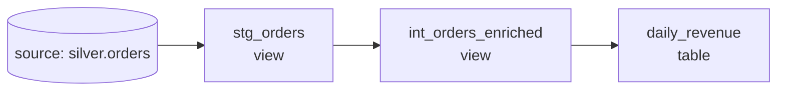

# Streamflow dbt project

A minimal, runnable dbt project that turns the silver order events (written by
the [Spark job](../../03-batch-streaming/spark/orders_bronze_to_silver.py)) into
a tested `daily_revenue` mart. It exists to make the topic-04 concepts concrete:
`ref()`, the model DAG, materializations, the medallion layering, and tests.

## The DAG (what `ref()` builds)



You never wrote that ordering down -- dbt inferred it from `source()`/`ref()`.

## Layout

| Path | Layer | Why |
|------|-------|-----|
| `models/staging/stg_orders.sql` | staging | one model per source; light rename/recast; the contract boundary |
| `models/intermediate/int_orders_enriched.sql` | intermediate | revenue-recognition rule defined ONCE, reused by marts |
| `models/marts/daily_revenue.sql` | mart (gold) | business-facing, materialized as a table for BI |
| `models/**/_*.yml` | tests | `not_null` / `unique` / `accepted_values` schema tests + a source freshness check |
| `tests/assert_daily_revenue_is_sane.sql` | test | a custom *singular* test: grain uniqueness + non-negative revenue |

## Run it (DuckDB, zero infra)

```bash
uv pip install dbt-duckdb
export DBT_PROFILES_DIR=$(pwd)          # uses profiles.example.yml -> rename to profiles.yml
export STREAMFLOW_SILVER=../warehouse/silver   # where the Spark job wrote parquet

dbt build      # = run (build models) + test (run every test), in DAG order
dbt docs generate && dbt docs serve     # browse the lineage graph
```

`dbt build` is the one to internalize: it walks the DAG and, per node, builds
then tests -- so a failing test stops bad data from propagating downstream.
