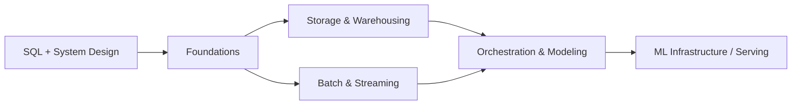

# Data Engineering

Building the systems that move, store, and shape data so analysts, ML models, and applications can use it reliably. From storage formats and warehouses through batch/stream processing to orchestration and data quality.

> **Prerequisites**: [Algorithms](../algorithms/) (especially [Concurrency & Systems](../algorithms/12-concurrency-systems/)), [System Design](../systems/01-system-design/) basics, SQL

## Prerequisite Graph

## Topics

| # | Topic | Primary Reference | Time |
|---|-------|------------------|------|
| 01 | [Foundations](01-foundations/) | [*The Data Engineering Cookbook*](https://github.com/andkret/Cookbook) (free) + *Fundamentals of Data Engineering* | 2-3 weeks |
| 02 | [Storage & Warehousing](02-storage-warehousing/) | [DDIA](https://dataintensive.net/) Ch 3 + *The Data Warehouse Toolkit* (Kimball) | 3-4 weeks |
| 03 | [Batch & Streaming Processing](03-batch-streaming/) | [*Streaming Systems*](https://www.oreilly.com/library/view/streaming-systems/9781491983867/) + [Spark](https://spark.apache.org/docs/latest/) / [Kafka](https://kafka.apache.org/documentation/) docs (free) | 3-4 weeks |
| 04 | [Orchestration & Modeling](04-orchestration-modeling/) | [dbt docs](https://docs.getdbt.com/) (free) + [Airflow docs](https://airflow.apache.org/docs/) (free) | 2-3 weeks |

## Key Takeaways

- Data engineering is a *lifecycle*: generation → ingestion → storage → transformation → serving, with governance, security, and orchestration as undercurrents throughout
- The defining tradeoff is **OLTP vs OLAP**: row-oriented systems for transactions, column-oriented systems for analytics -- storage layout follows access pattern
- Modern stacks are **ELT, not ETL**: load raw data cheaply into a lake/warehouse, then transform in place with SQL -- compute and storage are decoupled and elastic
- **Idempotency and exactly-once semantics** are the hardest and most important properties of any pipeline; design for replay and failure from the start
- The lakehouse (open table formats over object storage) is collapsing the old lake/warehouse divide

## Runnable Example

A small end-to-end **Streamflow orders** pipeline runs through this track, so the concepts have working code, not just prose:

| Stage | File | Topic |
|-------|------|-------|
| Transform raw → clean (Spark, bronze→silver) | [`spark/orders_bronze_to_silver.py`](03-batch-streaming/spark/orders_bronze_to_silver.py) | [03](03-batch-streaming/) |
| Model clean → tested marts (dbt, silver→gold) | [`dbt/`](04-orchestration-modeling/dbt/) | [04](04-orchestration-modeling/) |
| Orchestrate the whole DAG (Airflow) | [`airflow/streamflow_orders_dag.py`](04-orchestration-modeling/airflow/streamflow_orders_dag.py) | [04](04-orchestration-modeling/) |

It uses the same Streamflow event-driven platform as the [Infrastructure](../infrastructure/) and [Diagramming](../diagramming-and-documentation/) tracks, and runs locally on DuckDB with no cloud setup.

## Quick Start

1. **New to data**: start with Foundations, then Storage & Warehousing
2. **Coming from backend/systems**: skim Foundations, focus on Batch & Streaming
3. **Analytics/BI background**: Storage & Warehousing → Orchestration & Modeling (dbt)
4. **ML/MLOps focus**: Foundations + Batch & Streaming, then bridge to [LLM Systems](../ml/04-llm-systems/)

See [Study Plan](../STUDY-PLAN.md) for the 10-14 week data engineering schedule.
