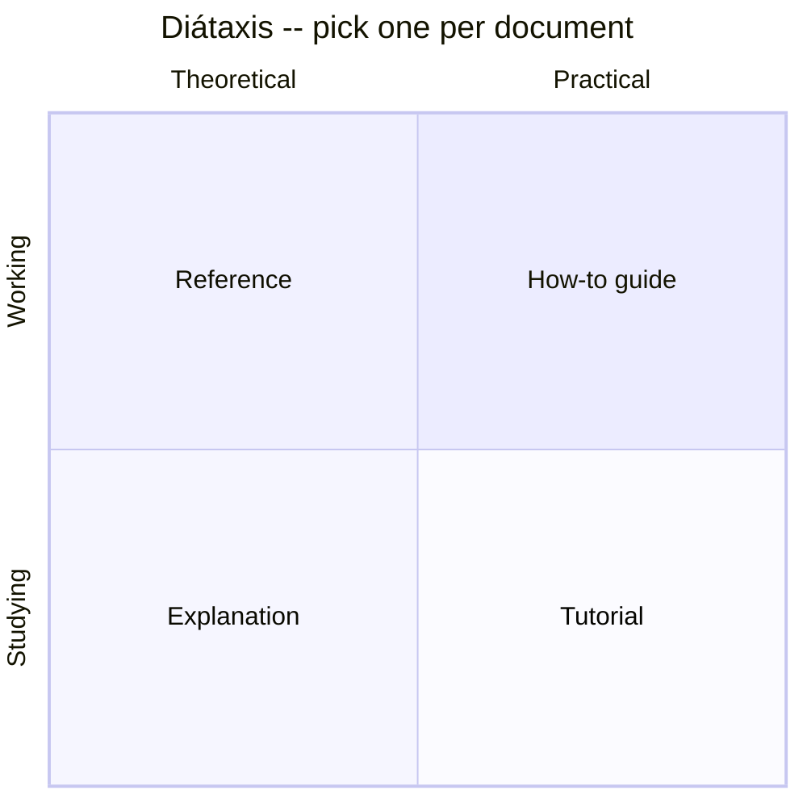

# Documentation & Technical Writing

## Overview

- **Primary references**:
  - [Diátaxis](https://diataxis.fr/) by Daniele Procida -- free, the framework for *what kind* of doc you're writing
  - [Google Technical Writing Courses](https://developers.google.com/tech-writing) -- free, the mechanics of clear prose
- **Supplementary**: [*SWE at Google* -- Documentation chapter](https://abseil.io/resources/swe-book/html/ch10.html) (free), [Architecture Decision Records](https://adr.github.io/) (free), [Write the Docs](https://www.writethedocs.org/) guide (free), *Docs for Developers* (recommended)
- **Prerequisites**: [Diagramming & the C4 Model](../01-diagramming-c4/) (good docs embed diagrams)
- **Estimated time**: 1 week at 4-6 hrs/week

## Key Takeaways

- **Documentation is code's interface to humans across time.** Treat it like code: version it, review it, test it, deprecate it, own it.
- **Most "bad docs" are actually the wrong *type* of doc.** Diátaxis names four types and tells you not to mix them.
- **Writing clearly is a learnable mechanic**, not a talent: short sentences, active voice, lists over prose, one idea per paragraph.
- **A doc that isn't tested against reality is a liability** -- it confidently tells the reader something false. (Topic 03's mentality applies to docs.)

## How to Study

- Take Google's [Technical Writing One](https://developers.google.com/tech-writing/one) (≈2 hrs). Apply its rules to a doc you already own.
- Classify every doc in a repo you know by its Diátaxis quadrant. Find the one that's secretly two types fighting each other; split it.
- Write one ADR for a real decision you made recently, *as if* explaining it to the engineer who inherits it in two years.

---

# Concepts & Techniques

## Core Insight

A reader arrives at a document in one of two states (studying vs. working) needing one of two things (practical steps vs. theoretical knowledge). Those two axes give **four irreducible documentation types**, and the cardinal sin is mixing them -- a tutorial that keeps stopping to explain theory loses the beginner; a reference page that tells a story wastes the expert. Name the type first, write to it, and most documentation problems dissolve.

## 1. Diátaxis: the four types



| Type | Reader's question | Voice | Failure if mixed |
|------|-------------------|-------|------------------|
| **Tutorial** | "Teach me, I'm new" | "We will… now you'll see…" | Stops to explain theory; beginner gets lost |
| **How-to guide** | "I have a goal, give me steps" | "To do X: 1, 2, 3" | Becomes a tutorial; expert is slowed down |
| **Reference** | "What exactly is the signature/flag?" | Dry, complete, consistent | Tells a story; facts get buried |
| **Explanation** | "Why is it built this way?" | Discursive, links tradeoffs | Pretends to be steps; loses the argument |

A repo's `docs/` should have a place for each. A single page trying to be all four is the most common documentation smell.

## 2. Documentation as code

Everything good about source applies to docs:

- **Versioned** -- docs live in the repo, change in the same PR as the code they describe. A behavior change with no doc change is an incomplete PR.
- **Reviewed** -- docs go through code review. Reviewers catch "this example no longer compiles."
- **Tested** -- run code samples in CI ([doctests](https://docs.python.org/3/library/doctest.html), `cargo test --doc`, `go test` on `Example` funcs). Lint prose with [Vale](https://vale.sh/). Check links. An untested example *will* drift.
- **Generated where possible** -- API reference from docstrings/OpenAPI, ER diagrams from schema, CLI help from the parser. Hand-maintained reference rots; generated reference can't.
- **Deprecated deliberately** -- mark stale docs, redirect, and delete. Out-of-date docs are worse than none because readers trust them.

## 3. The mechanics of clear writing

Google's technical-writing rules, distilled to what changes your prose today:

- **One idea per sentence; one topic per paragraph.** If a sentence has two ideas, split it.
- **Active voice, present tense.** "The worker commits the offset," not "the offset is committed."
- **Lead with the conclusion.** State the takeaway, then support it (BLUF -- bottom line up front). Readers skim.
- **Lists for sequences and sets; tables for comparisons.** Prose is the worst format for either -- most of this curriculum is tables for exactly this reason.
- **Define terms once, use them consistently.** Don't call it a "worker" here and a "consumer" there unless you mean different things.
- **Cut filler.** "In order to" → "to". "At this point in time" → "now". Shorter is clearer.
- **Show, then tell.** A runnable example earns more trust than a paragraph of description.

## 4. The documents Staff+ engineers actually own

| Document | Diátaxis type | Purpose | Keep alive by |
|----------|--------------|---------|---------------|
| **README** | Mix (gateway) | Orient a newcomer in <5 min; link out to the rest | Treat as the front door; see [write-readme conventions](../../README.md) |
| **Design doc / RFC** | Explanation | Argue *why* before building; the artifact of thinking | Write before coding; archive after (decision captured in an ADR) |
| **ADR** | Explanation | One immutable record per significant decision | Append-only; supersede, never edit (see §5) |
| **Runbook** | How-to guide | Steps to operate/recover a system at 3am | Test it during a game-day; update after every incident |
| **API reference** | Reference | Exact signatures, params, errors | Generate from source |
| **Postmortem** | Explanation | Blameless analysis of an incident | Action items tracked to closure |

## 5. Architecture Decision Records (ADRs)

A design doc captures the thinking; an **ADR** captures the *decision* in a tiny, immutable, append-only file so future engineers know **why** -- the most expensive knowledge to lose. One decision per file:

```markdown
# ADR-014: Bound worker parallelism with Kafka partition count

## Status
Accepted (2026-06-13). Supersedes ADR-009.

## Context
Order throughput is rising. We considered adding worker replicas freely,
but a Kafka consumer group caps useful parallelism at the partition count.

## Decision
Set the `orders` topic to 12 partitions and cap the worker HPA at 12 replicas.
Scale partitions (not just replicas) when sustained lag exceeds target.

## Consequences
+ Predictable scaling story; no idle workers.
- Repartitioning is operationally heavy; we must forecast 12-18 months ahead.
- Ordering is per-partition only; documented for downstream consumers.
```

The rule: **ADRs are immutable.** You don't edit ADR-009 when you change your mind -- you write ADR-014 that supersedes it. The history of *why* the architecture is what it is becomes a readable log. This is the textual twin of the embedded, living diagram from topic 01.

## Technique Catalog

| Technique | When to apply |
|-----------|---------------|
| Classify by Diátaxis type | Before writing *any* doc -- name the type first |
| Docs in the same PR as code | Every behavior change |
| Test code samples in CI | Any doc with runnable examples |
| BLUF / lead with the conclusion | Every doc, email, and PR description |
| Tables over prose | Any comparison or enumerated set |
| ADR | Every significant, hard-to-reverse decision |
| Runbook + game-day | Any system you're on-call for |
| Blameless postmortem | After every incident |

## Connections to Other Tracks

| Concept | Connected Track | How |
|---------|-----------------|-----|
| Docs-as-code, deprecation | [Software Craftsmanship](../../software-craftsmanship/) | Google's documentation chapter is the canonical source |
| Runbooks, postmortems | [Observability](../../systems/04-observability/) | You can only write a runbook for what you can observe |
| Embedded diagrams in docs | [Diagramming & C4](../01-diagramming-c4/) | Good docs are diagram-anchored |
| Design docs before building | [System Design](../../systems/01-system-design/) | The design doc is the deliverable of a design exercise |

## Company Relevance

| Company | How This Appears | Focus |
|---------|-----------------|-------|
| Google | Design docs + readability reviews are core culture; ADRs widespread | Documentation as engineering |
| Amazon | The six-page narrative memo replaces slide decks | Writing as thinking |
| Stripe | Industry-leading docs and API reference | Reference quality, tested examples |
| Anthropic | Careful design docs and writeups for safety-critical work | Explanation + rigor |
| Any Staff+ role | RFCs, ADRs, and postmortems are how you scale influence | Writing leverage |
