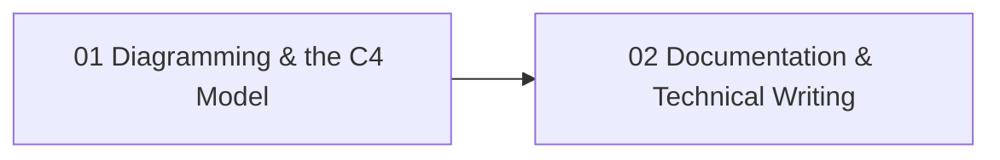

# Diagramming & Documentation

How to make a system *legible*: model it with diagrams-as-code (C4 + D2 + Mermaid) and document it so the knowledge survives the people who built it. This track treats the **understandability of a system as a first-class engineering deliverable**, produced with the same rigor as the code.

> **Prerequisites**: Some professional experience shipping software. Pairs with [Software Craftsmanship](../software-craftsmanship/) (the *principles* behind treating artifacts like source) and [Infrastructure](../infrastructure/) (the systems you learn to draw and document honestly).

## Why this track exists

Most engineers can write code. Far fewer can make a system *understandable to someone who wasn't there when it was built* -- and an unintelligible system cannot be safely changed, reviewed, or operated. The artifacts here are how understanding is captured and kept true:

- A diagram you can `git diff` beats a screenshot nobody can edit.
- A document tested against reality beats tribal knowledge.
- Both survive because they are treated like source -- co-located, reviewed in PRs, and rendered/checked in CI -- not like a deliverable that is "done."

The diagrams use one running example -- **Streamflow**, an event-driven order platform -- so the C4 views you build in topic 01 are a real system you also learn to operate in the [Infrastructure](../infrastructure/) track.

## Prerequisite Graph

## Topics

| # | Topic | Primary Reference | Time |
|---|-------|------------------|------|
| 01 | [Diagramming & the C4 Model](01-diagramming-c4/) | [C4 model](https://c4model.com/) (free) + [D2](https://d2lang.com/) + [Mermaid](https://mermaid.js.org/) docs (free) | 1 week |
| 02 | [Documentation & Technical Writing](02-documentation-writing/) | [Diátaxis](https://diataxis.fr/) (free) + [Google Technical Writing](https://developers.google.com/tech-writing) (free) | 1 week |

## The running example: Streamflow

The C4 diagrams live in [`diagrams/`](diagrams/) as `.d2` source **and** rendered `.svg`. The system context:

Topic 01 explains how this and the container/component views are built; the deployment view that maps them onto Kubernetes lives with the workload it depicts in [Infrastructure](../infrastructure/01-containers-kubernetes/).

## Quick Start

1. **Never made a diagram you could version-control?** Start with 01 -- install `d2`, render the C4 set, then diff a change.
2. **Docs always go stale on your team?** Jump to 02 (Diátaxis + docs-as-code), then carry the same "test it against reality" discipline into [The Testing Mentality](../software-craftsmanship/03-testing-mentality/).
3. **Diagram-as-you-go:** keep `diagrams/` open while reading the [Infrastructure](../infrastructure/) track and re-draw each concept yourself.

See [Study Plan](../STUDY-PLAN.md) for the schedule.
