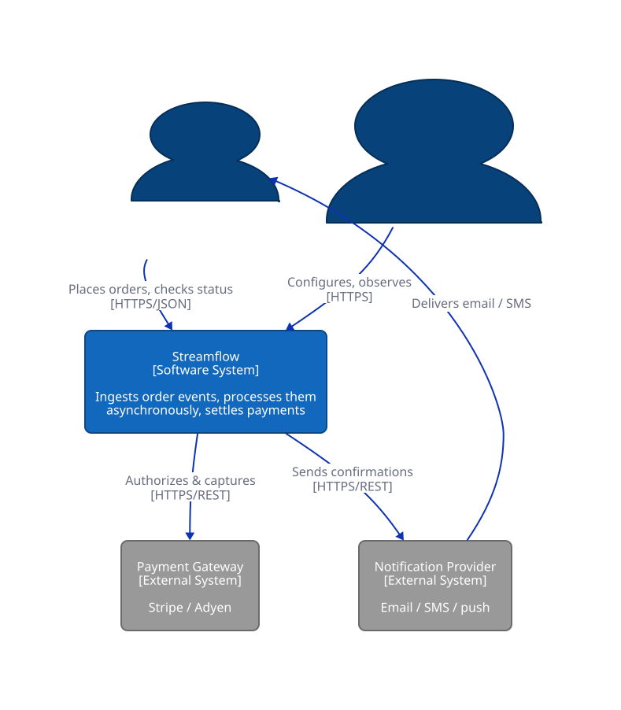
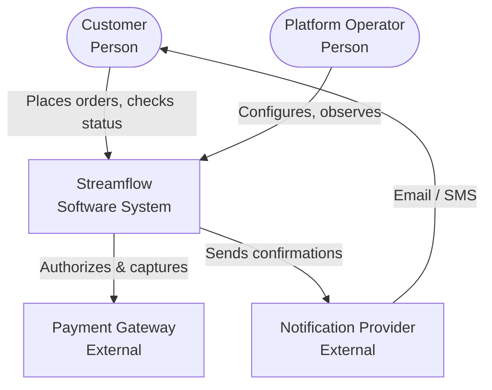
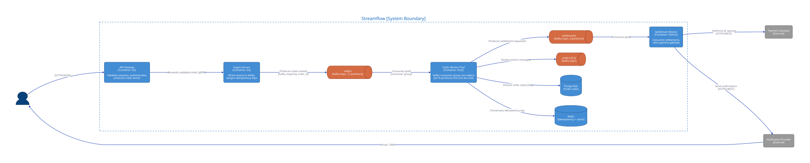
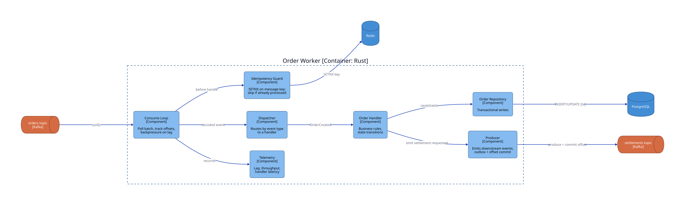
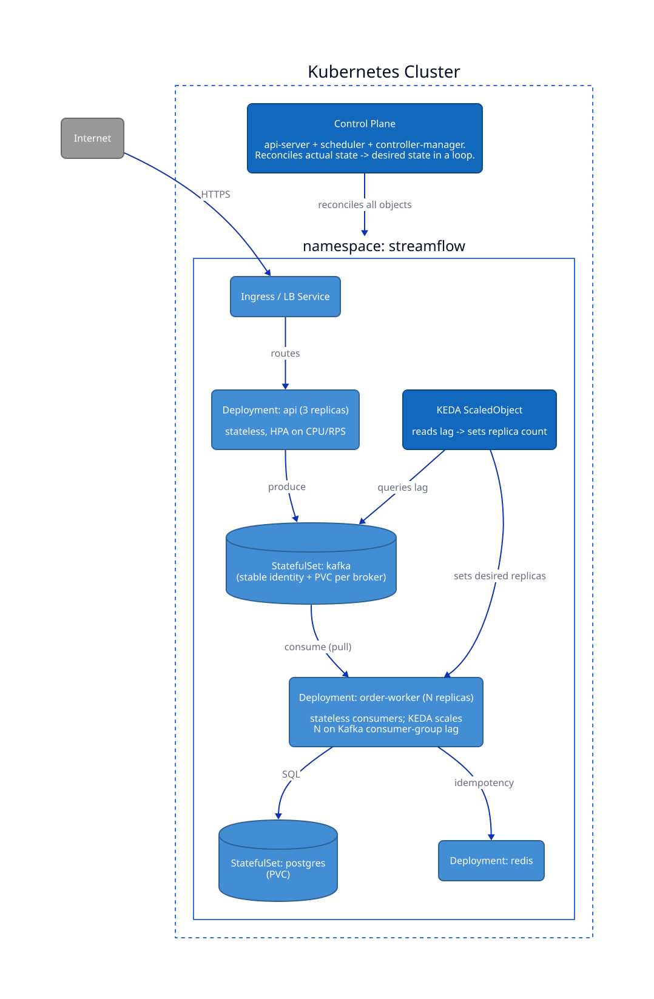
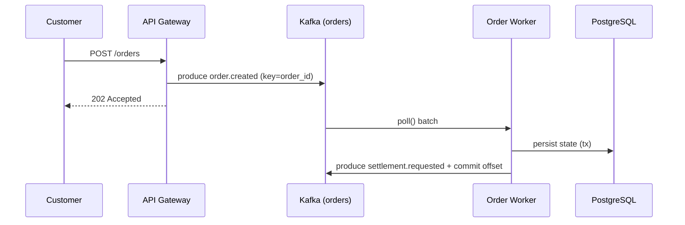
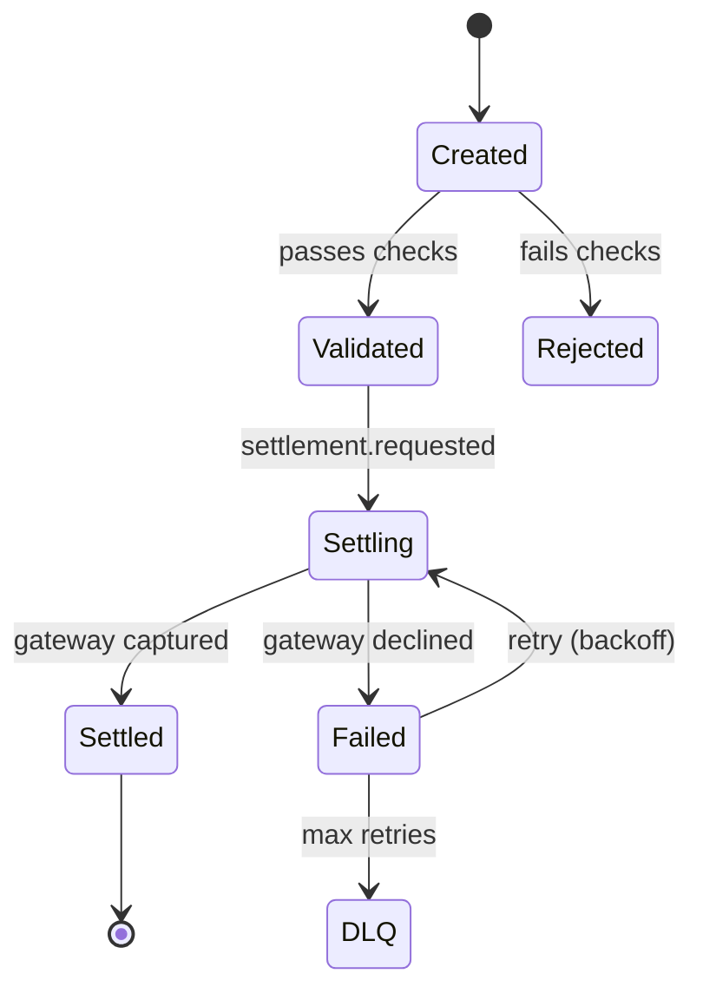

# Diagramming & the C4 Model

## Overview

- **Primary references**:
  - [The C4 model](https://c4model.com/) by Simon Brown -- free, the lingua franca for software architecture diagrams
  - [D2](https://d2lang.com/) -- a modern text-to-diagram language (the source for this track's C4 diagrams)
  - [Mermaid](https://mermaid.js.org/) -- diagrams-as-code that **renders natively in GitHub Markdown**
- **Supplementary**: [diagrams.net/draw.io](https://www.diagrams.net/) (free, when you need freehand), [PlantUML](https://plantuml.com/), [Structurizr](https://structurizr.com/) (C4-native, by the model's author)
- **Prerequisites**: none beyond having a system worth drawing
- **Estimated time**: 1 week at 4-6 hrs/week

## Key Takeaways

- **A diagram is an answer to a question.** Pick the diagram type by the question you're answering, not by the tool you happen to have open.
- **Diagrams-as-code beats drag-and-drop** for anything that must survive: it diffs, reviews, versions, and renders in CI like source.
- **The C4 model gives you a zoom level for architecture**: Context → Container → Component → Code, so you stop drawing one diagram that tries to say everything and therefore says nothing.
- **An embedded, rendered-in-repo model stays alive**; a screenshot in a wiki is dead the moment it's pasted.

## How to Study

- Install `d2` (`brew install d2` or see [d2lang.com](https://d2lang.com/)). Render this track's diagrams: `cd ../diagrams && d2 c4-container.d2 out.svg`.
- For each level of C4, redraw Streamflow from scratch without looking. If you can't, you don't understand the system yet -- that's the point.
- Make one change to a `.d2` file (add the DLQ consumer, say) and `git diff` it. Notice you reviewed an *architecture change* as a code change.

---

# Concepts & Techniques

## Core Insight

Every diagram should answer **one explicit question for one audience**. The two failure modes are (1) the "everything diagram" that mixes a CEO's mental model with a packet's TCP flags, and (2) the screenshot that can never be updated. The C4 model fixes the first by giving you **abstraction levels** (zoom in/out like a map); diagrams-as-code fixes the second by making the diagram a **source artifact** -- text that lives next to the code, renders deterministically, and is reviewed in pull requests.

> **The map analogy (Simon Brown):** Google Maps lets you zoom from country → city → street → building. You'd never show a single map at all zoom levels at once. C4 is that zoom control for software.

## 1. The C4 Model: four levels of zoom

| Level | Name | Audience | Answers |
|-------|------|----------|---------|
| 1 | **Context** | everyone, incl. non-technical | What is this system, who uses it, what does it depend on? |
| 2 | **Container** | technical staff | What are the separately deployable/runnable units, and how do they communicate? |
| 3 | **Component** | developers of one container | What are the major code structures inside a container? |
| 4 | **Code** | (rarely drawn by hand) | Class/ER detail -- generate this from code, don't maintain it |

The discipline: **draw 1 and 2 for almost everything; draw 3 only for containers with non-obvious internals; almost never hand-draw 4.** A "container" in C4 has nothing to do with Docker -- it's *any* independently runnable thing (an app, a service, a database, a Kafka topic, a single-page app).

### Level 1 -- System Context

The whole system is one box; everything else is users and external systems.



<sub>Rendered from [`diagrams/c4-context.d2`](../diagrams/c4-context.d2). Mermaid equivalent (renders inline on GitHub):</sub>



### Level 2 -- Container

Zoom into the system box. **This is the most useful diagram in practice** -- it maps 1:1 onto what you deploy (topic 04) and how data flows (topic 05).



<sub>Source: [`diagrams/c4-container.d2`](../diagrams/c4-container.d2).</sub>

### Level 3 -- Component

Zoom into one container (here, the Order Worker) to show how a single message flows through its internals -- the consume loop, idempotency guard, dispatcher, handlers, repository, producer.



<sub>Source: [`diagrams/c4-component.d2`](../diagrams/c4-component.d2).</sub>

### The "+1": a Deployment view

C4 also defines a **deployment diagram** that maps logical containers onto infrastructure nodes. This is the bridge into topics 04-05 -- it shows the same containers living as Kubernetes objects.



<sub>Source: [`diagrams/deployment-k8s.d2`](../diagrams/deployment-k8s.d2).</sub>

## 2. Diagrams-as-code: D2 vs Mermaid vs the rest

| Tool | Renders in GitHub MD? | Strength | Use when |
|------|:--:|----------|----------|
| **Mermaid** | ✅ natively | Zero toolchain, lives in the README | Inline diagrams reviewers see without rendering; sequence/flow/ER/state |
| **D2** | ❌ (commit SVG) | Beautiful layout, real layout engines (ELK/dagre), themes, classes | Canonical architecture diagrams you render to SVG and embed |
| **PlantUML** | ❌ (commit SVG) | Mature C4 macro library, UML coverage | Teams already standardized on UML/PlantUML |
| **Structurizr** | ❌ (own viewer) | C4-native; one model, many auto-derived views | You want a single model and generated Context/Container/Component views |
| **draw.io** | ❌ (image) | Freehand, fast for whiteboard-style | One-off sketches; *not* for anything maintained |

This track's pattern (chosen deliberately): **author canonical architecture diagrams in D2, commit both the `.d2` source and the rendered `.svg`, and provide a Mermaid equivalent inline** so the diagram renders even with no toolchain. You get diff-able source, a pretty render, and GitHub-native display.

**Minimal D2** (the actual syntax used in this track's files):

```d2
direction: right
api: "API Gateway\n[Container: Go]" { style.fill: "#438dd5" }
kafka: "orders\n[Kafka topic]" { shape: queue }
worker: "Order Worker\n[Container: Rust]" { style.fill: "#438dd5" }
api -> kafka: "produces"
kafka -> worker: "consumes (pull)"
```

```bash
d2 architecture.d2 architecture.svg   # render
d2 --watch architecture.d2            # live-reload in the browser while editing
```

## 3. Pick the diagram by the question

C4 covers *structure*. Most other questions are better answered by a different standard diagram -- and Mermaid does all of these inline:

| Question | Diagram | Mermaid type |
|----------|---------|--------------|
| What are the moving parts? | C4 Container | `graph` / `flowchart` |
| In what order do services talk during a request? | **Sequence** | `sequenceDiagram` |
| What states can an order be in? | **State machine** | `stateDiagram-v2` |
| What's the data shape? | **Entity-relationship** | `erDiagram` |
| What's the release timeline? | **Gantt** | `gantt` |
| How does work fan out across queues? | Flow / **C4** | `flowchart` |

**Sequence diagram** -- the request path through Streamflow (answers "what order, and where can it fail?"):



**State machine** -- the lifecycle the worker enforces (great for `## Key ideas` that involve transitions):



## 4. Embedded, living models -- diagrams that don't rot

A diagram is only worth drawing if it stays true. Make models **embedded** (in the repo, beside the code) and **living** (kept current by process, ideally by automation):

- **Co-locate**: `diagrams/*.d2` lives in the repo, not a wiki. The diagram moves with the code it describes.
- **Render in CI**: a job runs `d2 *.d2` (or `mmdc`) and fails if a `.d2` no longer compiles, or regenerates SVGs as a release artifact. The diagram can't silently break.
- **Review as code**: an architecture change *is* a diff to a `.d2` file in the same PR as the code change. Reviewers see the structural change.
- **Generate level 4 from code** rather than maintaining it -- ERDs from the schema, call graphs from the source. Hand-maintained code-level diagrams always drift; treat them as build output.
- **Date and own**: every embedded diagram carries a comment header saying what question it answers and when it was last validated (see the `.d2` files in this track).

This is the same insight as docs-as-code (topic 02): the artifact survives because it's treated like source, not like a deliverable that's "done."

## Technique Catalog

| Technique | When to apply |
|-----------|---------------|
| C4 Context (L1) | Onboarding docs, exec/cross-team comms, any new project's README |
| C4 Container (L2) | Design docs, the default "how does it work" diagram, capacity/ops planning |
| C4 Component (L3) | Only for a container with non-obvious internals worth explaining |
| Generate L4 from code | ERDs, class diagrams -- never hand-maintain |
| Mermaid inline | Anything reviewers should see without a render step |
| D2 + committed SVG | Canonical, presentation-grade architecture diagrams |
| Sequence diagram | Tracing a request; debugging "who calls whom when" |
| State machine | Documenting a lifecycle/FSM (orders, jobs, sagas) |
| Render-in-CI | Any diagram that must not be allowed to rot |

## Connections to Other Tracks

| Concept | Connected Track | How |
|---------|-----------------|-----|
| Container/Deployment views | [Cloud Native](../../systems/03-cloud-native/) | The L2/deployment diagrams *are* what you deploy to K8s |
| Sequence & data flow | [System Design](../../systems/01-system-design/) | System design interviews are live diagramming under time pressure |
| Diagrams-as-code, review-as-code | [Software Craftsmanship](../../software-craftsmanship/) | Same "treat artifacts like source" principle as docs and tests |
| ER diagrams from schema | [Storage & Warehousing](../../data-engineering/02-storage-warehousing/) | Generate, don't draw, the data model |

## Company Relevance

| Company | How This Appears | Focus |
|---------|-----------------|-------|
| Google | Design docs are mandatory and diagram-heavy; readability culture | Context + Container diagrams in every design doc |
| Amazon | "Working backwards" docs, architecture review with C4-style views | Clear ownership boundaries |
| Anthropic | Thoughtful design docs for safety-critical systems | Legible, reviewable architecture |
| Stripe | Famous for documentation and API diagrams | Sequence diagrams for request flows |
| Any Staff+ role | You are expected to communicate architecture, not just build it | Diagramming as a core leadership skill |
