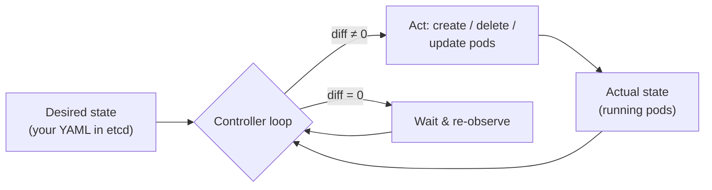
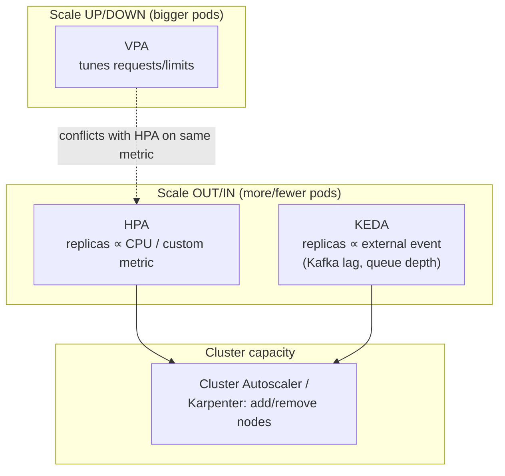

# Containerization & Kubernetes

## Overview

- **Primary references**:
  - [Kubernetes documentation](https://kubernetes.io/docs/) -- free, authoritative
  - [The Twelve-Factor App](https://12factor.net/) -- free, the contract a container must honor
- **Supplementary**: *Cloud Native DevOps with Kubernetes* 2nd ed. (recommended), [Kubernetes the Hard Way](https://github.com/kelseyhightower/kubernetes-the-hard-way) (free), [OCI Image Spec](https://github.com/opencontainers/image-spec) (free), [KEDA docs](https://keda.sh/) (free)
- **Prerequisites**: Linux basics, [Concurrency & Systems](../../algorithms/12-concurrency-systems/), [Diagramming & C4](../01-diagramming-c4/) (the deployment view)
- **Estimated time**: 1-2 weeks at 8-10 hrs/week

## Key Takeaways

- **A container is a process with its own filesystem and namespaced view of the kernel -- not a VM.** It shares the host kernel; that's the whole point and the source of most surprises.
- **Kubernetes is a reconciliation loop**: you declare desired state, controllers continuously drive actual state toward it. Almost every K8s behavior is a corollary of this one idea.
- **The caveats kill you, not the concepts.** Resource limits, graceful shutdown, and probe semantics are where real outages live -- §4 is the most important section.
- **Scaling has three independent axes** (pods, pod size, nodes) plus event-driven scaling -- and for queue workers, none of the built-in ones do what you want without KEDA.

## How to Study

- Build the [`Dockerfile`](manifests/Dockerfile) in this directory; inspect layers with `docker history`. Make it smaller.
- Apply the [manifests](manifests/) to a local cluster ([kind](https://kind.sigs.k8s.io/) or [k3d](https://k3d.io/)). Kill a pod and watch the Deployment recreate it.
- Set a memory limit below what the app needs and watch it get `OOMKilled`. Internalize that this is a quota, not a suggestion.

---

# Concepts & Techniques

## Core Insight

Kubernetes is not a deploy tool; it is a **control system**. You write down the desired state of the world (3 replicas, this image, this much memory) and a set of controllers run an endless loop: *observe actual state → diff against desired → act to close the gap*. A pod dies → the loop notices → it makes a new one. You change the image → the loop rolls pods one at a time. Once you see everything as this loop, the platform stops being magic -- and you can draw it honestly (topic 01's deployment view).

## 1. Containers: what they actually are

A container is a Linux process isolated by **namespaces** (its own view of PIDs, mounts, network, users) and constrained by **cgroups** (CPU, memory quotas). The image is a stack of read-only **layers** (a content-addressed tarball per `RUN`/`COPY`), unioned with a thin writable layer at runtime. Implications:

- **Shared kernel** -- a container can't run a different OS kernel than the host (no Linux containers on a Windows kernel without a VM). Lighter than a VM, weaker isolation than a VM.
- **Layer caching** -- order your `Dockerfile` from least- to most-frequently-changed so a code edit doesn't bust the dependency layer. See the annotated [`Dockerfile`](manifests/Dockerfile).
- **Multi-stage builds** -- compile in a fat builder stage, copy only the binary into a tiny runtime (`distroless`/`scratch`). Smaller image = faster pulls, smaller attack surface.

**Twelve-Factor** is the contract that makes a container orchestratable: config from the environment, stateless processes, logs to stdout, disposability (fast startup, graceful shutdown). Violate it and Kubernetes will fight you.

## 2. The objects you actually use

| Object | What it gives you | For Streamflow |
|--------|-------------------|----------------|
| **Pod** | One+ co-scheduled containers sharing net/storage (smallest unit) | rarely created directly |
| **Deployment** | Declarative replicas + rolling updates for **stateless** pods | the `api` and `order-worker` |
| **StatefulSet** | Stable identity + per-pod persistent volume, ordered rollout | `kafka`, `postgres` |
| **Service** | Stable virtual IP / DNS load-balancing across pods | `api` ClusterIP, ingress LB |
| **ConfigMap / Secret** | Externalized config / credentials (12-factor) | broker list, DB DSN |
| **Job / CronJob** | Run-to-completion / scheduled batch | nightly reconciliation |
| **HPA / KEDA ScaledObject** | Autoscaling controllers (§5) | scale workers on lag |

The deployment view from topic 01 maps directly onto these:

## 3. Workloads: stateless vs stateful

- **Stateless (Deployment)** -- any pod is interchangeable; scale by adding identical replicas. The `api` and `order-worker` are stateless *even though they do real work* -- their state lives in Kafka/Postgres/Redis, not on disk. This is what makes them trivially scalable (topic 05).
- **Stateful (StatefulSet)** -- pods have stable identities (`kafka-0`, `kafka-1`) and their own volumes. Needed for brokers and databases. **Caveat:** running stateful systems on K8s is genuinely hard (storage, backups, failover); many teams run Kafka/Postgres as managed services and keep only stateless workloads in the cluster. Know the tradeoff before you volunteer to operate a Kafka StatefulSet.

## 4. The caveats nobody warns you about

This is where outages come from. Each has a one-line fix and a painful failure mode.

- **Requests vs limits.** `requests` is what the scheduler reserves; `limits` is the hard cap. **Exceed a memory limit → instant `OOMKilled`** (not throttled -- killed). Exceed a CPU limit → throttled (slow), not killed. Set memory requests = limits for predictability; be careful with CPU limits (they can throttle latency-sensitive services). Forgetting requests → the scheduler over-packs the node and everything thrashes.
- **Liveness vs readiness probes -- do not confuse them.**
  - *Readiness* = "can I serve traffic now?" Fail it → removed from the Service, **not restarted**. Use during startup and when a dependency is down.
  - *Liveness* = "am I wedged and need a restart?" Fail it → **killed and restarted**.
  - The classic outage: a liveness probe that checks a *downstream dependency*. The dependency blips, every pod fails liveness, the whole Deployment restart-loops, and a minor blip becomes a full outage. Liveness probes must check *only the pod itself*.
- **Graceful shutdown / SIGTERM.** On scale-down or rollout, K8s sends `SIGTERM`, waits `terminationGracePeriodSeconds` (default 30s), then `SIGKILL`. A worker that ignores SIGTERM gets killed mid-message → duplicate or lost work. **You must trap SIGTERM**: stop accepting new work, finish in-flight messages, commit offsets, exit. (Topic 05 shows the consumer side.) Also: the pod is removed from the Service *asynchronously*, so handle in-flight requests during the drain with a `preStop` sleep.
- **The image tag trap.** `image: app:latest` is non-deterministic -- two nodes can pull different bytes, and you can't roll back. Pin a digest or an immutable tag.
- **PodDisruptionBudgets.** Without a PDB, a node drain (upgrade, autoscale-down) can evict *all* your replicas at once. Declare a PDB (`minAvailable`) so voluntary disruptions stay safe.
- **Networking is flat but mediated.** Every pod gets an IP; pods reach each other directly, but you reach them through a Service (stable) not a pod IP (ephemeral). `NetworkPolicy` is *deny-by-nothing* by default -- without one, every pod can talk to every other pod.
- **Init containers & startup order.** K8s does not guarantee your dependencies are up. Don't assume Kafka is ready when the worker starts -- use init containers, readiness gating, and retry-with-backoff in the app.

## 5. The scaling process

Three independent autoscalers plus event-driven scaling. They compose:

- **Horizontal Pod Autoscaler (HPA)** -- adds/removes pod replicas based on CPU, memory, or custom metrics. Default for stateless web services. **Caveat for workers:** CPU is a *terrible* proxy for queue backlog -- a worker can be idle (low CPU) while millions of messages pile up.
- **Vertical Pod Autoscaler (VPA)** -- right-sizes `requests`/`limits`. **Caveat:** don't run VPA and HPA on the *same* metric -- they fight. VPA usually requires a pod restart to apply.
- **Cluster Autoscaler / Karpenter** -- when pods can't be scheduled (no node has room), add nodes; remove underused nodes. This is why "scaling pods" can be slow -- you may be waiting on a new VM to boot.
- **KEDA (event-driven)** -- the right tool for queue workers. It scales the worker Deployment on **Kafka consumer-group lag** (or SQS depth, etc.), and can scale to **zero** when idle. This is how Streamflow scales: lag rises → KEDA raises replicas (capped at the partition count -- topic 05) → Cluster Autoscaler adds nodes if needed.

The full scaling story for the worker is therefore: **KEDA watches lag → sets desired replicas (≤ partitions) → scheduler places pods → Cluster Autoscaler grows the node pool if pods are Pending → pods join the consumer group → a rebalance assigns them partitions → lag drains.** Every arrow is a place it can stall; that's why you draw it.

See the annotated manifests: [`deployment.yaml`](manifests/deployment.yaml), [`hpa.yaml`](manifests/hpa.yaml), [`keda-scaledobject.yaml`](manifests/keda-scaledobject.yaml).

## Technique Catalog

| Technique | When to apply |
|-----------|---------------|
| Multi-stage + distroless build | Every production image |
| Pin image by digest | Every deployment (never `:latest`) |
| Set memory requests = limits | Every workload (avoid surprise OOMKills) |
| Liveness checks self only | Every liveness probe |
| Trap SIGTERM, drain gracefully | Every worker and server |
| PodDisruptionBudget | Any workload with an availability target |
| HPA on custom metric | Stateless services where CPU correlates with load |
| KEDA on queue lag | Any queue/stream worker (Streamflow's workers) |
| Cluster Autoscaler / Karpenter | Clusters with variable load |
| Run stateful systems as managed services | When you don't want to operate Kafka/DB on K8s |

## Connections to Other Tracks

| Concept | Connected Track | How |
|---------|-----------------|-----|
| Orchestration, GitOps, patterns | [Cloud Native](../../systems/03-cloud-native/) | The broader cloud-native context |
| Probes, autoscaling, SLOs | [Observability](../../systems/04-observability/) | You scale and alert on metrics |
| Lag-based scaling, partitions | [Workers & Kafka Consumption](../05-workers-kafka-consumption/) | KEDA scales on the topology topic 05 explains |
| Deployment diagrams | [Diagramming & C4](../01-diagramming-c4/) | The deployment view is what you operate |
| Manifest/policy testing | [Testing Mentality](../03-testing-mentality/) | Validate YAML before it reaches the cluster |

## Company Relevance

| Company | Infrastructure | Focus |
|---------|---------------|-------|
| Google | GKE; Borg was K8s's predecessor | Reconciliation model born here |
| Amazon | EKS, Karpenter (their autoscaler), Fargate | Node autoscaling, serverless pods |
| Anthropic | K8s + GPU orchestration for inference | Scaling stateless serving workers |
| Netflix | Titus (custom) → K8s | Resilience, graceful degradation |
| Any platform/SRE role | You own the caveats in §4 | Operability under failure |
