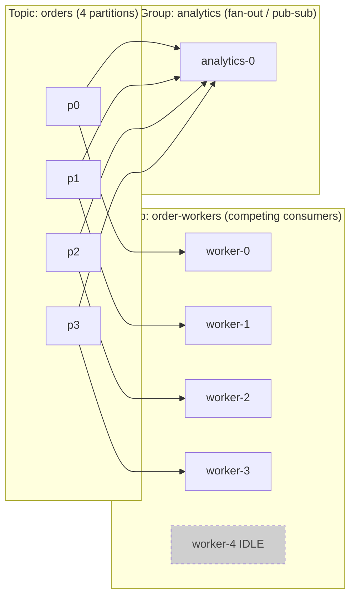
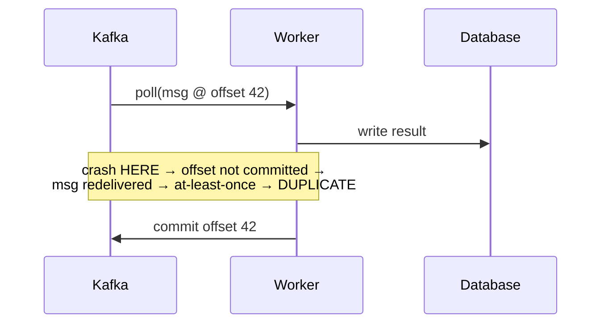

# Distributed Workers & Kafka Consumption Models

## Overview

- **Primary references**:
  - [Apache Kafka documentation](https://kafka.apache.org/documentation/) -- free, especially the Design and Consumer sections
  - *Designing Data-Intensive Applications* (Kleppmann) Ch 11 "Stream Processing" -- recommended
- **Supplementary**: [Confluent: Kafka consumer groups](https://developer.confluent.io/courses/architecture/consumer-group-protocol/) (free), [Enterprise Integration Patterns](https://www.enterpriseintegrationpatterns.com/) (Competing Consumers, Pub-Sub), [The Log](https://engineering.linkedin.com/distributed-systems/log-what-every-software-engineer-should-know-about-real-time-datas-unifying-abstraction) by Jay Kreps (free)
- **Prerequisites**: [Containerization & Kubernetes](../04-containerization-kubernetes/), [Batch & Streaming](../../data-engineering/03-batch-streaming/)
- **Estimated time**: 1-2 weeks at 8-10 hrs/week

## Key Takeaways

- **A worker is a process that pulls work and does it.** The hard parts are *how many can run in parallel*, *what happens on failure*, and *whether order matters* -- all decided by your consumption model.
- **Kafka is a distributed, partitioned, replicated log**, not a queue. Consumers track their own position (offset); the broker doesn't remember what each consumer has done.
- **Partition count is the parallelism ceiling.** Within one consumer group, a partition is owned by exactly one consumer -- so you cannot have more useful workers than partitions.
- **"Exactly-once" is mostly a lie you fix with idempotency.** Default Kafka is at-least-once; design every handler to tolerate duplicates.

## How to Study

- Run a local Kafka ([Redpanda](https://redpanda.com/) or `kafka` via Docker). Produce 1000 messages, start consumers one at a time, and watch partitions rebalance.
- Add a consumer beyond the partition count and confirm it sits idle (the diagram below, made real).
- Read the [`consumer-go.go`](code/consumer-go.go), [`consumer-rust.rs`](code/consumer-rust.rs), and [`consumer-python.py`](code/consumer-python.py) examples -- the same at-least-once + idempotent pattern in three languages.

---

# Concepts & Techniques

## Core Insight

Asynchronous work decouples *receiving* a request from *doing* it: a producer drops a message onto a log/queue and a pool of workers consumes at its own pace. This buys you elasticity (scale workers independently), resilience (a worker crash doesn't lose the message), and load-leveling (a traffic spike becomes a longer queue, not a meltdown). The entire design space comes down to one question -- **the consumption model**: how messages are distributed to workers, what ordering is guaranteed, and what happens when a worker fails mid-message.

## 1. Two consumption models, one diagram

Every messaging system is a variation on two patterns:

- **Competing consumers (work queue)** -- each message goes to *exactly one* worker in the pool. Adding workers spreads load. This is how you scale processing.
- **Publish-subscribe (fan-out)** -- each message goes to *every* subscriber. This is how independent systems react to the same event.

Kafka does **both at once** via consumer groups: *within* a group it's competing consumers; *across* groups it's pub-sub.

The 5th worker is **idle** -- there's no partition left to own. This is the single most important operational fact about Kafka scaling (and why topic 04's KEDA cap is the partition count).

## 2. Kafka's model: a partitioned, replicated log

- **Topic** -- a named stream, split into **partitions**. A partition is an *ordered, append-only log*; messages get a monotonically increasing **offset**.
- **Ordering is per-partition only.** There is no global order across a topic. Messages with the same **key** hash to the same partition, so "all events for `order_id=42`" stay ordered -- but `order 42` and `order 99` may be processed concurrently. Choose your key to match the ordering you actually need.
- **Replication** -- each partition has a leader and follower replicas on other brokers (`replication.factor=3`); a broker dying loses no data.
- **Retention, not deletion-on-read** -- Kafka keeps messages for a time/size window regardless of who read them. A new consumer group can replay from offset 0. (Contrast a classic queue, which deletes on acknowledgement.)
- **Consumers own their offset.** The broker is dumb; each group records "I've processed up to offset N" (committed back to Kafka). This is what enables replay, multiple independent groups, and at-least-once semantics.

## 3. Push vs pull, and how that shapes the worker

| | **Pull (Kafka)** | **Push (RabbitMQ, SQS*, webhooks)** |
|--|------------------|-------------------------------------|
| Who sets pace | Consumer (`poll()`) -- natural backpressure | Broker -- can overwhelm a slow consumer (needs prefetch limits) |
| Backlog visibility | **Consumer lag** = log end − committed offset | Queue depth |
| Replay | Yes -- reset offset | No (message gone after ack) |
| Ordering | Per-partition | Usually none (SQS FIFO is the exception) |
| Best for | High-throughput streams, replay, multiple readers | Task distribution, per-message ack, simple work queues |

*SQS is technically pull-based long-polling but behaves like a push work-queue model.

Kafka's **pull** model is why backpressure is free: a slow worker simply polls less, lag grows, and your autoscaler (topic 04) reacts to the lag. You never get pushed more than you asked for.

## 4. Delivery semantics -- and why you design for duplicates

- **At-most-once** -- commit offset *before* processing. Crash → message lost. Rarely acceptable.
- **At-least-once** -- commit *after* processing (the default, correct choice). Crash between work and commit → redelivery → **duplicates**. You must make handlers **idempotent**.
- **"Exactly-once"** -- Kafka transactions + idempotent producers give exactly-once *within Kafka-to-Kafka* processing. The moment you touch an external system (a payment gateway, an email), you're back to at-least-once and must dedupe.

**The practical rule:** assume at-least-once everywhere and make every handler idempotent:

- **Idempotency key** -- dedupe on a natural or message key (Streamflow's worker does `SETNX order_id` in Redis before handling; topic 01's component diagram).
- **Transactional outbox** -- write business state *and* the outgoing event in one DB transaction; a separate relay publishes the event. Eliminates the "wrote to DB but crashed before producing" hole.
- **Commit offsets only after durable work**, and commit in batches for throughput.

## 5. Rebalancing -- the thing that bites you

When a consumer joins, leaves, or dies, the group **rebalances**: partitions are reassigned across the surviving members. Caveats that cause real incidents:

- **Stop-the-world (eager) rebalancing** pauses *all* consumption in the group during reassignment. Use **cooperative/incremental rebalancing** (`CooperativeStickyAssignor`) to avoid global stalls.
- **A slow handler triggers false rebalances.** If you don't `poll()` within `max.poll.interval.ms`, the broker assumes you're dead and kicks you, causing a rebalance and reprocessing. Either keep handlers fast or raise the interval / reduce `max.poll.records`.
- **Graceful shutdown matters here too** (topic 04): on SIGTERM, the worker should *leave the group cleanly* so its partitions are reassigned immediately, instead of the group waiting `session.timeout.ms` to notice it's gone.

## 6. Failure handling: retries and the DLQ

- **Retryable vs poison messages.** Transient failures (DB blip) → retry with backoff. A message that will *never* succeed (malformed, references deleted data) is **poison** -- retrying it forever blocks the partition (head-of-line blocking).
- **Dead-letter queue (DLQ)** -- after N attempts, route the poison message to an `orders.DLQ` topic and move on. Alert on DLQ depth; a human or a repair job handles it. Streamflow's container diagram (topic 01) shows exactly this edge.
- **Retry topics** -- some designs use tiered retry topics (`orders.retry.5s`, `orders.retry.1m`) so retries don't block live traffic.

## 7. Sizing & operating the worker pool

- **Partitions = max parallelism.** Pick partition count for your *peak* worker count plus headroom. Over-partitioning costs metadata/latency; under-partitioning caps throughput. You can add partitions but it breaks key→partition stability, so forecast ahead (topic 02's ADR-014).
- **Lag is the master signal.** `consumer lag` (messages behind) drives KEDA scaling (topic 04) and your alerts. Rising lag at max replicas = add partitions, not pods.
- **One handler shouldn't block the batch** -- bound per-message time; use a DLQ for the rest.

## Technique Catalog

| Technique | When to apply |
|-----------|---------------|
| Competing consumers (one group) | Distributing work across a scalable pool |
| Fan-out (multiple groups) | Independent systems reacting to the same events |
| Key by entity for ordering | When per-entity order matters (per-order, per-user) |
| At-least-once + idempotent handler | Default for anything touching external systems |
| Idempotency key (SETNX) | Deduping redelivered messages |
| Transactional outbox | Atomic "update state + emit event" |
| Cooperative rebalancing | Any group where stop-the-world stalls hurt |
| Dead-letter queue | Any consumer that can receive poison messages |
| Scale on consumer lag (KEDA) | Sizing the worker pool to backlog |
| Add partitions (not pods) at the cap | When lag rises with replicas already = partitions |

## Connections to Other Tracks

| Concept | Connected Track | How |
|---------|-----------------|-----|
| Stream processing, Kafka internals | [Batch & Streaming](../../data-engineering/03-batch-streaming/) | The data-engineering view of the same Kafka |
| Replication, consensus, ordering | [System Design](../../systems/01-system-design/) | Distributed-log fundamentals |
| Lag-based autoscaling, SIGTERM | [Containerization & Kubernetes](../04-containerization-kubernetes/) | KEDA scales this pool; graceful shutdown avoids reprocessing |
| Idempotency, exactly-once reasoning | [Software Craftsmanship](../../software-craftsmanship/) | Design-by-contract for message handlers |
| Property tests on offset handling | [Testing Mentality](../03-testing-mentality/) | "Never skip an offset" is an invariant |

## Company Relevance

| Company | How This Appears | Focus |
|---------|-----------------|-------|
| LinkedIn | Created Kafka; runs it at trillions of messages/day | The log as a unifying abstraction |
| Confluent | The company built around Kafka | Consumption models, exactly-once |
| Netflix | Kafka for event pipelines and Keystone | Fan-out at scale |
| Uber / Stripe | Event-driven cores, outbox pattern, DLQs | Idempotency, exactly-once payments |
| Any backend/data role | Async workers behind a log are the default architecture | Consumption model choices |
