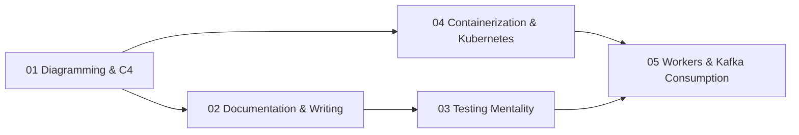

# Diagramming & Operations

How to make systems *legible* and *operable*: model them with diagrams-as-code (C4 + D2 + Mermaid), document and write about them so the knowledge survives, carry a testing mentality into everything, and understand how they actually run -- containers, Kubernetes, workers, and Kafka consumption models -- well enough to draw them honestly.

> **Prerequisites**: Some professional experience shipping software. Pairs with [Software Craftsmanship](../software-craftsmanship/) (the *principles*; this track is the *artifacts*), [Cloud Native](../systems/03-cloud-native/), and [Batch & Streaming](../data-engineering/03-batch-streaming/).

## Why this track exists

Most engineers can write code. Far fewer can make a system *understandable to someone who wasn't there when it was built* -- and an unintelligible system cannot be safely changed, scaled, or operated. This track treats the **understandability and operability of a system as first-class engineering deliverables**, produced with the same rigor as the code:

- A diagram you can `git diff` beats a screenshot nobody can edit.
- A document tested against reality beats tribal knowledge.
- You cannot draw an accurate Kubernetes deployment or Kafka consumer topology unless you understand the operational caveats -- so the operations topics are *also* diagramming practice.

Every topic is anchored to one running example -- **Streamflow**, an event-driven order platform -- so the C4 diagrams you build in topic 01 are the *same system* you learn to containerize, scale, and operate in topics 04-05. As you read each category, you can see it.

## Prerequisite Graph

## Topics

| # | Topic | Primary Reference | Time |
|---|-------|------------------|------|
| 01 | [Diagramming & the C4 Model](01-diagramming-c4/) | [C4 model](https://c4model.com/) (free) + [D2](https://d2lang.com/) + [Mermaid](https://mermaid.js.org/) docs (free) | 1 week |
| 02 | [Documentation & Technical Writing](02-documentation-writing/) | [Diátaxis](https://diataxis.fr/) (free) + [Google Technical Writing](https://developers.google.com/tech-writing) (free) | 1 week |
| 03 | [The Testing Mentality](03-testing-mentality/) | [*SWE at Google* testing chapters](https://abseil.io/resources/swe-book) (free) + [Testing on the Toilet](https://testing.googleblog.com/) (free) | 1 week |
| 04 | [Containerization & Kubernetes](04-containerization-kubernetes/) | [Kubernetes docs](https://kubernetes.io/docs/) (free) + [12-Factor App](https://12factor.net/) (free) | 1-2 weeks |
| 05 | [Distributed Workers & Kafka Consumption Models](05-workers-kafka-consumption/) | [Kafka docs](https://kafka.apache.org/documentation/) (free) + DDIA Ch 11 | 1-2 weeks |

## The running example: Streamflow

All shared diagrams live in [`diagrams/`](diagrams/) as `.d2` source **and** rendered `.svg`. The system context:

Topic 01 explains how this and the container/component/deployment views are built; topics 04-05 teach you to operate the very containers it depicts.

## Quick Start

1. **Never made a diagram you could version-control?** Start with 01 -- install `d2`, render the C4 set, then diff a change.
2. **Docs always go stale on your team?** Jump to 02 (Diátaxis + docs-as-code) and 03 (testing docs against reality).
3. **Asked to "add Kubernetes support"?** Read 04 for the caveats nobody warns you about, then 05 for how worker parallelism is actually bounded.
4. **Data/streaming role?** 05 (Kafka consumption models) pairs directly with [Batch & Streaming](../data-engineering/03-batch-streaming/).
5. **Diagram-as-you-go:** keep `diagrams/` open while reading 04-05 and re-draw each concept yourself.

See [Study Plan](../STUDY-PLAN.md) for the 4-6 week schedule.
