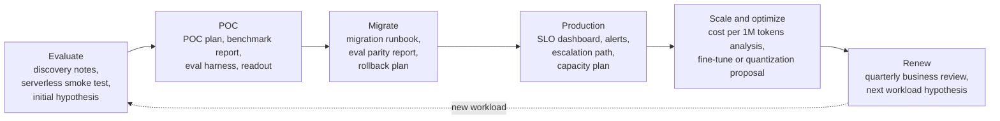

# Discovery

How to run the first calls with a customer so they end in a sized, written **deployment hypothesis** rather than a pleasant conversation. Covers the question bank, call agendas, the note template, and what to do when you do not know the answer.

> Parent track: [Field Engineering](../). Next: [Qualification and Sizing](../02-qualification-and-sizing/) turns these notes into numbers.

## Overview

- **Primary reference**: *The Mom Test* by Rob Fitzpatrick (paid book): ask about past behavior, not opinions about the future
- **Supplementary**: [*Service Level Objectives*](https://sre.google/sre-book/service-level-objectives/), *Site Reliability Engineering* ch. 4 (free): SLIs, percentiles, and measuring what users see; [Dev versus Delta](https://blog.palantir.com/dev-versus-delta-demystifying-engineering-roles-at-palantir-ad44c2a6e87) (free): the original forward deployed model
- **Prerequisites**: the [role landscape](../#role-landscape) in the track README; vocabulary from [LLM Systems & Inference](../../ml/04-llm-systems/) (TTFT, TPOT, prefix caching)
- **Estimated time**: 3-4 days at 6-8 hrs/week
- **Usually led by**: SE or FDE; SA joins for complex integrations

## Key Takeaways

- Discovery has one output: a **deployment hypothesis** with numbers attached. Map every question to the decision it changes, or drop it.
- Ask what they did last Tuesday, not what they expect next year. Measured facts and guesses are different inputs, so record **confidence** next to every number.
- Three questions survive any time cut: can you send real requests with token counts, how do you measure quality today, and what would make you say no.
- Every call has an agenda sent ahead, a note-taker, owners and dates at the end, and notes sent the same working day.
- "I don't know, I will reply by Thursday" beats a guess the customer will build on.

## How to Study

- Read the question bank once, then rewrite it from memory grouped by the decision each question changes. The grouping is the skill.
- Role-play a discovery call with a peer using the [Lexa brief](#exercise). Swap roles and note which questions the "customer" could not answer: those become data requests.
- Fill the note template from a recorded meeting you attended (any topic). The confidence column will feel awkward at first; that is the point.

---

# Concepts & Techniques

## Core Insight

A customer cannot tell you how many GPUs they need, but they can tell you what happened at last Tuesday's peak, how they grade an answer, and who can veto the deal. Discovery converts those observable facts into the inputs of a sizing formula and a decision map. Everything after discovery (sizing, benchmarks, POC, migration, contract) is only as good as the numbers and the names collected here.

## 1. Rules of a Discovery Conversation

**Key ideas**:
- **Map every question to a decision.** If the answer cannot change the model, the tier, the GPU count, the timeline, or the people involved, the question wastes the customer's time.
- **Past behavior over hypotheticals.** "What did last Tuesday's peak look like?" beats "What peak do you expect?" ([The Mom Test](#recommended-reading) is the long version of this rule.)
- **Ask for artifacts, not descriptions.** A day of sanitized request logs with token counts answers ten workload questions at once.
- **Record confidence.** "Peak is 50 req/s" from a dashboard and from a guess are different inputs.
- **Do not lecture.** Do not bring specialists to a discovery call unless the customer brings theirs; it turns discovery into a presentation.

## 2. Question Bank

| Group | Questions | Decision it changes |
|---|---|---|
| **Business outcome** | What product feature does this power? What happens to the business if it is slow, wrong, or down for an hour? Who complains first? What metric moves if this works? | Priority of latency versus quality versus cost; who signs off |
| **Workload shape** | Requests per second at average and peak? What does the daily and weekly curve look like? Can you export a day of request logs with token counts? Input and output token distributions (p50, p95, max)? How much of each prompt is a shared system prompt, few-shot block, or retrieved document? Streaming or not? Multi-turn sessions, and how long? Agent loops with tool calls? Batchable offline work mixed in? | GPU count, prefix caching value, chunked prefill, batch versus online split |
| **Latency SLOs** | Which latency does the user feel: **TTFT**, **TPOT** (time per output token), or end-to-end? What percentile: p50, p95, p99? Measured where: client, gateway, or server? What is the timeout today and what happens on timeout? | Batch size ceiling, replica count, speculative decoding, region placement |
| **Quality bar** | How do you know an answer is good today? Do you have an eval set, how large, and is it labelled? Who wrote the rubric? Do you use an LLM judge, and which model? What score is "good enough"? Any golden conversations that must never regress? | POC exit criteria, quantization tolerance, whether a fine-tune is in scope |
| **Model choice and fine-tune status** | Which model serves this today, closed or open, which version? Have you tried open models, which, and what broke? Do you have a fine-tune, LoRA adapters, how many? Is the training data yours to use? | Model size, multi-LoRA serving, fine-tuning scope |
| **Data residency, compliance, security** | Which certifications must the vendor hold: SOC 2 Type II, HIPAA (BAA), GDPR, ISO 27001? Is **zero data retention** required, including for logs and metrics? Any region constraint (EU, specific country)? Must traffic stay in your VPC or cloud account? Private networking (PrivateLink, VPC peering)? Who runs the security review and how long does it take? | Serverless versus dedicated versus BYOC; timeline (see [06](../06-commercials-and-security/)) |
| **Spend and cost target** | What do you spend per month on inference today? What is the target **cost per 1M tokens** or cost per request? Is spend growing faster than usage? Committed spend with another vendor? | Serverless versus dedicated breakeven, quantization, distillation |
| **Integration surface** | OpenAI SDK, Anthropic SDK, LangChain, a gateway (LiteLLM, OpenRouter, in-house)? Function calling, structured output or JSON schema, logprobs, n > 1, vision, embeddings? Retry and fallback logic today? | Migration effort, feature gaps to check before the POC |
| **Team and decision makers** | Who owns the integration day to day? Who decides, who can veto (security, finance, procurement)? Do they have an MLE, or is this an app team? Who is on call? | Call invitees, how much you build versus advise |
| **Timeline** | When does this need to be in production, and what drives that date? Any freeze windows, launches, renewals with the incumbent? | POC length, staffing, when to start the security review |

**Three questions for every first call**, even if time runs out:

1. Can you send a sample of real requests with token counts (sanitized is fine)?
2. How do you measure quality today?
3. What would make you say no to this project?

## 3. The Customer Journey

Discovery is the first step of a longer journey. Knowing the whole journey tells you which facts you will need later, so you can ask for them now.



| Step | Customer question | Field artifact | Topic |
|---|---|---|---|
| **Evaluate** | Is an open model good enough for us, and is this vendor fast enough? | Discovery notes, quality and latency smoke test on serverless, initial deployment hypothesis | 01, [02](../02-qualification-and-sizing/) |
| **POC** | Does it hit our SLO and quality bar on our data? | POC plan with success criteria, benchmark harness and report, eval harness, POC readout | [03](../03-performance-testing-engagements/), [04](../04-poc-and-evaluation/) |
| **Migrate** | How do we move from OpenAI or Anthropic APIs without regressions? | Migration runbook: endpoint swap, template diffs, eval parity report, shadow-traffic plan, rollback plan | [05](../05-migration-and-cutover/) |
| **Production** | Will it stay up and stay fast? | SLO dashboard, alert thresholds, on-call contacts, escalation path, capacity plan | [07](../07-escalation-and-handoff/) |
| **Scale / optimize** | Can we pay less or serve more? | Cost per 1M tokens analysis, fine-tune or distillation proposal, quantization and speculative decoding experiments with eval deltas | [06](../06-commercials-and-security/) |
| **Renew** | Was it worth it? What is next year's workload? | Quarterly business review: SLO attainment, spend trend, incidents and resolutions, next workload hypothesis | [06](../06-commercials-and-security/) |

If the journey stalls, the stalled step usually lacks its artifact.

## 4. Running a Call

**Rules for every call**: send the agenda 24 hours ahead with the questions you need answered, name a note-taker (default: you), end with owners and dates, send notes within the same working day.

**Discovery (45 min)**

| Min | Item |
|---|---|
| 0-5 | Introductions, roles, confirm the goal of the call: understand the workload well enough to propose a deployment |
| 5-15 | Business outcome and what success looks like |
| 15-35 | Workload, SLOs, quality measurement, constraints (question bank; skip what they sent ahead) |
| 35-40 | Gaps: data you need (request sample, eval set) |
| 40-45 | Next steps: who sends what by when; propose the technical deep dive |

**Technical deep dive (60 min)**

| Min | Item |
|---|---|
| 0-5 | Recap discovery, confirm the hypothesis inputs are still right |
| 5-25 | Walk their architecture: request path, gateway, retries, where latency is measured |
| 25-45 | Present the deployment hypothesis and the math ([02](../02-qualification-and-sizing/)); invite them to break it |
| 45-55 | Feature gaps: tool calling, structured output, logprobs, regions |
| 55-60 | Agree POC scope candidates |

POC kickoff and readout agendas are in [04](../04-poc-and-evaluation/); the incident call agenda is in [07](../07-escalation-and-handoff/).

## 5. Note Template

```markdown
# <Customer> / <call type> / <YYYY-MM-DD>

Attendees: <name, role, side>
Goal of call: <one line>

## Facts learned
- <fact> (source: <person or doc>)

## Numbers
| Metric | Value | Confidence (measured / estimated / guessed) |

## Decisions
- <decision> (decided by <name>)

## Open questions
- <question> -> owner <name>, due <date>

## Action items
- [ ] <action> -> owner, due

## Hypothesis changes
- <what changed in the deployment hypothesis and why>
```

The **confidence** column is the most useful field. It tells the person sizing the deployment ([02](../02-qualification-and-sizing/)) which inputs to stress-test first.

## 6. Saying "I Don't Know"

Guessing on a technical call costs more than not knowing: the customer will build on the guess. Use a fixed form: what you know, what you do not, when they will hear back.

> "I know FP8 KV cache is supported on that engine. I don't know whether it is enabled for this model on our dedicated tier. I'll confirm with the performance team and reply by Thursday."

Then write it in the open questions list and reply by Thursday even if the answer is "still checking".

**Who to bring in, and when**:

| Bring in | When | Not when |
|---|---|---|
| **MLE** | The question is about quality: eval design, fine-tuning feasibility, why outputs differ | The question is about latency or price |
| **Performance team (MTS)** | You have exhausted configuration you control and have a repro ([07](../07-escalation-and-handoff/)) | On a first discovery call |
| **Research** | The ask needs a method that does not exist as a recipe yet | A known recipe has not been tried |
| **AE** | Scope, pricing, or contract terms come up | Technical questions |
| **Security / compliance owner** | A questionnaire, DPA, or BAA is requested ([06](../06-commercials-and-security/)) | Before you know which certifications matter |

## Connections to Other Tracks

| Concept | Connected Track | Application |
|---------|-----------------|-------------|
| TTFT, TPOT, prefix caching, batch versus online | [LLM Systems & Inference](../../ml/04-llm-systems/) | Understanding what each workload question changes |
| Percentiles, SLIs, SLOs | [Observability](../../systems/04-observability/) | Asking where and how latency is measured |
| Eval sets, judges, rubrics | [LLM Evaluation](../../ai-platform-engineering/09-llm-evaluation/) | The quality-bar questions |
| Writing for a reader who was not in the room | [Documentation Writing](../../diagramming-and-documentation/02-documentation-writing/) | Notes sent the same day |

## Company Relevance

| Company | How This Appears | Difficulty |
|---------|-----------------|------------|
| Fireworks AI / Together AI / Baseten | SE and FDE interviews often include a mock discovery call on an inference workload | Intermediate |
| Palantir | The forward deployed ("Delta") model: embedded discovery with one customer | Intermediate |
| OpenAI / Anthropic (solutions and applied AI roles) | Discovery for enterprise API adoption | Intermediate |
| Databricks / Snowflake (field engineering) | Discovery that sizes a platform deployment before a POC | Intermediate |

## Recommended Reading

| Resource | Why | Cost |
|---|---|---|
| *The Mom Test* by Rob Fitzpatrick | Asking about past behavior instead of opinions | Paid (book) |
| [Service Level Objectives](https://sre.google/sre-book/service-level-objectives/), *SRE* ch. 4 | SLIs, SLOs, percentiles | Free |
| [Dev versus Delta](https://blog.palantir.com/dev-versus-delta-demystifying-engineering-roles-at-palantir-ad44c2a6e87) | One customer, many capabilities, versus product engineers | Free |
| [The Palantirization of everything](https://a16z.com/the-palantirization-of-everything/) (a16z) | Why startups copy the FDE model, and where it breaks | Free |

## Exercise

This brief is the shared customer for every exercise in the track. Keep your documents in one folder; later topics build on them.

### Brief: Lexa

> **Lexa** is a legal-tech company. Their contract-review feature sends a contract section and a 3,000-token instruction block to a closed frontier API and asks for a JSON list of risky clauses. Contract sections are 6,000 to 14,000 tokens; outputs are 400 to 1,200 tokens. Traffic is 3 req/s average, 8 req/s peak, weekdays 9:00 to 18:00 CET, near zero at night. A nightly job re-reviews 40,000 sections when the instruction block changes. Spend is $60k/month and growing 15% monthly. Their largest customers are EU law firms; contract text must stay in the EU and must not be retained. They have 150 hand-labelled sections with expert annotations. The VP of Engineering wants to cut cost by half by Q2; the CISO has not been involved yet. They say "latency is fine today, around 8 seconds per section."

### Deliverable

**Discovery notes** (one page) using the [note template](#5-note-template):

- Every fact from the brief in the Numbers or Facts section, with confidence marked.
- The ten questions you would still ask, each mapped to the decision it changes (use the question bank groups).
- The risks you see, at least one each for quality, latency, compliance, and commercial.
- The agenda for the technical deep dive you would send next.

### Done when

- No question appears without the decision it changes.
- "Latency is fine, around 8 seconds" is marked with its confidence and paired with a question about where and at what percentile it was measured.
- The CISO appears in the open questions with an owner and a date.
- A peer reading only your notes could size the deployment in [02](../02-qualification-and-sizing/#exercise) without asking you a question.
