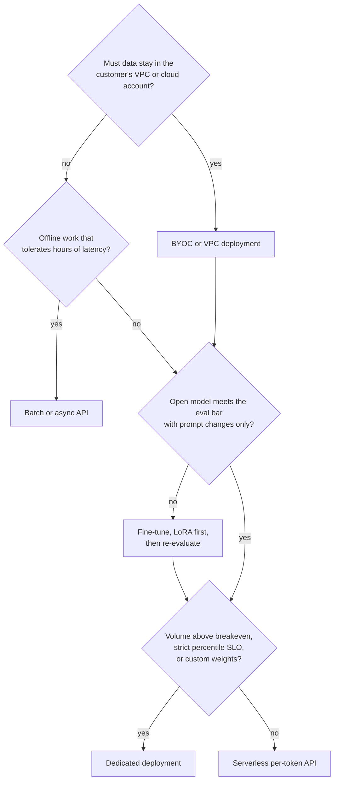

# Qualification and Sizing

How to turn discovery answers into a **deployment hypothesis**: a sized proposal for model, tier, GPU count, quantization, and cost that you expect to be wrong by up to 2x and intend to correct with a benchmark. Also covers when a workload is a poor fit and the serverless versus dedicated versus fine-tune versus BYOC decision.

> Parent track: [Field Engineering](../). Formulas are derived in [Serving & Load](../../ml/04-llm-systems/serving-and-load/); this topic applies them. Next: [Performance Testing Engagements](../03-performance-testing-engagements/) confirms or refutes the hypothesis.

## Overview

- **Primary reference**: [Serving, Capacity & Load Testing](../../ml/04-llm-systems/serving-and-load/) (free, in repo): roofline, memory budget, Little's law, serverless versus dedicated breakeven, the SLO-to-config runbook
- **Supplementary**: [`capacity.py`](../../ml/04-llm-systems/serving-and-load/code/capacity.py) (in repo) to check every number below; Databricks' [LLM Inference Performance Engineering](https://www.databricks.com/blog/llm-inference-performance-engineering-best-practices) (free)
- **Prerequisites**: [Discovery](../01-discovery/); [LLM Systems & Inference](../../ml/04-llm-systems/) sections 2, 3, and 11
- **Estimated time**: 3-4 days at 6-8 hrs/week
- **Usually led by**: FDE or SE for the first pass; SA for multi-workload accounts; performance team reviews unusual models

## Key Takeaways

- A hypothesis is a written guess with its math visible. Its purpose is to give the benchmark something to confirm or refute.
- Size online and offline work separately. A nightly batch job priced on an online deployment is the most common sizing mistake.
- For workloads with a long shared system prompt, **prefix caching** is often the largest single lever, and one dynamic token at the top of the prompt destroys it.
- Decode step time, not memory, usually binds the replica count under a TPOT SLO. Check both.
- Every row of the hypothesis has a "risk to test" column, and each risk becomes a benchmark or eval in the POC.

## How to Study

- Redo the worked example by hand, then with [`capacity.py`](../../ml/04-llm-systems/serving-and-load/code/capacity.py). Where the two disagree, find which assumption differs.
- Change one input at a time (double the output length, remove prefix caching, switch to BF16) and predict the effect on GPU count before recomputing.
- Practice explaining each step to a non-technical buyer in one sentence. If you cannot, see the "two audiences" table in [Serving & Load section 8](../../ml/04-llm-systems/serving-and-load/#8-load-testing-methodology).

---

# Concepts & Techniques

## Core Insight

Sizing is arithmetic on four numbers from discovery: arrival rate, input length, output length, and the latency SLO. Token rates give compute; Little's law gives concurrency; concurrency times context gives KV memory; decode step time against the TPOT target gives sequences per replica. Each step has a published formula. The field skill is choosing honest inputs, stating assumptions, and knowing which step will bind.

## 1. Qualification: Is This a Fit?

Before sizing, check that the workload can win. A deal that fails here should be told so early.

| Signal | Why it matters | What to do |
|---|---|---|
| No eval set and no plan to build one | The POC cannot pass or fail on quality | Offer to help build a small labelled set before the POC; otherwise do not start |
| Quality depends on a capability open models lack today (measured, not assumed) | Migration will regress | Propose a narrow sub-workload, or a routing setup ([Model Routing](../../ai-platform-engineering/11-model-routing-and-cascades/)) |
| Volume far below dedicated breakeven and no SLO | Serverless is fine; a heavy engagement costs more than it returns | Point them at serverless docs; light touch |
| Hard compliance need the vendor does not meet (for example, region not offered) | Blocks the deal regardless of performance | Confirm with the security owner before any technical work ([06](../06-commercials-and-security/)) |
| No decision maker identified, no date | POCs without a decision drift | Ask "what would make you say no" again; get a name |

## 2. Worked Example: Support Copilot

Customer brief from discovery:

| Item | Value |
|---|---|
| Use case | Agent-assist copilot drafting replies inside a support tool |
| Traffic | 50 req/s peak (6 h/day), 15 req/s average |
| Tokens | 2,000 input (1,200 shared system prompt and policy text), 300 output |
| SLO | TTFT p95 < 500 ms, streaming; TPOT p95 < 40 ms (they read as it streams) |
| Quality | Today on a closed frontier API; eval set of 400 graded tickets; a 70B-class open model matched it in their spike |
| Constraints | SOC 2 Type II; no prompt logging |

Assume a Llama-3.3-70B-class dense model: 70B parameters, 80 layers, 8 KV heads, head dim 128. Hardware: H100 SXM 80 GB, about 3.35 TB/s HBM and about 1,979 dense FP8 TFLOPS peak.

**Step 1: token rates at peak.**

```text
prefill tokens/s = 50 x 2,000            = 100,000
uncached prefill = 50 x (2,000 - 1,200)  =  40,000   (shared prefix hits the cache)
decode tokens/s  = 50 x 300              =  15,000
```

**Step 2: compute.** Forward FLOPs per token are about 2N (attention FLOPs are small at 2k context).

```text
prefill: 40,000 x 2 x 70e9 = 5.6 PFLOP/s
decode : 15,000 x 2 x 70e9 = 2.1 PFLOP/s
total                      = 7.7 PFLOP/s
at ~40% of FP8 peak per GPU (~0.8 PFLOP/s): ~10 GPUs of pure compute
```

Without prefix caching, prefill alone is 14 PFLOP/s, nearly double the fleet. **Prefix caching is the largest single lever in this workload.** Confirm the shared prefix is byte-identical across requests: a timestamp or user name at the top of the system prompt destroys it.

**Step 3: concurrency (Little's law).** Requests in the system L = arrival rate x time in system.

```text
time in system = TTFT + 300 x TPOT = 0.5 + 300 x 0.040 = 12.5 s
L at peak      = 50 x 12.5 = ~625 concurrent sequences
```

**Step 4: KV cache memory.** Per token: 2 (K and V) x layers x KV heads x head dim x bytes.

```text
FP8 KV per token = 2 x 80 x 8 x 128 x 1 B = 160 KiB
per sequence     = 2,300 tokens x 160 KiB = ~360 MiB (full)
unique per seq   = 1,100 tokens x 160 KiB = ~170 MiB (shared prefix stored once per replica)
fleet at peak    = 625 x 170 MiB = ~105 GiB
```

A tensor-parallel-4 (TP4) replica has 320 GB of HBM. After ~70 GB of FP8 weights and ~30 GB of activations and runtime overhead, roughly 220 GB is left for KV. Memory is not the binding constraint; decode step time is.

**Step 5: decode step time per replica.** Decode is bandwidth-bound: each step reads the weights once and each sequence's KV.

```text
weights read : 70 GB / (4 x 3.35 TB/s x 0.7 efficiency)  = ~7.5 ms
KV read, B=200 seqs: 200 x 360 MiB / 9.4 TB/s            = ~8 ms
compute, B=200: 200 x 140 GFLOP / (4 x 0.8 PFLOP/s)      = ~9 ms (overlaps memory)
step time ~16-20 ms, plus interleaved prefill chunks -> TPOT ~25-35 ms
```

So about 200 sequences per TP4 replica fit under the 40 ms TPOT target. 625 / 200 = 3 to 4 replicas at peak.

**Step 6: TTFT check.** 800 uncached tokens x 140 GFLOP = 112 TFLOP on a TP4 replica at ~3.2 PFLOP/s is about 35 ms. A full cache miss (2,000 tokens) is about 90 ms. TTFT p95 under 500 ms holds if queueing stays bounded, which means keeping replicas below roughly 80% of saturation throughput and enabling **chunked prefill** so long prompts do not stall decode.

**Step 7: serverless versus dedicated.** Plug in current list prices; the numbers below are **placeholders** to show the method. [06](../06-commercials-and-security/) expands this into a full TCO.

```text
monthly tokens = 15 req/s x 2,300 tok x 2.592e6 s = ~89B tokens
serverless     = 89,000 x $P per 1M tokens         (P = $0.90 -> ~$80k/month)
dedicated      = GPU-hours x $R per GPU-hour
                 peak 12 GPUs x 6 h + floor 4 GPUs x 18 h = 144 GPU-h/day
                 144 x 30 x $R                       (R = $4.00 -> ~$17k/month)
effective cost = $17k / 89,000 = ~$0.19 per 1M tokens, only if autoscaling holds that floor
```

## 3. Writing the Hypothesis

| Decision | Proposal | Why | Risk to test |
|---|---|---|---|
| Model | 70B-class dense, customer's spike choice | Matched quality in their spike | Eval parity on all 400 tickets |
| Tier | Dedicated, autoscaling 1 to 4 replicas; serverless for week-1 evaluation | Steady volume and a p95 SLO | Scale-up time versus the morning ramp |
| GPUs | TP4 on H100, 3 replicas at peak (12 GPUs), range 10 to 16 | Steps 2 and 5 | Measured saturation point per replica |
| Quantization | FP8 weights and FP8 KV cache | Halves weight reads and KV memory versus BF16 | Eval delta must stay inside the agreed tolerance |
| Prefix caching | On; system prompt frozen and placed first | Halves prefill compute | Hit rate on real traffic |
| Chunked prefill | On | Protects TPOT when a long prompt arrives | p99 TPOT under mixed lengths |
| Speculative decoding | Test EAGLE or MTP drafts off-peak | Helps TPOT at low batch; gains shrink near saturation | Acceptance rate on support replies |

Every row in "risk to test" becomes a benchmark in [03](../03-performance-testing-engagements/) or an eval in [04](../04-poc-and-evaluation/). Range the GPU count (10 to 16 here) rather than quoting one number: the benchmark picks the point.

## 4. Choosing the Surface

**Key ideas**:
- **Serverless** (shared, per-token pricing): no capacity planning, no idle cost, no control of batch, SLO isolation, or custom weights. Right for evaluation, low or spiky volume, and popular models.
- **Dedicated** (per GPU-hour): isolation, custom weights and flags, predictable latency; the customer pays for idle. Right above the breakeven volume ([06](../06-commercials-and-security/#3-breakeven)) or under a strict percentile SLO.
- **Batch or async**: offline work that tolerates hours of latency. Price it separately from the online path.
- **Fine-tune**: when prompt changes plateau below the quality bar. LoRA first, so the base model stays shared and multi-LoRA serving keeps cost down ([Serving & Load section 7](../../ml/04-llm-systems/serving-and-load/#7-multi-lora-serverless-vs-dedicated-cold-start-autoscaling)).
- **BYOC / VPC**: when data must not leave the customer's cloud account or network. Expect a longer timeline and fewer managed features; check the vendor's current status (some offerings are preview or enterprise only, see the [role landscape](../#what-the-companies-sell)).



A single customer often lands on more than one box: dedicated for the online path, batch for the nightly job, serverless for an internal tool.

## Connections to Other Tracks

| Concept | Connected Track | Application |
|---------|-----------------|-------------|
| Roofline, memory budget, Little's law | [Serving & Load](../../ml/04-llm-systems/serving-and-load/) | Steps 2 to 6 |
| FP8 weights and KV cache | [Quantization](../../ml/04-llm-systems/quantization/) | Quantization row of the hypothesis |
| GQA, MoE, MLA and their KV cost | [Foundation Models](../../ml/05-foundation-models/) | Reading a `config.json` before sizing |
| LoRA versus full fine-tuning | [Training & Post-Training](../../ml/07-training-and-post-training/) | The fine-tune box in the decision |
| Routing between models | [Model Routing & Cascades](../../ai-platform-engineering/11-model-routing-and-cascades/) | When the answer is two models |

## Company Relevance

| Company | How This Appears | Difficulty |
|---------|-----------------|------------|
| Fireworks AI / Together AI / Baseten | "How many GPUs for this workload?" whiteboard question in FDE and SE loops | Advanced |
| NVIDIA (solutions architecture) | Sizing NIM or TensorRT-LLM deployments for enterprise customers | Advanced |
| AWS / GCP / Azure (AI specialist SAs) | Sizing managed endpoints versus self-hosted GPUs | Intermediate |
| Anyscale / Modal | Serverless versus reserved capacity conversations | Intermediate |

## Exercise

**Warm-up** (no writing): say aloud which surface you would propose, and why, for a 5 req/s internal chatbot, a nightly 200M-token classification job, and a regulated healthcare assistant that cannot leave the customer's VPC.

**Deliverable**: a one-page **deployment hypothesis for Lexa** ([brief](../01-discovery/#exercise)), built from your discovery notes:

- Pick a model size class and state the assumed config (layers, KV heads, head dim) and GPU type.
- Size the **online path** and the **nightly job** separately: token rates, compute, Little's law concurrency, KV memory per sequence at 14k + 3k input, replica count.
- State whether prefix caching applies (the 3,000-token instruction block) and what it saves.
- Choose a surface for each path using the decision flowchart.
- Fill the hypothesis table with a "risk to test" for every row.

### Done when

- Every number has its formula visible and its inputs traced to a line in your discovery notes.
- The nightly job is priced on a batch or async surface, not on the online deployment.
- The GPU count is a range, and the benchmark that will narrow it is named.
- The EU residency constraint appears in the surface choice.
