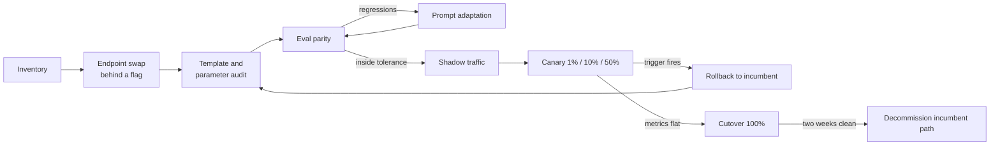

# Migration and Cutover

How to move a customer's production traffic from a closed API (OpenAI, Anthropic, or another provider) to an open model on a new endpoint without regressions: the endpoint swap, the template and sampling audit, shadow traffic, canary, cutover, and a rollback that has been tested. Ends with the failure-mode table to use when something goes wrong.

> Parent track: [Field Engineering](../). Follows a successful [POC](../04-poc-and-evaluation/). Template and tokenizer depth lives in [Model Loading section 7](../../ml/04-llm-systems/model-loading/#7-tokenizers-and-chat-templates). Next: [Escalation and Handoff](../07-escalation-and-handoff/) when a failure is not yours to fix.

## Overview

- **Primary reference**: [Model Loading: Tokenizers and Chat Templates](../../ml/04-llm-systems/model-loading/#7-tokenizers-and-chat-templates) (free, in repo)
- **Supplementary**: [*Software Engineering at Google*](https://abseil.io/resources/swe-book) (free) chapters on deprecation and large-scale changes; [LLM Evaluation](../../ai-platform-engineering/09-llm-evaluation/) (free, in repo) for parity checks; [Serving & Load](../../ml/04-llm-systems/serving-and-load/) (free, in repo) for the latency rows of the failure table
- **Prerequisites**: [POC and Evaluation](../04-poc-and-evaluation/)
- **Estimated time**: 3 days at 6-8 hrs/week
- **Usually led by**: FDE with the customer's engineering owner; SE hands off here at most companies

## Key Takeaways

- Most migrations fail on quality, not latency, and most quality failures are **formatting**, not model capability: chat template, stop tokens, sampling defaults, tool-call parsing.
- An **OpenAI-compatible** endpoint makes the code change one line; it does not make the behavior identical. Audit every parameter.
- Shadow traffic proves the system under real load with no user risk; canary proves it with bounded user risk. Skip neither.
- A rollback plan is only real once it has been executed and timed.
- Keep the incumbent's credentials and code path live for two weeks after cutover.

## How to Study

- Point an OpenAI SDK client at a local `vllm serve` with a small instruct model. Send the same request with and without an explicit `temperature` and `top_p`; note what changes.
- Render a chat template locally from a model's `tokenizer_config.json` and compare the token IDs to what the server reports. Find one way they could differ.
- Walk the failure-mode table and, for each row, write the exact command or metric you would check first on your local setup.

---

# Concepts & Techniques

## Core Insight

A migration replaces a component the customer has tuned prompts against for months. Their prompts implicitly encode the incumbent's template, defaults, and quirks. The work is to make those implicit dependencies explicit (inventory and audit), prove the replacement on real traffic without user exposure (shadow), then expose users gradually with an automatic way back (canary and rollback).

## 1. Migration Playbook

| Step | Action | Done when |
|---|---|---|
| **1. Inventory** | List every call site: model, parameters, features used (tools, JSON mode, logprobs, n, vision, seed) | Spreadsheet with every call site and its parameters |
| **2. Endpoint swap** | Point the OpenAI-compatible client at the new `base_url` and model name behind a feature flag | A single request succeeds through the customer's real code path |
| **3. Template and parameter audit** | Check every item in [section 2](#2-template-and-parameter-differences) | Every item checked and noted |
| **4. Eval parity** | Run the customer's eval on incumbent and candidate with identical inputs; diff per case, not just aggregate ([04](../04-poc-and-evaluation/#3-eval-parity-against-the-incumbent)) | Delta inside the agreed tolerance; every golden case passes; regressions read by a human |
| **5. Prompt adaptation** | Fix regressions by prompt changes first, fine-tune only if prompt changes plateau | Delta inside tolerance or a scoped fine-tune proposal |
| **6. Shadow traffic** | Mirror a slice of production to the candidate, discard responses, log latency, errors, and outputs | 3+ days covering a weekly peak; no new error classes; latency within SLO |
| **7. Canary** | Route 1%, 10%, 50% of real traffic with automatic rollback triggers on error rate and latency | Each step holds for an agreed period with product metrics flat |
| **8. Cutover** | 100% to candidate; keep incumbent credentials and code path live | Two weeks clean |
| **9. Rollback plan** | Flag flip back to incumbent, tested during canary, with a named owner | Rollback executed once in staging and timed |

## 2. Template and Parameter Differences

| Item | What goes wrong | Check |
|---|---|---|
| **Chat template** | Server applies a different template than the model was trained with; system prompt dropped or merged into the first user turn | Render the template locally from the model's `tokenizer_config.json` and compare to server-side token IDs |
| **Duplicate BOS** | Client prepends BOS and the template adds another | Inspect the first token IDs of a rendered prompt |
| **Stop tokens** | Generation runs past the turn end, or stops early on a token that appears in content | Compare `eos_token_id` lists in `generation_config.json` versus server config |
| **Sampling defaults** | Incumbent default temperature differs from the model card's recommended settings; `top_p`, `top_k`, repetition penalty unset | Pin every sampling parameter explicitly in client code |
| **Tool call format** | Model emits tool calls in its native format; parser on the server does not match the model family | Run every tool-using eval case and assert parsed `tool_calls` |
| **Structured output** | JSON mode on the incumbent is not schema-constrained decoding on the new server, or vice versa | Validate 100% of outputs against the schema |
| **Reasoning tokens** | Reasoning models emit thinking blocks the client does not strip, inflating output and cost | Check for reasoning fields or tags in raw responses |
| **Tokenizer** | Same text, different token count: context limits, `max_tokens`, and cost shift | Re-count eval prompts with the new tokenizer |
| **Context length** | Served max length is lower than the model card's | Query the server's model metadata; test the p99-length prompt |

## 3. Shadow, Canary, Cutover, Rollback

**Key ideas**:
- **Shadow** at the gateway or in application code: send the request to both, return the incumbent's answer, log the candidate's latency, errors, `finish_reason`, and output. Sample outputs for human or judge comparison. Cost: the shadowed slice is paid for twice, once per provider, so size the slice deliberately.
- **Shadow data handling**: production prompts now reach the new vendor. The data processing agreement, residency, and retention terms must already be signed ([06](../06-commercials-and-security/)).
- **Canary triggers** are numbers agreed in advance: error rate above X, TTFT p95 above the SLO for Y minutes, a product metric (thumbs-down rate, escalation rate) moving more than Z. Automatic beats manual at 2 a.m.
- **Sticky routing**: route by user or session, not per request, so one conversation does not switch models mid-thread.
- **Cutover** is a flag value, not a deploy. The incumbent path stays deployable.
- **Rollback** is rehearsed in staging during the canary and timed. Name the person who can flip it and make sure they have access outside business hours.

## 4. Common Failure Modes

| Symptom | Likely cause | First check |
|---|---|---|
| Quality drop after migration | Chat template mismatch or sampling defaults | Diff rendered token IDs; pin temperature and `top_p` |
| Quality drop after quantization | Outlier-sensitive layers or KV quantization on long context | Eval BF16 versus FP8 on the same cases; split long and short prompts |
| Outputs never stop or stop mid-sentence | Wrong stop tokens or `max_tokens` default | Inspect `finish_reason` distribution |
| Tool calls returned as plain text | Tool parser does not match the model family | Raw completion versus parsed response for one case |
| TTFT spikes when one long prompt arrives | No chunked prefill; long prefill blocks the batch | Engine config; correlate spikes with prompt length |
| TTFT high at moderate load | Queueing: replica past saturation, or autoscaler too slow | Waiting-queue metric; compare rate to closed-loop saturation |
| TPOT degrades as traffic grows | Batch too large for the TPOT target | Running sequences versus TPOT curve; cap max batch |
| Throughput falls, then requests restart | KV cache exhausted, preemption and recompute | Preemption counter, KV usage near 100% |
| Prefix cache hit rate near zero | Dynamic content (timestamp, user ID) at the start of the prompt | Diff the first 100 tokens of two requests |
| Cost overrun on dedicated | Low batch utilization: provisioned for peak, idle off-peak | GPU-hours versus tokens served by hour; autoscaling floor |
| Cost overrun on serverless | Volume crossed the dedicated breakeven, or output tokens grew (reasoning) | Monthly tokens versus breakeven; output length trend |
| Cold starts after idle | Scale-to-zero with large weights | Time from scale event to first 200; consider a minimum of one replica |
| Rate-limit errors at modest load | Account tier limits, not capacity | Response headers and tier limits |
| Nondeterministic outputs at temperature 0 | Batch-dependent numerics | Expected behavior; see [reproducibility](../../ml/04-llm-systems/serving-platforms.md#reproducibility-mechanism-availability-and-incentives) |
| Latency fine on server, slow for users | Client-side buffering, proxy without streaming, cross-region hops | Measure TTFT at the client and the server for one request ([03](../03-performance-testing-engagements/#5-measuring-from-the-customers-region)) |

When the first check does not explain the symptom and the remaining knobs are not yours, escalate with the [07](../07-escalation-and-handoff/) template.

## Connections to Other Tracks

| Concept | Connected Track | Application |
|---------|-----------------|-------------|
| Chat templates, tokenizers, `generation_config.json` | [Model Loading](../../ml/04-llm-systems/model-loading/) | Section 2 audit |
| Constrained decoding, speculative decoding | [LLM Systems & Inference](../../ml/04-llm-systems/) | Structured output and latency rows |
| Feature flags, progressive delivery | [Cloud Native](../../systems/03-cloud-native/) | Canary and rollback mechanics |
| Deprecation, large-scale changes | [Software Craftsmanship](../../software-craftsmanship/) | Retiring the incumbent path |
| Alerting on SLOs | [Observability](../../systems/04-observability/) | Canary triggers |

## Company Relevance

| Company | How This Appears | Difficulty |
|---------|-----------------|------------|
| Fireworks AI / Together AI / Baseten | "Migrate from OpenAI in a week" engagements; debugging template mismatches | Advanced |
| OpenRouter / LiteLLM users | Gateway-level provider swaps and fallbacks | Intermediate |
| Any platform team | Progressive delivery of a critical dependency | Intermediate |

## Exercise

**Deliverable**: a **migration runbook for Lexa** ([brief](../01-discovery/#exercise)) after the POC in [04](../04-poc-and-evaluation/#exercise) passed:

- The inventory row for the contract-review call site, with every parameter they likely use (JSON output, `max_tokens`, temperature).
- The section 2 audit filled for the chosen model, with how you would check each item.
- Shadow plan: traffic slice, duration covering a weekday peak, what is logged, and the EU-only data path.
- Canary steps with numeric rollback triggers, including one on JSON schema validity.
- The rollback owner and how the rollback was tested.

### Done when

- Every canary step has an automatic trigger with a number.
- Schema validity is checked on 100% of shadow outputs.
- The runbook says what happens to the nightly job during cutover.
- A peer could execute the rollback from the document alone.
