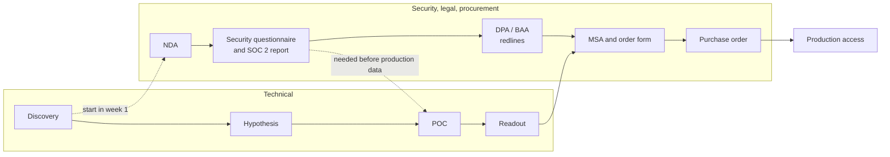

# Commercials and Security

The numbers and paperwork that decide a deal after the technology works: cost per 1M tokens, total cost of ownership (TCO) of self-hosting versus serverless versus dedicated, the breakeven point, committed-use and reserved capacity, security questionnaires, and how procurement and legal fit into the timeline.

> Parent track: [Field Engineering](../). Builds on the sizing in [02](../02-qualification-and-sizing/) and the measured operating point from [03](../03-performance-testing-engagements/). The cost formulas are derived in [Serving & Load sections 7 and 8](../../ml/04-llm-systems/serving-and-load/#7-multi-lora-serverless-vs-dedicated-cold-start-autoscaling).

**All prices in this topic are placeholders chosen to show the method.** They are not any vendor's list price. Plug in the current price sheet and the customer's real rates before showing a number to anyone.

## Overview

- **Primary references**: [AICPA SOC 2 overview](https://www.aicpa-cima.com/topic/audit-assurance/audit-and-assurance-greater-than-soc-2) (free); [GDPR full text with article index](https://gdpr-info.eu/) (free); [HHS HIPAA cloud computing guidance](https://www.hhs.gov/hipaa/for-professionals/special-topics/cloud-computing/index.html) (free)
- **Supplementary**: [45 CFR 164.504](https://www.ecfr.gov/current/title-45/subtitle-A/subchapter-C/part-164/subpart-E/section-164.504) (free, business associate contract requirements); [European Commission: EU-US data transfers](https://commission.europa.eu/law/law-topic/data-protection/international-dimension-data-protection/eu-us-data-transfers_en) (free); [CSA Cloud Controls Matrix and CAIQ](https://cloudsecurityalliance.org/research/cloud-controls-matrix) (free); [Shared Assessments SIG](https://sharedassessments.org/sig/) (paid license)
- **Prerequisites**: [Qualification and Sizing](../02-qualification-and-sizing/); the [role landscape](../#who-owns-what) (pricing authority sits with the AE)
- **Estimated time**: 3-4 days at 6-8 hrs/week
- **Usually led by**: AE owns price and contract; SE or FDE owns the cost model and technical answers; the vendor's security team owns questionnaire answers and reports

## Key Takeaways

- Quote **cost per 1M tokens at the measured operating point**, never at the roofline bound or at saturation.
- TCO of self-hosting is dominated by **utilization** and **engineering time**, not the GPU hourly rate. A cheap GPU at 40% utilization with two engineers on call is not cheap.
- Dedicated beats serverless above a **breakeven** volume: `GPU $/hr / serverless $ per token`. Below it, serverless wins; above it, dedicated wins only if utilization actually stays high.
- Commit to the **floor** of the forecast, not the peak. Unused commitment is money the customer may lose.
- Security and legal review is usually the longest pole. Start it in the first week of the POC, and answer questionnaires from the vendor's maintained answers, never from memory.

## How to Study

- Rebuild the TCO table below in a spreadsheet with every input as a cell. Then change utilization from 50% to 80% and engineering from 1.5 FTE to 0.5 FTE and see which moves the answer more.
- Read GDPR [Article 28](https://gdpr-info.eu/art-28-gdpr/) and [Chapter V](https://gdpr-info.eu/chapter-5/) headings once. You will not give legal advice, but you must know which document a question is about.
- Download a public CAIQ from any cloud vendor's trust center and find the ten questions an inference vendor would find hardest (retention, sub-processors, model training on customer data).

---

# Concepts & Techniques

## Core Insight

Customers do not buy tokens per second; they buy a cost line and a risk profile. The commercial conversation converts the benchmark into money (cost per 1M tokens, TCO, breakeven, commitment size), and the security conversation converts the deployment architecture into assurances (reports, contracts, data flows). Both are evidence-based, both have owners other than the field engineer, and both take calendar time the technical plan must account for.

## 1. Cost per 1M Tokens

**Serverless** prices are usually per token, often with separate input and output rates. Compute the **blended** rate from the customer's own mix:

```text
cost per request = T_in x p_in / 1e6 + T_out x p_out / 1e6
blended $ per 1M = cost per request / (T_in + T_out) x 1e6

support copilot (02): T_in = 2,000, T_out = 300
placeholders: p_in = $0.60, p_out = $2.40 per 1M
cost per request = 2,000 x 0.60e-6 + 300 x 2.40e-6 = $0.00120 + $0.00072 = $0.00192
blended          = 0.00192 / 2,300 x 1e6 = ~$0.83 per 1M tokens
```

Input-heavy workloads (RAG, long documents, contract review) are dominated by the input rate. Some providers discount cached input tokens; whether and how much is vendor-specific (**check the current price sheet**).

**Dedicated** cost per 1M tokens at an operating point:

```text
$ per 1M = (GPU $/hr x GPUs) / (tokens/s served x 3600) x 1e6

over a month: $ per 1M = (GPU-hours x $/GPU-hour) / tokens served x 1e6
support copilot: (4,320 GPU-h x $4.00) / 89,000M tokens = ~$0.19 per 1M
```

The monthly form already includes idle time, which is why it is the honest one.

## 2. TCO: Self-Hosting versus Serverless versus Dedicated

Self-hosting looks cheapest on a GPU price list because the list omits utilization and people. A TCO includes:

| Cost line | Self-host (own cloud GPUs) | Dedicated (vendor) | Serverless (vendor) |
|---|---|---|---|
| **GPU time** | All reserved hours, used or idle | GPU-hours including the autoscaling floor | None (in the token price) |
| **Utilization risk** | Customer's | Customer's, reduced by autoscaling | Vendor's |
| **Engineering** | Engine tuning, upgrades, kernels, autoscaling, on-call | Integration and monitoring | Integration |
| **Capacity risk** | Customer must secure GPUs | Vendor capacity, may need reservation | Rate limits by tier |
| **Hidden** | Observability, storage, egress, security review of the stack | Egress, private networking | Rate-limit headroom |

Worked example, support copilot (89B tokens/month, [02](../02-qualification-and-sizing/#2-worked-example-support-copilot)). **Every price and salary is a placeholder.**

| Line | Self-host | Dedicated | Serverless |
|---|---|---|---|
| GPU or token cost | 12 GPUs x 720 h x $2.50 = $21,600 (no cheap autoscaling on reserved GPUs) | 4,320 GPU-h x $4.00 = $17,280 | 89,000 x $0.90 = $80,100 |
| Utilization of paid GPU-hours | ~50% (needs ~4,320 of 8,640 h) | High while the floor holds | n/a |
| Engineering | 1.5 FTE x $250k / 12 = $31,250 | 0.25 FTE = $5,208 | 0.1 FTE = $2,083 |
| Other (observability, storage, egress) | $2,000 | $500 | $0 |
| **Monthly total** | **~$54,850** | **~$22,990** | **~$82,180** |
| **Effective $ per 1M tokens** | ~$0.62 | ~$0.26 | ~$0.92 |

Read the result, not the digits: with these inputs, self-hosting loses to dedicated because of engineering time and idle reserved GPUs, and serverless loses because the volume is well above breakeven. The self-host column also assumes the customer's engine matches the vendor's throughput per GPU, which is the vendor's core claim and should be tested, not assumed ([03](../03-performance-testing-engagements/)).

## 3. Breakeven

**Per GPU**: dedicated is cheaper when the tokens a GPU serves per hour exceed what the same money buys on serverless.

```text
breakeven tokens per GPU-hour = R / (P / 1e6)
placeholders R = $4.00 per GPU-hour, P = $0.90 per 1M blended:
  4.00 / 0.90e-6 = ~4.44M tokens per GPU-hour = ~1,235 tokens/s sustained per GPU
```

**Per deployment**: a dedicated deployment has a minimum monthly cost (its floor). Volume below that floor's token equivalent belongs on serverless.

```text
floor: one TP4 replica, always on = 4 GPUs x 720 h x $4.00 = $11,520/month
breakeven monthly tokens = 11,520 / 0.90 x 1e6 = ~12.8B tokens/month (~4,900 tok/s average)
support copilot: 89B tokens/month -> well above breakeven -> dedicated
```

[Serving & Load section 7](../../ml/04-llm-systems/serving-and-load/#7-multi-lora-serverless-vs-dedicated-cold-start-autoscaling) works the same formula with different placeholders. Two checks before trusting a breakeven:

- The dedicated deployment must actually serve that volume **within the SLO** (goodput from [03](../03-performance-testing-engagements/#7-reporting-curves-goodput-cost)), not just at saturation.
- The traffic curve matters: a workload with a high peak-to-mean ratio pays for idle GPUs unless autoscaling is fast enough for the ramp.

## 4. Committed Use and Reserved Capacity

| Concept | What the customer gets | What the customer risks | Field rule |
|---|---|---|---|
| **On-demand** | Pay per hour or per token, no commitment | Price and availability not guaranteed | Use for evaluation and POCs |
| **Reserved capacity** | Specific GPUs held for a term at a lower rate | Pays whether used or not | Size to the measured floor, not the peak |
| **Committed spend** | A discount in exchange for spending an agreed amount over a term, often across products | Unused commitment may be forfeited (terms vary by vendor and contract; **not confirmed** for any specific vendor) | Commit to the floor of the forecast; leave growth to on-demand |
| **Ramp deal** | Commitment that grows by quarter as migration proceeds | Migration slips while the commitment rises | Tie ramp steps to migration milestones in [05](../05-migration-and-cutover/) |

The AE owns price and terms. The field engineer owns the inputs: measured operating point, forecast floor and peak, migration schedule, and the risk list. Never quote a discount.

## 5. Security and Compliance

### What the customer will ask for

| Item | What it is | What to provide | Source |
|---|---|---|---|
| **SOC 2 Type II** | Independent CPA attestation of a service organization's controls against the AICPA Trust Services Criteria: security, availability, processing integrity, confidentiality, privacy. Type II covers whether controls operated effectively **over a period** (commonly several months to a year); Type I covers design at a **point in time** | The current report from the vendor's trust center, usually under NDA; a bridge letter if the report period ended months ago | [AICPA](https://www.aicpa-cima.com/topic/audit-assurance/audit-and-assurance-greater-than-soc-2) |
| **ISO/IEC 27001** | Certification of an information security management system | Certificate and scope statement | [ISO](https://www.iso.org/standard/27001) |
| **HIPAA BAA** | A covered entity may disclose protected health information (PHI) to a business associate only with satisfactory written assurances, a contract meeting 45 CFR 164.504(e). HHS guidance treats a cloud provider handling ePHI as a business associate, directly liable for unauthorized uses and for Security Rule safeguards | Whether the vendor signs a BAA, for which products (often not all), and on which tiers | [45 CFR 164.504](https://www.ecfr.gov/current/title-45/subtitle-A/subchapter-C/part-164/subpart-E/section-164.504), [HHS cloud guidance](https://www.hhs.gov/hipaa/for-professionals/special-topics/cloud-computing/index.html) |
| **GDPR processor terms (DPA)** | The vendor processes personal data on the customer's behalf. Article 28 requires a contract setting the subject matter, duration, nature and purpose of processing, data types, and data subjects; sub-processors need the controller's prior written authorization | The vendor's DPA and sub-processor list | [Art. 28](https://gdpr-info.eu/art-28-gdpr/) |
| **International transfers** | Transfers outside the EU/EEA need a Chapter V basis: an adequacy decision (for example, the EU-US Data Privacy Framework, adopted 10 July 2023, for certified US companies) or safeguards such as standard contractual clauses | Transfer mechanism and certification status | [Chapter V](https://gdpr-info.eu/chapter-5/), [Commission](https://commission.europa.eu/law/law-topic/data-protection/international-dimension-data-protection/eu-us-data-transfers_en), [DPF](https://www.dataprivacyframework.gov/) |
| **Data residency** | Processing (and any storage) stays in a named region | Region list for the tier and model; where logs, metrics, and support access live | Vendor docs |
| **Zero data retention (ZDR)** | Prompts and completions are not stored after the request | Exactly what is still kept (token counts for billing, abuse-monitoring logs, error traces), for how long, and on which tiers | Vendor docs and contract |
| **No training on customer data** | Customer prompts and outputs are not used to train vendor models | Contract clause, not a blog post | Contract |
| **VPC / BYOC** | Private networking to a vendor deployment, or the deployment runs in the customer's cloud account | Network diagram, who operates it, who holds keys, which features are missing in that mode | Vendor docs ([role landscape](../#what-the-companies-sell)) |

### Questionnaires

| Questionnaire | Publisher | Shape |
|---|---|---|
| **CAIQ v4** | Cloud Security Alliance | About 260 yes/no questions aligned with the Cloud Controls Matrix, including the shared security responsibility model |
| **SIG** | Shared Assessments | Broad third-party risk questionnaire for any vendor, common in financial services and healthcare |
| **Custom spreadsheet** | The customer's security team | Often a mix of the above plus AI-specific questions: training on data, retention, model provenance, prompt injection handling |

**Rules**: answer from the vendor's maintained answer library and current reports; route any new question to the security team with a due date; never improvise an answer about retention, sub-processors, or encryption. A wrong "yes" in a questionnaire can become a contractual misrepresentation.

## 6. Procurement and Legal in the Timeline



**Key ideas**:
- **Run both tracks in parallel.** Discovery should surface who owns security review and how long it takes ([01](../01-discovery/#2-question-bank)); start it the day production data is mentioned.
- **Production data needs paperwork first.** A POC on real prompts usually needs the NDA, the security review, and the DPA (or BAA) signed.
- **Redlines take calendar time.** DPA and BAA terms go between legal teams; the field engineer supplies accurate technical descriptions of data flows and does not negotiate terms.
- **Procurement has its own gates**: vendor onboarding, insurance certificates, payment terms. Ask the customer's champion for their checklist early.
- How long each step takes varies widely by customer size and industry; this track gives no typical durations (**not sourced**). Ask the customer.

## Connections to Other Tracks

| Concept | Connected Track | Application |
|---------|-----------------|-------------|
| Cost per token, breakeven, autoscaling floor | [Serving & Load](../../ml/04-llm-systems/serving-and-load/) | Sections 1 to 3 |
| Authorization, tenancy, access control | [Authorization & Access Control](../../ai-platform-engineering/08-authorization-and-access-control/) | Questionnaire answers on access |
| Private networking, VPCs, Kubernetes | [Cloud Native](../../systems/03-cloud-native/) | VPC and BYOC architecture |
| Audit logging, retention | [Observability](../../systems/04-observability/) | What ZDR means for logs and traces |

## Company Relevance

| Company | How This Appears | Difficulty |
|---------|-----------------|------------|
| Fireworks AI / Together AI / Baseten | TCO and breakeven conversations; trust center and questionnaire support | Intermediate |
| AWS / GCP / Azure | Committed use and reserved capacity programs; BAA-eligible service lists | Intermediate |
| OpenAI / Anthropic (enterprise) | ZDR, data residency, and DPA conversations for API customers | Intermediate |
| Healthcare and legal-tech customers | BAA and residency as gating requirements | Advanced |

## Exercise

**Deliverable**: a **commercial and security brief for Lexa** ([brief](../01-discovery/#exercise)), two pages, built on your [02](../02-qualification-and-sizing/#exercise) hypothesis and [03](../03-performance-testing-engagements/#exercise) operating point:

1. Blended cost per 1M tokens for their mix on serverless (placeholder prices, labelled), and dedicated cost per 1M at your operating point.
2. A TCO table for self-host, dedicated, and serverless, with the online path and the nightly job as separate rows, compared with their $60k/month spend and the "cut by half" goal.
3. The breakeven volume and where Lexa sits today and after six months of 15% monthly growth.
4. A commitment recommendation (floor, ramp) with the risk to Lexa if migration slips.
5. The CISO meeting: the list of documents you bring (report, DPA, sub-processor list, residency and retention statement) and the five questions you expect, each with who answers it.

### Done when

- Every price is labelled as a placeholder or sourced with a date.
- The nightly job is priced on a batch or async surface.
- The growth projection changes or confirms the tier choice, and the brief says which.
- No security answer is asserted without naming the document that supports it.
