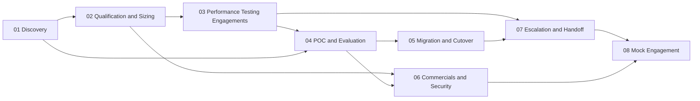

# Field Engineering

How customer-facing engineers at an inference and fine-tuning cloud turn technical depth into a customer outcome: discovery, sizing, benchmarks run for a customer, POCs, migrations, commercials, security reviews, and escalations.

> **Prerequisites**: Comfort reading a latency percentile and a cost table. The technical depth (prefill and decode, KV cache, load testing math) lives in [LLM Systems & Inference](../ml/04-llm-systems/) and [Serving & Load](../ml/04-llm-systems/serving-and-load/) and is linked here, not repeated.

## Overview

- **For**: **sales engineers (SE)**, **solutions architects (SA)**, and **forward deployed engineers (FDE)** at companies shaped like Fireworks AI, Together AI, or Baseten
- **Primary references**: Google SRE book, [*Service Level Objectives*](https://sre.google/sre-book/service-level-objectives/) (free); *The Mom Test* by Rob Fitzpatrick (paid book); the [vLLM benchmark CLI docs](https://docs.vllm.ai/en/stable/cli/bench/serve.html) (free)
- **Supplementary**: [*The Site Reliability Workbook*: Implementing SLOs](https://sre.google/workbook/implementing-slos/) (free), [*Postmortem Culture*](https://sre.google/sre-book/postmortem-culture/) (free), [Dev versus Delta](https://blog.palantir.com/dev-versus-delta-demystifying-engineering-roles-at-palantir-ad44c2a6e87) (free, the original FDE model), [The Palantirization of everything](https://a16z.com/the-palantirization-of-everything/) (free)
- **Estimated time**: 3-4 weeks at 6-8 hrs/week

## Key Takeaways

- Every call and every week of work ends in a **written artifact** someone else can act on. If it did not produce one, it did not happen.
- Discovery exists to produce a **deployment hypothesis** with numbers. A question that cannot change a number is not worth the customer's time.
- A benchmark run for a customer is a contract in progress: their traffic shape, their region, their SLO, curves instead of single numbers, and no promise the data does not support.
- A POC exists to make a decision, so its criteria must be able to fail.
- Escalations that list **what was ruled out** get acted on; forwarded complaints get meetings.

## How to Study

- Work the topics in order on one mock customer, **Lexa** (brief in [01](01-discovery/#exercise)). Each topic's exercise produces one document; together they form a full engagement file.
- When a topic links into an ML track, open it and redo the math yourself. A field engineer who cannot defend a number in front of the customer's MLE loses the room.
- Read every template aloud as if on a call. If a line would make you hesitate, you do not yet know what it asks for.

## Prerequisite Graph

## Topics

| # | Topic | Primary Reference | Time |
|---|-------|------------------|------|
| 01 | [Discovery](01-discovery/) | *The Mom Test* (Fitzpatrick) + [SRE book ch. 4](https://sre.google/sre-book/service-level-objectives/) (free) | 3-4 days |
| 02 | [Qualification and Sizing](02-qualification-and-sizing/) | [Serving & Load](../ml/04-llm-systems/serving-and-load/) (free, in repo) | 3-4 days |
| 03 | [Performance Testing Engagements](03-performance-testing-engagements/) | [`vllm bench serve`](https://docs.vllm.ai/en/stable/cli/bench/serve.html) (free) + [AIPerf](https://github.com/ai-dynamo/aiperf) (free) | 4-5 days |
| 04 | [POC and Evaluation](04-poc-and-evaluation/) | [LLM Evaluation](../ai-platform-engineering/09-llm-evaluation/) (free, in repo) | 3 days |
| 05 | [Migration and Cutover](05-migration-and-cutover/) | [Model Loading: tokenizers and chat templates](../ml/04-llm-systems/model-loading/) (free, in repo) | 3 days |
| 06 | [Commercials and Security](06-commercials-and-security/) | [AICPA SOC 2](https://www.aicpa-cima.com/topic/audit-assurance/audit-and-assurance-greater-than-soc-2) (free) + [GDPR text](https://gdpr-info.eu/) (free) | 3-4 days |
| 07 | [Escalation and Handoff](07-escalation-and-handoff/) | [*Postmortem Culture*](https://sre.google/sre-book/postmortem-culture/) (free) | 2 days |
| 08 | [Mock Engagement](08-mock-engagement/) | Topics 01 to 07 applied to your own platform from the [course](../paths/course/); the role-path [capstone](08-mock-engagement/capstone.md) | course pass 11 |

## Role Landscape

Company facts below were checked against primary sources on October 6, 2026. Product surfaces change monthly; recheck before a call.

### What the companies sell

All three sell GPU time wrapped in software. The wrapper differs: a per-token API, a dedicated deployment, a training job, or raw cluster capacity. A field engineer has to know which wrapper fits a workload and what each costs the customer in control and money.

| Surface | Fireworks AI | Together AI | Baseten |
|---|---|---|---|
| **Serverless per-token API** | Pay-per-token serverless models ([quickstart](https://docs.fireworks.ai/getting-started/quickstart)) | Serverless inference, OpenAI-compatible ([quickstart](https://docs.together.ai/docs/quickstart), [product](https://www.together.ai/serverless-inference)) | Model APIs, compatible with OpenAI Chat Completions and Anthropic Messages (beta); tool calling, structured output, JSON mode ([Model APIs](https://docs.baseten.co/inference/model-apis/overview)) |
| **Dedicated / on-demand deployment** | On-demand deployments on dedicated GPUs with autoscaling ([on-demand quickstart](https://docs.fireworks.ai/getting-started/ondemand-quickstart), [why on-demand](https://fireworks.ai/blog/why-gpus-on-demand)) | Dedicated endpoints, single-tenant GPUs ([docs](https://docs.together.ai/docs/dedicated-endpoints)) | Dedicated deployments of open or custom models ([first model](https://docs.baseten.co/development/model/build-your-first-model)) |
| **Fine-tuning** | Managed: SFT, DPO, LoRA. Training API: LoRA and full-parameter, custom loops, RL (GRPO and others via SDK). RFT listed ([intro](https://docs.fireworks.ai/fine-tuning/finetuning-intro)) | SFT, LoRA (default) or full fine-tuning, preference tuning with DPO ([overview](https://docs.together.ai/docs/fine-tuning-overview), [DPO](https://docs.together.ai/docs/fine-tuning/preference-tuning)). RL not listed in fine-tuning docs at review | Training Jobs and Loops ([training](https://docs.baseten.co/training/overview), [loops](https://docs.baseten.co/loops/overview)). Supported method list **not confirmed** |
| **Batch / async** | Batch inference ([docs](https://docs.fireworks.ai/guides/batch-inference)) | Batch API ([docs](https://docs.together.ai/docs/batch-inference)) | Async inference with webhooks on any dedicated deployment, queue up to 72 h ([docs](https://docs.baseten.co/inference/async)). No separate batch product **confirmed** |
| **Embeddings / rerank** | Embeddings and reranking ([docs](https://docs.fireworks.ai/guides/querying-embeddings-models)) | Embeddings and rerank API; rerank models need a dedicated endpoint ([rerank](https://docs.together.ai/docs/inference/embeddings/rerank)) | BEI engine for embeddings and reranking ([BEI](https://docs.baseten.co/engines/bei/overview)) |
| **Custom model deploy** | Custom model upload on on-demand deployments ([announcement](https://fireworks.ai/blog/custom-models-h100s-on-demand-deployments)); multi-LoRA serving ([blog](https://fireworks.ai/blog/multi-lora)) | Custom model upload ([docs](https://docs.together.ai/docs/custom-models)); Dedicated Container Inference for your own Docker image ([docs](https://docs.together.ai/docs/dedicated-container-inference)) | **Truss** (package model code) and **Chains** (multi-step, multi-model pipelines) ([Chains](https://docs.baseten.co/development/chain/overview), [Truss CLI](https://docs.baseten.co/reference/cli/truss/overview)) |
| **GPU clusters** | Not a headline product at review; **not confirmed** | H100, H200, B200, GB200 clusters with storage for training or large batch ([docs](https://docs.together.ai/docs/gpu-clusters-overview), [product](https://www.together.ai/gpu-clusters)) | Not offered as a raw cluster product; **not confirmed** |
| **BYOC / VPC / self-hosted** | Bring Your Own Cluster on customer Kubernetes, Private Preview, enterprise only, inference only ([BYOC](https://docs.fireworks.ai/ecosystem/integrations/byoc/overview)); SageMaker as a compute option ([blog](https://www.fireworks.ai/blog/aws-sagemaker)) | Together Enterprise Platform in customer VPC or on-prem ([announcement](https://www.together.ai/blog/introducing-the-together-enterprise-platform), [architecture](https://docs.together.ai/docs/together-deployments)) | Baseten Cloud, single-tenant isolated VPC, self-hosted in customer VPC, hybrid ([hosting options](https://docs.baseten.co/hosting-options/overview)) |
| **Engine work** | **FireAttention** custom kernels: V3 targets AMD MI300, V4 targets NVFP4 on B200 ([V3](https://fireworks.ai/blog/fireattention-v3), [V4](https://fireworks.ai/blog/fireattention-v4-fp4-b200)) | Together inference engine, **Together Kernel Collection**, **ATLAS** runtime-learning speculator ([ATLAS](https://www.together.ai/blog/adaptive-learning-speculator-system-atlas), [research](https://www.together.ai/blog/foundational-research-powering-efficient-inference-at-scale)) | **Baseten Inference Stack**: Engine-Builder-LLM on TensorRT-LLM, BIS-LLM for MoE, speculative decoding (EAGLE, MTP, n-gram), KV-aware routing ([guide](https://www.baseten.co/resources/guide/the-baseten-inference-stack/), [BIS-LLM](https://docs.baseten.co/engines/bis-llm/overview)) |

Notes on the table:

- Vendor speedup numbers (for example FireAttention versus vLLM, ATLAS throughput) are the vendor's own benchmarks on the vendor's chosen workload. Treat them as hypotheses to reproduce on the customer's traffic ([03](03-performance-testing-engagements/)), the same rule as in [LLM Serving Platforms](../ml/04-llm-systems/serving-platforms.md).
- Compliance claims change and are contractual. Fireworks publishes SOC 2 Type II and HIPAA status and a no-logging default for open-model prompts ([data security](https://docs.fireworks.ai/guides/security_compliance/data_security)). Together documents its posture at [privacy and security](https://docs.together.ai/docs/privacy-and-security). For any customer, get the current report from the trust center, not from a blog ([06](06-commercials-and-security/)).
- Together also sells **Sandbox** and **Managed Storage** ([products](https://www.together.ai/products)); Baseten documents a **Frontier Gateway** for model labs ([overview](https://docs.baseten.co/overview)). These are outside this track.

**Common to all three**: an OpenAI-compatible request surface, a serverless tier for evaluation, a dedicated tier for SLOs, fine-tuning feeding deployment, and a proprietary engine layer on top of or beside vLLM, SGLang, or TensorRT-LLM. The differentiator they sell is the engine and the people. Field engineers are part of the people.

### Who owns what

| Role | Owns | Does not own | Typical artifact |
|---|---|---|---|
| **Sales engineer (SE)** | Pre-sales technical fit for one deal: demos, discovery, first sizing, security questionnaire answers, technical win | Post-sale delivery, engine internals | Discovery notes, demo, questionnaire answers, initial hypothesis |
| **Solutions architect (SA)** | Reference architectures and integration patterns across many accounts; pre-sales fit for complex deals | Deep per-customer build | Architecture diagram, RFP answers, reference design |
| **Forward deployed engineer (FDE)** | The customer's technical outcome: discovery, deployment hypothesis, POC, migration, first-line diagnosis, translating customer problems into internal tickets; often writes code in the customer's repo | Engine internals, model research, pricing authority | Discovery notes, POC plan, benchmark report, migration runbook, escalation report |
| **MLE (customer-facing or platform)** | Fine-tuning runs, eval pipelines, model packaging, quality debugging | Contract, account relationship | Training config, eval report, model card |
| **MTS / performance engineer** | Engine, kernels, scheduler, quantization recipes, per-model tuning | Customer relationship, POC scope | Engine flags, kernel patch, perf regression fix |
| **Research scientist** | New methods: speculators, quantization schemes, post-training recipes | Production SLOs | Paper, prototype, recipe |
| **Account executive (AE)** | Commercial relationship, pricing, contract, renewal | Technical claims | Order form, mutual action plan |

Titles overlap between companies. At some, the FDE, SE, and SA are one person; at others, the FDE writes production code and the SE never leaves pre-sales. Ask in the interview which rows the role covers. The topics below mark which role usually leads each activity.

### Where the depth lives

| Customer says | Where to get the depth |
|---|---|
| "Why is DeepSeek cheaper to serve than a dense model of the same size?" | [Foundation Models](../ml/05-foundation-models/) (MoE, MLA), [LLM Systems](../ml/04-llm-systems/) |
| "Our fine-tune works in Transformers but outputs garbage on your endpoint." | [Model Loading](../ml/04-llm-systems/model-loading/) (chat templates, tokenizers), [05](05-migration-and-cutover/) |
| "How many GPUs do we need for 50 req/s?" | [Serving & Load](../ml/04-llm-systems/serving-and-load/), [02](02-qualification-and-sizing/) |
| "Latency spikes every few minutes." | [Serving & Load](../ml/04-llm-systems/serving-and-load/) (chunked prefill, preemption), [07](07-escalation-and-handoff/) |
| "Should we do LoRA or full fine-tuning? Or RL?" | [Training & Post-Training](../ml/07-training-and-post-training/) |
| "Is it cheaper than running it ourselves?" | [06](06-commercials-and-security/) |
| "Why should we trust an open model over GPT or Claude?" | [04](04-poc-and-evaluation/) (eval parity on their data) |

## Quick Start

1. **New to customer-facing work?** Start with 01: the question bank and the note template are the whole job on day one.
2. **Asked "how many GPUs" on a call?** 02 has the worked sizing example and the serverless versus dedicated decision.
3. **Customer wants a benchmark?** 03: run it on their traffic shape, from their region, against their SLO.
4. **Running a POC?** 04 for the plan, then 05 for the migration that follows a successful one.
5. **Procurement or the CISO just joined the thread?** 06.
6. **Something is broken and it is not yours to fix?** 07.

See [Study Plan](../STUDY-PLAN.md) for the schedule.
