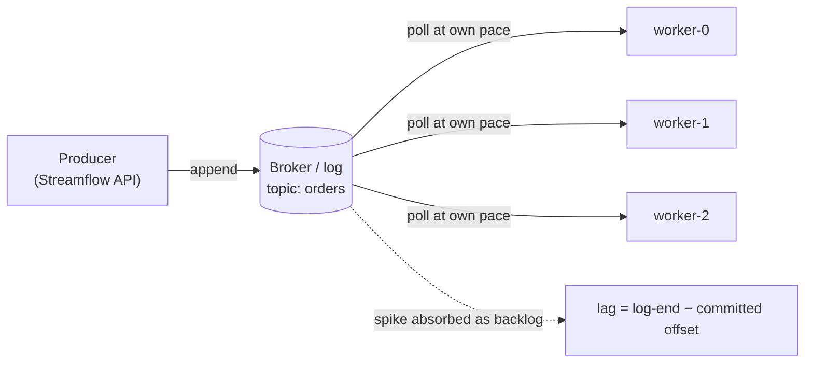
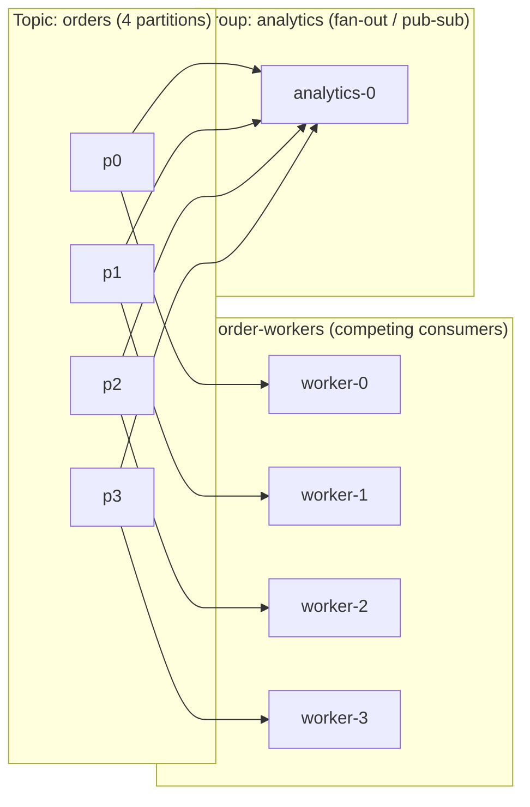
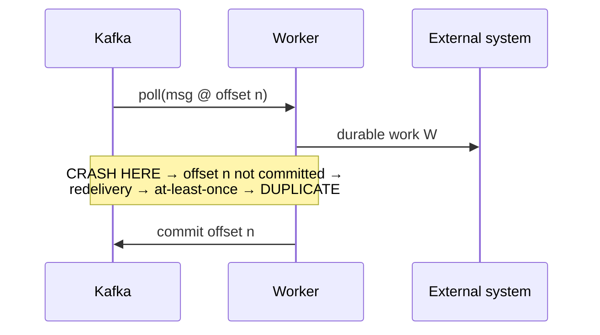

# Messaging & Distributed Queueing

## Overview

- **Primary references**:
  - [Apache Kafka documentation](https://kafka.apache.org/documentation/) (free) -- the Design, Implementation, and Replication sections
  - [The Log: What every software engineer should know](https://engineering.linkedin.com/distributed-systems/log-what-every-software-engineer-should-know-about-real-time-datas-unifying-abstraction) by Jay Kreps (free) -- why a log subsumes queues and pub-sub
  - *Designing Data-Intensive Applications* (Kleppmann) Ch 11 "Stream Processing" -- recommended
- **Supplementary**:
  - [Enterprise Integration Patterns](https://www.enterpriseintegrationpatterns.com/) -- Competing Consumers, Publish-Subscribe, Dead Letter Channel
  - [The Raft paper: *In Search of an Understandable Consensus Algorithm*](https://raft.github.io/raft.pdf) (free) -- the consensus behind KRaft and Redpanda
  - [ZooKeeper: Wait-free coordination for Internet-scale systems](https://www.usenix.org/legacy/event/atc10/tech/full_papers/Hunt.pdf) (free) -- ZAB and the coordinator Kafka shed
  - [KIP-500](https://cwiki.apache.org/confluence/display/KAFKA/KIP-500%3A+Replace+ZooKeeper+with+a+Self-Managed+Metadata+Quorum) (KRaft), [KIP-405](https://cwiki.apache.org/confluence/display/KAFKA/KIP-405%3A+Kafka+Tiered+Storage) (tiered storage), [KIP-932](https://cwiki.apache.org/confluence/display/KAFKA/KIP-932%3A+Queues+for+Kafka) (share groups) (all free)
- **Prerequisites**: [Concurrency & Systems](../../archive/algorithms/12-concurrency-systems/), [System Design](../../systems/01-system-design/)
- **Estimated time**: 1-2 weeks at 8-10 hrs/week

## Key Takeaways

- **Async messaging decouples *receiving* a request from *doing* it.** A producer drops a message; a worker pool consumes at its own pace. That single move buys elasticity, resilience, and load-leveling.
- **A queue deletes on ack; a log retains and replays.** Kafka is a partitioned, replicated *log* where consumers own their offset -- the broker is dumb. This is the deepest dividing line in the whole space.
- **Pull gives backpressure for free.** A pull consumer (`poll()`) never receives more than it asked for; the surplus stays in the log as lag. A push broker can overwhelm a slow consumer unless you bolt on prefetch limits.
- **Consumer groups give you both classic patterns at once**: competing consumers *within* a group, publish-subscribe *across* groups.
- **"Exactly-once" is mostly idempotency.** The default is at-least-once; the math says the crash window between work and commit is unavoidable, so design handlers to tolerate duplicates.
- **Someone has to own the metadata.** ZooKeeper (ZAB) did it externally; KRaft (Raft) folds it into Kafka itself; Redpanda runs Raft per partition with no JVM and no coordinator at all.

## How to Study

- Run [`code/backpressure_demo.py`](code/backpressure_demo.py) (`python3`, no deps) and [`code/backpressure-demo.go`](code/backpressure-demo.go) (`go run`). Watch the push model drop messages while the pull model converts the surplus into lag -- nothing lost.
- Run [`code/raft_election.go`](code/raft_election.go) (`go run`) and trace terms and votes. Confirm a minority partition can never elect a leader. This is the KRaft controller quorum in miniature.
- Stand up a single-broker [Redpanda](https://redpanda.com/) (no ZooKeeper, Kafka-API compatible) and a vanilla [Kafka in KRaft mode](https://kafka.apache.org/documentation/#kraft). Produce 1000 messages to `orders`; start a second consumer *group* and replay from offset 0 -- prove fan-out and retention.
- For the operational side of consuming (rebalancing, DLQs, sizing the pool), continue to [Distributed Workers](../../ai-platform-engineering/05-durable-orchestration-and-workers/).

---

# Concepts & Techniques

## Core Insight

Asynchronous messaging decouples *receiving* a request from *doing* it. A producer appends a message to a log or queue and walks away; a pool of workers consumes at its own pace. That one indirection buys three properties at once:

- **Elasticity** -- scale producers and consumers independently; add workers to drain faster.
- **Resilience** -- a worker crash doesn't lose the message; it stays in the broker until durably processed.
- **Load-leveling** -- a traffic spike becomes a *longer queue*, not a meltdown. The broker absorbs the burst; the workers catch up.

Every design decision below -- queue vs log, push vs pull, competing vs fan-out, the delivery semantics -- is a different answer to "how does a message get from a producer to the worker that handles it, and what happens when something fails along the way?"

## 1. Queue vs log: delete-on-ack vs retained-and-replayable

The classic message **queue** (RabbitMQ, Amazon SQS, JMS) and the **log** (Kafka, Redpanda, Pulsar) sit at opposite ends of one axis: *who remembers what has been consumed.*

- **Classic queue -- delete on ack.** The broker holds each message until a consumer acknowledges it, then *deletes* it. The broker tracks per-message state (in-flight, acked, redelivered). Once gone, a message cannot be re-read. Great for task distribution; terrible for "let three independent systems each read the same stream."
- **Log -- retained and replayable.** Kafka keeps every message for a **retention window** (time or size), *regardless of who has read it*. A partition is an ordered, append-only sequence; each message gets a monotonic **offset**. The broker is dumb: it does not track per-consumer progress. Instead **each consumer group records its own committed offset** ("I've processed up to offset N").

The consequences cascade:

- **Replay** -- a new consumer group resets to offset 0 and reprocesses history. Impossible in a delete-on-read queue.
- **Multiple independent readers** -- N groups read the same partition at N different positions, free of charge.
- **The broker scales trivially** -- it appends and serves byte ranges; it does not maintain a per-message acked/unacked set.

| Dimension | Classic queue (SQS, RabbitMQ) | Log (Kafka, Redpanda) |
|-----------|-------------------------------|------------------------|
| Lifecycle | Delete on acknowledgement | Retained for a retention window |
| Progress state | Broker tracks per-message | Consumer tracks its own offset |
| Replay | No (message gone after ack) | Yes (reset offset) |
| Multiple readers of same data | Needs fan-out copies | Native (one group per reader) |
| Ordering | Per-queue, weak (SQS FIFO is the exception) | Strict per-partition |

This is also the **data-engineering** view of Kafka -- the *replayable log* is what makes Kappa architecture possible. See [Batch & Streaming](../../data-engineering/03-batch-streaming/) for log compaction, watermarks, and stream processing built on top; we keep the messaging-dynamics frame here and don't duplicate it.

## 2. Push vs pull (and long-polling): why pull gives free backpressure

Who controls the *pace* of delivery?

- **Push** (RabbitMQ, SQS via callbacks, webhooks): the broker sends messages to the consumer as they arrive. Fast when the consumer keeps up; **dangerous when it doesn't** -- the broker can outrun a slow consumer. You defend with **prefetch / credit limits** (RabbitMQ `prefetch_count`, the consumer says "send me at most K unacked").
- **Pull** (Kafka): the consumer calls `poll()` and asks for the next batch *when it is ready*. It never receives more than it requested.
- **Long-polling** (SQS `ReceiveMessage` with `WaitTimeSeconds`): pull-with-waiting. The consumer asks, and the broker *holds the request open* until a message appears or the timeout fires. It is technically pull, but operationally it behaves like a responsive push work-queue: low latency without busy-spinning.

**Why pull gives backpressure for free.** Backpressure is the system telling a fast producer "slow down, the consumers are behind." With pull, this is automatic and requires no protocol: a slow worker simply calls `poll()` less often, so it pulls fewer messages, so its **consumer lag** (log-end offset − committed offset) grows. Nothing is pushed onto it; nothing overflows; nothing is dropped. The lag *is* the backpressure signal, and it is exactly what your autoscaler watches (KEDA on lag -- [Containers, Kubernetes & Workloads](../01-containers-kubernetes/)). With push you must *build* backpressure (prefetch windows, flow-control credits) or risk a consumer being buried.

| | **Pull (Kafka)** | **Push (RabbitMQ, webhooks)** | **Long-poll (SQS)** |
|--|------------------|-------------------------------|---------------------|
| Who sets pace | Consumer (`poll()`) | Broker | Consumer (asks; broker waits) |
| Backpressure | Free (poll less → lag grows) | Must add prefetch/credits | Free (ask less often) |
| Backlog visibility | **Consumer lag** | Queue depth | `ApproximateNumberOfMessages` |
| Replay | Yes (reset offset) | No (gone after ack) | No |
| Ordering | Per-partition | Usually none | None (FIFO queues excepted) |
| Best for | High-throughput streams, replay, many readers | Per-message ack, simple work queues | Decoupled work queues at AWS |

Run [`code/backpressure_demo.py`](code/backpressure_demo.py) / [`code/backpressure-demo.go`](code/backpressure-demo.go) to see the push model drop the surplus while the pull model retains it as lag.

## 3. Competing consumers vs publish-subscribe

Two foundational distribution patterns (Enterprise Integration Patterns):

- **Competing consumers (work queue)** -- each message goes to *exactly one* worker in a pool. Adding workers spreads the load. This is how you *scale processing*.
- **Publish-subscribe (fan-out)** -- each message goes to *every* subscriber. This is how *independent systems* react to the same event (one pays, one emails, one updates analytics).

Kafka does **both at once** through **consumer groups**:

- *Within* one group, partitions are divided among members -- **competing consumers**. Each partition is owned by exactly one consumer in the group, so each message is handled once by the group.
- *Across* groups, every group sees every message -- **publish-subscribe**. The `order-workers` group and an independent `analytics` group both read all of `orders`, at their own offsets.

(The *operational* corollary -- a 5th worker in `order-workers` sits idle because there is no partition left to own -- lives in [Distributed Workers](../../ai-platform-engineering/05-durable-orchestration-and-workers/), where partition count = parallelism ceiling.)

## 4. Delivery semantics: where the crash window is

Let the worker's job be: (1) `poll` a message at offset *n*, (2) do durable work *W*, (3) `commit` offset *n*. The semantics depend entirely on the *order* of (2) and (3) and *where a crash lands*.

- **At-most-once** -- commit *before* work: `poll → commit → W`. If the crash lands after commit but before *W* completes, the message is *lost* (offset already advanced, work never durably done). No duplicates, possible loss. Rarely acceptable.
- **At-least-once** -- commit *after* work: `poll → W → commit` (the default, correct choice). The **crash window** is the interval between *W* finishing and *commit* landing. A crash there leaves the offset un-advanced, so the message is **redelivered** → **duplicate**. No loss, possible duplicates.
- **"Exactly-once"** -- Kafka transactions plus the idempotent producer give exactly-once *within Kafka-to-Kafka* processing (consume → transform → produce, atomically tied to the offset commit). But the instant your handler touches an *external* system (a payment gateway, an email send), that external effect is outside the transaction and you are back to at-least-once.

**The real fix is idempotency**: make applying the same message twice equal applying it once (dedupe on a natural key, conditional writes, `SETNX` on an idempotency key). The *operational* mechanics -- the idempotency key, the transactional outbox, DLQs, retry topics -- are handled in [Distributed Workers](../../ai-platform-engineering/05-durable-orchestration-and-workers/). Here you only need the conceptual frame: **assume at-least-once everywhere; the duplicate is not a bug, it is the contract.**

## 5. The math: Little's Law and backpressure as an integral

Two formulas explain almost all queueing intuition.

**Little's Law** relates the three quantities you actually measure:

$$ L = \lambda W $$

where **L** is the average number of in-flight (un-acked / un-committed) messages, **λ** is the arrival rate, and **W** is the average time a message spends in the system (latency). It holds for *any* stable system regardless of arrival distribution or service discipline. Read it three ways:

- Fix throughput λ; halve latency W → halve in-flight count L (fewer messages parked in memory / un-acked).
- Observe L and λ; infer W = L / λ without timing anything.
- A worker pool of *c* consumers each holding up to *p* in-flight messages caps L ≤ *c·p*; so the max sustainable arrival rate is λ ≤ *c·p / W*.

**Backpressure as an integral.** Queue depth (consumer lag) is the running area between the arrival and service curves:

$$ \text{lag}(t) = \int_0^t \big(\lambda(s) - \mu(s)\big)\, ds $$

where **μ** is the service rate (how fast the pool drains). When λ > μ, lag *accumulates*; when μ > λ, it *drains*. A spike is a temporary λ > μ that integrates into a lag hump and pays back down later -- this is load-leveling made quantitative. A pull consumer guarantees μ is set by the consumer, so lag can only grow as fast as the *real* shortfall; nothing is forced on a worker beyond μ. [`code/backpressure_demo.py`](code/backpressure_demo.py) computes exactly this integral as the running backlog.

## 6. Coordination & metadata: ZooKeeper vs KRaft vs Redpanda

A cluster of brokers needs a single, agreed-upon answer to "who is the controller, which broker leads partition *p*, what is the current ISR (in-sync replica set)?" That metadata must be **linearizable** -- everyone must agree, and it must survive node failure. This is a consensus problem.

**ZooKeeper (ZAB atomic broadcast).** Classic Kafka stored cluster metadata in an *external* ZooKeeper ensemble. ZooKeeper runs **ZAB (ZooKeeper Atomic Broadcast)** -- a primary-backup protocol: one leader sequences all writes and atomically broadcasts them to followers; a quorum must ack before commit. Kafka's controller watched ZooKeeper znodes and propagated changes to brokers. It works, but: a *second distributed system to operate*, metadata changes bottlenecked through watches, and partition-count scaling limited by how fast metadata could propagate (tens of thousands of partitions before pain).

**Kafka KRaft (Raft-based controller quorum).** [KIP-500](https://cwiki.apache.org/confluence/display/KAFKA/KIP-500%3A+Replace+ZooKeeper+with+a+Self-Managed+Metadata+Quorum) replaced ZooKeeper with **KRaft**: a dedicated quorum of controller nodes that run **Raft** and store all cluster metadata in an internal `__cluster_metadata` log. The Raft leader is the active controller; metadata is just another replicated log that brokers *tail* (pull!) to learn the current state.

- **Controller election** is Raft leader election: candidates bump a **term**, request votes, and a **majority quorum** elects exactly one leader per term (run [`code/raft_election.go`](code/raft_election.go) to see this).
- **Metadata propagation** becomes log replication -- brokers replay the metadata log instead of reacting to ZK watches, so failover is faster and recovery is just "catch up the log."
- **Why removing ZK matters**: one system to run instead of two; metadata as a log scales to *millions* of partitions; faster controller failover; simpler operations and a smaller failure surface. **ZooKeeper removal completed in Apache Kafka 4.0** -- KRaft is now the only mode.

**Redpanda (C++, thread-per-core, Raft per partition).** A clean-room, Kafka-API-compatible rewrite that takes the consensus idea further:

- **No JVM, no ZooKeeper, no separate coordinator.** Written in C++ on the [Seastar](https://seastar.io/) framework with a **thread-per-core (shard-per-core)** model -- each CPU core owns a slice of partitions and its own memory, avoiding lock contention and GC pauses.
- **Raft per partition.** Instead of one external coordinator, *every partition* is its own Raft group managing its own replication and leader. Consensus is embedded everywhere rather than centralized.
- The result is lower tail latency and a single binary -- the strongest contrast to the JVM+ZooKeeper lineage.

**Frontier and contrasting architectures:**

- **KIP-932 share groups ("queues for Kafka")** -- adds *queue-like* competing-consumer semantics with per-message acknowledgement *on top of* the log, decoupling consumer count from partition count. This directly attacks the "partition = parallelism ceiling" limit from the worker side.
- **KIP-405 tiered storage** -- offloads cold log segments to object storage (S3) while hot data stays on local disk, making effectively-infinite retention cheap and decoupling storage from broker disk.
- **Apache Pulsar (the contrasting architecture)** -- separates *serving* (stateless brokers) from *storage* ([Apache BookKeeper](https://bookkeeper.apache.org/) segment store). Brokers hold no data, so they scale and rebalance independently of storage; segments stripe across bookies. It also offers native queue *and* stream semantics. The architectural opposite of Kafka's broker-owns-its-partitions model, and worth knowing as the counterexample.

## Technique Catalog

| Technique | When to apply |
|-----------|---------------|
| Log over queue (Kafka/Redpanda) | Replay, multiple independent readers, retention as source of truth |
| Classic queue (SQS/RabbitMQ) | Simple task distribution, per-message ack, no replay needed |
| Pull / long-poll consumption | When you want backpressure for free and lag-based scaling |
| Push + prefetch limits | Low-latency task delivery where you can bound in-flight work |
| Competing consumers (one group) | Scaling work across a pool |
| Publish-subscribe (multiple groups) | Independent systems reacting to the same events |
| Key by entity | When per-entity ordering matters (per-order, per-user) |
| At-least-once + idempotency | Default for anything touching external systems |
| KRaft / Raft quorum | Self-managed metadata, scale to many partitions, no ZooKeeper |
| Redpanda (thread-per-core, Raft/partition) | No-JVM, low-tail-latency, single-binary Kafka API |
| Tiered storage (KIP-405) | Cheap effectively-infinite retention |
| Share groups (KIP-932) | Queue semantics + parallelism beyond partition count |
| Pulsar (broker/storage split) | Independent scaling of serving vs storage |

## Connections to Other Tracks

| Concept | Connected Track | How |
|---------|-----------------|-----|
| The replayable log, stream processing | [Batch & Streaming](../../data-engineering/03-batch-streaming/) | The data-engineering view of the same Kafka (watermarks, compaction, Kappa) |
| Consuming, rebalancing, DLQs, sizing | [Distributed Workers](../../ai-platform-engineering/05-durable-orchestration-and-workers/) | The operational worker side of these dynamics |
| Lag-based autoscaling | [Containers, Kubernetes & Workloads](../01-containers-kubernetes/) | KEDA scales a consumer group on lag |
| Raft, ZAB, quorums, linearizability | [System Design](../../systems/01-system-design/) | Consensus and replicated-state-machine fundamentals |
| Backpressure, producer/consumer | [Concurrency & Systems](../../archive/algorithms/12-concurrency-systems/) | The same flow-control problem in-process |
| Delivery semantics as invariants | [The Testing Mentality](../../software-craftsmanship/03-testing-mentality/) | "Exactly-once is idempotency" is a property to test |

## Company Relevance

| Company | How This Appears | Focus |
|---------|------------------|-------|
| LinkedIn | Created Kafka; runs it at trillions of messages/day | The log as a unifying abstraction |
| Confluent | The company built around Kafka; drove KRaft and tiered storage | Log internals, exactly-once, KRaft |
| Redpanda Data | Kafka-API-compatible C++ engine, no JVM/ZooKeeper | Thread-per-core, Raft per partition |
| Amazon | SQS/SNS (queue + pub-sub), MSK (managed Kafka) | Push/long-poll work queues at scale |
| StreamNative / Yahoo | Apache Pulsar (BookKeeper-backed) | Broker/storage separation, unified queue+stream |
| Any backend/data role | Async messaging behind a log is the default architecture | Queue-vs-log, push-vs-pull, delivery semantics |
