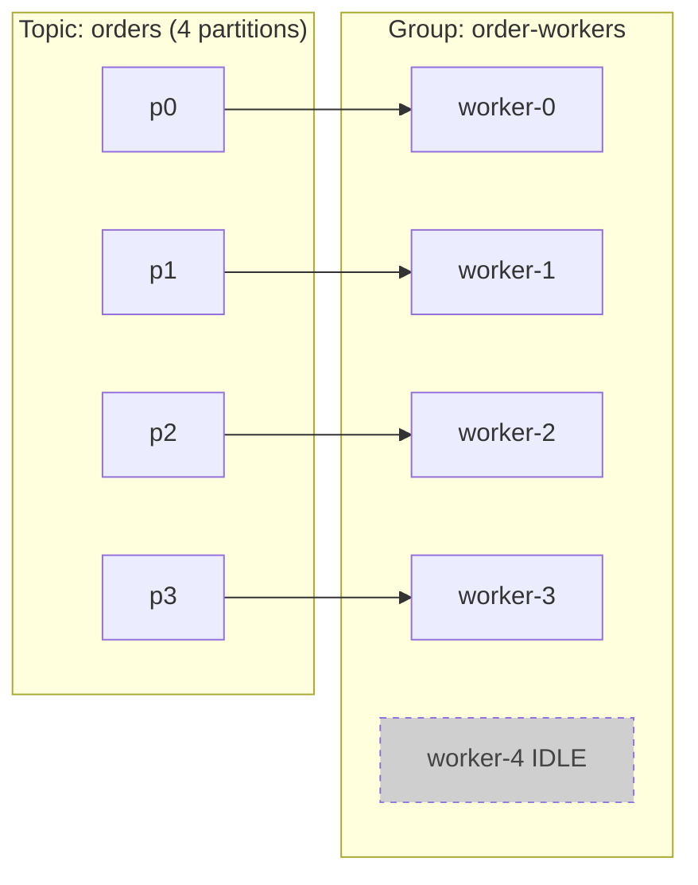

# Distributed Workers

## Overview

- **Primary references**:
  - [Apache Kafka documentation](https://kafka.apache.org/documentation/) (free) -- especially the Consumer and Consumer Group Protocol sections
  - [Confluent: Consumer group protocol](https://developer.confluent.io/courses/architecture/consumer-group-protocol/) (free) -- rebalancing in depth
  - *Designing Data-Intensive Applications* (Kleppmann) Ch 11 "Stream Processing" -- recommended
- **Supplementary**: [Enterprise Integration Patterns](https://www.enterpriseintegrationpatterns.com/) (Competing Consumers, Dead Letter Channel, Idempotent Receiver), [KIP-429 Incremental Cooperative Rebalancing](https://cwiki.apache.org/confluence/display/KAFKA/KIP-429%3A+Kafka+Consumer+Incremental+Rebalance+Protocol) (free), [microservices.io: Transactional Outbox](https://microservices.io/patterns/data/transactional-outbox.html) (free)
- **Prerequisites**: [Messaging & Distributed Queueing](../02-messaging-and-queueing/) (the conceptual frame this topic operates), [Containers, Kubernetes & Workloads](../01-containers-kubernetes/) (KEDA, SIGTERM, graceful shutdown)
- **Estimated time**: 1-2 weeks at 8-10 hrs/week

## Key Takeaways

- **A worker is a process that pulls work and does it.** This topic is the *operations*: how many run in parallel, what happens on failure, how you size and scale the pool. (For the messaging *dynamics* -- queue vs log, push vs pull, delivery semantics -- see [Messaging & Distributed Queueing](../02-messaging-and-queueing/).)
- **Partition count is the parallelism ceiling.** Within one consumer group a partition is owned by exactly one consumer, so a 5th worker on a 4-partition topic sits idle.
- **Rebalancing is what bites you.** Eager (stop-the-world) reassignment stalls the whole group; a slow handler that misses `max.poll.interval.ms` triggers a false rebalance and reprocessing.
- **At-least-once means design for duplicates.** Idempotency keys, the transactional outbox, and commit-after-durable-work are the operational tools that make redelivery safe.
- **Lag is the master signal.** It drives KEDA scaling and your alerts; at the partition cap, you add partitions, not pods.

## How to Study

- Run a local Kafka or [Redpanda](https://redpanda.com/) via Docker. Produce 1000 messages to `orders`, start consumers one at a time, and watch partitions rebalance.
- Add a consumer beyond the partition count and confirm it sits idle -- the topology diagram below, made real.
- Read [`code/consumer-go.go`](code/consumer-go.go), [`code/consumer-rust.rs`](code/consumer-rust.rs), and [`code/consumer-python.py`](code/consumer-python.py) -- the same at-least-once + idempotent + clean-shutdown pattern in three languages.
- Kill a worker mid-batch (don't let it commit) and confirm the message is redelivered to another member. Then add an idempotency guard and confirm the duplicate is absorbed.

---

# Concepts & Techniques

> **Scope.** This topic is worker **operations**. The messaging *dynamics* it builds on -- queue vs log, push vs pull and why pull gives free backpressure, competing-consumers vs pub-sub, and the delivery-semantics math -- live in [Messaging & Distributed Queueing](../02-messaging-and-queueing/). Read that first for the conceptual frame; here we operate a consumer group in production.

## Core Insight

A **worker** is a process that pulls work off a log and does it. Once you accept at-least-once delivery (topic 02), the entire job becomes operational: distribute partitions across a pool, keep the group stable through joins and leaves, make handlers tolerate redelivery, contain poison messages, and size the pool to the backlog. The unifying constraint is the **partition**: it is simultaneously the unit of ordering, the unit of assignment, and the **ceiling on useful parallelism** within a group.

The 5th worker is **idle** -- there is no partition left to own. This is the single most important operational fact about Kafka scaling, and it is why the KEDA replica cap ([Containers, Kubernetes & Workloads](../01-containers-kubernetes/)) is the partition count.

## 1. Partition count = the parallelism ceiling

- Within one consumer group, **each partition is owned by exactly one consumer.** A consumer may own several partitions; a partition is never split across two consumers in the same group.
- Therefore **useful parallelism ≤ partition count.** Workers beyond the partition count get no assignment and sit idle, burning resources for nothing.
- Pick partition count for your *peak* worker count plus headroom. Over-partitioning costs metadata and end-to-end latency; under-partitioning permanently caps throughput.
- **Adding partitions later breaks key→partition stability** (the hash target changes), so events for `order_id=42` can land on a different partition than before -- reordering relative to history. Forecast partitions ahead of time rather than reactively.

## 2. Consumer groups & rebalancing -- the thing that bites you

When a consumer joins, leaves, or dies, the group **rebalances**: partitions are reassigned across surviving members. The mechanics cause real incidents.

- **Eager (stop-the-world) rebalancing.** The classic protocol revokes *all* partitions from *all* members, then reassigns from scratch -- consumption pauses across the entire group during the reassignment. Cheap to reason about, expensive in availability.
- **Cooperative / incremental rebalancing** ([KIP-429](https://cwiki.apache.org/confluence/display/KAFKA/KIP-429%3A+Kafka+Consumer+Incremental+Rebalance+Protocol), `CooperativeStickyAssignor`) revokes *only* the partitions that must move and lets everyone else keep consuming. No global stall. Use it for any group where a stop-the-world pause hurts -- which is most of them. This is what [`code/consumer-go.go`](code/consumer-go.go) and its siblings configure.
- **Slow-handler false rebalances.** If you don't call `poll()` within `max.poll.interval.ms`, the broker assumes the consumer is dead and *kicks it*, triggering a rebalance and reprocessing of its partitions. A handler that occasionally takes 6 minutes on a 5-minute interval will flap the whole group. Fixes: keep handlers fast, lower `max.poll.records` so each poll batch finishes in time, or raise the interval to cover the worst case.
- **Clean leave on SIGTERM.** On scale-down or rollout, Kubernetes sends `SIGTERM`. A worker that traps it and `Close()`s the consumer **leaves the group cleanly**, so its partitions are reassigned *immediately*. A worker that is just killed leaves the group to wait out `session.timeout.ms` before noticing it's gone -- a window of stalled partitions. This is the consumer side of graceful shutdown from [Containers, Kubernetes & Workloads](../01-containers-kubernetes/) (trap SIGTERM → stop new work → finish in-flight → commit → exit). All three `code/consumer-*` examples implement it.

## 3. Idempotency & atomic state changes

Because delivery is at-least-once (topic 02), every handler must tolerate seeing the same message twice.

- **Idempotency key (`SETNX`).** Before doing the work, claim the message's natural key: Streamflow's `order-worker` does `SETNX order_id` in Redis (with a TTL). If the key already exists, this is a redelivery -- skip the work and let the offset advance. This is the [Idempotent Receiver](https://www.enterpriseintegrationpatterns.com/IdempotentReceiver.html) pattern; the Redis dependency appears in the C4 component diagram from [Containers, Kubernetes & Workloads](../01-containers-kubernetes/).
- **Transactional outbox.** The "wrote to the DB but crashed before producing the event" hole is real. Fix it by writing business state *and* the outgoing event into the *same* database transaction (an `outbox` table); a separate relay (or CDC) reads the outbox and publishes. State and event now commit atomically -- no lost or phantom events. See [microservices.io: Transactional Outbox](https://microservices.io/patterns/data/transactional-outbox.html).
- **Commit offsets only after durable work**, and **batch commits** for throughput. Committing before the work is at-most-once (loss on crash); committing after is at-least-once (duplicate on crash, absorbed by the idempotency key). The examples set `enable.auto.commit=false` and commit explicitly after `handle()` returns.

## 4. Failure handling: retries, poison messages, and the DLQ

- **Retryable vs poison.** A *transient* failure (DB blip, downstream timeout) → retry with backoff; it will likely succeed. A *poison* message (malformed, references deleted data, fails a hard invariant) will **never** succeed -- retrying it forever blocks the partition behind it. Because ordering is per-partition, a stuck message is **head-of-line blocking**: everything behind it on that partition waits.
- **Dead-letter queue (DLQ).** After N attempts, route the poison message to an `orders.DLQ` topic and move on, unblocking the partition. **Alert on DLQ depth**; a human or a repair job drains it. The DLQ edge appears in the Streamflow container diagram ([Containers, Kubernetes & Workloads](../01-containers-kubernetes/)).
- **Tiered retry topics.** Rather than blocking live traffic with in-line backoff, some designs route transient failures to staged retry topics (`orders.retry.5s`, `orders.retry.1m`, `orders.retry.10m`), each consumed by a delayed worker. Live consumption never stalls; retries escalate through the tiers; whatever survives all tiers lands in the DLQ.
- **Bound per-message time.** One slow handler must not block the batch -- set a per-message deadline and DLQ the overrun, or you reintroduce the slow-handler rebalance from §2.

## 5. Sizing & operating the worker pool

- **Partitions = max parallelism.** (§1.) Size partition count for peak workers plus headroom; you cannot scale useful workers past it.
- **Lag is the master signal.** Consumer **lag** = log-end offset − committed offset = "messages behind." It is the right input for both alerting and autoscaling, because it directly measures whether the pool is keeping up (unlike CPU, which a blocked-on-I/O worker leaves low while lag explodes).
- **KEDA scales on lag.** [Containers, Kubernetes & Workloads](../01-containers-kubernetes/) wires a KEDA `ScaledObject` to consumer-group lag: lag rises → KEDA raises worker replicas (capped at the partition count) → the Cluster Autoscaler adds nodes if pods are Pending → new members join → a rebalance assigns them partitions → lag drains. KEDA can also scale to **zero** when idle.
- **At the cap, add partitions, not pods.** When lag keeps rising but replicas already equal the partition count, more pods do nothing (they sit idle, §1). The lever is *more partitions* (and a one-time reshuffle of key→partition mapping). This is the cap referenced by topic 01's scaling story.

## Technique Catalog

| Technique | When to apply |
|-----------|---------------|
| One consumer per partition (group sizing) | Always -- never run more workers than partitions |
| Cooperative/incremental rebalancing | Any group where stop-the-world stalls hurt |
| Tune `max.poll.records` / `max.poll.interval.ms` | When handlers are slow enough to risk false rebalances |
| Clean leave on SIGTERM | Every worker (fast partition reassignment on scale-down) |
| Idempotency key (SETNX) | Deduping redelivered messages |
| Transactional outbox | Atomic "update state + emit event" |
| Commit after durable work + batch commits | Every at-least-once consumer |
| Dead-letter queue | Any consumer that can receive poison messages |
| Tiered retry topics | When in-line retries would block live traffic |
| Scale on consumer lag (KEDA) | Sizing the worker pool to backlog |
| Add partitions (not pods) at the cap | When lag rises with replicas already = partitions |

## Connections to Other Tracks

| Concept | Connected Track | How |
|---------|-----------------|-----|
| Queue vs log, push/pull, delivery semantics | [Messaging & Distributed Queueing](../02-messaging-and-queueing/) | The dynamics this topic operationalizes |
| Lag-based autoscaling, SIGTERM, KEDA | [Containers, Kubernetes & Workloads](../01-containers-kubernetes/) | KEDA scales this pool; graceful shutdown avoids reprocessing |
| Stream processing, Kafka internals | [Batch & Streaming](../../data-engineering/03-batch-streaming/) | The data-engineering view of the same consumer |
| Replication, consensus, ordering | [System Design](../../systems/01-system-design/) | Distributed-log and partition fundamentals |
| Idempotency, design-by-contract handlers | [Concurrency & Systems](../../algorithms/12-concurrency-systems/) | Reasoning about duplicate-safe operations |
| "Never skip an offset" as an invariant | [The Testing Mentality](../../software-craftsmanship/03-testing-mentality/) | Property tests on offset/commit handling |

## Company Relevance

| Company | How This Appears | Focus |
|---------|------------------|-------|
| LinkedIn | Created Kafka; runs consumer groups at trillions of messages/day | Group protocol, rebalancing at scale |
| Confluent | The company built around Kafka | Consumer internals, exactly-once, outbox |
| Netflix | Kafka for event pipelines and Keystone | Worker pools and fan-out at scale |
| Uber / Stripe | Event-driven cores, outbox pattern, DLQs | Idempotency, exactly-once payments |
| Any backend/data role | Async workers behind a log are the default architecture | Sizing, rebalancing, failure handling |
