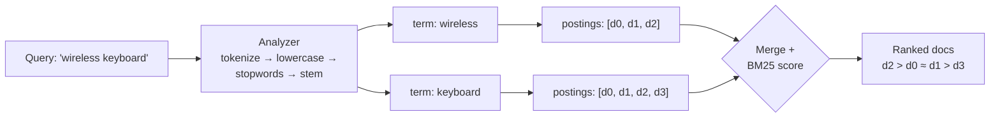
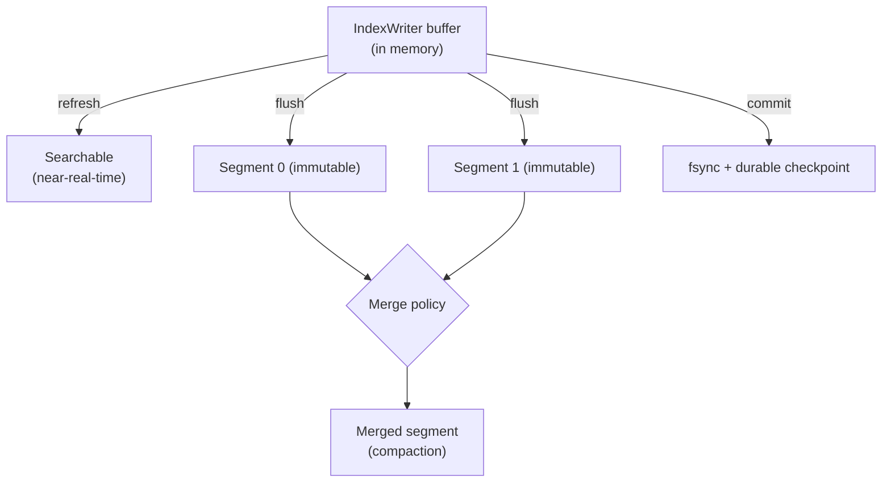
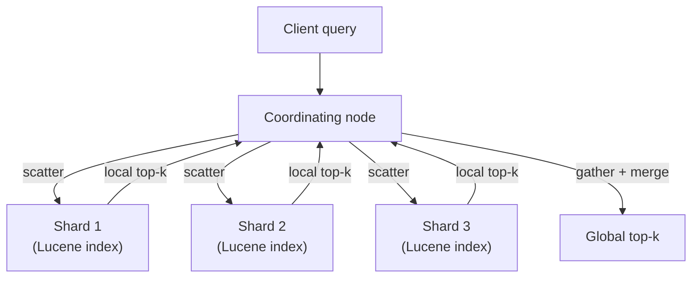

# Search & Indexing

## Overview

- **Primary references**:
  - [Apache Lucene documentation](https://lucene.apache.org/core/documentation.html) -- free, the engine under every major search stack
  - [*The Probabilistic Relevance Framework: BM25 and Beyond* (Robertson & Zaragoza)](https://www.staff.city.ac.uk/~sbrp622/papers/foundations_bm25_review.pdf) (free) -- the definitive BM25 derivation
  - [*Introduction to Information Retrieval* (Manning, Raghavan, Schütze)](https://nlp.stanford.edu/IR-book/) (free, full text online) -- the IR textbook
- **Supplementary**: [Tantivy docs](https://docs.rs/tantivy/) (free, Rust), [Elasticsearch guide](https://www.elastic.co/guide/) (free), [OpenSearch docs](https://opensearch.org/docs/latest/) (free), [SPLADE paper](https://arxiv.org/abs/2107.05720) (free), [ColBERTv2 paper](https://arxiv.org/abs/2112.01488) (free), [HNSW paper (Malkov & Yashunin)](https://arxiv.org/abs/1603.09320) (free), [*Tantivy* source](https://github.com/quickwit-oss/tantivy) (free), [*Bleve* source](https://github.com/blevesearch/bleve) (free)
- **Prerequisites**: [Containers & Kubernetes](../01-containers-kubernetes/) (how an engine is deployed/sharded), [Batch & Streaming](../../data-engineering/03-batch-streaming/) (the LSM/log write model recurs here), data structures (tries, B-trees, heaps)
- **Estimated time**: 2-3 weeks at 8-10 hrs/week

## Key Takeaways

- **The inverted index is the whole game.** Map every term to the sorted list of documents that contain it (its *postings list*); a query becomes a merge over a handful of those lists. Everything else -- scoring, sharding, vectors -- is built around this one structure.
- **BM25 is TF-IDF plus two fixes** -- term-frequency *saturation* (`k1`) and document-length *normalization* (`b`). It is decades old and still the baseline every learned retriever is measured against. Derive it once and you understand 90% of lexical ranking.
- **Lucene is an LSM tree wearing a search hat.** Writes go to small immutable *segments*; background *merges* compact them; deletes are tombstones. The same write path you saw in streaming/storage systems is exactly how a search index stays fast under continuous indexing.
- **An engine is Lucene plus a distributed layer.** Elasticsearch, OpenSearch, and Solr are coordination, sharding, and replication wrapped around per-shard Lucene indexes. When you don't need the cluster, an embeddable library (Lucene, **Tantivy**, **Bleve**) is faster, simpler, and cheaper.
- **Lexical and dense retrieval fail in opposite ways, so hybrid wins** -- but the *retrieval/RAG* fusion story lives in [Retrieval & RAG](../../ai-platform-engineering/07-retrieval-and-rag/). This topic owns the *index and the engine*; that one owns *what you do with the results*.

## How to Study

- Run the from-scratch core in [`code/bm25_from_scratch.py`](code/bm25_from_scratch.py) and [`code/bm25_from_scratch.rs`](code/bm25_from_scratch.rs): both build an inverted index over a tiny Streamflow corpus and rank queries by BM25. They print *identical* scores -- prove the math is the implementation, not a library trick.
- Change `k1` to `0` and watch term frequency stop mattering (every match counts once). Change `b` to `0` and watch long documents stop being penalized. Feel each parameter.
- Build the production path in [`code/tantivy-example/`](code/tantivy-example/) (`cargo run`): the *same* inverted index + BM25, but with a real analyzer, on-disk segments, and a commit step. Notice it's the same shape as your from-scratch version.
- For any query, ask: *would a lexical index find this, or do I need a dense one?* Exact IDs (`order 8801`) are lexical wins; paraphrases (`broken delivery`) are dense wins. That instinct is the whole motivation for hybrid retrieval.

---

# Concepts & Techniques

## Core Insight

A search engine answers "which documents contain these terms, ranked by relevance" fast enough for a human to wait on. The naive approach -- scan every document per query -- is hopeless at scale. The **inverted index** flips the problem: precompute, for each term, the sorted list of documents that contain it. A query then *intersects* (AND) or *unions* (OR) a few short lists instead of scanning the corpus. Ranking is a numeric score (BM25) summed over the matched terms. Keeping that index fast under constant writes forces the **segment** model -- immutable shards merged in the background, exactly like an LSM tree -- and scaling it past one machine forces **sharding + replication**, which is all an engine like Elasticsearch really is.

## 1. The Inverted Index

**The data structure under everything**

The corpus is the same Streamflow example used in the code: orders and products. Indexing each document means analyzing it into terms, then appending to each term's postings list.

**Key ideas**:
- **Term dictionary → postings lists.** The *dictionary* maps each term to a pointer; the *postings list* is the sorted sequence of `(doc_id, term_frequency, [positions])` entries for that term. Sorted by `doc_id` so two lists merge in linear time.
- **Boolean merges.** `A AND B` walks both postings lists with two pointers, advancing the smaller `doc_id` -- a sorted-list intersection. `A OR B` is the union. This is why postings stay sorted.
- **Skip lists.** Long postings lists embed *skip pointers* so an AND can jump past large runs of non-matching `doc_id`s instead of stepping one at a time -- turning intersection from O(n) toward O(n / skip).
- **Positions enable phrase queries.** Storing each term's positions lets `"wireless keyboard"` (exact adjacency) be answered, not just "both terms present somewhere."
- **The FST term dictionary.** Lucene stores the term dictionary as a **Finite-State Transducer (FST)** -- a minimized automaton mapping term bytes → postings offset. Shared prefixes *and* suffixes collapse, so millions of terms fit in memory and lookups are O(term length). This is why Lucene can do fast prefix and fuzzy (edit-distance automaton ∩ term FST) queries.

See [`code/bm25_from_scratch.py`](code/bm25_from_scratch.py) -- `InvertedIndex.add` builds exactly this `term → [Posting(doc_id, tf)]` map.

## 2. Analysis & Tokenization

**Turning raw text into index terms -- get this wrong and nothing matches**

Lucene's **Analyzer** is a pipeline: a **Tokenizer** splits text into tokens, then a chain of **TokenFilters** transforms them. The *same* analyzer must run at index time and query time, or the query terms won't match the indexed terms.

**Key ideas**:
- **Tokenizer**: splits on word boundaries (Lucene's `StandardTokenizer` follows the Unicode segmentation rules). The code uses a maximal-alphanumeric-run tokenizer.
- **Lowercase filter**: `Keyboard` and `keyboard` must collapse to one term.
- **Stopword filter**: drop `the`, `and`, `of` -- they appear in nearly every document (huge `n(q)`), so their IDF is ~0 and they only bloat postings.
- **Stemming filter**: `orders`, `ordering`, `ordered` → a shared stem so a search for `order` matches all of them. Lucene ships Porter, KStem, and Snowball stemmers; the code uses a tiny suffix stripper to show *where* stemming sits.
- **The asymmetry trap**: if you stem at index time but not query time, `keyboards` (indexed as `keyboard`) won't match the query token `keyboards`. Analyzer parity is a top source of "why does nothing match" bugs.

## 3. Scoring: From TF-IDF to BM25

**The math, then the code**

Start with the intuition: a document is more relevant to a term if (a) the term appears *often* in it (term frequency, TF) and (b) the term is *rare* across the corpus (inverse document frequency, IDF). **TF-IDF** multiplies them:

$$
\text{tfidf}(q, D) = f(q, D) \cdot \ln\frac{N}{n(q)}
$$

where $f(q,D)$ is the count of term $q$ in document $D$, $N$ is the corpus size, and $n(q)$ is the number of documents containing $q$. TF-IDF has two flaws: TF grows without bound (a doc that repeats a word 100× isn't 100× more relevant), and it ignores document length (a long doc accumulates matches for free). **BM25 (Okapi BM25)** fixes both:

$$
\text{score}(D, Q) = \sum_{q \in Q} \text{IDF}(q) \cdot \frac{f(q, D)\,(k_1 + 1)}{f(q, D) + k_1\left(1 - b + b\,\dfrac{|D|}{\text{avgdl}}\right)}
$$

with Lucene's smoothed, non-negative IDF:

$$
\text{IDF}(q) = \ln\!\left(1 + \frac{N - n(q) + 0.5}{n(q) + 0.5}\right)
$$

**Key ideas** (each parameter, with its intuition):
- **$k_1$ -- term-frequency saturation** (typically 1.2-2.0). The TF factor is a *saturating* curve: as $f(q,D) \to \infty$ it approaches the ceiling $k_1 + 1$. So the 2nd occurrence of a term adds a lot, the 20th almost nothing. Set $k_1 = 0$ and TF collapses to binary (present / absent). This is BM25's single biggest improvement over raw TF-IDF.
- **$b$ -- length normalization** (typically 0.75). The $\left(1 - b + b\,|D|/\text{avgdl}\right)$ factor divides the score by how much longer than average the document is. $b = 1$ fully normalizes (a long doc must *concentrate* the term to score); $b = 0$ disables it (long docs win on volume). The Streamflow product-catalog doc is long, so $b$ stops it from dominating just by listing many words.
- **IDF**: the `+0.5` smoothing and the `1 +` keep IDF $\geq 0$ even for terms in almost every document, so a common term can never *subtract* from a score.
- **BM25F (fielded)**: real documents have fields (a product `title` vs `description`). BM25F applies *per-field* length normalization and field *boosts* before summing -- a title match should outweigh a description match. This is what `title^3 description` style boosting compiles to.

The code is the formula, line for line -- [`bm25_search` in the Python file](code/bm25_from_scratch.py) and [`bm25_search` in the Rust file](code/bm25_from_scratch.rs) compute exactly the expression above and print identical scores. The [Tantivy example](code/tantivy-example/) uses BM25 as its *default* scorer, so you see the same ranking from a real engine.

## 4. The Segment Model & Write Path (Lucene Internals)

**Why a search index can be fast *and* continuously updated -- it's an LSM tree**

A Lucene index is not one file you mutate. It is a set of **segments**, each a small, *immutable*, self-contained inverted index.

**Key ideas**:
- **Immutable segments.** New documents are buffered in memory and periodically flushed as a *new* segment. You never edit an existing segment -- exactly the append-only discipline from [LSM-tree storage and the Kafka log](../../data-engineering/03-batch-streaming/).
- **Background merges.** Many small segments slow search (each query touches all of them), so a *merge policy* (Lucene's `TieredMergePolicy`) compacts small segments into bigger ones in the background -- the LSM *compaction* step. This is the dominant source of write amplification and I/O in a busy index.
- **Deletes as tombstones.** Because segments are immutable, a delete just marks the `doc_id` in a *live-docs* bitset; the bytes are reclaimed only when that segment is merged. An "update" is delete-then-add.
- **refresh / flush / commit -- three different things people conflate**:
  - **refresh** makes recently indexed docs *searchable* by opening a new reader over the in-memory buffer (this is what "near-real-time search" means -- default ~1s in Elasticsearch). Cheap, frequent.
  - **flush** writes the in-memory buffer to a Lucene segment on disk and clears the transaction log.
  - **commit** fsyncs and records a durable checkpoint -- survives a crash. Expensive, infrequent.
- **Codecs.** A Lucene **Codec** is the pluggable on-disk format for each part of a segment (postings, doc-values, term dictionary, stored fields, vectors). Postings use delta + bit-packing / PFOR; this is where compression and read speed are tuned.
- **HNSW vector field.** Modern Lucene (9.x+) stores dense vectors in a per-segment **HNSW** graph (a `KnnVectorField`), so the *same* engine does ANN dense retrieval alongside BM25 -- which is what makes single-engine hybrid search possible. The ANN index internals live in [Retrieval & RAG](../../ai-platform-engineering/07-retrieval-and-rag/).

## 5. Learned & Dense Retrieval (Named, Not Re-Derived)

**Where lexical ends and neural retrieval begins -- the depth lives next door**

BM25 is a *sparse, lexical* ranker: it matches surface terms. It cannot match `broken delivery` to a document that says `damaged shipment`. The frontier of retrieval addresses this; this topic *names* the methods and hands the retrieval/RAG depth to [Retrieval & RAG](../../ai-platform-engineering/07-retrieval-and-rag/).

**Key ideas**:
- **SPLADE** (learned *sparse*): a transformer predicts a sparse term-weight vector over the *whole vocabulary*, including terms not in the text (expansion). It stays in an inverted index -- so you get semantic matching with BM25-style infrastructure.
- **ColBERT / ColBERTv2** (*late interaction*): encode query and document into *per-token* vectors and score by summing each query token's max similarity to any document token (MaxSim). More expressive than a single-vector bi-encoder, indexable via per-token ANN.
- **Dense bi-encoders + HNSW**: one vector per query/document, nearest-neighbor search via HNSW. Fast, semantic, but misses exact terms.
- **Hybrid sparse + dense fusion**: combine BM25 and dense results. **Reciprocal Rank Fusion (RRF)** -- sum $1/(k + \text{rank})$ across lists -- is the robust default. **This is the boundary**: the *fusion, reranking, and RAG* story is owned by [Retrieval & RAG](../../ai-platform-engineering/07-retrieval-and-rag/); this topic owns the BM25 half and the HNSW *index* that the dense half searches.

## 6. Engines on Top of Lucene

**Lucene is a library; an engine adds the distributed system**

A single Lucene index lives in one process on one machine. To serve a large corpus with high availability you need sharding, replication, and a query coordinator. That layer -- not the search math -- is what Elasticsearch, OpenSearch, and Solr provide.

**Key ideas**:
- **Shard = one Lucene index.** A logical index is partitioned into *shards*, each a complete Lucene index (with its own segments). Sharding is how the corpus scales past one machine. A shard count is fixed at creation -- a classic operational gotcha.
- **Replicas = copies of a shard** for availability and read throughput. One primary handles writes; replicas serve reads and take over on failure.
- **Scatter-gather read path.** A query hits a *coordinating node*, which fans it out to one copy of every shard (scatter), each shard runs the query against its local segments and returns its top-k, and the coordinator *merges* the per-shard top-k into a global top-k (gather). This is why deep pagination is expensive -- every shard must return `from + size` results to merge correctly.
- **Bulk write path.** Documents route to a shard by `hash(routing_key) % num_primary_shards`, land in that shard's IndexWriter buffer, and become searchable on the next **refresh** -- the same near-real-time model from §4, now distributed.
- **Elasticsearch vs OpenSearch vs Solr**:
  - **Elasticsearch** -- the dominant engine; rich aggregations, the ELK stack. In **2021 Elastic relicensed** from Apache-2.0 to the dual **SSPL / Elastic License** (a response to AWS reselling it as a managed service); in **2024 Elastic added AGPL-3.0** as an option, making it OSI-open again.
  - **OpenSearch** -- AWS's **2021 fork** of the last Apache-2.0 Elasticsearch (7.10), now under the Linux Foundation, **Apache-2.0**. Choose it when you want a permissive license or AWS-managed search.
  - **Apache Solr** -- the older Lucene-based engine (Apache-2.0); strong faceting and a mature config model. Common in libraries and enterprise search.
- **When a plain library beats a cluster.** If your corpus fits on one node, you don't need cross-node HA, and you control the host process, **Lucene-as-a-library, Tantivy (Rust), or Bleve (Go)** give you BM25 + an inverted index with none of the cluster's operational cost. The [Tantivy example](code/tantivy-example/) is this: a full BM25 search engine in ~60 lines, no server. Reach for Elasticsearch/OpenSearch/Solr when you genuinely need the *distributed* layer.

## 7. Embeddable Alternatives

**When you want Lucene's ideas without the JVM or a cluster**

- **Tantivy** (Rust, Lucene-inspired): the same architecture -- schema, analyzers, immutable segments, FST term dictionaries, BM25 default scoring -- as a fast embeddable library. It powers [Quickwit](https://quickwit.io/) (log search) and [ParadeDB](https://www.paradedb.com/) (full-text search inside Postgres). Demonstrated in [`code/tantivy-example/`](code/tantivy-example/).
- **Bleve** (Go): an embeddable full-text index for Go services, with pluggable analyzers and storage backends; used inside tools like Couchbase and many Go apps that want search without an external engine.

Both are the right answer when "add a search box" shouldn't mean "operate a 3-node cluster."

## Technique Catalog

| Technique | When to apply |
|-----------|---------------|
| Inverted index + postings | Any keyword search at all (the foundation) |
| Skip lists on postings | Long postings lists with frequent AND queries |
| FST term dictionary | Large vocabulary; prefix/fuzzy queries |
| Same analyzer at index + query time | Always (analyzer parity prevents silent no-match) |
| BM25 (tune `k1`, `b`) | The default lexical ranker -- start here |
| BM25F + field boosts | Multi-field docs (title vs body) |
| Immutable segments + background merge | Continuous indexing under read load |
| refresh vs flush vs commit, tuned | Trade search freshness against indexing/IO cost |
| Sharding + replicas | Corpus or QPS exceeds one node |
| Embeddable library (Tantivy/Bleve/Lucene) | Single-node search; no cluster wanted |
| BM25 + dense, fused (RRF) | When exact-term and semantic recall both matter |
| SPLADE / ColBERT | Semantic matching while keeping IR infrastructure |

## Connections to Other Tracks

| Concept | Connected Track | How |
|---------|-----------------|-----|
| Hybrid fusion, reranking, RAG | [Retrieval & RAG](../../ai-platform-engineering/07-retrieval-and-rag/) | This topic owns the *index/engine*; that one owns *retrieval & RAG* -- the deliberate split |
| Immutable segments, compaction, the log | [Batch & Streaming](../../data-engineering/03-batch-streaming/) | Lucene's write path *is* an LSM tree / append-only log |
| Sharding, replication, coordinator | [Containers & Kubernetes](../01-containers-kubernetes/) | How an Elasticsearch/OpenSearch cluster is deployed and scaled |
| HNSW / ANN index internals | [Retrieval & RAG](../../ai-platform-engineering/07-retrieval-and-rag/) | The dense half of hybrid; Lucene now hosts the HNSW graph |
| Encoders behind SPLADE/ColBERT/dense | [Retrieval & RAG](../../ai-platform-engineering/07-retrieval-and-rag/) | The models that produce sparse/dense vectors |

## Company Relevance

| Company | How This Appears | Focus |
|---------|------------------|-------|
| Elastic | Elasticsearch + Lucene; the ELK stack | Lucene internals, aggregations, the licensing saga |
| Amazon (AWS) | OpenSearch (the 2021 fork), managed search | Apache-2.0 engine, scatter-gather at scale |
| Apache / Solr shops | Solr on Lucene | Faceting, enterprise/library search |
| Quickwit / ParadeDB | Tantivy-based engines | Embeddable Rust search, log + Postgres FTS |
| Algolia / typesense | Custom inverted indexes | Latency-obsessed keyword + typo-tolerant search |
| Any backend role | "Add search to the product" | Choosing library vs engine; BM25 tuning |
