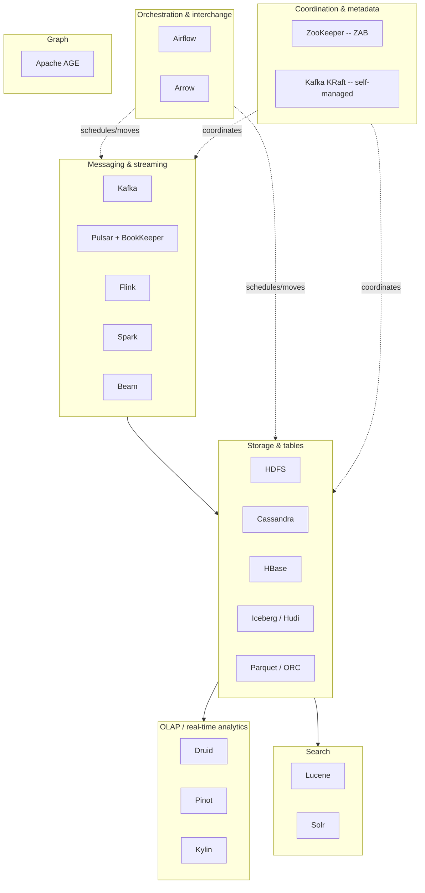

# The Apache Stack

## Overview

- **Primary references**:
  - [The Apache Software Foundation projects directory](https://projects.apache.org/) -- free, the authoritative index of every top-level project
  - [Apache Lucene docs](https://lucene.apache.org/core/documentation.html) -- free, the search core under Solr/Elasticsearch
  - [Apache Iceberg spec](https://iceberg.apache.org/spec/) -- free, the open table format that is reshaping the lakehouse
- **Supplementary**: [Kafka](https://kafka.apache.org/documentation/) (free), [Pulsar](https://pulsar.apache.org/docs/) (free), [Flink](https://nightlies.apache.org/flink/flink-docs-stable/) (free), [Spark](https://spark.apache.org/docs/latest/) (free), [Cassandra](https://cassandra.apache.org/doc/latest/) (free), [Druid](https://druid.apache.org/docs/latest/design/) (free), [Pinot](https://docs.pinot.apache.org/) (free), [Arrow](https://arrow.apache.org/docs/) (free), [Airflow](https://airflow.apache.org/docs/) (free), ["The Google File System"](https://research.google/pubs/the-google-file-system/) / ["Bigtable"](https://research.google/pubs/bigtable-a-distributed-storage-system-for-structured-data/) / ["MapReduce"](https://research.google/pubs/mapreduce-simplified-data-processing-on-large-clusters/) / ["The Dataflow Model"](https://research.google/pubs/pub43864/) papers (free) -- the lineage many of these projects re-implement
- **Prerequisites**: [Data Engineering](../../data-engineering/) (storage, batch/streaming), [System Design](../../systems/01-system-design/) (replication, consensus, CAP)
- **Estimated time**: 1 week at 6-8 hrs/week (this is a *map*, not a deep dive -- follow the cross-links to go deep)

## Key Takeaways

- **The ASF is a de-facto standard library for distributed data.** When a hard distributed-systems problem becomes common enough, an Apache project usually crystallizes as the open, vendor-neutral reference implementation -- and "Apache X" becomes a quality and longevity signal, not just a name.
- **Much of the stack is open re-implementation of Google papers**: GFS→HDFS, Bigtable→HBase, MapReduce→Hadoop, Dataflow→Beam/Flink. Knowing the paper tells you the architecture before you read a line of docs.
- **Pick the project by the *problem*, not the brand.** Coordination, messaging, storage, OLAP, search, orchestration, and graph are seven distinct problem families; this topic groups the stack by which one each project owns.
- **The frontier is moving toward separation and interchange**: storage/compute split (Pulsar's BookKeeper, the lakehouse), the death of a separate coordinator (Kafka's KRaft), open table formats (Iceberg's rise), and zero-copy columnar interchange (Arrow/ADBC). Track these -- they are where the coupled architectures of the 2010s are being unbundled.
- **This is the bird's-eye map.** Every box here is covered in depth by a sibling topic; the value of this page is knowing *which* box to reach for and *why*, not re-deriving the internals.

## How to Study

- For each category below, name the one problem it solves out loud before reading the projects. If you can't, you'll collect trivia instead of a mental index.
- Place [Streamflow](#core-insight) (our running ingest-and-analytics platform) onto the map: which Apache project sits at each stage, and what would you swap if a requirement changed (sub-second latency, multi-region writes, ad-hoc OLAP)?
- When two projects look interchangeable (Kafka vs Pulsar, Flink vs Spark, Iceberg vs Hudi), find the *one architectural decision* that separates them -- that difference is the whole reason both exist.
- Follow each cross-link to the deep topic; do not try to learn Kafka or Iceberg from this page.

---

# Concepts & Techniques

## Core Insight

The Apache Software Foundation is best understood as a **de-facto standard library for distributed data**: a place where the recurring hard problems of large-scale systems -- coordinate this cluster, move this firehose of events, store this petabyte cheaply, answer this aggregation in 50ms, search this corpus, schedule this DAG -- each get an open, governed, vendor-neutral reference implementation. The ASF doesn't write the code; it provides the **governance model** (meritocracy, the "Apache Way," a foundation that holds the trademark and IP) that lets a project outlive any single company. That is why "Apache X" is a signal: it means a community, not a vendor, owns the roadmap.

The right way to hold the whole stack in your head is to group projects by the **problem they solve**, not by their age or popularity:

Read this map as a pipeline: events arrive through **messaging**, land in **storage** (raw files, wide-column rows, or open tables), get served to **OLAP** engines and **search** indexes, all **coordinated** and **orchestrated**, with **graph** as a specialized lens when relationships are the data. Our running example, **Streamflow**, threads the whole map: clickstream events → Kafka → Flink (real-time aggregates) and Spark (nightly batch) → Iceberg tables on object storage → Druid for sub-second dashboards and Solr for the product search box, all scheduled by Airflow.

## 1. Coordination & Metadata

The unglamorous foundation: who is the leader, which broker owns which partition, what is the current cluster config. This is a **consensus** problem, and getting it wrong corrupts everything above it.

| Project | What it IS | The one problem | Architecture idea | Go deeper |
|---------|------------|-----------------|-------------------|-----------|
| **ZooKeeper** | A replicated, hierarchical key-value store (znodes) for coordination | Reliable cluster metadata, leader election, locks | **ZAB** (ZooKeeper Atomic Broadcast): a leader-based total-order broadcast protocol, Paxos-adjacent; strongly consistent small-data store | [Messaging & Queueing](../02-messaging-and-queueing/) |
| **Kafka KRaft** | Kafka's built-in Raft quorum that *replaces* ZooKeeper | Remove the external coordinator dependency | Metadata becomes an internal Raft-replicated log on the brokers themselves -- one fewer system to operate, faster failover, far higher partition counts | [Messaging & Queueing](../02-messaging-and-queueing/) |

**The move away from ZooKeeper** is the story here. For a decade, ZooKeeper was the coordinator under Kafka, HBase, Solr, and more. Operating a separate ZK ensemble is real toil, and its consistency model (small data, watch-based) doesn't scale to millions of partitions. Kafka's **KRaft** mode (production-default since Kafka 3.x, ZooKeeper removed in 4.0) folds coordination into the brokers via Raft. The **non-Apache contrast is etcd** -- also Raft-based, also a consistent metadata store, but it became the coordination substrate of the *cloud-native* world (it is the backing store for Kubernetes; see [Containers & Kubernetes](../01-containers-kubernetes/)). Same problem, two lineages: ZooKeeper from the Hadoop era, etcd from the Kubernetes era.

## 2. Messaging & Streaming

Move an unbounded stream of events between systems, then compute over it. This is where the most active design tension in the stack lives.

| Project | What it IS | The one problem | Architecture idea | Go deeper |
|---------|------------|-----------------|-------------------|-----------|
| **Kafka** | A distributed, partitioned, replicated commit **log** | Durable, replayable decoupling of producers from consumers | Append-only partitioned log; ordering within a partition; consumers read at their own offset. Storage and serving are **coupled** in the broker | [DE: Batch & Streaming](../../data-engineering/03-batch-streaming/) |
| **Pulsar** | A pub-sub messaging + streaming system | Same decoupling, but with elastic, independently-scaled storage | **Compute/storage separation**: stateless brokers serve; **Apache BookKeeper** (a separate log-storage service of "bookies") holds the durable ledgers. Scale serving and storage independently; built-in tiered storage and multi-tenancy | [DE: Batch & Streaming](../../data-engineering/03-batch-streaming/) |
| **Flink** | A true streaming, stateful processing engine | Low-latency, exactly-once stateful computation over unbounded streams | Event-at-a-time processing; keyed managed state; **Chandy-Lamport aligned checkpoints** for exactly-once recovery tied to source offsets | [DE: Batch & Streaming](../../data-engineering/03-batch-streaming/) |
| **Spark** | A general distributed compute engine (batch + micro-batch streaming) | Optimized batch and "good enough" streaming on one engine | Lazy DAG of transformations; Catalyst optimizer + Tungsten codegen; **Structured Streaming** treats a stream as an unbounded table (micro-batch by default) | [DE: Batch & Streaming](../../data-engineering/03-batch-streaming/) |
| **Beam** | A *unified programming model* (not an engine) | Write one pipeline, run it on many engines | The **Dataflow model** (what/where/when/how) as a portable API; runners execute it on Flink, Spark, or Google Dataflow | [DE: Batch & Streaming](../../data-engineering/03-batch-streaming/) |
| **Storm / Samza** | First-generation stream processors (legacy) | Early real-time stream processing | Storm: at-least-once tuple processing; Samza: Kafka-native, local state. **Mostly superseded by Flink**; you'll meet them in old systems | [DE: Batch & Streaming](../../data-engineering/03-batch-streaming/) |

**The defining contrasts.** *Kafka vs Pulsar*: Kafka couples log storage to the broker, so adding storage means adding (and rebalancing) brokers; Pulsar splits them via BookKeeper, so you scale serving and storage on separate axes -- at the cost of operating more moving parts. Kafka answers back with **tiered storage** (offloading cold log segments to object storage), narrowing the gap. *Flink vs Spark*: Flink is streaming-first (sub-second, heavy stateful logic, CEP); Spark is batch-first with micro-batch streaming bolted on cleanly -- reach for Flink when latency and state dominate, Spark when you want one engine for big batch plus simpler streaming. *Beam* sits above both: a portability layer for teams that refuse to marry an engine.

## 3. Storage & Tables

Where the bytes actually live, and how files become tables with guarantees.

| Project | What it IS | The one problem | Architecture idea | Go deeper |
|---------|------------|-----------------|-------------------|-----------|
| **Hadoop / HDFS** | A distributed filesystem (the historical foundation) | Store petabytes across commodity disks | **GFS re-implementation**: NameNode (metadata) + DataNodes (blocks), 3x replication. Largely displaced by cloud **object storage** (S3/GCS), but the conceptual ancestor of the whole lake | [DE: Storage & Warehousing](../../data-engineering/02-storage-warehousing/) |
| **Cassandra** | A masterless wide-column store | Always-on, write-heavy, multi-region writes | **Dynamo lineage**: consistent-hash ring, no SPOF, tunable quorum consistency; **LSM-tree** storage. Query-first modeling, partition key = shard key | [AIPE: Distributed Data & Caching](../../ai-platform-engineering/04-distributed-data-and-caching/) |
| **HBase** | A distributed sorted map on HDFS | Random read/write over huge sparse tables | **Bigtable re-implementation**: sorted rows split into regions, LSM (memstore + HFiles); strong per-row consistency. Reach for it when you need Bigtable semantics on-prem | [DE: Storage & Warehousing](../../data-engineering/02-storage-warehousing/) |
| **Iceberg** | An open **table format** over data files | ACID, time travel, schema/partition evolution on object storage | **Snapshot + manifest** design: each commit writes a new immutable metadata snapshot pointing at manifest lists → manifests → data files. **Hidden partitioning** decouples layout from queries. The emerging open standard | [DE: Storage & Warehousing](../../data-engineering/02-storage-warehousing/) |
| **Hudi** | An open table format specialized for upserts | Fast incremental upserts + CDC on the lake | Copy-on-write vs merge-on-read tables; record-level indexes for mutate-heavy ingest | [DE: Storage & Warehousing](../../data-engineering/02-storage-warehousing/) |
| **Delta Lake** | A table format (**Linux Foundation, not Apache**) | ACID transactions via a write-ahead log | Transaction log (`_delta_log`) of ordered JSON commits; Databricks-native origin. Listed here because it competes head-on with Iceberg/Hudi | [DE: Storage & Warehousing](../../data-engineering/02-storage-warehousing/) |
| **Parquet / ORC** | Columnar **file formats** (the bytes on disk) | Compact, scan-efficient analytical storage | Columnar layout + per-column encoding/compression + row-group statistics (min/max, zone maps) for predicate pushdown. The substrate Iceberg/Hudi/Delta organize | [DE: Storage & Warehousing](../../data-engineering/02-storage-warehousing/) |

**The layering that confuses everyone**: Parquet/ORC are *file* formats (how one file is encoded); Iceberg/Hudi/Delta are *table* formats (a metadata layer that turns a directory of those files into a transactional table). **Iceberg's rise** is the headline -- its engine-agnostic snapshot/manifest design (and its REST catalog) made it the format every major engine and cloud vendor now supports, and the point where the lake/warehouse divide finally collapses into the **lakehouse**.

## 4. OLAP / Real-Time Analytics

Sub-second aggregations over fresh data -- the gap between a streaming engine and a slow warehouse.

| Project | What it IS | The one problem | Architecture idea | Go deeper |
|---------|------------|-----------------|-------------------|-----------|
| **Druid** | A real-time analytics database | Low-latency slice-and-dice over event streams | Segment-based columnar storage, time-partitioned; ingests from Kafka *and* serves queries; pre-aggregation at ingest. Powers live dashboards | [DE: Storage & Warehousing](../../data-engineering/02-storage-warehousing/) |
| **Pinot** | A real-time OLAP datastore | Ultra-low-latency, high-QPS user-facing analytics | Columnar segments with rich indexing (inverted, star-tree, range); built for serving analytics *to end users* at scale (e.g. "who viewed your profile") | [DE: Storage & Warehousing](../../data-engineering/02-storage-warehousing/) |
| **Kylin** | A distributed OLAP engine | Sub-second queries on huge dimensional data | **Pre-computed OLAP cubes** over Hadoop/Hive; trades storage + build time for instant cube lookups. More legacy/batch-cube oriented than Druid/Pinot | [DE: Storage & Warehousing](../../data-engineering/02-storage-warehousing/) |

**When to reach here:** when your dashboard query is too latency-sensitive or too high-QPS for a warehouse, but too analytical (group-by over millions of rows) for an OLTP store. Druid and Pinot both ingest directly from Kafka, closing the loop from §2 -- Streamflow's live dashboards sit here.

## 5. Search

Full-text relevance ranking -- a different problem from both OLAP (aggregation) and key-value (point lookup).

| Project | What it IS | The one problem | Architecture idea | Go deeper |
|---------|------------|-----------------|-------------------|-----------|
| **Lucene** | A full-text search *library* (the engine core) | Index a corpus and rank documents by relevance | The **inverted index** (term → posting list of docs), plus tokenization/analysis and scoring (BM25). Not a server -- a JAR you embed | [Search & Indexing](../04-search-and-indexing/) |
| **Solr** | A search *server* built on Lucene | Operate Lucene as a distributed, queryable service | Adds sharding, replication, a REST/HTTP API, and faceting over Lucene. (Elasticsearch/OpenSearch are the other Lucene-based servers) | [Search & Indexing](../04-search-and-indexing/) |

**The key relationship**: Lucene is the engine; Solr (and Elasticsearch/OpenSearch) are servers wrapped around it. This is why "search" interview questions about inverted indexes, analyzers, and BM25 are really *Lucene* questions regardless of which server runs in production. Streamflow's product search box is Solr in front of a Lucene index.

## 6. Orchestration / Compute & Interchange

Schedule the pipeline, and move columnar data between systems without re-serializing it.

| Project | What it IS | The one problem | Architecture idea | Go deeper |
|---------|------------|-----------------|-------------------|-----------|
| **Airflow** | A workflow scheduler | Express and run dependency-ordered batch pipelines | **DAGs as Python code**; a scheduler triggers tasks when upstreams succeed; rich retries/backfills. The default batch orchestrator | [DE: Orchestration & Modeling](../../data-engineering/04-orchestration-modeling/) |
| **Beam** | Unified pipeline model (see §2) | Engine-portable data processing | Cross-listed: Beam is both a streaming and an orchestration-adjacent abstraction | [DE: Batch & Streaming](../../data-engineering/03-batch-streaming/) |
| **Arrow** | An in-memory **columnar interchange** format | Move/share columnar data with zero copies and no serialization | A standardized in-memory columnar layout so Spark, pandas, DuckDB, and Parquet readers share buffers directly. **ADBC** is the emerging Arrow-native DB connectivity standard (a columnar JDBC/ODBC) | [DE: Storage & Warehousing](../../data-engineering/02-storage-warehousing/) |

**Why Arrow matters more than it looks**: most data-system overhead is serializing/deserializing between processes. Arrow defines *one* in-memory columnar layout everyone agrees on, so handing a table from Spark to pandas to DuckDB becomes a pointer pass, not a re-encode. Arrow Flight (and Flight SQL / ADBC) extends this to the wire. This is the quiet, frontier-relevant glue under the modern stack.

## 7. Graph

When the relationships *are* the data and traversals dominate.

| Project | What it IS | The one problem | Architecture idea | Go deeper |
|---------|------------|-----------------|-------------------|-----------|
| **Apache AGE** | A **Postgres extension** for graphs | Run graph (Cypher) queries alongside relational tables | `openCypher` inside Postgres -- one database for relational + (with pgvector) vector + graph, instead of bolting on a separate Neo4j | [AIPE: Distributed Data & Caching](../../ai-platform-engineering/04-distributed-data-and-caching/) |

**When to reach here:** multi-hop traversals ("friends-of-friends," dependency chains, GraphRAG subgraphs) that would be self-join hell in plain SQL -- but you'd rather extend the Postgres you already run than operate a dedicated graph database.

## Lineage & Governance (the thread tying it together)

Two things explain *why* this stack looks the way it does:

- **Open re-implementation of Google papers.** A striking share of the foundation is the open-source world rebuilding what Google published: **GFS → HDFS**, **Bigtable → HBase** (and conceptually Cassandra, blending Bigtable's data model with Dynamo's distribution), **MapReduce → Hadoop**, **Dataflow → Beam/Flink**. Read the paper and you have the architecture for free; the Apache project is the community-maintained implementation.
- **The ASF governance model.** The foundation holds the trademark and IP, enforces the "Apache Way" (public, merit-based, consensus-driven development), and requires a diverse community before a project graduates from the Incubator to top-level. The payoff: **vendor neutrality and longevity.** "Apache X" signals that no single company can unilaterally relicense or abandon it -- which is exactly why enterprises standardize on it. (Contrast the rug-pulls in the BSL/SSPL world; the ASF model is the structural answer to that risk.)

## Choosing the Right Apache Project

| Your problem | Reach for | Not |
|--------------|-----------|-----|
| Coordinate a cluster / store cluster metadata | KRaft (new), etcd (cloud-native), ZooKeeper (legacy) | A general DB |
| Durable, replayable event backbone | Kafka (default) | A traditional message queue |
| Independently scale messaging storage vs serving, multi-tenant | Pulsar (BookKeeper split) | Kafka, if ops simplicity matters more |
| Sub-second stateful streaming, exactly-once, CEP | Flink | Spark Structured Streaming |
| Big batch + "good enough" micro-batch on one engine | Spark | Flink |
| Engine-portable pipeline code | Beam | Binding to one engine |
| ACID tables / time travel on cheap object storage | Iceberg (open standard); Hudi (upsert-heavy); Delta (Databricks) | A raw directory of Parquet |
| Always-on, write-heavy, multi-region writes | Cassandra | A single-leader RDBMS |
| Bigtable-style sorted random access on-prem | HBase | A relational store |
| Sub-second, high-QPS user-facing analytics | Pinot (or Druid) | A cloud warehouse |
| Live operational dashboards over event streams | Druid | Batch warehouse queries |
| Full-text relevance search | Solr / Elasticsearch (Lucene under both) | A `LIKE '%...%'` query |
| Schedule dependency-ordered batch jobs | Airflow | Cron + glue scripts |
| Zero-copy columnar data interchange | Arrow (+ ADBC) | Re-serializing between every system |
| Multi-hop graph queries beside relational data | Apache AGE | A separate graph DB you must operate |

## Connections to Other Tracks

| Concept | Connected Track | How |
|---------|-----------------|-----|
| Kafka/Pulsar internals, KRaft, ZAB | [Messaging & Queueing](../02-messaging-and-queueing/) | The log and its coordinator, in depth |
| Flink/Spark/Beam, exactly-once, watermarks | [DE: Batch & Streaming](../../data-engineering/03-batch-streaming/) | The processing engines, in depth |
| HDFS, Cassandra/HBase, Iceberg/Hudi/Parquet, Druid/Pinot, Arrow | [DE: Storage & Warehousing](../../data-engineering/02-storage-warehousing/) | Storage engines and table/file formats |
| Airflow DAGs, dbt, modeling | [DE: Orchestration & Modeling](../../data-engineering/04-orchestration-modeling/) | The scheduler and the medallion pipeline |
| Lucene inverted index, Solr, BM25 | [Search & Indexing](../04-search-and-indexing/) | Full-text relevance internals |
| Cassandra, Apache AGE, etcd-style coordination | [AIPE: Distributed Data & Caching](../../ai-platform-engineering/04-distributed-data-and-caching/) | Wide-column, graph-on-Postgres |
| etcd as the K8s coordinator | [Containers & Kubernetes](../01-containers-kubernetes/) | The cloud-native contrast to ZooKeeper |
| Consensus, replication, CAP, Dynamo/Bigtable | [System Design](../../systems/01-system-design/) | The theory under every box on the map |

## Company Relevance

| Company | Where the stack shows up | Focus |
|---------|--------------------------|-------|
| LinkedIn | Created Kafka, Samza, **Pinot**; heavy Lucene | Event backbone + user-facing OLAP |
| Netflix | Created **Iceberg**; massive Kafka + Flink | Lakehouse tables, streaming at scale |
| Confluent / StreamNative | Kafka / Pulsar as products | KRaft, tiered storage, BookKeeper |
| Databricks | Spark (created here), Delta, Iceberg | Lakehouse, structured streaming |
| Uber | Created **Hudi**; Flink, Pinot | Upsert-heavy lake, real-time analytics |
| Apple / Bloomberg | Large Cassandra and Solr fleets | Always-on storage, enterprise search |
| Any data-platform / staff infra role | Knowing *which* box and *why* | Choosing and operating the stack |
