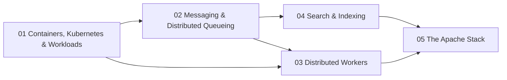

# Infrastructure

How distributed systems *actually run*: the containers and orchestration that schedule them, the messaging and coordination layers that move and order their data, the workers that process it, and the search and storage engines underneath -- the operational substrate beneath every application.

> **Prerequisites**: Some professional experience shipping software, plus [Concurrency & Systems](../algorithms/12-concurrency-systems/). Pairs with [Cloud Native](../systems/03-cloud-native/) (orchestration depth), [Batch & Streaming](../data-engineering/03-batch-streaming/) (the data-engineering view of the same Kafka), and [Diagramming & Documentation](../diagramming-and-documentation/) (you cannot draw a deployment or a consumer topology honestly until you understand its operational caveats).

## Why this track exists

Most engineers can write a service. Far fewer can answer *what happens when it runs at scale, under failure, on shared infrastructure* -- where the state lives, how messages are delivered exactly once (or not), what bounds parallelism, which broker coordinates the cluster, and how a query reaches an inverted index. This track treats the **runtime substrate as a first-class subject**: the math of queues and delivery semantics, the architecture of the engines (Kubernetes, Kafka/KRaft/Redpanda, Lucene/Elasticsearch), and the caveats that cause real outages.

Topics 01-03 stay anchored to one running example -- **Streamflow**, an event-driven order platform -- so the containers you schedule in 01 are the consumer groups you scale in 03 over the log you model in 02.

## Prerequisite Graph

## Topics

| # | Topic | Primary Reference | Time |
|---|-------|------------------|------|
| 01 | [Containers, Kubernetes & Workloads](01-containers-kubernetes/) | [Kubernetes docs](https://kubernetes.io/docs/) (free) + [12-Factor App](https://12factor.net/) (free) | 1-2 weeks |
| 02 | [Messaging & Distributed Queueing](02-messaging-and-queueing/) | [Kafka docs](https://kafka.apache.org/documentation/) (free) + DDIA Ch 11 | 1-2 weeks |
| 03 | [Distributed Workers](03-distributed-workers/) | [Kafka consumer docs](https://kafka.apache.org/documentation/#consumerapi) (free) + [Enterprise Integration Patterns](https://www.enterpriseintegrationpatterns.com/) | 1 week |
| 04 | [Search & Indexing](04-search-and-indexing/) | [Apache Lucene docs](https://lucene.apache.org/core/) (free) + [Elasticsearch: The Definitive Guide](https://www.elastic.co/guide/en/elasticsearch/guide/current/index.html) (free) | 1-2 weeks |
| 05 | [The Apache Stack](05-apache-stack/) | [Apache project docs](https://apache.org/) (free) + DDIA | 1 week |

## Quick Start

1. **Asked to "add Kubernetes support"?** Start with 01 -- the reconciliation model and the caveats (limits/OOM, probes, SIGTERM, PDB) nobody warns you about.
2. **Designing an async architecture?** 02 gives you the dynamics (queue vs log, push vs pull, delivery semantics, ZooKeeper vs KRaft vs Redpanda); 03 gives you the worker operations (rebalancing, idempotency, DLQ, lag-based scaling).
3. **Building search?** 04 takes you from the inverted index and BM25 math down to Lucene/Elasticsearch/Solr -- and cross-links the RAG side to [Retrieval & RAG](../ai-platform-engineering/07-retrieval-and-rag/).
4. **Mapping the ecosystem?** 05 is the bird's-eye view of the Apache data stack -- what each project is and which track goes deeper.
5. **Data/streaming role?** 02-03 pair directly with [Batch & Streaming](../data-engineering/03-batch-streaming/).

See [Study Plan](../STUDY-PLAN.md) for the schedule.
