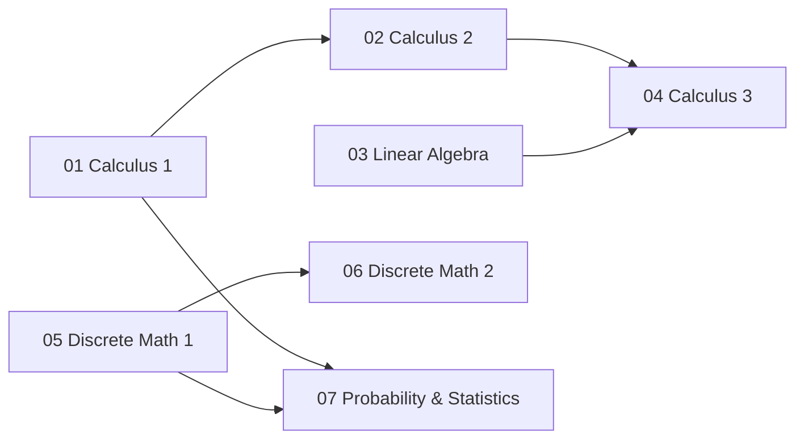

# Mathematics Foundations

A free, self-paced math curriculum built on open-source textbooks. This track covers the
mathematical foundations required for computer science, machine learning, and software
engineering -- from single-variable calculus through probability and statistics.

The primary math texts are free to read online. Access and reuse permissions differ; consult each source's license. See the [source register](../SOURCES.md) for checked references.

## Prerequisite Graph

## Topics

| # | Topic | Textbook | Estimated Time |
|---|-------|----------|---------------|
| 01 | [Calculus 1](01-calculus-1/) | OpenStax Calculus Vol 1 | 4 weeks |
| 02 | [Calculus 2](02-calculus-2/) | OpenStax Calculus Vol 2 | 4 weeks |
| 03 | [Linear Algebra](03-linear-algebra/) | Hefferon, *Linear Algebra* | 4 weeks |
| 04 | [Calculus 3](04-calculus-3/) | OpenStax Calculus Vol 3 | 4 weeks |
| 05 | [Discrete Math 1](05-discrete-math-1/) | Hammack, *Book of Proof* | 4 weeks |
| 06 | [Discrete Math 2](06-discrete-math-2/) | Levin, *Discrete Mathematics* | 4 weeks |
| 07 | [Probability & Statistics](07-probability-statistics/) | Grinstead & Snell + OpenStax Stats | 3-4 weeks |

**Total**: ~27-28 weeks for this intensive introductory pass, at 10-12 hours per week.
Full textbook coverage and degree-level mastery require additional problem sets and assessment.

## Quick Start

1. **Pick your entry point.** Calculus 1, Linear Algebra, and Discrete Math 1 have no
   college-level prerequisites. Algebra and functions are assumed; calculus also requires
   trigonometry. Start with one subject unless your weekly time budget supports more.
2. **Open the topic README.** Each topic lists the free textbook, section-by-section study
   plan, key theorems, worked examples, and exercises.
3. **Work problems with pencil and paper.** Mathematics is learned by doing, not reading.
   Aim for 10-12 hours per week on each active topic.
4. **Follow the prerequisite graph.** Once you complete the entry-level topics, the graph
   above shows what unlocks next.
5. **Connect to CS.** Each topic README maps math concepts to their CS applications and
   links to the algorithms/systems tracks in this repo.

## Recommended Parallel Schedules

**Full-time (2 topics at once)**:
- Weeks 1-4: Calculus 1 + Discrete Math 1
- Weeks 5-8: Calculus 2 + Discrete Math 2
- Weeks 9-12: Linear Algebra + Probability & Statistics
- Weeks 13-16: Calculus 3

**Part-time (1 topic at a time)**:
- Follow the numbering 01 through 07, respecting prerequisites.

## Apply the mathematics

Use the [CS curriculum math labs](../CS-CURRICULUM.md#mathematics-must-produce-working-artifacts) alongside these topics: prove a scheduler correct, implement least squares and PCA, check gradients, measure integration error, and simulate statistical inference. Each assignment requires a derivation, implementation, independent comparison, and failure analysis.

After the foundations, read Deisenroth, Faisal and Ong's [Mathematics for Machine Learning](https://mml-book.github.io/) for the bridge to numerical optimization and data applications.
