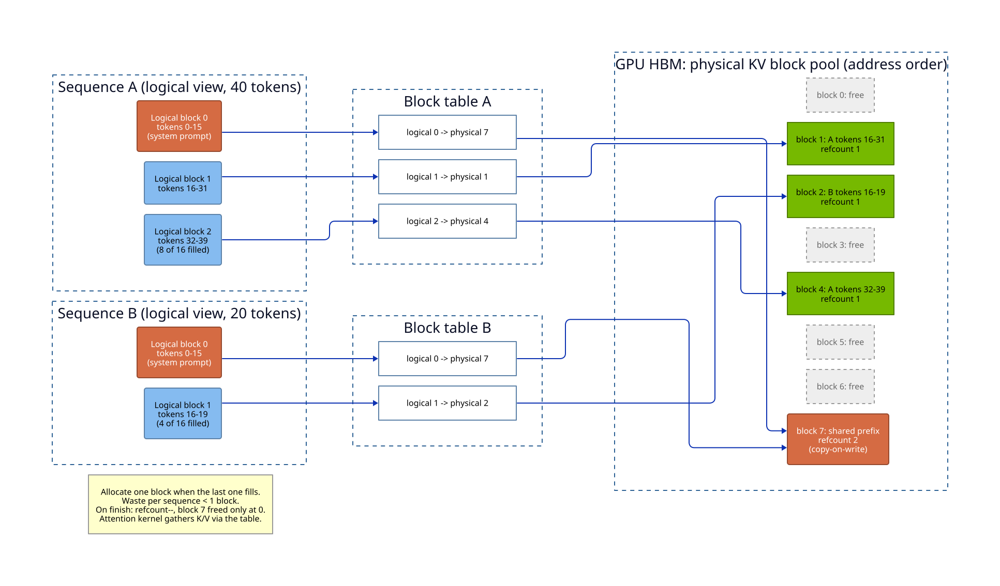

# LLM Systems & Inference

## Overview

- **Primary reference**: [*Machine Learning Systems*](https://mlsysbook.ai/) by Vijay Janapa Reddi (free online) -- the systems-level companion to Goodfellow
- **Supplementary**: [vLLM docs](https://docs.vllm.ai/) (free), Lilian Weng's [*Large Transformer Model Inference Optimization*](https://lilianweng.github.io/posts/2023-01-10-inference-optimization/) (free), [*The Full Stack LLM Bootcamp*](https://fullstackdeeplearning.com/llm-bootcamp/) (free), [HuggingFace TGI](https://huggingface.co/docs/text-generation-inference) + [NVIDIA TensorRT-LLM](https://nvidia.github.io/TensorRT-LLM/) docs
- **Deep dive**: [Quantization: Math → Code](quantization/) -- the quantizer zoo (GPTQ/AWQ/SmoothQuant/NF4/GGUF/FP8/QuIP#/TurboQuant) with C/CUDA/Rust examples
- **Deep dive**: [Inference Frameworks](frameworks/) -- the cross-language stack (llama.cpp, vLLM, candle, mistral.rs, ZML) with Rust + Zig examples
- **Deep dive**: [Model Loading](model-loading/) -- Hub repo anatomy, safetensors byte layout, what `from_pretrained` does, how engines shard weights, cold-start math
- **Deep dive**: [Serving & Load](serving-and-load/) -- prefill vs decode, memory budgets, SLOs, parallelism, vLLM/SGLang knobs, load testing, cost per token
- **Practical guide**: [LLM Serving Platforms](serving-platforms.md) -- how Anyscale, Ray, vLLM, SGLang, RouteLLM, and OpenRouter work; use cases, trade-offs, and reproducibility
- **Prerequisites**: [Deep Learning](../02-deep-learning/) (transformers, attention), [Cloud Native](../../systems/03-cloud-native/) (containers, K8s), [Concurrency & Systems](../../algorithms/12-concurrency-systems/)
- **Estimated time**: 4-6 weeks at 10-12 hrs/week

## Key Takeaways

- LLM inference is *memory-bandwidth bound*, not compute bound -- the bottleneck is moving weights and the KV cache through the GPU, not doing FLOPs
- Generation has two distinct phases: **prefill** (compute-bound, parallel over the prompt) and **decode** (memory-bound, one token at a time). They have opposite performance profiles and are optimized differently
- The KV cache is the central data structure of serving: it trades memory for compute, and managing it well (PagedAttention) is what separates toy serving from production throughput
- Throughput and latency trade off directly through batch size; continuous batching is the single biggest practical win for serving multiple users
- A model that doesn't fit on one GPU forces a parallelism choice (tensor, pipeline, expert), and each choice has a different communication cost

## How to Study

- Serve a real model locally with vLLM before reading the theory -- watch GPU memory, tokens/sec, and how batching changes them
- For each optimization, ask: does it reduce *memory*, *bandwidth*, or *compute*, and which phase (prefill vs decode) does it help?
- Read the PagedAttention paper (vLLM) and the FlashAttention paper -- they are the two most load-bearing systems papers in modern serving
- Profile, don't guess: use `nvidia-smi`, Nsight, and the framework's own metrics to find the actual bottleneck before optimizing

---

# Concepts & Techniques

## Core Insight

Training is about *throughput over a fixed dataset*; inference is about *latency and throughput over an open-ended stream of requests*. The economics flip: a model is trained once but served billions of times, so inference dominates lifetime cost. The defining constraint is that autoregressive decoding generates one token per forward pass, and each pass must read the entire model's weights plus a growing KV cache from GPU memory. The whole field of LLM serving is a fight against memory bandwidth.

## 1. Transformer Architecture (Serving View)

**Recap from [Deep Learning Ch 11](../02-deep-learning/), through an inference lens**

**Key ideas**:
- **Decoder-only stack**: embedding → N transformer blocks (attention + MLP + residual + norm) → unembedding. GPT, LLaMA, Mistral, Qwen all share this shape
- **Self-attention cost**: `Attention(Q,K,V) = softmax(QK^T / sqrt(d_k))V`, O(n^2) in sequence length -- this is why long context is expensive
- **Per-token work at decode**: every new token attends to *all* previous tokens' keys and values, so you must keep them around -- this is the KV cache
- **Variants that change serving**: Multi-Query Attention (MQA) and Grouped-Query Attention (GQA) shrink the KV cache by sharing K/V heads; Mixture-of-Experts (MoE) routes each token to a few experts, raising parameter count without raising per-token FLOPs
- **RoPE / ALiBi**: positional schemes that extrapolate to longer contexts than trained on

**Why it matters for serving**: the architecture dictates KV cache size (`2 × n_layers × n_kv_heads × d_head × seq_len × batch × bytes`), which dictates how many concurrent requests fit in memory.

## 2. The Two Phases: Prefill and Decode

**Key ideas**:
- **Prefill**: process the entire prompt in one parallel forward pass; populates the KV cache. *Compute-bound* -- large matmuls saturate the GPU. Determines **time-to-first-token (TTFT)**
- **Decode**: generate tokens one at a time, each pass reading all weights + KV cache for a single token. *Memory-bandwidth-bound* -- the GPU is mostly idle waiting on memory. Determines **inter-token latency (ITL)** and **time-per-output-token (TPOT)**
- **Chunked prefill**: split long prompts so prefill and decode can be interleaved in the same batch, smoothing latency spikes

**Mental model**: prefill is a sprint (one big burst of compute); decode is a slow drip (thousands of tiny memory-bound steps). A serving system must schedule both without one starving the other.

## 3. The KV Cache

**The central data structure of inference**

**Key ideas**:
- **What it stores**: the key and value tensors for every token already processed, per layer, so future tokens don't recompute them. Turns O(n^2) regeneration into O(n) incremental work
- **Why it dominates memory**: it grows linearly with sequence length and batch size; for long contexts it can exceed the model weights themselves
- **Fragmentation problem**: naive contiguous allocation per request wastes 60-80% of memory to internal/external fragmentation and over-reservation for max sequence length
- **PagedAttention** (vLLM): manage the KV cache like virtual memory -- store it in fixed-size *blocks* (pages), referenced by a block table, allocated on demand. Near-zero fragmentation, enables copy-on-write sharing of prompt prefixes
- **Prefix caching**: reuse the KV blocks of a shared prompt prefix (system prompt, few-shot examples) across requests -- huge win for chat and RAG

How the block table works: each sequence sees contiguous *logical* blocks; the table maps them to whatever *physical* blocks were free. Two sequences with the same system prompt point at one physical block (refcount 2), which is freed only when both finish.

**Key result**: PagedAttention raised serving throughput 2-4x over prior systems by reclaiming wasted KV memory and packing more requests per batch.

## 4. Batching Strategies

**Key ideas**:
- **Static batching**: wait to assemble a fixed batch, run it to completion. Simple but the whole batch waits for the slowest (longest) sequence -- terrible GPU utilization
- **Continuous (in-flight) batching**: schedule at the *token* level. As soon as one sequence finishes, evict it and admit a new request into the freed slot, mid-flight. Keeps the GPU saturated. This is the default in vLLM, TGI, and TensorRT-LLM
- **Throughput vs latency knob**: bigger batches → higher tokens/sec (better $/token) but higher per-request latency. Serving SLOs pick a point on this curve
- **Disaggregated prefill/decode**: run compute-bound prefill and memory-bound decode on *separate* GPU pools so each is sized for its bottleneck

**Why it matters**: continuous batching is usually the single biggest throughput improvement available, often 5-20x over static batching under real, variable-length traffic.

## 5. Attention & Kernel Optimization

**Key ideas**:
- **FlashAttention**: compute attention without materializing the full n×n attention matrix in HBM; tile it in fast SRAM and use the online-softmax trick. Memory goes from O(n^2) to O(n), and it's faster from better memory locality. FlashAttention-2/3 push further with better work partitioning
- **PagedAttention kernels**: attention that reads K/V from non-contiguous paged blocks
- **Fused kernels**: fuse layernorm + matmul + activation to cut kernel-launch overhead and HBM round-trips
- **CUDA graphs**: capture the decode step as a graph to eliminate per-step launch overhead in the tiny memory-bound decode loop

## 6. Quantization & Compression

**Trade precision for memory bandwidth and footprint**

**Key ideas**:
- **Why it works for inference**: less bytes per weight → less memory traffic → faster decode (the bandwidth-bound phase) and more room for KV cache
- **Weight-only quantization**: INT8, INT4 (GPTQ, AWQ) -- keep activations in higher precision, quantize weights. AWQ protects salient weights; GPTQ uses second-order error correction
- **Weight + activation**: FP8 (native on Hopper/Ada), INT8 (SmoothQuant migrates activation outliers into weights to make activations quantizable)
- **KV cache quantization**: store the KV cache in FP8/INT8 to fit longer contexts and bigger batches
- **Distillation, pruning, speculative-friendly small models**: shrink the model itself
- **Tradeoff**: aggressive quantization (INT4) can degrade quality on hard tasks; always evaluate on your own benchmark, not just perplexity

> **Deep dive**: [**Quantization: Math → Code**](quantization/) covers the full quantizer zoo (GPTQ, AWQ, SmoothQuant, NF4, GGUF k-quants, FP8, QuIP#, and TurboQuant) with the underlying math translated to runnable C/CUDA/Rust ([Burn](https://burn.dev/)) examples.

## 7. Decoding Optimizations

**Key ideas**:
- **Speculative decoding**: a small fast *draft* model proposes K tokens; the big *target* model verifies them in one parallel pass, accepting the longest correct prefix. Converts memory-bound single-token decode into compute-bound batch verification -- 2-3x speedup with identical output distribution
- **Medusa / EAGLE / lookahead**: self-speculation variants that add lightweight prediction heads instead of a separate draft model
- **Sampling params**: temperature, top-k, top-p (nucleus), repetition penalty -- shape output without changing cost much
- **Structured / constrained decoding**: mask logits to force valid JSON or grammar (Outlines, XGrammar) -- critical for tool-calling reliability

## 8. Multi-GPU & Multi-Node Parallelism

**When the model (or KV cache) doesn't fit on one device**

**Key ideas**:
- **Tensor parallelism (TP)**: split each weight matrix across GPUs; every layer does an all-reduce. Low latency, but communication-heavy -- keep within one node's fast NVLink domain
- **Pipeline parallelism (PP)**: assign different layers to different GPUs; micro-batches flow through the pipeline. Cheaper communication, but introduces pipeline bubbles -- better across nodes
- **Expert parallelism (EP)**: for MoE, place different experts on different GPUs; tokens are routed (all-to-all) to their experts
- **Sequence/context parallelism**: split the sequence dimension for very long contexts
- **Rule of thumb**: TP inside a node (NVLink), PP/EP across nodes (slower interconnect). Communication is now the bottleneck -- topology awareness matters

## 9. Serving Frameworks & Runtimes

| Framework | Niche | Key feature |
|-----------|-------|-------------|
| **vLLM** | General-purpose, high throughput | PagedAttention, continuous batching, broad model support |
| **TensorRT-LLM** | Max performance on NVIDIA | Compiled kernels, FP8, in-flight batching |
| **TGI** (HuggingFace) | Production HF ecosystem | Tensor parallel, token streaming, easy deploy |
| **SGLang** | Complex/structured generation | RadixAttention prefix sharing, fast structured output |
| **llama.cpp / Ollama** | Local, CPU/edge, GGUF | Runs quantized models on consumer hardware |
| **candle / mistral.rs** (Rust) | Safe single static binary, edge/WASM | Pure-Rust kernels + runtime, ISQ, OpenAI server |
| **ZML / llama.cpp.zig** (Zig) | Native compile, minimal deps, C interop | MLIR/XLA multi-vendor, or `@cImport` over llama.cpp |
| **Ray Serve / KServe** | Orchestration layer | Autoscaling, multi-model, request routing on top of a runtime |

> **Deep dive**: [**Inference Frameworks: The Cross-Language Landscape**](frameworks/) maps the full stack across C (llama.cpp/ggml), Python (vLLM/TGI/SGLang), Rust (candle/mistral.rs/burn/ratchet/luminal), and Zig (ZML/llama.cpp.zig) -- with runnable Rust and Zig examples.

## 10. Deployment: GPU Clusters & Kubernetes

**Where serving meets [Cloud Native](../../systems/03-cloud-native/)**

**Key ideas**:
- **GPU scheduling on K8s**: the NVIDIA device plugin exposes `nvidia.com/gpu` as a schedulable resource; node selectors / taints / `nodeAffinity` pin pods to the right GPU SKU (A100, H100, L40S)
- **Sharing GPUs**: Multi-Instance GPU (MIG) partitions one A100/H100 into isolated slices; time-slicing shares a GPU across pods for low-traffic models
- **Multi-node serving**: LeaderWorkerSet / multi-host inference for models spanning nodes; RDMA/InfiniBand and topology-aware scheduling for the parallelism interconnect
- **Autoscaling**: scale on GPU-aware signals (queue depth, tokens/sec, KV-cache utilization) via KEDA or custom metrics -- *not* CPU. Cold starts are brutal because model weights are tens-to-hundreds of GB; keep warm pools and use fast model loading (streaming from object storage, RDMA, or local NVMe cache)
- **Operators**: KServe, Ray, NVIDIA NIM, or KubeAI to declaratively manage model deployments, canary rollouts, and scale-to-zero
- **Cost levers**: spot/preemptible GPUs with checkpointing, right-sizing the GPU to the model, bin-packing many small models per GPU with MIG

## 11. Serving Metrics & SLOs

| Metric | Meaning | Driven by |
|--------|---------|-----------|
| **TTFT** | Time to first token | Prefill speed, queue wait, prompt length |
| **TPOT / ITL** | Time per output token | Decode speed (memory bandwidth), batch size |
| **Throughput** | Total tokens/sec across all requests | Batching, KV cache efficiency, hardware |
| **Goodput** | Throughput that *meets* SLOs | Scheduling quality under load |
| **Utilization** | GPU compute/memory busy fraction | Batching, phase mix |

**Key tension**: optimizing throughput (big batches) hurts TTFT/TPOT for individual users. Serving systems schedule to maximize goodput -- throughput *subject to* latency SLOs.

---

## Optimization Cheat Sheet

| Goal | Technique | Why it works |
|------|-----------|--------------|
| Less KV memory waste | PagedAttention | Virtual-memory-style paging, no fragmentation |
| More concurrent users | Continuous batching | Token-level scheduling keeps GPU full |
| Lower attention memory | FlashAttention | Tiled, no n×n matrix in HBM |
| Smaller footprint | Quantization (AWQ/GPTQ/FP8) | Fewer bytes → less bandwidth |
| Smaller KV cache | GQA/MQA, KV quantization | Fewer/cheaper K-V heads |
| Faster decode | Speculative decoding | Parallel verify > serial generate |
| Reuse shared prompts | Prefix / RadixAttention caching | Skip recomputing common prefixes |
| Model too big for 1 GPU | Tensor / pipeline parallelism | Split weights across devices |

## Connections to Other Tracks

| Concept | Connected Track | Application |
|---------|-----------------|-------------|
| Attention, transformers, scaling laws | [Deep Learning](../02-deep-learning/) | The model being served |
| K8s, autoscaling, containers, GPU scheduling | [Cloud Native](../../systems/03-cloud-native/) | Deployment substrate |
| Caching, load balancing, queueing, SLOs | [System Design](../../systems/01-system-design/) | Request routing and capacity planning |
| Tail latency, RED/USE metrics, profiling | [Observability](../../systems/04-observability/) | Measuring TTFT/TPOT, finding bottlenecks |
| Memory hierarchy, bandwidth, parallelism | [Concurrency & Systems](../../algorithms/12-concurrency-systems/) | Why inference is memory-bound |
| Quantization as lossy compression | [Information Theory](../../information-theory/) | Bits-per-weight vs quality tradeoff |
| Streaming pipelines, feature serving | [Data Engineering](../../data-engineering/) | Getting data to and from the model |

## Company Relevance

| Company | How This Appears | Difficulty |
|---------|-----------------|------------|
| NVIDIA | TensorRT-LLM, kernel optimization, FP8, Triton, MIG | Expert |
| Anthropic | Inference serving at scale, KV cache, parallelism, cost/token | PhD-level |
| OpenAI | Serving infrastructure, batching, latency SLOs, capacity | PhD-level |
| Google/DeepMind | TPU inference, JAX serving, large-context optimization | PhD-level |
| Databricks | Model serving platform, vLLM/MosaicML, GPU orchestration | Expert |
| Meta | LLaMA serving, quantization research, edge inference | Expert |
| Together / Fireworks / Anyscale | High-throughput serving as a product (vLLM/SGLang) | Expert |
