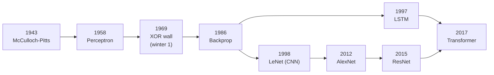
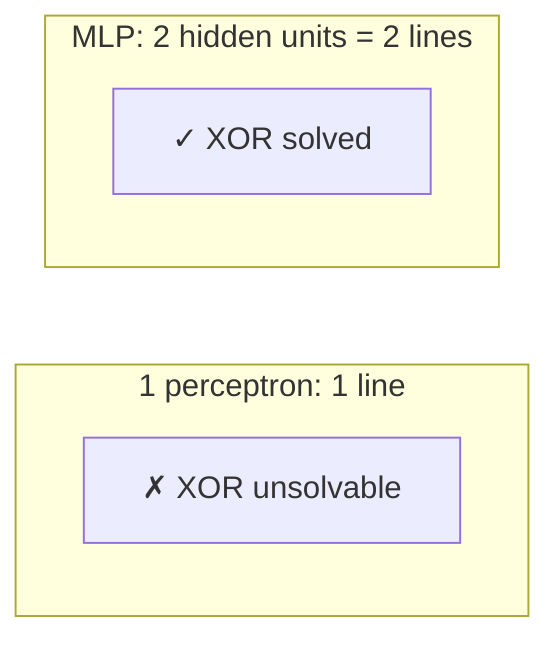
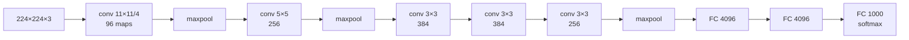

# Neural Network Architectures & the History of Deep Learning

The full story of how we got from a 1943 model of a neuron to AlexNet and beyond -- the **history**, the **foundational math**, and the **architectures** (MLP, CNN, RNN, LSTM), each derived from its equations and then written in code. This is the deep, implementation-first companion to the Goodfellow survey in [Deep Learning](../02-deep-learning/).

## Overview

- **Primary references**:
  - [*Deep Learning*](https://www.deeplearningbook.org/) (Goodfellow et al.) Ch 6, 9, 10 -- free
  - [Stanford CS231n](https://cs231n.github.io/) -- free, the canonical CNN course
  - Karpathy's [Neural Networks: Zero to Hero](https://karpathy.ai/zero-to-hero.html) -- free, backprop from scratch
- **Primary papers** (all free): [Perceptron (Rosenblatt 1958)](https://psycnet.apa.org/record/1959-09865-001), [Backprop (Rumelhart, Hinton, Williams 1986)](https://www.nature.com/articles/323533a0), [LeNet (LeCun 1998)](http://yann.lecun.com/exdb/publis/pdf/lecun-98.pdf), [**AlexNet (Krizhevsky 2012)**](https://papers.nips.cc/paper/4824-imagenet-classification-with-deep-convolutional-neural-networks), [LSTM (Hochreiter & Schmidhuber 1997)](https://www.bioinf.jku.at/publications/older/2604.pdf), [ResNet (He 2015)](https://arxiv.org/abs/1512.03385)
- **Prerequisites**: [Linear Algebra](../../math/03-linear-algebra/), [Calculus 3](../../math/04-calculus-3/) (the chain rule), [Statistical Learning](../01-statistical-learning/)
- **Estimated time**: 3-4 weeks at 8-10 hrs/week

## Key Takeaways

- **An architecture is an inductive bias made of linear algebra.** A CNN bakes in "nearby pixels matter and a feature is the same anywhere" (translation equivariance); an RNN bakes in "the past summarizes into a state." The bias is the whole game.
- **Backpropagation is the chain rule run backwards through a computation graph** -- nothing more. Once you can derive it for one neuron, every architecture is the same algorithm over a different graph.
- **The two AI winters were caused by hitting a math wall** (the perceptron can't learn XOR; RNNs can't learn long dependencies), and each thaw came from a *specific* fix (hidden layers + backprop; the LSTM's additive cell state).
- **AlexNet (2012) didn't invent anything fundamental** -- CNNs, ReLU, dropout, and GPUs already existed. It *combined* them at scale on ImageNet and cut error from 26% to 15%, which is why it started the deep learning era.

## How to Study

- Read this top-to-bottom as a narrative; the math sections build on each other.
- Run the `code/` files in order: `perceptron.c` (and watch it fail on XOR) → `backprop_xor.c` (watch hidden layers fix it) → `conv2d.c` → `lstm_cell.c`.
- For each architecture, write the forward equations on paper, then check them against the code. The point of this topic is the **math ↔ code** correspondence.
- Read the AlexNet paper (§5) -- it's short, readable, and you'll recognize every trick.

---

# Concepts & Techniques

## Core Insight

A neural network is a **parameterized, differentiable function** built by composing simple pieces (an affine map `Wx + b` followed by a nonlinearity), and we fit it by **gradient descent** on a loss, where the gradients come from **backpropagation** (reverse-mode automatic differentiation). Every architecture in this topic -- perceptron, MLP, CNN, RNN, LSTM -- is *the same idea* with a different wiring of those pieces, and each wiring encodes a prior belief (an *inductive bias*) about the structure of the data. The history of the field is the history of discovering which wirings make hard problems learnable.

## 1. A history of computing and neural nets

| Year | Event | Why it mattered |
|------|-------|-----------------|
| 1936 | Turing's universal machine | Defines computation; the substrate everything runs on |
| 1943 | **McCulloch & Pitts** neuron | First mathematical model of a neuron: a thresholded sum of weighted inputs |
| 1949 | Hebbian learning ("cells that fire together wire together") | First learning rule |
| 1958 | **Rosenblatt's Perceptron** | A neuron that *learns* its weights from data; huge hype |
| 1969 | **Minsky & Papert**, *Perceptrons* | Proved a single perceptron can't learn XOR → **first AI winter** |
| 1986 | **Backpropagation** (Rumelhart, Hinton, Williams) | Train *multi-layer* nets efficiently → XOR solved, field revived |
| 1989/98 | **LeNet** (LeCun) | Convolutions + backprop read handwritten digits (ran on ATM checks) |
| 1991 | Hochreiter identifies the **vanishing gradient** | Explains why deep/recurrent nets wouldn't train |
| 1995-2005 | SVMs & kernel methods dominate | Neural nets fall out of fashion → **second AI winter** |
| 1997 | **LSTM** (Hochreiter & Schmidhuber) | Gated memory solves vanishing gradients for sequences |
| 2006 | Deep belief nets (Hinton) | Layer-wise pretraining shows deep nets *can* be trained |
| 2009-12 | GPUs + ImageNet (Fei-Fei Li) | Compute and a big labeled dataset arrive together |
| **2012** | **AlexNet** wins ImageNet | 15.3% vs 26.2% error → the deep learning revolution starts |
| 2014 | VGG, GoogLeNet, GANs, seq2seq, Adam | Architectures and tooling explode |
| 2015 | **ResNet** | Skip connections train 100+ layers; surpasses human ImageNet error |
| 2017 | **Transformer** ("Attention Is All You Need") | Attention replaces recurrence; basis of modern LLMs |



**The through-line**: progress alternated between *ideas* (backprop, gating, attention) and *resources* (GPUs, ImageNet). AlexNet is the moment they met.

## 2. The foundational math

Everything reduces to four objects.

**(1) The artificial neuron.** Inputs `x ∈ ℝⁿ`, weights `w`, bias `b`, nonlinearity `φ`:

```
y = φ(wᵀx + b) = φ(Σᵢ wᵢxᵢ + b)
```

A layer stacks `m` neurons into a matrix: `y = φ(Wx + b)`, `W ∈ ℝ^{m×n}`. **This affine-map-then-nonlinearity is the only primitive** -- depth is just composition: `f(x) = φ(W₃ φ(W₂ φ(W₁x + b₁) + b₂) + b₃)`.

**(2) The loss.** A scalar measuring wrongness, e.g. cross-entropy for classification:
`L = -Σ_c y_c log ŷ_c`, where `ŷ = softmax(z)`. Training = minimize `L` over parameters `θ = {W,b}`.

**(3) Gradient descent.** Step downhill: `θ ← θ - η ∇_θ L`. The learning rate `η` is the step size.

**(4) Backpropagation -- the chain rule on a graph.** For a composition `L = ℓ(f(g(x)))`, the chain rule gives `∂L/∂x = ∂L/∂f · ∂f/∂g · ∂g/∂x`. Reverse-mode AD evaluates this **right-to-left**, reusing each intermediate, so *all* gradients cost one backward pass regardless of parameter count. For one linear layer `z = Wx + b`, `a = φ(z)` with upstream gradient `δ = ∂L/∂a`:

```
∂L/∂z = δ ⊙ φ'(z)          (elementwise; ⊙ = Hadamard)
∂L/∂W = (∂L/∂z) xᵀ          (outer product)
∂L/∂b = ∂L/∂z
∂L/∂x = Wᵀ (∂L/∂z)          (the gradient to send to the previous layer)
```

These four lines, applied layer by layer, **are** training. See [`code/backprop_xor.c`](code/backprop_xor.c) for the entire algorithm in ~100 lines of C with no libraries.

## 3. The perceptron and why it failed

Rosenblatt's perceptron is one neuron with a step nonlinearity and a beautifully simple learning rule: for each misclassified example, nudge the weights toward the correct answer, `w ← w + η(target − pred)x`. It **provably converges** if the data is *linearly separable* (the perceptron convergence theorem).

The catch Minsky & Papert exposed: **XOR is not linearly separable.** No single line separates `{(0,0),(1,1)}` from `{(0,1),(1,0)}`, so one perceptron *can never* learn it. This killed funding for a decade.

The fix is depth: a network with **one hidden layer** can carve the input space into regions and solve XOR. But training hidden layers needed a way to assign credit to internal neurons -- which is exactly what backpropagation (1986) provided. [`code/perceptron.c`](code/perceptron.c) shows the perceptron learning AND/OR and *failing* on XOR; [`code/backprop_xor.c`](code/backprop_xor.c) shows a 2-layer MLP solving it.



## 4. Convolutional networks (CNNs)

An MLP on a 224×224×3 image has ~150K inputs; a single fully-connected layer of 4096 units is 600M weights -- and it learns nothing about the fact that a cat is a cat wherever it appears. The CNN encodes two priors that fix this:

- **Local connectivity**: a neuron looks at a small patch (e.g. 3×3), not the whole image. Vision is local.
- **Parameter sharing**: the *same* small filter slides across the whole image. A feature detector (edge, texture) is reused everywhere → **translation equivariance** and far fewer parameters.

**The convolution (really cross-correlation).** For input `X` and a `k×k` filter `K`, the output feature map is

```
S(i,j) = Σ_{u=0}^{k-1} Σ_{v=0}^{k-1} X(i+u, j+v) · K(u,v) + b
```

Stacking many filters gives many output channels (feature maps). Knobs: **stride** (step size), **padding** (border handling), **dilation** (spaced taps). [`code/conv2d.c`](code/conv2d.c) implements this forward pass; [`code/conv2d.cu`](code/conv2d.cu) is the CUDA version (one thread per output pixel).

**Pooling** (max or average over a window) downsamples and grants *approximate translation invariance* -- a feature detected anywhere in the window survives. **Receptive field** grows with depth: stack enough 3×3 convs and a deep neuron "sees" the whole image.

**The CNN lineage** (each row fixes the previous row's bottleneck):

| Model | Year | Key idea | Depth | ImageNet top-5 error |
|-------|------|----------|------:|---------------------:|
| LeNet-5 | 1998 | conv+pool+FC, trained by backprop | 7 | (MNIST, pre-ImageNet) |
| **AlexNet** | 2012 | ReLU + dropout + 2-GPU training, at scale | 8 | **15.3%** |
| VGG-16 | 2014 | only 3×3 convs, very deep & uniform | 16 | 7.3% |
| GoogLeNet | 2014 | Inception modules, 1×1 convs (cheap channels) | 22 | 6.7% |
| **ResNet** | 2015 | residual `y = F(x)+x` trains 100+ layers | 152 | 3.6% |

**ResNet's insight** is worth isolating: making the layer learn a *residual* `F(x) = H(x) − x` (so the block computes `F(x)+x`) means the identity map is free, gradients flow through the `+x` skip unimpeded, and degradation with depth disappears. This is the same "additive path" trick the LSTM uses for time (§7).

## 5. AlexNet deep dive

AlexNet (Krizhevsky, Sutskever, Hinton, 2012) is the single most important architecture in this topic -- not for novelty, but for **proof at scale**. It won ILSVRC-2012 with a 15.3% top-5 error versus 26.2% for the runner-up, and the field pivoted to deep learning within a year.

**Architecture**: 5 convolutional layers + 3 fully-connected layers, ~60M parameters, ~650K neurons, output 1000-way softmax.



**The six choices that made it work** (each is now standard practice):

1. **ReLU** `φ(x)=max(0,x)` instead of tanh/sigmoid -- no saturation, gradients don't vanish, ~6× faster training. The biggest single lever.
2. **Training on two GPUs** (GTX 580, 3 GB each) -- the model was split across GPUs because it didn't fit in one. This is why the diagram in the paper has two parallel streams.
3. **Dropout** (p=0.5) in the FC layers -- randomly zeroing units prevents co-adaptation; a cheap ensemble. Essential given 60M params.
4. **Overlapping max-pooling** (3×3 window, stride 2) -- slightly reduces error vs non-overlapping.
5. **Local Response Normalization** -- a lateral-inhibition normalization across channels (later superseded by batch norm, but part of the original recipe).
6. **Data augmentation** -- random crops/flips and PCA color jitter expand the effective dataset and curb overfitting.

[`code/alexnet.py`](code/alexnet.py) defines the architecture in PyTorch (the canonical reference); [`code/lenet.rs`](code/lenet.rs) builds the smaller LeNet in Rust with `candle` to show the same primitives in a systems language.

**Why it's the hinge of the whole field**: it demonstrated that the 1980s-90s ideas (CNN + backprop) only needed *scale* (data + GPUs) to dominate. Every subsequent architecture in this curriculum descends from that lesson.

## 6. Recurrent networks (RNNs)

For sequences (text, audio, time series) we want a model whose computation depends on the past. An RNN maintains a **hidden state** `h_t` updated at each step:

```
h_t = φ(W_hh h_{t-1} + W_xh x_t + b)
ŷ_t = W_hy h_t
```

The same weights are reused at every timestep (parameter sharing *across time*, the temporal analogue of the CNN's spatial sharing). Training uses **backpropagation through time (BPTT)**: unroll the recurrence into a deep feedforward graph (one layer per timestep) and backprop.

**The vanishing/exploding gradient problem.** The gradient of the loss at step `t` w.r.t. an early state involves a *product* of Jacobians:

```
∂h_t/∂h_k = Π_{i=k+1}^{t} ∂h_i/∂h_{i-1} = Π W_hhᵀ diag(φ'(·))
```

A product of `t−k` matrices either **shrinks to zero** (if the relevant singular values < 1) or **blows up** (if > 1). So a vanilla RNN can't learn dependencies more than ~10 steps apart -- exactly Hochreiter's 1991 finding. Exploding gradients are patched with **gradient clipping**; *vanishing* gradients need an architectural fix.

## 7. LSTM and GRU

The LSTM (Hochreiter & Schmidhuber, 1997) fixes vanishing gradients with a **cell state** `c_t` that is updated *additively* and protected by multiplicative **gates** (sigmoids in `[0,1]` that decide how much to let through).

```
f_t = σ(W_f·[h_{t-1}, x_t] + b_f)      forget gate  — what to erase from memory
i_t = σ(W_i·[h_{t-1}, x_t] + b_i)      input gate   — what to write
g_t = tanh(W_g·[h_{t-1}, x_t] + b_g)   candidate     — the new content
c_t = f_t ⊙ c_{t-1} + i_t ⊙ g_t        cell update  — ADDITIVE
o_t = σ(W_o·[h_{t-1}, x_t] + b_o)      output gate
h_t = o_t ⊙ tanh(c_t)                  hidden state
```

**Why it works**: when `f_t ≈ 1` and `i_t ≈ 0`, the cell state passes through *unchanged* (`c_t = c_{t-1}`), so `∂c_t/∂c_{t-1} ≈ 1`. The gradient travels along the cell-state "conveyor belt" without the repeated matrix multiply that kills vanilla RNNs -- the same additive-path idea as ResNet's skip connection. [`code/lstm_cell.c`](code/lstm_cell.c) implements all six equations for one timestep.

**GRU** (Cho 2014) merges the cell and hidden state and uses two gates (reset, update) instead of three -- fewer parameters, often comparable performance:

```
z_t = σ(W_z·[h_{t-1}, x_t])                       update gate
r_t = σ(W_r·[h_{t-1}, x_t])                       reset gate
h̃_t = tanh(W·[r_t ⊙ h_{t-1}, x_t])
h_t = (1 − z_t) ⊙ h_{t-1} + z_t ⊙ h̃_t            additive again
```

## 8. CNNs vs RNNs vs Transformers

The choice of architecture is a choice of inductive bias and a choice of *how computation parallelizes*.

| | **CNN** | **RNN / LSTM** | **Transformer** |
|--|---------|----------------|-----------------|
| Inductive bias | locality + translation equivariance | sequential, recent-past-summarized state | none structural; learns relations via attention |
| Natural data | grids (images, spectrograms) | ordered sequences | sequences/sets, multimodal |
| Long-range deps | needs depth (grows receptive field) | hard (vanishing grad; LSTM helps) | direct (any token attends to any token) |
| Parallelism over length | full (all positions at once) | **none** (must step `t-1` → `t`) | full (all positions at once) |
| Cost | O(n·k) per layer | O(n) sequential steps | O(n²) attention |
| Params reused across | space | time | -- (positional encodings supply order) |

**The practical story**: CNNs still dominate when locality is the right prior (vision, though Vision Transformers now compete). RNNs/LSTMs are largely **legacy** for NLP -- the killer weakness was the sequential dependency that prevents GPU parallelization across the sequence, which is precisely what the Transformer (2017) removed by replacing recurrence with attention. That unlock is what made training on internet-scale text feasible and led directly to the LLMs in [LLM Systems](../04-llm-systems/) and [Foundation Models](../05-foundation-models/).

## 9. Key insights and through-lines

- **An architecture is a prior.** You are encoding what you believe about the data's structure. Match the bias to the domain.
- **Additive skip paths beat multiplicative chains.** ResNet (depth) and LSTM (time) independently discovered that letting information pass *unchanged* by default keeps gradients alive. This is the most reused trick in the field.
- **The bottleneck moves, it never disappears.** Linear separability → depth (backprop) → vanishing gradients (LSTM/ReLU/ResNet) → sequential compute (Transformer) → quadratic attention (today's efficient-attention work).
- **Scale is a first-class idea.** AlexNet's lesson, made explicit by later scaling laws: the same architecture plus more data and compute often beats a cleverer architecture.
- **It's all one algorithm.** Build a differentiable graph, define a loss, backprop, descend. Master that once and every architecture is a variation.

## Technique Catalog

| Technique | Where it appears | Why it matters |
|-----------|------------------|----------------|
| Backpropagation | every model | The one training algorithm; chain rule on a graph |
| ReLU activation | AlexNet onward | Non-saturating → no vanishing gradient, fast |
| Convolution + pooling | all CNNs | Locality, parameter sharing, translation (in)variance |
| Dropout | AlexNet FC layers | Cheap ensemble; curbs overfitting |
| Batch normalization | post-2015 CNNs | Stabilizes/ speeds training (replaced LRN) |
| Residual / skip connection | ResNet, Transformers | Trains very deep nets; keeps gradients alive |
| Gating (forget/input/output) | LSTM, GRU | Additive memory path solves vanishing gradients |
| Gradient clipping | RNN training | Tames exploding gradients |
| BPTT | RNN/LSTM | Backprop over the time-unrolled graph |
| Data augmentation | AlexNet onward | Expands data, reduces overfitting |

## Connections to Other Tracks

| Concept | Connected Track | How |
|---------|-----------------|-----|
| Chain rule, Jacobians | [Calculus 3](../../math/04-calculus-3/) | Backprop and BPTT *are* the chain rule |
| Matrix multiply, SVD, eigenvalues | [Linear Algebra](../../math/03-linear-algebra/) | Every layer is `Wx+b`; vanishing gradients are about singular values |
| Cross-entropy, KL divergence | [Information Theory](../../information-theory/) | The classification loss |
| Convolution as an algorithm | [Algorithms](../../algorithms/) | im2col, FFT-conv, Winograd are algorithmic speedups |
| The Goodfellow survey | [Deep Learning](../02-deep-learning/) | This topic is the deep, coded-from-scratch version |
| Attention replaces recurrence | [LLM Systems](../04-llm-systems/) | Why Transformers won and what they cost |
| GPU kernels for conv | [Cloud Native](../../systems/03-cloud-native/) | Where these models actually run |

## Company Relevance

| Company | How This Appears | Focus |
|---------|-----------------|-------|
| NVIDIA | conv/attention kernels, cuDNN, hardware-aware architecture | conv math, CUDA |
| Google/DeepMind | CNN→Transformer history, vision at scale, JAX | architectures, scaling |
| Anthropic | why recurrence failed and attention won; interpretability | sequence modeling |
| Tesla / autonomy | CNNs for perception are still the workhorse | real-time vision |
| Meta | self-supervised vision (DINO), CNN+ViT hybrids | representation learning |
| Any ML interview | "explain backprop", "CNN vs RNN", "what made AlexNet work" | foundations |
