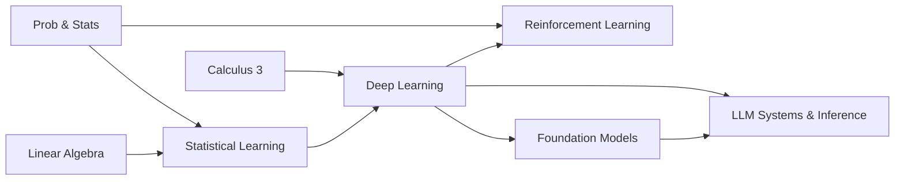

# Machine Learning & AI

From statistical foundations to deep learning research and reinforcement learning. All primary textbooks are free.

> **Prerequisites**: [Linear Algebra](../math/03-linear-algebra/), [Calculus](../math/01-calculus-1/) (through multivariable), [Probability & Statistics](../math/07-probability-statistics/)

## Prerequisite Graph

## Topics

| # | Topic | Primary Textbook | Time |
|---|-------|-----------------|------|
| 01 | [Statistical Learning](01-statistical-learning/) | [ISLR](https://www.statlearning.com/) (free) + [ESL](https://hastie.su.domains/ElemStatLearn/) (free) | 4-5 weeks |
| 02 | [Deep Learning](02-deep-learning/) | [Goodfellow et al.](https://www.deeplearningbook.org/) (free) | 6-8 weeks |
| 03 | [Reinforcement Learning](03-reinforcement-learning/) | [Sutton & Barto](http://incompleteideas.net/book/the-book-2nd.html) (free) + [Spinning Up](https://spinningup.openai.com/en/latest/) | 4-6 weeks |
| 04 | [LLM Systems & Inference](04-llm-systems/) | [*ML Systems*](https://mlsysbook.ai/) (free) + [vLLM docs](https://docs.vllm.ai/) (free) | 4-6 weeks |
| 05 | [Foundation Models & Architectures](05-foundation-models/) | *AI Engineering* (Huyen) + [aie-book](https://github.com/chiphuyen/aie-book) (free) | 4-5 weeks |

## Quick Start

1. If you're new to ML: start with Statistical Learning (ISLR is very accessible)
2. If you have ML basics: jump to Deep Learning (Goodfellow)
3. If you're focused on alignment/AI safety: prioritize Deep Learning Ch 6-8, then RL + RLHF
4. For quant/trading roles: Statistical Learning + RL (especially bandits and MDPs)
5. For MLOps/infra roles: Deep Learning (transformers) → LLM Systems & Inference, pairs with [Cloud Native](../systems/03-cloud-native/) and [Data Engineering](../data-engineering/)
6. For AI engineering / GenAI roles: Deep Learning → Foundation Models & Architectures (Chip Huyen) → LLM Systems & Inference

See [Study Plan](../STUDY-PLAN.md) for the 18-30 week ML/AI schedule.
