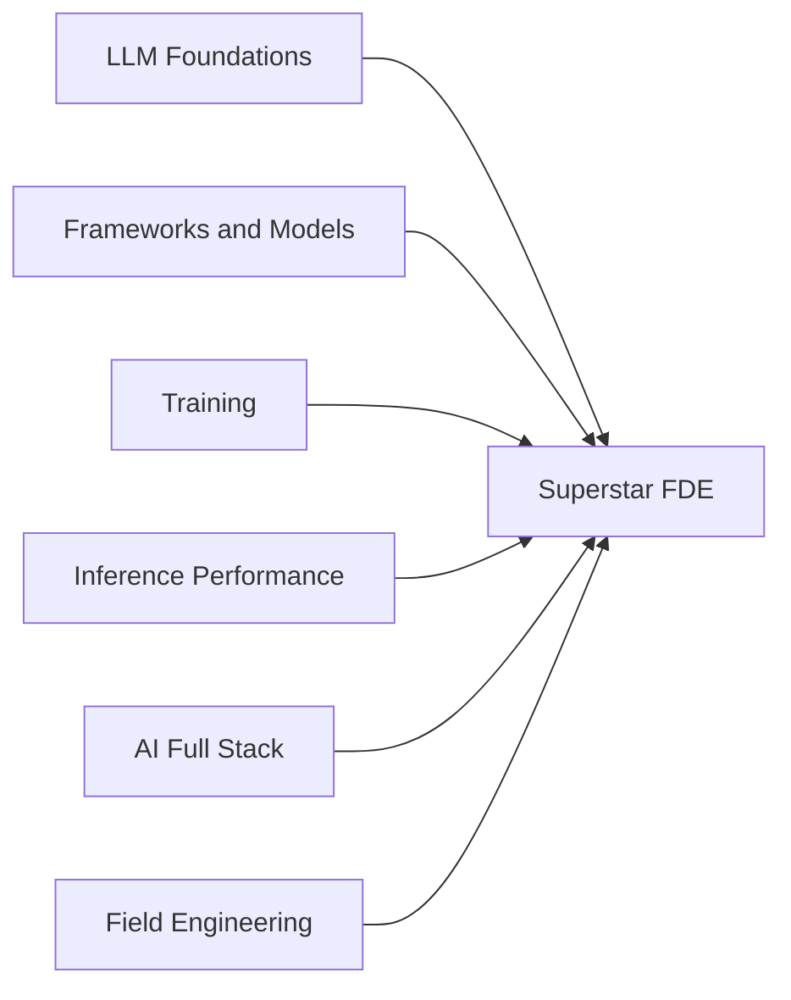

# Role Paths

A path is a reading order for one job, cut across the tracks. The [course](course/) is the one path that also builds a system: its stages carry a check column that `ss check`, `ss milestone`, and `ss drill` grade. The tracks stay where they are and own their content; a path only decides **which chapters, in what order, and what "done" means** for that role. Nothing is copied, so a chapter fixed in its track is fixed in every path that uses it.

Paths compose. Six **part** paths each cover one slice of the work and stand on their own for a narrower role; the **Superstar FDE** path includes all six and adds a capstone. Progress made in a part counts in every path that includes it.



| Path | For | Stages |
|------|-----|--------|
| [course](course/) | The end-to-end course: build your own LLM system in Python, C, Rust, and Go, pass by pass ([Pass 0](course-p00-setup/), [Pass 1](course-p01-tracer/) so far) | 21 |
| [superstar-fde](superstar-fde/) | Forward deployed engineer at an inference and fine-tuning cloud, end to end: all six parts plus a capstone | 25 |
| [llm-foundations](llm-foundations/) | Anyone new to LLMs: history, transformer math, architecture variants | 3 |
| [frameworks-and-models](frameworks-and-models/) | ML engineer onboarding: PyTorch, JAX, Keras 3, loading from the Hub | 2 |
| [training](training/) | Research-adjacent ML engineer: RL foundations, pretraining, post-training, LoRA | 2 |
| [inference-performance](inference-performance/) | Performance engineer: engine internals, quantization, frameworks, serving and load | 5 |
| [ai-full-stack](ai-full-stack/) | AI application engineer: streaming, retrieval, evaluation, routing | 4 |
| [field-engineering](field-engineering/) | Sales engineer or solutions architect: discovery through escalation | 7 |

## Reading a path

```bash
practice/bin/ss learn                                         # every path, and your progress
practice/bin/ss learn superstar-fde                           # stages grouped by part, with done-when criteria
practice/bin/ss learn superstar-fde next                      # read the first unfinished stage
practice/bin/ss learn superstar-fde inference-performance:4   # read one stage of an included part
practice/bin/ss learn inference-performance 4                 # the same stage, from the part itself
practice/bin/ss learn superstar-fde --done inference-performance:4
```

A path's own stages are addressed as `<n>`, an included part's as `<part>:<n>`. Progress lives in `.scratchpad/learn/` and is never committed. Stages render with [glow](https://github.com/charmbracelet/glow) when it is installed, and as plain markdown through `$PAGER` otherwise.

Each path also builds into its own PDF (`supersource-<path>.pdf`): CI attaches every one to the build artifact and to each GitHub Release, and `./scripts/build-book.sh --path <path>` builds one locally. A composed path gets one PDF Part per included part.

## Adding a path

1. Create `paths/<name>/README.md`. Its first `# ` heading is the path's title.
2. Create `paths/<name>/path.tsv`, one row per stage, tab-separated:

   ```text
   stage <TAB> title <TAB> file[,file...] <TAB> done when
   @other-path
   ```

   Files are repo-relative markdown, read in the order listed. A line `@other-path` includes every stage of that path at that point. Lines starting with `#` are comments. "Done when" is a checkable outcome (you built, measured, wrote, or explained something), not "read the chapter".
3. Content belongs in a track, even when only one path uses it today. A path directory holds only its manifest, its README, and material that is about the path itself, such as a capstone.
4. Run `practice/bin/ss learn --verify`. CI runs it too: a missing file, an unknown include, or an include cycle fails the build.
5. Add `outputs/supersource-<name>.pdf` to `sr.yaml` under `packages[].artifacts` so releases attach it.
