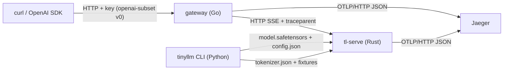

# The System You Will Build

One system, named by you (`ss course init --name <system>`), grown in passes. This page is the map: what the components are, which language each is in, and the contracts they meet at. Every contract is a file in [`course/contracts/`](../../course/contracts/), vendored into your repo's `contracts/` and pinned by `contracts/VERSION`.

## Components after Pass 1 (the tracer)

| Component | Lang | Your path | What it does | Module |
|---|---|---|---|---|
| optional C exercises | C | `c/src/`, `c/Makefile` | standalone kernels and data structures, checked by C test binaries and shared fixtures | rt.01, M03.1, ds.01 to ds.04 |
| `tinyllm` | Python | `python/tinyllm/` | the byte bigram fitted by counting, safetensors v0, tokenizer files, the `tinyllm` CLI | L0.0 |
| `tl-serve` | Rust | `rust/crates/` | a Candle engine streaming SSE completions from safetensors checkpoints; one OTLP span per request | L10.0 |
| gateway | Go | `go/gateway/proxy/`, `go/cmd/gateway` | API-key check, SSE pass-through without buffering, `traceparent` and `X-Request-Id` | gw.00, obs.00 |
| deploy | Docker, Helm, kind | `deploy/` | engine and gateway images, two charts, a kind cluster with NodePorts 30080 and 30686, Jaeger | dep.00 |
| docs | Markdown | `docs/` | ADR-0001, the engine-crashloop runbook, postmortems | craft.02, ops.00 |
| CI | GitHub Actions | `.github/workflows/ci.yml`, `.githooks/` | commit lint, native tests, `ss check --all --ci` | craft.01 |
| manifest | TOML | `system.toml` | how the harness builds and runs your entry points | every milestone |

Python and Rust exchange data through files: safetensors checkpoints, `tokenizer.json`, and shared fixtures. No language boundary uses FFI.

## Contract index

| Contract | File | Used from |
|---|---|---|
| C exercise contracts | [`c/include/tinyllm.h`](../../course/contracts/c/include/tinyllm.h), [`tinyllm/abi.h`](../../course/contracts/c/include/tinyllm/abi.h), [`tinyllm/matmul.h`](../../course/contracts/c/include/tinyllm/matmul.h), rules in [`c/ABI.md`](../../course/contracts/c/ABI.md) | optional standalone C modules, each checked by its own C test binary |
| C test kit | [`c/include/ss_test.h`](../../course/contracts/c/include/ss_test.h) | the C course tests |
| Python interfaces | [`py/tinyllm/`](../../course/contracts/py/tinyllm/) (`lm/bigram.pyi`, `io/safetensors.pyi`) | L0.0 |
| HTTP API v0 | [`openapi/openai-subset.v0.yaml`](../../course/contracts/openapi/openai-subset.v0.yaml) | L10.0 (engine tier), gw.00 (gateway tier), `ss conform openapi:v0` |
| Checkpoint | [`formats/safetensors.md`](../../course/contracts/formats/safetensors.md), [`formats/config.schema.json`](../../course/contracts/formats/config.schema.json) | L0.0 writes, L10.0 reads |
| Tokenizer | [`formats/tokenizer.md`](../../course/contracts/formats/tokenizer.md) (the `bytes` tokenizer) | L0.0, L10.0 |
| Entry points | [`spec/cli-roles.md`](../../course/contracts/spec/cli-roles.md) | every milestone step |
| Harness manifest | [`config/system.schema.json`](../../course/contracts/config/system.schema.json) | `system.toml` |
| Decision record | [`templates/ADR.md`](../../course/contracts/templates/ADR.md) | craft.02 |

## The spiral

After every pass your own system runs end to end and `ss milestone MS-P<n>` passes against your code. Later modules either upgrade a component behind an unchanged contract (the bigram retrained by your autograd in Pass 2 still serves through the same checkpoint and the same engine) or change a contract through an explicit migration chapter. Each pass gate reruns the smoke steps of every earlier gate, so a regression anywhere fails the next gate.

| Contract | How it grows |
|---|---|
| the model behind the checkpoint | count bigram (P1), autograd bigram (P2), the transformer family (P5), the Llama family served by the engine (P7 on) |
| standalone C kernels | optional exercises, checked against fixture files produced by Python references |
| HTTP `openai-subset` | v0 completions with SSE (P1), v1 with chat, usage, and tools (P7), v2 migration (P11) |
| gateway | proxy (P1), auth, limits, routing, cache, ledger (P7), usage policy (P10) |
| deploy | two charts and Jaeger (P1), per-role charts and the observability stack (P7), durable workers (P8) |
