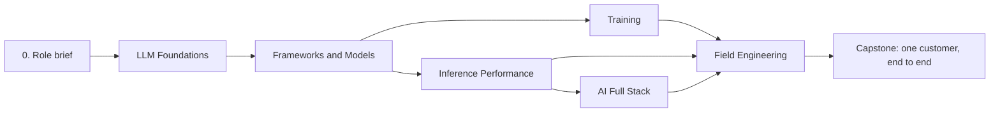

# Superstar FDE: Inference Cloud, End to End

The forward deployed engineer at an inference and fine-tuning cloud (Fireworks, Together AI, Baseten style) is the one person who can follow a customer from the first discovery call to a tuned production deployment: run the call, size the deployment, benchmark it, read the customer's model code, scope the fine-tune, take over from the ML engineer or the performance engineer when needed, and relay to research without losing the detail.

This path is that role, assembled from six parts. Each part is a path on its own for a narrower role, and anything you finish in a part counts here.



| Part | Stages | Also the path for |
|------|--------|-------------------|
| [LLM Foundations](../llm-foundations/) | history, transformer math, architecture variants | anyone new to LLMs |
| [Frameworks and Models](../frameworks-and-models/) | PyTorch, JAX, Keras 3; loading from the Hub | ML engineer onboarding |
| [Training](../training/) | RL foundations; pretraining, post-training, LoRA, scoping | research-adjacent ML engineer |
| [Inference Performance](../inference-performance/) | engine internals, quantization, frameworks, serving and load, platforms | performance engineer (MTS) |
| [AI Full Stack](../ai-full-stack/) | streaming, retrieval, evaluation, routing | AI application engineer |
| [Field Engineering](../field-engineering/) | discovery, sizing, performance testing, POC, migration, commercials, escalation | sales engineer, solutions architect |
| [Capstone](capstone.md) | one mock customer through every part | this role |

The technical parts build depth; Field Engineering turns it into customer outcomes, and the capstone proves both. If you already work in inference, start with Field Engineering to see what the depth is for, then fill the gaps it exposes.

## How to use this path

```bash
practice/bin/ss learn superstar-fde                          # every stage, grouped by part, with progress
practice/bin/ss learn superstar-fde next                     # read the next unfinished stage
practice/bin/ss learn superstar-fde inference-performance:4  # read one stage of a part
practice/bin/ss learn superstar-fde --done inference-performance:4
```

A PDF of the whole path, one Part per section, is attached to every GitHub Release (`supersource-superstar-fde.pdf`).

## What the job is

The company landscape (what Fireworks, Together AI, and Baseten sell), who owns what (FDE vs sales engineer, ML engineer, performance engineer, research, account executive), and the customer journey live in the [Field Engineering track](../../field-engineering/), because every customer-facing role needs them.

## Which part answers which customer question

| Customer says | Where the answer is |
|---|---|
| "Why is DeepSeek cheaper to serve than a dense model of the same size?" | LLM Foundations 3 (MoE, MLA), Inference Performance 1 |
| "Our fine-tune works in Transformers but outputs garbage on your endpoint." | Frameworks and Models 2 (chat templates, tokenizers), Training 2 |
| "We wrote the model in JAX. Can you serve it?" | Frameworks and Models 1 and 2 |
| "How many GPUs do we need for 50 req/s?" | LLM Foundations 2 (FLOPs, KV size), Inference Performance 4, Field Engineering 2 |
| "Latency spikes every few minutes." | Inference Performance 1 and 4 (chunked prefill, preemption) |
| "Prove you are faster than our current provider." | Field Engineering 3, Inference Performance 4 |
| "Should we do LoRA or full fine-tuning? Or RL?" | Training 2 |
| "Did the switch make our product worse?" | AI Full Stack 3, Field Engineering 5 |
| "What does this cost us next year, and can our data stay in the EU?" | Field Engineering 6 |

**Done when** for stage 0: without notes, you can say which product surface (serverless, dedicated, batch, fine-tune, BYOC) you would propose for three workloads: a 5 req/s internal chatbot, a nightly 200M-token classification job, and a regulated healthcare assistant that cannot leave the customer's VPC.
