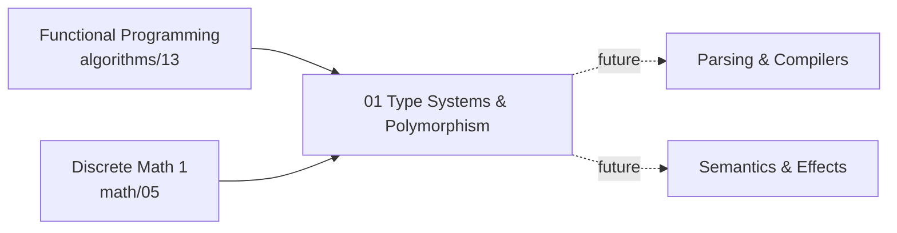

# Programming Languages

The theory beneath the languages you already use: what a type is, how a compiler *infers* one with no annotations, and why "generics," "interfaces," and "subclassing" are four different answers to one question. The formal-methods view of everyday code.

> **Prerequisites**: [Discrete Math 1](../math/05-discrete-math-1/) (proofs, induction, relations) and [Functional Programming](../algorithms/13-functional-programming/) (the lambda calculus and recursion). Some experience in a statically-typed language helps but is not required.

## Why this track exists

Most engineers use a type system every day and have never seen the one-line theorem it exists to satisfy (**soundness = progress + preservation**), nor the algorithm that infers `a -> a` for `\x. x` with no help (**Algorithm W**). That gap is why "should this be a generic or an interface?", "why isn't `List<Dog>` a `List<Animal>`?", and "why does Go have no higher-kinded types?" feel like folklore instead of consequences.

This track treats programming languages as a **subject with a theory**, not a set of syntaxes to memorize. It leads with the math — the lambda-calculus ladder (STLC → System F → Hindley–Milner), unification, variance — and then shows the *same* concept implemented across type systems that made different trade-offs: structural (TypeScript, Go), nominal (Rust, Haskell, OCaml), inferred (the whole ML family). Every topic ships a `code/` folder where the math is literally the implementation — including a from-scratch HM type inferencer you can run.

## Prerequisite Graph

## Topics

| # | Topic | Primary Reference | Time |
|---|-------|------------------|------|
| 01 | [Type Systems & Polymorphism](01-type-systems/) | [*Types and Programming Languages* (Pierce)](https://www.cis.upenn.edu/~bcpierce/tapl/) + [PLFA](https://plfa.github.io/) (free) | 2-3 weeks |

Future topics (parsing & compilers, operational/denotational semantics, effect systems) build on 01.

## Quick Start

1. **"Generics vs interfaces" always feels fuzzy?** Start at [01 Type Systems](01-type-systems/) — the Strachey/Cardelli taxonomy names the four kinds of polymorphism and the confusion evaporates.
2. **Want the math made executable?** Run [`01-type-systems/code/hindley_milner.py`](01-type-systems/code/hindley_milner.py) — full Hindley–Milner inference (Algorithm W) in ~250 lines, inferring principal types with zero annotations and firing the occurs check.
3. **Polyglot engineer?** The same `Shape`/`Stack`/`largest` example is implemented in TypeScript, Go, Rust, Haskell, and OCaml — read them side by side to see one concept, five mechanisms.
4. **Interviewing at an OCaml/Haskell/Rust shop?** 01 covers HM inference, typeclasses/traits, variance, and "make illegal states unrepresentable" — the recurring themes.
5. **Pairs well with** [Functional Programming](../algorithms/13-functional-programming/) (the untyped calculus this types) and [Software Craftsmanship](../software-craftsmanship/) (types as a design tool).

See [Study Plan](../STUDY-PLAN.md) for the schedule.
