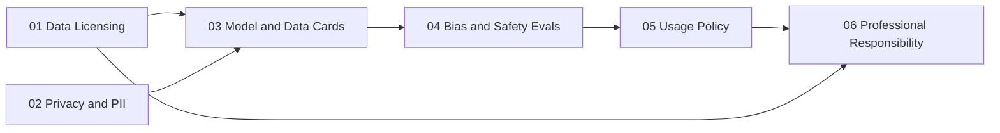

# Responsible AI

The obligations that come with training and serving a model: where the data came from and whether you may use it, what personal data it holds, what the model can and cannot do, how it fails different groups, what you let people use it for, and what you owe when something goes wrong. Every topic is applied to the system you build in the [course](../paths/course/), so the artifacts are real: a licensing ledger, a PII policy, a model card, safety evals, a usage policy enforced at your gateway, and a disclosure you write.

> **Prerequisites**: none for the reading. The course modules assume the system they apply to: the [corpus pipeline](../data-engineering/05-corpus-pipeline/) for 01 and 02, the capstone model for 03 and 04, the [gateway](../ai-platform-engineering/12-gateway/) for 05.

## Prerequisite Graph

## Topics

| # | Topic | Primary Reference | Time |
|---|-------|------------------|------|
| 01 | [Data Licensing](01-data-licensing/) | [SPDX License List](https://spdx.org/licenses/) (free) + Longpre et al., [Data Provenance Initiative](https://arxiv.org/abs/2310.16787) (free) | course Pass 3 |
| 02 | [Privacy and PII](02-privacy-and-pii/) | [NIST Privacy Framework](https://www.nist.gov/privacy-framework) (free) + Carlini et al., [*Extracting Training Data from LLMs*](https://arxiv.org/abs/2012.07805) (free) | course Pass 3 |
| 03 | [Model and Data Cards](03-model-and-data-cards/) | Mitchell et al., [*Model Cards*](https://arxiv.org/abs/1810.03993) + Gebru et al., [*Datasheets for Datasets*](https://arxiv.org/abs/1803.09010) (free) | course Pass 9 |
| 04 | [Bias and Safety Evals](04-bias-and-safety-evals/) | Parrish et al., [*BBQ*](https://arxiv.org/abs/2110.08193) + Gehman et al., [*RealToxicityPrompts*](https://arxiv.org/abs/2009.11462) (free) | course Pass 9 |
| 05 | [Usage Policy](05-usage-policy/) | [NIST AI RMF 1.0](https://www.nist.gov/itl/ai-risk-management-framework) + [OWASP Top 10 for LLM Applications](https://genai.owasp.org/llm-top-10/) (free) | course Pass 10 |
| 06 | [Professional Responsibility](06-professional-responsibility/) | [ACM Code of Ethics](https://www.acm.org/code-of-ethics) + CERT, [*Guide to Coordinated Vulnerability Disclosure*](https://certcc.github.io/CERT-Guide-to-CVD/) (free) | course Pass 11 |

## Quick Start

1. **Building the course system?** Follow [the course path](../paths/course/): each topic's module (`ethics.01` to `ethics.06`) sits where your system first needs it.
2. **Shipping a model at work?** Start with 03: write the model card and datasheet first, and the gaps they expose tell you which other topic to read.
3. **Running an LLM API?** 05 then 02: decide what you refuse and what you log before your first customer.
4. **Reporting a flaw in someone else's system, or yours?** 06.

See [Study Plan](../STUDY-PLAN.md) for the schedule.
