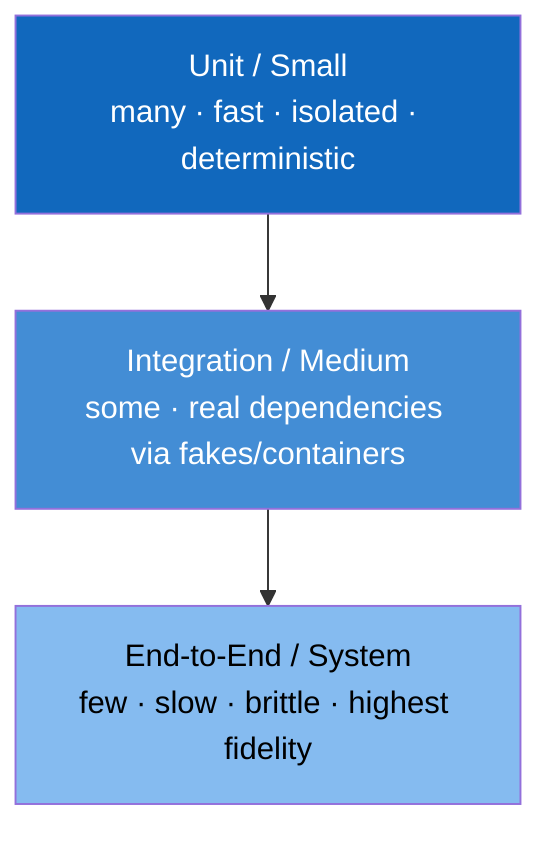

# The Testing Mentality

## Overview

- **Primary references**:
  - [*SWE at Google* -- Testing chapters (11-14)](https://abseil.io/resources/swe-book) -- free, testing at scale
  - [Google Testing Blog / Testing on the Toilet](https://testing.googleblog.com/) -- free, one-page lessons
- **Supplementary**: [Hypothesis docs](https://hypothesis.readthedocs.io/) (property-based testing), [Principles of Chaos Engineering](https://principlesofchaos.org/) (free), Martin Fowler on [Contract Tests](https://martinfowler.com/bliki/ContractTest.html) (free), [*Foundations of Software Testing* notes]
- **Prerequisites**: [Software Engineering at Google](../02-swe-at-google/) (the testing chapters), [Documentation & Technical Writing](../06-documentation-writing/) (tests are executable documentation)
- **Estimated time**: 1 week at 4-6 hrs/week

## Key Takeaways

- **Testing is a mentality, not a phase.** It's the habit of treating every claim -- about code, infra, docs, data, or a teammate's assumption -- as a hypothesis you can cheaply falsify.
- **The goal is confidence per unit cost.** Many fast, isolated tests; few slow, broad ones. Shape the pyramid, not an ice-cream cone.
- **Test behavior, not implementation.** A test that breaks when you refactor (without changing behavior) is a liability, not an asset.
- **In production, testing continues** -- monitoring, canaries, and chaos experiments are tests you run against the real system.

## How to Study

- Read four *Testing on the Toilet* posts; each is a 5-minute mental model.
- Take one function with example-based tests and add a property-based test. Watch it find an edge case you didn't think of.
- For a system you run: write the *failure hypothesis* you're most afraid of, then design the smallest experiment that would confirm or refute it.

---

# Concepts & Techniques

## Core Insight

A test is a **falsifiable claim plus a cheap experiment that tries to break it**. The "testing mentality" generalizes that beyond unit tests: a type signature tests a claim about shapes; a code review tests a claim about readability; an alert tests a claim about health; a canary tests a claim about a release; an ADR's "Consequences" section tests a claim about the future. Engineers with the mentality reflexively ask, *"what would prove this wrong, and how cheaply can I find out?"* -- and they ask it about their own beliefs first.

## 1. The test pyramid (shape your confidence by cost)



- **Small (unit)** -- no I/O, no clock, no network; milliseconds; run on every save. Most of your tests.
- **Medium (integration)** -- real dependencies via fakes or [Testcontainers](https://testcontainers.com/) (a real Kafka/Postgres in Docker); seconds.
- **Large (E2E)** -- the whole system; minutes; flaky by nature, so keep few and treat flakes as bugs.

**Anti-pattern -- the ice-cream cone:** mostly E2E tests, few unit tests. Slow, flaky, and they tell you *something* broke without telling you *what*. Invert it.

## 2. Test behavior, not implementation

The single highest-leverage rule. A good test states *what the code promises*, so it survives refactoring and fails only on real regressions.

```python
# BAD -- couples to implementation. Refactoring the cache breaks this test
#        even though behavior is unchanged.
def test_calls_redis_setnx_once():
    worker.process(msg)
    redis_mock.setnx.assert_called_once()

# GOOD -- asserts the promise: a duplicate message is processed exactly once.
def test_duplicate_message_processed_once():
    worker.process(msg); worker.process(msg)          # same message twice
    assert db.count(order_id=msg.order_id) == 1        # observable behavior
```

This is **Hyrum's Law** turned to your advantage: depend only on the contract you intend to keep.

## 3. Test doubles: fakes > mocks

| Double | What it is | Google's stance |
|--------|-----------|-----------------|
| **Fake** | A working lightweight impl (in-memory DB, in-memory Kafka) | **Preferred** -- behaves correctly, tests survive refactors |
| **Stub** | Returns canned answers | Fine for simple inputs |
| **Mock** | Asserts *how* it was called | Use sparingly -- mock-heavy tests are brittle and test implementation |

Mock-heavy suites are the most common reason a test breaks during a no-op refactor. Reach for a fake first.

## 4. Beyond example-based tests

- **Property-based testing** -- assert *invariants* over generated inputs (`Hypothesis`, `proptest`, `QuickCheck`). E.g. "encode then decode returns the original," "the consumer never skips an offset." Finds the edge cases you'd never enumerate by hand.
- **Fuzzing** -- feed random/adversarial bytes to parsers and decoders; the bug class behind a huge share of CVEs. `cargo fuzz`, `go test -fuzz`, libFuzzer.
- **Golden / snapshot tests** -- pin a complex output (a rendered diagram, an API response) and diff future runs. Cheap regression net for serializers and generators.
- **Contract tests** -- the producer and consumer of an API each test against a shared contract, so a breaking change is caught in CI rather than in production (Pact, schema registries for Kafka).

## 5. Testing things that aren't application code

The mentality applies everywhere knowledge can be wrong:

- **Infrastructure** -- `terraform plan` in CI, `kubeconform`/`kubeval` to validate manifests, policy tests (OPA/Conftest) for "no container runs as root." A misconfigured manifest is a bug.
- **Data** -- pipeline tests with [Great Expectations](https://greatexpectations.io/) / dbt tests: "no nulls in `order_id`," "row count within 3σ of yesterday." Bad data is a production incident.
- **Documentation** -- run the code samples ([Documentation & Technical Writing](../06-documentation-writing/)). An example that doesn't compile is a failing test.
- **Diagrams** -- `d2 *.d2` in CI fails if a diagram no longer compiles ([Diagramming & the C4 Model](../05-diagramming-c4/)).

## 6. Testing in production (because you already are)

You cannot fully reproduce production, so test *against* it deliberately rather than pretending staging is enough:

- **Canary / progressive rollout** -- ship to 1% of traffic, watch the metrics, then ramp. A controlled experiment on the real system.
- **Synthetic monitoring** -- a bot continuously exercises the critical path; the first to know is you, not the customer.
- **Chaos engineering** -- inject failure (kill a pod, add latency, partition the network) to test the hypothesis "the system tolerates this." Start with a small blast radius and a defined steady-state metric.
- **SLOs and error budgets** -- the SLO is a *testable claim* about reliability; burning the error budget is the test failing in slow motion (see [Observability](../../systems/04-observability/)).

## Technique Catalog

| Technique | When to apply |
|-----------|---------------|
| Shape the test pyramid | Designing any service's test strategy |
| Test behavior, not implementation | Every test you write |
| Prefer fakes over mocks | Any test needing a dependency |
| Property-based testing | Encoders, parsers, invariant-heavy logic |
| Fuzzing | Any code that parses untrusted input |
| Contract tests | Any producer/consumer or service boundary |
| Manifest/policy tests | Any IaC or Kubernetes change |
| Data quality tests | Any data pipeline |
| Canary + synthetic monitoring | Every production release |
| Chaos experiments | Systems claiming resilience -- prove it |

## The course testing ladder

In the course this topic hosts the testing ladder: one practice module per rung, each placed in the pass where your system first needs that kind of test. Your own tests are graded by mutation testing (what they catch, course principle P10), so each rung is practised on the system you are building, not on toy code.

| Module | Topic | Kind | Pass |
|---|---|---|---|
| `craft.03` | TDD, unit tests, and how you are graded (rungs R0 to R3): includes the mutation-testing primer (what a mutant is, killed vs survived, how the score and required semantic mutants work) before the first mutation grade | practice | 2 |
| `craft.04` | Property-based tests (R4) with Hypothesis, proptest, `rapid`, and `ss_prop.h` | practice | 3 |
| `craft.07` | Mutation testing in depth: equivalent mutants, semantic mutants from pitfalls, reading survivors | practice | 4 |
| `craft.05` | Oracles, golden and differential tests, gradcheck as a test (R5) | practice | 5 |
| `craft.06` | Benchmarks and perf gates (R7) | practice | 6 |
| `craft.20` | Contract tests (R6): consumer-driven tests for gateway to engine | practice | 7 |
| `craft.21` | Resilience tests (R10) | practice | 8 |
| `craft.22` | Model evals as tests (R8) | practice | 9 |
| `craft.23` | Agent evals as tests (R9) | practice | 10 |

## Chapters

<!-- ss:chapters -->
No chapters yet: they arrive with authoring batch B3 (craft.03), B4 (craft.04), B6 (craft.07), B7 (craft.05), B8 (craft.06), B9 (craft.20), B10 (craft.21), B11 (craft.22), and B12 (craft.23) (course/DESIGN.md 9). `ss lint --fix-index` then fills this table from the registry.
<!-- /ss:chapters -->

## Connections to Other Tracks

| Concept | Connected Track | How |
|---------|-----------------|-----|
| Test pyramid, fakes, Hyrum's Law | [Software Engineering at Google](../02-swe-at-google/) | Google's testing chapters are the source |
| Property-based & fuzz testing | [Algorithms](../../algorithms/) | Invariants are properties of the algorithm |
| Canary, SLOs, chaos | [Observability](../../systems/04-observability/) | You test in prod through telemetry |
| Data quality tests | [Orchestration & Modeling](../../data-engineering/04-orchestration-modeling/) | dbt tests gate the pipeline |
| Manifest/policy tests | [Containers, Kubernetes & Workloads](../../infrastructure/01-containers-kubernetes/) | Validate YAML before it reaches the cluster |

## Company Relevance

| Company | How This Appears | Focus |
|---------|-----------------|-------|
| Google | Testing on the Toilet, fakes-first, presubmit testing | Testing at scale |
| Netflix | Invented chaos engineering (Chaos Monkey) | Resilience by experiment |
| Amazon | Operational readiness reviews, canary deploys | Test in prod safely |
| Anthropic | Rigorous evals + safety testing of models and systems | Falsify before shipping |
| Any Staff+ role | You set the team's testing bar and quality culture | Mentality, not coverage % |
