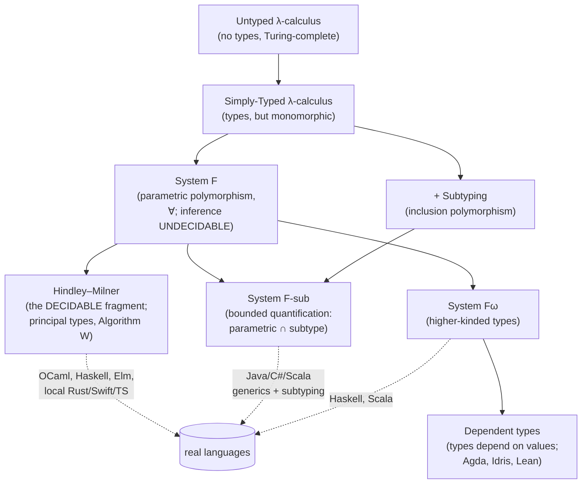

# Type Systems & Polymorphism

## Overview

- **Primary references**:
  - [*Types and Programming Languages* (Pierce)](https://www.cis.upenn.edu/~bcpierce/tapl/) — the definitive textbook; the lambda calculus → STLC → System F → subtyping progression this topic follows. (Book is paid; Pierce's [course slides](https://www.cis.upenn.edu/~bcpierce/tapl/) and the companion [Software Foundations](https://softwarefoundations.cis.upenn.edu/) are free.)
  - [*Programming Language Foundations in Agda* (Wadler, Kokke, Siek)](https://plfa.github.io/) (free, full text) — STLC, type soundness, and inference, mechanized so the proofs run.
  - [*Software Foundations* Vol. 2: *Programming Language Foundations*](https://softwarefoundations.cis.upenn.edu/plf-current/) (free) — progress, preservation, and subtyping in Coq.
- **Supplementary**: [Cardelli & Wegner, *On Understanding Types, Data Abstraction, and Polymorphism*](https://dl.acm.org/doi/10.1145/6041.6042) (free PDF widely mirrored) — the paper that names the polymorphism taxonomy; [Damas & Milner, *Principal type-schemes for functional programs*](https://dl.acm.org/doi/10.1145/582153.582176) (free) — Algorithm W; [Wadler, *Theorems for Free!*](https://homepages.inf.ed.ac.uk/wadler/papers/free/free.pdf) (free) — parametricity; [Wadler & Blott, *How to make ad-hoc polymorphism less ad hoc*](https://people.csail.mit.edu/dnj/teaching/6898/papers/wadler88.pdf) (free) — typeclasses; the [TypeScript Handbook](https://www.typescriptlang.org/docs/handbook/intro.html), [Go Generics tutorial](https://go.dev/doc/tutorial/generics), and [Rust Book Ch. 10](https://doc.rust-lang.org/book/ch10-00-generics.html) (all free).
- **Prerequisites**: [Discrete Math 1](../../math/05-discrete-math-1/) (proofs, induction, relations) and [Functional Programming](../../archive/algorithms/13-functional-programming/) (lambda calculus, recursion). Comfort reading inference rules helps but is taught here.
- **Estimated time**: 2–3 weeks at 8–10 hrs/week

## Key Takeaways

- **A type system is a lightweight formal method** — a decidable, syntactic proof system that rejects a class of programs *before they run*. Its correctness guarantee has a precise name: **soundness = progress + preservation** ("well-typed programs don't get stuck"). Everything else is engineering around that one theorem.
- **Polymorphism is one word for four different mechanisms.** Strachey split it into *parametric* (one body, every type) and *ad-hoc* (a different body per type); Cardelli & Wegner added *subtype* (inclusion) and *coercion*; *bounded* quantification is parametric ∩ subtype. Naming which one you mean dissolves most "generics vs interfaces" confusion.
- **System F is the theory; Hindley–Milner is the decidable slice you can actually infer.** Full polymorphic-type inference (System F) is undecidable; HM is the carefully chosen fragment where `let`-generalization gives every term a unique **principal type** with *zero annotations*. OCaml, Haskell, Elm, and the local parts of Rust/Swift/TS inference are all HM descendants. [`hindley_milner.py`](code/hindley_milner.py) is the whole algorithm in ~250 lines.
- **Variance is the rule everyone gets wrong.** `List<Dog>` is *not* automatically a `List<Animal>`. Functions are **contravariant** in their argument and **covariant** in their result — the one counterintuitive law that explains Java's broken array covariance, C#'s `in`/`out`, and TypeScript's `strictFunctionTypes`.
- **"Generics" cost different things in different languages because of *how* they compile.** Monomorphization (Rust, C++, Go-for-non-pointers) stamps a copy per type — fast, bigger binary. Erasure (Java, pre-generics Go would-be) keeps one boxed copy — smaller, slower, lossy at runtime. Dictionary passing / GC-shape stenciling (Haskell, Go-for-pointers) is the middle path. The *same* generic function has three different runtime stories.
- **Structural vs nominal typing is a design axis, not a quality axis.** TypeScript and Go interfaces match on *shape*; Rust, Haskell, Java, and Scala match on *declared name*. Structural is flexible and great for gradual adoption; nominal makes intent explicit and catches "accidentally compatible" bugs.

## How to Study

- Run the keystone first: [`code/hindley_milner.py`](code/hindley_milner.py) infers principal types for `\x.x`, `\f.\g.\x. f (g x)`, and `let id = \x.x in id id` with **no annotations**, then shows the **occurs check** rejecting `\x. x x`. Read `unify`, `instantiate`, and `generalize` — that triple *is* ML type inference. Then open [`code/inference.ml`](code/inference.ml) and watch OCaml infer the *exact same* principal types from the user's side.
- Walk the polymorphism taxonomy across one running example (a `Shape` with `area`, a generic `Stack<T>`, a `largest`/`Max` over ordered things) in four type systems that make different choices:
  - [`code/polymorphism.ts`](code/polymorphism.ts) — **structural**, gradual, with type-level computation (`DeepReadonly`) and explicit variance.
  - [`code/generics.go`](code/generics.go) — **nominal-ish**, the type-set constraint model unique to Go, GC-shape stenciling.
  - [`code/traits.rs`](code/traits.rs) — **nominal**, the static (`<T: Trait>`, monomorphized) vs dynamic (`dyn Trait`, vtable) dispatch split.
  - [`code/typeclasses.hs`](code/typeclasses.hs) — **nominal**, typeclasses as dictionary passing, plus higher-kinded `Functor`.
- All six print the same shape of output (`area`s, a `Stack`, a `largest`). Run them side by side and notice the *concept* is identical while the *mechanism* differs — that is the whole point of the topic.
- To feel variance: in [`code/polymorphism.ts`](code/polymorphism.ts), uncomment the `const bad:` line and watch the compiler reject assigning a `Consumer<Dog>` where a `Consumer<Animal>` is wanted. That single error is the contravariance rule defending you.
- To feel the implementation cost: in [`code/traits.rs`](code/traits.rs), compare `total_area<T: Shape>` (monomorphized, one copy per type) with `describe_all(&[Box<dyn Shape>])` (one copy, vtable dispatch). Same trait, two runtime models.

---

# Concepts & Techniques

## Core Insight

A type system assigns to each expression a **type** — a conservative, decidable over-approximation of the values it can produce — and rejects any program where the types don't line up. "Conservative" is the price: a sound type checker will reject *some* programs that would have run fine, in exchange for *never* accepting one that goes wrong (`progress`), and *never* changing an expression's type as it evaluates (`preservation`). Polymorphism is the machinery that buys back expressiveness *without* losing that guarantee — letting one piece of code serve many types. The deepest result in the area, the **Curry–Howard correspondence**, says this is not a metaphor: types *are* propositions and well-typed programs *are* their proofs, so a type checker is a proof checker.

The lineage of polymorphic type systems is a lattice of "how much power, how much decidability":

The practical languages live where the dotted lines land: they pick a point on this lattice that trades theoretical power for an inference algorithm that terminates and error messages a human can read.

## 1. What a Type System *Is*: Judgments, Soundness, Curry–Howard

**The math the rest of the topic stands on**

A type system is defined by a **typing judgment** `Γ ⊢ e : τ` — "in context Γ (a map from variables to types), expression `e` has type `τ`" — and a set of **inference rules** that derive judgments. Type *checking* is searching for a derivation; type *inference* is searching for both the derivation *and* the τ.

**Key ideas**:
- **Inference rules read bottom-up.** The application rule is the one to memorize: `Γ ⊢ f : σ→τ` and `Γ ⊢ x : σ` together give `Γ ⊢ f x : τ`. Unification (Section 5) is what makes the two `σ`s meet.
- **Soundness = Progress + Preservation** (Wright & Felleisen, "syntactic approach"). *Progress*: a well-typed term is either a value or can take a step (it's not *stuck*). *Preservation* (subject reduction): if `e : τ` and `e → e'`, then `e' : τ` (evaluation doesn't change the type). Together: "well-typed programs don't go wrong." This is the theorem a language designer must prove; a *soundness bug* (Java array covariance, TS's `any`) is a place the proof has a hole.
- **Decidability is not free.** Type checking System F is decidable but inference is *not* (Wells, 1994). Every real ML-family language picks a fragment (HM) or adds annotations precisely to dodge undecidability.
- **Curry–Howard**: types ↔ propositions, programs ↔ proofs, evaluation ↔ proof simplification. `A → B` is implication; a pair type is conjunction; a sum type is disjunction; the uninhabited type (`never`, `Void`) is falsehood. This is why dependently-typed languages (Agda, Lean) double as proof assistants — and why `\x.x : a -> a` is also a proof that `A ⟹ A`.

## 2. The Polymorphism Taxonomy (Strachey → Cardelli–Wegner)

**Four mechanisms hiding under one word**

Christopher Strachey (1967) drew the first line; Cardelli & Wegner (1985) completed the picture. Getting the vocabulary right is most of the battle.

**Key ideas**:
- **Parametric polymorphism** — *one* implementation that works uniformly for every type, because it cannot inspect the type. `identity<T>(x: T): T`, `List<T>`, `map`. Reynolds' **parametricity** / Wadler's "theorems for free" says the type alone constrains the behavior: anything of type `∀a. a → a` *must* be the identity. This is the polymorphism of generics, System F, and HM.
- **Ad-hoc polymorphism** — a *different* implementation per type, selected by the types involved. Two flavors: **overloading** (`+` on ints vs strings) and **typeclasses/traits/interfaces** (Haskell `Show`, Rust `Display`, Go method sets). The dispatch is what differs (Section 6).
- **Subtype (inclusion) polymorphism** — code written for type `T` also accepts any subtype `S <: T` (Liskov substitution). The polymorphism of OOP and of `dyn Trait` / `Box<dyn>`.
- **Coercion polymorphism** — implicit conversion (`int` → `float`), the weakest form; often considered a footnote.
- **Bounded quantification** = parametric ∩ subtype: "for all `T` *such that* `T <: Bound`." `<T extends Comparable>` (Java), `T: Ord` (Rust), a constraint interface (Go), `Shape a =>` (Haskell). It is the workhorse of real generic code and the subject of **System F-sub**.

See all four side by side: [`code/polymorphism.ts`](code/polymorphism.ts) labels them 1–5; the *same* four appear in every other code file.

## 3. The λ-Calculus Ladder: STLC → System F

**Where parametric polymorphism comes from**

**Key ideas**:
- **Simply-Typed Lambda Calculus (STLC)** adds types to the λ-calculus and immediately loses Turing-completeness (every well-typed term halts — *strong normalization*). It is **monomorphic**: an identity function must be written separately at each type. That limitation is the entire motivation for what follows.
- **System F** (Girard 1972 / Reynolds 1974, the *polymorphic* or *second-order* λ-calculus) adds **type abstraction** `Λα. e` and **type application** `e [τ]`. Now `id = Λα. λ(x:α). x : ∀α. α→α` is a *single* term usable at every type. This is exactly parametric polymorphism; `Stack<T>` is its data-type form.
- **The catch**: System F type *inference* is undecidable. You can *check* an annotated System F program, but you cannot in general *recover* the `Λ`s and `[τ]`s. Languages that expose full System F (Haskell with `RankNTypes`, Scala) require annotations at the hard spots.
- **System Fω** adds **type-level functions** (operators that take types to types), giving **higher-kinded types** — abstraction over type *constructors* like `Functor f` (Section 7).

## 4. Hindley–Milner: The Decidable Sweet Spot

**The math made executable — this is the keystone**

HM (Hindley 1969, Milner 1978, Damas–Milner 1982) is the restriction of System F where polymorphism is introduced *only* at `let` and quantifiers stay on the outside (**prenex**, rank-1). That restriction is exactly enough to make inference decidable *and* give every term a unique best type.

**Key ideas**:
- **Principal types**: every typeable HM term has a single most-general type that all its other types are instances of. `\f.\g.\x. f (g x)` has principal type `(a → b) → (c → a) → c → b`; everything else it can be used at is a specialization.
- **Algorithm W**: a recursive walk that threads a **substitution** and, at each node, generates fresh type variables and **unifies**. Four pieces: `unify` (solve `τ₁ = τ₂`), `instantiate` (give each *use* of a scheme fresh variables), `generalize` (close a monotype into a `∀`-scheme at a `let`), and the inference walk itself.
- **`let`-generalization is the whole trick**: a lambda parameter stays monomorphic (you don't yet know how it's used), but a `let`-bound value is **generalized** so it can be reused at many types — which is why `let id = \x.x in (id 1, id "a")` typechecks but `(\id. (id 1, id "a")) (\x.x)` does not.
- **The value restriction**: with mutable references, naive generalization is *unsound* (you could store an `int` and read it as a `string`). ML restricts generalization to syntactic values — the small, famous patch that keeps HM + mutation sound.

[`code/hindley_milner.py`](code/hindley_milner.py) is Algorithm W end to end; [`code/inference.ml`](code/inference.ml) shows OCaml inferring the same principal types in real code. Read them together: one *is* the inference engine, the other *uses* it.

## 5. Unification & the Occurs Check

**The engine inside every ML-family compiler**

Inference reduces to solving equations between types. **Unification** (Robinson 1965) finds the **most general unifier** — the least-committal substitution making two types equal.

**Key ideas**:
- **The algorithm**: to unify `τ₁` and `τ₂` — if either is a variable `α`, bind `α := other`; if both are arrows, unify arguments then (under that substitution) results; if both are the same constructor, succeed; otherwise fail with a type error.
- **The occurs check**: before binding `α := τ`, verify `α` does not occur *inside* `τ`. Without it, `\x. x x` would unify `α = α → β` and build the **infinite type** `α = α → α → …`. The check is what keeps types finite — and what produces the classic "occurs check: cannot construct the infinite type" error. [`code/hindley_milner.py`](code/hindley_milner.py) triggers it on `\x. x x`.
- **Type errors are unification failures**, which is why ML error messages point at "expected `int`, got `string`": two ends of a constraint that couldn't be made equal. The *location* blamed is an artifact of traversal order — the reason HM error messages are famously sometimes-misleading.

## 6. Ad-hoc Polymorphism: Typeclasses, Traits, Interfaces

**Same dispatch problem, four answers**

How does `area(shape)` find the *right* body for each type? The answer defines a language's flavor.

**Key ideas**:
- **Typeclasses (Haskell)** — Wadler & Blott's "dictionary passing": `class Shape a where area :: a -> Double` desugars to an extra hidden argument, a record of method implementations (the *dictionary*) that the compiler infers and threads through. `Shape a => ...` is a constraint that says "I need this dictionary." Resolved fully at compile time, by type.
- **Traits (Rust)** — typeclasses with a performance contract: `impl Shape for Circle` is nominal and explicit; `<T: Shape>` monomorphizes (static dispatch, no dictionary at runtime), while `dyn Shape` uses a vtable (dynamic dispatch). [`code/traits.rs`](code/traits.rs) shows both.
- **Interfaces (Go)** — *structural*: a type satisfies `Shape` simply by having `Area() float64`, no declaration. Go generics add **type sets** — a constraint interface can enumerate a *union of concrete types* (`~int | ~float64`), so `Sum[T Numeric]` can use `+` without method dispatch. That type-set design is unique to Go; see [`code/generics.go`](code/generics.go).
- **Coherence** — typeclasses enforce *one* instance per (class, type) globally so `Set`-like code can't see two different `Ord`s; Rust's "orphan rule" is the same concern. Go/Java interfaces don't guarantee this, which is more flexible and less safe.

## 7. Subtyping, Variance & Structural vs Nominal

**The rules that decide when `Container` fits `Container<Super>`**

**Key ideas**:
- **Subtyping** `S <: T` means "an `S` is usable wherever a `T` is expected." Records/objects subtype by **width** (more fields is a subtype) and **depth** (fields subtype pointwise). Function subtyping is the famous rule below.
- **Variance** answers: given `Dog <: Animal`, how do `F<Dog>` and `F<Animal>` relate?
  - **Covariant** (preserves direction): a `Producer<Dog>` *is* a `Producer<Animal>` — outputs only. Immutable containers, return types.
  - **Contravariant** (reverses): a `Consumer<Animal>` *is* a `Consumer<Dog>` — inputs only. Function parameters.
  - **Invariant** (neither): mutable `Array<Dog>` is *not* `Array<Animal>` (you could store a `Cat` through the `Animal` view). Mutability forces invariance.
  - **The function rule**: `(A → B) <: (A' → B')` iff `A' <: A` (contravariant arg) **and** `B <: B'` (covariant result). [`code/polymorphism.ts`](code/polymorphism.ts) demonstrates and defends it.
- **Declaration-site** (C# `in`/`out`, Scala `+T`/`-T`, Kotlin) vs **use-site** (Java `? extends` / `? super`) variance — *where* you annotate the variance.
- **The famous soundness holes**: Java/C# **arrays are covariant but mutable**, so `Object[] a = new String[1]; a[0] = 1;` compiles and throws `ArrayStoreException` *at runtime* — a deliberate hole in the type system. TypeScript's `any` and bivariant method parameters are similar pragmatic compromises.
- **Structural vs nominal**: TypeScript/Go match types by **shape**; Rust/Haskell/Java/Scala match by **declared name**. Structural enables gradual typing and "just have the right fields"; nominal prevents *accidental* compatibility (two unrelated `Meters` and `Feet` with the same shape stay distinct).

## 8. Higher-Kinded, Associated, Dependent: The Frontier

**Where the type system keeps climbing**

**Key ideas**:
- **Higher-kinded types (HKTs)** abstract over type *constructors*, not just types: `Functor f` works for `f = Maybe`, `f = []`, `f = Tree` — anything of kind `* → *`. Haskell and Scala have them natively ([`code/typeclasses.hs`](code/typeclasses.hs) defines `Functor Tree`); Rust approximates with GATs; Go and Java cannot express them.
- **Associated types** (Rust `type Item;`, Haskell type families) let a trait fix *one* related type per impl, instead of the caller choosing a parameter — `Iterator::Item` is the canonical example ([`code/traits.rs`](code/traits.rs)).
- **GADTs** (generalized algebraic data types) let each constructor refine the result type, encoding invariants like a *well-typed* AST that can't represent `if 3 then …`.
- **Dependent types** (Agda, Idris, Lean) let types mention *values* — `Vec n a`, a list whose length is in its type — collapsing the Curry–Howard correspondence into a single language where you write programs and prove theorems with the same syntax. The top of the ladder; the price is that inference needs help and type checking can require proof search.

## 9. How Generics Compile: Monomorphization vs Erasure vs Dictionaries

**Why the same feature has three different runtime costs**

**Key ideas**:
- **Monomorphization** (Rust, C++ templates, Go for non-pointer types): emit a specialized copy per concrete type. *Fast* (direct calls, inlinable, no boxing) but *code bloat* and slower compiles. C++ templates are monomorphization with duck typing and notoriously long errors.
- **Type erasure** (Java, Scala on the JVM): one copy; type parameters vanish at runtime (`List<String>` and `List<Integer>` are the same class), values are **boxed**. *Small* and binary-compatible, but you lose types at runtime (`new T[]` is illegal; reflection can't see them) and pay boxing cost.
- **Dictionary passing / GC-shape stenciling** (Haskell; Go for pointer-shaped types): one copy parameterized by a runtime record of operations (the dictionary) or shared across types with the same memory layout. The middle path — modest code size, some indirection.
- **The takeaway for engineers**: "does this language have generics" is the wrong question; "*how* are they implemented" predicts your binary size, startup, inlining, and whether you can introspect types at runtime. [`code/generics.go`](code/generics.go) and [`code/traits.rs`](code/traits.rs) make the static-vs-dynamic choice explicit.

## Polymorphism Mechanisms at a Glance

| Mechanism | One body or many? | Dispatch | Theory | TS | Go | Rust | Haskell/OCaml |
|-----------|-------------------|----------|--------|----|----|------|---------------|
| **Parametric** | one | none (uniform) | System F / HM | `<T>` generics | `[T any]` | `<T>` | `'a` / type vars |
| **Ad-hoc (overload)** | many | by static type | — | overloads | — (no overloading) | — | class methods |
| **Ad-hoc (class/trait)** | many | compile-time, by type | qualified types | structural iface | method-set iface + type sets | `trait` (static) | typeclass (dict) |
| **Subtype** | one (+ overrides) | runtime (vtable) | F-sub / `S<:T` | structural `<:` | `interface` value | `dyn Trait` | subtyping (limited) / variants |
| **Bounded** | one | compile-time | System F-sub | `<T extends C>` | `[T Constraint]` | `<T: Trait>` | `(C a) =>` / module sig |
| **Coercion** | n/a | implicit | — | limited | explicit only | explicit (`as`/`From`) | explicit |

## Type-System Design Choices by Language

| Language | Nominal / Structural | Inference | Generics compile to | Variance | Notable |
|----------|----------------------|-----------|---------------------|----------|---------|
| **TypeScript** | structural | local + `infer` (HM-ish) | erased to JS (none at runtime) | covariant by default, `strictFunctionTypes` for params | type-level computation, `any` escape hatch (unsound) |
| **Go** | structural interfaces | local only | GC-shape stenciling + dictionaries | invariant | type sets / unions, no HKT, no overloading |
| **Rust** | nominal traits | local (HM-style) | monomorphization (+ `dyn` vtables) | declared via lifetimes/variance | ownership in the types, associated types, GATs |
| **Haskell** | nominal | full HM + extensions | dictionary passing | role-based | typeclasses, HKT, GADTs, laziness |
| **OCaml** | nominal + structural objects | full HM | mostly uniform (boxed) + flambda | declared (`+`/`-`) | modules & functors, polymorphic variants |
| **Java/C#** | nominal | local (`var`/`<>`) | erasure (Java) / reified (C#) | use-site (Java) / declaration-site (C#) | array covariance hole, bounded wildcards |
| **Scala** | nominal | local + implicits | erasure (JVM) | declaration-site `+T`/`-T` | HKT, implicits/givens, path-dependent types |

## In the course

This topic moved here from the former top-level Programming Languages track. It has no course module with a call site, so the course offers it as the optional side quest `sq.type-systems`: work through the inferencer in [`code/hindley_milner.py`](code/hindley_milner.py) and the five-language comparison after Pass 7, when you have written Python, C, Rust, and Go against the same contracts.

## Connections to Other Tracks

| Track / Topic | Connection |
|---------------|-----------|
| [Functional Programming](../../archive/algorithms/13-functional-programming/) | The λ-calculus, recursion, and `fold`/`map` this topic types are introduced there untyped — STLC is that calculus *with types*. |
| [Discrete Math 1](../../math/05-discrete-math-1/) | Inference rules, derivations, induction, and relations (`<:` is a partial order) are the proof machinery soundness is stated in. |
| [Software Craftsmanship](../) | "Make illegal states unrepresentable," design by contract, and orthogonality are type-system thinking applied to everyday code. |
| [Information Theory](../../math/11-information-theory/) | Curry–Howard's cousin, the Curry–Howard–Lambek correspondence, ties types to category theory; types are also a *compression* of a program's possible behaviors. |
| [LLM Systems](../../ml/04-llm-systems/) & [AI Platform Engineering](../../ai-platform-engineering/) | Typed schemas (protobuf, Pydantic, TS) are the contracts at every RPC and tool boundary; structured-output decoding is "make the model emit a well-typed value." |
| [Compilers / Parsing] *(future topic in this track)* | Type checking is the phase after parsing; GADTs type the very ASTs a parser produces. |

## Company Relevance

| Context | Why type systems show up |
|---------|--------------------------|
| **Jane Street, Citadel, other OCaml/Haskell shops** | OCaml is the house language at Jane Street; "make illegal states unrepresentable" via variants and modules is a core interview theme. HM inference, functors, and the value restriction are fair game. |
| **Rust-heavy infra (AWS, Cloudflare, Discord, Meta)** | Trait bounds, `dyn` vs generics, variance, and `Send`/`Sync` (marker traits) are daily design decisions and frequent interview material. |
| **Frontend / full-stack at scale (Stripe, Airbnb, Vercel)** | Advanced TypeScript — conditional/mapped types, variance, `strict` soundness gaps — gates large codebases; "type the API so misuse won't compile." |
| **Compiler / language / DevTools teams (Google, JetBrains, Anthropic tooling)** | Implementing inference, designing generics, and reasoning about soundness are the literal job; TAPL is effectively the reading list. |
| **Any large polyglot codebase** | Knowing *why* Go has no HKTs, *why* Java generics erase, and *why* `List<Dog>` isn't a `List<Animal>` prevents whole categories of design mistakes and "fighting the type checker" churn. |
