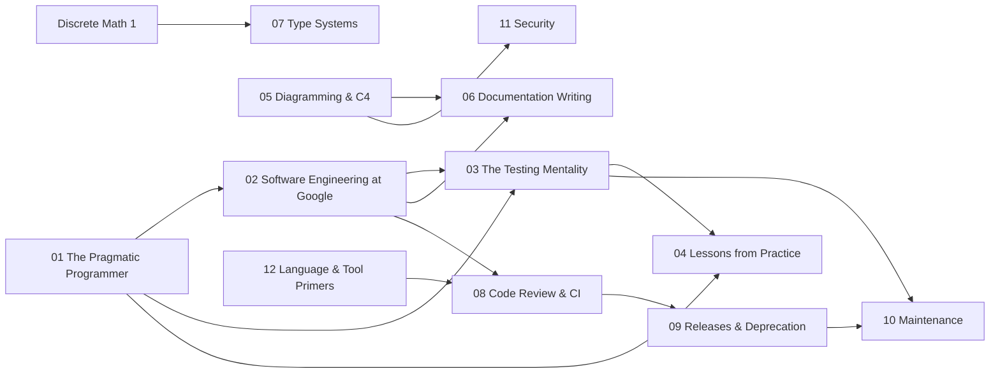

# Software Craftsmanship

The engineering practices, principles, and culture that separate senior/staff engineers from everyone else. How to write software that survives contact with reality, how to make a system legible to someone who was not there when it was built, and the type theory beneath the languages you use every day.

> **Prerequisites**: Some professional programming experience (this is a "how to think" track, not a "how to code" track). [07 Type Systems](07-type-systems/) also wants [Discrete Math 1](../math/05-discrete-math-1/) (proofs, induction, relations).

## Overview

- **Primary references**:
  - *The Pragmatic Programmer* by Hunt & Thomas (20th Anniversary Edition): individual craft
  - *Software Engineering at Google* by Winters, Manshreck, Wright, [free online](https://abseil.io/resources/swe-book): organizational craft at scale
  - [C4 model](https://c4model.com/) (free) and [Diátaxis](https://diataxis.fr/) (free): diagrams and documents as engineering artifacts
  - [*Types and Programming Languages*](https://www.cis.upenn.edu/~bcpierce/tapl/) (Pierce) and [PLFA](https://plfa.github.io/) (free): the theory of types
- **Supplementary**: *Clean Code* by Robert Martin, *A Philosophy of Software Design* by John Ousterhout, Martin Fowler's [Refactoring Catalog](https://refactoring.com/catalog/) (free), [Google Technical Writing](https://developers.google.com/tech-writing) (free), [D2](https://d2lang.com/) and [Mermaid](https://mermaid.js.org/) docs (free)
- **Estimated time**: 3-4 weeks at 6-8 hrs/week for 01 to 04; 1 week each for 05 and 06; 2-3 weeks for 07; the course practices (08 to 12) are paced by the [course](../paths/course/)

## Key Takeaways

- Good software is not about clever code: it is about managing complexity over time.
- The Pragmatic Programmer teaches individual craft; SWE at Google teaches organizational craft at scale.
- **Testing is a practice, not a phase**: tests, docs, and diagrams are first-class, executable specifications.
- **Legibility is a deliverable.** A diagram you can `git diff` beats a screenshot nobody can edit; a document checked against reality beats tribal knowledge. Both survive only when they are treated like source: co-located, reviewed in PRs, rendered and checked in CI.
- **Types are a theory, not a syntax.** Soundness is progress plus preservation; Algorithm W infers `a -> a` for `\x. x` with no annotations; "generic or interface?" and "why isn't `List<Dog>` a `List<Animal>`?" are consequences, not folklore.
- Staff+ engineers are distinguished by judgment calls about trade-offs, not raw coding ability.
- The principles are cheapest to learn from **someone else's postmortem**: most costly mistakes take under 30 minutes to prevent.

## How to Study

- Read one chapter per day from each book: they complement each other.
- After each chapter, identify one thing you can apply to your current project.
- The Pragmatic Programmer is best read cover-to-cover; SWE at Google can be read selectively.
- Topics 03, 05, 06, and 08 to 12 also host course modules (`craft.*`, `lang.*`): work those chapters in course order with `ss start <ID>` and `ss check <ID>`, against your own system.

## Prerequisite Graph

## Topics

| # | Topic | Primary Reference | Time |
|---|-------|------------------|------|
| 01 | [The Pragmatic Programmer](01-pragmatic-programmer/) | *The Pragmatic Programmer* (Hunt & Thomas) | 1.5-2 weeks |
| 02 | [Software Engineering at Google](02-swe-at-google/) | [*SWE at Google*](https://abseil.io/resources/swe-book) (free) | 1.5-2 weeks |
| 03 | [The Testing Mentality](03-testing-mentality/) | [*SWE at Google* testing chapters](https://abseil.io/resources/swe-book) (free) + [Testing on the Toilet](https://testing.googleblog.com/) (free) | 1 week + course rungs |
| 04 | [Lessons from Practice](04-lessons-from-practice/) | Postmortems of shipped and shelved projects (2019-2021) | 2-3 days |
| 05 | [Diagramming & the C4 Model](05-diagramming-c4/) | [C4 model](https://c4model.com/) (free) + [D2](https://d2lang.com/) + [Mermaid](https://mermaid.js.org/) docs (free) | 1 week |
| 06 | [Documentation Writing](06-documentation-writing/) | [Diátaxis](https://diataxis.fr/) (free) + [*SWE at Google* ch. 10](https://abseil.io/resources/swe-book/html/ch10.html) (free) + [ADRs](https://adr.github.io/) (free) | 1 week |
| 07 | [Type Systems & Polymorphism](07-type-systems/) | [*Types and Programming Languages* (Pierce)](https://www.cis.upenn.edu/~bcpierce/tapl/) + [PLFA](https://plfa.github.io/) (free) | 2-3 weeks |
| 08 | [Code Review and CI](08-code-review-and-ci/) | [Conventional Commits](https://www.conventionalcommits.org/) + [GitHub Actions docs](https://docs.github.com/en/actions) (free) | course Pass 0, Pass 7 |
| 09 | [Releases and Deprecation](09-releases-and-deprecation/) | [Semantic Versioning](https://semver.org/) (free) + [*SWE at Google* ch. 15](https://abseil.io/resources/swe-book/html/ch15.html) (free) | course Pass 11 |
| 10 | [Maintenance](10-maintenance/) | [*SWE at Google* ch. 22](https://abseil.io/resources/swe-book/html/ch22.html) (free) + *Working Effectively with Legacy Code* (Feathers) | course Pass 11 |
| 11 | [Security](11-security/) | [OWASP Threat Modeling](https://owasp.org/www-community/Threat_Modeling) (free) + [SLSA](https://slsa.dev/) (free) | course Pass 11 |
| 12 | [Language and Tool Primers](12-language-and-tool-primers/) | Python, shell, C, Rust, HTTP, Go, containers: just enough for the course | 2-4 h per primer |

## Diagrams and documentation

This part of the track (05 and 06, formerly the separate Diagramming & Documentation track) treats the **understandability of a system as a first-class engineering deliverable**. The diagrams use one running example, **Streamflow**, an event-driven order platform, so the C4 views built in 05 are a real system you also learn to operate in the [Infrastructure](../infrastructure/) track. The sources live in [`05-diagramming-c4/diagrams/`](05-diagramming-c4/diagrams/) as `.d2` **and** rendered `.svg`:

In the course you draw your own system the same way (`craft.09`), keep decision records from Pass 1 (`craft.02`), and write runbooks for every alert (`craft.10`).

## Programming languages

Topic 07 (formerly the separate Programming Languages track) treats languages as a **subject with a theory**. It leads with the math, the lambda-calculus ladder (STLC to System F to Hindley-Milner), unification, and variance, then shows the same concept across type systems that made different trade-offs: structural (TypeScript, Go), nominal (Rust, Haskell, OCaml), inferred (the ML family). Its `code/` folder holds a from-scratch Hindley-Milner inferencer ([`hindley_milner.py`](07-type-systems/code/hindley_milner.py)) and the same `Shape`/`Stack`/`largest` example in five languages. In the course it is the optional side quest `sq.type-systems`. Further topics (parsing and compilers, semantics, effect systems) would build on it.

## Quick Start

1. **Want individual craft?** Start with 01: DRY, orthogonality, reversibility, design by contract.
2. **Leading a team or codebase?** 02: code review, Hyrum's Law, deprecation budgets, CI as leverage.
3. **Tests always feel like a chore?** 03 reframes testing as a *mentality* applied to code, infra, data, docs, and diagrams.
4. **About to start a time-boxed build?** 04: 13 failure modes from real projects, each cheap to prevent and expensive to live with.
5. **Never made a diagram you could version-control?** 05: install `d2`, render the C4 set, then diff a change. Docs always go stale? 06 (Diátaxis plus docs-as-code).
6. **"Generics vs interfaces" always feels fuzzy?** 07: the Strachey/Cardelli taxonomy names the four kinds of polymorphism; run the HM inferencer.
7. **Building the course system?** Follow [the course path](../paths/course/); topics 08 to 12 are its practice chapters.

See [Study Plan](../STUDY-PLAN.md) for the schedule.
