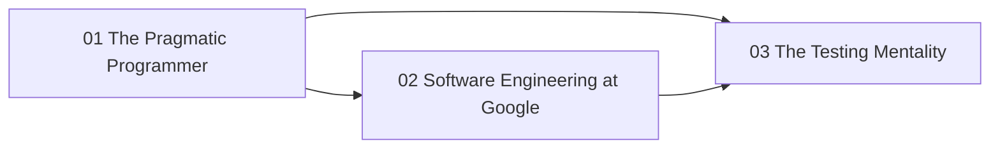

# Software Craftsmanship

The engineering practices, principles, and culture that separate senior/staff engineers from everyone else. How to write software that survives contact with reality.

> **Prerequisites**: Some professional programming experience (this is a "how to think" track, not a "how to code" track).

## Overview

- **Primary references**:
  - *The Pragmatic Programmer* by Hunt & Thomas (20th Anniversary Edition) -- individual craft
  - *Software Engineering at Google* by Winters, Manshreck, Wright -- [free online](https://abseil.io/resources/swe-book) -- organizational craft at scale
- **Supplementary**: *Clean Code* by Robert Martin, *A Philosophy of Software Design* by John Ousterhout, Martin Fowler's [Refactoring Catalog](https://refactoring.com/catalog/) (free), [SWE at Google testing chapters](https://abseil.io/resources/swe-book) (free)
- **Estimated time**: 3-4 weeks at 6-8 hrs/week

## Key Takeaways

- Good software is not about clever code -- it's about managing complexity over time.
- The Pragmatic Programmer teaches individual craft; SWE at Google teaches organizational craft at scale.
- **Testing is a practice, not a phase** -- the discipline of treating tests (and docs and diagrams) as first-class, executable specifications.
- Staff+ engineers are distinguished by judgment calls about trade-offs, not raw coding ability.

## How to Study

- Read one chapter per day from each book -- they complement each other perfectly.
- After each chapter, identify one thing you can apply to your current project.
- The Pragmatic Programmer is best read cover-to-cover; SWE at Google can be read selectively.

## Prerequisite Graph

## Topics

| # | Topic | Primary Reference | Time |
|---|-------|------------------|------|
| 01 | [The Pragmatic Programmer](01-pragmatic-programmer/) | *The Pragmatic Programmer* (Hunt & Thomas) | 1.5-2 weeks |
| 02 | [Software Engineering at Google](02-swe-at-google/) | [*SWE at Google*](https://abseil.io/resources/swe-book) (free) | 1.5-2 weeks |
| 03 | [The Testing Mentality](03-testing-mentality/) | [*SWE at Google* testing chapters](https://abseil.io/resources/swe-book) (free) + [Testing on the Toilet](https://testing.googleblog.com/) (free) | 1 week |

## Quick Start

1. **Want individual craft?** Start with 01 -- DRY, orthogonality, reversibility, design by contract.
2. **Leading a team or codebase?** 02 -- code review, Hyrum's Law, deprecation budgets, CI as leverage.
3. **Tests always feel like a chore?** 03 reframes testing as a *mentality* applied to code, infra, data, docs, and diagrams.
4. **Want the artifacts these principles produce?** Pair with [Diagramming & Documentation](../diagramming-and-documentation/) and [Infrastructure](../infrastructure/).

See [Study Plan](../STUDY-PLAN.md) for the schedule.
